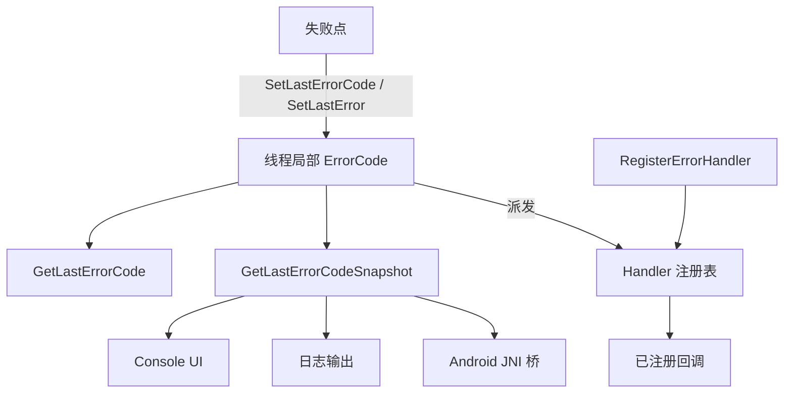
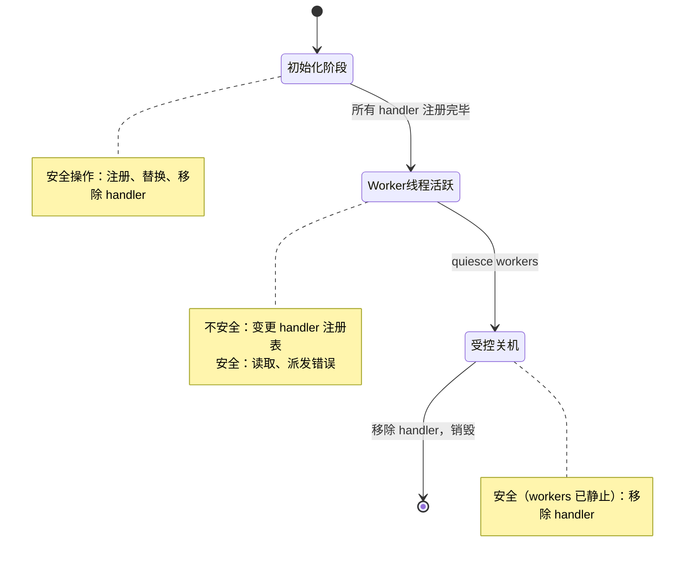
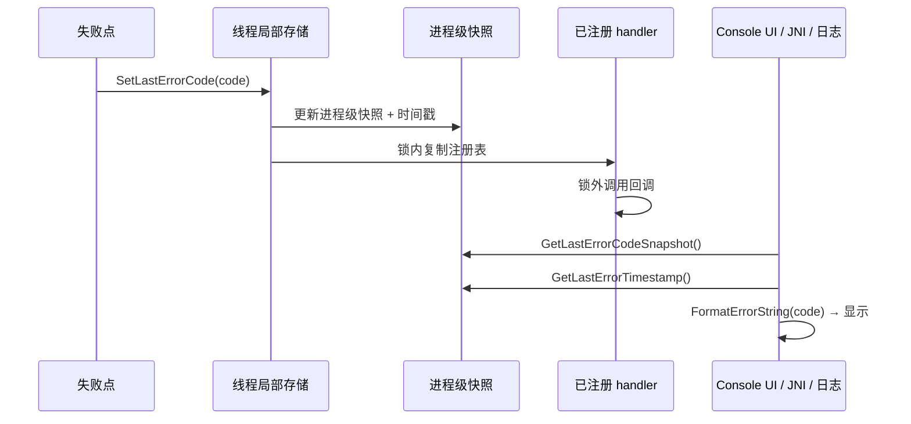

# 错误处理 API

[English Version](ERROR_HANDLING_API.md)

## 范围

本文定义 OPENPPP2 启动/运行路径与运维展示面共同使用的诊断错误 API 契约。

API 实现位于：
- `ppp/diagnostics/Error.h`
- `ppp/diagnostics/ErrorHandler.h`
- `ppp/diagnostics/Error.cpp`
- `ppp/diagnostics/ErrorHandler.cpp`

---

## 架构全景



设计遵循单一事实源原则：每个失败路径只设置一次诊断，所有展示层从同一快照读取。

---

## 核心 API 面

### 主要 Setter 函数

#### `SetLastErrorCode`

```cpp
/**
 * @brief 设置线程局部最后一个错误码。
 * @param code  要记录的 ErrorCode 值。
 * @note  同时更新进程级快照和时间戳。
 *        向所有已注册的错误 handler 派发。
 */
void SetLastErrorCode(ppp::diagnostics::ErrorCode code) noexcept;
```

这是记录失败的主要入口点。
在返回任何失败哨兵值（`false`、`-1`、`NULLPTR`）之前调用它。

#### `SetLastError`（重载版本）

```cpp
/**
 * @brief 设置错误码并返回 bool 失败值。
 * @param code   要记录的 ErrorCode。
 * @param result 要返回的值（通常是 false）。
 * @return       result 的值不变地透传。
 */
bool SetLastError(ppp::diagnostics::ErrorCode code, bool result) noexcept;

/**
 * @brief 设置错误码并返回整数失败值。
 * @param code   要记录的 ErrorCode。
 * @param result 要返回的整数值（通常是 -1）。
 * @return       result 的值不变地透传。
 */
int SetLastError(ppp::diagnostics::ErrorCode code, int result) noexcept;

/**
 * @brief 设置错误码并返回指针失败值。
 * @param code   要记录的 ErrorCode。
 * @param result 要返回的指针值（通常是 NULLPTR）。
 * @return       result 的值不变地透传。
 */
void* SetLastError(ppp::diagnostics::ErrorCode code, void* result) noexcept;
```

这些辅助函数让调用者可以把错误设置和 return 合并成一行：

```cpp
return SetLastError(ErrorCode::SocketBindFailed, false);
```

---

### Getter 函数

#### `GetLastErrorCode`

```cpp
/**
 * @brief 获取当前线程局部错误码。
 * @return 本线程最近一次设置的 ErrorCode。
 * @note  如果尚未设置过错误，返回 ErrorCode::None。
 */
ppp::diagnostics::ErrorCode GetLastErrorCode() noexcept;
```

#### `GetLastErrorCodeSnapshot`

```cpp
/**
 * @brief 获取进程级最近一次错误码快照。
 * @return 所有线程中最近一次 SetLastErrorCode 调用的 ErrorCode。
 * @note  这是一个快照，可能被并发线程覆盖。
 */
ppp::diagnostics::ErrorCode GetLastErrorCodeSnapshot() noexcept;
```

#### `GetLastErrorTimestamp`

```cpp
/**
 * @brief 获取进程级最近一次错误的时间戳。
 * @return 最后一次 SetLastErrorCode 调用时的 Unix 时间戳（秒）。
 */
int64_t GetLastErrorTimestamp() noexcept;
```

---

### 格式化函数

#### `FormatErrorString`

```cpp
/**
 * @brief 将 ErrorCode 格式化为人类可读字符串。
 * @param code  要格式化的 ErrorCode。
 * @return      该错误码的描述字符串。
 */
ppp::string FormatErrorString(ppp::diagnostics::ErrorCode code) noexcept;
```

由 Console UI 和日志面用于将错误码转换为可显示文本。

---

## Handler 注册

### `RegisterErrorHandler`

```cpp
/**
 * @brief 注册或替换一个错误通知 handler。
 * @param key     标识此注册槽的唯一字符串。
 * @param handler 接收 ErrorCode 整数形式的回调函数。
 *                传入空函数可移除该 key 对应的 handler。
 * @note  key-based 设计：对已有 key 重新注册会替换旧 handler。
 * @note  注册仅适用于初始化/卸载阶段。
 *        不要在 worker 线程活跃时从热路径调用。
 */
void RegisterErrorHandler(
    const ppp::string& key,
    const ppp::function<void(int err)>& handler) noexcept;
```

### Handler 派发契约

当调用 `SetLastErrorCode` 时：

1. 线程局部 ErrorCode 被更新。
2. 进程级快照被更新。
3. handler 注册表在**锁内被复制**。
4. handler 在**锁外被调用**。

这保证了：
- 派发和注册之间不会死锁。
- handler 看到一致的状态。
- 慢 handler 不会阻塞其他线程设置错误。

---

## 注册阶段线程安全边界



注册变更是生命周期管理操作，不是热路径控制手段。

---

## 诊断覆盖策略

所有运维代码中的失败分支在返回失败哨兵值前必须设置诊断。

### 必须覆盖的点

| 类别 | 必须执行的操作 |
|------|--------------|
| 启动失败 | 返回 `false` 前调用 `SetLastErrorCode(...)` |
| 环境准备失败 | 失败分支中调用 `SetLastErrorCode(...)` |
| 传输打开/重连失败 | 失败分支中调用 `SetLastErrorCode(...)` |
| 会话握手失败 | 返回前调用 `SetLastErrorCode(...)` |
| 回滚失败 | 即使继续 best-effort 回滚也必须调用 `SetLastErrorCode(...)` |
| 新增失败分支 | 不能只依赖泛化兜底消息 |

### 覆盖示例

```cpp
bool VEthernetNetworkSwitcher::Open() noexcept {
    // ... 尝试打开虚拟适配器 ...
    if (!adapter_opened) {
        return SetLastError(ErrorCode::TapOpenFailed, false);  // 正确
    }

    if (!route_applied) {
        return SetLastError(ErrorCode::RouteAddFailed, false);  // 正确
    }

    return true;
}
```

反例（覆盖不完整）：

```cpp
bool SomeFunction() noexcept {
    if (!DoSomething()) {
        return false;  // 错误：未设置诊断
    }
    return true;
}
```

---

## 错误传播模型



诊断链路保持单一事实源：
- 后端（C++ 运行时）设置 `ErrorCode`。
- 所有展示层（Console UI、日志、JNI）读取快照。
- 桥接层（Android JNI）保持语义映射，避免引入并行错误体系。

### C 子系统桥接（SYSNAT）

对返回整型错误码的 C 模块（例如 `linux/ppp/tap/openppp2_sysnat.c`），应在 C/C++ 边界做显式桥接映射：

- 将每个 C 侧 `ERR_*` 映射到一个 `ppp::diagnostics::ErrorCode`
- 仅在失败分支发布诊断
- C 返回码继续用于局部流程控制，`ErrorCode` 统一用于全局诊断展示面

示例（`linux/ppp/tap/openppp2_sysnat.h` + `ppp/ethernet/VNetstack.cpp`）：

```cpp
int status = openppp2_sysnat_attach(interface_name.data());
if (0 != status) {
    openppp2_sysnat_publish_error(status);
    return false;
}
```

---

## Android JNI 集成

`android/` 中的 Android JNI 桥将 `ErrorCode` 值映射为 Java 可见整数错误码。

契约：
- JNI 错误整数应尽量映射到核心 `ErrorCode` 值。
- `run` / `stop` / `release` 转换在本地/托管边界上保持一致的错误含义。
- Android 桥接错误是同一诊断管线的一部分，不是独立的排障体系。

映射示例：

```cpp
// android/src/main/cpp/bridge.cpp
jint openppp2_run(...) {
    if (!app.Run()) {
        return static_cast<jint>(ppp::diagnostics::GetLastErrorCode());
    }
    return 0;
}
```

---

## 错误码参考

与错误处理 API 相关的主要 `ppp::diagnostics::ErrorCode` 值：

| ErrorCode | 值 | 描述 |
|-----------|-----|------|
| `None` | 0 | 无错误 |
| `Unspecified` | 1 | 未指定错误 |
| `InvalidConfiguration` | 100 | 配置加载或验证失败 |
| `PrivilegeInsufficient` | 101 | OS 权限不足 |
| `DuplicateInstance` | 102 | 另一个实例已在运行 |
| `TapOpenFailed` | 200 | 虚拟适配器打开失败 |
| `RouteAddFailed` | 201 | 路由表修改失败 |
| `DnsConfigFailed` | 202 | DNS 配置失败 |
| `SocketBindFailed` | 300 | Socket 绑定操作失败 |
| `HandshakeFailed` | 400 | 传输握手未完成 |
| `HandshakeTimeout` | 401 | 握手超时 |
| `AuthenticationFailed` | 402 | 认证被拒绝 |
| `ManagedServerConnectionFailed` | 10200 | 无法连接管理后端 |
| `ManagedServerAuthenticationFailed` | 10201 | 后端拒绝认证 |
| `ManagedServerQuotaExceeded` | 10202 | 用户额度耗尽 |

完整枚举定义参见 `ppp/diagnostics/Error.h`。

---

## 使用示例

### 基本失败路径

```cpp
#include "ppp/diagnostics/Error.h"

bool OpenSocket(const IPEndPoint& endpoint) noexcept {
    int fd = ::socket(AF_INET, SOCK_STREAM, 0);
    if (fd < 0) {
        return SetLastError(ErrorCode::SocketCreateFailed, false);
    }

    if (::bind(fd, ...) < 0) {
        ::close(fd);
        return SetLastError(ErrorCode::SocketBindFailed, false);
    }

    return true;
}
```

### 在启动时注册错误 handler

```cpp
#include "ppp/diagnostics/ErrorHandler.h"

void InitDiagnostics() {
    RegisterErrorHandler("console-ui", [](int err) {
        auto code = static_cast<ppp::diagnostics::ErrorCode>(err);
        ppp::string msg = FormatErrorString(code);
        ConsoleUI::Instance().ShowError(msg);
    });

    RegisterErrorHandler("log-sink", [](int err) {
        // 写入结构化日志
        WriteLog("error", err);
    });
}
```

### 在展示层读取诊断

```cpp
void DisplayStatus() {
    auto code      = GetLastErrorCodeSnapshot();
    auto timestamp = GetLastErrorTimestamp();
    auto message   = FormatErrorString(code);

    printf("[%lld] 最后错误: %s (%d)\n",
           (long long)timestamp,
           message.c_str(),
           static_cast<int>(code));
}
```

### 在关机时移除 handler

```cpp
void ShutdownDiagnostics() {
    // 传入空函数以移除该注册槽
    RegisterErrorHandler("console-ui", nullptr);
    RegisterErrorHandler("log-sink",   nullptr);
}
```

---

## 实现说明

- `ErrorCode` 的线程局部存储避免了 worker 线程之间的竞争。
- 进程级快照使用 `std::atomic` 操作实现无锁读取。
- handler 派发在 `std::mutex` 内复制注册表，然后在锁外调用。
  这防止了 handler 在重入错误调用时死锁。
- `FormatErrorString` 返回静态或池分配的字符串，可以在信号 handler 中安全调用。

---

## 运维检查清单

添加新失败分支时：

- [ ] 在返回失败值前调用 `SetLastErrorCode(...)` 或 `SetLastError(...)`。
- [ ] 选择最具体的 `ErrorCode`，不要默认用 `Unspecified`。
- [ ] 如果没有合适的码，在 `ppp/diagnostics/Error.h` 中添加，并加上清晰注释。
- [ ] 验证新码在 `FormatErrorString` 中有有意义的消息。
- [ ] 如果新增了错误码，同步更新 `ERROR_CODES.md` 和 `ERROR_CODES_CN.md`。

入口兜底约束：

- [ ] 在 `main.cpp` 中，当 `Run()` 失败且线程本地错误仍为 `Success` 时，先设置一个非成功兜底码（`GenericUnknown`）再打印。

---

## 相关文档

- [`ERROR_CODES_CN.md`](ERROR_CODES_CN.md)
- [`DIAGNOSTICS_ERROR_SYSTEM_CN.md`](DIAGNOSTICS_ERROR_SYSTEM_CN.md)
- [`OPERATIONS_CN.md`](OPERATIONS_CN.md)
- [`STARTUP_AND_LIFECYCLE_CN.md`](STARTUP_AND_LIFECYCLE_CN.md)
