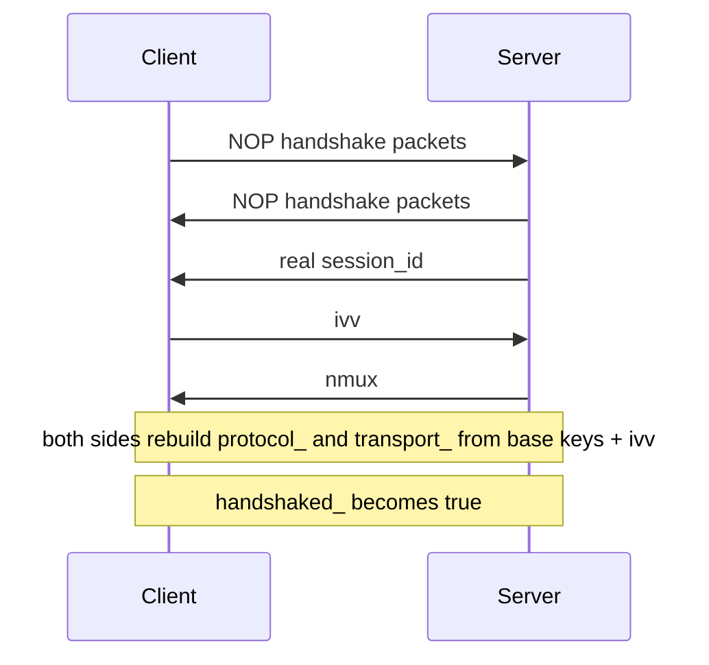
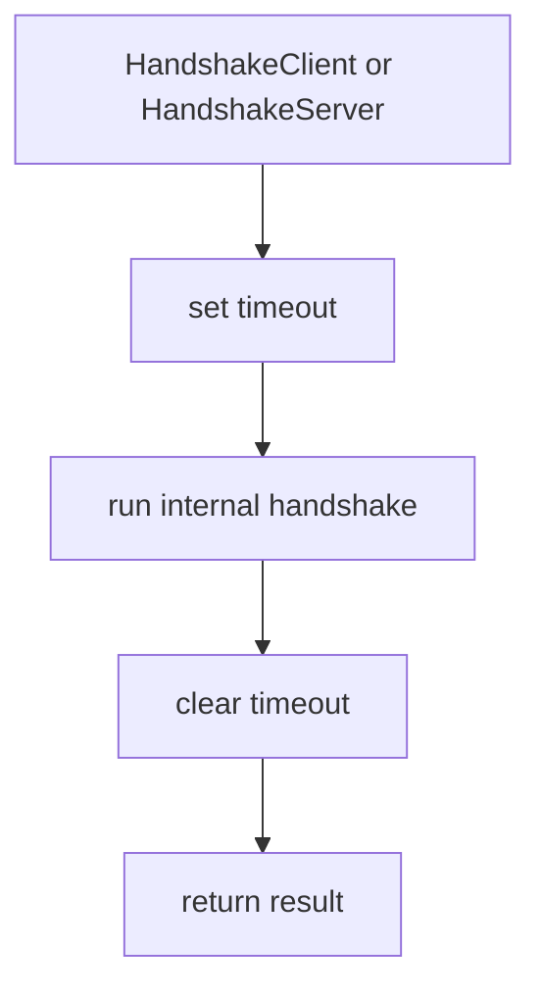

# Handshake Sequence And Session Establishment

[中文版本](HANDSHAKE_SEQUENCE_CN.md)

## Scope

This document focuses on the handshake implemented in `ppp/transmissions/ITransmission.cpp`. It explains the exact sequence, the role of dummy packets, the ordering of `session_id`, `ivv`, and `nmux`, and what state changes occur on each side.

## Why This Handshake Deserves Its Own Document

OPENPPP2 does not use a minimal “hello, here is my identifier, now switch to stream mode” exchange. The handshake performs several jobs at once:

- traffic-shaping prelude through NOP packets
- delivery of the real `session_id`
- exchange of `ivv` used for connection-level working-key derivation
- delivery of `nmux` and its low-bit mux flag
- transition of the transmission object from pre-handshake to post-handshake state

Because of that, the handshake is a structural part of the security and traffic-shape model, not a tiny preface.

## Primary Functions

The key functions are:

- `Transmission_Handshake_Pack_SessionId(...)`
- `Transmission_Handshake_Unpack_SessionId(...)`
- `Transmission_Handshake_SessionId(...)` send overload
- `Transmission_Handshake_SessionId(...)` receive overload
- `Transmission_Handshake_Nop(...)`
- `ITransmission::InternalHandshakeClient(...)`
- `ITransmission::InternalHandshakeServer(...)`
- `ITransmission::InternalHandshakeTimeoutSet(...)`
- `ITransmission::InternalHandshakeTimeoutClear(...)`

## Full Sequence

The logical flow visible from the code is:

When read against the actual function bodies, the ordering is asymmetric in code flow but equivalent in effect.

### Client side code order

`InternalHandshakeClient(...)` does:

1. `Transmission_Handshake_Nop(...)`
2. receive `sid`
3. generate `ivv`
4. send `ivv`
5. receive `nmux`
6. set `handshaked_ = true`
7. derive mux flag from `nmux & 1`
8. rebuild cipher state using `ivv`

### Server side code order

`InternalHandshakeServer(...)` does:

1. `Transmission_Handshake_Nop(...)`
2. send real `session_id`
3. generate randomized `nmux`
4. force `nmux` low bit to reflect mux state
5. send `nmux`
6. receive `ivv`
7. set `handshaked_ = true`
8. rebuild cipher state using `ivv`

## Handshake Timeout Wrapper

Both public entry points wrap the internal handshake inside timeout setup and cleanup:

- `HandshakeClient(...)`
- `HandshakeServer(...)`

This means a transmission object only stays in the uncertain handshake state for a bounded interval.

If the timer expires first, the transmission is disposed.

## What NOP Really Means Here

The name NOP might make the handshake sound trivial. It is not trivial in runtime effect.

`Transmission_Handshake_Nop(...)` computes a number of rounds from `key.kl` and `key.kh`, then sends session-id packets with value `0`. Those zero-valued packets are not true session identifiers. They are encoded by the packer as dummy packets, which the receiver recognizes by the high bit in the first random byte.

So the actual effect is:

- the line-rate handshake prelude contains packets
- those packets are syntactically valid handshake objects
- but they are semantically disposable noise

That is very different from “send no-op bytes with no structure.”

## Session-Id Packet Construction

`Transmission_Handshake_Pack_SessionId(...)` builds a string payload and then transforms it.

The behavior splits into two paths.

### Real packet path

If `session_id` is non-zero:

- first byte is random in `0x00..0x7f`
- this means the high bit is clear
- the integer string of the real value becomes the core payload

### Dummy packet path

If `session_id` is zero:

- first byte is random in `0x80..0xff`
- this means the high bit is set
- a random `Int128`-like value is converted to string instead

Then both paths add:

- three more random non-zero bytes
- a separator character
- optional random padding influenced by `key.kx`
- another slash when the configured max-padding branch is reached
- further random printable characters

Finally, the code XOR-transforms the payload repeatedly using a rolling `kf` that incorporates each of the four prefix bytes.

This means a handshake item is not sent as plain text decimal digits even before later transport framing gets involved.

## Session-Id Packet Parsing

`Transmission_Handshake_Unpack_SessionId(...)` reverses the process.

1. basic length check
2. inspect the first byte
3. if the high bit is set, mark `eagin = true` and ignore the item as dummy
4. otherwise copy the four prefix bytes into `kfs`
5. walk the payload, reversing the rolling XOR process
6. parse the resulting bytes as a decimal `Int128`

The receive overload of `Transmission_Handshake_SessionId(...)` loops until it gets a non-dummy packet.

That is why the NOP prelude works naturally. The receiver is already designed to keep consuming until a real control value appears.

## `ivv` Exchange

The client generates `ivv` using a GUID-derived `Int128` and sends it as if it were another session-id-style handshake item.

This is elegant in implementation terms because the same pack/unpack machinery handles:

- dummy packets
- session id
- `ivv`
- `nmux`

The handshake does not need a separate binary frame grammar for each of those logical values.

## `nmux` Semantics

The server generates randomized 128-bit `nmux`, then adjusts it so that the low bit matches the mux state.

- if mux is enabled, `nmux` is made odd
- if mux is disabled, `nmux` is made even

The client later checks:

- `mux = (nmux & 1) != 0`

So `nmux` is not only random filler. Its low bit carries the mux capability signal while the rest of the value remains random-looking.

## Cipher Rebuild Point

The handshake does not rebuild ciphers at the beginning. It waits until the logical handshake values are complete enough.

### Client side rebuild point

The client rebuilds ciphers after:

- receiving `sid`
- sending `ivv`
- receiving `nmux`

### Server side rebuild point

The server rebuilds ciphers after:

- sending `session_id`
- sending `nmux`
- receiving `ivv`

This means both sides only switch to the connection-specific working cipher state once the key handshake values are complete.

## When `handshaked_` Flips

The flag `handshaked_` is important because it influences the later framing path. Before handshake completes:

- `safest = !handshaked_` is true
- the payload path is forced through the conservative transform behavior
- base94 may still be selected depending on configuration and state

After handshake:

- `handshaked_` becomes true
- the connection can use its rebuilt connection-specific working ciphers
- the normal post-handshake transmission path becomes available

The handshake therefore controls both cryptographic state and packet-format behavior.

## Failure Cases

The handshake fails if any of these happen:

- NOP send path fails
- session-id packet receive fails
- `sid` is zero when a real value is required
- sending `ivv` fails
- `nmux` is zero
- timeout fires before completion
- transmission gets disposed during the process

This is important because the code is intentionally strict. It does not try to partially salvage malformed or incomplete handshake states.

## Why The Order Matters

The ordering `sid`, `ivv`, `nmux` matters because each item carries different meaning.

- `sid` establishes the logical admitted session identity
- `ivv` establishes the fresh connection-specific input for working-key derivation
- `nmux` communicates mux state without requiring a separate boolean-only control record

This is a compact control exchange despite the added dummy-traffic prelude.

## Security Interpretation

From the security perspective, the handshake gives OPENPPP2 several useful properties:

- not every early handshake packet is semantically meaningful
- the control values are not transmitted as plain untouched integers
- each connection can derive new working cipher state from fresh `ivv`
- half-complete handshakes are timed out and destroyed
- mux state is embedded without a trivial one-byte flag packet

Again, this should be described honestly. It is a connection-specific, traffic-shaped handshake with dynamic working-key derivation. That is already substantial. There is no need to exaggerate beyond the code.

## Reading Notes For Developers

When stepping through the code, watch these variables closely:

- `handshaked_`
- `frame_rn_`
- `frame_tn_`
- `protocol_`
- `transport_`
- `timeout_`
- `ivv`
- `nmux`

Those variables connect the handshake layer to the later framing layer.

## Related Documents

- [`TRANSMISSION.md`](TRANSMISSION.md)
- [`PACKET_FORMATS.md`](PACKET_FORMATS.md)
- [`SECURITY.md`](SECURITY.md)
