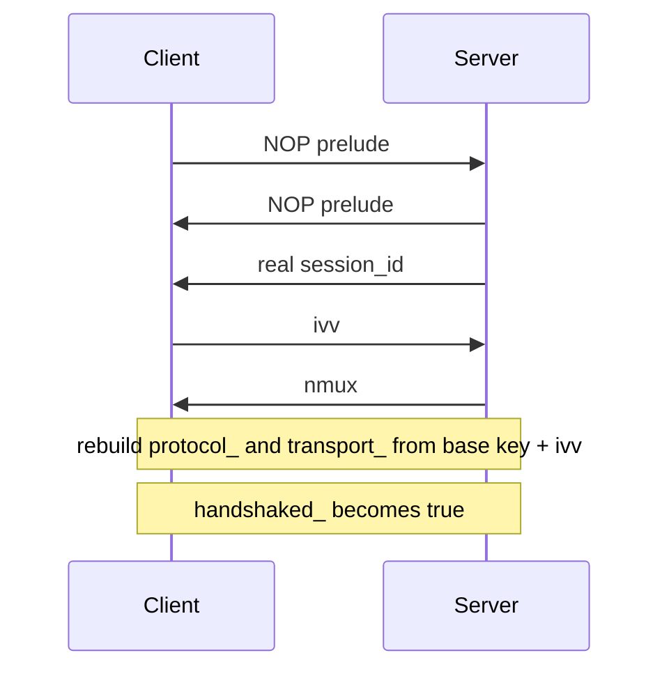
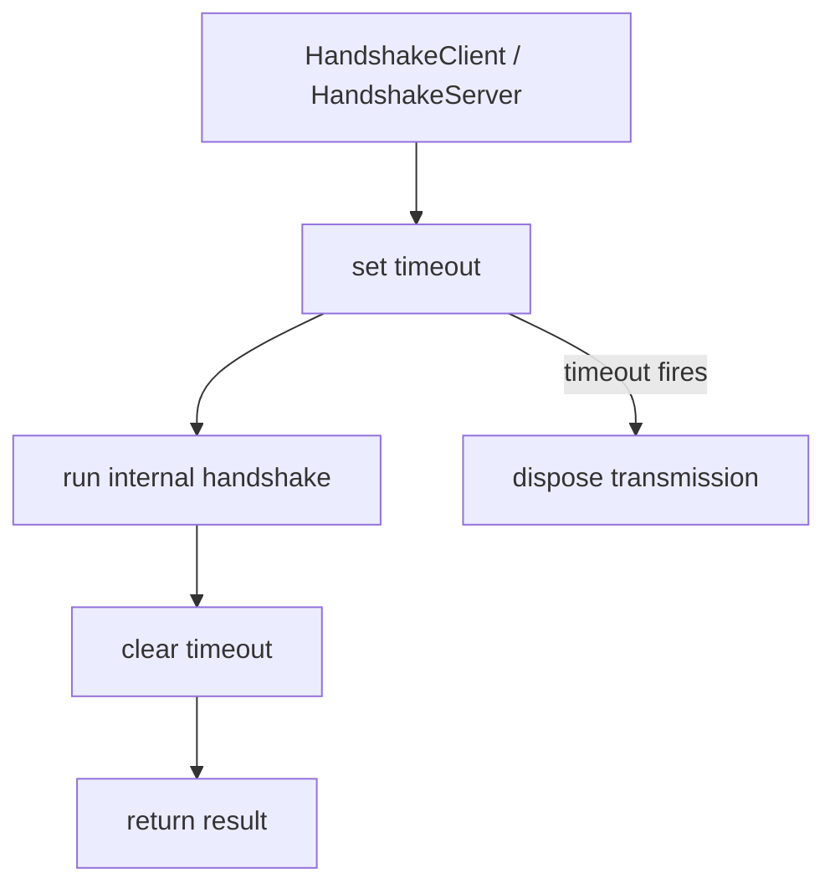

# Handshake Sequence And Session Establishment

[中文版本](HANDSHAKE_SEQUENCE_CN.md)

## Scope

This document focuses on the handshake logic implemented in `ppp/transmissions/ITransmission.cpp`. It explains the actual sequence, the role of dummy packets, the order of `session_id`, `ivv`, and `nmux`, and the state transitions before and after handshake success.

## Why This Handshake Exists

OPENPPP2 does more than a minimal hello exchange. The handshake also:

- creates a traffic-shaped NOP prelude
- delivers the real `session_id`
- exchanges the `ivv` input used for connection-specific working-key derivation
- delivers `nmux` with an embedded mux flag
- flips the transmission object from pre-handshake to post-handshake state

## Core Functions

| Function | Role |
|----------|------|
| `Transmission_Handshake_Pack_SessionId(...)` | Build session-id style packets |
| `Transmission_Handshake_Unpack_SessionId(...)` | Reverse the packing and detect dummy packets |
| `Transmission_Handshake_SessionId(...)` | Send or receive logical session-id style values |
| `Transmission_Handshake_Nop(...)` | Send the configurable dummy prelude |
| `ITransmission::InternalHandshakeClient(...)` | Client-side handshake orchestration |
| `ITransmission::InternalHandshakeServer(...)` | Server-side handshake orchestration |
| `ITransmission::InternalHandshakeTimeoutSet(...)` | Arm handshake timeout |
| `ITransmission::InternalHandshakeTimeoutClear(...)` | Clear handshake timeout |

## Full Sequence

The code is slightly asymmetric between client and server, but the logical exchange is the same.

## Client Order

`InternalHandshakeClient(...)` performs:

1. `Transmission_Handshake_Nop(...)`
2. receive `sid`
3. generate `ivv`
4. send `ivv`
5. receive `nmux`
6. set `handshaked_ = true`
7. extract mux flag from `nmux & 1`
8. rebuild cipher state using `ivv`

## Server Order

`InternalHandshakeServer(...)` performs:

1. `Transmission_Handshake_Nop(...)`
2. send real `session_id`
3. generate random `nmux`
4. force the low bit to reflect mux state
5. send `nmux`
6. receive `ivv`
7. set `handshaked_ = true`
8. rebuild cipher state using `ivv`

## Timeout Wrapper

Both public entry points wrap the internal handshake in timeout setup and cleanup.

If the timer fires first, the transmission is disposed.

## What NOP Means Here

`Transmission_Handshake_Nop(...)` is not empty traffic. It computes a number of rounds from `key.kl` and `key.kh`, then sends session-id style packets with value `0`.

Those packets are syntactically valid handshake objects, but semantically disposable. The receiver recognizes them as dummy packets because the high bit of the first byte is set.

## Session-Id Packet Construction

`Transmission_Handshake_Pack_SessionId(...)` builds a string payload and then transforms it.

### Real Packet Path

If `session_id` is non-zero:

- the first byte is random in `0x00..0x7f`
- the high bit is clear
- the integer value becomes the core payload string

### Dummy Packet Path

If `session_id == 0`:

- the first byte is random in `0x80..0xff`
- the high bit is set
- the core integer string is replaced with a random Int128-like value

### Common Processing

Both paths then add:

- three additional random non-zero bytes
- a separator character
- optional random padding influenced by `key.kx`
- more printable random characters

Then the payload is transformed using the prefix bytes as rolling key feedback.

## Session-Id Packet Parsing

`Transmission_Handshake_Unpack_SessionId(...)` reverses the process.

1. check minimum length
2. inspect the first byte
3. if the high bit is set, mark dummy and ignore it
4. otherwise extract the four prefix bytes
5. reverse the rolling XOR transformation
6. parse the result as decimal `Int128`

The receive overload loops until it gets a real packet.

## `ivv` Exchange

The client generates a new `Int128` `ivv` from a GUID-derived value and sends it through the same packet machinery.

That means the same encoder handles four logical values:

- dummy packets
- `session_id`
- `ivv`
- `nmux`

## `nmux` Semantics

The server generates a random 128-bit `nmux`, then adjusts its low bit to reflect mux state:

- mux enabled means odd `nmux`
- mux disabled means even `nmux`

The client reads `mux = (nmux & 1) != 0`.

## When Ciphers Are Rebuilt

Ciphers are rebuilt only after the key values are complete enough.

### Client Rebuild Point

The client rebuilds after:

1. receiving `sid`
2. sending `ivv`
3. receiving `nmux`

### Server Rebuild Point

The server rebuilds after:

1. sending `session_id`
2. sending `nmux`
3. receiving `ivv`

That is when the connection moves into working-cipher state.

## When `handshaked_` Flips

Before handshake completion:

- `safest = !handshaked_` is true
- the conservative transform path is used
- base94 may still be selected depending on configuration

After handshake completion:

- `handshaked_` becomes true
- the working cipher state is active
- the normal protected binary path becomes available

## Failure Cases

The handshake fails if any of these happen:

- NOP send fails
- session-id receive fails
- a real `sid` is required but zero is received
- `ivv` send fails
- `nmux` is zero
- timeout fires before completion
- the transmission is disposed mid-handshake

## Why Order Matters

The order `sid -> ivv -> nmux` is not arbitrary.

| Value | Purpose |
|-------|---------|
| `sid` | Establish logical session identity |
| `ivv` | Provide fresh input for working-key derivation |
| `nmux` | Carry mux state without a trivial boolean packet |

This gives a compact control exchange that still covers identity, key input, and configuration state.

## Security Interpretation

The handshake provides:

- dummy traffic for shaping
- transformed control values
- per-connection dynamic working keys
- timeout-bounded handshake state
- embedded mux state instead of a trivial flag packet

The honest wording is important: this is strong connection-specific shaping and key diversification, not an excuse to overclaim formal properties not shown in code.

## Reading Notes For Developers

Watch these variables when stepping through code:

- `handshaked_`
- `frame_rn_`
- `frame_tn_`
- `protocol_`
- `transport_`
- `timeout_`
- `ivv`
- `nmux`

They connect handshake state to later framing behavior.
