# Handshake Sequence And Session Establishment

[中文版本](HANDSHAKE_SEQUENCE_CN.md)

## Scope

This document focuses on the handshake logic implemented in `ppp/transmissions/ITransmission.cpp`. It explains the actual sequence, the role of dummy packets, the order of `session_id`, `ivv`, and `nmux`, the state transitions before and after handshake success, the timeout wrapper, cipher rebuild timing, failure conditions, and the security model of the handshake.

Audience: developers who need to understand exactly what happens during session setup, security reviewers, and engineers debugging handshake failures.

---

## Why This Handshake Exists

OPENPPP2 does more than a minimal hello exchange. The handshake simultaneously:

- Creates a traffic-shaped NOP prelude (traffic obfuscation)
- Delivers the real `session_id` (logical session identity)
- Exchanges the `ivv` input used for per-connection working-key derivation
- Delivers `nmux` with an embedded mux flag (multiplexing configuration)
- Flips the transmission object from pre-handshake to post-handshake cipher state

The key point is that the handshake is both a **control exchange** and a **traffic-shaping exchange**. No separate control packets are needed for mux configuration or key negotiation; all control data is embedded in the same packet family.

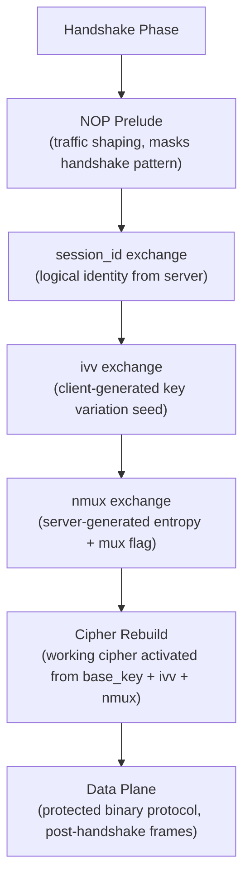

---

## Code Anchors

| Function | File | Role |
|----------|------|------|
| `Transmission_Handshake_Pack_SessionId(...)` | `ITransmission.cpp` | Build session-id style packets (dummy + real) |
| `Transmission_Handshake_Unpack_SessionId(...)` | `ITransmission.cpp` | Reverse packing and detect dummy packets |
| `Transmission_Handshake_SessionId(...)` | `ITransmission.cpp` | Send or receive logical session-id values |
| `Transmission_Handshake_Nop(...)` | `ITransmission.cpp` | Send the configurable dummy prelude |
| `ITransmission::InternalHandshakeClient(...)` | `ITransmission.cpp` | Client-side handshake orchestration |
| `ITransmission::InternalHandshakeServer(...)` | `ITransmission.cpp` | Server-side handshake orchestration |
| `ITransmission::InternalHandshakeTimeoutSet(...)` | `ITransmission.cpp` | Arm handshake timeout |
| `ITransmission::InternalHandshakeTimeoutClear(...)` | `ITransmission.cpp` | Clear handshake timeout |
| `ITransmission::HandshakeClient(...)` | `ITransmission.cpp` | Public client entry: timeout wrap + InternalHandshakeClient |
| `ITransmission::HandshakeServer(...)` | `ITransmission.cpp` | Public server entry: timeout wrap + InternalHandshakeServer |

---

## Full Handshake Sequence

```mermaid
sequenceDiagram
    participant C as Client
    participant S as Server

    Note over C,S: Pre-handshake: base94 encoding, dummy prelude
    C->>S: NOP prelude (N dummy session-id packets, value=0)
    S->>C: NOP prelude (M dummy session-id packets, value=0)

    Note over C,S: Identity exchange phase
    S->>C: real session_id (high bit clear, carries actual session integer)
    C->>S: ivv (client-generated Int128, fresh per connection)
    S->>C: nmux (server-generated random Int128; low bit = mux enabled flag)

    Note over C,S: Both sides: rebuild protocol_ and transport_ from base key + ivv + nmux
    Note over C,S: handshaked_ = true; working cipher state active
    Note over C,S: Switch to binary protected frame family
```

The code is asymmetric in execution order, but symmetric in information exchange. Both sides end up with the same `ivv` and `nmux` values and can therefore derive identical working cipher state independently without any further negotiation.

---

## Client Handshake Order

`InternalHandshakeClient(...)` performs these steps in order:

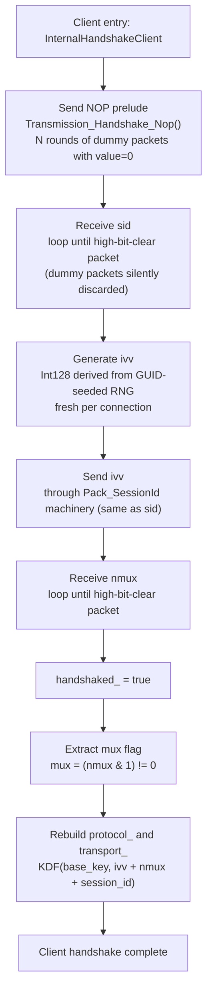

The client cannot rebuild its working keys until it has:
1. Received the server's session identity (`sid`)
2. Sent its own random input (`ivv`)
3. Received the server's mux state + randomness (`nmux`)

---

## Server Handshake Order

`InternalHandshakeServer(...)` performs these steps in order:

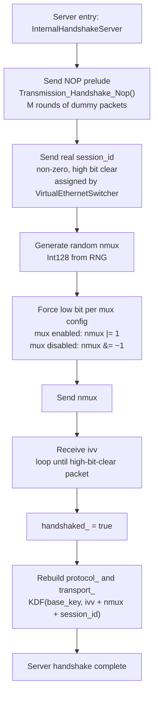

The server decides mux state and communicates it embedded in the random `nmux` value — no separate flag packet is needed.

---

## Timeout Wrapper

Both public entry points wrap the internal handshake in a timeout:

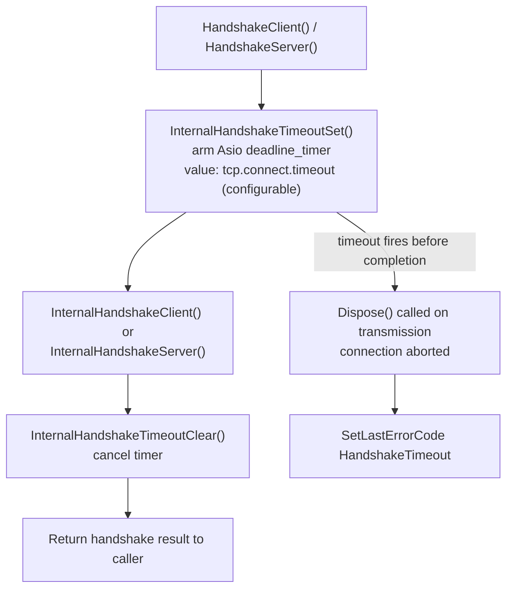

If the handshake timer fires before all steps complete, the transmission object is disposed and the connection is aborted. This prevents half-open sessions from consuming server resources indefinitely (defense against slow-handshake DoS).

Timeout source: `AppConfiguration::tcp.connect.timeout`. A reasonable value is 10–30 seconds for most deployments.

---

## What NOP Means Here

`Transmission_Handshake_Nop(...)` is not empty traffic. It computes a number of rounds from `key.kl` and `key.kh`, then sends session-id style packets with value `0`.

Those packets are syntactically valid handshake objects, but semantically disposable. The receiver recognizes them as dummy packets because the high bit of the first byte is set. The receiver loops silently discarding these packets until it sees a real one.

This means the prelude looks like real handshake traffic while carrying no logical session identity. The NOP count is deterministic from the key material (`key.kl`, `key.kh`), so both sides know how many NOPs to expect without a separate length field or a framing-layer count byte.

```mermaid
flowchart LR
    A[key.kl + key.kh] --> B[Compute NOP count\nN = f(kl, kh)]
    B --> C[Send N dummy packets\nsession_id = 0]
    C --> D[Remote: receive + discard\nuntil high bit clear]
    D --> E[Remote sees real packet\n= first real exchange value]
```

---

## Session-Id Packet Construction

`Transmission_Handshake_Pack_SessionId(...)` builds a string payload and transforms it. All four logical values (dummy packets, `session_id`, `ivv`, `nmux`) are encoded with the same function — only the `session_id` argument changes.

### Real Packet Path

If `session_id` is non-zero:
- The first byte is random in `[0x00, 0x7F]`
- The high bit is **clear** (marks this as a real packet)
- The integer value is serialized as a decimal string as the core payload

### Dummy Packet Path

If `session_id == 0`:
- The first byte is random in `[0x80, 0xFF]`
- The high bit is **set** (marks this as a dummy packet)
- The core integer string is replaced with a random `Int128`-like value

### Common Processing (Both Paths)

Both paths then:
1. Append three additional random non-zero bytes
2. Append a separator character
3. Append optional random padding influenced by `key.kx`
4. Append more printable random characters
5. Apply a rolling XOR transform using the prefix bytes as key feedback

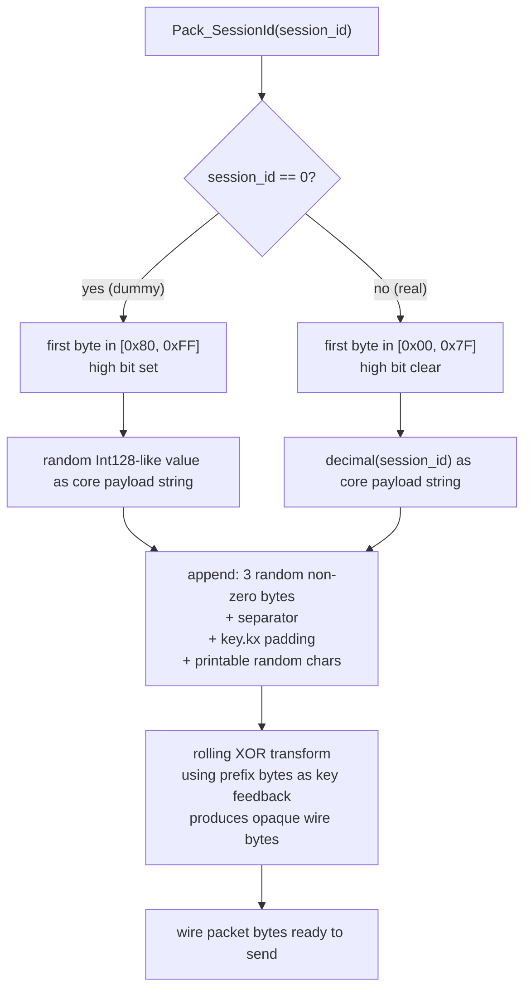

---

## Session-Id Packet Parsing

`Transmission_Handshake_Unpack_SessionId(...)` reverses the process:

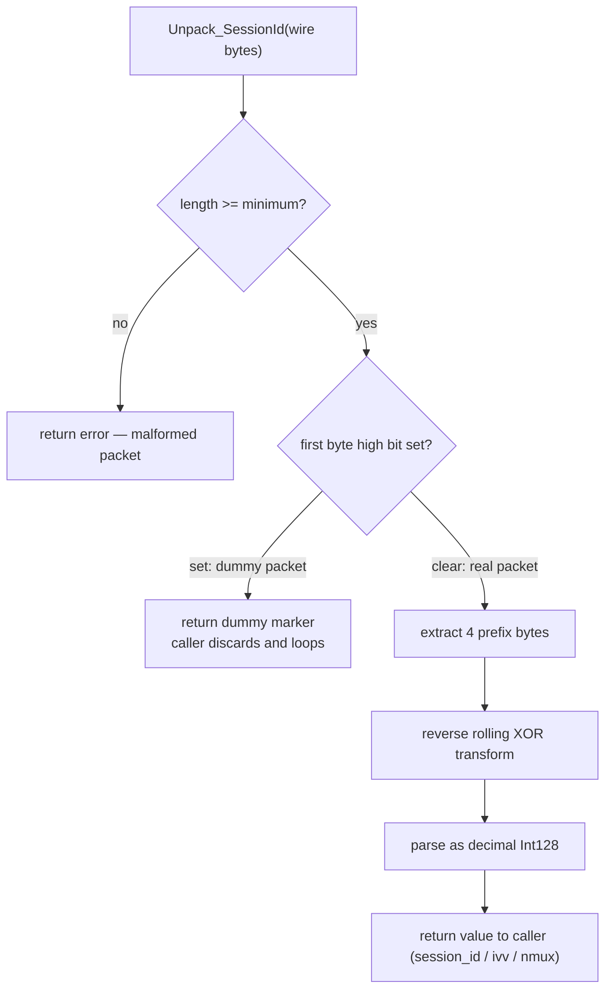

The receive loop in `InternalHandshakeClient` and `InternalHandshakeServer` calls `Unpack_SessionId` repeatedly until a real packet (high bit clear) is received. Dummy packets are silently discarded. This ensures that the varying NOP prelude counts on each side do not require any coordination beyond sharing the same key material.

---

## `ivv` Exchange

The client generates a new `Int128` `ivv` from a GUID-derived value and sends it through the same packet machinery as `session_id`. On the wire, there is no structural difference between a `session_id` packet and an `ivv` packet — both are the output of `Pack_SessionId` with a non-zero value.

This means the same encoder handles four logical values:

| Value | Sent by | Purpose |
|-------|---------|---------|
| dummy packets | both | Traffic shaping / NOP prelude |
| `session_id` | server | Establish logical session identity |
| `ivv` | client | Fresh input for working-key derivation |
| `nmux` | server | Mux state + additional randomness |

The handshake reuses one packet family to carry multiple control values, minimizing protocol surface area.

---

## `nmux` Semantics

The server generates a random 128-bit `nmux`, then adjusts its low bit:

- Mux enabled: `nmux` is **odd** (`nmux |= 1`)
- Mux disabled: `nmux` is **even** (`nmux &= ~1`)

The client reads `mux = (nmux & 1) != 0`.

The remaining 127 bits of `nmux` serve as additional entropy input to the cipher rebuild step. This means even if mux state is identical between connections, the working keys will differ.

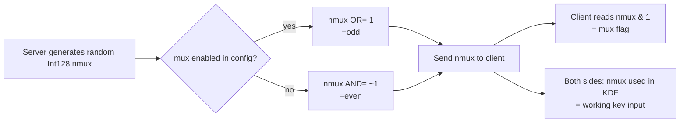

---

## When Ciphers Are Rebuilt

Ciphers are rebuilt only after all key inputs are available.

### Client Rebuild Point

The client rebuilds after having:
1. Received `sid` (logical session identity from server — verifies connection goes to intended server)
2. Sent `ivv` (client's random contribution to key material)
3. Received `nmux` (server's random contribution + mux flag)

### Server Rebuild Point

The server rebuilds after having:
1. Sent `session_id`
2. Sent `nmux`
3. Received `ivv` (client's random contribution)

Both sides then derive the same working cipher from `base_key + ivv + nmux`:

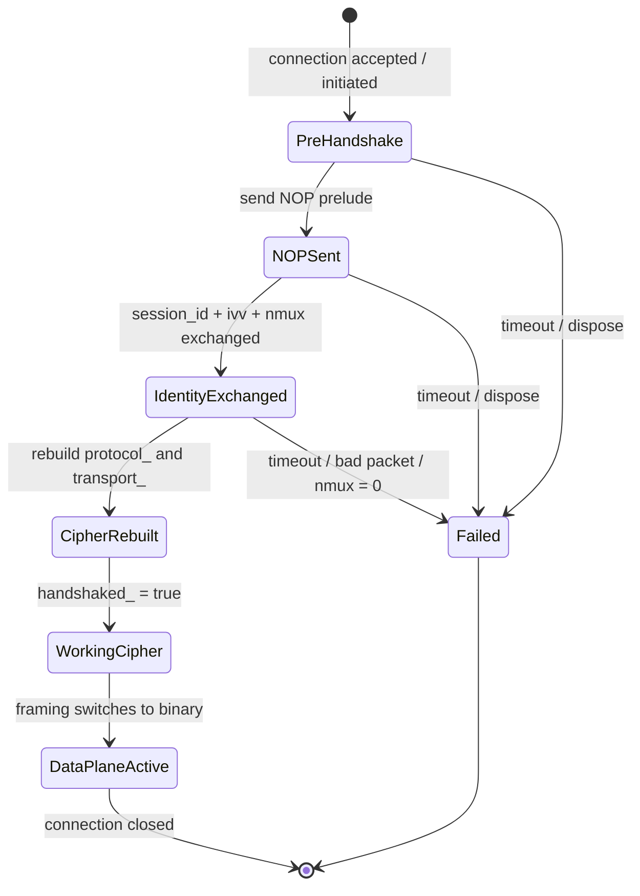

---

## When `handshaked_` Flips

Before handshake completion:
- `safest = !handshaked_` is **true**
- The conservative transform path is used
- base94 encoding may still be selected depending on configuration
- `frame_tn_` and `frame_rn_` may still be in extended-header mode (4+3 bytes)

After handshake completion:
- `handshaked_` becomes **true**
- The working cipher state is active
- The normal protected binary path becomes available (3-byte header: seed + 2 length bytes)
- `frame_rn_` and `frame_tn_` advance per the framing state machine

The transition is observable in code as the flip of `handshaked_` combined with the cipher rebuild call.

---

## Failure Cases

The handshake fails and the connection is aborted if any of these happen:

| Failure condition | Source |
|-------------------|--------|
| NOP send fails | Network error during prelude write |
| session-id receive fails | Network error or carrier close |
| A real `sid` is required but zero is received | Protocol error — server sent a dummy as the real value |
| `ivv` send fails | Network error during ivv write |
| `nmux` is zero | Server-side generation error (zero is reserved) |
| Timeout fires before completion | `InternalHandshakeTimeoutSet` timer |
| Transmission is disposed mid-handshake | Application lifecycle event (e.g., server shutdown) |
| Malformed packet fails minimum-length check | Protocol error — truncated packet received |
| Key mismatch (implicit) | Cipher state mismatch causes all subsequent reads to fail |

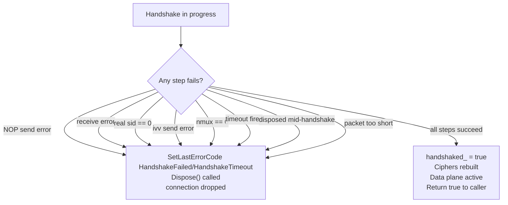

---

## Why Order Matters

`sid → ivv → nmux` is not arbitrary:

| Value | Purpose | Why at this position |
|-------|---------|---------------------|
| `sid` | Establish logical session identity | Must come first; client needs to know which session it is joining |
| `ivv` | Provide fresh input for working-key derivation | Client sends after receiving identity; contributes client randomness to cipher |
| `nmux` | Carry mux state without a trivial boolean packet | Server sends after sid; carries both flag and entropy in one packet |

This gives a compact control exchange that covers identity, key input, and configuration state in exactly three logical values — with no unnecessary round trips.

---

## Security Interpretation

The handshake provides:

- **Dummy traffic for shaping**: NOP prelude packets are syntactically indistinguishable from real handshake packets to a passive observer. The NOP count is key-derived (`key.kl`, `key.kh`) so both sides agree without transmitting the count.
- **Transformed control values**: Session-id packets are obfuscated through rolling XOR transformation using prefix bytes as feedback. They are not plaintext integers.
- **Per-connection dynamic working keys**: `ivv` (client-random) combined with `nmux` (server-random) ensures that no two connections derive the same working cipher, even from the same base key material.
- **Timeout-bounded handshake state**: The handshake timer prevents indefinitely half-open connections from consuming server resources.
- **Embedded mux state**: The mux flag is carried inside `nmux` entropy rather than as a separate trivially-identifiable boolean packet.

Honest limitations:
- The handshake does **not** provide PFS (Perfect Forward Secrecy) in the traditional DHE sense. If the base key (`key.kcp.protocol` / `key.kcp.transport`) is compromised, historical sessions can potentially be decrypted by an adversary who also captured the `ivv` and `nmux` values.
- The handshake obfuscation (`Pack_SessionId` rolling XOR) is not a cryptographic primitive — it is traffic shaping, not encryption.

---

## State Variables To Watch During Debugging

| Variable | What it represents |
|----------|--------------------|
| `handshaked_` | Whether handshake has completed and working ciphers are active |
| `frame_rn_` | Receive-side framing state (extended vs simple header) |
| `frame_tn_` | Transmit-side framing state |
| `protocol_` | Protocol cipher object (rebuilt after handshake) |
| `transport_` | Transport cipher object (rebuilt after handshake) |
| `timeout_` | Handshake timeout timer handle |
| `ivv` (local var) | Client-generated working-key input during handshake |
| `nmux` (local var) | Server-generated mux carrier value during handshake |

Common debugging mistake: inspecting `protocol_` before `handshaked_` is true. The cipher state at that point is the pre-handshake base-key state, not the final working keys.

---

## Handshake And The Transport Cipher Layers

OPENPPP2 uses two independent cipher layers:

1. **Protocol cipher** (`protocol_`) — Keyed from `guid + fsid + session_id`. This cipher is session-scoped and is derived before the handshake begins. It protects header metadata in both pre- and post-handshake frames.

2. **Transport cipher** (`transport_`) — Keyed from the handshake output. Specifically, `ivv` (from the client) and `nmux` (from the server) together with the base key material produce the transport cipher. This cipher is per-connection and is activated by the cipher rebuild step at handshake completion.

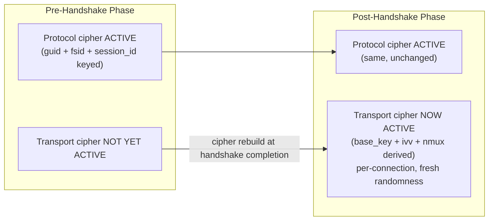

The handshake is the boundary between the two cipher states.

---

## Full Handshake State Diagram

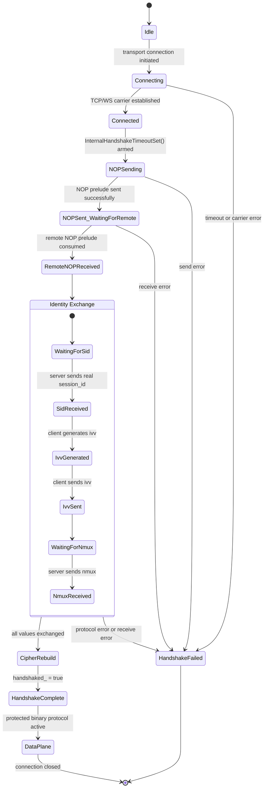

---

## Related Documents

- [`TRANSMISSION.md`](TRANSMISSION.md) — Transport layer architecture, framing, cipher internals
- [`TRANSMISSION_PACK_SESSIONID.md`](TRANSMISSION_PACK_SESSIONID.md) — Detailed session-id pack/unpack analysis
- [`PACKET_FORMATS.md`](PACKET_FORMATS.md) — Wire format of base94 and binary frames
- [`SECURITY.md`](SECURITY.md) — Security model and honest threat analysis
- [`ENGINEERING_CONCEPTS.md`](ENGINEERING_CONCEPTS.md) — YieldContext and coroutine patterns
- [`TUNNEL_DESIGN.md`](TUNNEL_DESIGN.md) — Four-layer tunnel architecture overview
- [`CONCURRENCY_MODEL.md`](CONCURRENCY_MODEL.md) — How coroutines and strands interact during handshake
