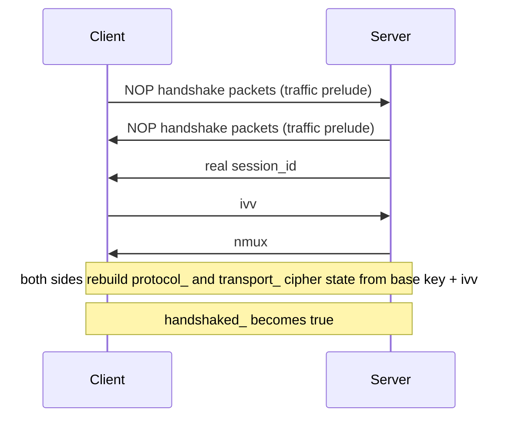
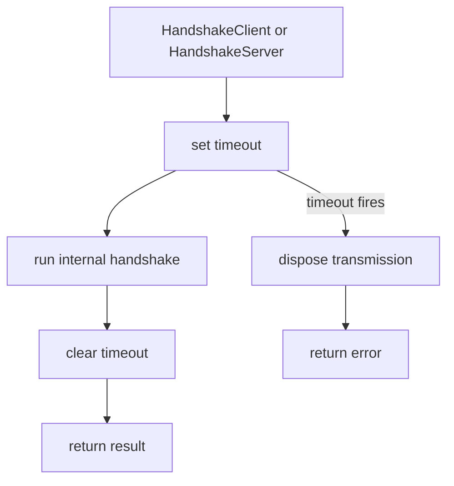

# Handshake Sequence And Session Establishment

[中文版本](HANDSHAKE_SEQUENCE_CN.md)

## Scope

This document focuses on the handshake implemented in `ppp/transmissions/ITransmission.cpp`. It explains in detail: what the exact sequence of the real handshake is, what role dummy packets play, what the ordering relationship of `session_id`, `ivv`, and `nmux` is, and what state changes occur on each side before and after the handshake succeeds.

Understanding this handshake requires looking beyond a simple "hello" message. The OPENPPP2 handshake is a multi-phase protocol that accomplishes several security and traffic-shaping objectives simultaneously. This document breaks down each phase, explains the purpose of every packet type, and shows how the handshake integrates with the broader transmission framework.

The handshake operates at the connection level, meaning it is invoked once when a new transmission channel is being established between a client and server. It is not something that repeats during normal data transfer. After handshake completion, the connection transitions to a stable state where application data can flow using the established cipher and frame configuration.

## Why This Handshake Deserves Its Own Document

OPENPPP2 does not use a minimal "hello, here is my identifier, now switch to stream mode" exchange. That kind of simple handshake works for protocols that only need to establish identity and immediately transition to streaming data. OPENPPP2's handshake is fundamentally different because it must accomplish multiple security and traffic objectives within a single connection establishment phase.

The handshake performs several jobs at once:

**Traffic-Shaping Prelude Through NOP Packets**

The handshake begins with a deliberate prelude of NOP (no-operation) packets. These are not random bytes, but properly formatted handshake packets that appear syntactically valid to observers. This creates a traffic-shaping effect where the initial exchange looks identical whether the connection succeeds or fails. An observer cannot distinguish between a handshake in progress and random traffic based solely on packet sizes and timing.

The NOP packets serve as camouflage. They make the handshake appear as noise rather than a structured protocol exchange. This is intentional from a traffic-analysis resistance perspective. The real control values are hidden within the same packet format, making it difficult for outside observers to determine when the actual control exchange begins.

**Delivery of the Real Session_id**

The `session_id` represents the logical identity of an admitted session. This is not a random identifier but a meaningful value that the server has previously accepted or allocated. The client must present this identifier to prove it has authorization for the requested session.

The `session_id` is not sent as a plain integer. It goes through the same encoding pipeline as other handshake values, making it indistinguishable from dummy traffic at the packet level. This prevents observers fromlearning the session identity through traffic analysis.

**Exchange of ivv for Connection-Level Working-Key Derivation**

The `ivv` (initialization vector value) provides fresh input for deriving connection-specific working keys. Each connection gets its own unique `ivv`, ensuring that even if the base key is compromised, individual connections remain secure.

The `ivv` is generated client-side and sent to the server. Both parties then use this value in conjunction with the pre-shared base key to derive the working cipher state. This means every connection has cryptographically distinct cipher state, even if multiple connections use the same base key.

**Delivery of nmux and Its Low-Bit Mux Flag**

The `nmux` value carries the mux (multiplexing) capability flag in its low bit. Rather than sending a separate boolean control packet, the protocol embeds this state information within a 128-bit random-looking value.

Embedding the mux flag within `nmux` serves two purposes: it avoids a trivial one-byte control packet that would be trivially identifiable, and it maintains protocol consistency where all handshake values follow the same format.

**Transition of the Transmission Object from Pre-Handshake to Post-Handshake State**

The handshake controls a fundamental state transition in the transmission object. Before handshake, the object operates in a conservative mode with reduced capabilities. After handshake, it switches to full operational mode with the working cipher and configured frame format.

This state transition is atomic. The `handshaked_` flag determines whether the transmission is in pre-handshake or post-handshake mode. This flag affects not just cipher selection but also the encoding path that payloads follow.

Because of that, the handshake is a structural part of the security and traffic-shape model, not a tiny preface that could be skipped or simplified. Every aspect serves a purpose in the overall security architecture.

## Primary Functions

The handshake involves a coordinated set of functions across multiple layers:

**Packet Construction Functions**

- `Transmission_Handshake_Pack_SessionId(...)` - Constructs session-id style packets, handling both real and dummy packet generation based on input value
- `Transmission_Handshake_Unpack_SessionId(...)` - Reverses the packing process, detecting dummy packets and extracting real values

**Send/Receive Overloads**

- `Transmission_Handshake_SessionId(...)` send overload - Sends session-id values (real or dummy) through the transmission channel
- `Transmission_Handshake_SessionId(...)` receive overload - Receives and validates session-id packets, looping until a non-dummy packet arrives

**NOP Handling**

- `Transmission_Handshake_Nop(...)` - Generates and sends a configurable number of dummy packets based on key parameters

**Internal Handshake Orchestration**

- `ITransmission::InternalHandshakeClient(...)` - Coordinates the client-side handshake sequence
- `ITransmission::InternalHandshakeServer(...)` - Coordinates the server-side handshake sequence
- `ITransmission::InternalHandshakeTimeoutSet(...)` - Arms the handshake timeout timer
- `ITransmission::InternalHandshakeTimeoutClear(...)` - Clears the handshake timeout timer

These functions work together to implement a complete handshake protocol that handles packet construction, transmission, validation, and state management.

## Full Sequence

The logical flow visible from the code is:



When read against the actual function bodies, the ordering is asymmetric in code flow but equivalent in effect. The client and server perform the same logical steps, but the implementation order differs slightly to accommodate the natural send/receive flow.

The sequence can be understood as two phases: a traffic-shaping prelude followed by the actual control exchange. The prelude appears first in time but logically serves as camouflage rather than meaningful control. The control exchange then proceeds with the server sending first (session_id), followed by the client responding (ivv), and finally the server confirming with nmux.

This three-message exchange (session_id → ivv → nmux) is the core control protocol. The NOP prelude that precedes it exists to disguise when the real control exchange begins.

### Client Side Code Order

`InternalHandshakeClient(...)` performs its operations in this sequence:

1. **Execute `Transmission_Handshake_Nop(...)`** - Sends a burst of dummy packets to establish the traffic-shaping prelude. The number of packets sent depends on the key parameters `key.kl` and `key.kh`, which control the depth of the prelude.

2. **Receive sid** - Waits for and receives the real session_id from the server. This blocks until a non-dummy packet arrives. The receive loop inherently discards any NOP packets sent by the server until the real value appears.

3. **Generate ivv** - Creates a new 128-bit initialization vector value. This is generated using a GUID-derived mechanism to ensure uniqueness. The client generates this value fresh for each handshake.

4. **Send ivv** - Sends the generated ivv to the server using the same packet format as session_id. This is the client's primary contribution to the key derivation process.

5. **Receive nmux** - Receives the multiplexed configuration value from the server. The server embeds its mux capability in the low bit of this value.

6. **Set `handshaked_ = true`** - Atomically transitions the transmission object from pre-handshake mode to post-handshake mode. This flag affects all subsequent encoding decisions.

7. **Derive mux flag from `nmux & 1`** - Extracts the mux capability indicator from the received nmux. If the low bit is set, mux is enabled; otherwise it is disabled.

8. **Rebuild cipher using ivv** - Derives the working cipher state by combining the base key with the received ivv. Both protocol_ and transport_ ciphers are rebuilt.

### Server Side Code Order

`InternalHandshakeServer(...)` performs its operations in this sequence:

1. **Execute `Transmission_Handshake_Nop(...)`** - Sends initial dummy packets as traffic camouflage. The server also has its own prelude to send before the client begins sending real control values.

2. **Send real session_id** - The server knows the legitimate session_id for this connection and sends it as the first real control message. This establishes the logical identity.

3. **Generate randomized nmux** - Creates a random 128-bit value. This value appears random to observers, preventing any inference about the mux state from the packet content.

4. **Force nmux low bit to reflect mux state** - Modifies nmux to ensure the low bit matches the current mux configuration. If mux is enabled, the low bit is forced to 1 (odd); if disabled, forced to 0 (even).

5. **Send nmux** - Sends the adjusted nmux to the client. The client will extract the mux flag from the low bit.

6. **Receive ivv** - Receives the initialization vector value from the client. This completes the key derivation input.

7. **Set `handshaked_ = true`** - Transitions to post-handshake mode. From this point, the connection uses the working cipher.

8. **Rebuild cipher using ivv** - Derives working cipher state from the base key plus the received ivv. Now both sides have the same cipher state.

## Handshake Timeout Wrapper

Both public entry points wrap the internal handshake inside timeout setup and cleanup:

- `HandshakeClient(...)` - Public client handshake entry point
- `HandshakeServer(...)` - Public server handshake entry point

This means a transmission object only stays in the uncertain handshake state for a bounded interval.



The timeout mechanism serves several purposes:

**Preventing Stuck Connections**

If the remote peer fails to respond, the handshake should not block indefinitely. The timeout ensures that failed handshakes are detected and cleaned up within a reasonable window.

**Resource Management**

Connections that cannot complete consume resources. By bounding the handshake duration, the system ensures resources are not held indefinitely by stalled connections.

**Security Boundary**

A timeout limits the exposure window for certain attacks. An attacker cannot hold a connection in the handshake state indefinitely, consuming resources or probing the implementation.

If the timer expires first, the transmission is disposed. Any partial state is cleaned up, and the connection cannot transition to post-handshake mode. The caller receives an error indicating timeout.

## What NOP Really Means Here

The name NOP might make the handshake sound trivial. It is not trivial in runtime effect.

`Transmission_Handshake_Nop(...)` computes a number of rounds from `key.kl` and `key.kh`, then sends session-id packets with value `0`. Those zero-valued packets are not true session identifiers. They are encoded by the packer as dummy packets, which the receiver recognizes by the high bit in the first random byte.

So the actual effect is:

- **The line-rate handshake prelude contains packets** - These packets travel at the same line rate as any other transmission. They are not artificially delayed or shaped differently.

- **Those packets are syntactically valid handshake objects** - An observer seeing these packets cannot distinguish them from real handshake packets based solely on structure. They use the same packet format, same encoding, same transport mechanism.

- **But they are semantically disposable noise** - The receiver recognizes them as dummy because the high bit of the first byte is set. They are intentionally ignored and discarded.

That is very different from "send no-op bytes with no structure." The NOP packets are structurally identical to real handshake packets, differing only in a specific bit pattern that signals "this is dummy."

This design achieves several objectives:

**Traffic Analysis Resistance**

Because real and dummy packets look identical structurally, observers cannot determine when the actual control exchange begins by analyzing packet formats alone. The real control values are hidden within traffic that appears as random noise.

**Protocol Consistency**

All handshake messages use the same format. There is no special "dummy" packet type that could be filtered or detected. The same encoder produces both real and dummy packets.

**Receiver Simplicity**

The receiver does not need special logic to handle the NOP prelude. It simply loops until receiving a non-dummy packet, discarding any dummy packets it encounters. This is the same logic used for normal packet reception.

## Session-Id Packet Construction

`Transmission_Handshake_Pack_SessionId(...)` builds a string payload and then transforms it.

The behavior splits into two paths based on whether the input represents a real session_id or a dummy value.

### Real Packet Path

If `session_id` is non-zero:

- **First byte selection** - Random byte in `0x00..0x7f` range. The high bit is clear (0), indicating this is a real packet.
- **Core payload** - The integer string of the real value becomes the core payload. For example, session_id 1234 becomes the string "1234".

### Dummy Packet Path

If `session_id` is zero:

- **First byte selection** - Random byte in `0x80..0xff` range. The high bit is set (1), indicating this is a dummy packet.
- **Core payload replacement** - A random Int128-like value is converted to string instead of using the zero value. This makes the dummy packet content appear random.

### Common Processing

Both paths then add additional layers of encoding:

- **Additional prefix bytes** - Three more random non-zero bytes are added after the first byte. These contribute to the key feedback mechanism.
- **Separator character** - A separator character is inserted to delimit sections.
- **Optional padding** - Random padding influenced by `key.kx` is added, controlled by the configuration.
- **Path-specific appends** - When the max-padding branch is reached, an additional "/" character is appended.
- **Final characters** - Further random printable characters complete the packet.

### XOR Transformation

Finally, the code XOR-transforms the payload repeatedly using a rolling `kf` that incorporates each of the four prefix bytes. This creates a complex transformation where:

- Each byte of the payload is XOR'd with a derived key byte
- The key feedback incorporates all previous bytes
- The transformation is self-inverting (XOR is its own inverse)

This means a handshake item is not sent as plain text decimal digits even before later transport framing gets involved. The encoding provides a first layer of transformation before the transport cipher is applied.

## Session-Id Packet Parsing

`Transmission_Handshake_Unpack_SessionId(...)` reverses the process. The steps are:

1. **Basic length check** - Verify the packet meets minimum length requirements. Packets that are too short are rejected.

2. **Inspect the first byte** - The high bit determines whether this is a real or dummy packet. If the high bit is set (value >= 0x80), the packet is dummy.

3. **Dummy detection** - If the high bit is set, mark `eagin = true` (indicating dummy packet) and ignore the item. The receiver does not process dummy packets further.

4. **Extract prefix bytes** - For real packets, copy the four prefix bytes into the key feedback (`kfs`) state. These will be used for the reverse transformation.

5. **Reverse XOR transformation** - Walk the payload, reversing the rolling XOR process. Because XOR is self-inverse, the same operation that encoded also decodes.

6. **Parse as Int128** - Take the transformed bytes and parse them as a decimal Int128. This yields the original session_id value.

The receive overload of `Transmission_Handshake_SessionId(...)` loops until it gets a non-dummy packet. This is the natural way the NOP prelude works: the receiver is already designed to keep consuming until a real control value appears.

There is no special "filter NOP packets" logic. The same receive loop handles both NOP prelude and real packets. It just keeps receiving until it finds one with the high bit clear.

## ivv Exchange

The client generates `ivv` using a GUID-derived Int128 and sends it as another session-id-style handshake item.

This is elegant in implementation terms because the same pack/unpack machinery handles all four logical value types:

- **Dummy packets** - Generated with first byte in 0x80-0xff range
- **Session id** - Real session identifier with first byte in 0x00-0x7f range
- **ivv** - Initialization vector value, same format as session id
- **nmux** - Multiplexing configuration, same format as session id

The handshake does not need a separate binary frame grammar for each of those logical values. By reusing the same packet format, the implementation is simpler and the traffic appears more uniform.

The ivv is significant because:

**Fresh Per-Connection Entropy**

The ivv provides fresh input to the key derivation process. Each connection gets a unique ivv, ensuring that even if multiple connections use the same base key, their derived working ciphers are different.

**Client-Initiated Derivation**

The client generates and sends ivv. This makes the client the initiator of the key derivation process, while the server participates but does not generate the entropy itself.

**No Separate Key Exchange Protocol**

By reusing the session-id format, no additional protocol is needed to exchange the ivv. This keeps the handshake simple and consistent.

## nmux Semantics

The server generates randomized 128-bit `nmux`, then adjusts it so that the low bit matches the mux state.

- **If mux is enabled** - nmux is made odd (low bit = 1)
- **If mux is disabled** - nmux is made even (low bit = 0)

The client later checks:

```
mux = (nmux & 1) != 0
```

This extracts the mux capability from the low bit. If the result is non-zero, mux is enabled.

So `nmux` is not only random filler. Its low bit carries the mux capability signal while the rest of the value remains random-looking. This achieves several objectives:

**Embeds State in Random Data**

The mux flag is embedded within a 128-bit random value, rather than sent as a separate one-byte control packet. This prevents trivial identification of the mux configuration.

**Consistent Format**

All handshake values use the same format. There is no special-case packet for boolean flags. The format uniformity also aids traffic analysis resistance.

**Cryptographic Randomness**

The entire nmux value appears random, even though the low bit is forced. Observers cannot determine the mux state from the packet content without the key to decode it.

## Cipher Rebuild Point

The handshake does not rebuild ciphers at the beginning. It waits until the logical handshake values are complete enough. Rebuilding too early would be insecure because the necessary values are not yet available. Rebuilding too late would delay the transition to working cipher mode.

### Client Side Rebuild Point

The client rebuilds ciphers after receiving all three control values:

1. **Receive sid** - Session identity is established
2. **Send ivv** - The client's contribution to key derivation is sent
3. **Receive nmux** - The server's configuration is received

Only after step 3 does the client have all the information it needs to derive the working cipher. At that point, it rebuilds both protocol_ and transport_ cipher state.

### Server Side Rebuild Point

The server rebuilds ciphers after sending its control values and receiving the client's contribution:

1. **Send session_id** - Server establishes the session identity
2. **Send nmux** - Server sends its configuration
3. **Receive ivv** - Server receives the client's key contribution

At step 3, the server has all the information needed to derive the working cipher. Both sides compute the same derived key because they use the same base key and the same ivv.

This means both sides only switch to the connection-specific working cipher state once the key handshake values are complete. The transition is atomic and synchronous from the logical perspective.

## When handshaked_ Flips

The flag `handshaked_` is important because it influences the later framing path. It controls both the cipher selection and the encoding path that payloads follow.

### Before Handshake Completion

- **`safest = !handshaked_` is true** - The safest mode is active. This means conservative encoding is used, with additional transformations applied.
- **Payload path is forced through the conservative transform behavior** - The encoding does not take shortcuts. Additional layers of encoding are applied.
- **Base94 may still be selected depending on configuration and state** - The base94 encoding path remains available as a fallback.

### After Handshake Completion

- **`handshaked_` becomes true** - The flag switches to indicate handshake completion.
- **The connection can use its rebuilt connection-specific working ciphers** - Both sides now use the derived working cipher state.
- **The normal post-handshake transmission path becomes available** - The full-featured encoding path is now active.

The handshake therefore controls both cryptographic state and packet-format behavior. The `handshaked_` flag is the gate that determines which path all subsequent encoding decisions follow.

## Failure Cases

The handshake fails if any of these happen. The implementation is strict and does not try to recover from partial or malformed handshake states.

- **NOP send path fails** - If the initial dummy packet burst cannot be sent, the handshake aborts immediately.
- **Session-id packet receive fails** - If no valid session-id packet arrives (only dummy packets), the receive times out.
- **sid is zero when a real value is required** - The receiver validates that session_id is non-zero. A zero value indicates something is wrong.
- **Sending ivv fails** - If the client's key contribution cannot be sent, the handshake cannot complete.
- **nmux is zero** - The server validates nmux is non-zero. A zero value indicates invalid configuration.
- **Timeout fires before completion** - If the handshake takes too long, it is aborted and the connection is disposed.
- **Transmission gets disposed during the process** - If the caller disposes the transmission mid-handshake, the operation fails.

This is important because the code is intentionally strict. It does not try to partially salvage malformed or incomplete handshake states. A partial handshake leaves the connection in an inconsistent state, so it is better to fail completely than to try to continue with partial information.

## Why The Order Matters

The ordering `sid → ivv → nmux` matters because each item carries a different meaning and dependency.

**Session_id (sid)**

The session_id establishes the logical admitted session identity. It is the first real control value because the connection needs to know which session is being established before anything else can happen. The session_id determines what permissions and configuration apply.

**ivv**

The ivv establishes the fresh connection-specific input for working-key derivation. It comes second because the client needs to know which session it's joining (sid) before it can contribute to the key derivation. The session context determines which base key to use with ivv.

**nmux**

The nmux communicates mux state without requiring a separate boolean-only control record. It comes last because the server confirms its configuration after the client has committed to the session and contributed to the key derivation. The nmux is the final piece that enables the connection to reach operational state.

This is a compact control exchange despite the added dummy-traffic prelude. The three-message exchange accomplishes:

- Session identity establishment
- Fresh per-connection key derivation input
- Configuration state exchange

No additional messages are needed. The order is logical and ensures each party has the necessary context before each step.

## Security Interpretation

From the security perspective, the handshake gives OPENPPP2 several useful properties:

**Dummy Traffic Provides Traffic Shaping**

Not every early handshake packet is semantically meaningful. The NOP prelude creates traffic that appears random, making it difficult for observers to determine when the control exchange begins. This provides resistance against traffic analysis.

**Control Values Are Transformed**

The control values are not transmitted as plain untouched integers. They go through multiple transformations:

- First-byte marking (real vs dummy)
- Prefix byte incorporation
- Rolling XOR transformation

This means even the control values have a first layer of obfuscation before the transport cipher.

**Per-Connection Working Cipher**

Each connection can derive new working cipher state from fresh ivv. Even if the base key is compromised, individual connections remain secure because they use derived keys specific to that connection.

**Timeout Prevents Stalled Connections**

Half-complete handshakes are timed out and destroyed. This prevents resource exhaustion attacks and ensures connections either complete fully or fail cleanly.

**Mux State Is Embedded**

The mux state is embedded without a trivial one-byte flag packet. The low bit of nmux carries the configuration, hidden within random-looking data. This prevents trivial identification of the mux configuration.

Again, this should be described honestly. It is a connection-specific, traffic-shaped handshake with dynamic working-key derivation. That is already substantial. There is no need to exaggerate beyond the code.

The handshake achieves its security objectives through careful design:

- Uniform packet format for all values
- Traffic-shaping prelude
- Embedded state flags
- Per-connection key derivation
- Timeout bounds

## Reading Notes For Developers

When stepping through the code, watch these variables closely:

**State Flags**

- `handshaked_` - Whether handshake has completed (controls encoding path)
- `safest = !handshaked_` - Whether conservative encoding is required

**Frame Counters**

- `frame_rn_` - Current frame sequence number
- `frame_tn_` - Transmitted frame sequence number

**Cipher Objects**

- `protocol_` - Protocol-level cipher (application data)
- `transport_` - Transport-level cipher (metadata)

**Timeout**

- `timeout_` - Active timeout handle

**Handshake Values**

- `ivv` - Initialization vector for key derivation
- `nmux` - Multiplexed configuration value

Those variables connect the handshake layer to the later framing layer. Understanding how they flow between the handshake phase and the data transmission phase is essential for debugging or extending the protocol.

## Additional Technical Details

### Key Feedback Mechanism

The four prefix bytes in each handshake packet serve as key feedback (kf). Each byte influences the XOR transformation of subsequent bytes, creating a self-referential encoding where the key material is incorporated into the encoded output.

This is similar to cipher block chaining (CBC) in concept, but applied at the packet level rather than the block level. Each packet's prefix influences how the rest of that packet is encoded.

### Int128 Representation

All numeric values in the handshake are represented as decimal strings of Int128 (128-bit integer) values. This provides several advantages over raw binary:

- **Printable** - The values can be represented in text form
- **Variable-length** - Small values use fewer characters
- **Easy debugging** - Values are human-readable in logs

The conversion to/from Int128 is handled by dedicated parsing functions.

### Base Key vs Working Key

The protocol distinguishes between:

- **Base key** - The pre-shared key used as input to key derivation
- **Working key** - The derived key specific to this connection

The base key is static and shared across many connections. The working key is dynamic and unique per connection. This separation provides improved security because compromise of one working key does not affect other connections.

## Related Documents

- [`TRANSMISSION.md`](TRANSMISSION.md) - Overall transmission framework
- [`PACKET_FORMATS.md`](PACKET_FORMATS.md) - Packet format specifications
- [`SECURITY.md`](SECURITY.md) - Security architecture