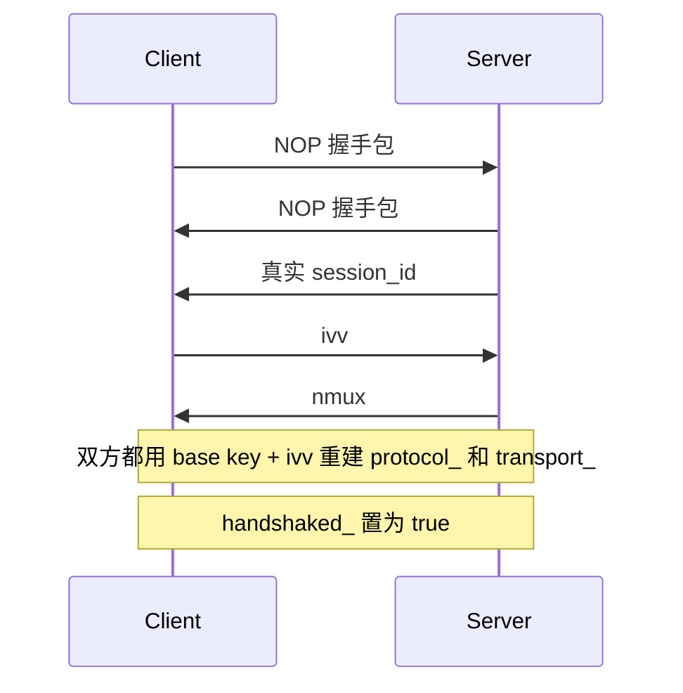
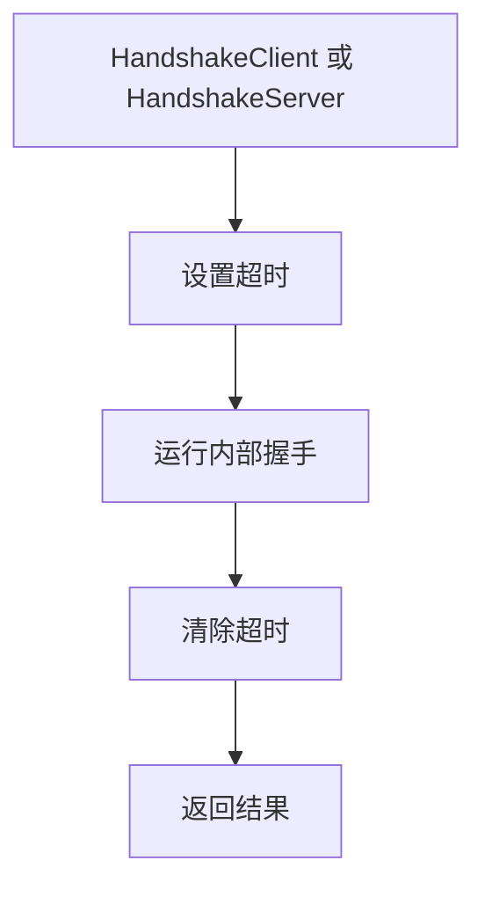

# 握手序列与会话建立

[English Version](HANDSHAKE_SEQUENCE.md)

## 文档范围

本文聚焦 `ppp/transmissions/ITransmission.cpp` 中实现的握手逻辑。重点解释：真实握手顺序是什么、dummy 包起什么作用、`session_id`、`ivv`、`nmux` 的先后关系是什么、握手成功前后对象状态发生了什么变化。

## 为什么这个握手必须单独成文

OPENPPP2 的握手不是一个极简的“hello，我是谁，现在开始传数据”的过程。它同时完成：

- 通过 NOP 包制造握手前奏噪声
- 传递真实 `session_id`
- 交换连接级工作密钥派生所需的 `ivv`
- 通过 `nmux` 传递 mux 标记
- 把 transmission 对象从预握手状态切到握手后状态

因此，握手不是一个可忽略的小前言，而是安全模型和流量形态模型的重要组成部分。

## 核心函数

关键函数如下：

- `Transmission_Handshake_Pack_SessionId(...)`
- `Transmission_Handshake_Unpack_SessionId(...)`
- `Transmission_Handshake_SessionId(...)` 发送重载
- `Transmission_Handshake_SessionId(...)` 接收重载
- `Transmission_Handshake_Nop(...)`
- `ITransmission::InternalHandshakeClient(...)`
- `ITransmission::InternalHandshakeServer(...)`
- `ITransmission::InternalHandshakeTimeoutSet(...)`
- `ITransmission::InternalHandshakeTimeoutClear(...)`

## 全部握手流程

从代码可见的逻辑流程如下：

如果结合函数体看，会发现客户端和服务端的代码顺序是轻微不对称的，但语义是一致的。

### 客户端侧顺序

`InternalHandshakeClient(...)` 的动作是：

1. 执行 `Transmission_Handshake_Nop(...)`
2. 接收 `sid`
3. 生成 `ivv`
4. 发送 `ivv`
5. 接收 `nmux`
6. 设置 `handshaked_ = true`
7. 从 `nmux & 1` 提取 mux 标记
8. 用 `ivv` 重建 cipher

### 服务端侧顺序

`InternalHandshakeServer(...)` 的动作是：

1. 执行 `Transmission_Handshake_Nop(...)`
2. 发送真实 `session_id`
3. 生成随机 `nmux`
4. 强制 `nmux` 最低位反映 mux 状态
5. 发送 `nmux`
6. 接收 `ivv`
7. 设置 `handshaked_ = true`
8. 用 `ivv` 重建 cipher

## 握手超时包装层

两个公共入口都把内部握手放在“设定超时 -> 执行内部握手 -> 清除超时”这个包装层之内：

- `HandshakeClient(...)`
- `HandshakeServer(...)`

因此 transmission 只会在有限时间内处于“不明确的握手中”状态。

如果计时器先到期，则 transmission 会被销毁。

## NOP 在这里到底是什么意思

名字叫 NOP，很容易让人误以为这只是“发一点空白字节”。实际上不是。

`Transmission_Handshake_Nop(...)` 会根据 `key.kl` 和 `key.kh` 计算一段轮数，然后反复发送值为 `0` 的 session-id 样式包。值为 `0` 的这些包不会被当作真实 session，而会在打包时被标记成 dummy 包，接收侧根据首字节最高位识别后丢弃。

所以它的真实效果是：

- 握手前奏并不是空白
- 这些包在语法上是合法握手对象
- 但在语义上是有意可丢弃的扰动流量

这与“随便发几个无结构字节”完全不是一回事。

## session-id 包如何构造

`Transmission_Handshake_Pack_SessionId(...)` 会先构造一个字符串 payload，然后再做变换。

这里分成两条路径。

### 真实包路径

当 `session_id` 非零时：

- 第一个字节取自 `0x00..0x7f`
- 最高位为 0
- 真实整数值会转成字符串，作为 payload 核心内容

### dummy 包路径

当 `session_id == 0` 时：

- 第一个字节取自 `0x80..0xff`
- 最高位为 1
- 核心整数串会换成一个随机的 `Int128` 风格值

两条路径之后都会继续追加：

- 另外三个随机非零字节
- 一个分隔字符
- 受 `key.kx` 影响的随机填充
- 到某个分支时追加 `/`
- 再继续追加随机可打印字符

最后，代码会用这四个前缀字节逐步扰动 `kf`，并反复对 payload 执行 XOR 变换。

也就是说，握手项本身就不是明文十进制整数直接裸发，即使还没进入后续更高层的传输帧化。

## session-id 包如何解析

`Transmission_Handshake_Unpack_SessionId(...)` 会做逆向恢复。

步骤是：

1. 先做基础长度检查
2. 读取首字节
3. 如果最高位为 1，就把它标记为 dummy，`eagin = true`
4. 否则把四个前缀字节取出
5. 对 payload 逆向执行滚动 XOR 恢复
6. 把结果按十进制解析为 `Int128`

而接收版 `Transmission_Handshake_SessionId(...)` 会一直循环读取，直到拿到一个非 dummy 的真实项。

因此 NOP 前奏才能天然工作，因为接收侧本来就设计成“跳过 dummy，持续读到真实项”。

## `ivv` 是如何交换的

客户端用 GUID 生成新的 `Int128` 作为 `ivv`，然后仍然复用 session-id 这套 pack/unpack 机制进行发送与接收。

这种实现方式很有意思，因为它让以下四类逻辑值共享了同一套握手编码器：

- dummy 包
- session id
- `ivv`
- `nmux`

于是握手层不需要为每一种逻辑值再单独发明一套新的二进制 grammar。

## `nmux` 的语义

服务端会先生成一个随机的 128 位 `nmux`，然后再调整它的最低位，让这个最低位表达 mux 状态。

- 如果 mux 开启，就保证 `nmux` 为奇数
- 如果 mux 关闭，就保证 `nmux` 为偶数

客户端再通过：

- `mux = (nmux & 1) != 0`

来提取结果。

因此 `nmux` 不是纯粹无意义随机数，它是“随机值承载一个最低位状态标记”的设计。

## cipher 在何时重建

握手不是一开始就重建 cipher，而是在关键逻辑值齐备后才切换到连接级工作密钥状态。

### 客户端重建时机

客户端会在以下动作完成后重建 cipher：

- 收到 `sid`
- 发出 `ivv`
- 收到 `nmux`

### 服务端重建时机

服务端会在以下动作完成后重建 cipher：

- 发出 `session_id`
- 发出 `nmux`
- 收到 `ivv`

这意味着双方都是在逻辑控制交换基本完成后，才真正切换到 connection-specific working cipher state。

## `handshaked_` 在什么时刻翻转

`handshaked_` 非常关键，因为它不仅影响“会话有没有握成”，还会影响后续包格式路径。

在握手完成前：

- `safest = !handshaked_` 为真
- payload 会强制走更保守的变换路径
- 根据配置和状态，base94 路径也仍然可能继续被使用

在握手完成后：

- `handshaked_` 变为真
- transmission 开始使用基于 `ivv` 重建后的 working cipher
- 常规握手后二进制路径成为正常工作路径

因此，握手控制的是两类状态：

- cipher 状态
- 帧格式状态

## 失败条件

只要出现以下任意情况，握手就会失败：

- NOP 发送失败
- session-id 接收失败
- 在需要真实值时拿到的 `sid` 为零
- `ivv` 发送失败
- `nmux` 为零
- 在握手完成前超时
- transmission 中途已被 `Dispose()`

这说明代码是严格的。它不会尝试在一堆半残缺的握手状态上继续凑合运行。

## 顺序为什么重要

`sid`、`ivv`、`nmux` 的顺序不是任意的，因为三者的职责不同：

- `sid`：建立已接纳会话的逻辑身份
- `ivv`：提供连接级工作密钥派生的新输入
- `nmux`：承载 mux 状态，不必单独发一个裸布尔控制记录

所以这是一个紧凑但功能并不单薄的控制交换过程。

## 安全解读

从安全视角看，这个握手为 OPENPPP2 带来了几个非常重要的性质：

- 早期握手包并不都是语义明确的真实控制项
- 控制值不是未经处理的裸整数
- 每个连接都可以据 `ivv` 派生新的工作密钥状态
- 半开握手会被超时清理
- mux 状态被嵌入随机值而不是单独暴露成一个过于直白的小标记包

同样，要如实表述：这已经相当丰富，没有必要再超出代码事实做夸张宣传。

## 开发者阅读提示

调试或跟源码时，建议重点盯住以下变量：

- `handshaked_`
- `frame_rn_`
- `frame_tn_`
- `protocol_`
- `transport_`
- `timeout_`
- `ivv`
- `nmux`

这些变量把握手层和后续帧化层直接连了起来。

## 相关文档

- [`TRANSMISSION_CN.md`](TRANSMISSION_CN.md)
- [`PACKET_FORMATS_CN.md`](PACKET_FORMATS_CN.md)
- [`SECURITY_CN.md`](SECURITY_CN.md)
