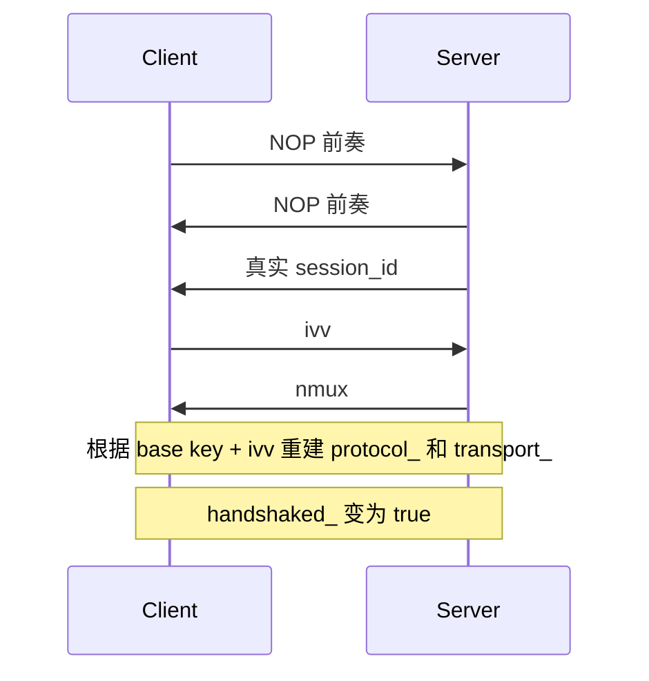
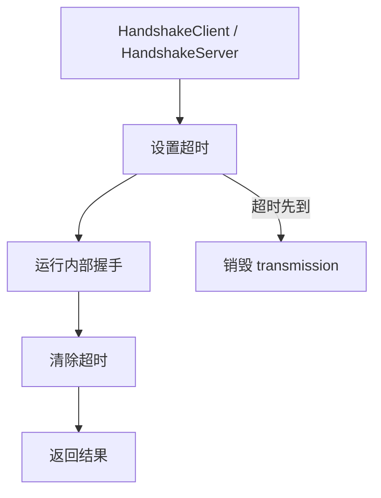
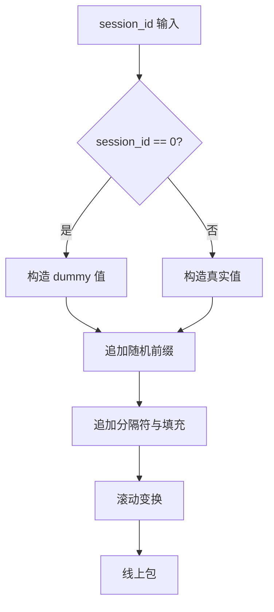

# 握手序列与会话建立

[English Version](HANDSHAKE_SEQUENCE.md)

## 范围

本文聚焦 `ppp/transmissions/ITransmission.cpp` 中的握手逻辑。重点解释真实握手顺序、dummy 包的作用、`session_id`、`ivv`、`nmux` 的先后关系，以及握手成功前后 transmission 对象状态如何变化。

## 为什么这个握手存在

OPENPPP2 的握手不只是一个最小化的 hello。它同时完成：

- 制造 NOP 前奏流量
- 传递真实 `session_id`
- 交换用于连接级工作密钥派生的 `ivv`
- 通过 `nmux` 传递 mux 标记
- 把 transmission 对象从预握手状态切到握手后状态

这个握手既是控制面交换，也是流量形态控制。

## 核心函数

| 函数 | 作用 |
|------|------|
| `Transmission_Handshake_Pack_SessionId(...)` | 构造 session-id 样式包 |
| `Transmission_Handshake_Unpack_SessionId(...)` | 反向解析并识别 dummy 包 |
| `Transmission_Handshake_SessionId(...)` | 发送或接收逻辑上的 session-id 样式值 |
| `Transmission_Handshake_Nop(...)` | 发送可配置的 dummy 前奏 |
| `ITransmission::InternalHandshakeClient(...)` | 客户端侧握手编排 |
| `ITransmission::InternalHandshakeServer(...)` | 服务端侧握手编排 |
| `ITransmission::InternalHandshakeTimeoutSet(...)` | 启动握手超时 |
| `ITransmission::InternalHandshakeTimeoutClear(...)` | 清除握手超时 |

## 全部流程

代码上的客户端和服务端顺序略有不对称，但逻辑交换是一样的。

## 客户端顺序

`InternalHandshakeClient(...)` 的动作是：

1. 先执行 `Transmission_Handshake_Nop(...)`
2. 再接收 `sid`
3. 生成 `ivv`
4. 发送 `ivv`
5. 接收 `nmux`
6. 设置 `handshaked_ = true`
7. 从 `nmux & 1` 提取 mux 标记
8. 用 `ivv` 重建 cipher 状态

客户端必须先拿到真实会话标识，再注入自己的随机输入，最后接收服务端的 mux 状态。

## 服务端顺序

`InternalHandshakeServer(...)` 的动作是：

1. 执行 `Transmission_Handshake_Nop(...)`
2. 发送真实 `session_id`
3. 生成随机 `nmux`
4. 强制最低位反映 mux 状态
5. 发送 `nmux`
6. 接收 `ivv`
7. 设置 `handshaked_ = true`
8. 用 `ivv` 重建 cipher 状态

服务端负责决定 mux 状态，并且不需要单独发一个布尔包。

## 握手超时包装层

两个公共入口都会把内部握手放在“设定超时 -> 执行内部握手 -> 清除超时”这个包装层里。

如果计时器先到期，transmission 会被销毁。

## NOP 在这里是什么意思

`Transmission_Handshake_Nop(...)` 不是空字节流。它会根据 `key.kl` 和 `key.kh` 计算轮数，然后发送值为 `0` 的 session-id 样式包。

这些包在语法上是合法握手对象，但在语义上是可丢弃的。接收侧根据首字节高位识别并忽略。

这意味着前奏在外观上像正常握手流量，但在逻辑上不携带真实 session 身份。

## session-id 包如何构造

`Transmission_Handshake_Pack_SessionId(...)` 先构造字符串 payload，再做变换。

### 真实包路径

当 `session_id` 非零时：

- 第一个字节取自 `0x00..0x7f`
- 最高位为 0
- 整数值转成字符串，作为核心 payload

### dummy 包路径

当 `session_id == 0` 时：

- 第一个字节取自 `0x80..0xff`
- 最高位为 1
- 核心整数串替换为随机的 Int128 风格值

### 共通处理

两条路径都会继续追加：

- 另外三个随机非零字节
- 一个分隔字符
- 受 `key.kx` 影响的随机填充
- 更多可打印字符

然后 payload 会被前缀字节驱动的滚动 key 反馈变换。

## session-id 包如何解析

`Transmission_Handshake_Unpack_SessionId(...)` 负责逆向恢复。

1. 检查最小长度
2. 读取首字节
3. 如果最高位为 1，就标记为 dummy 并忽略
4. 否则取出四个前缀字节
5. 逆向滚动 XOR 恢复
6. 将结果解析为十进制 `Int128`

接收重载会一直循环读取，直到拿到真实包。

## `ivv` 交换

客户端会用 GUID 派生出新的 `Int128` 作为 `ivv`，然后仍然复用 session-id 这套包机制发送。

这意味着同一套编码器要处理四类逻辑值：

- dummy 包
- `session_id`
- `ivv`
- `nmux`

## `nmux` 语义

服务端先生成随机 128 位 `nmux`，再把最低位调整成 mux 状态：

- mux 开启则为奇数
- mux 关闭则为偶数

客户端再通过 `mux = (nmux & 1) != 0` 提取结果。

## cipher 何时重建

cipher 不是一开始就重建，而是在关键值齐备后才进入工作密钥状态。

### 客户端重建点

客户端在以下动作后重建 cipher：

1. 收到 `sid`
2. 发送 `ivv`
3. 收到 `nmux`

### 服务端重建点

服务端在以下动作后重建 cipher：

1. 发送 `session_id`
2. 发送 `nmux`
3. 收到 `ivv`

这时双方才切换到 connection-specific working cipher 状态。

## `handshaked_` 何时翻转

握手完成前：

- `safest = !handshaked_` 为真
- 使用更保守的变换路径
- base94 仍可能作为回退路径

握手完成后：

- `handshaked_` 变为 true
- working cipher 状态生效
- 常规受保护二进制路径成为正常路径

## 失败条件

以下任一情况都会导致握手失败：

- NOP 发送失败
- session-id 接收失败
- 需要真实值时收到的 `sid` 为零
- `ivv` 发送失败
- `nmux` 为零
- 握手完成前超时
- transmission 在过程中被 `Dispose()`

## 顺序为什么重要

`sid -> ivv -> nmux` 不是随便定的，因为三者职责不同。

| 值 | 作用 |
|----|------|
| `sid` | 建立逻辑会话身份 |
| `ivv` | 提供工作密钥派生的新输入 |
| `nmux` | 承载 mux 状态，而不是单独发一个布尔包 |

这样可以把身份、密钥输入和配置状态压缩成一个紧凑控制交换过程。

## 安全解读

这个握手提供了：

- dummy 流量用于形态控制
- 被变换过的控制值
- 连接级动态工作密钥
- 超时约束的握手态
- 嵌入式 mux 状态而不是直白的 flag 包

准确的说法很重要：这是强连接级形态控制和密钥多样化，不要夸大成代码里没有证明的形式化性质。

## 开发者调试要点

调试时重点观察：

- `handshaked_`
- `frame_rn_`
- `frame_tn_`
- `protocol_`
- `transport_`
- `timeout_`
- `ivv`
- `nmux`

它们把握手层和后续帧化层连接起来了。
