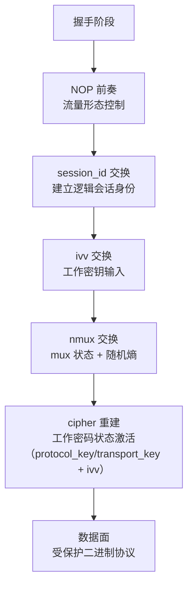
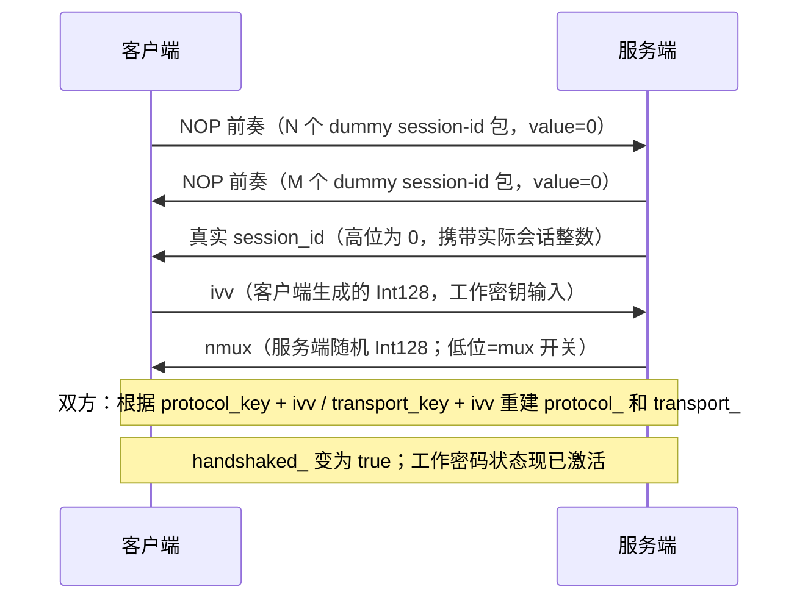
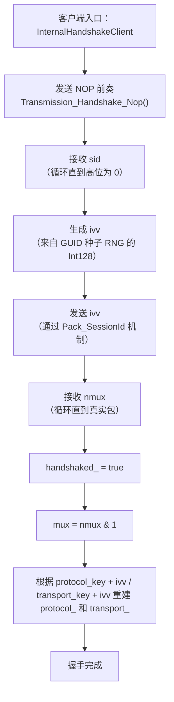
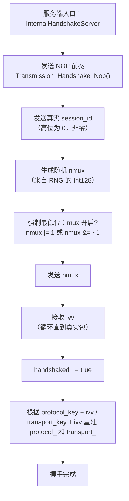
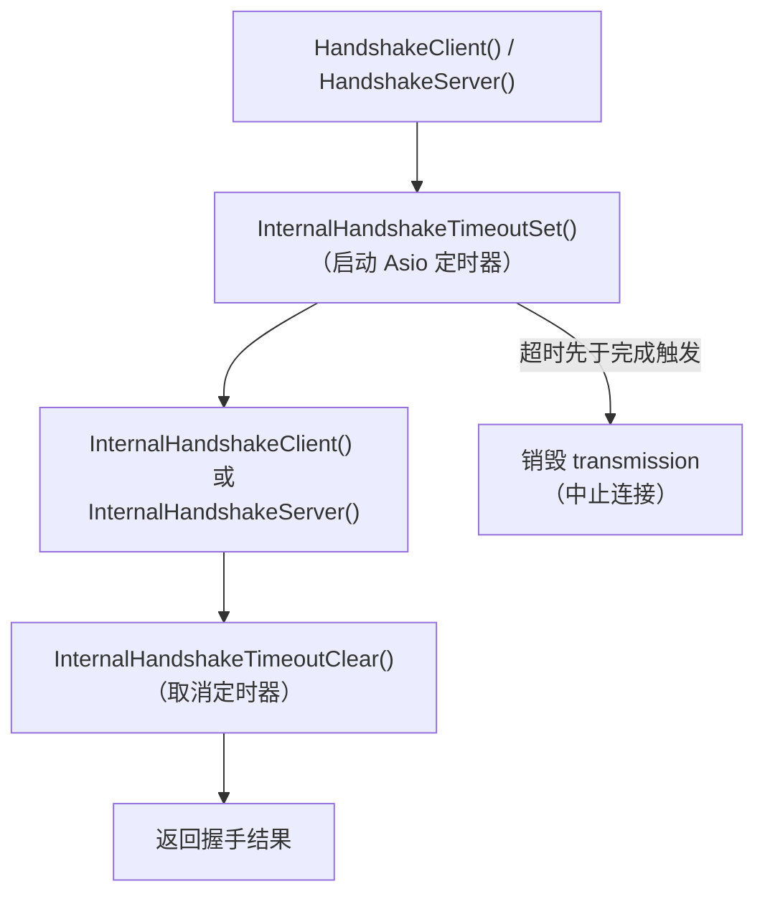
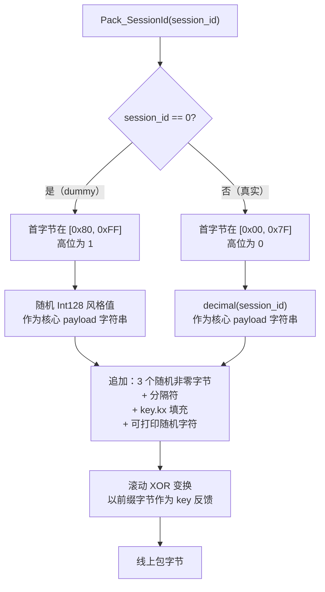
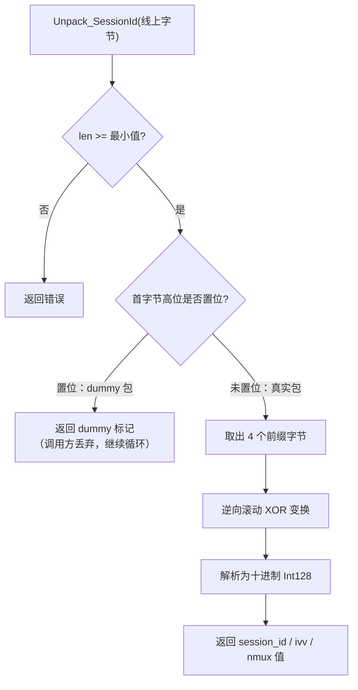
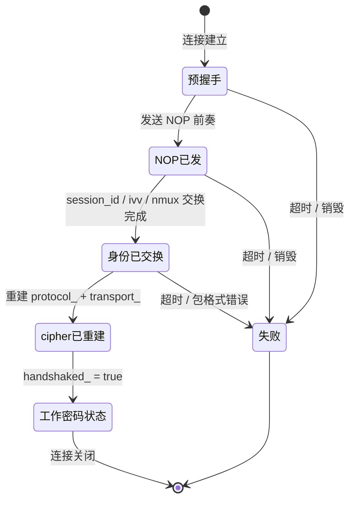
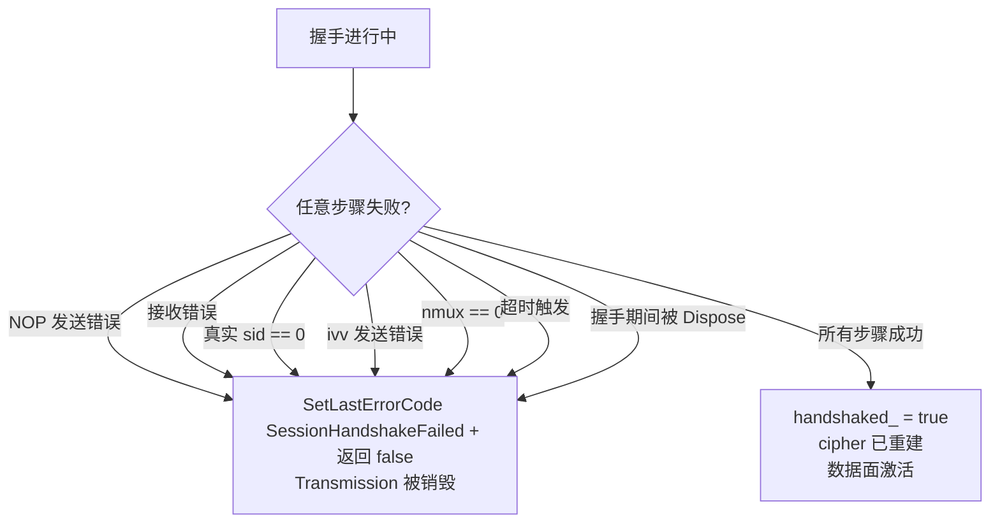
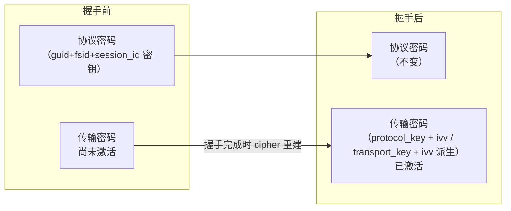

# 握手序列与会话建立

[English Version](HANDSHAKE_SEQUENCE.md)

## 范围

本文聚焦 `ppp/transmissions/ITransmission.cpp` 中的握手逻辑。重点解释真实握手顺序、
dummy 包的作用、`session_id`、`ivv`、`nmux` 的先后关系，以及握手成功前后 transmission
对象状态如何变化。同时覆盖超时包装层、cipher 重建时机、失败条件和握手安全模型。

---

## 为什么这个握手存在

OPENPPP2 的握手不只是一个最小化的 hello。它同时完成：

- 制造 NOP 前奏流量（流量形态控制）
- 传递真实 `session_id`（逻辑会话身份）
- 交换用于连接级工作密钥派生的 `ivv`
- 通过 `nmux` 传递 mux 标记和随机熵
- 把 transmission 对象从预握手状态切到握手后密码状态

最关键的一点：这个握手同时是**控制面交换**和**流量形态控制**。mux 配置和密钥协商的所有
控制数据都嵌入同一个包族中，不需要单独的控制包。

---

## 核心函数

| 函数 | 文件 | 作用 |
|------|------|------|
| `Transmission_Handshake_Pack_SessionId(...)` | `ITransmission.cpp` | 构造 session-id 样式包 |
| `Transmission_Handshake_Unpack_SessionId(...)` | `ITransmission.cpp` | 反向解析并识别 dummy 包 |
| `Transmission_Handshake_SessionId(...)` | `ITransmission.cpp` | 发送或接收逻辑上的 session-id 样式值 |
| `Transmission_Handshake_Nop(...)` | `ITransmission.cpp` | 发送可配置的 dummy 前奏 |
| `ITransmission::InternalHandshakeClient(...)` | `ITransmission.cpp` | 客户端侧握手编排 |
| `ITransmission::InternalHandshakeServer(...)` | `ITransmission.cpp` | 服务端侧握手编排 |
| `ITransmission::InternalHandshakeTimeoutSet(...)` | `ITransmission.cpp` | 启动握手超时 |
| `ITransmission::InternalHandshakeTimeoutClear(...)` | `ITransmission.cpp` | 清除握手超时 |

---

## 全部握手流程

代码上客户端和服务端的执行顺序略有不对称，但逻辑上的信息交换是对称的。双方最终获得
相同的 `ivv` 和 `nmux`，因此能够派生出相同的工作密码状态。

---

## 客户端握手顺序

`InternalHandshakeClient(...)` 按如下顺序执行：

1. **发送 NOP 前奏** — `Transmission_Handshake_Nop(...)` 发送 N 轮 dummy 包
2. **接收 `sid`** — 循环直到收到真实包（高位为 0）
3. **生成 `ivv`** — 从 GUID 种子随机源创建一个新的 `Int128`
4. **发送 `ivv`** — 通过同一个 session-id 包机制发送
5. **接收 `nmux`** — 循环直到收到真实包
6. **设置 `handshaked_ = true`**
7. **提取 mux 标志** — `mux = (nmux & 1) != 0`
8. **重建 cipher 状态** — 以 `ivv` 作为连接级密钥输入

客户端必须先收到服务端的会话身份（`sid`）和 mux 状态（`nmux`），并发送自己的随机
输入（`ivv`），才能重建工作密钥。

---

## 服务端握手顺序

`InternalHandshakeServer(...)` 按如下顺序执行：

1. **发送 NOP 前奏** — `Transmission_Handshake_Nop(...)` 发送 M 轮 dummy 包
2. **发送真实 `session_id`** — 服务端的逻辑会话标识符（非零）
3. **生成随机 `nmux`** — 从 RNG 生成新的 `Int128`
4. **强制最低位** — 反映 mux 状态：奇数=mux 开启，偶数=mux 关闭
5. **发送 `nmux`**
6. **接收 `ivv`** — 循环直到收到真实包（高位为 0）
7. **设置 `handshaked_ = true`**
8. **重建 cipher 状态** — 以 `ivv` 作为连接级密钥输入

服务端负责决定 mux 状态，并且不需要单独发一个布尔包。mux 标志嵌入在 128 位随机
`nmux` 值的最低位中。

---

## 握手超时包装层

两个公共入口（`HandshakeClient` 和 `HandshakeServer`）都把内部握手函数包在超时设置与
清除的括号中。

如果握手定时器在所有步骤完成之前触发，transmission 对象将被销毁，连接被中止。这防止
了半开状态的会话无限期占用服务器资源。

超时值来自 `AppConfiguration` 的握手超时设置。如果未配置超时，则使用默认值。

---

## NOP 在这里是什么意思

`Transmission_Handshake_Nop(...)` 不是空字节流。它会根据 `key.kl` 和 `key.kh` 计算
轮数，然后发送值为 `0` 的 session-id 样式包。

这些包在语法上是合法握手对象，但在语义上是可丢弃的。接收侧根据首字节高位识别这些包
并忽略它们，循环直到收到真实包。

这意味着前奏在外观上像正常握手流量，但在逻辑上不携带真实 session 身份。NOP 数量由
密钥材料确定性计算得出，因此双方无需单独的长度字段就能知道预期的 NOP 数量。

---

## session-id 包如何构造

`Transmission_Handshake_Pack_SessionId(...)` 先构造字符串 payload，再做变换。
所有四类逻辑值（dummy 包、`session_id`、`ivv`、`nmux`）都用同一个函数编码——
只有 `session_id` 参数不同。

### 真实包路径

当 `session_id` 非零时：

- 第一个字节取自 `[0x00, 0x7F]`
- 最高位为 0（标记为真实包）
- 整数值作为十进制字符串序列化为核心 payload

### dummy 包路径

当 `session_id == 0` 时：

- 第一个字节取自 `[0x80, 0xFF]`
- 最高位为 1（标记为 dummy 包）
- 核心整数串替换为随机的 Int128 风格值

### 共通处理（两条路径都执行）

两条路径都会继续追加：

- 另外三个随机非零字节
- 一个分隔字符
- 受 `key.kx` 影响的随机填充
- 更多可打印随机字符

然后整个 payload 会被前缀字节驱动的滚动 key 反馈变换。

---

## session-id 包如何解析

`Transmission_Handshake_Unpack_SessionId(...)` 负责逆向恢复：

1. 检查最小长度要求
2. 读取首字节
3. 如果最高位为 1 → 标记为 dummy，立即返回（调用方循环）
4. 否则取出四个前缀字节
5. 逆向滚动 XOR 恢复
6. 将结果解析为十进制 `Int128`

接收重载会一直循环读取，直到拿到真实包（高位为 0）。dummy 包被静默丢弃。这确保了
双方不同的 NOP 数量不需要任何协调，只依赖相同的密钥材料。

---

## `ivv` 交换

客户端会用 GUID 派生出新的 `Int128` 作为 `ivv`，然后仍然复用 session-id 包机制发送。
在线上，`session_id` 包和 `ivv` 包在结构上没有区别——两者都是以非零值调用
`Pack_SessionId` 的输出。

这意味着同一套编码器要处理四类逻辑值：

| 值 | 发送方 | 作用 |
|----|--------|------|
| dummy 包 | 双方 | 流量形态控制 / NOP 前奏 |
| `session_id` | 服务端 | 建立逻辑会话身份 |
| `ivv` | 客户端 | 提供工作密钥派生的新输入 |
| `nmux` | 服务端 | 承载 mux 状态 + 随机熵 |

握手因此复用一个包族来传递多个控制值。

---

## `nmux` 语义

服务端先生成随机 128 位 `nmux`，再把最低位调整成 mux 状态：

- mux 开启：`nmux` 为**奇数**（`nmux |= 1`）
- mux 关闭：`nmux` 为**偶数**（`nmux &= ~1`）

客户端再通过 `mux = (nmux & 1) != 0` 提取结果。

`nmux` 剩余的 127 位作为额外熵输入到 cipher 重建步骤中。这意味着即使两条连接的 mux
状态相同，工作密钥也会不同。

---

## cipher 何时重建

cipher 不是一开始就重建，而是在关键值齐备后才进入工作密钥状态。

### 客户端重建点

客户端在以下动作完成后重建 cipher：

1. 收到 `sid`（来自服务端的逻辑会话身份）
2. 发送 `ivv`（客户端的随机贡献）
3. 收到 `nmux`（服务端的随机贡献 + mux 标志）

此时双方拥有相同的 `ivv` 和 `nmux`，能够从 `protocol_key + ivv` / `transport_key + ivv` 派生出相同的
工作密码。

### 服务端重建点

服务端在以下动作完成后重建 cipher：

1. 发送 `session_id`
2. 发送 `nmux`
3. 收到 `ivv`（客户端的随机贡献）

双方随后以相同的派生密钥进入工作密码状态。

---

## `handshaked_` 何时翻转

握手完成前：

- `safest = !handshaked_` 为**真**
- 使用更保守的变换路径
- base94 仍可能作为回退路径（取决于配置）
- `frame_tn_` 和 `frame_rn_` 可能仍处于扩展头模式

握手完成后：

- `handshaked_` 变为**真**
- 工作密码状态生效
- 常规受保护二进制路径成为正常路径
- `frame_rn_` 和 `frame_tn_` 随帧化状态机推进

这个切换在代码中可以观察为 `handshaked_` 翻转与 cipher 重建调用的组合。此后所有
包都使用派生的工作密钥。

---

## 失败条件

以下任一情况都会导致握手失败并中止连接：

| 失败条件 | 来源 |
|---------|------|
| NOP 发送失败 | 网络错误 |
| session-id 接收失败 | 网络错误或包格式错误 |
| 需要真实值时收到的 `sid` 为零 | 协议错误 |
| `ivv` 发送失败 | 网络错误 |
| `nmux` 为零 | 服务端生成错误 |
| 超时在完成前触发 | `InternalHandshakeTimeoutSet` |
| transmission 在过程中被 `Dispose()` | 应用生命周期事件 |
| 包未通过最小长度检查 | 协议错误 |

---

## 顺序为什么重要

`sid → ivv → nmux` 不是随便定的，三者职责不同。

| 值 | 作用 | 为何在此位置 |
|----|------|------------|
| `sid` | 建立逻辑会话身份 | 必须最先，客户端需要知道它在哪个会话中 |
| `ivv` | 提供工作密钥派生的新输入 | 客户端在收到身份后生成；贡献给 cipher 派生 |
| `nmux` | 承载 mux 状态而不是单独发布尔包 | 服务端在 sid 之后发送；一个包同时携带随机熵和 mux 标志 |

这样可以把身份、密钥输入和配置状态压缩成三个逻辑值的紧凑控制交换过程。

---

## 安全解读

这个握手提供了：

- **dummy 流量用于形态控制**：NOP 前奏包对被动观察者来说在语法上与真实握手包无法
  区分
- **被变换过的控制值**：session-id 包通过以前缀字节为反馈的滚动 XOR 变换进行混淆
- **连接级动态工作密钥**：`ivv` 确保即使基础密钥材料相同，任意两条连接也不会派生
  出相同的工作密码。`nmux`（服务端随机值）为混淆金丝雀提供额外熵。
- **超时约束的握手状态**：握手定时器防止无限期半开连接占用服务器资源
- **嵌入式 mux 状态**：mux 标志嵌入在 `nmux` 的熵中，而不是作为容易识别的独立
  布尔包

准确的说法很重要：这是强连接级形态控制和密钥多样化，不要夸大成代码里没有证明的
形式化密码学性质。

---

## 握手与传输层密码层级

OPENPPP2 使用两个独立的密码层：

1. **协议密码**（内层）— 以 `guid + fsid + session_id` 为密钥。这个密码是会话级
   的，在握手开始之前就已派生。

2. **传输密码**（外层）— 以握手结果为密钥。具体来说，客户端的 `ivv` 追加到配置的 `transport_key` 密码短语上，共同产生传输密码。这个密码是连接级的，在握手完成时由 cipher 重建步骤激活。

握手是两种密码状态之间的边界。握手完成前，只有协议密码（或明文兼容模式下无密码）
处于活动状态。握手完成后，传输密码以来自连接级新鲜随机性的第二层保护激活。

---

## 调试时要观察的状态变量

调试握手代码时，重点观察：

| 变量 | 含义 |
|------|------|
| `handshaked_` | 握手是否已完成，工作密码是否已激活 |
| `frame_rn_` | 接收侧帧化状态（扩展头 vs 简化头） |
| `frame_tn_` | 发送侧帧化状态 |
| `protocol_` | 协议密码对象（握手后重建） |
| `transport_` | 传输密码对象（握手后重建） |
| `timeout_` | 握手超时定时器句柄 |
| `ivv` | 客户端生成的工作密钥输入（握手期间的局部变量） |
| `nmux` | 服务端生成的 mux 载体值（握手期间的局部变量） |

这些变量把握手层和后续帧化层连接起来了。一个常见的调试错误是在 `handshaked_` 为
true 之前检查 `protocol_`；此时的密码状态是握手前状态，不能反映最终的工作密钥。

---

## 相关文档

- [`TRANSMISSION_CN.md`](TRANSMISSION_CN.md) — 传输层架构
- [`TRANSMISSION_PACK_SESSIONID_CN.md`](TRANSMISSION_PACK_SESSIONID_CN.md) — session-id 包打解包详细分析
- [`PACKET_FORMATS_CN.md`](PACKET_FORMATS_CN.md) — base94 和二进制包的线上格式
- [`SECURITY_CN.md`](SECURITY_CN.md) — 安全模型概述
- [`ENGINEERING_CONCEPTS_CN.md`](ENGINEERING_CONCEPTS_CN.md) — YieldContext 和协程模式
