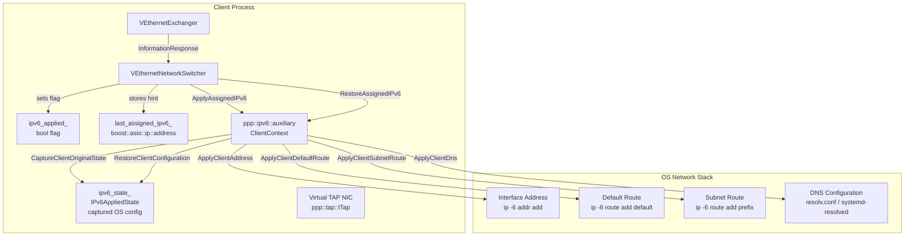
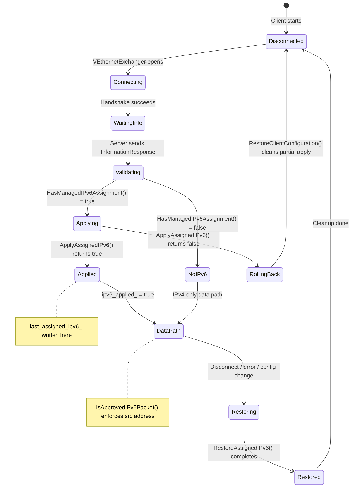
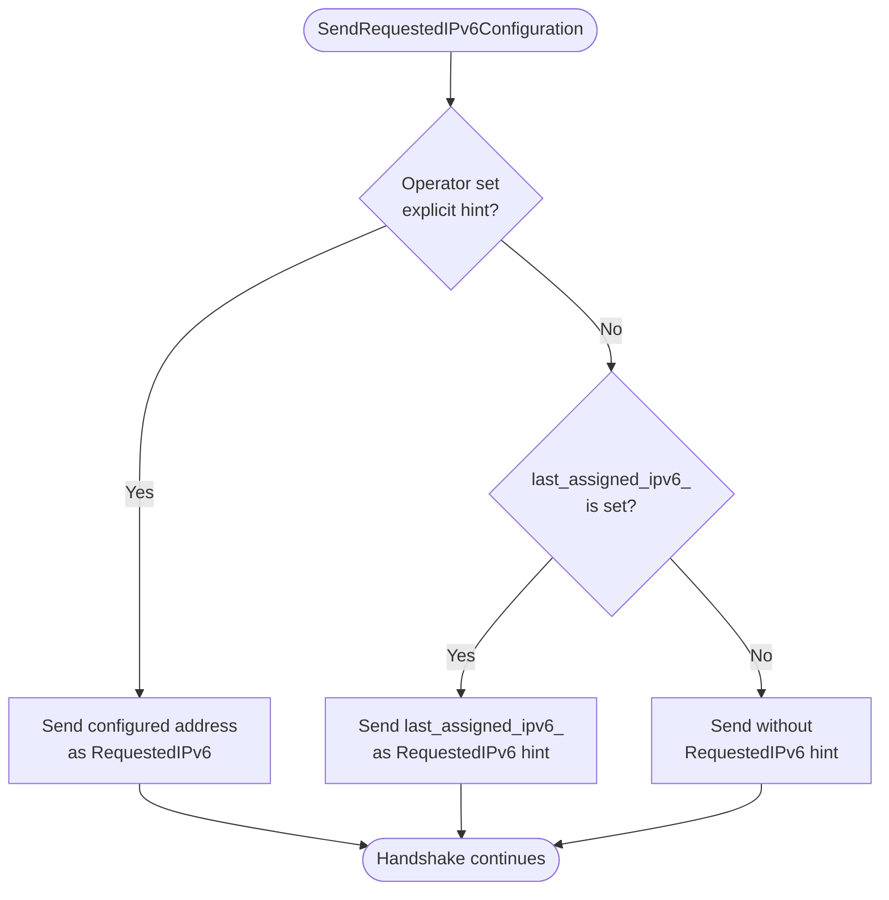
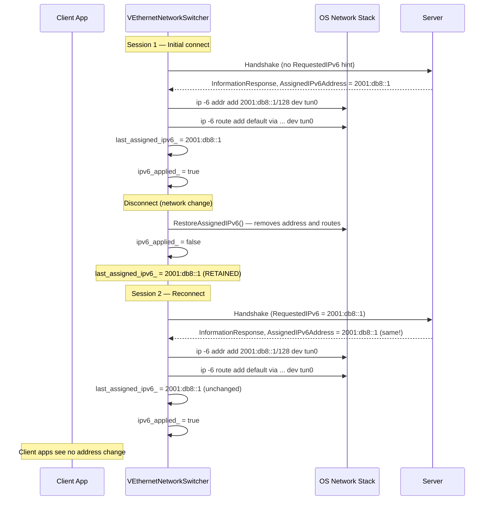
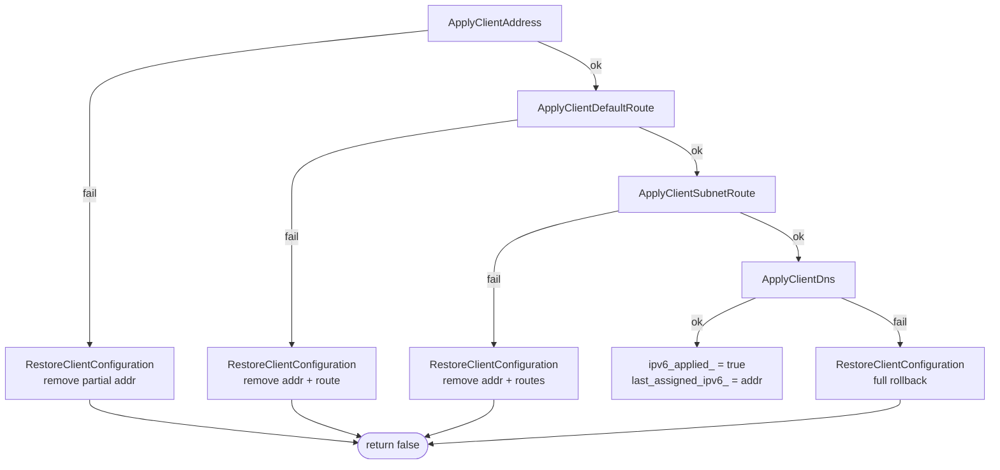
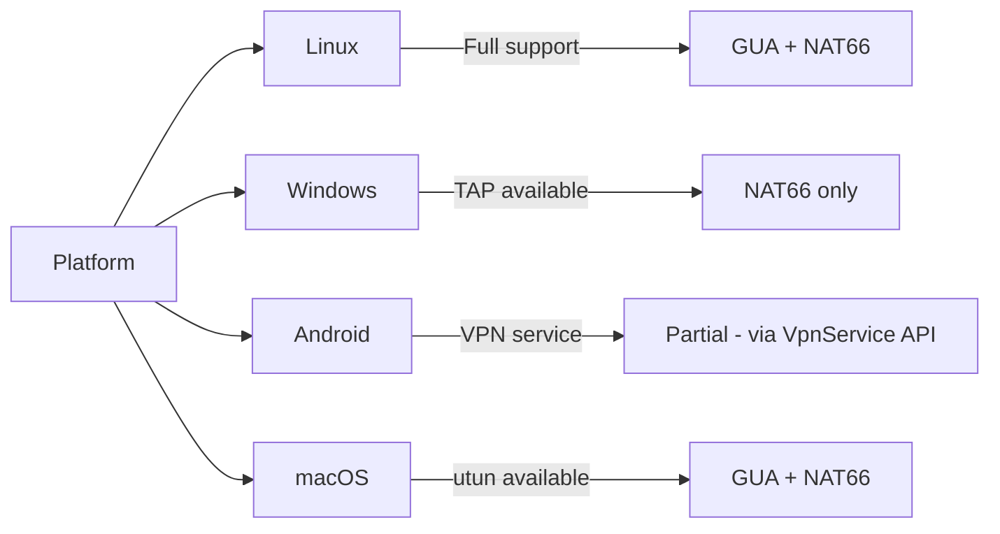
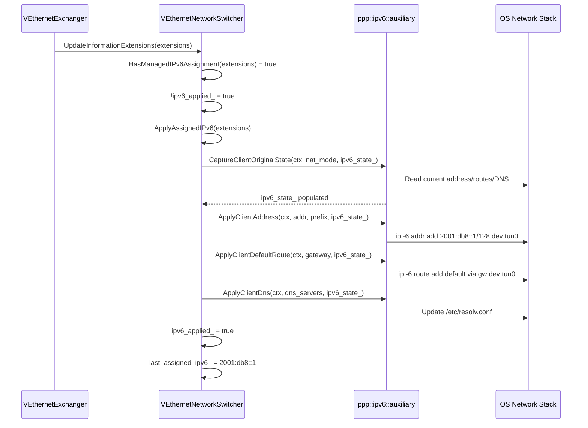

# IPv6 Client Address Assignment Lifecycle

[中文版本](IPV6_CLIENT_ASSIGNMENT_CN.md)

> **Subsystem:** `ppp::app::client::VEthernetNetworkSwitcher`
> **Primary file:** `ppp/app/client/VEthernetNetworkSwitcher.cpp`
> **Header:** `ppp/app/client/VEthernetNetworkSwitcher.h`
> **Key functions:** `ApplyAssignedIPv6` (line 876), `RestoreAssignedIPv6` (line 994), `SendRequestedIPv6Configuration` (referenced at line 796)

---

## Table of Contents

1. [Overview](#1-overview)
2. [Architecture](#2-architecture)
3. [Assignment Lifecycle State Machine](#3-assignment-lifecycle-state-machine)
4. [ApplyAssignedIPv6](#4-applyassignedipv6)
5. [RestoreAssignedIPv6](#5-restoreassignedipv6)
6. [last_assigned_ipv6_ Hint Mechanism](#6-last_assigned_ipv6_-hint-mechanism)
7. [SendRequestedIPv6Configuration and Hint Fallback](#7-sendrequestedipv6configuration-and-hint-fallback)
8. [Sticky Hint Reconnect Flow](#8-sticky-hint-reconnect-flow)
9. [Rollback on Failure](#9-rollback-on-failure)
10. [IPv6AppliedState Capture](#10-ipv6appliedstate-capture)
11. [Platform Support](#11-platform-support)
12. [Sequence Diagrams](#12-sequence-diagrams)
13. [Error Codes](#13-error-codes)
14. [Configuration Reference](#14-configuration-reference)

---

## 1. Overview

When a VPN client successfully negotiates an IPv6 assignment with the server, the client-side subsystem must:

1. Parse the `VirtualEthernetInformationExtensions` fields from the server's response.
2. Capture the current OS network state (addresses, routes, DNS) before modification.
3. Apply the server-assigned IPv6 address, default route, optional subnet route, and DNS servers to the virtual NIC (TAP device).
4. Store the successfully-applied address in `last_assigned_ipv6_` so that future reconnections can request the same address as a hint.
5. On disconnect or error, restore the original OS network state using the captured snapshot.

This document covers the full lifecycle, from the first server response through reconnection stickiness and failure rollback.

---

## 2. Architecture



---

## 3. Assignment Lifecycle State Machine



---

## 4. `ApplyAssignedIPv6`

**Location:** `VEthernetNetworkSwitcher.cpp`, line 876
**Signature:**

```cpp
bool VEthernetNetworkSwitcher::ApplyAssignedIPv6(
    const VirtualEthernetInformationExtensions& extensions) noexcept;
```

### Pre-Conditions (lines 703–733)

Before attempting to apply any configuration, the function validates several conditions:

```cpp
// 1. Platform must support managed IPv6:
if (!ClientSupportsManagedIPv6()) { return false; }

// 2. Must not already be applied (guard against double-apply):
if (ipv6_applied_) { return false; }

// 3. Must be a supported mode:
bool nat_mode = extensions.AssignedIPv6Mode == IPv6Mode_Nat66;
bool gua_mode = extensions.AssignedIPv6Mode == IPv6Mode_Gua;
if (!nat_mode && !gua_mode) { return false; }

// 4. Prefix length must be exactly IPv6_MAX_PREFIX_LENGTH (128):
if (extensions.AssignedIPv6AddressPrefixLength != IPv6_MAX_PREFIX_LENGTH) {
    return false;
}

// 5. Address must be a valid, non-special IPv6 unicast:
if (!extensions.AssignedIPv6Address.is_v6()) { return false; }
```

### State Capture (line 750)

Before any OS modification, the original state is captured:

```cpp
ppp::ipv6::auxiliary::ClientContext ipv6_context;
ipv6_context.Tap              = tap.get();
ipv6_context.InterfaceIndex   = tun_ni->Index;
ipv6_context.InterfaceName    = tun_ni->Name;

ppp::ipv6::auxiliary::CaptureClientOriginalState(
    ipv6_context, nat_mode, ipv6_state_);
```

`CaptureClientOriginalState` reads the current IPv6 address, routes, and DNS from the OS and stores them in `ipv6_state_` (type `IPv6AppliedState`). This snapshot enables full rollback.

### Application Sequence (lines 752–787)

The function applies configuration in a fixed order, stopping and rolling back on any failure:

```
1. ApplyClientAddress(ipv6_context, extensions.AssignedIPv6Address, ...)
   → ip -6 addr add <addr>/128 dev <tun_if>

2. ApplyClientDefaultRoute(ipv6_context, extensions.AssignedIPv6Gateway, ...)
   → ip -6 route add default via <gateway> dev <tun_if>
   (skipped if no gateway and not NAT66 mode)

3. ApplyClientSubnetRoute(ipv6_context, ...)
   → ip -6 route add <prefix>/<len> via <gateway> dev <tun_if>
   (NAT66 only; adds the subnet route back to the server)

4. ApplyClientDns(ipv6_context, dns_servers, ipv6_state_)
   → Modifies /etc/resolv.conf or systemd-resolved
   (only if AssignedIPv6Dns1 or AssignedIPv6Dns2 is valid)
```

### Success Path (lines 793–797)

```cpp
if (applied) {
    ipv6_applied_ = true;
    // Memoize the successfully-applied address so that
    // SendRequestedIPv6Configuration() can use it as a hint
    // on the next reconnect.
    last_assigned_ipv6_ = extensions.AssignedIPv6Address;
}
```

### Failure Path (lines 799–801)

```cpp
else {
    ppp::ipv6::auxiliary::RestoreClientConfiguration(
        ipv6_context, extensions.AssignedIPv6Address, nat_mode, ipv6_state_);
    ipv6_state_.Clear();
}
```

If any sub-step fails, `RestoreClientConfiguration` is called immediately to undo all partially-applied changes before returning `false`.

---

## 5. `RestoreAssignedIPv6`

**Location:** `VEthernetNetworkSwitcher.cpp`, line 994
**Signature:**

```cpp
void VEthernetNetworkSwitcher::RestoreAssignedIPv6() noexcept;
```

Called on every disconnect path, regardless of success. It is idempotent: if `ipv6_applied_` is `false`, it returns immediately.

### Algorithm (lines 808–839)

```cpp
void VEthernetNetworkSwitcher::RestoreAssignedIPv6() noexcept {
    if (!ipv6_applied_) { return; }

    // Defensive: if TAP or NI is gone, just clear the flag.
    auto tap = GetTap();
    if (NULLPTR == tap) { ipv6_applied_ = false; return; }
    auto tun_ni = tap->GetNetworkInterface();
    if (NULLPTR == tun_ni) { ipv6_applied_ = false; return; }

    int prefix = std::max<int>(IPv6_MIN_PREFIX_LENGTH + 1,
        std::min<int>(IPv6_MAX_PREFIX_LENGTH,
            information_extensions_.AssignedIPv6AddressPrefixLength));

    ppp::ipv6::auxiliary::ClientContext ipv6_context;
    ipv6_context.Tap            = tap.get();
    ipv6_context.InterfaceIndex = tun_ni->Index;
    ipv6_context.InterfaceName  = tun_ni->Name;

    bool nat_mode = information_extensions_.AssignedIPv6Mode ==
        VirtualEthernetInformationExtensions::IPv6Mode_Nat66;

    ppp::ipv6::auxiliary::RestoreClientConfiguration(
        ipv6_context,
        information_extensions_.AssignedIPv6Address,
        nat_mode,
        ipv6_state_);

    ipv6_applied_ = false;
    ipv6_state_.Clear();
}
```

`RestoreClientConfiguration` reverses each applied step in reverse order:
1. Remove DNS entries added to `resolv.conf` / systemd-resolved.
2. Delete the subnet route (NAT66 only).
3. Delete the default route.
4. Remove the IPv6 address from the TAP interface.

---

## 6. `last_assigned_ipv6_` Hint Mechanism

**Location:** `VEthernetNetworkSwitcher.h`, line 1065
**Type:** `boost::asio::ip::address`

```cpp
/**
 * @details Written by ApplyAssignedIPv6() on every successful apply.
 *          Read by LastAssignedIPv6() so that
 *          SendRequestedIPv6Configuration() can use it as a hint.
 */
boost::asio::ip::address last_assigned_ipv6_;
```

**Key property:** `last_assigned_ipv6_` is **never cleared on disconnect**. It persists for the lifetime of the `VEthernetNetworkSwitcher` object. This persistence is intentional:

- On the first connection, `last_assigned_ipv6_` is unspecified (default-constructed).
- On the second and subsequent connections, `last_assigned_ipv6_` contains the address from the previous session.
- `SendRequestedIPv6Configuration()` reads it via `LastAssignedIPv6()` and includes it as the `RequestedIPv6` field in the handshake.
- The server's allocation algorithm gives this hint priority (see `IPV6_LEASE_MANAGEMENT.md`, section 4.2).

### Why Not Clear on Disconnect?

Clearing `last_assigned_ipv6_` on disconnect would defeat the stickiness feature. The hint is valuable precisely **because** reconnections are frequent in VPN deployments (network changes, sleep/wake cycles, roaming). Retaining the hint across reconnections:

1. Reduces address-change noise for the client's applications and connections.
2. Allows DNS records pointing to the client's IPv6 address to remain valid.
3. Reduces NDP proxy churn on the server (same proxy entry is reused).

---

## 7. `SendRequestedIPv6Configuration` and Hint Fallback

The function `SendRequestedIPv6Configuration` (referenced at `VEthernetNetworkSwitcher.cpp`, line 796 comment) sends the client's preference during the handshake. Its hint selection logic is:

```
Priority 1: Operator-configured explicit preference via RequestedIPv6() API.
Priority 2: last_assigned_ipv6_ (memoized from previous session).
Priority 3: Unspecified (no hint; server picks freely).
```



### Hint Acceptance on the Server

The server is not obligated to honor the hint. If the requested address is already in use by another session (and that session has not yet expired), the server will allocate a different address. The client must accept whatever address the server assigns.

---

## 8. Sticky Hint Reconnect Flow

The following diagram shows a complete reconnect cycle where the client retains the same IPv6 address:



---

## 9. Rollback on Failure

If `ApplyAssignedIPv6` fails at any sub-step, the rollback is immediate and synchronous:



After rollback, `last_assigned_ipv6_` is **not updated** — it retains the address from the previous session. This is correct: the failed apply means the new address was never actually in use, so the hint from the previous session remains valid.

---

## 10. `IPv6AppliedState` Capture

`ipv6_state_` (type `IPv6AppliedState`) is defined in `ppp/ipv6/IPv6Auxiliary.h` and contains a snapshot of the OS network configuration before IPv6 was applied:

```cpp
struct IPv6AppliedState {
    // Captured previous IPv6 address on the TAP interface (if any).
    boost::asio::ip::address         PreviousAddress;
    // Captured previous default IPv6 route via gateway.
    boost::asio::ip::address         PreviousGateway;
    // Captured DNS entries (for restoration).
    ppp::vector<ppp::string>         PreviousDnsServers;
    // Flag: whether DNS was modified.
    bool                             DnsModified = false;
    // ... platform-specific route capture fields

    void Clear() noexcept;
};
```

`CaptureClientOriginalState` (called at line 750) populates this struct. `RestoreClientConfiguration` uses it to issue the exact inverse OS commands that `ApplyAssigned*` issued.

### Why Capture Is Necessary

Without capture, `RestoreAssignedIPv6` would have to blindly remove all IPv6 configuration from the TAP interface, which could destroy pre-existing IPv6 addresses configured by the OS or another tool. The capture-and-restore pattern ensures surgical precision.

---

## 11. Platform Support



`ClientSupportsManagedIPv6()` (`.cpp`, lines 54–60) evaluates platform capability:

```cpp
static bool ClientSupportsManagedIPv6() noexcept {
#if defined(_LINUX) || defined(_MACOS)
    return true;
#else
    return false;
#endif
}
```

On Windows and Android, `ApplyAssignedIPv6` returns `false` immediately, and IPv6 connectivity is unavailable in managed mode. The IPv4 data path continues to operate normally.

---

## 12. Sequence Diagrams

### 12.1 First-Time Assignment



### 12.2 Configuration Change Detection

When the server sends a new `InformationResponse` (e.g., after re-authentication), the switcher compares the new extensions with the previous ones:

```mermaid
sequenceDiagram
    participant EX as VEthernetExchanger
    participant NS as VEthernetNetworkSwitcher

    EX->>NS: UpdateInformationExtensions(new_extensions)
    NS->>NS: SameManagedIPv6Configuration(old, new)?
    alt Same configuration
        NS->>NS: No action needed; ipv6_applied_ unchanged
    else Different configuration
        NS->>NS: RestoreAssignedIPv6() — remove old config
        NS->>NS: ApplyAssignedIPv6(new_extensions) — apply new config
        NS->>NS: last_assigned_ipv6_ = new addr
    end
```

---

## 13. Error Codes

| Code | Severity | Triggered In |
|---|---|---|
| `IPv6ClientStateCaptureFailed` | `kError` | `CaptureClientOriginalState()` fails to read OS state. |
| `IPv6ClientAddressApplyFailed` | `kError` | `ApplyClientAddress()` fails; `ip -6 addr add` rejected. |
| `IPv6ClientRouteApplyFailed` | `kError` | `ApplyClientDefaultRoute()` or `ApplyClientSubnetRoute()` fails. |
| `IPv6ClientDnsApplyFailed` | `kError` | `ApplyClientDns()` fails to update DNS configuration. |
| `IPv6ClientRestoreFailed` | `kError` | `RestoreClientConfiguration()` fails to reverse one or more changes. |
| `IPv6PrefixInvalid` | `kError` | `AssignedIPv6AddressPrefixLength` != 128 in server response. |
| `IPv6AddressInvalid` | `kError` | `AssignedIPv6Address` is not a valid IPv6 unicast. |
| `IPv6ModeInvalid` | `kError` | `AssignedIPv6Mode` is neither `IPv6Mode_Nat66` nor `IPv6Mode_Gua`. |
| `IPv6GatewayInvalid` | `kError` | Gateway address in server response is malformed. |
| `IPv6Unsupported` | `kFatal` | GUA mode requested on a platform that does not support it. |

> **Note**: The following error codes are proposed/design items not yet in `ErrorCodes.def`: `IPv6ClientStateCaptureFailed` (no close existing equivalent, needs new entry), `IPv6ClientRestoreFailed` (no close existing equivalent, needs new entry).

---

## 14. Configuration Reference

Client-side IPv6 configuration is minimal — the server drives all parameter choices. The only client-side option is the explicit preferred address:

```json
{
  "client": {
    "ipv6": {
      "preferred_address": "2001:db8::42"
    }
  }
}
```

| Field | Description |
|---|---|
| `preferred_address` | If set, overrides `last_assigned_ipv6_` as the hint sent to the server. If not set, the hint comes from the previous session's `last_assigned_ipv6_`. |

When `preferred_address` is not configured and no previous session exists, no hint is sent, and the server allocates freely from the pool.
