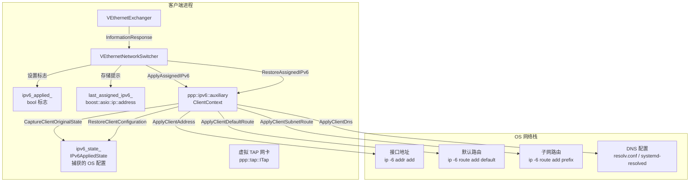
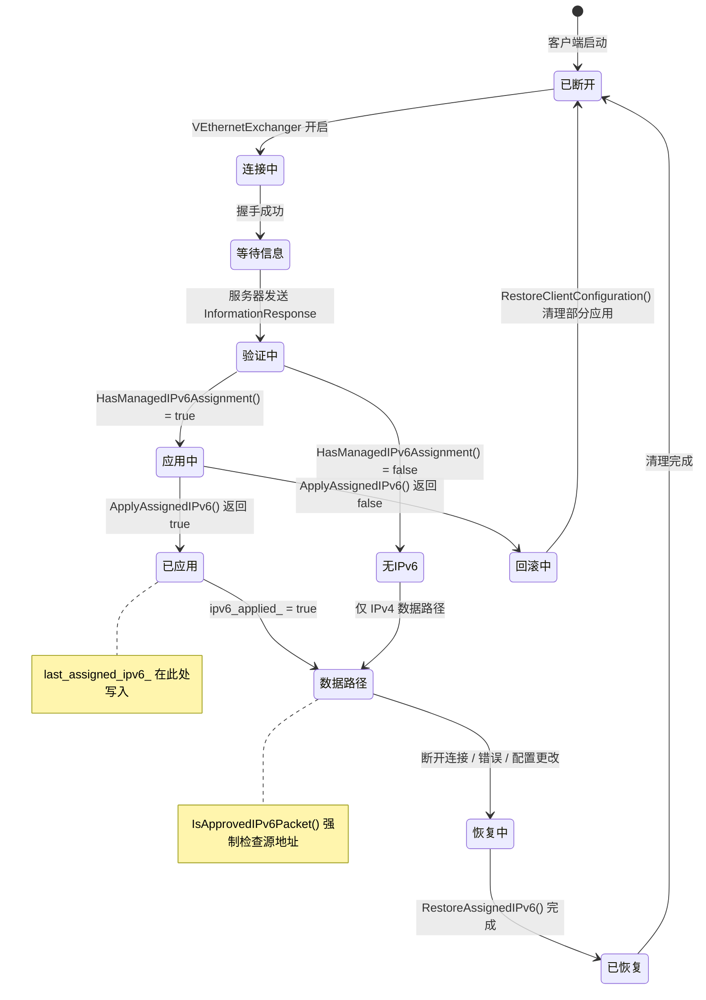
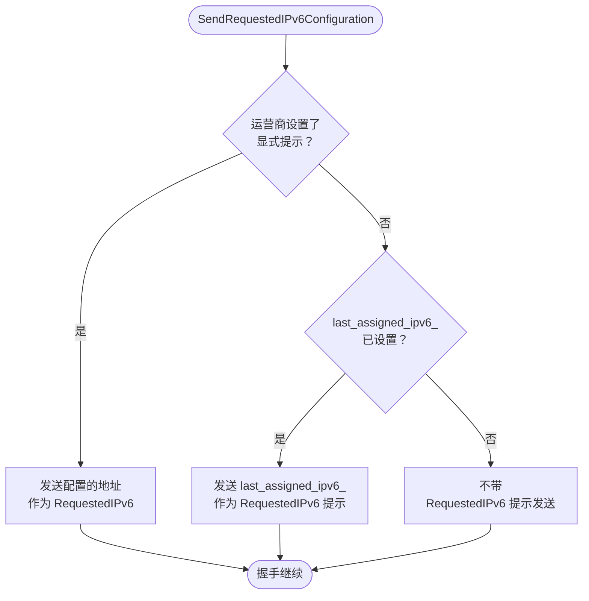
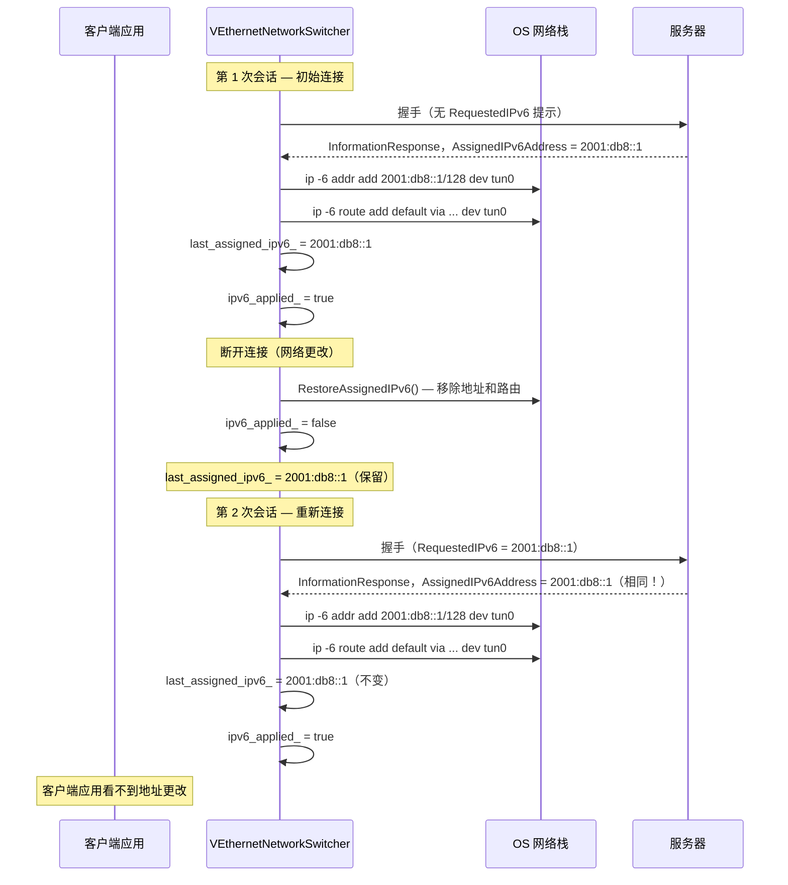
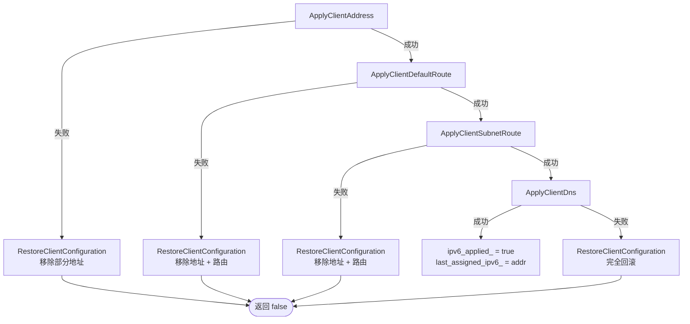
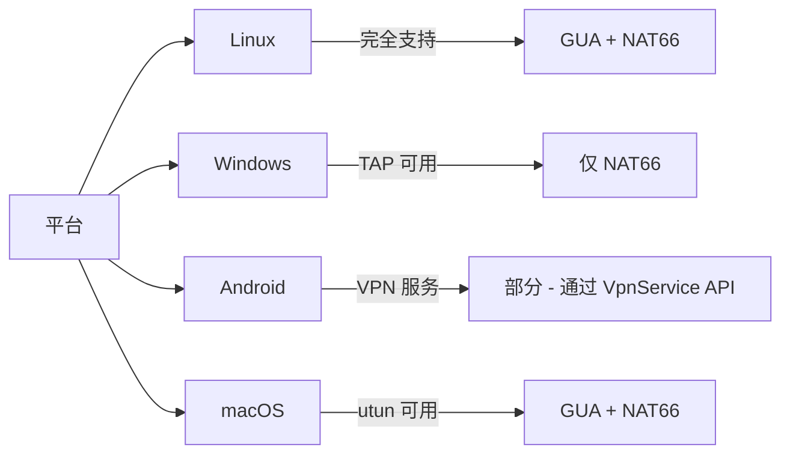
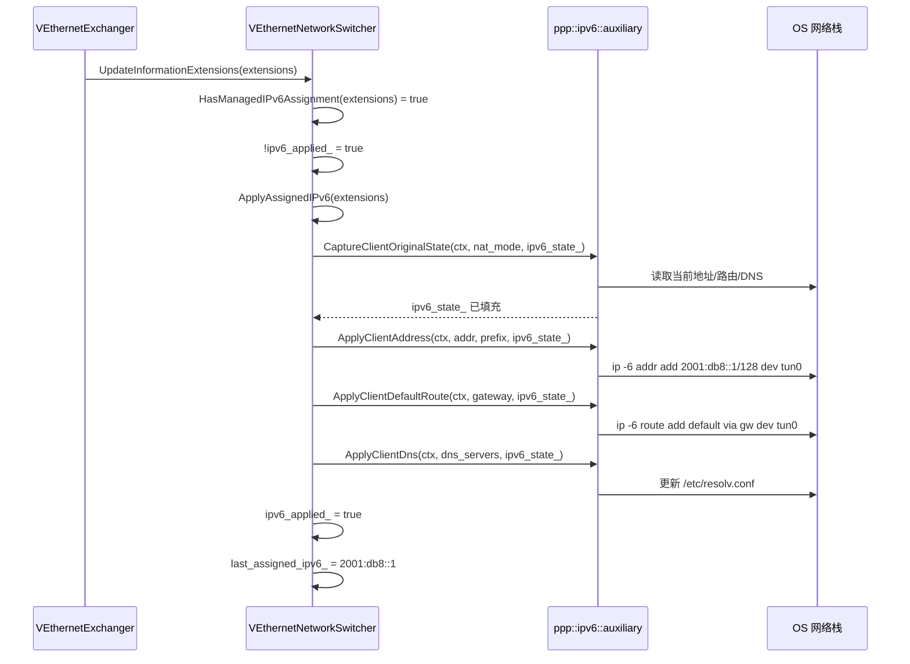

# IPv6 客户端地址分配生命周期

[English Version](IPV6_CLIENT_ASSIGNMENT.md)

> **子系统：** `ppp::app::client::VEthernetNetworkSwitcher`
> **主要文件：** `ppp/app/client/VEthernetNetworkSwitcher.cpp`
> **头文件：** `ppp/app/client/VEthernetNetworkSwitcher.h`
> **关键函数：** `ApplyAssignedIPv6`（第 876 行）、`RestoreAssignedIPv6`（第 994 行）、`SendRequestedIPv6Configuration`（第 796 行注释中引用）

---

## 目录

1. [概述](#1-概述)
2. [架构](#2-架构)
3. [分配生命周期状态机](#3-分配生命周期状态机)
4. [ApplyAssignedIPv6](#4-applyassignedipv6)
5. [RestoreAssignedIPv6](#5-restoreassignedipv6)
6. [last_assigned_ipv6_ 提示机制](#6-last_assigned_ipv6_-提示机制)
7. [SendRequestedIPv6Configuration 与提示回退](#7-sendrequestedipv6configuration-与提示回退)
8. [粘性提示重连流程](#8-粘性提示重连流程)
9. [失败时的回滚](#9-失败时的回滚)
10. [IPv6AppliedState 捕获](#10-ipv6appliedstate-捕获)
11. [平台支持](#11-平台支持)
12. [时序图](#12-时序图)
13. [错误码](#13-错误码)
14. [配置参考](#14-配置参考)

---

## 1. 概述

当 VPN 客户端成功与服务器协商 IPv6 分配后，客户端子系统必须：

1. 从服务器响应中解析 `VirtualEthernetInformationExtensions` 字段。
2. 在修改之前捕获当前 OS 网络状态（地址、路由、DNS）。
3. 将服务器分配的 IPv6 地址、默认路由、可选子网路由和 DNS 服务器应用到虚拟网卡（TAP 设备）。
4. 将成功应用的地址存储在 `last_assigned_ipv6_` 中，以便未来重连时可以请求相同地址作为提示。
5. 在断开连接或出错时，使用捕获的快照恢复原始 OS 网络状态。

本文档涵盖完整生命周期，从第一次服务器响应到重连粘性和失败回滚。

---

## 2. 架构



---

## 3. 分配生命周期状态机



---

## 4. `ApplyAssignedIPv6`

**位置：** `VEthernetNetworkSwitcher.cpp`，第 876 行
**签名：**

```cpp
bool VEthernetNetworkSwitcher::ApplyAssignedIPv6(
    const VirtualEthernetInformationExtensions& extensions) noexcept;
```

### 前置条件（第 703–733 行）

在尝试应用任何配置之前，函数验证几个条件：

```cpp
// 1. 平台必须支持托管 IPv6：
if (!ClientSupportsManagedIPv6()) { return false; }

// 2. 必须尚未应用（防止双重应用）：
if (ipv6_applied_) { return false; }

// 3. 必须是支持的模式：
bool nat_mode = extensions.AssignedIPv6Mode == IPv6Mode_Nat66;
bool gua_mode = extensions.AssignedIPv6Mode == IPv6Mode_Gua;
if (!nat_mode && !gua_mode) { return false; }

// 4. 前缀长度必须恰好为 IPv6_MAX_PREFIX_LENGTH（128）：
if (extensions.AssignedIPv6AddressPrefixLength != IPv6_MAX_PREFIX_LENGTH) {
    return false;
}

// 5. 地址必须是有效的、非特殊的 IPv6 单播：
if (!extensions.AssignedIPv6Address.is_v6()) { return false; }
```

### 状态捕获（第 750 行）

在任何 OS 修改之前，捕获原始状态：

```cpp
ppp::ipv6::auxiliary::ClientContext ipv6_context;
ipv6_context.Tap            = tap.get();
ipv6_context.InterfaceIndex = tun_ni->Index;
ipv6_context.InterfaceName  = tun_ni->Name;

ppp::ipv6::auxiliary::CaptureClientOriginalState(
    ipv6_context, nat_mode, ipv6_state_);
```

`CaptureClientOriginalState` 从 OS 读取当前 IPv6 地址、路由和 DNS，并将其存储在 `ipv6_state_`（类型 `IPv6AppliedState`）中。此快照支持完全回滚。

### 应用序列（第 752–787 行）

函数以固定顺序应用配置，在任何失败时停止并回滚：

```
1. ApplyClientAddress(ipv6_context, extensions.AssignedIPv6Address, ...)
   → ip -6 addr add <addr>/128 dev <tun_if>

2. ApplyClientDefaultRoute(ipv6_context, extensions.AssignedIPv6Gateway, ...)
   → ip -6 route add default via <gateway> dev <tun_if>
   （如果没有网关且不是 NAT66 模式则跳过）

3. ApplyClientSubnetRoute(ipv6_context, ...)
   → ip -6 route add <prefix>/<len> via <gateway> dev <tun_if>
   （仅限 NAT66；添加回服务器的子网路由）

4. ApplyClientDns(ipv6_context, dns_servers, ipv6_state_)
   → 修改 /etc/resolv.conf 或 systemd-resolved
   （仅当 AssignedIPv6Dns1 或 AssignedIPv6Dns2 有效时）
```

### 成功路径（第 793–797 行）

```cpp
if (applied) {
    ipv6_applied_ = true;
    // 记忆成功应用的地址，以便
    // SendRequestedIPv6Configuration() 在下次重连时用作提示
    last_assigned_ipv6_ = extensions.AssignedIPv6Address;
}
```

### 失败路径（第 799–801 行）

```cpp
else {
    ppp::ipv6::auxiliary::RestoreClientConfiguration(
        ipv6_context, extensions.AssignedIPv6Address, nat_mode, ipv6_state_);
    ipv6_state_.Clear();
}
```

如果任何子步骤失败，立即调用 `RestoreClientConfiguration` 撤销所有部分应用的更改，然后返回 `false`。

---

## 5. `RestoreAssignedIPv6`

**位置：** `VEthernetNetworkSwitcher.cpp`，第 994 行
**签名：**

```cpp
void VEthernetNetworkSwitcher::RestoreAssignedIPv6() noexcept;
```

在每条断开连接路径上调用，无论成功与否。它是幂等的：如果 `ipv6_applied_` 为 `false`，立即返回。

### 算法（第 808–839 行）

```cpp
void VEthernetNetworkSwitcher::RestoreAssignedIPv6() noexcept {
    if (!ipv6_applied_) { return; }

    // 防御性：如果 TAP 或 NI 已消失，只清除标志。
    auto tap = GetTap();
    if (NULLPTR == tap) { ipv6_applied_ = false; return; }
    auto tun_ni = tap->GetNetworkInterface();
    if (NULLPTR == tun_ni) { ipv6_applied_ = false; return; }

    bool nat_mode = information_extensions_.AssignedIPv6Mode ==
        VirtualEthernetInformationExtensions::IPv6Mode_Nat66;

    ppp::ipv6::auxiliary::ClientContext ipv6_context;
    // ... 填充上下文

    ppp::ipv6::auxiliary::RestoreClientConfiguration(
        ipv6_context,
        information_extensions_.AssignedIPv6Address,
        nat_mode,
        ipv6_state_);

    ipv6_applied_ = false;
    ipv6_state_.Clear();
}
```

`RestoreClientConfiguration` 以相反顺序撤销每个应用步骤：
1. 移除添加到 `resolv.conf` / systemd-resolved 的 DNS 条目。
2. 删除子网路由（仅限 NAT66）。
3. 删除默认路由。
4. 从 TAP 接口移除 IPv6 地址。

---

## 6. `last_assigned_ipv6_` 提示机制

**位置：** `VEthernetNetworkSwitcher.h`，第 1065 行
**类型：** `boost::asio::ip::address`

```cpp
/**
 * @details 由 ApplyAssignedIPv6() 在每次成功应用时写入。
 *          由 LastAssignedIPv6() 读取，以便
 *          SendRequestedIPv6Configuration() 可以将其用作提示。
 */
boost::asio::ip::address last_assigned_ipv6_;
```

**关键属性：** `last_assigned_ipv6_` **在断开连接时永不清除**。它在 `VEthernetNetworkSwitcher` 对象的生命周期内持续存在。此持久性是有意为之的：

- 第一次连接时，`last_assigned_ipv6_` 未指定（默认构造）。
- 第二次及后续连接时，`last_assigned_ipv6_` 包含上一个会话的地址。
- `SendRequestedIPv6Configuration()` 通过 `LastAssignedIPv6()` 读取它，并将其作为握手中的 `RequestedIPv6` 字段包含。
- 服务器的分配算法给此提示优先权（参见 `IPV6_LEASE_MANAGEMENT_CN.md`，第 4.2 节）。

### 为什么断开时不清除？

断开时清除 `last_assigned_ipv6_` 会破坏粘性功能。提示的价值恰恰在于 VPN 部署中重连非常频繁（网络更改、休眠/唤醒循环、漫游）。跨重连保留提示：

1. 减少客户端应用程序和连接的地址更改噪音。
2. 允许指向客户端 IPv6 地址的 DNS 记录保持有效。
3. 减少服务器上的 NDP 代理抖动（重用相同的代理条目）。

---

## 7. `SendRequestedIPv6Configuration` 与提示回退



### 服务器端提示接受

服务器没有义务遵守提示。如果请求的地址已被另一个会话使用（且该会话尚未过期），服务器将分配不同的地址。客户端必须接受服务器分配的任何地址。

---

## 8. 粘性提示重连流程

以下图表显示客户端保留相同 IPv6 地址的完整重连周期：



---

## 9. 失败时的回滚

如果 `ApplyAssignedIPv6` 在任何子步骤失败，回滚是立即且同步的：



回滚后，`last_assigned_ipv6_` **不更新**——它保留上一个会话的地址。这是正确的：应用失败意味着新地址从未实际使用，因此上一个会话的提示仍然有效。

---

## 10. `IPv6AppliedState` 捕获

`ipv6_state_`（类型 `IPv6AppliedState`）在 `ppp/ipv6/IPv6Auxiliary.h` 中定义，包含应用 IPv6 之前 OS 网络配置的快照：

```cpp
struct IPv6AppliedState {
    // 捕获的 TAP 接口上之前的 IPv6 地址（如果有）。
    boost::asio::ip::address         PreviousAddress;
    // 捕获的通过网关的之前的默认 IPv6 路由。
    boost::asio::ip::address         PreviousGateway;
    // 捕获的 DNS 条目（用于恢复）。
    ppp::vector<ppp::string>         PreviousDnsServers;
    // 标志：DNS 是否被修改。
    bool                             DnsModified = false;
    // ... 平台特定的路由捕获字段

    void Clear() noexcept;
};
```

`CaptureClientOriginalState`（在第 750 行调用）填充此结构体。`RestoreClientConfiguration` 使用它来发出与 `ApplyAssigned*` 发出的完全相反的 OS 命令。

---

## 11. 平台支持



`ClientSupportsManagedIPv6()`（`.cpp`，第 54–60 行）评估平台能力：

```cpp
static bool ClientSupportsManagedIPv6() noexcept {
#if defined(_LINUX) || defined(_MACOS)
    return true;
#else
    return false;
#endif
}
```

在 Windows 和 Android 上，`ApplyAssignedIPv6` 立即返回 `false`，托管模式下 IPv6 连接不可用。IPv4 数据路径继续正常运行。

---

## 12. 时序图

### 12.1 首次分配



---

## 13. 错误码

| 错误码 | 严重级别 | 触发位置 |
|---|---|---|
| `IPv6ClientStateCaptureFailed` | `kError` | `CaptureClientOriginalState()` 读取 OS 状态失败 |
| `IPv6ClientAddressApplyFailed` | `kError` | `ApplyClientAddress()` 失败；`ip -6 addr add` 被拒绝 |
| `IPv6ClientRouteApplyFailed` | `kError` | `ApplyClientDefaultRoute()` 或 `ApplyClientSubnetRoute()` 失败 |
| `IPv6ClientDnsApplyFailed` | `kError` | `ApplyClientDns()` 更新 DNS 配置失败 |
| `IPv6ClientRestoreFailed` | `kError` | `RestoreClientConfiguration()` 无法撤销一个或多个更改 |
| `IPv6PrefixInvalid` | `kError` | 服务器响应中 `AssignedIPv6AddressPrefixLength` != 128 |
| `IPv6AddressInvalid` | `kError` | `AssignedIPv6Address` 不是有效的 IPv6 单播 |
| `IPv6ModeInvalid` | `kError` | `AssignedIPv6Mode` 既非 `IPv6Mode_Nat66` 也非 `IPv6Mode_Gua` |
| `IPv6GatewayInvalid` | `kError` | 服务器响应中的网关地址格式错误 |
| `IPv6Unsupported` | `kFatal` | 在不支持的平台上请求 GUA 模式 |

> **注**：以下错误码为拟新增/设计项，不在当前 `ErrorCodes.def`：`IPv6ClientStateCaptureFailed`（无近似现有码，需新增）、`IPv6ClientRestoreFailed`（无近似现有码，需新增）。

---

## 14. 配置参考

客户端 IPv6 配置很少——服务器驱动所有参数选择。唯一的客户端选项是显式首选地址：

```json
{
  "client": {
    "ipv6": {
      "preferred_address": "2001:db8::42"
    }
  }
}
```

| 字段 | 描述 |
|---|---|
| `preferred_address` | 如果设置，覆盖 `last_assigned_ipv6_` 作为发送给服务器的提示。如果未设置，提示来自上一个会话的 `last_assigned_ipv6_` |

当未配置 `preferred_address` 且不存在之前的会话时，不发送提示，服务器从池中自由分配。
