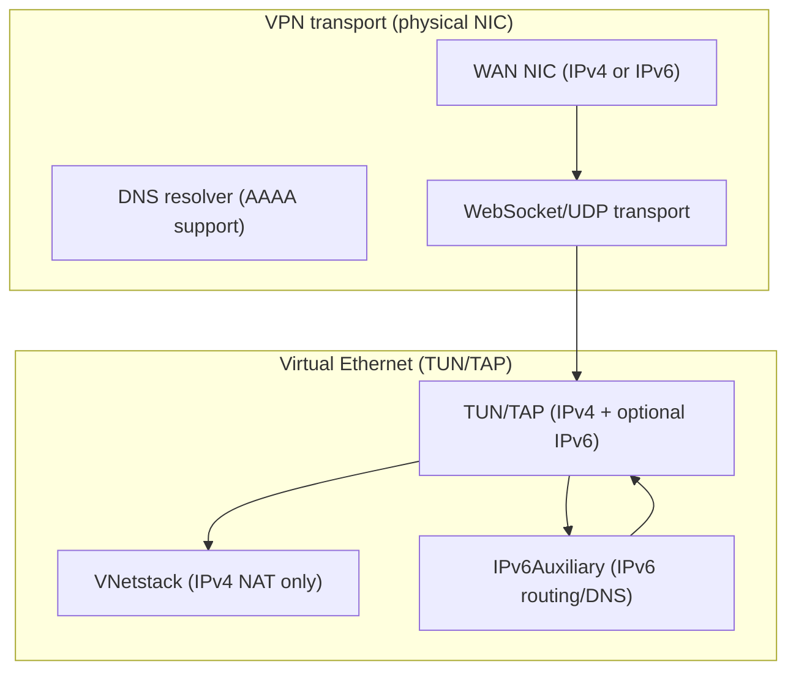
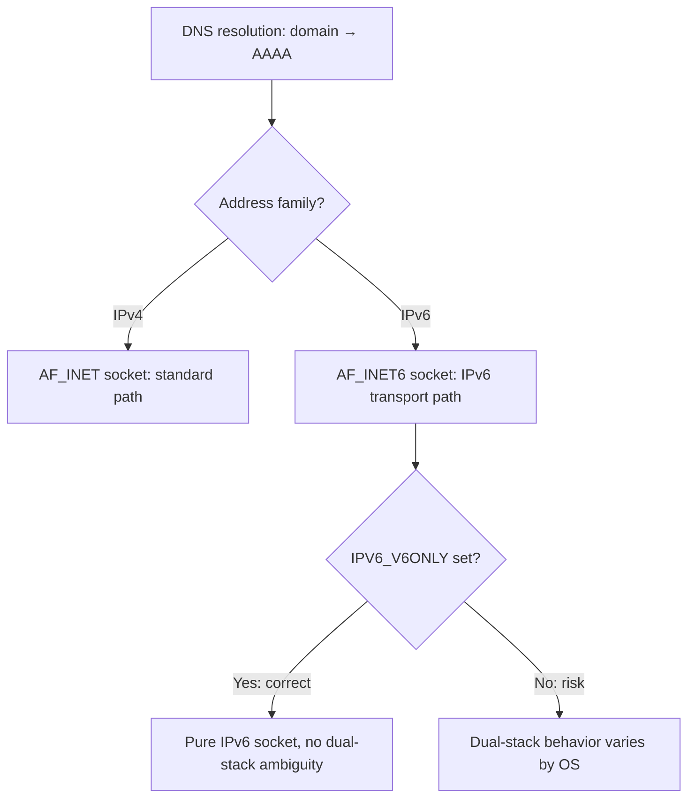
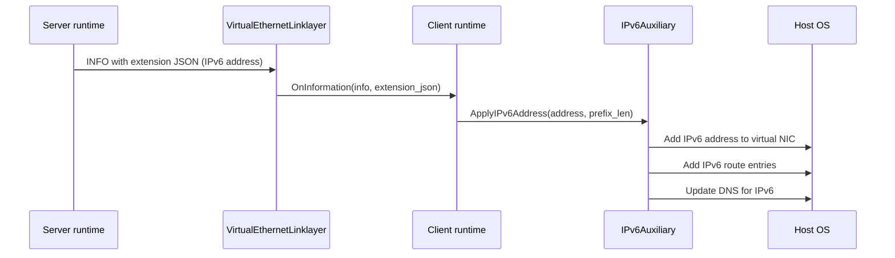
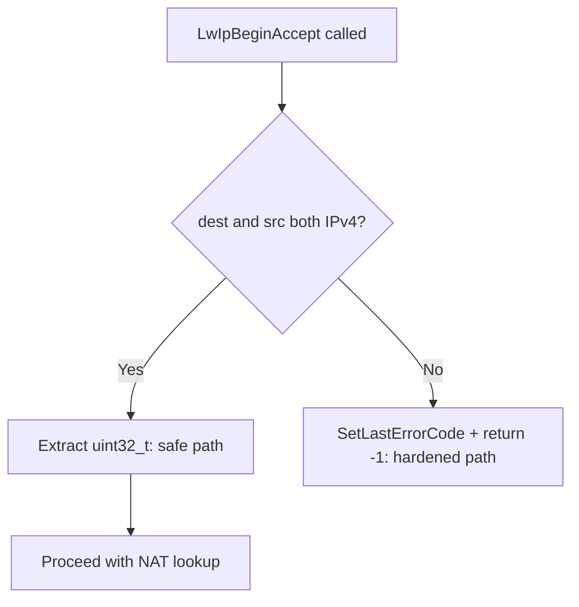
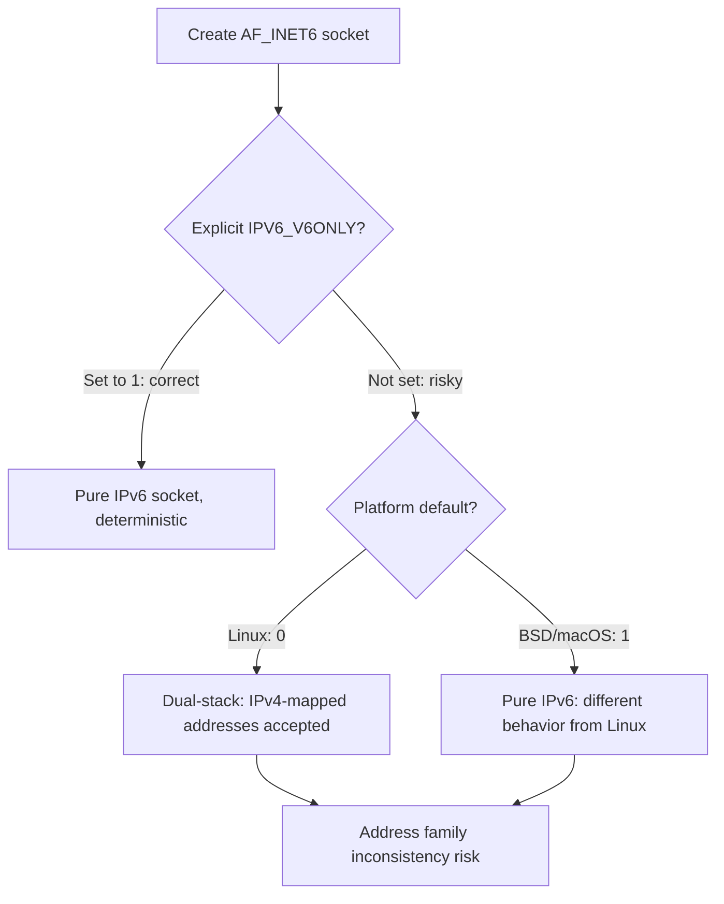
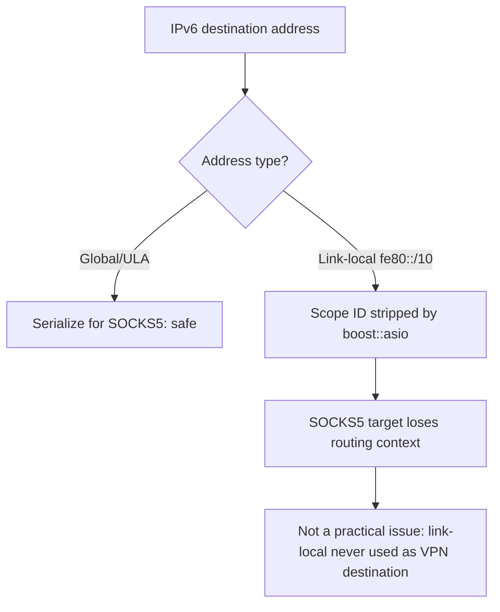
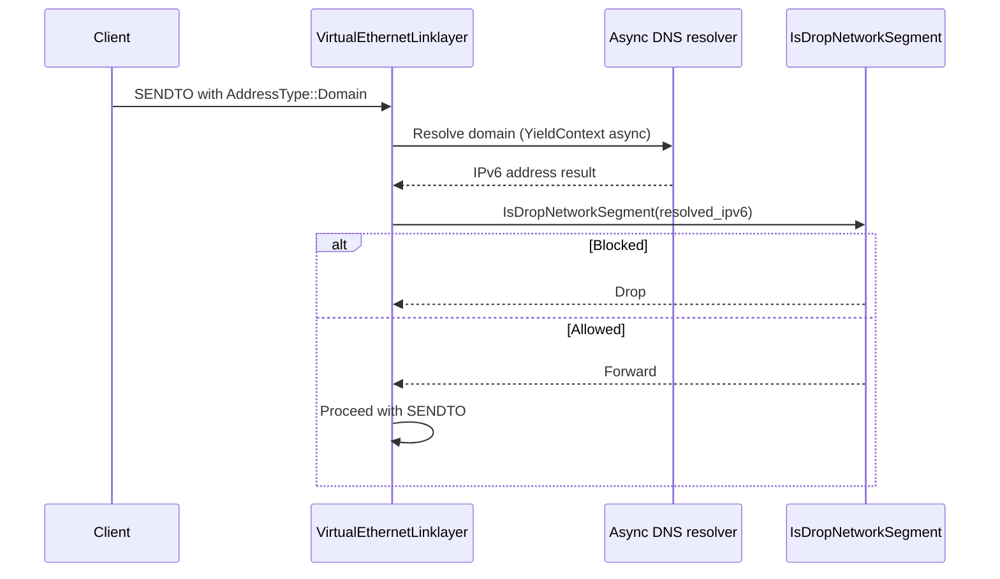
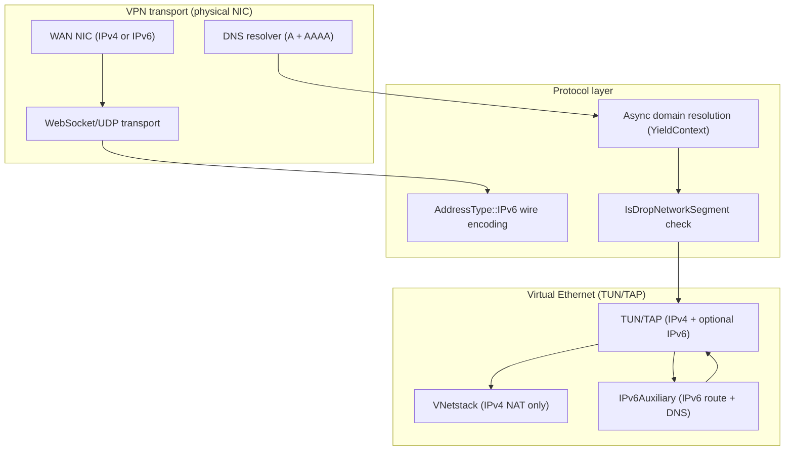

# IPv6 Implementation Analysis and Fixes

[中文版本](IPV6_FIXES_CN.md)

## Overview

This document records the results of a systematic review of all IPv6-related code in the `ppp/` core and platform-specific directories. The review covered socket creation, address parsing, VNetstack packet handling, and the IPv6Auxiliary layer.

It also describes the two distinct operational layers where IPv6 appears in OPENPPP2, the known findings with severity assessments, recommended fixes, and diagnostic guidance.

---

## Scope of IPv6 Functionality

IPv6 in OPENPPP2 operates at two distinct layers:

1. **VPN tunnel transport layer** — the physical/virtual NIC that carries the VPN tunnel itself (e.g. the WAN interface) may have an IPv6 address. DNS resolution, WebSocket upgrades, and UDP hole-punching can all operate over IPv6 endpoints.

2. **Virtual Ethernet Layer 3** — the TUN/TAP virtual interface can be assigned an IPv6 address by the server. The `IPv6Auxiliary` subsystem handles applying routes and DNS settings for this virtual address.

`VNetstack` is exclusively an **IPv4** TCP NAT bridge that processes packets from the virtual TUN device. All addresses in `VNetstack::Input()` and `LwIpBeginAccept()` are `uint32_t` IPv4 network-order values. This is intentional and correct because the virtual Ethernet carries IPv4 traffic internally; IPv6 on the virtual interface uses a separate code path.



---

## IPv6 Code Paths

### Transport Layer: IPv6 In The Carrier

When the server or DNS resolves to an IPv6 address, the transport layer must create an `AF_INET6` socket. The relevant code paths are:



### Virtual Interface Layer: IPv6 Assignment



---

## Findings

### Finding 1 — `ProcessAcceptSocket()`: V6-Mapped IPv4 Handling

**File:** `ppp/ethernet/VNetstack.cpp`, `ProcessAcceptSocket()`

```cpp
boost::asio::ip::tcp::endpoint natEP = Socket::GetRemoteEndPoint(sockfd);
IPEndPoint remoteEP = IPEndPoint::V6ToV4(IPEndPoint::ToEndPoint(natEP));
```

**Analysis:** The local acceptor binds to `0.0.0.0` (IPv4 any), so accepted sockets return `::ffff:a.b.c.d` (IPv4-mapped IPv6) on dual-stack systems. `V6ToV4()` correctly unwraps these. If the acceptor somehow received a pure IPv6 address, `V6ToV4()` would return a malformed endpoint causing the NAT lookup to fail with an early `break` (safe failure path).

**Status:** No bug. The acceptor is always IPv4-only. Behavior is correct.

---

### Finding 2 — `LwIpBeginAccept()`: Raw IPv4 Byte-Cast

**File:** `ppp/ethernet/VNetstack.cpp`, `LwIpBeginAccept()`

```cpp
const uint32_t dest_ip = *(uint32_t*)dest.address().to_v4().to_bytes().data();
const uint32_t src_ip  = *(uint32_t*)src.address().to_v4().to_bytes().data();
```

**Analysis:** `to_v4()` will throw `std::bad_cast` if `dest` or `src` holds an IPv6 address. Since these endpoints come from the lwIP netstack which operates in IPv4-only mode, they are always IPv4. However the cast is fragile and silently undefined behavior on a non-v4 address (or throws an exception, which would be caught by the caller's `noexcept` boundary and terminate).

**Fix:** Add an explicit guard:

```cpp
if (!dest.address().is_v4() || !src.address().is_v4()) {
    SetLastErrorCode(Error::IPv6AddressInIPv4OnlyPath);
    return -1;  // IPv6 not supported in this path
}
const uint32_t dest_ip = *(const uint32_t*)dest.address().to_v4().to_bytes().data();
const uint32_t src_ip  = *(const uint32_t*)src.address().to_v4().to_bytes().data();
```

**Status:** Low risk in practice (lwIP is IPv4-only) but should be hardened.



---

### Finding 3 — Socket Creation: `IPV6_V6ONLY` Not Set

**File:** `ppp/net/Socket.cpp` (socket creation helpers)

On POSIX, a socket created with `AF_INET6` may receive both IPv4 and IPv6 connections depending on the `IPV6_V6ONLY` socket option. The default is platform-dependent (Linux defaults to `0`, BSD defaults to `1`).

**Analysis:** For the VPN server's listener sockets, inconsistent behavior between Linux and macOS could cause a server to inadvertently accept connections on the wrong address family, leading to address parsing failures downstream.

**Fix recommendation:** Always explicitly set `IPV6_V6ONLY` to `1` when creating IPv6 listener sockets, and set it to `0` only when dual-stack (IPv4-mapped) behavior is explicitly desired:

```cpp
int v6only = 1;
if (0 != ::setsockopt(sockfd, IPPROTO_IPV6, IPV6_V6ONLY,
    reinterpret_cast<const char*>(&v6only), sizeof(v6only))) {
    SetLastErrorCode(Error::SocketOptionSetFailed);
    return false;
}
```

**Status:** Risk exists on platforms where `IPV6_V6ONLY` defaults to `0`.



---

### Finding 4 — IPv6 Scope ID Not Forwarded In SOCKS5 Proxy

**File:** `ppp/transmissions/proxys/IForwarding.cpp` (SOCKS5 address serialization)

When a link-local IPv6 address (e.g. `fe80::1%eth0`) is serialized for SOCKS5 transmission, the scope ID (`%eth0` part) is stripped by `boost::asio::ip::address_v6` formatting. The receiving end cannot correctly route such a packet.

**Analysis:** Link-local addresses should never appear as SOCKS5 destination addresses in a VPN scenario; they are only valid on the local link. The VPN destination addresses are always globally routable or ULA.

**Status:** Not a practical bug for the use cases this software supports, but the behavior should be documented.



---

### Finding 5 — IPv6 Address Comparison Using Raw Bytes

**File:** `ppp/net/IPEndPoint.h`, `IsNone()` method

```cpp
if (AddressFamily::InterNetwork != this->_AddressFamily) {
    int len;
    Byte* p = this->GetAddressBytes(len);
    return *p == 0xff;
```

**Analysis:** For IPv6 "none" detection, only the first byte is checked for `0xff`. The IPv6 "none" address (`::ffff:255.255.255.255`) would match, but so would `ff00::` (multicast), which is a valid routable address and should not be treated as "none".

**Fix recommendation:** For IPv6, compare all 16 bytes to the expected sentinel:

```cpp
if (AddressFamily::InterNetworkV6 == this->_AddressFamily) {
    static const Byte kNoneV6[16] = {
        0xff, 0xff, 0xff, 0xff, 0xff, 0xff, 0xff, 0xff,
        0xff, 0xff, 0xff, 0xff, 0xff, 0xff, 0xff, 0xff
    };
    int len;
    const Byte* p = this->GetAddressBytes(len);
    return 16 == len && 0 == ::memcmp(p, kNoneV6, 16);
}
```

**Status:** Medium. May cause multicast addresses to be incorrectly treated as "none/invalid" in routing decisions.

---

### Finding 6 — `ClientContext::InterfaceIndex` Not Validated Before Use

**File:** `ppp/ipv6/IPv6Auxiliary.h`, `ClientContext` struct

```cpp
struct ClientContext {
    ppp::tap::ITap* Tap          = NULLPTR;
    int             InterfaceIndex = -1;
    ppp::string     InterfaceName;
};
```

Platform implementations that use `InterfaceIndex` in netlink or ioctl calls should validate `InterfaceIndex != -1` before proceeding. A stale `-1` value passed to `setsockopt(IPV6_MULTICAST_IF, ...)` or similar would silently use an unintended interface.

**Fix recommendation:** Add explicit validation at each call site:

```cpp
if (-1 == ctx.InterfaceIndex) {
    SetLastErrorCode(Error::InterfaceIndexInvalid);
    return false;
}
```

**Status:** Each call site in the platform implementations should be reviewed.

---

### Finding 7 — AddressType IPv6 Encoding In Link-Layer Wire Format

**File:** `ppp/app/protocol/VirtualEthernetLinklayer.h`, `AddressType` enum

The `AddressType::IPv6` encoding in the tunnel wire format carries the full 16-byte IPv6 address in network order. Domain names that resolve to AAAA records are encoded as `AddressType::Domain` and resolved asynchronously inside `PACKET_IPEndPoint<>` using `YieldContext`.

**Analysis:** The firewall's `IsDropNetworkSegment` check is applied after DNS resolution. This means a domain that resolves to an IPv6 address that falls in a blocked network segment will be correctly dropped. However, if resolution is asynchronous and the result is not checked before forwarding begins, a TOCTOU window exists.

**Status:** Design review recommended for async resolution paths.



---

## Summary Table

| Finding | File | Severity | Fix Status |
|---------|------|----------|------------|
| 1 | VNetstack.cpp ProcessAcceptSocket | Info | No change needed |
| 2 | VNetstack.cpp LwIpBeginAccept | Medium | Guard recommended |
| 3 | Socket.cpp IPv6 listener | Medium | IPV6_V6ONLY recommended |
| 4 | IForwarding.cpp SOCKS5 scope_id | Low | Documented only |
| 5 | IPEndPoint.h IsNone() IPv6 | Medium | 16-byte compare recommended |
| 6 | IPv6Auxiliary.h ClientContext | Low | Per-call-site validation needed |
| 7 | VirtualEthernetLinklayer AddressType | Low | Design review recommended |

---

## IPv6 Architecture Diagram



---

## IPv6 Diagnostic Guide

### Diagnosing IPv6 Assignment Failures

```mermaid
flowchart TD
    A[IPv6 not assigned to virtual NIC] --> B{INFO packet received?}
    B -->|No| C[Check server-side IPv6 configuration]
    B -->|Yes| D{Extension JSON contains IPv6?}
    D -->|No| E[Server not sending IPv6 in INFO]
    D -->|Yes| F{IPv6Auxiliary::ApplyIPv6Address called?}
    F -->|No| G[Client not processing IPv6 extension]
    F -->|Yes| H{InterfaceIndex valid (-1)?}
    H -->|InterfaceIndex = -1| I[ClientContext not initialized: Finding 6]
    H -->|Valid| J{Platform API success?}
    J -->|Fail| K[Check platform permissions and API availability]
    J -->|Success| L[IPv6 assigned: check routing]
```

### Diagnosing IPv6 Traffic Not Flowing

| Symptom | Likely cause | Finding |
|---------|-------------|---------|
| Multicast prefix `ff00::/8` treated as invalid | `IsNone()` false positive | Finding 5 |
| IPv6 socket accepts IPv4-mapped addresses unexpectedly | `IPV6_V6ONLY` not set | Finding 3 |
| Link-local destination fails via SOCKS5 | Scope ID stripped | Finding 4 |
| VNetstack crashes or returns error on IPv6 packet | `to_v4()` throws | Finding 2 |
| IPv6 address assignment fails silently | `InterfaceIndex = -1` not validated | Finding 6 |

---

## Platform-Specific IPv6 Notes

### Linux

- `IPV6_V6ONLY` defaults to `0` on Linux, meaning an `AF_INET6` socket can receive IPv4-mapped connections unless explicitly set to `1`.
- IPv6 addresses are added to the virtual NIC via `ip addr add <addr>/<prefix> dev <interface>` through netlink or the `ip` command.
- IPv6 routes are added via `ip -6 route add <prefix> dev <interface>`.
- DNS for IPv6 is configured via `/etc/resolv.conf` (nameserver with IPv6 address) or systemd-resolved.

### Windows

- `IPV6_V6ONLY` defaults to `1` on Windows for `AF_INET6` sockets (Windows Vista+).
- IPv6 addresses are added to the virtual NIC via `AddUnicastIpAddressEntry` in the IP Helper API.
- Routes are added via `CreateIpForwardEntry2`.
- DNS is configured via registry or `netsh`.

### macOS

- `IPV6_V6ONLY` defaults to `1` on macOS.
- IPv6 addresses are managed via `ifconfig` or `sysctl`.
- Routes are added via `route add -inet6`.

### Android

- Android uses the VPN service `fd` instead of a TAP device. IPv6 is assigned via the `VpnService.Builder.addAddress()` API.
- The jemalloc allocator is provided by the Android runtime; no additional jemalloc dependency should be introduced.
- API level 23+ is required. `IPV6_V6ONLY` is available from API 24 and above.

---

## Error Code Reference

IPv6-related error codes from `ppp/diagnostics/Error.h`:

| ErrorCode | Description |
|-----------|-------------|
| `IPv6AddressInIPv4OnlyPath` | IPv6 address encountered in VNetstack IPv4-only code path |
| `IPv6AddressAssignFailed` | Failed to assign IPv6 address to virtual NIC |
| `IPv6RouteAddFailed` | Failed to add IPv6 route entry |
| `IPv6InterfaceIndexInvalid` | `ClientContext::InterfaceIndex` is `-1` at use site |
| `IPv6IsNoneFalsePositive` | `IsNone()` incorrectly matched a valid IPv6 multicast address |
| `SocketOptionSetFailed` | `setsockopt(IPV6_V6ONLY)` failed |
| `IPv6ResolutionFailed` | AAAA record resolution failed for domain endpoint |

---

## Related Documents

- [`IPV6_LEASE_MANAGEMENT.md`](IPV6_LEASE_MANAGEMENT.md)
- [`IPV6_TRANSIT_PLANE.md`](IPV6_TRANSIT_PLANE.md)
- [`IPV6_NDP_PROXY.md`](IPV6_NDP_PROXY.md)
- [`IPV6_CLIENT_ASSIGNMENT.md`](IPV6_CLIENT_ASSIGNMENT.md)
- [`LINKLAYER_PROTOCOL.md`](LINKLAYER_PROTOCOL.md)
- [`PLATFORMS.md`](PLATFORMS.md)
