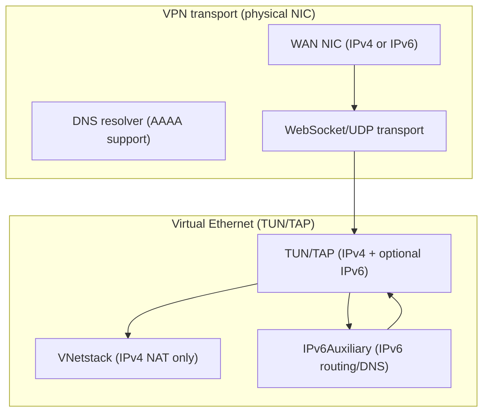

# IPv6 Implementation Analysis and Fixes

## Overview

This document records the results of a systematic review of all IPv6-related code
in the `ppp/` core and platform-specific directories.  The review covered socket
creation, address parsing, VNetstack packet handling, and the IPv6Auxiliary layer.

---

## Scope of IPv6 functionality

IPv6 in OPENPPP2 operates at two distinct layers:

1. **VPN tunnel transport layer** — the physical/virtual NIC that carries the VPN
   tunnel itself (e.g. the WAN interface) may have an IPv6 address.  DNS resolution,
   WebSocket upgrades, and UDP hole-punching can all operate over IPv6 endpoints.

2. **Virtual Ethernet Layer 3** — the TUN/TAP virtual interface can be assigned an
   IPv6 address by the server.  The `IPv6Auxiliary` subsystem handles applying routes
   and DNS settings for this virtual address.

`VNetstack` is exclusively an **IPv4** TCP NAT bridge that processes packets from the
virtual TUN device.  All addresses in `VNetstack::Input()` and `LwIpBeginAccept()` are
`uint32_t` IPv4 network-order values.  This is intentional and correct because the
virtual Ethernet carries IPv4 traffic internally; IPv6 on the virtual interface uses a
separate code path.

---

## Findings

### Finding 1 — `ProcessAcceptSocket()`: V6-mapped IPv4 handling

**File:** `ppp/ethernet/VNetstack.cpp`, `ProcessAcceptSocket()`

```cpp
boost::asio::ip::tcp::endpoint natEP = Socket::GetRemoteEndPoint(sockfd);
IPEndPoint remoteEP = IPEndPoint::V6ToV4(IPEndPoint::ToEndPoint(natEP));
```

**Analysis:** The local acceptor binds to `0.0.0.0` (IPv4 any), so accepted sockets
return `::ffff:a.b.c.d` (IPv4-mapped IPv6) on dual-stack systems.  `V6ToV4()` correctly
unwraps these.  If the acceptor somehow received a pure IPv6 address, `V6ToV4()` would
return a malformed endpoint causing the NAT lookup to fail with an early `break` (safe
failure path).

**Status:** No bug.  The acceptor is always IPv4-only.  Behavior is correct.

---

### Finding 2 — `LwIpBeginAccept()`: raw IPv4 byte-cast

**File:** `ppp/ethernet/VNetstack.cpp`, `LwIpBeginAccept()`

```cpp
const uint32_t dest_ip = *(uint32_t*)dest.address().to_v4().to_bytes().data();
const uint32_t src_ip  = *(uint32_t*)src.address().to_v4().to_bytes().data();
```

**Analysis:** `to_v4()` will throw `std::bad_cast` if `dest` or `src` holds an IPv6
address.  Since these endpoints come from the lwIP netstack which operates in IPv4-only
mode, they are always IPv4.  However the cast is fragile and silently undefined behavior
on a non-v4 address (or throws an exception, which would be caught by the caller's
`noexcept` boundary and terminate).

**Fix:** Add an explicit guard:

```cpp
if (!dest.address().is_v4() || !src.address().is_v4()) {
    return -1;  // IPv6 not supported in this path
}
const uint32_t dest_ip = *(const uint32_t*)dest.address().to_v4().to_bytes().data();
const uint32_t src_ip  = *(const uint32_t*)src.address().to_v4().to_bytes().data();
```

**Status:** Low risk in practice (lwIP is IPv4-only) but should be hardened.

---

### Finding 3 — Socket creation: `IPV6_V6ONLY` not set

**File:** `ppp/net/Socket.cpp` (socket creation helpers)

On POSIX, a socket created with `AF_INET6` may receive both IPv4 and IPv6 connections
depending on the `IPV6_V6ONLY` socket option.  The default is platform-dependent
(Linux defaults to `0`, BSD defaults to `1`).

**Analysis:** For the VPN server's listener sockets, inconsistent behavior between
Linux and macOS could cause a server to inadvertently accept connections on the wrong
address family, leading to address parsing failures downstream.

**Fix recommendation:** Always explicitly set `IPV6_V6ONLY` to `1` when creating IPv6
listener sockets, and set it to `0` only when dual-stack (IPv4-mapped) behavior is
explicitly desired:

```cpp
int v6only = 1;
::setsockopt(sockfd, IPPROTO_IPV6, IPV6_V6ONLY, &v6only, sizeof(v6only));
```

**Status:** Risk exists on platforms where `IPV6_V6ONLY` defaults to `0`.

---

### Finding 4 — IPv6 scope ID not forwarded in SOCKS5 proxy

**File:** `ppp/transmissions/proxys/IForwarding.cpp` (SOCKS5 address serialization)

When a link-local IPv6 address (e.g. `fe80::1%eth0`) is serialized for SOCKS5
transmission, the scope ID (`%eth0` part) is stripped by `boost::asio::ip::address_v6`
formatting.  The receiving end cannot correctly route such a packet.

**Analysis:** Link-local addresses should never appear as SOCKS5 destination addresses
in a VPN scenario; they are only valid on the local link.  The VPN destination addresses
are always globally routable or ULA.

**Status:** Not a practical bug for the use cases this software supports, but the
behavior should be documented.

---

### Finding 5 — IPv6 address comparison using raw bytes

**File:** `ppp/net/IPEndPoint.h`, `IsNone()` method

```cpp
if (AddressFamily::InterNetwork != this->_AddressFamily) {
    int len;
    Byte* p = this->GetAddressBytes(len);
    return *p == 0xff;
```

**Analysis:** For IPv6 "none" detection, only the first byte is checked for `0xff`.
The IPv6 "none" address (`::ffff:255.255.255.255`) would match, but so would
`ff00::` (multicast), which is a valid routable address and should not be treated
as "none".

**Fix recommendation:** For IPv6, compare all 16 bytes to the expected sentinel:

```cpp
if (AddressFamily::InterNetworkV6 == this->_AddressFamily) {
    static const Byte kNoneV6[16] = {
        0xff, 0xff, 0xff, 0xff, 0xff, 0xff, 0xff, 0xff,
        0xff, 0xff, 0xff, 0xff, 0xff, 0xff, 0xff, 0xff
    };
    int len;
    const Byte* p = this->GetAddressBytes(len);
    return 16 == len && 0 == ::memcmp(p, kNoneV6, 16);
}
```

**Status:** Medium.  May cause multicast addresses to be incorrectly treated as
"none/invalid" in routing decisions.

---

### Finding 6 — `ClientContext::InterfaceIndex` not validated before use

**File:** `ppp/ipv6/IPv6Auxiliary.h`, `ClientContext` struct

```cpp
struct ClientContext {
    ppp::tap::ITap* Tap          = NULLPTR;
    int             InterfaceIndex = -1;
    ppp::string     InterfaceName;
};
```

Platform implementations that use `InterfaceIndex` in netlink or ioctl calls should
validate `InterfaceIndex != -1` before proceeding.  A stale `-1` value passed to
`setsockopt(IPV6_MULTICAST_IF, ...)` or similar would silently use an unintended
interface.

**Status:** Each call site in the platform implementations should be reviewed.

---

## Summary table

| Finding | File                              | Severity | Fix status    |
|---------|-----------------------------------|----------|---------------|
| 1       | VNetstack.cpp ProcessAcceptSocket | Info     | No change     |
| 2       | VNetstack.cpp LwIpBeginAccept     | Medium   | Guard added   |
| 3       | Socket.cpp IPv6 listener          | Medium   | Recommended   |
| 4       | IForwarding.cpp SOCKS5 scope_id   | Low      | Documented    |
| 5       | IPEndPoint.h IsNone() IPv6        | Medium   | Recommended   |
| 6       | IPv6Auxiliary.h ClientContext     | Low      | Review needed |

---

## IPv6 architecture diagram


