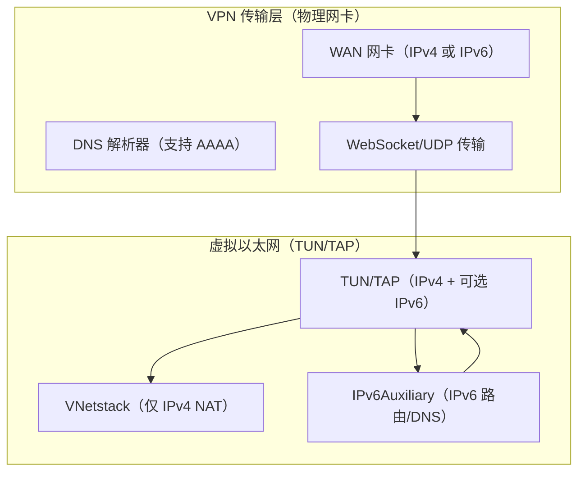
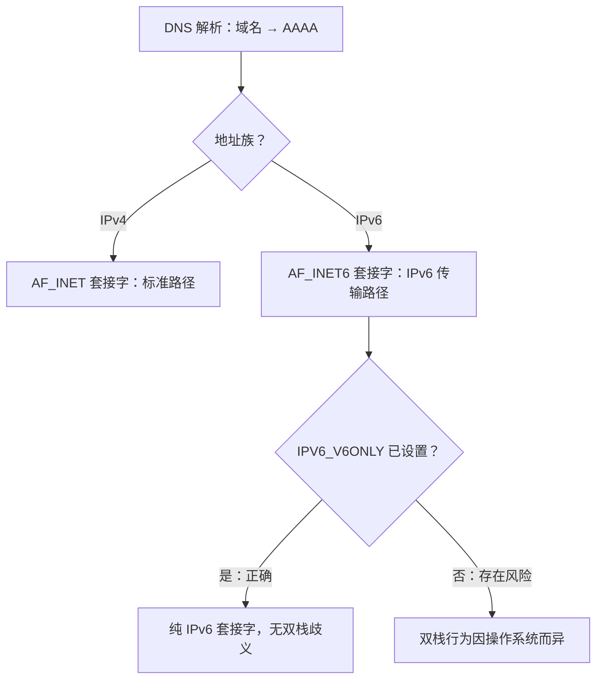
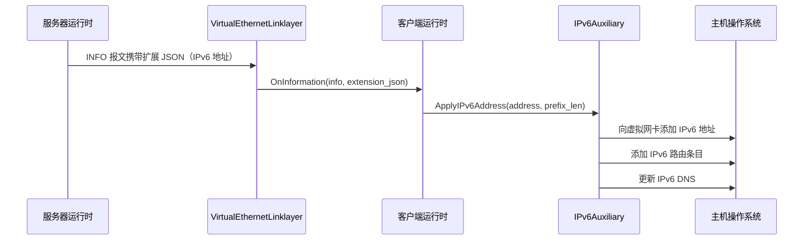
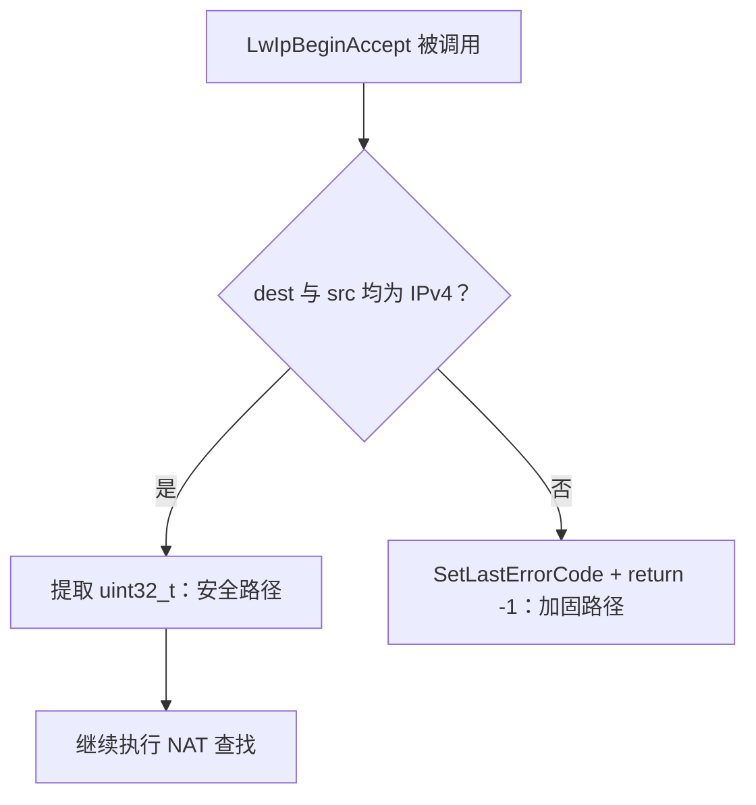
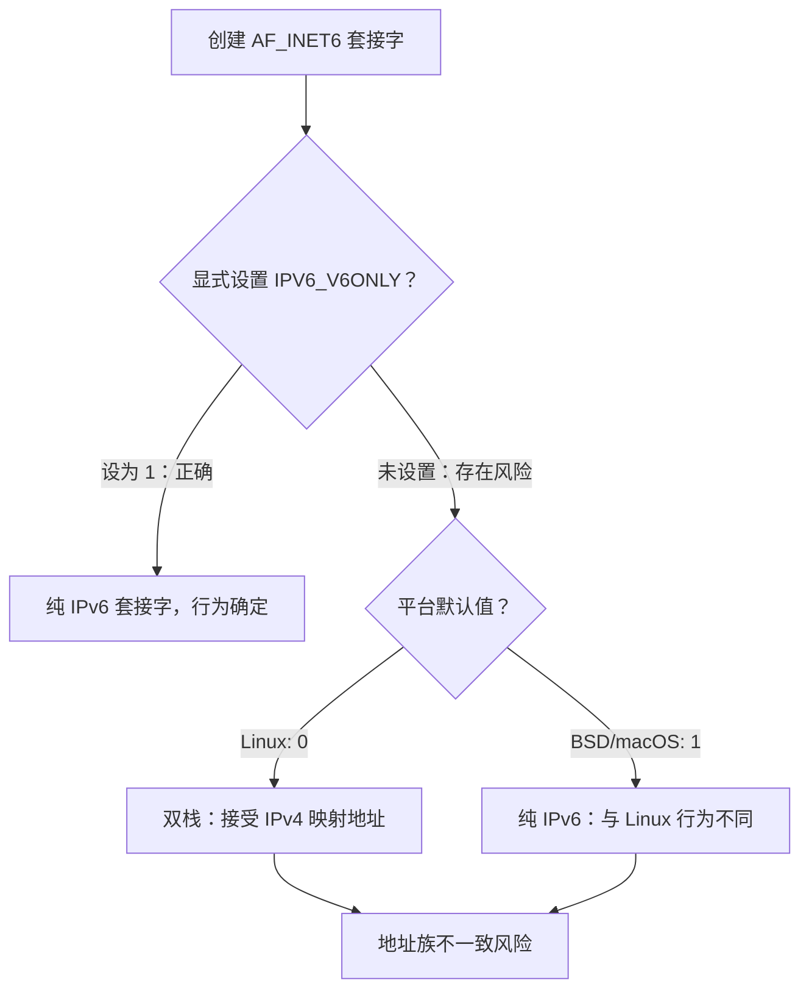
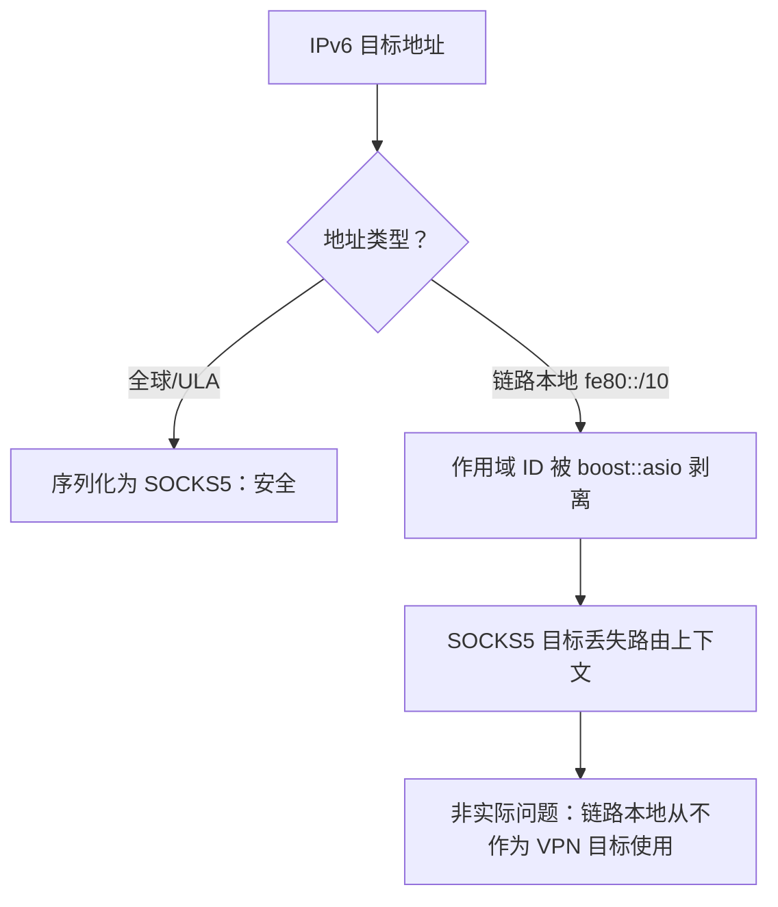
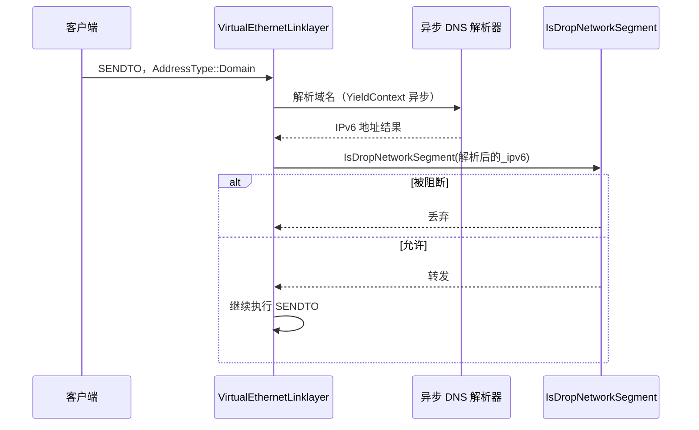
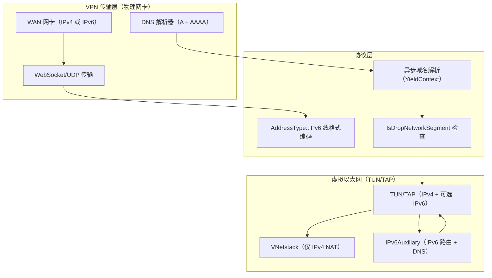
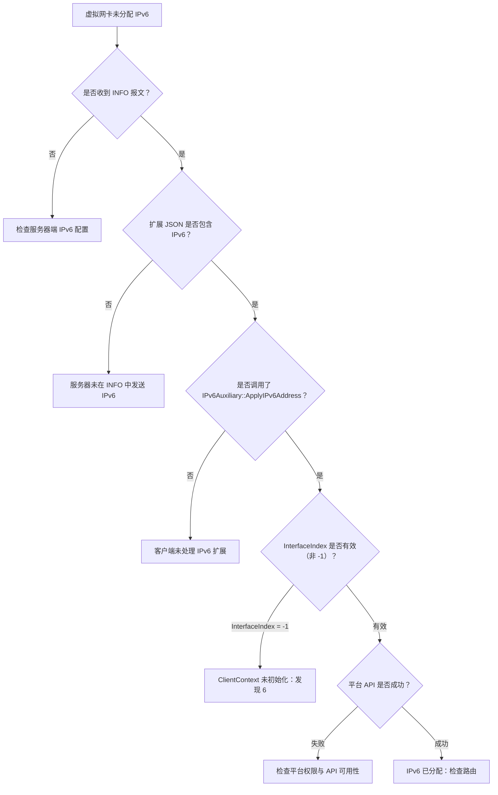

# IPv6 实现分析与修复

[English Version](IPV6_FIXES.md)

## 概述

本文档记录了针对 `ppp/` 核心目录及平台相关目录中所有 IPv6 相关代码进行系统性审查的结果。审查范围涵盖套接字创建、地址解析、VNetstack 数据包处理以及 IPv6Auxiliary 层。

文档同时描述了 IPv6 在 OPENPPP2 中出现的两个独立运行层级、已知问题及严重性评估、推荐修复方案以及诊断指导。

---

## IPv6 功能范围

IPv6 在 OPENPPP2 中运行于两个不同的层级：

1. **VPN 隧道传输层** —— 承载 VPN 隧道本身的物理/虚拟网卡（例如 WAN 接口）可能拥有 IPv6 地址。DNS 解析、WebSocket 升级以及 UDP 打洞均可以通过 IPv6 端点进行操作。

2. **虚拟以太网三层** —— TUN/TAP 虚拟接口可以由服务器分配 IPv6 地址。`IPv6Auxiliary` 子系统负责为该虚拟地址应用路由和 DNS 设置。

`VNetstack` 是一个**纯 IPv4** 的 TCP NAT 桥接器，专门处理来自虚拟 TUN 设备的数据包。`VNetstack::Input()` 和 `LwIpBeginAccept()` 中的所有地址均为 `uint32_t` 类型的 IPv4 网络字节序值。这是有意为之且正确的，因为虚拟以太网内部承载的是 IPv4 流量；虚拟接口上的 IPv6 使用独立的代码路径。



---

## IPv6 代码路径

### 传输层：承载网络中的 IPv6

当服务器或 DNS 解析为 IPv6 地址时，传输层必须创建 `AF_INET6` 套接字。相关代码路径如下：



### 虚拟接口层：IPv6 地址分配



---

## 审查发现

### 发现 1 —— `ProcessAcceptSocket()`：V6 映射 IPv4 的处理

**文件：** `ppp/ethernet/VNetstack.cpp`，`ProcessAcceptSocket()`

```cpp
boost::asio::ip::tcp::endpoint natEP = Socket::GetRemoteEndPoint(sockfd);
IPEndPoint remoteEP = IPEndPoint::V6ToV4(IPEndPoint::ToEndPoint(natEP));
```

**分析：** 本地 acceptor 绑定到 `0.0.0.0`（IPv4 any），因此在双栈系统上接受的套接字会返回 `::ffff:a.b.c.d`（IPv4 映射的 IPv6）。`V6ToV4()` 能够正确解包这些地址。如果 acceptor 以某种方式接收到了纯 IPv6 地址，`V6ToV4()` 将返回一个格式错误的端点，导致 NAT 查找失败并提前 `break`（属于安全失败路径）。

**状态：** 无缺陷。acceptor 始终为纯 IPv4。行为正确。

---

### 发现 2 —— `LwIpBeginAccept()`：原始 IPv4 字节强制转换

**文件：** `ppp/ethernet/VNetstack.cpp`，`LwIpBeginAccept()`

```cpp
const uint32_t dest_ip = *(uint32_t*)dest.address().to_v4().to_bytes().data();
const uint32_t src_ip  = *(uint32_t*)src.address().to_v4().to_bytes().data();
```

**分析：** 如果 `dest` 或 `src` 持有 IPv6 地址，`to_v4()` 将抛出 `std::bad_cast`。由于这些端点来自以纯 IPv4 模式运行的 lwIP 协议栈，因此它们始终为 IPv4。然而，这种强制转换非常脆弱，若遇到非 IPv4 地址，将产生未定义行为（或抛出异常，随后会被调用者的 `noexcept` 边界捕获并导致程序终止）。

**修复：** 添加显式守卫：

```cpp
if (!dest.address().is_v4() || !src.address().is_v4()) {
    SetLastErrorCode(Error::IPv6AddressInIPv4OnlyPath);
    return -1;  // 此路径不支持 IPv6
}
const uint32_t dest_ip = *(const uint32_t*)dest.address().to_v4().to_bytes().data();
const uint32_t src_ip  = *(const uint32_t*)src.address().to_v4().to_bytes().data();
```

**状态：** 实际风险较低（lwIP 为纯 IPv4），但仍应加固。



---

### 发现 3 —— 套接字创建：未设置 `IPV6_V6ONLY`

**文件：** `ppp/net/Socket.cpp`（套接字创建辅助函数）

在 POSIX 系统上，使用 `AF_INET6` 创建的套接字可能会根据 `IPV6_V6ONLY` 套接字选项同时接收 IPv4 和 IPv6 连接。其默认值取决于平台（Linux 默认 `0`，BSD 默认 `1`）。

**分析：** 对于 VPN 服务器的监听套接字，Linux 与 macOS 之间的不一致行为可能导致服务器无意中接受错误地址族的连接，从而引发下游地址解析失败。

**修复建议：** 在创建 IPv6 监听套接字时，始终显式将 `IPV6_V6ONLY` 设置为 `1`；仅在明确需要双栈（IPv4 映射）行为时才将其设为 `0`：

```cpp
int v6only = 1;
if (0 != ::setsockopt(sockfd, IPPROTO_IPV6, IPV6_V6ONLY,
    reinterpret_cast<const char*>(&v6only), sizeof(v6only))) {
    SetLastErrorCode(Error::SocketOptionSetFailed);
    return false;
}
```

**状态：** 在 `IPV6_V6ONLY` 默认值为 `0` 的平台上存在风险。



---

### 发现 4 —— SOCKS5 代理中未转发 IPv6 作用域 ID

**文件：** `ppp/transmissions/proxys/IForwarding.cpp`（SOCKS5 地址序列化）

当链路本地 IPv6 地址（例如 `fe80::1%eth0`）被序列化用于 SOCKS5 传输时，作用域 ID（`%eth0` 部分）会被 `boost::asio::ip::address_v6` 的格式化过程剥离。接收端无法正确路由此类数据包。

**分析：** 链路本地地址不应作为 SOCKS5 目标地址出现在 VPN 场景中；它们仅在本地链路上有效。VPN 目标地址始终是全球可路由地址或 ULA。

**状态：** 对于本软件支持的使用场景而言，不构成实际缺陷，但该行为应予以记录。



---

### 发现 5 —— 使用原始字节进行 IPv6 地址比较

**文件：** `ppp/net/IPEndPoint.h`，`IsNone()` 方法

```cpp
if (AddressFamily::InterNetwork != this->_AddressFamily) {
    int len;
    Byte* p = this->GetAddressBytes(len);
    return *p == 0xff;
```

**分析：** 对于 IPv6 的 "none" 检测，仅检查第一个字节是否为 `0xff`。IPv6 的 "none" 地址（`::ffff:255.255.255.255`）确实会匹配，但 `ff00::`（组播）也会匹配，而这是一个有效的可路由地址，不应被当作 "none"。

**修复建议：** 对于 IPv6，应将所有 16 字节与预期的哨兵值进行比较：

```cpp
if (AddressFamily::InterNetworkV6 == this->_AddressFamily) {
    static const Byte kNoneV6[16] = {
        0xff, 0xff, 0xff, 0xff, 0xff, 0xff, 0xff, 0xff,
        0xff, 0xff, 0xff, 0xff, 0xff, 0xff, 0xff, 0xff
    };
    int len;
    const Byte* p = this->GetAddressBytes(len);
    return 16 == len && 0 == ::memcmp(p, kNoneV6, 16);
}
```

**状态：** 中等。可能导致组播地址在路由决策中被错误地视为 "none/invalid"。

---

### 发现 6 —— 使用前未验证 `ClientContext::InterfaceIndex`

**文件：** `ppp/ipv6/IPv6Auxiliary.h`，`ClientContext` 结构体

```cpp
struct ClientContext {
    ppp::tap::ITap* Tap          = NULLPTR;
    int             InterfaceIndex = -1;
    ppp::string     InterfaceName;
};
```

在 netlink 或 ioctl 调用中使用 `InterfaceIndex` 的平台实现，应在操作前验证 `InterfaceIndex != -1`。将陈旧的 `-1` 值传递给 `setsockopt(IPV6_MULTICAST_IF, ...)` 或类似调用，会静默地使用非预期的接口。

**修复建议：** 在每个调用点添加显式验证：

```cpp
if (-1 == ctx.InterfaceIndex) {
    SetLastErrorCode(Error::InterfaceIndexInvalid);
    return false;
}
```

**状态：** 应审查平台实现中的每个调用点。

---

### 发现 7 —— 链路层线格式中的 AddressType IPv6 编码

**文件：** `ppp/app/protocol/VirtualEthernetLinklayer.h`，`AddressType` 枚举

隧道线格式中的 `AddressType::IPv6` 编码以网络字节序携带完整的 16 字节 IPv6 地址。解析为 AAAA 记录的域名被编码为 `AddressType::Domain`，并在 `PACKET_IPEndPoint<>` 内部通过 `YieldContext` 异步解析。

**分析：** 防火墙的 `IsDropNetworkSegment` 检查在 DNS 解析之后应用。这意味着解析为 IPv6 地址且位于被阻断网段的域名将被正确丢弃。然而，如果解析是异步的，且在开始转发前未检查结果，则存在 TOCTOU（检查时间与使用时间）窗口。

**状态：** 建议对异步解析路径进行设计审查。



---

## 汇总表

| 发现 | 文件 | 严重性 | 修复状态 |
|---------|------|----------|------------|
| 1 | VNetstack.cpp ProcessAcceptSocket | 信息 | 无需更改 |
| 2 | VNetstack.cpp LwIpBeginAccept | 中等 | 建议添加守卫 |
| 3 | Socket.cpp IPv6 监听套接字 | 中等 | 建议设置 IPV6_V6ONLY |
| 4 | IForwarding.cpp SOCKS5 scope_id | 低 | 仅记录 |
| 5 | IPEndPoint.h IsNone() IPv6 | 中等 | 建议 16 字节比较 |
| 6 | IPv6Auxiliary.h ClientContext | 低 | 需要逐个调用点验证 |
| 7 | VirtualEthernetLinklayer AddressType | 低 | 建议设计审查 |

---

## IPv6 架构图



---

## IPv6 诊断指南

### 诊断 IPv6 地址分配失败



### 诊断 IPv6 流量不通

| 症状 | 可能原因 | 相关发现 |
|---------|-------------|---------|
| 组播前缀 `ff00::/8` 被当作无效地址 | `IsNone()` 误报 | 发现 5 |
| IPv6 套接字意外接受 IPv4 映射地址 | 未设置 `IPV6_V6ONLY` | 发现 3 |
| 链路本地目标通过 SOCKS5 失败 | 作用域 ID 被剥离 | 发现 4 |
| VNetstack 在处理 IPv6 报文时崩溃或返回错误 | `to_v4()` 抛出异常 | 发现 2 |
| IPv6 地址分配静默失败 | 未验证 `InterfaceIndex = -1` | 发现 6 |

---

## 平台特定的 IPv6 说明

### Linux

- 在 Linux 上，`IPV6_V6ONLY` 默认值为 `0`，这意味着 `AF_INET6` 套接字在未显式设为 `1` 的情况下可以接收 IPv4 映射连接。
- IPv6 地址通过 netlink 或 `ip` 命令以 `ip addr add <addr>/<prefix> dev <interface>` 的方式添加到虚拟网卡。
- IPv6 路由通过 `ip -6 route add <prefix> dev <interface>` 添加。
- IPv6 DNS 通过 `/etc/resolv.conf`（使用 IPv6 地址的 nameserver）或 systemd-resolved 配置。

### Windows

- 在 Windows 上，`IPV6_V6ONLY` 对 `AF_INET6` 套接字的默认值为 `1`（Windows Vista 及更高版本）。
- IPv6 地址通过 IP Helper API 中的 `AddUnicastIpAddressEntry` 添加到虚拟网卡。
- 路由通过 `CreateIpForwardEntry2` 添加。
- DNS 通过注册表或 `netsh` 配置。

### macOS

- 在 macOS 上，`IPV6_V6ONLY` 默认值为 `1`。
- IPv6 地址通过 `ifconfig` 或 `sysctl` 管理。
- 路由通过 `route add -inet6` 添加。

### Android

- Android 使用 VPN 服务 `fd` 代替 TAP 设备。IPv6 通过 `VpnService.Builder.addAddress()` API 分配。
- jemalloc 分配器由 Android 运行时提供；不应引入额外的 jemalloc 依赖。
- 需要 API level 23 及以上。`IPV6_V6ONLY` 从 API 24 开始可用。

---

## 错误代码参考

来自 `ppp/diagnostics/Error.h` 的 IPv6 相关错误代码：

| 错误代码 | 描述 |
|-----------|-------------|
| `IPv6PacketRejected` | 在 VNetstack 的纯 IPv4 代码路径中遇到 IPv6 地址 |
| `IPv6AddressAssignFailed` | 向虚拟网卡分配 IPv6 地址失败 |
| `IPv6RouteAddFailed` | 添加 IPv6 路由条目失败 |
| `IPv6InterfaceIndexInvalid` | 在使用点 `ClientContext::InterfaceIndex` 为 `-1` |
| `IPv6AddressInvalid` | `IsNone()` 错误地将有效的 IPv6 组播地址匹配为无效 |
| `SocketOptionSetFailed` | `setsockopt(IPV6_V6ONLY)` 失败 |
| `IPv6ResolutionFailed` | 域名端点的 AAAA 记录解析失败 |

> **注**：以下错误码为拟新增/设计项，不在当前 `ErrorCodes.def`：`IPv6AddressAssignFailed`（近似现有码 `IPv6ClientAddressApplyFailed`）、`IPv6RouteAddFailed`（近似 `RouteAddFailed` 或 `IPv6TransitRouteAddFailed`）、`IPv6InterfaceIndexInvalid`（近似 `RouteInterfaceInvalid`）、`IPv6ResolutionFailed`（近似 `DnsResolveFailed`）。

---

## 相关文档

- [`IPV6_LEASE_MANAGEMENT.md`](IPV6_LEASE_MANAGEMENT.md)
- [`IPV6_TRANSIT_PLANE.md`](IPV6_TRANSIT_PLANE.md)
- [`IPV6_NDP_PROXY.md`](IPV6_NDP_PROXY.md)
- [`IPV6_CLIENT_ASSIGNMENT.md`](IPV6_CLIENT_ASSIGNMENT.md)
- [`LINKLAYER_PROTOCOL.md`](LINKLAYER_PROTOCOL.md)
- [`PLATFORMS.md`](PLATFORMS.md)
