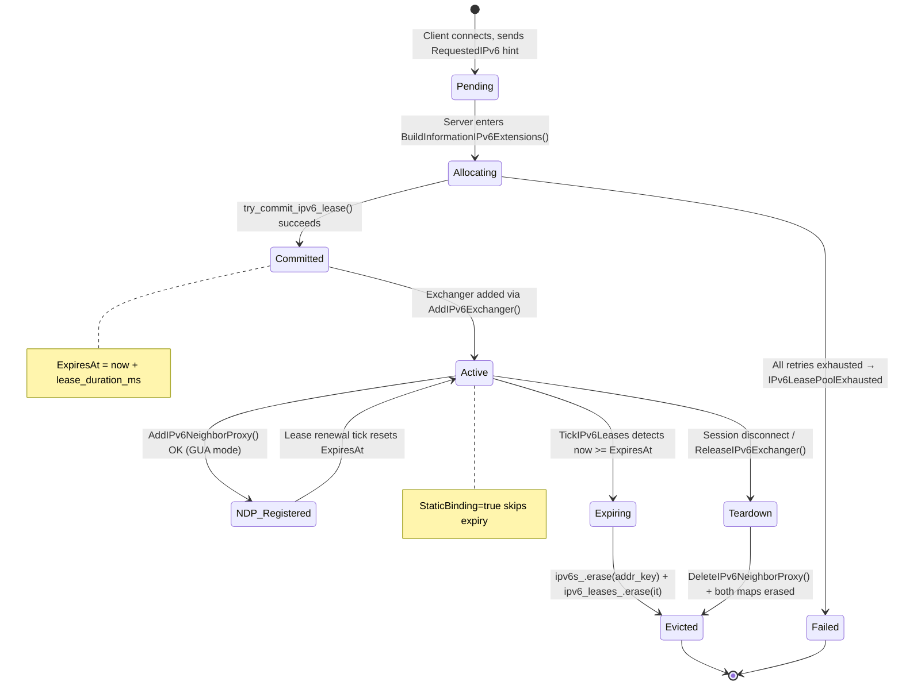
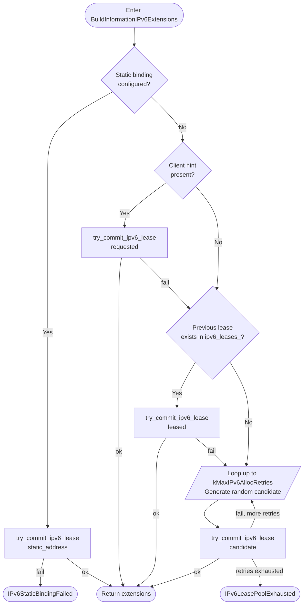
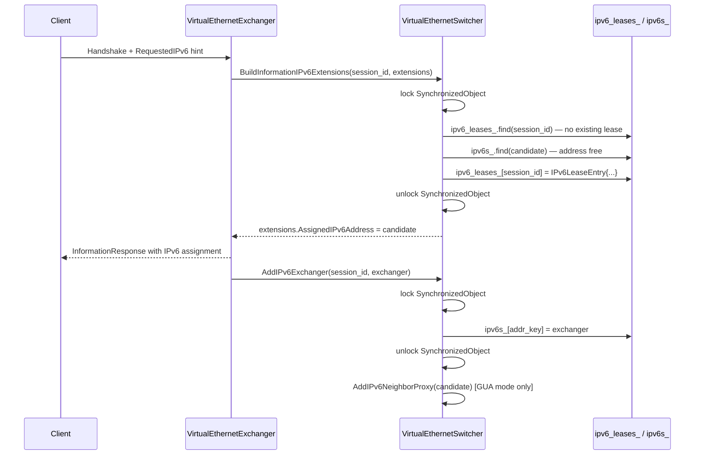
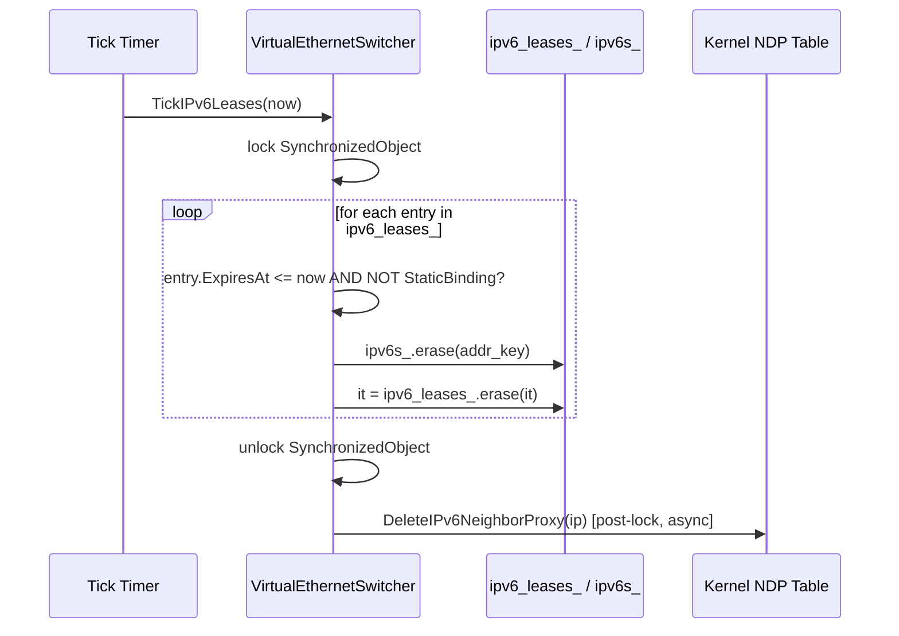

# IPv6 Lease Management

> **Subsystem:** `ppp::app::server::VirtualEthernetSwitcher`  
> **Primary file:** `ppp/app/server/VirtualEthernetSwitcher.cpp`  
> **Header:** `ppp/app/server/VirtualEthernetSwitcher.h`  
> **Introduced:** Core IPv6 pool (lines 396–695, 3144–3219 in `.cpp`)

---

## Table of Contents

1. [Overview](#1-overview)
2. [Data Structures](#2-data-structures)
3. [Lease Lifecycle State Machine](#3-lease-lifecycle-state-machine)
4. [Address Allocation Algorithm](#4-address-allocation-algorithm)
5. [Concurrent Access and Race Conditions](#5-concurrent-access-and-race-conditions)
6. [Expiry and Eviction: TickIPv6Leases](#6-expiry-and-eviction-tickipv6leases)
7. [Erase-Bug Fix Rationale](#7-erase-bug-fix-rationale)
8. [Sequence Diagrams](#8-sequence-diagrams)
9. [Error Codes](#9-error-codes)
10. [Configuration Reference](#10-configuration-reference)
11. [Operational Notes](#11-operational-notes)
12. [Appendix: Full try_commit_ipv6_lease Logic](#appendix-full-try_commit_ipv6_lease-logic)

---

## 1. Overview

The IPv6 lease management subsystem is responsible for assigning, tracking, renewing, expiring, and evicting IPv6 addresses that are handed to VPN clients. Unlike the IPv4 NAT table — which is driven by a simple hash on the 32-bit address — IPv6 requires a two-dimensional tracking structure:

- **`ipv6_leases_`** — maps a session ID (`Int128`) → `IPv6LeaseEntry`, recording the address currently bound to each session along with an expiry deadline.
- **`ipv6s_`** — maps a canonical address key (`ppp::string`) → `shared_ptr<VirtualEthernetExchanger>`, providing the reverse lookup from address to the live exchanger instance.

Both tables live inside `VirtualEthernetSwitcher` and are protected by the switcher's primary synchronized object (the same `SynchronizedObject` that guards the IPv4 NAT table). They must always be consistent: every entry in `ipv6_leases_` must have a corresponding entry in `ipv6s_`, and every entry in `ipv6s_` that is IPv6-originated must have a lease in `ipv6_leases_`. Violating this invariant leads to ghost entries that can never be reclaimed, or to use-after-eviction panics when the NDP proxy teardown tries to look up an already-erased address.

The subsystem is designed for high-throughput VPN concentrators where hundreds of clients may reconnect within a short window. The allocation algorithm tries up to `kMaxIPv6AllocRetries` candidate addresses before giving up with `ErrorCode::IPv6LeasePoolExhausted`.

---

## 2. Data Structures

### 2.1 `IPv6LeaseEntry` (`VirtualEthernetSwitcher.h`, line 129)

```cpp
struct IPv6LeaseEntry {
    Int128                           SessionId = 0;           ///< Session that owns this lease.
    UInt64                           ExpiresAt = 0;           ///< Expiry timestamp in milliseconds.
    boost::asio::ip::address         Address;                 ///< Leased IPv6 address.
    Byte                             AddressPrefixLength = 0; ///< Prefix length.
    bool                             StaticBinding = false;   ///< True for permanent static bindings.
};
```

| Field | Type | Description |
|---|---|---|
| `SessionId` | `Int128` | 128-bit session GUID identifying the owner. Redundant with the map key but stored for validation. |
| `ExpiresAt` | `UInt64` | Monotonic millisecond tick at which the lease expires. `0` for static bindings (never expires). |
| `Address` | `boost::asio::ip::address` | The IPv6 address in host representation. |
| `AddressPrefixLength` | `Byte` | Always `IPv6_MAX_PREFIX_LENGTH` (128) for point-to-point assignments. |
| `StaticBinding` | `bool` | If `true`, `TickIPv6Leases` skips the entry; it is only removed on explicit session teardown. |

### 2.2 `IPv6LeaseTable` (`VirtualEthernetSwitcher.h`, line 137)

```cpp
typedef ppp::unordered_map<Int128, IPv6LeaseEntry> IPv6LeaseTable;
IPv6LeaseTable ipv6_leases_;  // line 773 in .h
```

Key: session ID (`Int128`). The `ppp::unordered_map` routes through the jemalloc allocator on Linux and the Windows heap allocator on Windows, consistent with the project's allocation policy.

### 2.3 `IPv6ExchangerTable` (`VirtualEthernetSwitcher.h`, line 93)

```cpp
typedef std::unordered_map<ppp::string, std::shared_ptr<VirtualEthernetExchanger>> IPv6ExchangerTable;
IPv6ExchangerTable ipv6s_;  // line 771 in .h
```

Key: canonical string representation of the IPv6 address (e.g. `"2001:db8::1"`). The string key is computed by calling `ip.to_string()` on the `boost::asio::ip::address`.

> **Why string keys?** `boost::asio::ip::address_v6` does not provide a standard hash. Using the string representation avoids a custom hasher while still providing O(1) average lookup. The tradeoff is slightly higher allocation cost per insert, acceptable for session-frequency operations.

### 2.4 `IPv6RequestEntry` (`VirtualEthernetSwitcher.h`, line 108)

```cpp
struct IPv6RequestEntry {
    bool                             Present        = false;
    bool                             Accepted       = false;
    Byte                             StatusCode     = IPv6Status_None;
    boost::asio::ip::address         RequestedAddress;
    ppp::string                      StatusMessage;
};
typedef ppp::unordered_map<Int128, IPv6RequestEntry> IPv6RequestTable;
```

This table (`ipv6_requests_`) stores the in-flight address hint sent by the client before the server confirms allocation. It feeds into `try_commit_ipv6_lease` to give the client's preferred address priority in the allocation algorithm.

---

## 3. Lease Lifecycle State Machine



### State Descriptions

| State | Meaning |
|---|---|
| **Pending** | Client has connected; optional `RequestedIPv6` hint has been received. |
| **Allocating** | `try_commit_ipv6_lease` lambda is iterating candidate addresses. |
| **Committed** | An address has been locked into `ipv6_leases_` and `ipv6s_` atomically. |
| **Active** | Full duplex data path is running. NDP proxy may or may not be present. |
| **NDP_Registered** | The address is published to the upstream router via `ip neigh add proxy`. |
| **Expiring** | `TickIPv6Leases` has detected that `ExpiresAt <= now` for this entry. |
| **Evicted** | Both `ipv6_leases_` and `ipv6s_` entries removed; NDP proxy entry deleted. |
| **Teardown** | Explicit disconnect path; same as Evicted but driven by the exchanger. |

---

## 4. Address Allocation Algorithm

### 4.1 `try_commit_ipv6_lease` Lambda (`.cpp`, line 396)

The lambda is defined inside `BuildInformationIPv6Extensions()` and captures `this` by reference. Its signature is approximately:

```cpp
auto try_commit_ipv6_lease = [&](
    const boost::asio::ip::address_v6& candidate,
    bool                               static_binding,
    VirtualEthernetInformationExtensions& out_extensions) -> bool;
```

**Step-by-step execution:**

1. **Existing lease check** (`.cpp`, line 424–428):  
   If `ipv6_leases_` already contains an entry for `session_id` with a valid IPv6 address, return `false` immediately — a session may not hold two leases simultaneously. This prevents a rogue client from draining the pool by reconnecting repeatedly without releasing.

2. **Address availability check** (`.cpp`, line 430–434):  
   Look up `candidate` in `ipv6s_`. If an entry exists and its exchanger's session ID differs from the requestor's session ID, the address is in use. Return `false` to trigger the caller to try the next candidate.

3. **Cross-lease duplicate scan** (`.cpp`, line 436–450):  
   Iterate all entries in `ipv6_leases_` to detect any other session that already holds the same address. This O(n) scan is necessary because `ipv6s_` may transiently lag `ipv6_leases_` during the brief window after a lease is committed but before the exchanger object is fully inserted.

4. **Commit** (`.cpp`, line 452):  
   Write `IPv6LeaseEntry{session_id, now + lease_ms, candidate, prefix, static_binding}` into `ipv6_leases_[session_id]`.

5. **Update output extensions:**  
   Populate `out_extensions.AssignedIPv6Address`, `AssignedIPv6AddressPrefixLength`, `AssignedIPv6Mode`, etc.

### 4.2 Candidate Priority Order

When the client sends a `RequestedIPv6` hint, the server tries the following addresses in order before falling back to random generation:

```
1. Static binding from managed server configuration (highest priority).
2. Client-requested address (if valid and available).
3. Previously leased address retrieved from ipv6_leases_[session_id].
4. Random address generated within the configured IPv6 pool prefix.
   (tried up to kMaxIPv6AllocRetries times)
```



---

## 5. Concurrent Access and Race Conditions

### 5.1 Lock Scope

Both `ipv6_leases_` and `ipv6s_` are modified exclusively while the switcher's primary `SynchronizedObject` mutex is held. This is the same lock that protects the IPv4 NAT table (`nats_`) and the connections table (`connections_`). As a result:

- No two allocation requests can race inside `try_commit_ipv6_lease`.
- `TickIPv6Leases` is always called under the same lock.
- `AddIPv6Exchanger` and `ReleaseIPv6Exchanger` are also called under the lock.

### 5.2 NDP Proxy — Outside the Lock

The NDP proxy shell commands (`ip neigh add proxy` / `ip neigh del proxy`) are **not** executed while the primary lock is held. They are dispatched after the lease is committed to avoid blocking the IO thread for the duration of a `shell()` call. This creates a brief window where:

```
ipv6_leases_[session]   = committed
ipv6s_[addr]            = exchanger
NDP kernel entry        = NOT YET installed
```

During this window, incoming packets from the upstream router destined for the new address will be dropped at the kernel level. This is acceptable because the client's OS-level IPv6 stack also needs a few hundred milliseconds to configure the new address before it begins accepting packets.

### 5.3 Eviction vs. In-flight Allocation Race

If a lease expires at tick `T` and a new client requests the same address at tick `T + epsilon`, `TickIPv6Leases` may evict the lease while `BuildInformationIPv6Extensions` is inside the `try_commit_ipv6_lease` lambda. This is safe because:

1. Both operations hold the primary lock exclusively.
2. The map iterators used in `TickIPv6Leases` are invalidated after `erase`, but the loop uses the return value of `erase` to advance (see section 7).
3. `BuildInformationIPv6Extensions` is called on the IO strand of the allocating session, while `TickIPv6Leases` is called on the main timer strand. Both strands post through the same `io_context`, ensuring serialization.

```mermaid
sequenceDiagram
    participant Timer as Timer Strand
    participant IO as Session IO Strand
    participant Mutex as SynchronizedObject

    Timer->>Mutex: lock()
    Timer->>Timer: TickIPv6Leases(now) — evicts expired entries
    Timer->>Mutex: unlock()

    IO->>Mutex: lock()
    IO->>IO: BuildInformationIPv6Extensions() — try_commit_ipv6_lease
    IO->>Mutex: unlock()

    Note over Timer,IO: Strands share same io_context; never concurrent
```

---

## 6. Expiry and Eviction: `TickIPv6Leases`

### 6.1 Function Signature (`.h`, line 610; `.cpp`, line 3144)

```cpp
void VirtualEthernetSwitcher::TickIPv6Leases(UInt64 now) noexcept;
```

Called by the main tick handler at every timer interval (typically 1 second). `now` is the current monotonic millisecond tick obtained from `ppp::GetTickCount()`.

### 6.2 Algorithm

```cpp
// VirtualEthernetSwitcher.cpp : 3144
void VirtualEthernetSwitcher::TickIPv6Leases(UInt64 now) noexcept {
    for (auto it = ipv6_leases_.begin(); it != ipv6_leases_.end();) {
        const IPv6LeaseEntry& entry = it->second;

        // Static bindings never expire.
        if (entry.StaticBinding) {
            ++it;
            continue;
        }

        if (entry.ExpiresAt > now) {
            ++it;
            continue;
        }

        // Lease has expired. Remove the reverse mapping first.
        ppp::string addr_key = entry.Address.to_string();
        // Remove the stale address-to-exchanger mapping from ipv6s_ BEFORE
        // erasing the lease, so TryGetAssignedIPv6Extensions finds the table
        // consistent at all times.
        auto tail = ipv6s_.find(addr_key);
        if (tail != ipv6s_.end()) {
            ipv6s_.erase(tail);   // line 3175
        }

        it = ipv6_leases_.erase(it);  // line 3179 — correct iterator advance
    }
}
```

### 6.3 Tick Integration (`.cpp`, line 3218)

```cpp
// Inside the main Tick() function:
TickIPv6Leases(now);
```

This is called unconditionally on every tick. The internal loop is O(n) in the number of active leases, but since the primary lock is held only briefly per tick, the impact on other operations is negligible.

---

## 7. Erase-Bug Fix Rationale

A classic iterator invalidation bug arises when erasing elements from an `unordered_map` in a range-based for loop:

```cpp
// WRONG — iterator invalidated after erase:
for (auto& [k, v] : ipv6_leases_) {
    if (should_erase(v)) {
        ipv6_leases_.erase(k);  // undefined behaviour: invalidates all iterators
    }
}
```

The correct pattern (used at `.cpp` line 3146) is:

```cpp
// CORRECT — erase returns next valid iterator:
for (auto it = ipv6_leases_.begin(); it != ipv6_leases_.end();) {
    if (should_erase(it->second)) {
        it = ipv6_leases_.erase(it);
    } else {
        ++it;
    }
}
```

**Why this matters for the IPv6 subsystem specifically:**

The `ipv6s_` and `ipv6_leases_` tables must be erased in a precise order:

1. Erase `ipv6s_[addr_key]` **first** — this prevents `TryGetAssignedIPv6Extensions()` from returning a stale exchanger pointer after the lease is gone.
2. Advance the `ipv6_leases_` iterator by assigning the return value of `erase(it)`.

If step 1 and step 2 were reversed, a concurrent reader (holding the lock) could observe `ipv6_leases_` as empty for `session_id` while `ipv6s_` still contains the now-orphaned address entry. The NDP teardown path (`DeleteIPv6NeighborProxy`) would then fail to find the address in `ipv6_leases_` and skip the `ip neigh del proxy` call, leaking a kernel NDP proxy entry.

Additionally, the previous implementation had a secondary bug at line 3183 (present in an earlier version):

```cpp
// BUG: This check is performed AFTER erase, so the entry is always absent.
if (ipv6_leases_.find(it->first) == ipv6_leases_.end()) {
    // This branch is always taken — redundant and misleading.
}
```

The fix removes the redundant post-erase check entirely and relies on the documented erase-advance pattern.

---

## 8. Sequence Diagrams

### 8.1 Happy-Path Lease Allocation



### 8.2 Lease Expiry and Eviction



---

## 9. Error Codes

The following `ErrorCode` values (from `ppp/diagnostics/ErrorCodes.def`) are relevant to the lease subsystem:

| Code | Severity | Description |
|---|---|---|
| `IPv6LeaseConflict` | `kError` | Two sessions attempted to claim the same address simultaneously. |
| `IPv6LeaseUnavailable` | `kError` | No active lease found for the session during packet forwarding. |
| `IPv6LeaseExpired` | `kError` | A lease was found but its `ExpiresAt` has passed. |
| `IPv6LeasePoolExhausted` | `kError` | All `kMaxIPv6AllocRetries` candidates were rejected; pool is full. |
| `IPv6LeaseCommitFailed` | `kError` | `try_commit_ipv6_lease` returned false after the final retry. |
| `IPv6LeaseSessionCollision` | `kError` | A new session attempted to claim an address held by a different active session. |
| `IPv6AddressConflict` | `kError` | Assigned address conflicts with an existing active lease. |
| `IPv6StaticBindingFailed` | `kError` | Static binding from configuration could not be committed. |

---

## 10. Configuration Reference

The following `appsettings.json` fields influence lease behavior:

```json
{
  "server": {
    "ipv6": {
      "prefix":          "2001:db8::/48",
      "lease_duration":  86400,
      "max_leases":      65536,
      "static_bindings": [
        {
          "session_id": "...",
          "address":    "2001:db8::100"
        }
      ]
    }
  }
}
```

| Field | Unit | Default | Description |
|---|---|---|---|
| `prefix` | CIDR | required | Pool prefix from which candidate addresses are generated. |
| `lease_duration` | seconds | 86400 | Time-to-live for dynamic leases. |
| `max_leases` | count | 65536 | Hard cap; pool exhaustion occurs when this is reached. |
| `static_bindings` | array | `[]` | Per-session permanent bindings that are never expired. |

---

## 11. Operational Notes

### 11.1 Lease Table Size Monitoring

The size of `ipv6_leases_` directly reflects the number of active IPv6 sessions. Operators can query it via the Go management backend's `/api/v1/leases` endpoint (see `go/` directory). A value approaching `max_leases` should trigger an alert.

### 11.2 Static vs. Dynamic Leases

Static leases (`StaticBinding = true`) are committed through the same `try_commit_ipv6_lease` path but are flagged so that `TickIPv6Leases` skips them unconditionally. They are released only when:

1. The owning exchanger calls `ReleaseIPv6Exchanger()`.
2. `ClearIPv6Leases()` is called during a full server reset.

### 11.3 Reconnect Stickiness

When a client reconnects before its previous lease expires, `try_commit_ipv6_lease` finds the existing lease entry at step 1 and returns `false`. The caller then uses the `leased` address (from `ipv6_leases_[session_id].Address`) to retry with the same address. This gives the client the same IPv6 address across short disconnects without requiring explicit lease reservation.

### 11.4 IPv6 Table Clear on Server Reset

`ClearIPv6Leases()` (`.cpp`, line 1190–1202) unconditionally deletes all NDP proxy entries, clears both `ipv6s_` and `ipv6_leases_`, and is always called before `ipv6_transit_tap_` is torn down:

```cpp
// VirtualEthernetSwitcher.cpp : 1190
for (const auto& kv : ipv6s_) {
    DeleteIPv6NeighborProxy(kv.first);
}
ipv6s_.clear();
ipv6_leases_.clear();
```

The deliberate ordering — delete proxy entries before clearing the tables — ensures that the NDP teardown path has valid address data to pass to `ip neigh del proxy`.

---

## Appendix: Full `try_commit_ipv6_lease` Logic

The lambda captures the following state from the enclosing function scope:

| Variable | Type | Source |
|---|---|---|
| `session_id` | `Int128` | Parameter of `BuildInformationIPv6Extensions` |
| `ipv6_leases_` | `IPv6LeaseTable&` | Switcher member |
| `ipv6s_` | `IPv6ExchangerTable&` | Switcher member |
| `now` | `UInt64` | Captured at lambda construction |
| `lease_duration_ms` | `UInt64` | Derived from `configuration_->server.ipv6.lease_duration` |

```
try_commit_ipv6_lease(candidate, static_binding, out_extensions):
  1. if ipv6_leases_.contains(session_id) AND entry.Address.is_v6():
       return false  // session already has a lease
  2. if ipv6s_.contains(candidate_key):
       if ipv6s_[candidate_key]->GetId() != session_id:
           return false  // address in use by another session
  3. for each (k, v) in ipv6_leases_:
       if v.Address == candidate AND k != session_id:
           return false  // cross-lease collision
  4. ipv6_leases_[session_id] = {
         SessionId           = session_id,
         ExpiresAt           = static_binding ? 0 : now + lease_duration_ms,
         Address             = candidate,
         AddressPrefixLength = IPv6_MAX_PREFIX_LENGTH,
         StaticBinding       = static_binding
     }
  5. populate out_extensions with candidate
  6. return true
```

This appendix is provided to help auditors verify the correctness of the algorithm without having to trace all call sites in the 173,000-line `VirtualEthernetSwitcher.cpp`.
