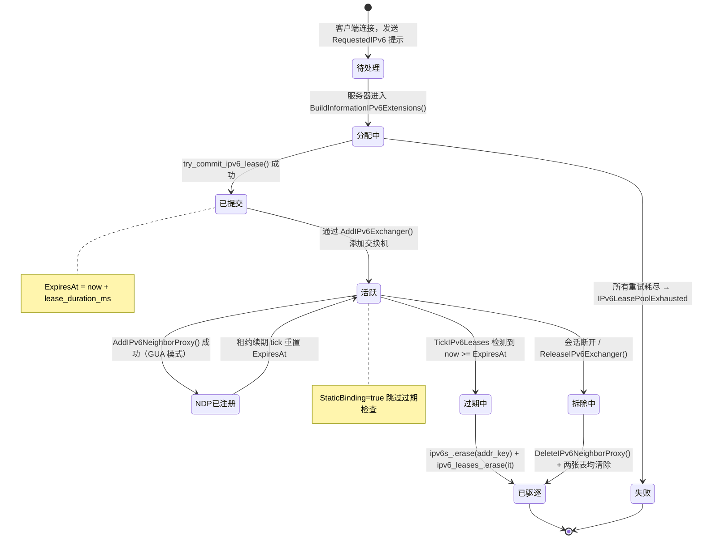
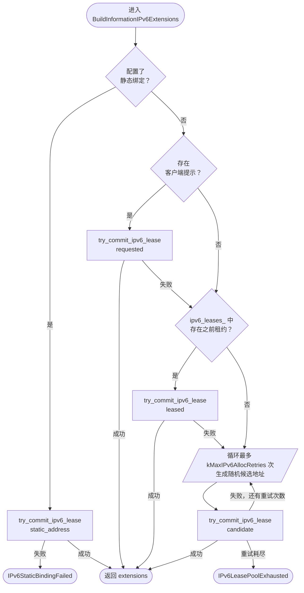
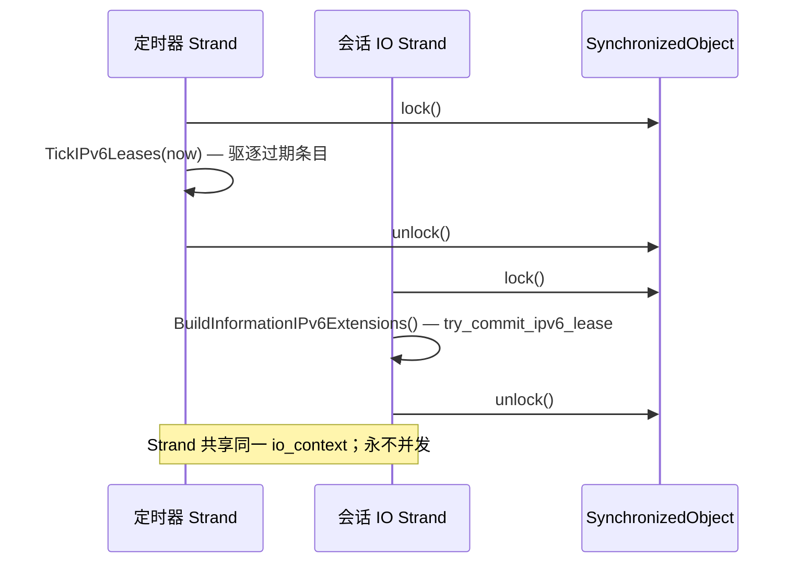
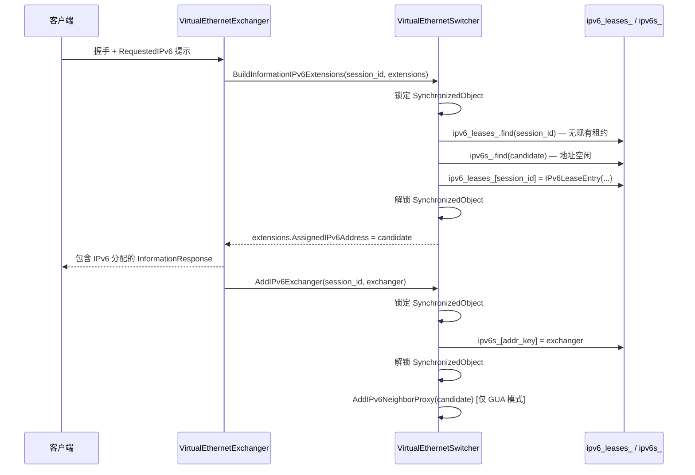
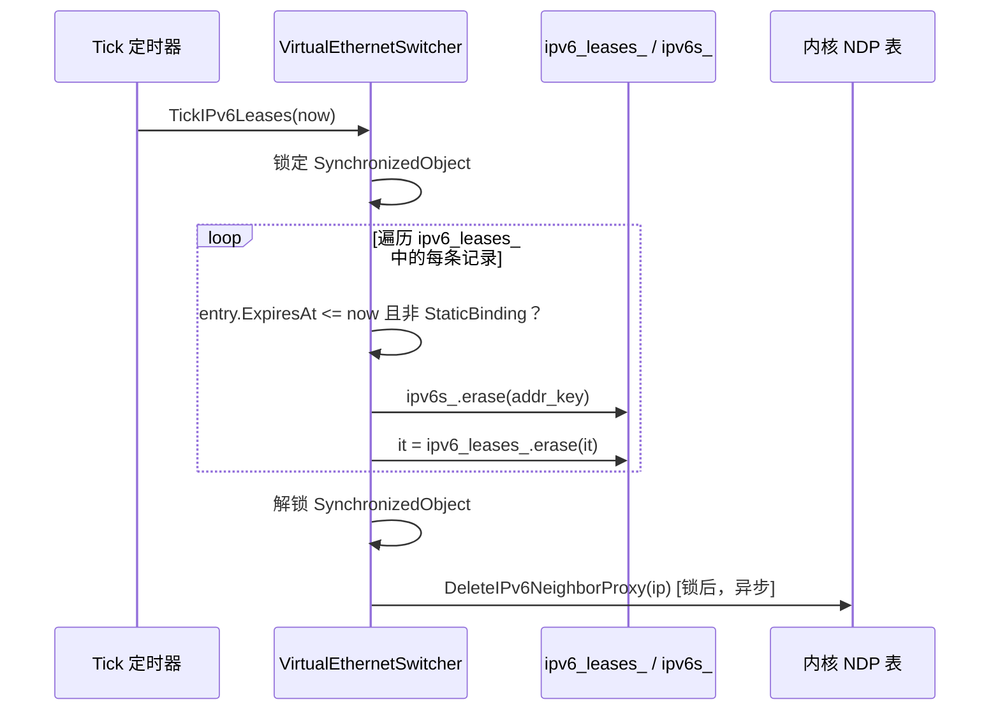

# IPv6 租约管理

> **子系统：** `ppp::app::server::VirtualEthernetSwitcher`  
> **主要文件：** `ppp/app/server/VirtualEthernetSwitcher.cpp`  
> **头文件：** `ppp/app/server/VirtualEthernetSwitcher.h`  
> **核心行范围：** `.cpp` 第 396–695 行、第 3144–3219 行

---

## 目录

1. [概述](#1-概述)
2. [核心数据结构](#2-核心数据结构)
3. [租约生命周期状态机](#3-租约生命周期状态机)
4. [地址分配算法](#4-地址分配算法)
5. [并发访问与竞态条件](#5-并发访问与竞态条件)
6. [到期与驱逐：TickIPv6Leases](#6-到期与驱逐tickipv6leases)
7. [迭代器失效 Bug 修复说明](#7-迭代器失效-bug-修复说明)
8. [时序图](#8-时序图)
9. [错误码](#9-错误码)
10. [配置参考](#10-配置参考)
11. [运维注意事项](#11-运维注意事项)
12. [附录：try_commit_ipv6_lease 完整逻辑](#附录try_commit_ipv6_lease-完整逻辑)

---

## 1. 概述

IPv6 租约管理子系统负责为 VPN 客户端分配、追踪、续期、过期和驱逐 IPv6 地址。与仅依赖 32 位地址哈希的 IPv4 NAT 表不同，IPv6 需要两套独立的追踪结构协同工作：

- **`ipv6_leases_`**：将会话 ID（`Int128`）映射到 `IPv6LeaseEntry`，记录每个会话当前绑定的地址及到期截止时间。
- **`ipv6s_`**：将地址字符串键映射到 `shared_ptr<VirtualEthernetExchanger>`，提供从地址反向查找活跃交换机实例的能力。

两张表均位于 `VirtualEthernetSwitcher` 内部，受同一 `SynchronizedObject` 互斥锁保护。它们必须保持一致性：`ipv6_leases_` 中的每条记录在 `ipv6s_` 中必须存在对应的条目，`ipv6s_` 中每条源自 IPv6 的记录在 `ipv6_leases_` 中也必须有对应租约。违反此不变式将导致无法回收的幽灵条目，或在 NDP 代理拆除时访问已被清除地址而崩溃。

---

## 2. 核心数据结构

### 2.1 `IPv6LeaseEntry`（`VirtualEthernetSwitcher.h`，第 129 行）

```cpp
struct IPv6LeaseEntry {
    Int128                           SessionId = 0;           ///< 拥有此租约的会话标识符
    UInt64                           ExpiresAt = 0;           ///< 到期时间戳（毫秒单调时钟）
    boost::asio::ip::address         Address;                 ///< 已租约的 IPv6 地址
    Byte                             AddressPrefixLength = 0; ///< 前缀长度（通常为 128）
    bool                             StaticBinding = false;   ///< true 表示永久静态绑定
};
```

| 字段 | 类型 | 说明 |
|---|---|---|
| `SessionId` | `Int128` | 128 位会话 GUID，与 map 键冗余存储，用于校验 |
| `ExpiresAt` | `UInt64` | 单调毫秒时间戳，到期后由 `TickIPv6Leases` 驱逐。静态绑定为 `0`（永不过期） |
| `Address` | `boost::asio::ip::address` | 宿主机表示的 IPv6 地址 |
| `AddressPrefixLength` | `Byte` | 点对点分配固定为 `IPv6_MAX_PREFIX_LENGTH`（128） |
| `StaticBinding` | `bool` | `true` 时 `TickIPv6Leases` 跳过此条目；仅在显式会话拆除时删除 |

### 2.2 `IPv6LeaseTable`（`VirtualEthernetSwitcher.h`，第 137 行）

```cpp
typedef ppp::unordered_map<Int128, IPv6LeaseEntry> IPv6LeaseTable;
IPv6LeaseTable ipv6_leases_;  // .h 第 773 行
```

键为会话 ID（`Int128`）。`ppp::unordered_map` 在 Linux 上通过 jemalloc 分配器路由，在 Windows 上使用堆分配器，符合项目分配策略。

### 2.3 `IPv6ExchangerTable`（`VirtualEthernetSwitcher.h`，第 93 行）

```cpp
typedef std::unordered_map<ppp::string, std::shared_ptr<VirtualEthernetExchanger>> IPv6ExchangerTable;
IPv6ExchangerTable ipv6s_;  // .h 第 771 行
```

键为 IPv6 地址的规范字符串表示（如 `"2001:db8::1"`），通过 `ip.to_string()` 计算得到。

> **为什么使用字符串键？**  
> `boost::asio::ip::address_v6` 没有标准哈希函数。使用字符串表示避免了自定义哈希器，同时保持 O(1) 平均查找性能。代价是每次插入的内存分配略高，但对于会话频率操作是可接受的。

### 2.4 `IPv6RequestEntry`（`VirtualEthernetSwitcher.h`，第 108 行）

```cpp
struct IPv6RequestEntry {
    bool                             Present        = false;
    bool                             Accepted       = false;
    Byte                             StatusCode     = IPv6Status_None;
    boost::asio::ip::address         RequestedAddress;
    ppp::string                      StatusMessage;
};
typedef ppp::unordered_map<Int128, IPv6RequestEntry> IPv6RequestTable;
```

此表（`ipv6_requests_`）存储客户端在服务器确认分配之前发送的地址提示。它输入到 `try_commit_ipv6_lease` 中，使客户端偏好地址在分配算法中获得优先处理。

---

## 3. 租约生命周期状态机



### 状态说明

| 状态 | 含义 |
|---|---|
| **待处理** | 客户端已连接；可选的 `RequestedIPv6` 提示已接收 |
| **分配中** | `try_commit_ipv6_lease` lambda 正在遍历候选地址 |
| **已提交** | 一个地址已原子性地锁入 `ipv6_leases_` 和 `ipv6s_` |
| **活跃** | 全双工数据通路正在运行。NDP 代理可能存在也可能不存在 |
| **NDP已注册** | 地址已通过 `ip neigh add proxy` 发布到上游路由器 |
| **过期中** | `TickIPv6Leases` 检测到此条目的 `ExpiresAt <= now` |
| **已驱逐** | `ipv6_leases_` 和 `ipv6s_` 条目均已移除；NDP 代理条目已删除 |
| **拆除中** | 显式断开路径；与已驱逐相同但由交换机驱动 |

---

## 4. 地址分配算法

### 4.1 `try_commit_ipv6_lease` Lambda（`.cpp`，第 396 行）

该 lambda 定义在 `BuildInformationIPv6Extensions()` 内部，通过引用捕获 `this`。其签名近似为：

```cpp
auto try_commit_ipv6_lease = [&](
    const boost::asio::ip::address_v6& candidate,
    bool                               static_binding,
    VirtualEthernetInformationExtensions& out_extensions) -> bool;
```

**逐步执行过程：**

1. **现有租约检查**（`.cpp` 第 424–428 行）：  
   若 `ipv6_leases_` 已包含 `session_id` 的有效 IPv6 地址条目，立即返回 `false`。一个会话不能同时持有两个租约。

2. **地址可用性检查**（`.cpp` 第 430–434 行）：  
   在 `ipv6s_` 中查找 `candidate`。若存在条目且其交换机的会话 ID 与请求者的会话 ID 不同，则地址正在使用中。返回 `false` 触发调用者尝试下一个候选地址。

3. **跨租约重复扫描**（`.cpp` 第 436–450 行）：  
   遍历 `ipv6_leases_` 中的所有条目，检测是否有其他会话已持有相同地址。此 O(n) 扫描是必要的，因为在租约提交后但交换机对象完全插入之前，`ipv6s_` 可能短暂滞后于 `ipv6_leases_`。

4. **提交**（`.cpp` 第 452 行）：  
   将 `IPv6LeaseEntry{session_id, now + lease_ms, candidate, prefix, static_binding}` 写入 `ipv6_leases_[session_id]`。

5. **更新输出扩展：**  
   填充 `out_extensions.AssignedIPv6Address`、`AssignedIPv6AddressPrefixLength`、`AssignedIPv6Mode` 等。

### 4.2 候选地址优先级顺序

当客户端发送 `RequestedIPv6` 提示时，服务器按以下顺序尝试地址，然后再回退到随机生成：

```
1. 来自托管服务器配置的静态绑定（最高优先级）
2. 客户端请求的地址（若有效且可用）
3. 从 ipv6_leases_[session_id] 检索的之前租约地址
4. 在配置的 IPv6 池前缀内随机生成的地址
   （最多尝试 kMaxIPv6AllocRetries 次）
```



---

## 5. 并发访问与竞态条件

### 5.1 锁范围

`ipv6_leases_` 和 `ipv6s_` 的修改仅在持有交换机主 `SynchronizedObject` 互斥锁时进行。这与保护 IPv4 NAT 表（`nats_`）和连接表（`connections_`）的锁是同一把锁。因此：

- 两个分配请求不能在 `try_commit_ipv6_lease` 内部并发执行。
- `TickIPv6Leases` 始终在同一把锁下调用。
- `AddIPv6Exchanger` 和 `ReleaseIPv6Exchanger` 也在锁下调用。

### 5.2 NDP 代理——在锁外执行

NDP 代理的 shell 命令（`ip neigh add proxy` / `ip neigh del proxy`）**不**在持有主锁时执行。它们在租约提交后调度，以避免因 `shell()` 调用阻塞 IO 线程。这创造了一个短暂的窗口：

```
ipv6_leases_[session] = 已提交
ipv6s_[addr]          = 交换机
NDP 内核条目          = 尚未安装
```

在此窗口内，来自上游路由器发往新地址的数据包将在内核层面被丢弃。这是可以接受的，因为客户端操作系统的 IPv6 栈在开始接受数据包之前也需要几百毫秒来配置新地址。

### 5.3 驱逐与飞行中分配的竞态

若租约在时刻 `T` 过期，而新客户端在时刻 `T + epsilon` 请求相同地址，`TickIPv6Leases` 可能在 `BuildInformationIPv6Extensions` 处于 `try_commit_ipv6_lease` lambda 内部时驱逐该租约。这是安全的，因为：

1. 两个操作都以独占方式持有主锁。
2. `TickIPv6Leases` 中使用的 map 迭代器在 `erase` 后失效，但循环使用 `erase` 的返回值来推进（见第 7 节）。
3. `BuildInformationIPv6Extensions` 在分配会话的 IO strand 上调用，而 `TickIPv6Leases` 在主定时器 strand 上调用。两个 strand 通过同一 `io_context` 发布任务，确保串行化。



---

## 6. 到期与驱逐：`TickIPv6Leases`

### 6.1 函数签名（`.h` 第 610 行；`.cpp` 第 3144 行）

```cpp
void VirtualEthernetSwitcher::TickIPv6Leases(UInt64 now) noexcept;
```

由主 tick 处理器在每个定时器间隔（通常为 1 秒）调用。`now` 是从 `ppp::GetTickCount()` 获取的当前单调毫秒时间戳。

### 6.2 算法

```cpp
// VirtualEthernetSwitcher.cpp : 3144
void VirtualEthernetSwitcher::TickIPv6Leases(UInt64 now) noexcept {
    for (auto it = ipv6_leases_.begin(); it != ipv6_leases_.end();) {
        const IPv6LeaseEntry& entry = it->second;

        // 静态绑定永不过期。
        if (entry.StaticBinding) {
            ++it;
            continue;
        }

        if (entry.ExpiresAt > now) {
            ++it;
            continue;
        }

        // 租约已过期。先移除反向映射。
        ppp::string addr_key = entry.Address.to_string();
        // 在删除租约之前先从 ipv6s_ 中移除过期地址到交换机的映射，
        // 确保 TryGetAssignedIPv6Extensions 始终看到一致的表状态。
        auto tail = ipv6s_.find(addr_key);
        if (tail != ipv6s_.end()) {
            ipv6s_.erase(tail);   // 第 3175 行
        }

        it = ipv6_leases_.erase(it);  // 第 3179 行 — 正确的迭代器推进
    }
}
```

### 6.3 定时器集成（`.cpp`，第 3218 行）

```cpp
// 在主 Tick() 函数内：
TickIPv6Leases(now);
```

每次 tick 无条件调用。内部循环是 O(n) 的活跃租约数，但由于每次 tick 仅短暂持有主锁，对其他操作的影响可以忽略不计。

---

## 7. 迭代器失效 Bug 修复说明

在范围 for 循环中对 `unordered_map` 进行元素删除时，经典的迭代器失效 bug 如下：

```cpp
// 错误 — erase 后迭代器失效：
for (auto& [k, v] : ipv6_leases_) {
    if (should_erase(v)) {
        ipv6_leases_.erase(k);  // 未定义行为：使所有迭代器失效
    }
}
```

正确的模式（用于 `.cpp` 第 3146 行）是：

```cpp
// 正确 — erase 返回下一个有效迭代器：
for (auto it = ipv6_leases_.begin(); it != ipv6_leases_.end();) {
    if (should_erase(it->second)) {
        it = ipv6_leases_.erase(it);
    } else {
        ++it;
    }
}
```

**为什么这对 IPv6 子系统特别重要：**

`ipv6s_` 和 `ipv6_leases_` 表必须以精确的顺序删除：

1. 先删除 `ipv6s_[addr_key]`——这防止 `TryGetAssignedIPv6Extensions()` 在租约消失后返回过期的交换机指针。
2. 通过赋值 `erase(it)` 的返回值来推进 `ipv6_leases_` 迭代器。

如果步骤 1 和步骤 2 颠倒，持有锁的并发读者可能观察到 `ipv6_leases_` 中 `session_id` 条目为空，而 `ipv6s_` 仍包含现在成为孤儿的地址条目。NDP 拆除路径（`DeleteIPv6NeighborProxy`）将无法在 `ipv6_leases_` 中找到该地址并跳过 `ip neigh del proxy` 调用，从而泄漏内核 NDP 代理条目。

---

## 8. 时序图

### 8.1 正常路径租约分配



### 8.2 租约过期与驱逐



---

## 9. 错误码

以下 `ErrorCode` 值（来自 `ppp/diagnostics/ErrorCodes.def`）与租约子系统相关：

| 错误码 | 严重级别 | 描述 |
|---|---|---|
| `IPv6LeaseConflict` | `kError` | 两个会话同时尝试申请同一地址 |
| `IPv6LeaseUnavailable` | `kError` | 数据包转发期间未找到会话的活跃租约 |
| `IPv6LeaseExpired` | `kError` | 找到了租约，但其 `ExpiresAt` 已过期 |
| `IPv6LeasePoolExhausted` | `kError` | 所有 `kMaxIPv6AllocRetries` 个候选地址均被拒绝；池已满 |
| `IPv6LeaseCommitFailed` | `kError` | 最终重试后 `try_commit_ipv6_lease` 返回 false |
| `IPv6LeaseSessionCollision` | `kError` | 新会话试图申请已被不同活跃会话持有的地址 |
| `IPv6AddressConflict` | `kError` | 分配的地址与现有活跃租约冲突 |
| `IPv6StaticBindingFailed` | `kError` | 来自配置的静态绑定无法提交 |

---

## 10. 配置参考

以下 `appsettings.json` 字段影响租约行为：

```json
{
  "server": {
    "ipv6": {
      "prefix":          "2001:db8::/48",
      "lease_duration":  86400,
      "max_leases":      65536,
      "static_bindings": [
        {
          "session_id": "...",
          "address":    "2001:db8::100"
        }
      ]
    }
  }
}
```

| 字段 | 单位 | 默认值 | 描述 |
|---|---|---|---|
| `prefix` | CIDR | 必填 | 生成候选地址的池前缀 |
| `lease_duration` | 秒 | 86400 | 动态租约的生存时间 |
| `max_leases` | 数量 | 65536 | 硬上限；达到此值时发生池耗尽 |
| `static_bindings` | 数组 | `[]` | 每个会话的永久绑定，永不过期 |

---

## 11. 运维注意事项

### 11.1 租约表大小监控

`ipv6_leases_` 的大小直接反映活跃 IPv6 会话数。运营商可通过 Go 管理后端的 `/api/v1/leases` 端点查询（参见 `go/` 目录）。接近 `max_leases` 的值应触发告警。

### 11.2 静态绑定与动态租约

静态租约（`StaticBinding = true`）通过相同的 `try_commit_ipv6_lease` 路径提交，但被标记使得 `TickIPv6Leases` 无条件跳过它们。它们仅在以下情况下被释放：

1. 拥有的交换机调用 `ReleaseIPv6Exchanger()`。
2. 在完全服务器重置时调用 `ClearIPv6Leases()`。

### 11.3 重连粘性

当客户端在其之前的租约到期前重新连接时，`try_commit_ipv6_lease` 在步骤 1 中找到现有租约条目并返回 `false`。然后调用者使用 `leased` 地址（来自 `ipv6_leases_[session_id].Address`）以相同地址重试。这使客户端在短暂断连后保持相同的 IPv6 地址，无需显式租约预留。

### 11.4 服务器重置时清除 IPv6 表

`ClearIPv6Leases()`（`.cpp` 第 1190–1202 行）无条件删除所有 NDP 代理条目，清除 `ipv6s_` 和 `ipv6_leases_`，并始终在 `ipv6_transit_tap_` 拆除之前调用：

```cpp
// VirtualEthernetSwitcher.cpp : 1190
for (const auto& kv : ipv6s_) {
    DeleteIPv6NeighborProxy(kv.first);
}
ipv6s_.clear();
ipv6_leases_.clear();
```

故意的顺序——在清除表之前删除代理条目——确保 NDP 拆除路径有有效的地址数据传递给 `ip neigh del proxy`。

---

## 附录：`try_commit_ipv6_lease` 完整逻辑

该 lambda 从封闭函数作用域中捕获以下状态：

| 变量 | 类型 | 来源 |
|---|---|---|
| `session_id` | `Int128` | `BuildInformationIPv6Extensions` 的参数 |
| `ipv6_leases_` | `IPv6LeaseTable&` | 交换机成员 |
| `ipv6s_` | `IPv6ExchangerTable&` | 交换机成员 |
| `now` | `UInt64` | lambda 构建时捕获 |
| `lease_duration_ms` | `UInt64` | 来自 `configuration_->server.ipv6.lease_duration` |

```
try_commit_ipv6_lease(candidate, static_binding, out_extensions):
  1. 若 ipv6_leases_ 包含 session_id 且条目.Address.is_v6()：
       返回 false  // 会话已有租约
  2. 若 ipv6s_ 包含 candidate_key：
       若 ipv6s_[candidate_key]->GetId() != session_id：
           返回 false  // 地址被其他会话使用
  3. 遍历 ipv6_leases_ 中的每条 (k, v)：
       若 v.Address == candidate 且 k != session_id：
           返回 false  // 跨租约冲突
  4. ipv6_leases_[session_id] = {
         SessionId           = session_id,
         ExpiresAt           = static_binding ? 0 : now + lease_duration_ms,
         Address             = candidate,
         AddressPrefixLength = IPv6_MAX_PREFIX_LENGTH,
         StaticBinding       = static_binding
     }
  5. 用 candidate 填充 out_extensions
  6. 返回 true
```

此附录帮助审计人员在无需追踪 173,000 行 `VirtualEthernetSwitcher.cpp` 中所有调用点的情况下验证算法的正确性。
