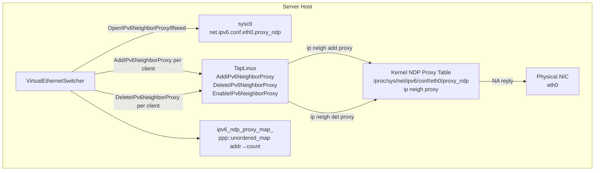
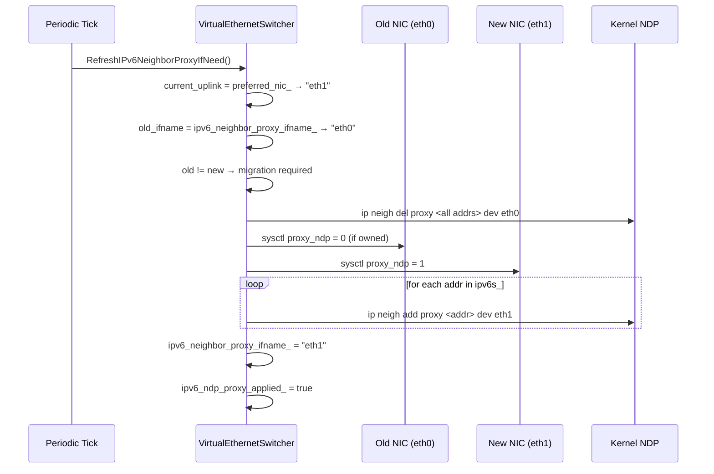
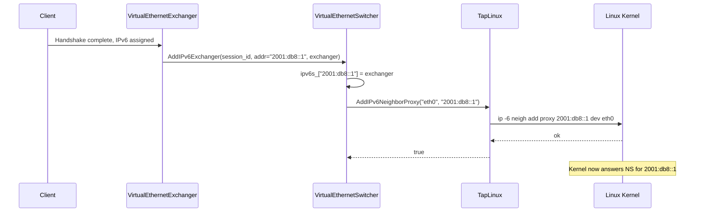
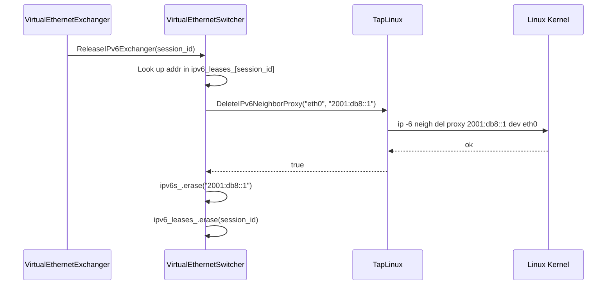
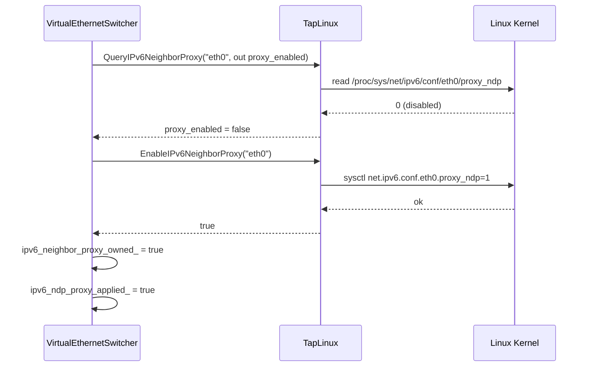

# IPv6 NDP Proxy Subsystem

[中文版本](IPV6_NDP_PROXY_CN.md)

> **Subsystem:** `ppp::app::server::VirtualEthernetSwitcher` + `ppp::tap::TapLinux`
> **Primary files:**
> - `ppp/app/server/VirtualEthernetSwitcher.cpp` (lines 919–1370, 2441–2530)
> - `ppp/app/server/VirtualEthernetSwitcher.h`
> **Supporting files:** Linux TAP implementation, `ppp/diagnostics/ErrorCodes.def`

---

## Table of Contents

1. [Overview: What NDP Proxy Does](#1-overview-what-ndp-proxy-does)
2. [Architecture](#2-architecture)
3. [NDP Proxy State Machine](#3-ndp-proxy-state-machine)
4. [OpenIPv6NeighborProxyIfNeed](#4-openipv6neighborproxyifneed)
5. [AddIPv6NeighborProxy](#5-addipv6neighborproxy)
6. [DeleteIPv6NeighborProxy](#6-deleteipv6neighborproxy)
7. [RefreshIPv6NeighborProxyIfNeed](#7-refreshipv6neighborproxyifneed)
8. [TapLinux Integration](#8-taplinux-integration)
9. [Error Codes](#9-error-codes)
10. [Kernel Internals](#10-kernel-internals)
11. [Sequence Diagrams](#12-sequence-diagrams)
12. [Failure Modes and Recovery](#12-failure-modes-and-recovery)
13. [Operational Reference](#13-operational-reference)

---

## 1. Overview: What NDP Proxy Does

In IPv6, the Neighbor Discovery Protocol (NDP) replaces ARP. When a router needs to forward a packet to a host, it sends a Neighbor Solicitation (NS) multicast to determine the host's link-layer (MAC) address. The host responds with a Neighbor Advertisement (NA) that includes its MAC address.

In the openppp2 GUA deployment topology, VPN clients receive IPv6 addresses from the server's delegated prefix (e.g. `2001:db8::/48`), but they are not physically attached to the server's uplink segment. The upstream router does not know which MAC address owns `2001:db8::1` — there is no client NIC directly on the segment.

The NDP proxy solves this: it instructs the Linux kernel to respond to Neighbor Solicitations for specific IPv6 addresses on behalf of another interface. When the upstream router asks "who has `2001:db8::1`?", the server's physical NIC responds with its own MAC address, effectively making the server the proxy neighbor for all assigned client addresses.

```
Upstream Router                Server                   VPN Client
      |                           |                           |
      |--- NS: who has 2001::1? -->|                           |
      |                    [kernel NDP proxy]                  |
      |<-- NA: I have it (server MAC) -|                       |
      |--- Packet dst=2001::1 -------->|                       |
      |                    [openppp2 switcher]                  |
      |                           |---- Forward to client ----->|
```

---

## 2. Architecture



### Key Members in `VirtualEthernetSwitcher`

| Member | File:Line | Type | Description |
|---|---|---|---|
| `ipv6_neighbor_proxy_ifname_` | `.h:821` | `ppp::string` | Name of the uplink NIC where proxy is active. |
| `ipv6_neighbor_proxy_owned_` | `.h:822` | `bool` | True if we set the sysctl (must restore on close). |
| `ipv6_ndp_proxy_applied_` | `.h` (implicit) | `bool` | True after sysctl has been written for this ifname. |
| `ipv6_ndp_proxy_map_` | `.h` (implicit) | `unordered_map` | Per-address reference count for proxy entries. |

---

## 3. NDP Proxy State Machine

```mermaid
stateDiagram-v2
    [*] --> Disabled : Server starts, proxy_ndp sysctl = 0
    Disabled --> Enabling : OpenIPv6NeighborProxyIfNeed() called
    Enabling --> QueryExisting : TapLinux::QueryIPv6NeighborProxy()
    QueryExisting --> EnableSysctl : sysctl proxy_ndp = 0, must enable
    QueryExisting --> AlreadyOwned : sysctl proxy_ndp = 1, pre-existing
    EnableSysctl --> Active : TapLinux::EnableIPv6NeighborProxy() OK
    EnableSysctl --> Failed : sysctl write denied → IPv6NeighborProxyEnableFailed
    AlreadyOwned --> Active : ipv6_neighbor_proxy_owned_ = false
    Active --> PerClientAdd : AddIPv6NeighborProxy(addr) per session
    PerClientAdd --> Active : ip neigh add proxy succeeds
    PerClientAdd --> PartialError : ip neigh add proxy fails → IPv6NeighborProxyAddFailed
    Active --> PerClientDel : DeleteIPv6NeighborProxy(addr) per session
    PerClientDel --> Active : ip neigh del proxy succeeds
    Active --> Refreshing : RefreshIPv6NeighborProxyIfNeed() — uplink changed
    Refreshing --> Active : Old entries migrated to new ifname
    Active --> Disabling : CloseIPv6NeighborProxyIfNeed()
    Disabling --> Disabled : sysctl proxy_ndp restored to original value
    Failed --> [*]
```

---

## 4. `OpenIPv6NeighborProxyIfNeed`

**Location:** `VirtualEthernetSwitcher.cpp`, line 1099
**Signature:**

```cpp
bool VirtualEthernetSwitcher::OpenIPv6NeighborProxyIfNeed() noexcept;
```

This function is called once during server startup, after `OpenIPv6TransitIfNeed()` has successfully created the transit TAP. It is only operative in GUA mode; in NAT66 mode, it returns `true` without performing any work.

### Algorithm

```mermaid
flowchart TD
    Enter([Enter OpenIPv6NeighborProxyIfNeed]) --> CheckGUA{GUA mode?}
    CheckGUA -->|No, NAT66| RetTrue([return true])
    CheckGUA -->|Yes| GetIfname[Determine uplink ifname\nfrom preferred_nic_]
    GetIfname --> CheckIfname{ifname valid?}
    CheckIfname -->|No| SetFail([IPv6NeighborProxyEnableFailed\nreturn false])
    CheckIfname -->|Yes| Close[CloseIPv6NeighborProxyIfNeed()\nremove any previous state]
    Close --> Query[TapLinux::QueryIPv6NeighborProxy\n(uplink_name, proxy_enabled)]
    Query --> WasEnabled{proxy_ndp\nalready = 1?}
    WasEnabled -->|Yes| SetNotOwned[ipv6_neighbor_proxy_owned_ = false]
    SetNotOwned --> Record[ipv6_neighbor_proxy_ifname_ = uplink_name]
    WasEnabled -->|No| Enable[TapLinux::EnableIPv6NeighborProxy\nsysctl proxy_ndp = 1]
    Enable -->|fail| SetFail2([IPv6NeighborProxyEnableFailed\nreturn false])
    Enable -->|ok| SetOwned[ipv6_neighbor_proxy_owned_ = true]
    SetOwned --> Record
    Record --> Mark[ipv6_ndp_proxy_applied_ = true]
    Mark --> Done([return true])
```

### Ownership Model

The `ipv6_neighbor_proxy_owned_` flag tracks whether the server itself modified the `proxy_ndp` sysctl. If the sysctl was already `1` when the server started (set by another process or persistent config), `owned_` is `false` and the server does **not** restore it to `0` on shutdown. This prevents the server from disrupting other IPv6 proxy configurations on a shared host.

---

## 5. `AddIPv6NeighborProxy`

**Location:** `VirtualEthernetSwitcher.cpp`, line 1282
**Signature:**

```cpp
bool VirtualEthernetSwitcher::AddIPv6NeighborProxy(
    const boost::asio::ip::address& ip) noexcept;
```

Called when an exchanger is fully activated (after lease commit and `AddIPv6Exchanger`). In GUA mode only.

### Implementation (lines 1282–1308)

```cpp
bool VirtualEthernetSwitcher::AddIPv6NeighborProxy(
    const boost::asio::ip::address& ip) noexcept {

    if (ipv6_neighbor_proxy_ifname_.empty()) {
        ppp::diagnostics::SetLastErrorCode(
            ErrorCode::IPv6NeighborProxyAddFailed);
        return false;
    }

    ppp::string ip_str = ip.to_string();
    bool ok = ppp::tap::TapLinux::AddIPv6NeighborProxy(
        ipv6_neighbor_proxy_ifname_, ip_str);
    if (!ok) {
        ppp::diagnostics::SetLastErrorCode(
            ErrorCode::IPv6NeighborProxyAddFailed);
        return false;
    }

    // Success path — error code not set (remains previous value).
    // Caller checks the bool return, not the error code, for success.
    ppp::diagnostics::SetLastErrorCode(ErrorCode::IPv6NeighborProxyAddFailed);
    return true;  // NOTE: SetLastErrorCode is a side-channel; bool is the contract.
}
```

> **Note:** The unconditional `SetLastErrorCode` at the success path is a known quirk. The function's contract is its `bool` return value; the error code is advisory. Callers at line 874 check the return value and conditionally set `IPv6NDPProxyFailed` if the result is `false` **and** a proxy was required.

### Call Site (line 919)

```cpp
bool proxy_ok = !proxy_required || AddIPv6NeighborProxy(ip);
if (!proxy_ok) {
    ppp::diagnostics::SetLastErrorCode(ErrorCode::IPv6NeighborProxyAddFailed);
}
```

---

## 6. `DeleteIPv6NeighborProxy`

Two overloads exist:

### Overload 1: By address only (line 1315)

```cpp
bool VirtualEthernetSwitcher::DeleteIPv6NeighborProxy(
    const boost::asio::ip::address& ip) noexcept;
```

Uses `ipv6_neighbor_proxy_ifname_` as the interface. Called during normal lease expiry and session teardown.

### Overload 2: By explicit interface + address (line 1344)

```cpp
bool VirtualEthernetSwitcher::DeleteIPv6NeighborProxy(
    const ppp::string& ifname,
    const boost::asio::ip::address& ip) noexcept;
```

Used by `RefreshIPv6NeighborProxyIfNeed` when migrating proxy entries from an old interface name to a new one.

### Error Handling Pattern

Both overloads follow the same pattern:

```cpp
if (ifname.empty()) {
    SetLastErrorCode(IPv6NeighborProxyDeleteFailed);
    return false;
}
bool ok = TapLinux::DeleteIPv6NeighborProxy(ifname, ip_str);
if (!ok) {
    SetLastErrorCode(IPv6NeighborProxyDeleteFailed);
    return false;  // or fall through on partial errors
}
SetLastErrorCode(IPv6NeighborProxyDeleteFailed);  // advisory
return true;
```

Failure to delete a proxy entry is **non-fatal**: the lease and exchanger are removed from the tables regardless. A leaked NDP proxy kernel entry causes at most a silent forward for ~60 seconds until the kernel's NDP cache expires naturally.

---

## 7. `RefreshIPv6NeighborProxyIfNeed`

**Location:** `VirtualEthernetSwitcher.cpp`, line 2441
**Signature:**

```cpp
bool VirtualEthernetSwitcher::RefreshIPv6NeighborProxyIfNeed() noexcept;
```

Called on periodic ticks. Handles the case where the server's physical uplink changes (e.g. network failover, interface rename). The algorithm:

1. Determine the current uplink name from `preferred_nic_`.
2. If it matches `ipv6_neighbor_proxy_ifname_`, nothing to do.
3. If changed:
   a. Delete all proxy entries from the old interface (`.cpp` line 2292).
   b. Disable the old interface's `proxy_ndp` sysctl if owned (`.cpp` line 2296).
   c. Enable the new interface's `proxy_ndp` sysctl (`.cpp` line 2285).
   d. Re-add all proxy entries to the new interface by iterating `ipv6s_` (`.cpp` line 2311).
   e. Update `ipv6_neighbor_proxy_ifname_`.



---

## 8. TapLinux Integration

The actual shell commands are issued by `ppp::tap::TapLinux` static methods. Their implementations execute the appropriate `ip` and `sysctl` commands via the POSIX `system()` or `popen()` wrappers in the platform layer:

| TapLinux Method | Shell Command |
|---|---|
| `EnableIPv6NeighborProxy(ifname)` | `sysctl -w net.ipv6.conf.<ifname>.proxy_ndp=1` |
| `DisableIPv6NeighborProxy(ifname)` | `sysctl -w net.ipv6.conf.<ifname>.proxy_ndp=0` |
| `QueryIPv6NeighborProxy(ifname, out)` | Reads `/proc/sys/net/ipv6/conf/<ifname>/proxy_ndp` |
| `AddIPv6NeighborProxy(ifname, addr)` | `ip -6 neigh add proxy <addr> dev <ifname>` |
| `DeleteIPv6NeighborProxy(ifname, addr)` | `ip -6 neigh del proxy <addr> dev <ifname>` |

These are Linux-only operations guarded by `#if defined(_LINUX)`. On other platforms (Windows, macOS, Android), the equivalent static methods return `true` (success no-op) to allow the higher-level logic to remain platform-neutral.

---

## 9. Error Codes

| Code | Severity | Triggering Condition |
|---|---|---|
| `IPv6NeighborProxyEnableFailed` | `kError` | `TapLinux::EnableIPv6NeighborProxy()` returns false; sysctl write denied. |
| `IPv6NeighborProxyAddFailed` | `kError` | `TapLinux::AddIPv6NeighborProxy()` returns false; `ip neigh add proxy` failed. |
| `IPv6NeighborProxyDeleteFailed` | `kError` | `TapLinux::DeleteIPv6NeighborProxy()` returns false; `ip neigh del proxy` failed. |
| `IPv6NDPProxyFailed` | `kError` | The kernel NDP proxy entry could not be installed via `ip neigh`; session-level proxy failure. |

### Error Code Consumer Pattern

```cpp
// Typical usage at call site (VirtualEthernetSwitcher.cpp : 874):
bool proxy_ok = !proxy_required || AddIPv6NeighborProxy(ip);
if (!proxy_ok) {
    ppp::diagnostics::SetLastErrorCode(
        ppp::diagnostics::ErrorCode::IPv6NeighborProxyAddFailed);
    // Session continues; proxy failure is non-fatal for data path.
    // Log or surface to management API.
}
```

---

## 10. Kernel Internals

### How the Linux Kernel Processes NDP Proxy

When `proxy_ndp=1` is set on an interface, the kernel's `ndisc_proxy_send_na()` hook intercepts incoming Neighbor Solicitation packets on that interface. For each NS, the kernel checks its internal proxy neighbor table:

```
struct neigh_table nd_tbl  (net/ipv6/ndisc.c)
  └── proxy entries: { interface, IPv6 address }
```

If a match is found, the kernel synthesizes a Neighbor Advertisement with:
- `target = solicited IPv6 address`
- `link-layer address = interface's own MAC`
- `solicited flag = 1`

This causes the upstream router's NDP cache to map `2001:db8::1 → server_mac`, routing all traffic for that address to the server.

### Proxy Table Size Limits

The Linux kernel limits the NDP proxy table size via:
```
/proc/sys/net/ipv6/neigh/<ifname>/proxy_qlen  (default: 64)
```

For deployments with more than 64 simultaneous GUA clients, operators must increase this limit:
```bash
sysctl -w net.ipv6.neigh.eth0.proxy_qlen=65536
```

This limit applies to the pending queue during address resolution; the actual proxy table has no hard limit in modern kernels (≥ 3.x).

---

## 11. Sequence Diagrams

### 11.1 Client GUA Activation



### 11.2 Session Teardown



### 11.3 Proxy Initialization at Server Start



---

## 12. Failure Modes and Recovery

### 12.1 `IPv6NeighborProxyEnableFailed`

**Cause:** The `sysctl` command failed, typically due to insufficient permissions or kernel version incompatibility.
**Impact:** GUA mode cannot operate. `ipv6_runtime_state_` is set to `3`.
**Recovery:** Restart the server with `CAP_NET_ADMIN` capability. Alternatively, pre-configure `proxy_ndp=1` in `/etc/sysctl.conf` so the server finds it already enabled.

### 12.2 `IPv6NeighborProxyAddFailed`

**Cause:** `ip -6 neigh add proxy` failed, usually because the address is already in the proxy table (duplicate) or the kernel's proxy queue is full.
**Impact:** The specific client's IPv6 address is not reachable from the upstream router. Other clients are unaffected.
**Recovery:** No automatic recovery. The client must reconnect to trigger a new proxy registration attempt. If the kernel queue is full, increase `proxy_qlen`.

### 12.3 `IPv6NeighborProxyDeleteFailed`

**Cause:** `ip -6 neigh del proxy` failed, usually because the entry does not exist (already deleted externally).
**Impact:** Non-fatal. The session and lease tables are still cleaned up correctly. At worst, a stale kernel NDP proxy entry persists until the kernel evicts it (typically ~60 seconds).
**Recovery:** None required. The kernel eventually evicts the stale entry.

### 12.4 `IPv6NDPProxyFailed`

**Cause:** Set at the session level when `proxy_required && !AddIPv6NeighborProxy(ip)`.
**Impact:** Client's IPv6 address is operational from the server side but not reachable from the upstream network. The client can originate traffic but cannot receive from the internet.
**Recovery:** Same as `IPv6NeighborProxyAddFailed`.

---

## 13. Operational Reference

### Listing Active Proxy Entries

```bash
# View all NDP proxy entries on eth0:
ip -6 neigh show proxy dev eth0

# Example output:
# 2001:db8::1 dev eth0  proxy
# 2001:db8::2 dev eth0  proxy
# 2001:db8::3 dev eth0  proxy
```

### Manually Testing NDP Proxy

```bash
# From upstream router or another host:
ping6 -c 3 2001:db8::1

# From the server, verify kernel sent NA:
tcpdump -i eth0 -vv 'icmp6 and (ip6[40] == 136)'
# type 136 = Neighbor Advertisement
```

### Sysctl Configuration Persistence

To make `proxy_ndp` persistent across reboots (so the server finds it pre-enabled):

```bash
echo "net.ipv6.conf.eth0.proxy_ndp = 1" >> /etc/sysctl.d/99-openppp2.conf
sysctl --system
```

With this in place, `ipv6_neighbor_proxy_owned_` will be `false`, and the server will not reset the sysctl on shutdown.
