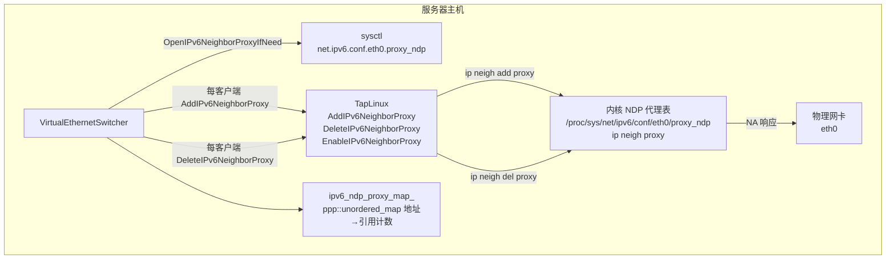
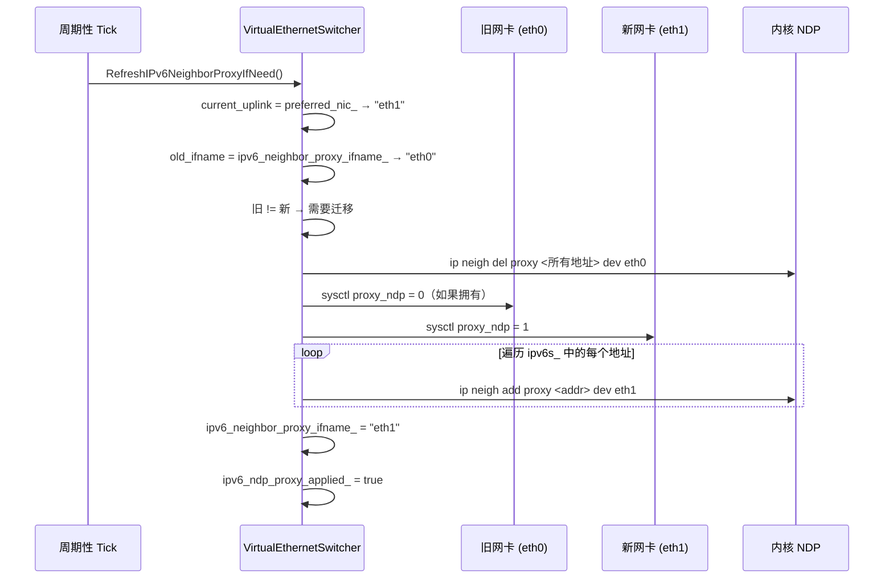
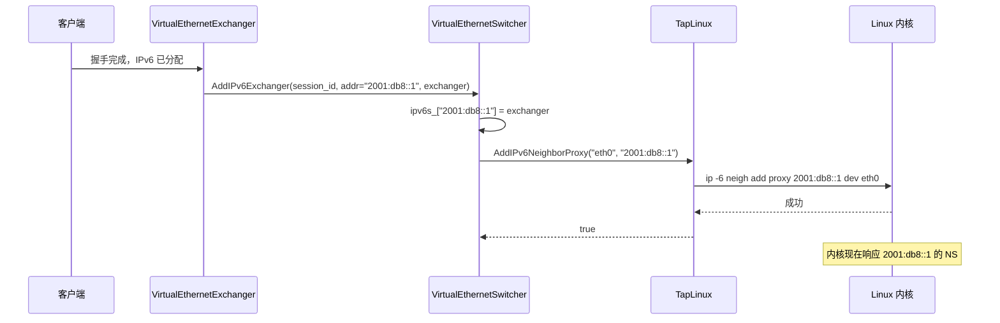
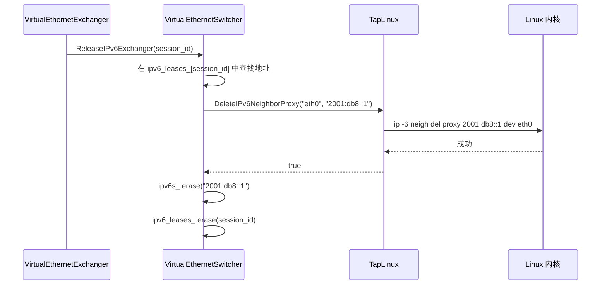

# IPv6 NDP 代理子系统

[English Version](IPV6_NDP_PROXY.md)

> **子系统：** `ppp::app::server::VirtualEthernetSwitcher` + `ppp::tap::TapLinux`
> **主要文件：**
> - `ppp/app/server/VirtualEthernetSwitcher.cpp`（第 919–1370 行、第 2441–2530 行）
> - `ppp/app/server/VirtualEthernetSwitcher.h`
> **支持文件：** Linux TAP 实现、`ppp/diagnostics/ErrorCodes.def`

---

## 目录

1. [概述：NDP 代理的作用](#1-概述ndp-代理的作用)
2. [架构](#2-架构)
3. [NDP 代理状态机](#3-ndp-代理状态机)
4. [OpenIPv6NeighborProxyIfNeed](#4-openipv6neighborproxyifneed)
5. [AddIPv6NeighborProxy](#5-addipv6neighborproxy)
6. [DeleteIPv6NeighborProxy](#6-deleteipv6neighborproxy)
7. [RefreshIPv6NeighborProxyIfNeed](#7-refreshipv6neighborproxyifneed)
8. [TapLinux 集成](#8-taplinux-集成)
9. [错误码](#9-错误码)
10. [内核内部机制](#10-内核内部机制)
11. [时序图](#11-时序图)
12. [故障模式与恢复](#12-故障模式与恢复)
13. [运维参考](#13-运维参考)

---

## 1. 概述：NDP 代理的作用

在 IPv6 中，邻居发现协议（NDP）取代了 ARP。当路由器需要将数据包转发到主机时，它发送邻居请求（NS）组播来确定主机的链路层（MAC）地址。主机用包含其 MAC 地址的邻居通告（NA）响应。

在 openppp2 GUA 部署拓扑中，VPN 客户端从服务器的委托前缀（如 `2001:db8::/48`）接收 IPv6 地址，但它们没有物理连接到服务器的上行链路段。上游路由器不知道哪个 MAC 地址拥有 `2001:db8::1`——段上没有直接的客户端网卡。

NDP 代理解决了这个问题：它指示 Linux 内核代表另一个接口响应特定 IPv6 地址的邻居请求。当上游路由器询问"谁有 `2001:db8::1`？"时，服务器的物理网卡用自己的 MAC 地址响应，有效地使服务器成为所有分配的客户端地址的代理邻居。

```
上游路由器                    服务器                      VPN 客户端
      |                           |                           |
      |--- NS: 谁有 2001::1? ----->|                           |
      |                    [内核 NDP 代理]                      |
      |<-- NA: 我有（服务器 MAC）----|                           |
      |--- 数据包 dst=2001::1 ----->|                           |
      |                    [openppp2 交换机]                    |
      |                           |---- 转发给客户端 ----------->|
```

---

## 2. 架构



### `VirtualEthernetSwitcher` 中的关键成员

| 成员 | 文件:行号 | 类型 | 描述 |
|---|---|---|---|
| `ipv6_neighbor_proxy_ifname_` | `.h:821` | `ppp::string` | 代理处于活跃状态的上行网卡名称 |
| `ipv6_neighbor_proxy_owned_` | `.h:822` | `bool` | 若我们设置了 sysctl（关闭时必须恢复），则为 true |
| `ipv6_ndp_proxy_applied_` | `.h`（隐式） | `bool` | 为此 ifname 写入 sysctl 后为 true |
| `ipv6_ndp_proxy_map_` | `.h`（隐式） | `unordered_map` | 代理条目的每地址引用计数 |

---

## 3. NDP 代理状态机

```mermaid
stateDiagram-v2
    [*] --> 已禁用 : 服务器启动，proxy_ndp sysctl = 0
    已禁用 --> 启用中 : OpenIPv6NeighborProxyIfNeed() 被调用
    启用中 --> 查询现有状态 : TapLinux::QueryIPv6NeighborProxy()
    查询现有状态 --> 启用Sysctl : sysctl proxy_ndp = 0，必须启用
    查询现有状态 --> 已有拥有权 : sysctl proxy_ndp = 1，预先存在
    启用Sysctl --> 活跃 : TapLinux::EnableIPv6NeighborProxy() 成功
    启用Sysctl --> 失败 : sysctl 写入被拒绝 → IPv6NeighborProxyEnableFailed
    已有拥有权 --> 活跃 : ipv6_neighbor_proxy_owned_ = false
    活跃 --> 每客户端添加 : AddIPv6NeighborProxy(addr) 每会话
    每客户端添加 --> 活跃 : ip neigh add proxy 成功
    每客户端添加 --> 部分错误 : ip neigh add proxy 失败 → IPv6NeighborProxyAddFailed
    活跃 --> 每客户端删除 : DeleteIPv6NeighborProxy(addr) 每会话
    每客户端删除 --> 活跃 : ip neigh del proxy 成功
    活跃 --> 刷新中 : RefreshIPv6NeighborProxyIfNeed() — 上行链路已更改
    刷新中 --> 活跃 : 旧条目已迁移到新 ifname
    活跃 --> 禁用中 : CloseIPv6NeighborProxyIfNeed()
    禁用中 --> 已禁用 : sysctl proxy_ndp 恢复为原始值
    失败 --> [*]
```

---

## 4. `OpenIPv6NeighborProxyIfNeed`

**位置：** `VirtualEthernetSwitcher.cpp`，第 1099 行
**签名：**

```cpp
bool VirtualEthernetSwitcher::OpenIPv6NeighborProxyIfNeed() noexcept;
```

此函数在服务器启动期间被调用一次，在 `OpenIPv6TransitIfNeed()` 成功创建中继 TAP 之后。它仅在 GUA 模式下有效；在 NAT66 模式下，它返回 `true` 而不执行任何工作。

### 算法

```mermaid
flowchart TD
    进入([进入 OpenIPv6NeighborProxyIfNeed]) --> 检查GUA{GUA 模式？}
    检查GUA -->|否，NAT66| 返回真([返回 true])
    检查GUA -->|是| 获取接口名[从 preferred_nic_ 确定\n上行 ifname]
    获取接口名 --> 检查接口名{ifname 有效？}
    检查接口名 -->|否| 设置失败([IPv6NeighborProxyEnableFailed\n返回 false])
    检查接口名 -->|是| 关闭[CloseIPv6NeighborProxyIfNeed()\n移除任何之前的状态]
    关闭 --> 查询[TapLinux::QueryIPv6NeighborProxy\n(uplink_name, proxy_enabled)]
    查询 --> 已启用{proxy_ndp\n已经 = 1？}
    已启用 -->|是| 设置非拥有[ipv6_neighbor_proxy_owned_ = false]
    设置非拥有 --> 记录[ipv6_neighbor_proxy_ifname_ = uplink_name]
    已启用 -->|否| 启用[TapLinux::EnableIPv6NeighborProxy\nsysctl proxy_ndp = 1]
    启用 -->|失败| 设置失败2([IPv6NeighborProxyEnableFailed\n返回 false])
    启用 -->|成功| 设置拥有[ipv6_neighbor_proxy_owned_ = true]
    设置拥有 --> 记录
    记录 --> 标记[ipv6_ndp_proxy_applied_ = true]
    标记 --> 完成([返回 true])
```

### 所有权模型

`ipv6_neighbor_proxy_owned_` 标志追踪服务器自身是否修改了 `proxy_ndp` sysctl。如果服务器启动时 sysctl 已经为 `1`（由另一个进程或持久化配置设置），`owned_` 为 `false`，服务器在关闭时**不**将其恢复为 `0`。这防止服务器在共享主机上扰乱其他 IPv6 代理配置。

---

## 5. `AddIPv6NeighborProxy`

**位置：** `VirtualEthernetSwitcher.cpp`，第 1282 行
**签名：**

```cpp
bool VirtualEthernetSwitcher::AddIPv6NeighborProxy(
    const boost::asio::ip::address& ip) noexcept;
```

在交换机完全激活后调用（租约提交和 `AddIPv6Exchanger` 之后）。仅在 GUA 模式下。

### 调用点（第 919 行）

```cpp
bool proxy_ok = !proxy_required || AddIPv6NeighborProxy(ip);
if (!proxy_ok) {
    ppp::diagnostics::SetLastErrorCode(
        ppp::diagnostics::ErrorCode::IPv6NeighborProxyAddFailed);
}
```

---

## 6. `DeleteIPv6NeighborProxy`

存在两个重载：

### 重载 1：仅按地址（第 1315 行）

```cpp
bool VirtualEthernetSwitcher::DeleteIPv6NeighborProxy(
    const boost::asio::ip::address& ip) noexcept;
```

使用 `ipv6_neighbor_proxy_ifname_` 作为接口。在正常租约过期和会话拆除期间调用。

### 重载 2：按显式接口 + 地址（第 1344 行）

```cpp
bool VirtualEthernetSwitcher::DeleteIPv6NeighborProxy(
    const ppp::string& ifname,
    const boost::asio::ip::address& ip) noexcept;
```

当 `RefreshIPv6NeighborProxyIfNeed` 将代理条目从旧接口名迁移到新接口名时使用。

### 错误处理模式

两个重载都遵循相同的模式：

```cpp
if (ifname.empty()) {
    SetLastErrorCode(IPv6NeighborProxyDeleteFailed);
    return false;
}
bool ok = TapLinux::DeleteIPv6NeighborProxy(ifname, ip_str);
if (!ok) {
    SetLastErrorCode(IPv6NeighborProxyDeleteFailed);
    return false;
}
SetLastErrorCode(IPv6NeighborProxyDeleteFailed);  // 建议性
return true;
```

删除代理条目失败是**非致命的**：无论如何，租约和交换机都会从表中移除。泄露的 NDP 代理内核条目最多会导致静默转发约 60 秒，直到内核的 NDP 缓存自然过期。

---

## 7. `RefreshIPv6NeighborProxyIfNeed`

**位置：** `VirtualEthernetSwitcher.cpp`，第 2441 行
**签名：**

```cpp
bool VirtualEthernetSwitcher::RefreshIPv6NeighborProxyIfNeed() noexcept;
```

在周期性 tick 上调用。处理服务器物理上行链路更改的情况（如网络故障转移、接口重命名）。算法：

1. 从 `preferred_nic_` 确定当前上行名称。
2. 如果与 `ipv6_neighbor_proxy_ifname_` 匹配，无需操作。
3. 如果已更改：
   a. 从旧接口删除所有代理条目（`.cpp` 第 2292 行）。
   b. 如果拥有，禁用旧接口的 `proxy_ndp` sysctl（`.cpp` 第 2296 行）。
   c. 启用新接口的 `proxy_ndp` sysctl（`.cpp` 第 2285 行）。
   d. 通过迭代 `ipv6s_` 将所有代理条目重新添加到新接口（`.cpp` 第 2311 行）。
   e. 更新 `ipv6_neighbor_proxy_ifname_`。



---

## 8. TapLinux 集成

实际的 shell 命令由 `ppp::tap::TapLinux` 静态方法发出。它们的实现通过平台层中的 POSIX `system()` 或 `popen()` 包装器执行适当的 `ip` 和 `sysctl` 命令：

| TapLinux 方法 | Shell 命令 |
|---|---|
| `EnableIPv6NeighborProxy(ifname)` | `sysctl -w net.ipv6.conf.<ifname>.proxy_ndp=1` |
| `DisableIPv6NeighborProxy(ifname)` | `sysctl -w net.ipv6.conf.<ifname>.proxy_ndp=0` |
| `QueryIPv6NeighborProxy(ifname, out)` | 读取 `/proc/sys/net/ipv6/conf/<ifname>/proxy_ndp` |
| `AddIPv6NeighborProxy(ifname, addr)` | `ip -6 neigh add proxy <addr> dev <ifname>` |
| `DeleteIPv6NeighborProxy(ifname, addr)` | `ip -6 neigh del proxy <addr> dev <ifname>` |

这些是仅限 Linux 的操作，由 `#if defined(_LINUX)` 保护。在其他平台（Windows、macOS、Android）上，等效的静态方法返回 `true`（成功空操作），以允许上层逻辑保持平台中立。

---

## 9. 错误码

| 错误码 | 严重级别 | 触发条件 |
|---|---|---|
| `IPv6NeighborProxyEnableFailed` | `kError` | `TapLinux::EnableIPv6NeighborProxy()` 返回 false；sysctl 写入被拒绝 |
| `IPv6NeighborProxyAddFailed` | `kError` | `TapLinux::AddIPv6NeighborProxy()` 返回 false；`ip neigh add proxy` 失败 |
| `IPv6NeighborProxyDeleteFailed` | `kError` | `TapLinux::DeleteIPv6NeighborProxy()` 返回 false；`ip neigh del proxy` 失败 |
| `IPv6NDPProxyFailed` | `kError` | 内核 NDP 代理条目无法通过 `ip neigh` 安装；会话级代理失败 |

---

## 10. 内核内部机制

### Linux 内核如何处理 NDP 代理

当在接口上设置 `proxy_ndp=1` 时，内核的 `ndisc_proxy_send_na()` 钩子拦截该接口上传入的邻居请求数据包。对于每个 NS，内核检查其内部代理邻居表：

```
struct neigh_table nd_tbl  (net/ipv6/ndisc.c)
  └── 代理条目: { 接口, IPv6 地址 }
```

如果找到匹配项，内核合成一个邻居通告，包含：
- `target = 被请求的 IPv6 地址`
- `链路层地址 = 接口自身的 MAC`
- `solicited 标志 = 1`

这导致上游路由器的 NDP 缓存将 `2001:db8::1 → server_mac` 映射，将该地址的所有流量路由到服务器。

### 代理表大小限制

Linux 内核通过以下方式限制 NDP 代理表大小：
```
/proc/sys/net/ipv6/neigh/<ifname>/proxy_qlen  （默认：64）
```

对于同时超过 64 个 GUA 客户端的部署，运营商必须增加此限制：
```bash
sysctl -w net.ipv6.neigh.eth0.proxy_qlen=65536
```

---

## 11. 时序图

### 11.1 客户端 GUA 激活



### 11.2 会话拆除



---

## 12. 故障模式与恢复

### 12.1 `IPv6NeighborProxyEnableFailed`

**原因：** `sysctl` 命令失败，通常是由于权限不足或内核版本不兼容。
**影响：** GUA 模式无法运行。`ipv6_runtime_state_` 设为 `3`。
**恢复：** 以 `CAP_NET_ADMIN` 能力重启服务器。或者，在 `/etc/sysctl.conf` 中预配置 `proxy_ndp=1`，使服务器发现它已启用。

### 12.2 `IPv6NeighborProxyAddFailed`

**原因：** `ip -6 neigh add proxy` 失败，通常是因为地址已在代理表中（重复）或内核代理队列已满。
**影响：** 特定客户端的 IPv6 地址无法从上游路由器访问。其他客户端不受影响。
**恢复：** 无自动恢复。客户端必须重新连接以触发新的代理注册尝试。如果内核队列已满，增加 `proxy_qlen`。

### 12.3 `IPv6NeighborProxyDeleteFailed`

**原因：** `ip -6 neigh del proxy` 失败，通常是因为条目不存在（已在外部删除）。
**影响：** 非致命。会话和租约表仍然正确清理。最坏情况是，过期的内核 NDP 代理条目持续存在，直到内核驱逐它（通常约 60 秒）。
**恢复：** 不需要。内核最终驱逐过期条目。

---

## 13. 运维参考

### 列出活跃代理条目

```bash
# 查看 eth0 上的所有 NDP 代理条目：
ip -6 neigh show proxy dev eth0

# 示例输出：
# 2001:db8::1 dev eth0  proxy
# 2001:db8::2 dev eth0  proxy
```

### 手动测试 NDP 代理

```bash
# 从上游路由器或另一台主机：
ping6 -c 3 2001:db8::1

# 从服务器，验证内核发送了 NA：
tcpdump -i eth0 -vv 'icmp6 and (ip6[40] == 136)'
# 类型 136 = 邻居通告
```

### Sysctl 配置持久化

要使 `proxy_ndp` 在重启后持久化（使服务器发现它已预先启用）：

```bash
echo "net.ipv6.conf.eth0.proxy_ndp = 1" >> /etc/sysctl.d/99-openppp2.conf
sysctl --system
```

配置后，`ipv6_neighbor_proxy_owned_` 将为 `false`，服务器在关闭时不会重置 sysctl。
