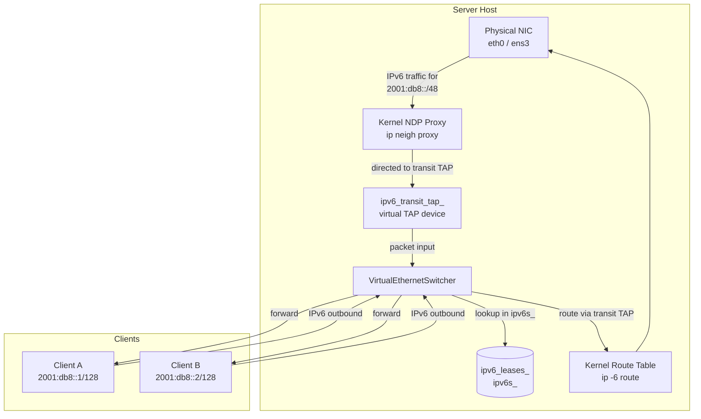
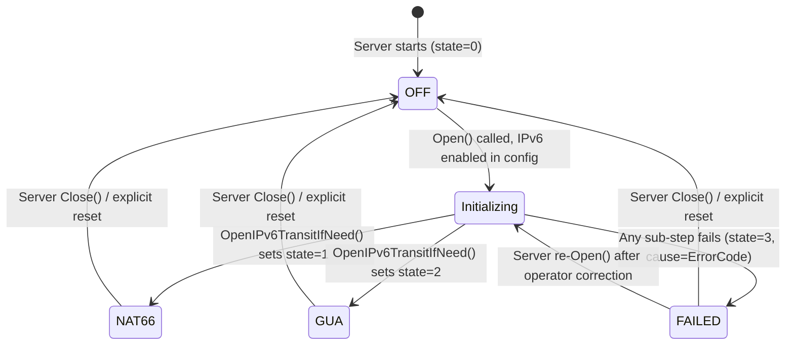
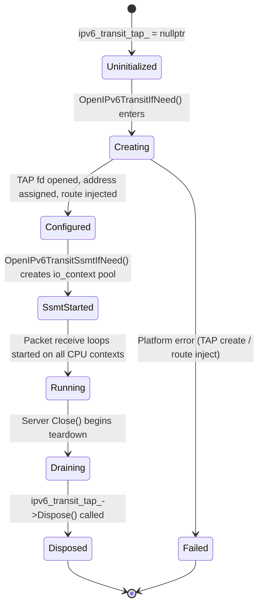
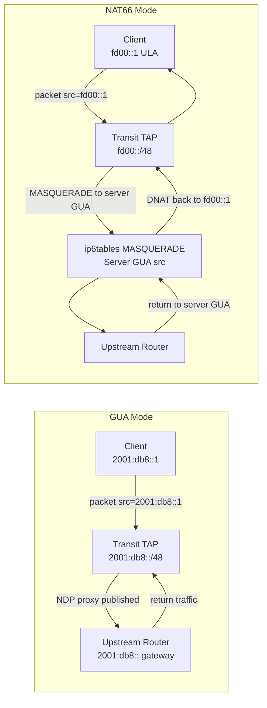
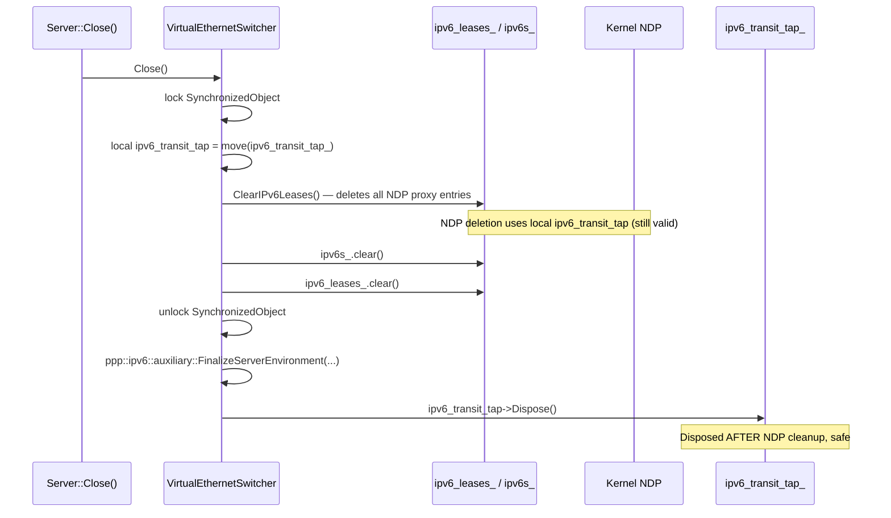
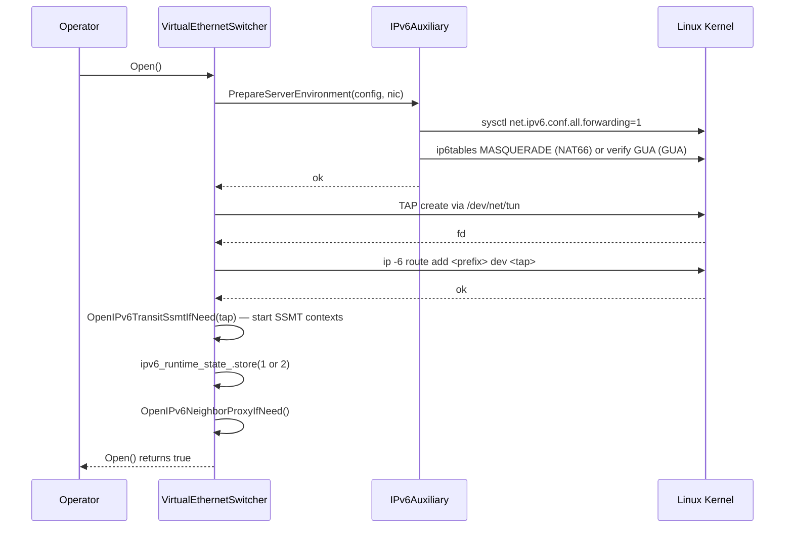

# IPv6 Transit Plane

[中文版本](IPV6_TRANSIT_PLANE_CN.md)

> **Subsystem:** `ppp::app::server::VirtualEthernetSwitcher`
> **Primary file:** `ppp/app/server/VirtualEthernetSwitcher.cpp`
> **Header:** `ppp/app/server/VirtualEthernetSwitcher.h`
> **Supporting files:** `ppp/ipv6/IPv6Auxiliary.cpp`, `ppp/ipv6/IPv6Auxiliary.h`, `ppp/tap/ITap.h`

---

## Table of Contents

1. [Overview](#1-overview)
2. [Architecture](#2-architecture)
3. [ipv6_runtime_state_ Encoding](#3-ipv6_runtime_state_-encoding)
4. [Transit TAP Device Lifecycle](#4-transit-tap-device-lifecycle)
5. [OpenIPv6TransitIfNeed](#5-openipv6transitifneed)
6. [OpenIPv6TransitSsmtIfNeed](#6-openipv6transitssmtifneed)
7. [Route Injection](#7-route-injection)
8. [GUA Mode vs NAT66 Mode](#8-gua-mode-vs-nat66-mode)
9. [NDP Proxy Integration](#9-ndp-proxy-integration)
10. [Failure Diagnostics](#10-failure-diagnostics)
11. [Teardown Sequence](#11-teardown-sequence)
12. [Sequence Diagrams](#12-sequence-diagrams)
13. [Configuration Reference](#13-configuration-reference)
14. [Error Codes](#14-error-codes)

---

## 1. Overview

The IPv6 transit plane is the mechanism by which an openppp2 server provides real globally-routable IPv6 connectivity to its VPN clients — not merely tunneling IPv6 over IPv4. It operates by creating a dedicated virtual TAP interface (`ipv6_transit_tap_`) on the server host, injecting an IPv6 route for the client pool prefix through that interface, and advertising each client's assigned address to the upstream router via the NDP (Neighbor Discovery Protocol) proxy.

Two delivery modes are supported:

- **GUA (Global Unicast Address) mode** — each client receives a real, globally-routable IPv6 address from the operator's delegated prefix. The server's transit TAP interface acts as the on-link gateway; the upstream router is notified of each client's address via `ip neigh add proxy` on the server's physical uplink.
- **NAT66 mode** — clients receive ULA (Unique Local Address) addresses. The server performs IPv6-to-IPv6 Network Address Translation between the client pool prefix and the server's single upstream GUA. This mode does not require a delegated /48 or /56 prefix from the ISP.

The choice between modes is determined by the `AssignedIPv6Mode` field in `VirtualEthernetInformationExtensions`, which is set during the IPv6 lease allocation phase.

---

## 2. Architecture



### Component Responsibilities

| Component | File | Responsibility |
|---|---|---|
| `ipv6_transit_tap_` | `VirtualEthernetSwitcher.h:824` | Virtual TAP device that terminates the transit IPv6 prefix on-server. |
| `ipv6_transit_ssmt_contexts_` | `VirtualEthernetSwitcher.h:825` | Per-CPU `io_context` pool for multi-threaded TAP packet dispatch. |
| `ipv6_runtime_state_` | `VirtualEthernetSwitcher.h:826` | Atomic uint8 encoding current IPv6 plane status (0/1/2/3). |
| `ipv6_runtime_cause_` | `VirtualEthernetSwitcher.h:827` | Atomic uint32 storing the last failure `ErrorCode` when state == 3. |
| `OpenIPv6TransitIfNeed()` | `VirtualEthernetSwitcher.cpp:2338` | Creates and configures the transit TAP device. |
| `OpenIPv6TransitSsmtIfNeed()` | `VirtualEthernetSwitcher.cpp:2539` | Creates the per-CPU io_context pool for the transit TAP. |
| `IPv6Auxiliary.cpp` | `ppp/ipv6/IPv6Auxiliary.cpp` | Platform-level helpers for address assignment, route injection, DNS. |

---

## 3. `ipv6_runtime_state_` Encoding

The atomic member `ipv6_runtime_state_` (`std::atomic<uint8_t>`) encodes the current state of the IPv6 transit plane in a single byte observable from any thread without locking:

```
Value  Name          Description
-----  -----------   -----------------------------------------------------------
  0    OFF           IPv6 transit plane is disabled or not yet initialized.
  1    NAT66         NAT66 mode is active; ULA → GUA masquerade is running.
  2    GUA           GUA mode is active; global addresses delivered per-client.
  3    FAILED        Transit plane attempted but encountered a fatal error.
                     The error code is stored in ipv6_runtime_cause_.
```



### Reading State from Another Thread

```cpp
// Always use acquire semantics to observe the latest write:
uint8_t state = ipv6_runtime_state_.load(std::memory_order_acquire);
uint32_t cause = ipv6_runtime_cause_.load(std::memory_order_acquire);

switch (state) {
    case 0: /* IPv6 off */            break;
    case 1: /* NAT66 active */        break;
    case 2: /* GUA active */          break;
    case 3: /* Failed; cause code */  break;
}
```

The paired store uses `memory_order_release` (`.cpp`, lines 1918–1925):

```cpp
ipv6_runtime_state_.store(state, std::memory_order_release);
ipv6_runtime_cause_.store(0,     std::memory_order_release);
// or on failure:
ipv6_runtime_state_.store(3,     std::memory_order_release);
ipv6_runtime_cause_.store(cause, std::memory_order_release);
```

---

## 4. Transit TAP Device Lifecycle



### Key Invariant

`ipv6_transit_tap_` must **never** be disposed while `ipv6s_` or `ipv6_leases_` contains live entries, because the NDP teardown code reads `ipv6_transit_tap_` to delete proxy entries. The deliberate teardown ordering in `VirtualEthernetSwitcher::Close()` is (`.cpp`, lines 2896–2967):

1. Lock the primary mutex.
2. Move `ipv6_transit_tap_` into a local variable (`ipv6_transit_tap` — note: no trailing underscore).
3. Call `ClearIPv6Leases()` (which reads `ipv6_transit_tap_` — now a local on the caller's stack) to delete all NDP proxy entries.
4. Unlock the mutex.
5. Dispose `ipv6_transit_tap` (local copy) outside the lock.

---

## 5. `OpenIPv6TransitIfNeed`

**Location:** `VirtualEthernetSwitcher.cpp`, line 2338
**Signature:**

```cpp
bool VirtualEthernetSwitcher::OpenIPv6TransitIfNeed() noexcept;
```

### Algorithm

```mermaid
flowchart TD
    Enter([Enter OpenIPv6TransitIfNeed]) --> CheckEnabled{IPv6 enabled\nin config?}
    CheckEnabled -->|No| ReturnTrue([return true, state=0])
    CheckEnabled -->|Yes| CheckMode{Determine mode:\nGUA or NAT66}
    CheckMode --> PrepareEnv[ppp::ipv6::auxiliary::\nPrepareServerEnvironment()]
    PrepareEnv -->|fail| SetFail([state=3, IPv6ServerPrepareFailed])
    PrepareEnv -->|ok| CreateTAP[ppp::tap::ITap::Create()\nwith IPv6 pool prefix]
    CreateTAP -->|fail| SetFailTAP([state=3, IPv6TransitTapOpenFailed])
    CreateTAP -->|ok| InjectRoute[AddIPv6TransitRoute()\nip -6 route add prefix dev tap]
    InjectRoute -->|fail| SetFailRoute([state=3, IPv6TransitRouteAddFailed])
    InjectRoute -->|ok| StoreState[ipv6_transit_tap_ = tap\nstate = 1 or 2]
    StoreState --> StartSsmt[OpenIPv6TransitSsmtIfNeed(tap)]
    StartSsmt -->|fail| SetFailSsmt([state=3])
    StartSsmt -->|ok| Done([return true])
```

### Platform Requirements

`OpenIPv6TransitIfNeed` is a no-op on Windows and Android; it only executes on Linux (the primary server platform). The platform guard is:

```cpp
#if defined(_LINUX)
    // ... TAP creation and route injection
#else
    return true;  // No-op on non-Linux platforms
#endif
```

### Environment Preparation

Before creating the TAP device, `ppp::ipv6::auxiliary::PrepareServerEnvironment()` (`ppp/ipv6/IPv6Auxiliary.cpp`) performs:

1. Enables IPv6 forwarding: `sysctl -w net.ipv6.conf.all.forwarding=1`
2. Enables IPv6 on the physical uplink: `sysctl -w net.ipv6.conf.<nic>.disable_ipv6=0`
3. For NAT66: loads the `ip6table_nat` kernel module and installs MASQUERADE rules.
4. For GUA: verifies that the upstream interface has a valid GUA (non-link-local) address.

---

## 6. `OpenIPv6TransitSsmtIfNeed`

**Location:** `VirtualEthernetSwitcher.cpp`, line 2539
**Signature:**

```cpp
bool VirtualEthernetSwitcher::OpenIPv6TransitSsmtIfNeed(const ITapPtr& tap) noexcept;
```

**SSMT** stands for **Symmetric Strand Multi-Thread** — the pattern where each CPU core has a dedicated `io_context` that runs a tight receive loop on the transit TAP file descriptor. This avoids the contention of a single `io_context` dispatching all TAP reads to a thread pool.

### Context Pool Construction (`.cpp`, lines 2334–2382)

```cpp
// Pseudo-code for SSMT context creation:
int cpu_count = std::thread::hardware_concurrency();
ppp::vector<ContextPtr> contexts;
contexts.reserve(cpu_count);

for (int i = 0; i < cpu_count; ++i) {
    auto ctx = std::make_shared<boost::asio::io_context>(1);
    // Pin receive loop to this io_context:
    asio::post(*ctx, [tap, ctx]() {
        tap->RunReceiveLoop(ctx);
    });
    contexts.push_back(ctx);
}
ipv6_transit_ssmt_contexts_ = std::move(contexts);
```

### Teardown (`.cpp`, lines 2396–2397)

```cpp
contexts = std::move(ipv6_transit_ssmt_contexts_);
ipv6_transit_ssmt_contexts_.clear();
// contexts destructor joins all io_context threads
```

---

## 7. Route Injection

When the transit TAP is opened, the server injects a host route for the IPv6 pool prefix pointing to the TAP interface:

```
ip -6 route add <pool_prefix>/<pool_prefix_len> dev <transit_tap_name>
```

For example, if the pool is `2001:db8::/48` and the transit TAP is named `ppp0`, the injected route is:

```
ip -6 route add 2001:db8::/48 dev ppp0
```

This route causes the kernel to forward all incoming packets destined for any address in `2001:db8::/48` to the transit TAP. The switcher's packet handler reads from the TAP, looks up the destination address in `ipv6s_`, and forwards the packet to the owning exchanger's session.

### Route Deletion on Teardown

```cpp
// VirtualEthernetSwitcher.cpp — DeleteIPv6TransitRoute
ppp::ipv6::auxiliary::DeleteServerTransitRoute(configuration_, preferred_nic_, ipv6_transit_tap_name_);
// Executes: ip -6 route del <prefix> dev <tap_name>
```

---

## 8. GUA Mode vs. NAT66 Mode



### Mode Decision (`.cpp`, lines 1889–1925)

```cpp
// Simplified from VirtualEthernetSwitcher::Open()
bool ok = OpenIPv6TransitIfNeed() && OpenIPv6NeighborProxyIfNeed();
if (!ok) {
    uint32_t cause = static_cast<uint32_t>(ppp::diagnostics::GetLastErrorCode());
    ipv6_runtime_state_.store(3, std::memory_order_release);
    ipv6_runtime_cause_.store(cause, std::memory_order_release);
} else {
    uint8_t state = DetermineIPv6RuntimeState();  // 1=NAT66, 2=GUA
    ipv6_runtime_state_.store(state, std::memory_order_release);
    ipv6_runtime_cause_.store(0, std::memory_order_release);
}
```

### Comparison Table

| Aspect | GUA Mode (state=2) | NAT66 Mode (state=1) |
|---|---|---|
| Client address type | Real GUA (e.g. `2001:db8::x`) | ULA (e.g. `fd00::x`) |
| Requires delegated prefix | Yes (`/48` or larger) | No |
| NDP proxy required | Yes | No |
| ip6tables MASQUERADE | No | Yes |
| Return traffic path | Via NDP proxy → transit TAP | Via MASQUERADE conntrack |
| Visibility to internet | Full (real GUA) | Hidden behind server GUA |

---

## 9. NDP Proxy Integration

In GUA mode, the transit plane relies on the NDP proxy to make each client's individual `/128` address reachable from the upstream router. See `IPV6_NDP_PROXY.md` for full details. The integration point is:

1. `OpenIPv6TransitIfNeed()` creates the transit TAP and injects the pool route.
2. `OpenIPv6NeighborProxyIfNeed()` enables the NDP proxy sysctl on the uplink interface.
3. Per-client NDP proxy entries are added by `AddIPv6NeighborProxy()` when each exchanger calls `AddIPv6Exchanger()`.
4. Per-client NDP proxy entries are deleted by `DeleteIPv6NeighborProxy()` when `ReleaseIPv6Exchanger()` or `TickIPv6Leases` evicts the client.

The transit TAP and NDP proxy are complementary: the route injection pulls traffic into the server, and the NDP proxy pushes per-client address advertisements upstream.

---

## 10. Failure Diagnostics

When `ipv6_runtime_state_` reads `3` (FAILED), `ipv6_runtime_cause_` contains the raw `uint32_t` cast of the `ErrorCode` that caused the failure. Operators can read both atomics from the management API or directly via GDB:

```bash
# Via management API (Go backend):
curl http://localhost:8080/api/v1/server/ipv6/state

# Via GDB (attach to running process):
p (int)ppp_instance->ipv6_runtime_state_.load()
p (int)ppp_instance->ipv6_runtime_cause_.load()
```

### Common Failure Scenarios

| `ipv6_runtime_cause_` (ErrorCode) | Likely Root Cause | Remediation |
|---|---|---|
| `IPv6ServerPrepareFailed` | `sysctl` or `ip6tables` permission denied | Run as root; check `CAP_NET_ADMIN`. |
| `IPv6TransitTapOpenFailed` | No TAP devices available (`/dev/net/tun`) | Check TUN/TAP kernel module: `modprobe tun`. |
| `IPv6TransitRouteAddFailed` | Route already exists; kernel rejects duplicate | Check `ip -6 route show`; manually delete stale route. |
| `IPv6ForwardingEnableFailed` | Kernel forbids forwarding (container without capability) | Grant `CAP_NET_ADMIN` or run in privileged container. |
| `IPv6NeighborProxyEnableFailed` | NDP proxy sysctl unavailable | Check `sysctl net.ipv6.conf.<nic>.proxy_ndp`. |
| `PlatformNotSupportGUAMode` | Platform is Android/Windows (GUA unsupported) | Use NAT66 mode on non-Linux platforms. |

### Diagnostic Flow

```mermaid
flowchart TD
    Query[Query ipv6_runtime_state_] --> S0{state == 0?}
    S0 -->|Yes| Off[IPv6 disabled in config]
    S0 -->|No| S12{state == 1 or 2?}
    S12 -->|Yes| OK[IPv6 active; no action needed]
    S12 -->|No| S3{state == 3?}
    S3 -->|Yes| ReadCause[Read ipv6_runtime_cause_]
    ReadCause --> MapCause[Map to ErrorCode via FormatErrorTriplet()]
    MapCause --> Remediate[Apply remediation from table above]
    Remediate --> Restart[Restart server after fix]
    Restart --> Query
```

---

## 11. Teardown Sequence

The transit plane teardown is the most order-sensitive part of the IPv6 subsystem. The comment at `.cpp` line 2920 documents the invariant:

```
IPv6 exchanger teardown must run BEFORE ipv6_transit_tap_ is moved.
All NDP deletion calls inside ClearIPv6Leases() read ipv6_transit_tap_.
```



---

## 12. Sequence Diagrams

### 12.1 Transit Plane Initialization



### 12.2 Per-Client Address Activation

```mermaid
sequenceDiagram
    participant EX as VirtualEthernetExchanger
    participant SW as VirtualEthernetSwitcher
    participant NDP as Kernel NDP Proxy

    EX->>SW: AddIPv6Exchanger(session_id, addr, exchanger)
    SW->>SW: lock; insert ipv6s_[addr_key] = exchanger; unlock
    SW->>NDP: ip neigh add proxy <addr> dev <uplink> [GUA mode only]
    Note over NDP: addr now reachable from upstream router
    NDP-->>SW: ok
```

---

## 13. Configuration Reference

```json
{
  "server": {
    "ipv6": {
      "enabled":        true,
      "mode":           "gua",
      "prefix":         "2001:db8::/48",
      "uplink":         "eth0",
      "transit_tap":    "ppp0",
      "forwarding":     true,
      "nat66_masq":     false
    }
  }
}
```

| Field | Type | Description |
|---|---|---|
| `enabled` | bool | Master switch for the IPv6 transit plane. |
| `mode` | string | `"gua"` or `"nat66"`. Drives `ipv6_runtime_state_`. |
| `prefix` | CIDR | Pool prefix for client address allocation. |
| `uplink` | string | Physical NIC name for NDP proxy and route injection. |
| `transit_tap` | string | Name for the virtual transit TAP device. |
| `forwarding` | bool | Whether to automatically enable `net.ipv6.conf.all.forwarding`. |
| `nat66_masq` | bool | Whether to install ip6tables MASQUERADE rules automatically. |

---

## 14. Error Codes

| Code | Severity | Description |
|---|---|---|
| `IPv6ServerPrepareFailed` | `kError` | `PrepareServerEnvironment()` failed during transit plane init. |
| `IPv6ServerFinalizeFailed` | `kError` | `FinalizeServerEnvironment()` failed during teardown. |
| `IPv6TransitTapOpenFailed` | `kError` | `/dev/net/tun` open or TAP configuration failed. |
| `IPv6TransitRouteAddFailed` | `kError` | `ip -6 route add` rejected by the kernel. |
| `IPv6TransitRouteDeleteFailed` | `kError` | `ip -6 route del` rejected during teardown. |
| `IPv6ForwardingEnableFailed` | `kError` | `sysctl net.ipv6.conf.all.forwarding=1` failed. |
| `IPv6Nat66Unavailable` | `kError` | ip6tables NAT module not loaded or MASQUERADE rule failed. |
| `IPv6TransitIfaceCreateFailed` | `kError` | Virtual transit TAP interface could not be created. |
| `PlatformNotSupportGUAMode` | `kFatal` | GUA mode requested on non-Linux platform. |

> **Note**: The following error codes are proposed/design items not yet in `ErrorCodes.def`: `IPv6ServerFinalizeFailed` (nearest existing: `IPv6ServerPrepareFailed`, but for teardown phase), `IPv6TransitIfaceCreateFailed` (nearest: `IPv6TransitTapOpenFailed`).
