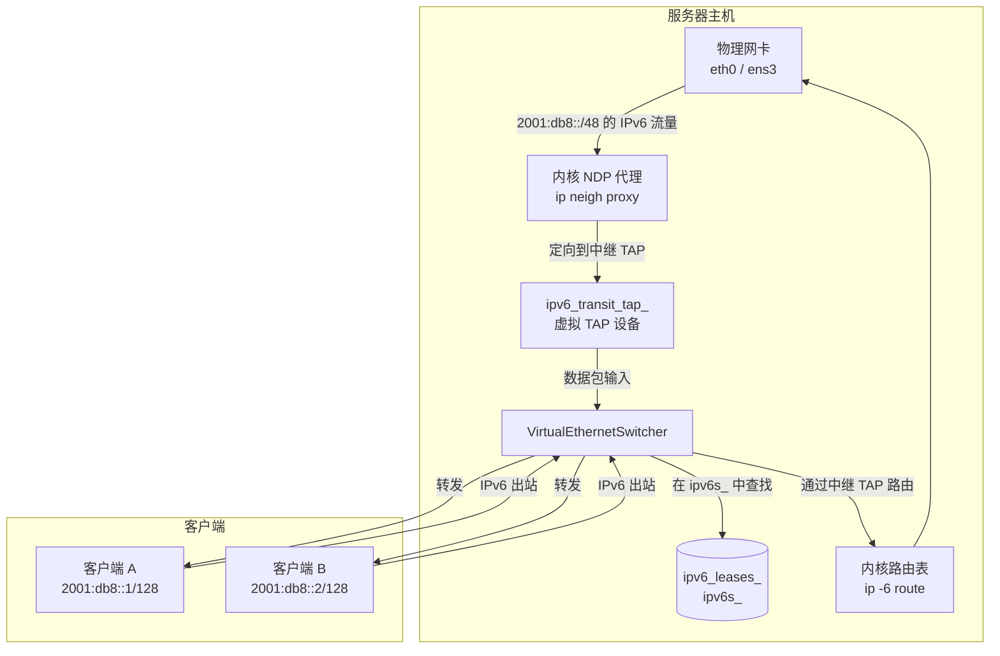
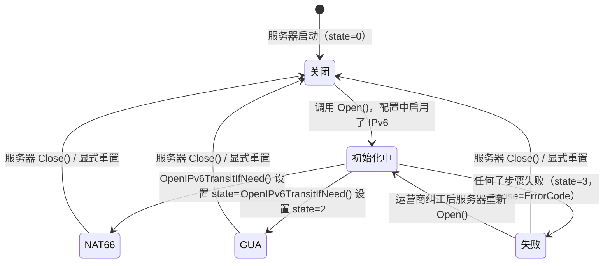
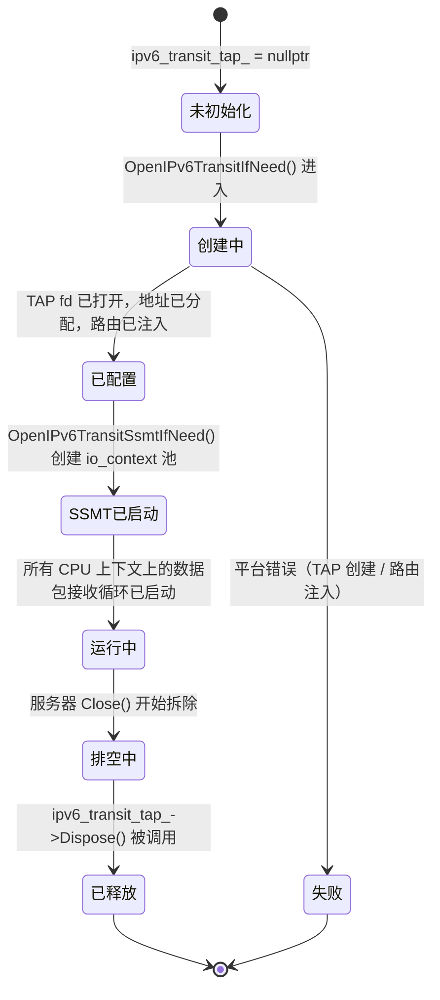
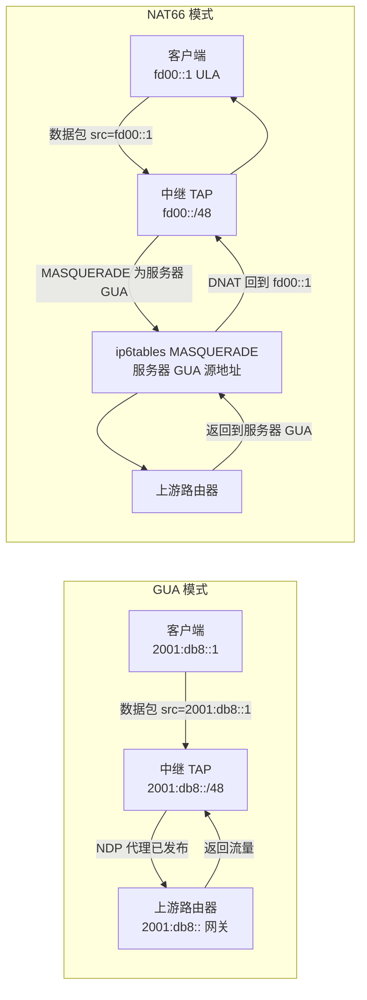
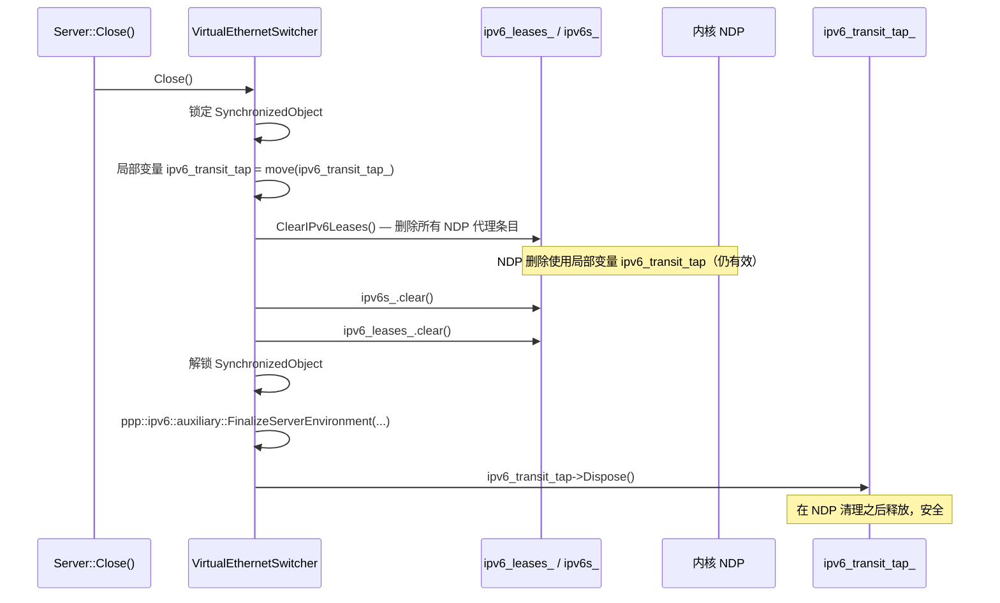
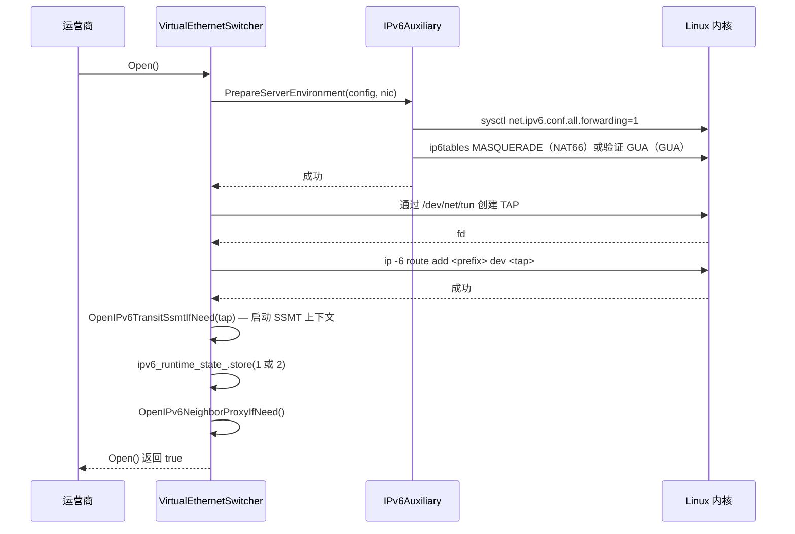

# IPv6 中继平面

[English Version](IPV6_TRANSIT_PLANE.md)

> **子系统：** `ppp::app::server::VirtualEthernetSwitcher`
> **主要文件：** `ppp/app/server/VirtualEthernetSwitcher.cpp`
> **头文件：** `ppp/app/server/VirtualEthernetSwitcher.h`
> **支持文件：** `ppp/ipv6/IPv6Auxiliary.cpp`、`ppp/ipv6/IPv6Auxiliary.h`、`ppp/tap/ITap.h`

---

## 目录

1. [概述](#1-概述)
2. [架构](#2-架构)
3. [ipv6_runtime_state_ 编码](#3-ipv6_runtime_state_-编码)
4. [中继 TAP 设备生命周期](#4-中继-tap-设备生命周期)
5. [OpenIPv6TransitIfNeed](#5-openipv6transitifneed)
6. [OpenIPv6TransitSsmtIfNeed](#6-openipv6transitssmtifneed)
7. [路由注入](#7-路由注入)
8. [GUA 模式与 NAT66 模式](#8-gua-模式与-nat66-模式)
9. [NDP 代理集成](#9-ndp-代理集成)
10. [故障诊断](#10-故障诊断)
11. [拆除序列](#11-拆除序列)
12. [时序图](#12-时序图)
13. [配置参考](#13-配置参考)
14. [错误码](#14-错误码)

---

## 1. 概述

IPv6 中继平面是 openppp2 服务器为 VPN 客户端提供真正全球可路由 IPv6 连接的机制——而不仅仅是将 IPv6 封装在 IPv4 上。其工作方式是在服务器主机上创建一个专用虚拟 TAP 接口（`ipv6_transit_tap_`），通过该接口为客户端池前缀注入 IPv6 路由，并通过 NDP（邻居发现协议）代理将每个客户端分配的地址通告给上游路由器。

支持两种传输模式：

- **GUA（全球单播地址）模式**——每个客户端从运营商委托的前缀接收一个真实的、全球可路由的 IPv6 地址。服务器的中继 TAP 接口充当链路上的网关；通过在服务器物理上行链路上执行 `ip neigh add proxy` 将每个客户端的地址通知给上游路由器。
- **NAT66 模式**——客户端接收 ULA（唯一本地地址）地址。服务器在客户端池前缀和服务器单个上游 GUA 之间执行 IPv6 到 IPv6 网络地址转换。此模式不需要 ISP 委托的 /48 或 /56 前缀。

模式选择由 `VirtualEthernetInformationExtensions` 中的 `AssignedIPv6Mode` 字段决定，该字段在 IPv6 租约分配阶段设置。

---

## 2. 架构



### 组件职责

| 组件 | 文件 | 职责 |
|---|---|---|
| `ipv6_transit_tap_` | `VirtualEthernetSwitcher.h:824` | 在服务器上终止中继 IPv6 前缀的虚拟 TAP 设备 |
| `ipv6_transit_ssmt_contexts_` | `VirtualEthernetSwitcher.h:825` | 用于多线程 TAP 数据包分发的每 CPU `io_context` 池 |
| `ipv6_runtime_state_` | `VirtualEthernetSwitcher.h:826` | 编码当前 IPv6 平面状态的原子 uint8（0/1/2/3） |
| `ipv6_runtime_cause_` | `VirtualEthernetSwitcher.h:827` | 当状态为 3 时存储最后失败 `ErrorCode` 的原子 uint32 |
| `OpenIPv6TransitIfNeed()` | `VirtualEthernetSwitcher.cpp:2338` | 创建并配置中继 TAP 设备 |
| `OpenIPv6TransitSsmtIfNeed()` | `VirtualEthernetSwitcher.cpp:2539` | 为中继 TAP 创建每 CPU io_context 池 |
| `IPv6Auxiliary.cpp` | `ppp/ipv6/IPv6Auxiliary.cpp` | 用于地址分配、路由注入、DNS 的平台级辅助函数 |

---

## 3. `ipv6_runtime_state_` 编码

原子成员 `ipv6_runtime_state_`（`std::atomic<uint8_t>`）在单个字节中编码 IPv6 中继平面的当前状态，可从任何线程观察而无需加锁：

```
值  名称          描述
--  -----------   -----------------------------------------------------------
 0  OFF           IPv6 中继平面已禁用或尚未初始化。
 1  NAT66         NAT66 模式处于活跃状态；ULA → GUA 伪装正在运行。
 2  GUA           GUA 模式处于活跃状态；每个客户端分配全球地址。
 3  FAILED        中继平面已尝试但遇到致命错误。
                  错误码存储在 ipv6_runtime_cause_ 中。
```



### 从另一个线程读取状态

```cpp
// 始终使用获取语义来观察最新写入：
uint8_t state = ipv6_runtime_state_.load(std::memory_order_acquire);
uint32_t cause = ipv6_runtime_cause_.load(std::memory_order_acquire);

switch (state) {
    case 0: /* IPv6 关闭 */         break;
    case 1: /* NAT66 活跃 */        break;
    case 2: /* GUA 活跃 */          break;
    case 3: /* 失败；cause 代码 */  break;
}
```

配对的存储使用 `memory_order_release`（`.cpp`，第 1918–1925 行）：

```cpp
ipv6_runtime_state_.store(state, std::memory_order_release);
ipv6_runtime_cause_.store(0,     std::memory_order_release);
// 或失败时：
ipv6_runtime_state_.store(3,     std::memory_order_release);
ipv6_runtime_cause_.store(cause, std::memory_order_release);
```

---

## 4. 中继 TAP 设备生命周期



### 关键不变式

`ipv6_transit_tap_` **绝不能**在 `ipv6s_` 或 `ipv6_leases_` 包含活跃条目时被释放，因为 NDP 拆除代码读取 `ipv6_transit_tap_` 来删除代理条目。`VirtualEthernetSwitcher::Close()` 中的故意拆除顺序是（`.cpp`，第 2896–2967 行）：

1. 锁定主互斥锁。
2. 将 `ipv6_transit_tap_` 移动到局部变量（`ipv6_transit_tap`——注意：无尾部下划线）。
3. 调用 `ClearIPv6Leases()`（读取 `ipv6_transit_tap_`——现在是调用者栈上的局部变量）以删除所有 NDP 代理条目。
4. 解锁互斥锁。
5. 在锁外释放 `ipv6_transit_tap`（局部副本）。

---

## 5. `OpenIPv6TransitIfNeed`

**位置：** `VirtualEthernetSwitcher.cpp`，第 2338 行
**签名：**

```cpp
bool VirtualEthernetSwitcher::OpenIPv6TransitIfNeed() noexcept;
```

### 算法

```mermaid
flowchart TD
    进入([进入 OpenIPv6TransitIfNeed]) --> 检查启用{配置中\n启用了 IPv6？}
    检查启用 -->|否| 返回真([返回 true，state=0])
    检查启用 -->|是| 检查模式{确定模式：\nGUA 或 NAT66}
    检查模式 --> 准备环境[ppp::ipv6::auxiliary::\nPrepareServerEnvironment()]
    准备环境 -->|失败| 设置失败([state=3，IPv6ServerPrepareFailed])
    准备环境 -->|成功| 创建TAP[ppp::tap::ITap::Create()\n使用 IPv6 池前缀]
    创建TAP -->|失败| 设置失败TAP([state=3，IPv6TransitTapOpenFailed])
    创建TAP -->|成功| 注入路由[AddIPv6TransitRoute()\nip -6 route add prefix dev tap]
    注入路由 -->|失败| 设置失败路由([state=3，IPv6TransitRouteAddFailed])
    注入路由 -->|成功| 存储状态[ipv6_transit_tap_ = tap\nstate = 1 或 2]
    存储状态 --> 启动SSMT[OpenIPv6TransitSsmtIfNeed(tap)]
    启动SSMT -->|失败| 设置失败SSMT([state=3])
    启动SSMT -->|成功| 完成([返回 true])
```

### 平台要求

`OpenIPv6TransitIfNeed` 在 Windows 和 Android 上是空操作；它只在 Linux（主服务器平台）上执行。平台保护如下：

```cpp
#if defined(_LINUX)
    // ... TAP 创建和路由注入
#else
    return true;  // 在非 Linux 平台上是空操作
#endif
```

### 环境准备

在创建 TAP 设备之前，`ppp::ipv6::auxiliary::PrepareServerEnvironment()` 执行：

1. 启用 IPv6 转发：`sysctl -w net.ipv6.conf.all.forwarding=1`
2. 在物理上行链路上启用 IPv6：`sysctl -w net.ipv6.conf.<nic>.disable_ipv6=0`
3. 对于 NAT66：加载 `ip6table_nat` 内核模块并安装 MASQUERADE 规则。
4. 对于 GUA：验证上行接口具有有效的 GUA（非链路本地）地址。

---

## 6. `OpenIPv6TransitSsmtIfNeed`

**位置：** `VirtualEthernetSwitcher.cpp`，第 2539 行
**签名：**

```cpp
bool VirtualEthernetSwitcher::OpenIPv6TransitSsmtIfNeed(const ITapPtr& tap) noexcept;
```

**SSMT** 代表**对称 Strand 多线程**——每个 CPU 核心有一个专用的 `io_context`，在中继 TAP 文件描述符上运行紧密的接收循环。这避免了单个 `io_context` 将所有 TAP 读取分发到线程池时的争用。

### 上下文池构建（`.cpp`，第 2334–2382 行）

```cpp
// SSMT 上下文创建的伪代码：
int cpu_count = std::thread::hardware_concurrency();
ppp::vector<ContextPtr> contexts;
contexts.reserve(cpu_count);

for (int i = 0; i < cpu_count; ++i) {
    auto ctx = std::make_shared<boost::asio::io_context>(1);
    // 将接收循环固定到此 io_context：
    asio::post(*ctx, [tap, ctx]() {
        tap->RunReceiveLoop(ctx);
    });
    contexts.push_back(ctx);
}
ipv6_transit_ssmt_contexts_ = std::move(contexts);
```

---

## 7. 路由注入

当中继 TAP 被打开时，服务器为指向 TAP 接口的 IPv6 池前缀注入主机路由：

```
ip -6 route add <pool_prefix>/<pool_prefix_len> dev <transit_tap_name>
```

例如，如果池是 `2001:db8::/48` 且中继 TAP 名为 `ppp0`，则注入的路由是：

```
ip -6 route add 2001:db8::/48 dev ppp0
```

此路由使内核将所有发往 `2001:db8::/48` 中任何地址的数据包转发到中继 TAP。交换机的数据包处理器从 TAP 读取，在 `ipv6s_` 中查找目标地址，并将数据包转发给拥有该地址的交换机的会话。

---

## 8. GUA 模式与 NAT66 模式



### 模式比较

| 方面 | GUA 模式（state=2） | NAT66 模式（state=1） |
|---|---|---|
| 客户端地址类型 | 真实 GUA（如 `2001:db8::x`） | ULA（如 `fd00::x`） |
| 需要委托前缀 | 是（`/48` 或更大） | 否 |
| 需要 NDP 代理 | 是 | 否 |
| ip6tables MASQUERADE | 否 | 是 |
| 返回流量路径 | 通过 NDP 代理 → 中继 TAP | 通过 MASQUERADE conntrack |
| 对互联网的可见性 | 完全（真实 GUA） | 隐藏在服务器 GUA 后面 |

---

## 9. NDP 代理集成

在 GUA 模式下，中继平面依赖 NDP 代理使每个客户端的独立 `/128` 地址可从上游路由器访问。完整细节请参见 `IPV6_NDP_PROXY_CN.md`。集成点为：

1. `OpenIPv6TransitIfNeed()` 创建中继 TAP 并注入池路由。
2. `OpenIPv6NeighborProxyIfNeed()` 在上行接口上启用 NDP 代理 sysctl。
3. 每个客户端的 NDP 代理条目在每个交换机调用 `AddIPv6Exchanger()` 时由 `AddIPv6NeighborProxy()` 添加。
4. 每个客户端的 NDP 代理条目在 `ReleaseIPv6Exchanger()` 或 `TickIPv6Leases` 驱逐客户端时由 `DeleteIPv6NeighborProxy()` 删除。

中继 TAP 和 NDP 代理是互补的：路由注入将流量引入服务器，NDP 代理将每个客户端的地址通告推送到上游。

---

## 10. 故障诊断

当 `ipv6_runtime_state_` 读取为 `3`（FAILED）时，`ipv6_runtime_cause_` 包含导致失败的 `ErrorCode` 的原始 `uint32_t` 转型。运营商可以通过管理 API 或直接通过 GDB 读取两个原子变量：

```bash
# 通过管理 API（Go 后端）：
curl http://localhost:8080/api/v1/server/ipv6/state

# 通过 GDB（附加到运行中的进程）：
p (int)ppp_instance->ipv6_runtime_state_.load()
p (int)ppp_instance->ipv6_runtime_cause_.load()
```

### 常见故障场景

| `ipv6_runtime_cause_`（ErrorCode） | 可能的根本原因 | 修复措施 |
|---|---|---|
| `IPv6ServerPrepareFailed` | `sysctl` 或 `ip6tables` 权限被拒绝 | 以 root 运行；检查 `CAP_NET_ADMIN` |
| `IPv6TransitTapOpenFailed` | 没有可用的 TAP 设备（`/dev/net/tun`） | 检查 TUN/TAP 内核模块：`modprobe tun` |
| `IPv6TransitRouteAddFailed` | 路由已存在；内核拒绝重复路由 | 检查 `ip -6 route show`；手动删除陈旧路由 |
| `IPv6ForwardingEnableFailed` | 内核禁止转发（不具备能力的容器） | 授予 `CAP_NET_ADMIN` 或在特权容器中运行 |
| `IPv6NeighborProxyEnableFailed` | NDP 代理 sysctl 不可用 | 检查 `sysctl net.ipv6.conf.<nic>.proxy_ndp` |
| `PlatformNotSupportGUAMode` | 平台是 Android/Windows（不支持 GUA） | 在非 Linux 平台上使用 NAT66 模式 |

---

## 11. 拆除序列



---

## 12. 时序图

### 12.1 中继平面初始化



---

## 13. 配置参考

```json
{
  "server": {
    "ipv6": {
      "enabled":        true,
      "mode":           "gua",
      "prefix":         "2001:db8::/48",
      "uplink":         "eth0",
      "transit_tap":    "ppp0",
      "forwarding":     true,
      "nat66_masq":     false
    }
  }
}
```

| 字段 | 类型 | 描述 |
|---|---|---|
| `enabled` | bool | IPv6 中继平面的主开关 |
| `mode` | string | `"gua"` 或 `"nat66"`。驱动 `ipv6_runtime_state_` |
| `prefix` | CIDR | 客户端地址分配的池前缀 |
| `uplink` | string | 用于 NDP 代理和路由注入的物理网卡名称 |
| `transit_tap` | string | 虚拟中继 TAP 设备的名称 |
| `forwarding` | bool | 是否自动启用 `net.ipv6.conf.all.forwarding` |
| `nat66_masq` | bool | 是否自动安装 ip6tables MASQUERADE 规则 |

---

## 14. 错误码

| 错误码 | 严重级别 | 描述 |
|---|---|---|
| `IPv6ServerPrepareFailed` | `kError` | `PrepareServerEnvironment()` 在中继平面初始化时失败 |
| `IPv6ServerFinalizeFailed` | `kError` | `FinalizeServerEnvironment()` 在拆除时失败 |
| `IPv6TransitTapOpenFailed` | `kError` | `/dev/net/tun` 打开或 TAP 配置失败 |
| `IPv6TransitRouteAddFailed` | `kError` | 内核拒绝 `ip -6 route add` |
| `IPv6TransitRouteDeleteFailed` | `kError` | 拆除期间 `ip -6 route del` 被拒绝 |
| `IPv6ForwardingEnableFailed` | `kError` | `sysctl net.ipv6.conf.all.forwarding=1` 失败 |
| `IPv6Nat66Unavailable` | `kError` | ip6tables NAT 模块未加载或 MASQUERADE 规则失败 |
| `IPv6TransitIfaceCreateFailed` | `kError` | 无法创建虚拟中继 TAP 接口 |
| `PlatformNotSupportGUAMode` | `kFatal` | 在非 Linux 平台上请求 GUA 模式 |

> **注**：以下错误码为拟新增/设计项，不在当前 `ErrorCodes.def`：`IPv6ServerFinalizeFailed`（近似现有码 `IPv6ServerPrepareFailed`，但语义为拆除阶段）、`IPv6TransitIfaceCreateFailed`（近似 `IPv6TransitTapOpenFailed`）。
