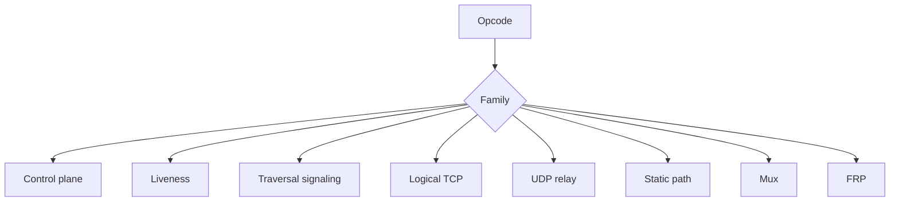
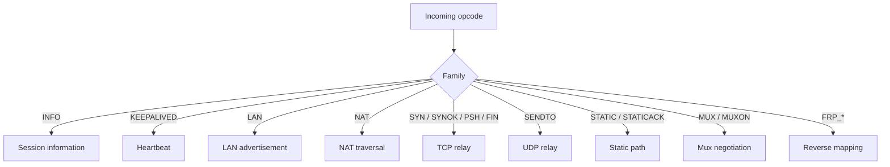
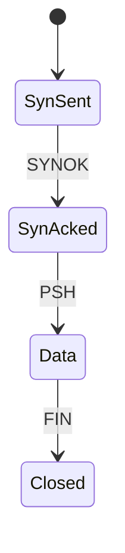

# Link-Layer Protocol Guide

[中文版本](LINKLAYER_PROTOCOL_CN.md)

## Scope

This document describes the internal tunnel opcode protocol implemented by `VirtualEthernetLinklayer`.
It is based on the actual source in `ppp/app/protocol/VirtualEthernetLinklayer.*`, `VirtualEthernetInformation.*`, and the client/server handlers that consume those actions.

## Why This Layer Exists

OPENPPP2 needs one shared vocabulary for:

1. session information
2. keepalive
3. LAN/NAT signaling
4. TCP relay
5. UDP relay
6. reverse mappings
7. static path negotiation
8. mux negotiation

Without a shared vocabulary, the client and server would have to guess what every packet means.

## Opcode Families

`VirtualEthernetLinklayer` defines these families:

- `INFO`, `KEEPALIVED`
- `FRP_ENTRY`, `FRP_CONNECT`, `FRP_CONNECTOK`, `FRP_PUSH`, `FRP_DISCONNECT`, `FRP_SENDTO`
- `LAN`, `NAT`, `SYN`, `SYNOK`, `PSH`, `FIN`, `SENDTO`, `ECHO`, `ECHOACK`, `STATIC`, `STATICACK`
- `MUX`, `MUXON`

The actual opcode values in code are:

- `INFO = 0x7E`
- `KEEPALIVED = 0x7F`
- `FRP_ENTRY = 0x20` through `FRP_SENDTO = 0x25`
- `LAN = 0x28` through `STATICACK = 0x32`
- `MUX = 0x35`
- `MUXON = 0x36`

## Why The Split Matters

The opcode families separate semantic jobs:

- control-plane information.
- liveness.
- subnet and traversal signaling.
- logical TCP.
- UDP relay.
- static path negotiation.
- multiplexing.
- reverse-path / FRP behavior.

That keeps the tunnel vocabulary compact but expressive.

## Family Meanings

- `INFO` carries session information and optional extension data.
- `KEEPALIVED` is the heartbeat path.
- `LAN` and `NAT` carry subnet and traversal signaling.
- `SYN` / `SYNOK` / `PSH` / `FIN` model logical TCP relay inside the tunnel.
- `SENDTO` carries UDP relay traffic.
- `ECHO` / `ECHOACK` support echo-style health behavior.
- `STATIC` / `STATICACK` negotiate the static packet path.
- `MUX` / `MUXON` negotiate multiplexing.
- `FRP_*` carry reverse-mapping control and data.

## `INFO` Payload

`INFO` carries a base `VirtualEthernetInformation` object plus optional extension JSON.
The extension path is used for IPv6 assignment, status, and control-plane feedback.

## Action Map

## Directionality

The code does not accept every action in every direction.
Client and server handlers enforce role legality.
Unexpected directions are rejected.

That matters because the same opcode can mean different operational things depending on whether it is handled on client or server side.

## `INFO` As The Control Plane

The `INFO` packet is not just a status blob.
It is the control-plane carrier for:

1. bandwidth QoS
2. traffic accounting
3. expiration
4. IPv6 assignment
5. IPv6 status
6. host-side application state

## Keepalive

`KEEPALIVED` is the heartbeat mechanism.
The transmission layer already has its own timeout and framing state, but the link layer still needs an explicit keepalive opcode for tunnel liveness semantics.

## LAN And NAT

`LAN` and `NAT` are not generic traffic opcodes.
They are signaling lanes for subnet visibility and traversal.

On the client and server sides, they feed the runtime's packet classification and forwarding decisions.

## TCP Relay Family

`SYN`, `SYNOK`, `PSH`, and `FIN` model logical TCP inside the tunnel.

The point is not to reimplement TCP.
The point is to let the tunnel relay TCP-like semantics across the overlay in a controlled way.

## UDP Relay Family

`SENDTO` is the UDP relay opcode.
It carries source and destination endpoint information plus payload bytes.

The endpoint parser in `VirtualEthernetLinklayer.cpp` shows that the format supports IP literals and domain names, and may use asynchronous DNS resolution when a coroutine context is available.

## Static Path Family

`STATIC` and `STATICACK` are used to negotiate static path behavior.
Static path is a separate concept from normal UDP relay because it has different state and different delivery semantics.

## MUX Family

`MUX` and `MUXON` negotiate multiplexing.
The runtime uses them to create and confirm a mux instance, then connect multiple logical link layers under that mux.

## FRP Family

`FRP_*` opcodes implement reverse-mapping and reverse-path behavior.
This is how the runtime can expose services back through the tunnel instead of only forwarding traffic outwards.

## Packet Layout For `INFO`

The `INFO` path carries:

1. a packed `VirtualEthernetInformation` base struct
2. optional extension JSON text

The extension JSON is deliberately optional so the same packet family can work for both plain status and richer IPv6 control data.

## Why This Protocol Is Separate

This layer is the semantic center of the tunnel.
It lets the runtime model control actions explicitly instead of hiding them inside a flat byte stream.

## Reading Strategy

If you want to understand the protocol layer from the code, read in this order:

1. opcode enum in `VirtualEthernetLinklayer.h`
2. packet dispatch in `VirtualEthernetLinklayer.cpp`
3. `VirtualEthernetInformation.*`
4. `VirtualEthernetPacket.*`
5. client/server handlers that override `On*` methods

That sequence keeps action vocabulary separate from transport and separate from host consequence.

## Related Documents

- `TRANSMISSION.md`
- `TUNNEL_DESIGN.md`
- `PACKET_FORMATS.md`

## Main Conclusion

The link-layer protocol is the tunnel's shared semantic language. It is the part of OPENPPP2 that turns a protected byte stream into a set of explicit overlay actions.
