# Link-Layer Protocol Guide

[中文版本](LINKLAYER_PROTOCOL_CN.md)

## Scope

This document describes the internal tunnel opcode protocol implemented by `VirtualEthernetLinklayer`.
It is based on the actual source in `ppp/app/protocol/VirtualEthernetLinklayer.*`, `VirtualEthernetInformation.*`, and the client/server handlers that consume those actions.

---

## Why This Layer Exists

OPENPPP2 needs one shared vocabulary for:

1. Session information
2. Keepalive
3. LAN/NAT signaling
4. TCP relay
5. UDP relay
6. Reverse mappings
7. Static path negotiation
8. MUX negotiation

Without a shared vocabulary, the client and server would have to guess what every packet means, making the system fragile and hard to extend.

---

## Protocol Position

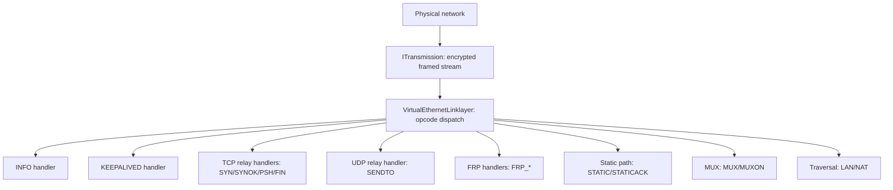

The linklayer sits between the protected transport and the runtime action handlers.

---

## Opcode Families

`VirtualEthernetLinklayer` defines these families:

| Family | Opcodes | Purpose |
|--------|---------|---------|
| Control | `INFO = 0x7E` | Session information and control-plane data |
| Liveness | `KEEPALIVED = 0x7F` | Heartbeat |
| FRP | `FRP_ENTRY = 0x20` to `FRP_SENDTO = 0x25` | Reverse mapping control and data |
| Traversal | `LAN = 0x28`, `NAT = 0x29` | Subnet and NAT traversal signaling |
| TCP relay | `SYN = 0x2A`, `SYNOK = 0x2B`, `PSH = 0x2C`, `FIN = 0x2D` | Logical TCP inside tunnel |
| UDP relay | `SENDTO = 0x2E` | UDP datagram relay |
| Echo | `ECHO = 0x2F`, `ECHOACK = 0x30` | Echo health path |
| Static path | `STATIC = 0x31`, `STATICACK = 0x32` | Static path negotiation |
| MUX | `MUX = 0x35`, `MUXON = 0x36` | Multiplexing negotiation |

Source: `ppp/app/protocol/VirtualEthernetLinklayer.h`

---

## Action Dispatch Map

```mermaid
flowchart TD
    A[Incoming opcode] --> B{Family}
    B -->|INFO 0x7E| C[Session information]
    B -->|KEEPALIVED 0x7F| D[Heartbeat]
    B -->|LAN 0x28| E[LAN subnet advertisement]
    B -->|NAT 0x29| F[NAT traversal signal]
    B -->|SYN 0x2A| G[TCP relay: connect request]
    B -->|SYNOK 0x2B| H[TCP relay: connect OK]
    B -->|PSH 0x2C| I[TCP relay: data push]
    B -->|FIN 0x2D| J[TCP relay: disconnect]
    B -->|SENDTO 0x2E| K[UDP relay: datagram]
    B -->|ECHO 0x2F| L[Echo health probe]
    B -->|ECHOACK 0x30| M[Echo health response]
    B -->|STATIC 0x31| N[Static path negotiate]
    B -->|STATICACK 0x32| O[Static path confirm]
    B -->|MUX 0x35| P[MUX negotiate]
    B -->|MUXON 0x36| Q[MUX confirm]
    B -->|FRP_ENTRY 0x20| R[FRP: mapping entry]
    B -->|FRP_CONNECT 0x21| S[FRP: connect]
    B -->|FRP_CONNECTOK 0x22| T[FRP: connect OK]
    B -->|FRP_PUSH 0x23| U[FRP: data push]
    B -->|FRP_DISCONNECT 0x24| V[FRP: disconnect]
    B -->|FRP_SENDTO 0x25| W[FRP: UDP relay]
```

---

## Directionality

The code does not accept every action in every direction.
Client and server handlers enforce role legality. Unexpected directions are rejected.

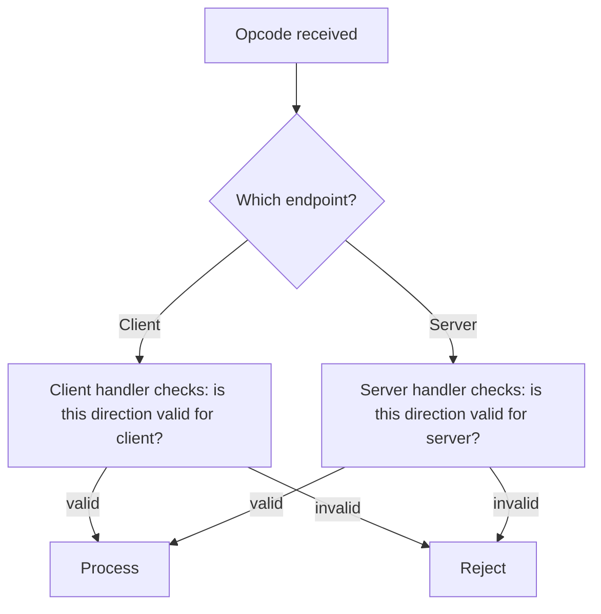

This matters because the same opcode can mean different operational things depending on whether it is handled on the client or server side.

---

## `INFO` — The Control Plane

`INFO` is not just a status blob. It is the control-plane carrier.

### What `INFO` Carries

| Field | Description |
|-------|-------------|
| Bandwidth QoS | Server-set bandwidth limit |
| Traffic accounting | Session traffic counters |
| Expiration | Session validity window |
| IPv6 assignment | IPv6 address assigned to client |
| IPv6 status | IPv6 operational state |
| Host-side state | Application-level host state feedback |

### `INFO` Packet Structure

```
[VirtualEthernetInformation base struct]
[optional extension JSON text]
```

The extension JSON is deliberately optional so the same packet family works for both plain status and richer IPv6 control data.

### `INFO` Flow

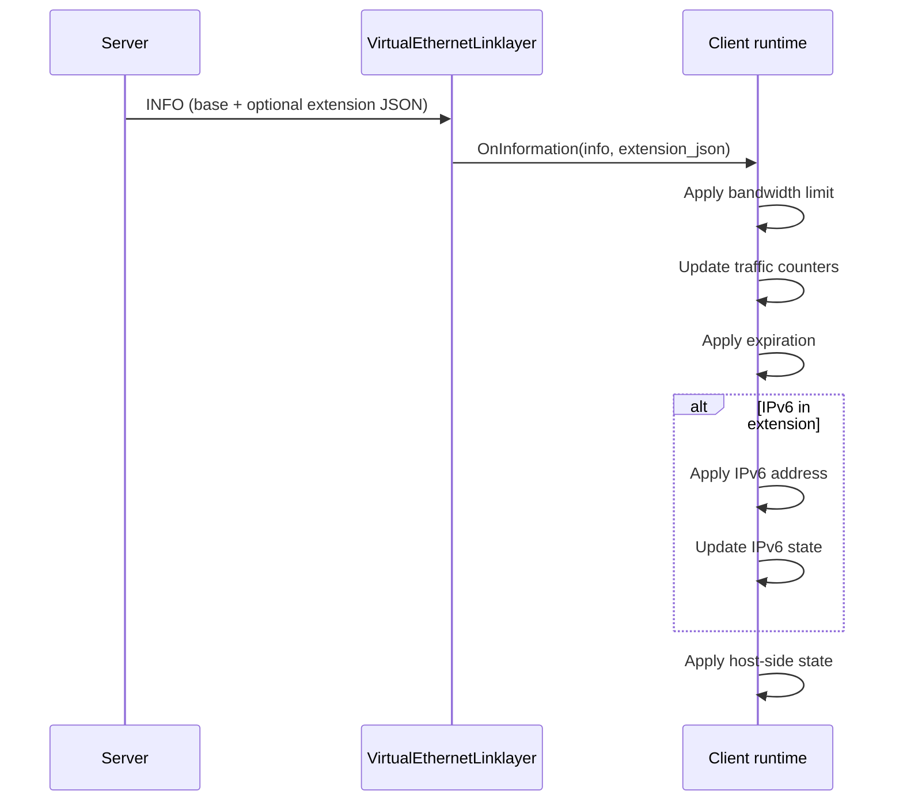

Source: `ppp/app/protocol/VirtualEthernetInformation.h`

---

## Keepalive

`KEEPALIVED` is the heartbeat mechanism.

The transmission layer has its own timeout and framing state, but the linklayer still needs an explicit keepalive opcode for tunnel liveness semantics — specifically to detect silent connectivity loss at the overlay level.

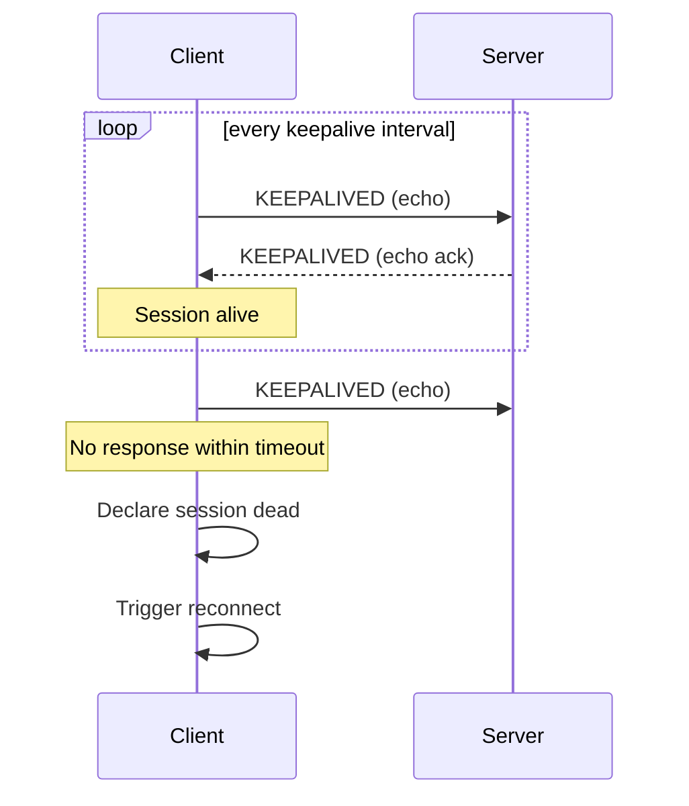

---

## LAN And NAT Signaling

`LAN` and `NAT` are not generic traffic opcodes. They are signaling lanes for subnet visibility and traversal.

| Opcode | Purpose | Consumed by |
|--------|---------|-------------|
| `LAN` | Announce subnet reachability | Runtime packet classifier |
| `NAT` | Signal NAT traversal parameters | Forwarding decision engine |

On client and server sides, they feed packet classification and forwarding decisions.

---

## TCP Relay Family

`SYN`, `SYNOK`, `PSH`, and `FIN` model logical TCP inside the tunnel.

The point is not to reimplement TCP. The point is to relay TCP-like semantics across the overlay in a controlled, explicit way.

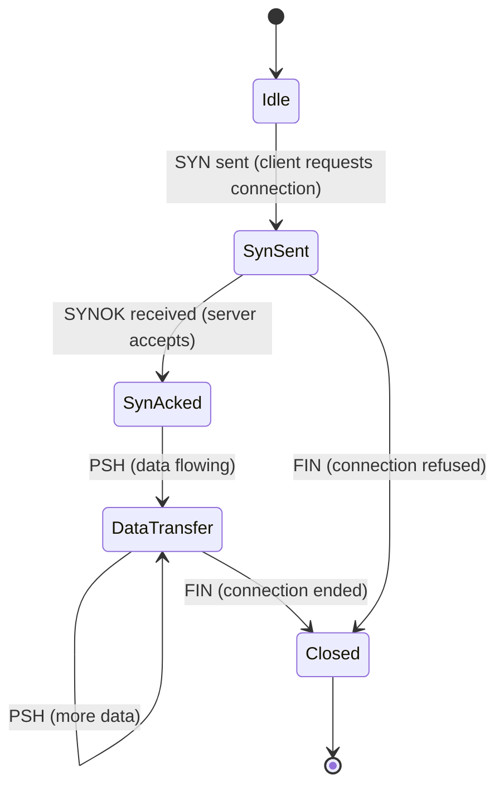

### TCP Relay Sequence

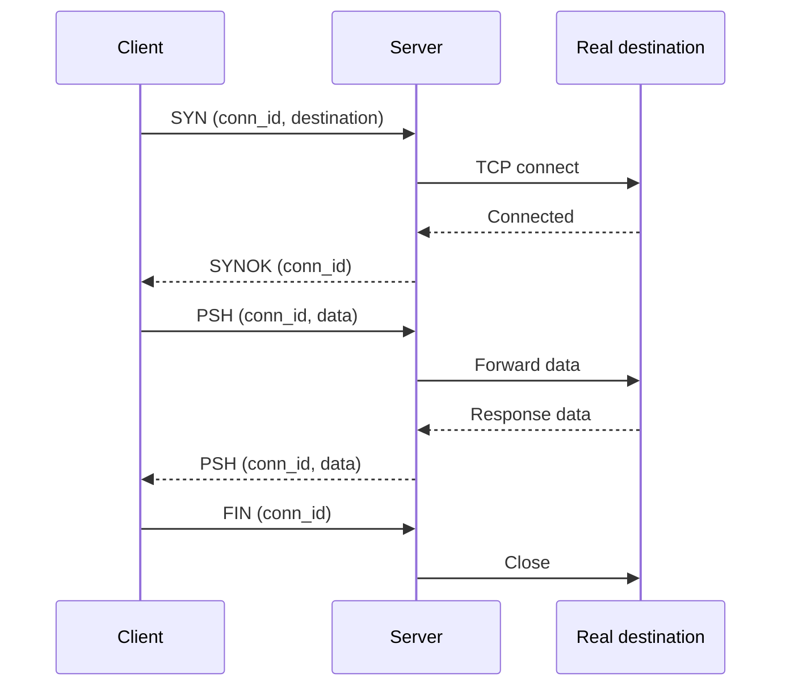

---

## UDP Relay Family

`SENDTO` is the UDP relay opcode. It carries source and destination endpoint information plus payload bytes.

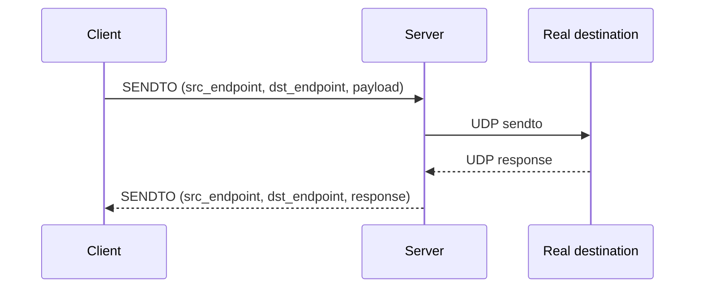

The endpoint parser in `VirtualEthernetLinklayer.cpp` supports:
- IPv4 and IPv6 literals
- Domain names with optional async DNS resolution
- IPv4-in-IPv6 mapped addresses

---

## Echo Family

`ECHO` and `ECHOACK` support echo-style health behavior.

Unlike `KEEPALIVED` (which is a tunnel-level heartbeat), `ECHO`/`ECHOACK` can be used for more targeted health probing, such as measuring round-trip latency or verifying specific path reachability.

---

## Static Path Family

`STATIC` and `STATICACK` negotiate the static packet path.

Static path is a separate concept from normal UDP relay:
- It has different state.
- It has different delivery semantics.
- It is used for alternative path setups (e.g., when the main tunnel path has high latency or loss).

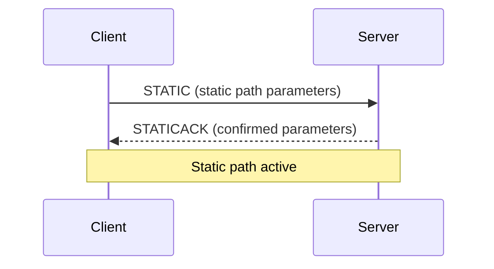

---

## MUX Family

`MUX` and `MUXON` negotiate multiplexing.

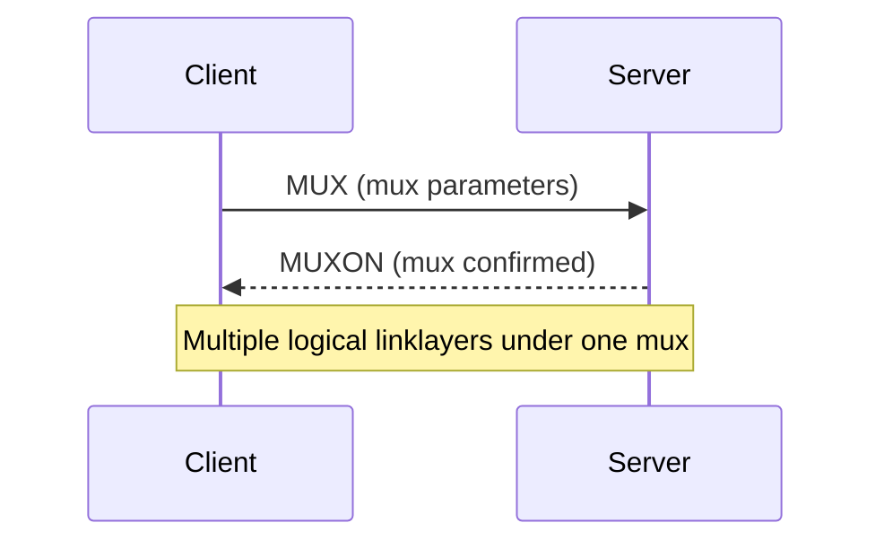

The runtime uses MUX to create and confirm a mux instance, then connect multiple logical link layers under that mux. This allows more efficient use of the underlying transport connection.

---

## FRP Family

`FRP_*` opcodes implement reverse-mapping and reverse-path behavior.

This is how the runtime can expose services back through the tunnel instead of only forwarding traffic outwards.

| Opcode | Purpose |
|--------|---------|
| `FRP_ENTRY` | Register a reverse mapping entry |
| `FRP_CONNECT` | Client requests connection to mapped service |
| `FRP_CONNECTOK` | Server confirms connection to mapped service |
| `FRP_PUSH` | Data push for FRP connection |
| `FRP_DISCONNECT` | FRP connection closed |
| `FRP_SENDTO` | UDP relay for FRP path |

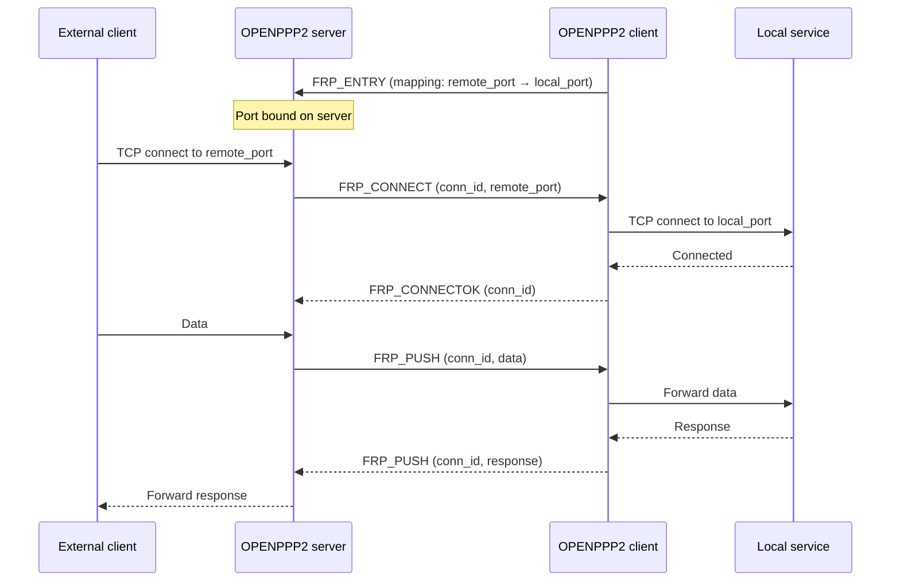

---

## Packet Layout Overview

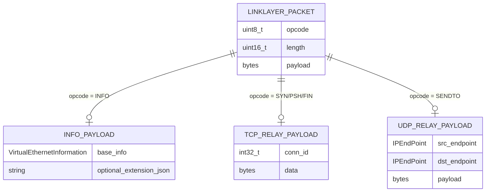

---

## `INFO` As The Control Plane

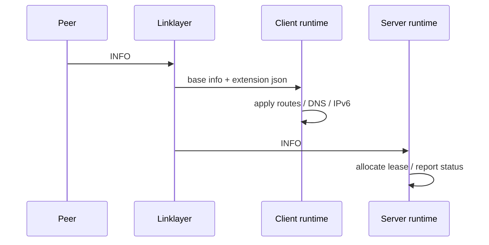

---

## Reading Strategy

If you want to understand the protocol layer from source, read in this order:

1. Opcode enum in `VirtualEthernetLinklayer.h`
2. Packet dispatch in `VirtualEthernetLinklayer.cpp`
3. `VirtualEthernetInformation.*` — control plane data structure
4. `VirtualEthernetPacket.*` — packet building helpers
5. Client handler overrides of `On*` methods in `VEthernetExchanger.*`
6. Server handler overrides of `On*` methods in `VirtualEthernetExchanger.*`

That sequence keeps action vocabulary separate from transport and separate from host consequence.

---

## Error Code Reference

Linklayer-related `ppp::diagnostics::ErrorCode` values (from `ppp/diagnostics/ErrorCodes.def`):

| ErrorCode | Description |
|-----------|-------------|
| `ProtocolPacketActionInvalid` | Received opcode not recognized |
| `ProtocolFrameInvalid` | Opcode frame structure invalid |
| `SessionHandshakeFailed` | INFO exchange during handshake failed |
| `SessionAuthFailed` | Session authentication failed |
| `KeepaliveTimeout` | Peer keepalive heartbeat timed out |
| `ProtocolMuxFailed` | MUX/MUXON exchange failed |
| `MappingCreateFailed` | FRP entry registration failed |
| `SocketConnectFailed` | TCP relay connect failed |

---

## Related Documents

- [`TRANSMISSION.md`](TRANSMISSION.md)
- [`TUNNEL_DESIGN.md`](TUNNEL_DESIGN.md)
- [`PACKET_FORMATS.md`](PACKET_FORMATS.md)
- [`HANDSHAKE_SEQUENCE.md`](HANDSHAKE_SEQUENCE.md)
- [`CLIENT_ARCHITECTURE.md`](CLIENT_ARCHITECTURE.md)
- [`SERVER_ARCHITECTURE.md`](SERVER_ARCHITECTURE.md)

---

## Main Conclusion

The link-layer protocol is the tunnel's shared semantic language. It is the part of OPENPPP2 that turns a protected byte stream into a set of explicit overlay actions. Without it, the runtime would have no way to express session information, TCP relay semantics, UDP relay, reverse mappings, or multiplexing in a controlled and extensible way.
