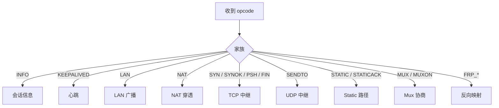
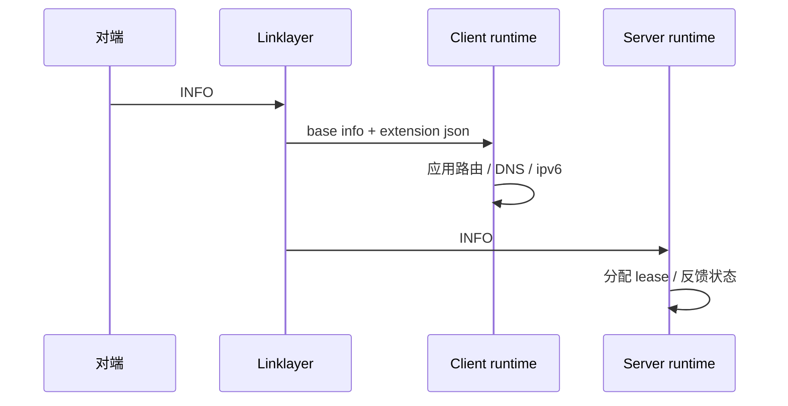
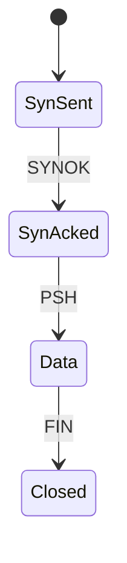

# 链路层协议指南

[English Version](LINKLAYER_PROTOCOL.md)

## 范围

本文描述 `VirtualEthernetLinklayer` 实现的内部隧道动作协议。
所有描述都来自 `ppp/app/protocol/VirtualEthernetLinklayer.*`、`VirtualEthernetInformation.*` 以及消费这些动作的 client / server 处理器。

## 为什么需要这一层

OPENPPP2 需要一套统一词汇来表达：

1. 会话信息
2. 保活
3. LAN/NAT 信令
4. TCP 中继
5. UDP 中继
6. 反向映射
7. static 路径协商
8. mux 协商

如果没有这套统一词汇，客户端和服务端就只能猜每个包到底代表什么。

## 操作码分组

`VirtualEthernetLinklayer` 定义的动作家族包括：

- `INFO`、`KEEPALIVED`
- `FRP_ENTRY`、`FRP_CONNECT`、`FRP_CONNECTOK`、`FRP_PUSH`、`FRP_DISCONNECT`、`FRP_SENDTO`
- `LAN`、`NAT`、`SYN`、`SYNOK`、`PSH`、`FIN`、`SENDTO`、`ECHO`、`ECHOACK`、`STATIC`、`STATICACK`
- `MUX`、`MUXON`

代码中的实际值是：

- `INFO = 0x7E`
- `KEEPALIVED = 0x7F`
- `FRP_ENTRY = 0x20` 到 `FRP_SENDTO = 0x25`
- `LAN = 0x28` 到 `STATICACK = 0x32`
- `MUX = 0x35`
- `MUXON = 0x36`

## 各家族含义

- `INFO` 承载会话信息和扩展数据。
- `KEEPALIVED` 是心跳路径。
- `LAN` 和 `NAT` 承载子网与穿透信令。
- `SYN` / `SYNOK` / `PSH` / `FIN` 在隧道内模拟逻辑 TCP。
- `SENDTO` 承载 UDP 中继。
- `ECHO` / `ECHOACK` 支持 echo 式健康检查。
- `STATIC` / `STATICACK` 协商 static 分组路径。
- `MUX` / `MUXON` 协商多路复用。
- `FRP_*` 承载反向映射控制和数据。

## `INFO` 载荷

`INFO` 由基础 `VirtualEthernetInformation` 和可选扩展 JSON 组成。
扩展路径主要用于 IPv6 分配、状态和控制面反馈。

## 动作总图

## 方向性

代码不会接受任何方向上的所有动作。
client 和 server 的处理器会强制角色合法性，遇到不该来的方向会拒绝。

这很重要，因为同一个 opcode 在不同处理端可能代表不同的运行语义。

## `INFO` 作为控制面

`INFO` 不只是状态 blob。
它实际上承载：

1. 带宽 QoS
2. 流量计数
3. 过期时间
4. IPv6 分配
5. IPv6 状态
6. 宿主侧应用状态

## 保活

`KEEPALIVED` 是心跳机制。
传输层自己已经有 timeout 和 framing state，但隧道语义仍然需要一个显式的保活 opcode 来表达链路活性。

## LAN 和 NAT

`LAN` 和 `NAT` 不是泛化流量 opcode。
它们是子网可见性和穿透行为的信令通道。

在客户端和服务端，这两个 opcode 会影响 packet classification 和 forwarding 决策。

## TCP 中继家族

`SYN`、`SYNOK`、`PSH`、`FIN` 用来模拟隧道内逻辑 TCP。

重点不是重写 TCP，而是让隧道可以在受控语义下复用 TCP 风格会话。

## UDP 中继家族

`SENDTO` 是 UDP 中继 opcode。
它携带 source 和 destination endpoint 信息，以及 payload bytes。

`VirtualEthernetLinklayer.cpp` 里的 endpoint 解析逻辑表明：格式同时支持 IP literal 和 domain name，并且在协程上下文可用时可以做异步 DNS 解析。

## Static 路径家族

`STATIC` 和 `STATICACK` 用来协商 static 分组路径。
static 路径和普通 UDP 中继是分开的，因为它们的状态和投递语义不同。

## MUX 家族

`MUX` 和 `MUXON` 用来协商多路复用。
运行时会先创建和确认 mux 实例，再把多个逻辑 link layer 接到这个 mux 下面。

## FRP 家族

`FRP_*` opcode 实现反向映射与反向路径行为。
它让运行时不只会把流量往外转，还可以把服务暴露回隧道内。

## `INFO` 的包结构

`INFO` 路径包含：

1. 一个 packed 的 `VirtualEthernetInformation` 基础结构体
2. 可选的扩展 JSON 文本

扩展 JSON 是可选的，这样同一类消息既能承载普通状态，也能承载更丰富的 IPv6 控制数据。

## 为什么要单独拆这层

它是隧道的语义中心。
把控制动作显式建模，比把它们隐藏在一条平坦字节流里更容易维护。

## 阅读顺序

如果你要从源码理解这一层，建议顺序是：

1. `VirtualEthernetLinklayer.h` 里的 opcode enum。
2. `VirtualEthernetLinklayer.cpp` 里的 packet dispatch。
3. `VirtualEthernetInformation.*`。
4. `VirtualEthernetPacket.*`。
5. client / server 中 override `On*` 的处理器。

这样读可以把动作词汇、传输和宿主后果分开。

## 相关文档

- `TRANSMISSION_CN.md`
- `TUNNEL_DESIGN_CN.md`
- `PACKET_FORMATS_CN.md`

## 主结论

链路层协议是隧道的共享语义语言。它把受保护字节流变成一组明确的 overlay 动作。
