# 链路层协议指南

[English Version](LINKLAYER_PROTOCOL.md)

## 范围

本文描述 `VirtualEthernetLinklayer` 实现的内部隧道动作协议。
所有描述都来自 `ppp/app/protocol/VirtualEthernetLinklayer.*`、`VirtualEthernetInformation.*` 以及消费这些动作的 client / server 处理器。

---

## 为什么需要这一层

OPENPPP2 需要一套统一词汇来表达：

1. 会话信息
2. 保活
3. LAN/NAT 信令
4. TCP 中继
5. UDP 中继
6. 反向映射
7. Static 路径协商
8. MUX 协商

如果没有这套统一词汇，客户端和服务端就只能猜每个包到底代表什么，系统会变得脆弱且难以扩展。

---

## 协议层次定位

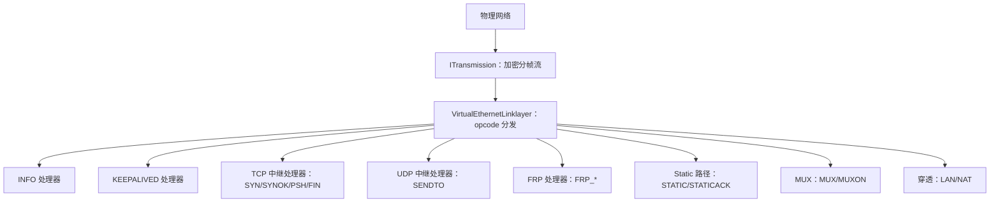

链路层位于受保护传输与运行时动作处理器之间。

---

## 操作码分组

`VirtualEthernetLinklayer` 定义的动作家族：

| 家族 | 操作码 | 用途 |
|------|--------|------|
| 控制 | `INFO = 0x7E` | 会话信息和控制面数据 |
| 保活 | `KEEPALIVED = 0x7F` | 心跳 |
| FRP | `FRP_ENTRY = 0x20` 到 `FRP_SENDTO = 0x25` | 反向映射控制和数据 |
| 穿透 | `LAN = 0x28`、`NAT = 0x29` | 子网和 NAT 穿透信令 |
| TCP 中继 | `SYN = 0x2A`、`SYNOK = 0x2B`、`PSH = 0x2C`、`FIN = 0x2D` | 隧道内逻辑 TCP |
| UDP 中继 | `SENDTO = 0x2E` | UDP 数据报中继 |
| Echo | `ECHO = 0x2F`、`ECHOACK = 0x30` | Echo 健康探针 |
| Static 路径 | `STATIC = 0x31`、`STATICACK = 0x32` | Static 路径协商 |
| MUX | `MUX = 0x35`、`MUXON = 0x36` | 多路复用协商 |

源文件：`ppp/app/protocol/VirtualEthernetLinklayer.h`

---

## 动作分发总图

```mermaid
flowchart TD
    A[收到 opcode] --> B{家族}
    B -->|INFO 0x7E| C[会话信息]
    B -->|KEEPALIVED 0x7F| D[心跳]
    B -->|LAN 0x28| E[LAN 子网广播]
    B -->|NAT 0x29| F[NAT 穿透信号]
    B -->|SYN 0x2A| G[TCP 中继：连接请求]
    B -->|SYNOK 0x2B| H[TCP 中继：连接成功]
    B -->|PSH 0x2C| I[TCP 中继：数据推送]
    B -->|FIN 0x2D| J[TCP 中继：断开]
    B -->|SENDTO 0x2E| K[UDP 中继：数据报]
    B -->|ECHO 0x2F| L[Echo 健康探针]
    B -->|ECHOACK 0x30| M[Echo 健康响应]
    B -->|STATIC 0x31| N[Static 路径协商]
    B -->|STATICACK 0x32| O[Static 路径确认]
    B -->|MUX 0x35| P[MUX 协商]
    B -->|MUXON 0x36| Q[MUX 确认]
    B -->|FRP_ENTRY 0x20| R[FRP：映射条目]
    B -->|FRP_CONNECT 0x21| S[FRP：连接]
    B -->|FRP_CONNECTOK 0x22| T[FRP：连接成功]
    B -->|FRP_PUSH 0x23| U[FRP：数据推送]
    B -->|FRP_DISCONNECT 0x24| V[FRP：断开]
    B -->|FRP_SENDTO 0x25| W[FRP：UDP 中继]
```

---

## 方向性

代码不会接受任何方向上的所有动作。
client 和 server 的处理器会强制角色合法性，遇到不该来的方向会拒绝。

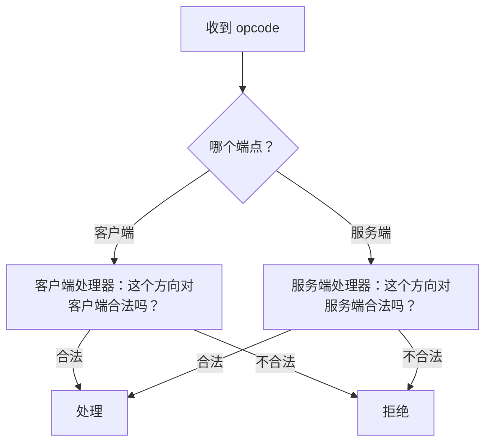

这很重要，因为同一个 opcode 在不同处理端可能代表不同的运行语义。

---

## `INFO` — 控制面

`INFO` 不只是状态 blob，它是控制面载体。

### `INFO` 承载的内容

| 字段 | 说明 |
|------|------|
| 带宽 QoS | 服务端设置的带宽限制 |
| 流量计数 | 会话流量计数器 |
| 过期时间 | 会话有效期窗口 |
| IPv6 分配 | 分配给客户端的 IPv6 地址 |
| IPv6 状态 | IPv6 运行状态 |
| 宿主侧状态 | 应用层宿主状态反馈 |

### `INFO` 包结构

```
[VirtualEthernetInformation 基础结构体]
[可选扩展 JSON 文本]
```

扩展 JSON 是可选的，这样同一类消息既能承载普通状态，也能承载更丰富的 IPv6 控制数据。

### `INFO` 流程

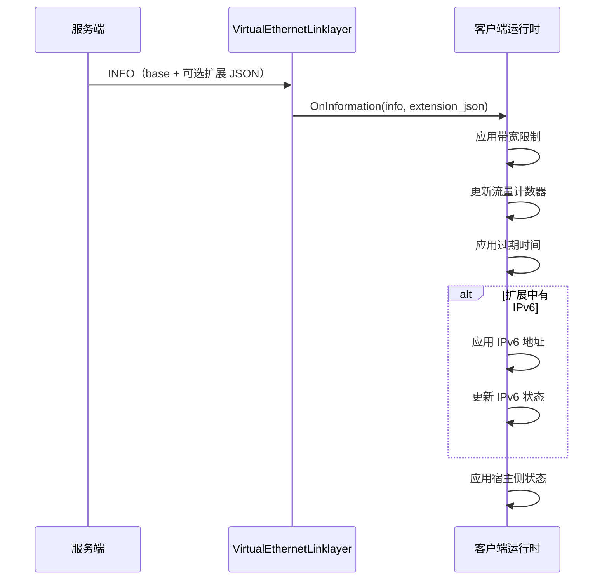

源文件：`ppp/app/protocol/VirtualEthernetInformation.h`

---

## 保活

`KEEPALIVED` 是心跳机制。

传输层自己已经有 timeout 和 framing state，但隧道语义仍然需要一个显式的保活 opcode——专门用来在 overlay 层检测沉默式连接丢失。

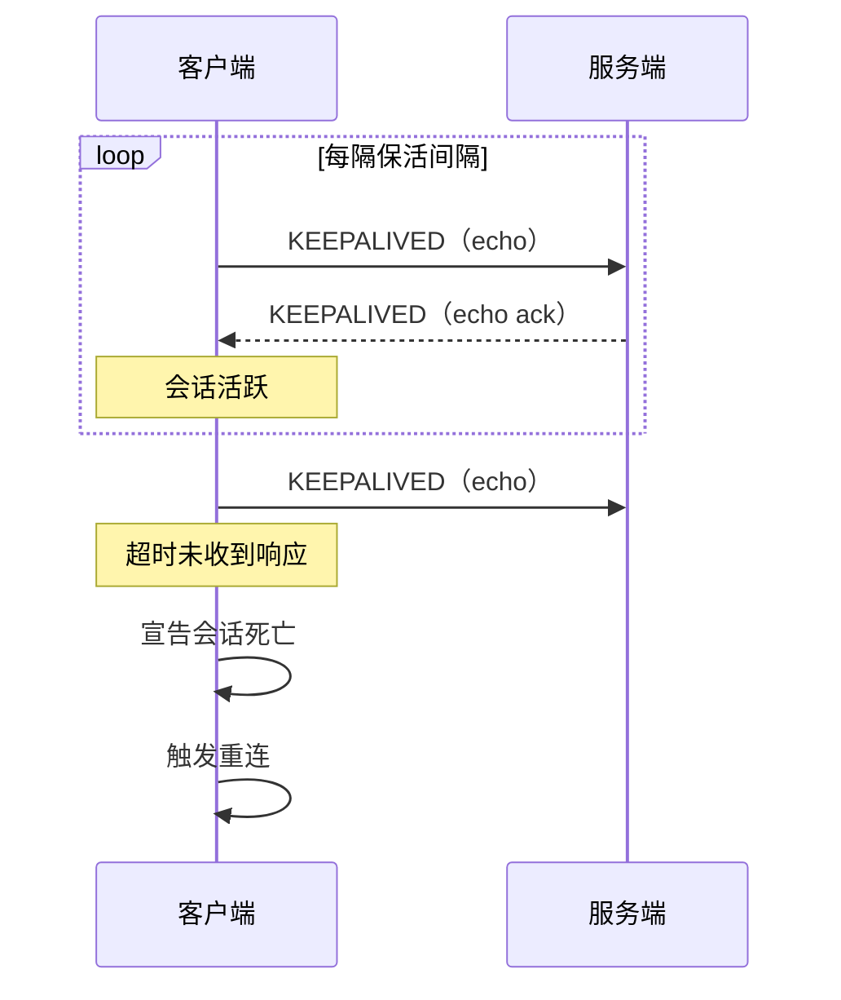

---

## LAN 和 NAT 信令

`LAN` 和 `NAT` 不是泛化流量 opcode，而是子网可见性和穿透行为的信令通道。

| 操作码 | 用途 | 消费方 |
|--------|------|--------|
| `LAN` | 广播子网可达性 | 运行时包分类器 |
| `NAT` | 信令 NAT 穿透参数 | 转发决策引擎 |

在客户端和服务端，这两个 opcode 会影响包分类和转发决策。

---

## TCP 中继家族

`SYN`、`SYNOK`、`PSH`、`FIN` 用来模拟隧道内逻辑 TCP。

重点不是重写 TCP，而是让隧道可以在受控语义下以显式方式复用 TCP 风格会话。

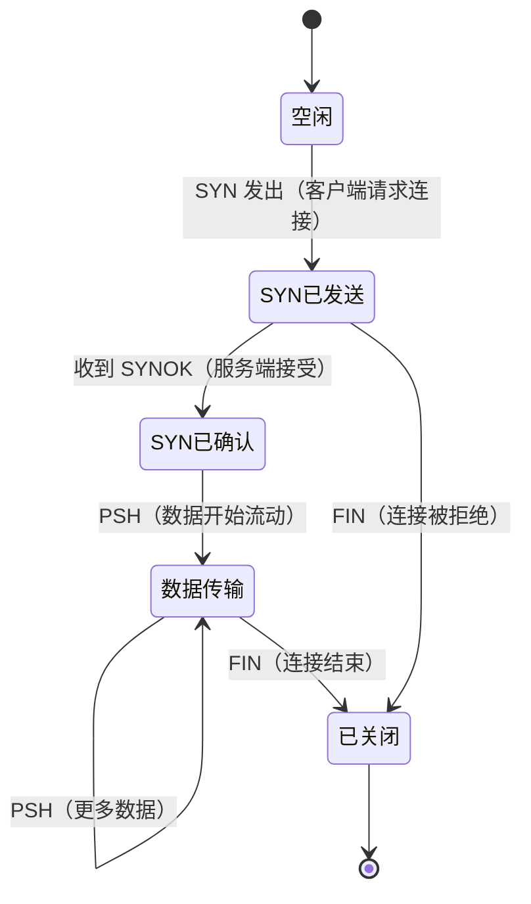

### TCP 中继时序

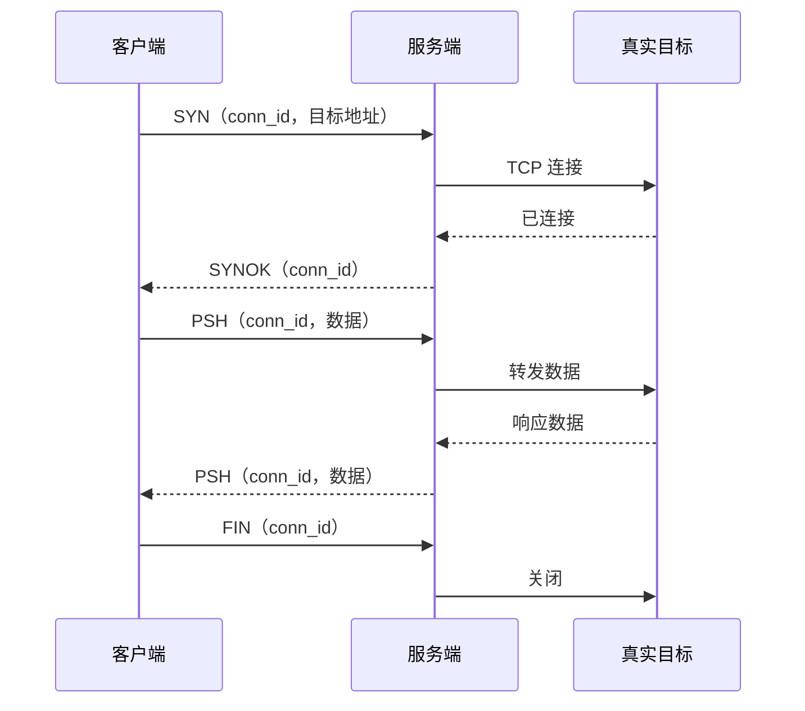

---

## UDP 中继家族

`SENDTO` 是 UDP 中继 opcode，携带 source 和 destination endpoint 信息以及 payload bytes。

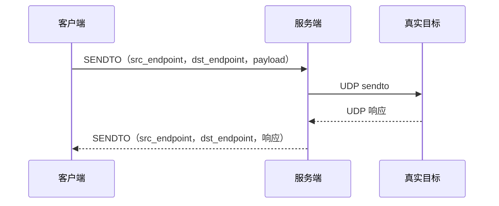

`VirtualEthernetLinklayer.cpp` 中的 endpoint 解析逻辑支持：
- IPv4 和 IPv6 字面量
- 域名（在协程上下文可用时支持异步 DNS 解析）
- IPv4-in-IPv6 映射地址

---

## Echo 家族

`ECHO` 和 `ECHOACK` 支持 echo 式健康行为。

与 `KEEPALIVED`（隧道级心跳）不同，`ECHO`/`ECHOACK` 可用于更有针对性的健康探针，比如测量往返延迟或验证特定路径可达性。

---

## Static 路径家族

`STATIC` 和 `STATICACK` 协商 static 分组路径。

static 路径和普通 UDP 中继是分开的：
- 它有不同的状态
- 它有不同的投递语义
- 它用于替代路径建立（例如当主隧道路径高延迟或丢包时）

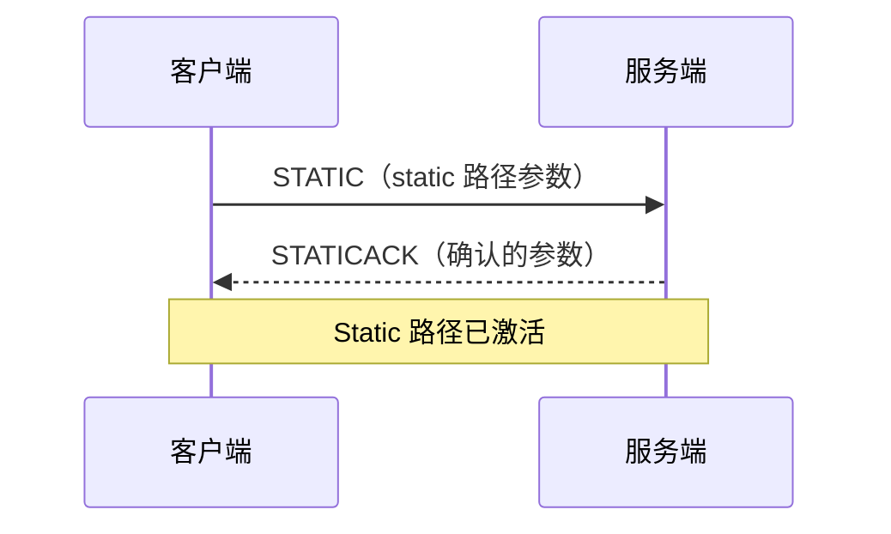

---

## MUX 家族

`MUX` 和 `MUXON` 协商多路复用。

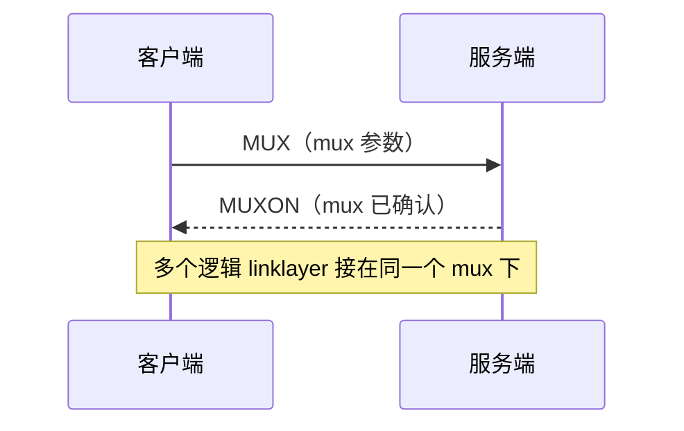

运行时会先创建和确认 mux 实例，再把多个逻辑 link layer 接到这个 mux 下面，更高效地利用底层传输连接。

---

## FRP 家族

`FRP_*` opcode 实现反向映射与反向路径行为。
它让运行时不只会把流量往外转，还可以把服务暴露回隧道内。

| 操作码 | 用途 |
|--------|------|
| `FRP_ENTRY` | 注册反向映射条目 |
| `FRP_CONNECT` | 客户端请求连接到映射服务 |
| `FRP_CONNECTOK` | 服务端确认连接到映射服务 |
| `FRP_PUSH` | FRP 连接的数据推送 |
| `FRP_DISCONNECT` | FRP 连接关闭 |
| `FRP_SENDTO` | FRP 路径的 UDP 中继 |

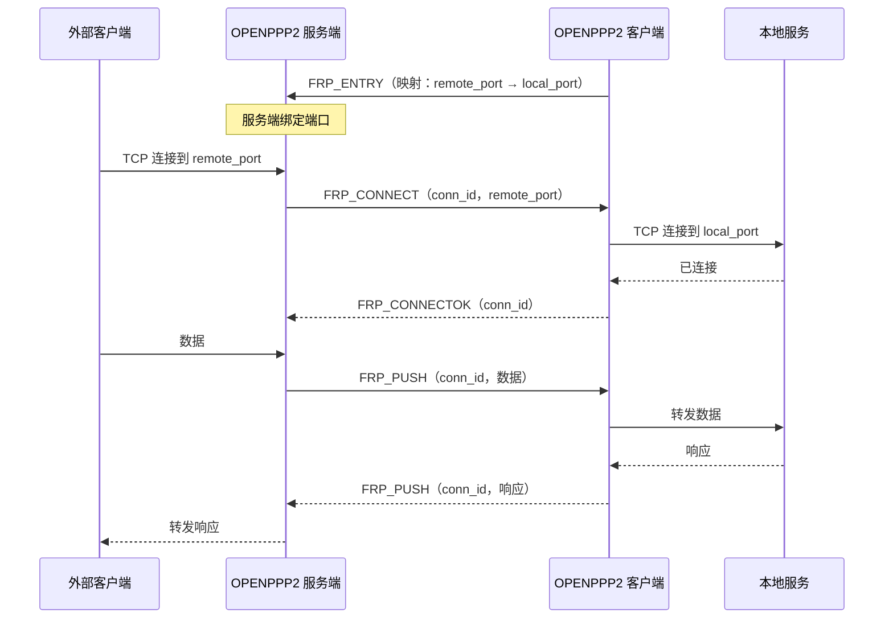

---

## 数据包布局概览

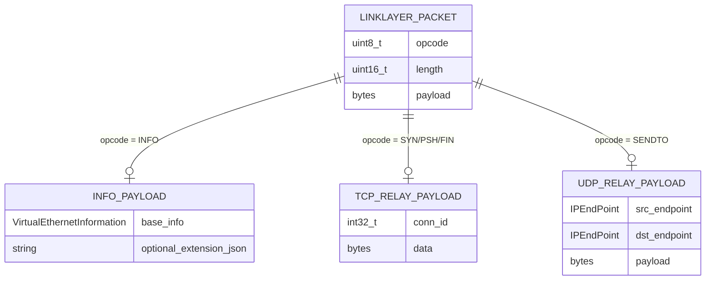

---

## 阅读顺序

如果你要从源码理解这一层，建议顺序是：

1. `VirtualEthernetLinklayer.h` 中的 opcode enum
2. `VirtualEthernetLinklayer.cpp` 中的 packet dispatch
3. `VirtualEthernetInformation.*` — 控制面数据结构
4. `VirtualEthernetPacket.*` — 包构建辅助
5. `VEthernetExchanger.*` 中 override `On*` 的客户端处理器
6. `VirtualEthernetExchanger.*` 中 override `On*` 的服务端处理器

这样读可以把动作词汇、传输和宿主后果分开。

---

## 错误码参考

链路层相关的 `ppp::diagnostics::ErrorCode` 值（来自 `ppp/diagnostics/ErrorCodes.def`）：

| ErrorCode | 说明 |
|-----------|------|
| `ProtocolPacketActionInvalid` | 收到的 opcode 无法识别 |
| `ProtocolFrameInvalid` | opcode 帧结构无效 |
| `SessionHandshakeFailed` | 握手期间 INFO 交换失败 |
| `SessionAuthFailed` | 会话认证失败 |
| `KeepaliveTimeout` | 对端保活心跳超时 |
| `ProtocolMuxFailed` | MUX/MUXON 交换失败 |
| `MappingCreateFailed` | FRP 条目注册失败 |
| `SocketConnectFailed` | TCP 中继连接失败 |

---

## 相关文档

- [`TRANSMISSION_CN.md`](TRANSMISSION_CN.md)
- [`TUNNEL_DESIGN_CN.md`](TUNNEL_DESIGN_CN.md)
- [`PACKET_FORMATS_CN.md`](PACKET_FORMATS_CN.md)
- [`HANDSHAKE_SEQUENCE_CN.md`](HANDSHAKE_SEQUENCE_CN.md)
- [`CLIENT_ARCHITECTURE_CN.md`](CLIENT_ARCHITECTURE_CN.md)
- [`SERVER_ARCHITECTURE_CN.md`](SERVER_ARCHITECTURE_CN.md)

---

## 主结论

链路层协议是隧道的共享语义语言。它把受保护字节流变成一组明确的 overlay 动作。没有它，运行时就无法以受控且可扩展的方式表达会话信息、TCP 中继语义、UDP 中继、反向映射或多路复用。
