# 链路层协议指南

[English Version](LINKLAYER_PROTOCOL.md)

## 文档范围

本文档描述由 `VirtualEthernetLinklayer` 实现的内部隧道动作协议。链路层协议是 OPENPPP2 虚拟以太网系统的核心组成部分，负责在服务端与客户端之间传递控制信令与数据流量。理解本协议对于掌握整个系统的运行机制至关重要。

## 为什么需要这一层

OPENPPP2 需要一套共享的协议词汇来表达多种网络功能，包括会话信息交换、保活检测、虚拟子网转发、UDP 中继、TCP 中继、反向映射、static 路径协商以及 mux 多路复用协商等。如果没有统一的协议规范，分布式系统中的各个组件将无法协同工作。

`VirtualEthernetLinklayer` 就是这套共享语义，它定义了隧道内传输的所有动作类型及其载荷格式。通过动作驱动的设计思路，系统可以在单一隧道内复用多种网络功能，避免为每种功能建立独立的隧道连接。这种设计既提高了资源利用率，又简化了网络拓扑。

### 协议设计原则

链路层协议的设计遵循以下核心原则：

1. **紧凑的二进制表示**：所有动作均采用紧凑的二进制编码，确保传输效率最大化
2. **可扩展的载荷设计**：信息类动作支持扩展 JSON，满足未来功能扩展需求
3. **明确的角色约束**：不同角色（客户端/服务端）只能发送/接收特定的动作类型
4. **会话感知**：TCP 中继等操作需要维护会话状态，而非简单的无状态转发

## 动作类型总览表

下表列出了链路层协议支持的所有动作类型及其分类：

| 动作类型 | 分类 | 方向 | 简要说明 |
|---------|------|------|----------|
| INFO | 信息与保活 | 服务端→客户端 | 向下发送会话信息和配置 |
| KEEPALIVED | 信息与保活 | 双向 | 心跳保活检测 |
| LAN | 数据与转发 | 双向 | 虚拟子网信令 |
| NAT | 数据与转发 | 双向 | NAT 穿透信令 |
| SENDTO | 数据与转发 | 双向 | UDP 中继数据转发 |
| ECHO | 数据与转发 | 双向 | ICMP echo 请求 |
| ECHOACK | 数据与转发 | 双向 | ICMP echo 响应 |
| SYN | TCP 中继 | 客户端→服务端 | TCP 连接建立请求 |
| SYNOK | TCP 中继 | 服务端→客户端 | TCP 连接建立响应 |
| PSH | TCP 中继 | 双向 | TCP 数据推送 |
| FIN | TCP 中继 | 双向 | TCP 连接关闭 |
| STATIC | Static 路径 | 双向 | 静态路径协商 |
| STATICACK | Static 路径 | 双向 | 静态路径确认 |
| MUX | MUX 多路复用 | 双向 | 多路复用协商 |
| MUXON | MUX 多路复用 | 双向 | 多路复用确认 |
| FRP_ENTRY | FRP 映射 | 客户端→服务端 | 注册反向映射 |
| FRP_CONNECT | FRP 映射 | 客户端→服务端 | 连接建立请求 |
| FRP_CONNECTOK | FRP 映射 | 服务端→客户端 | 连接建立响应 |
| FRP_PUSH | FRP 映射 | 双向 | 数据推送 |
| FRP_DISCONNECT | FRP 映射 | 双向 | 连接断开 |
| FRP_SENDTO | FRP 映射 | 双向 | UDP 风格数据发送 |

## 消息格式详解

### 基础消息结构

所有链路层消息共享统一的基础结构：

```
+----------------+----------------+----------------+----------------+
|  源端口 (2B)   |  目的端口 (2B) |  动作类型 (1B)  |  选项标志 (1B)  |
+----------------+----------------+----------------+----------------+
|                    操作数 / 载荷长度 (4B)                      |
+----------------+----------------+----------------+----------------+
|                         载荷数据 (可变)                       |
+----------------+----------------+----------------+----------------+
```

#### 各字段详细说明

| 字段 | 长度 | 说明 | 取值范围 |
|------|------|------|----------|
| 源端口 | 2 字节 | 发送方分配的虚拟端口号 | 0x0001-0xFFFF |
| 目的端口 | 2 字节 | 接收方的虚拟端口号 | 0x0001-0xFFFF |
| 动作类型 | 1 字节 | 要执行的动作操作码 | 0x01-0xFF |
| 选项标志 | 1 字节 | 控制选项和标志位 | 位掩码 |
| 载荷长度 | 4 字节 | 载荷数据的字节数 | 0-0xFFFFFFFF |
| 载荷数据 | 可变 | 动作特定的数据 | 依赖于动作类型 |

#### 选项标志位定义

| 位 | 名称 | 说明 |
|----|------|------|
| 0x01 | FRAGMENTED | 消息已被分片 |
| 0x02 | COMPRESSED | 载荷经过压缩 |
| 0x04 | ENCRYPTED | 载荷经过加密 |
| 0x08 | PRIORITY | 高优先级消息 |
| 0x10 | KEEPALIVE | 保活消息 |
| 0x20 | MULTICAST | 多播消息 |

### INFO 消息格式

INFO 消息用于传递会话信息和配置数据，是服务端向客户端下发配置的主要方式。

```
+----------------+----------------+----------------+----------------+
|       0x0000 (源端口)        |    目标端口    |   ACTION_INFO   |    选项标志    |
+----------------+----------------+----------------+----------------+
|                    载荷长度 (4B)                        |
+----------------+----------------+----------------+----------------+
|   VirtualEthernetInformation (二进制结构)               |
+----------------+----------------+----------------+----------------+
|              扩展 JSON (UTF-8 字符串，可选)              |
+----------------+----------------+----------------+----------------+
```

#### VirtualEthernetInformation 结构

| 字段 | 类型 | 大小 | 说明 |
|------|------|------|------|
| Version | uint8 | 1B | 协议版本号 |
| SessionID | uint64 | 8B | 会话唯一标识 |
| ClientIP | uint32 | 4B | 客户端虚拟 IP |
| SubnetMask | uint32 | 4B | 子网掩码 |
| GatewayIP | uint32 | 4B | 网关 IP |
| DNS1 | uint32 | 4B | 主 DNS 服务器 |
| DNS2 | uint32 | 4B | 备 DNS 服务器 |
| MTU | uint16 | 2B | 最大传输单元 |
| Flags | uint32 | 4B | 配置标志位 |

### TCP 中继消息格式

TCP 中继家族（SYN、SYNOK、PSH、FIN）共享相似的消息格式：

```
+----------------+----------------+----------------+----------------+
|   本地端口 (2B)  |   对端端口 (2B) |  动作类型 (1B)  |    选项标志    |
+----------------+----------------+----------------+----------------+
|                    载荷长度 (4B)                        |
+----------------+----------------+----------------+----------------+
|   序列号 (4B)  |   确认号 (4B)  |  窗口大小 (2B)  |    标志 (1B)   |
+----------------+----------------+----------------+----------------+
|                         TCP 数据 (可变)                  |
+----------------+----------------+----------------+----------------+
```

#### TCP 中继标志位

| 位 | 名称 | 说明 |
|----|------|------|
| 0x01 | SYN | 同步序列号 |
| 0x02 | ACK | 确认标志 |
| 0x04 | RST | 复位连接 |
| 0x08 | URG | 紧急指针有效 |

### UDP 中继消息格式

SENDTO 和 FRP_SENDTO 消息用于 UDP 数据转发：

```
+----------------+----------------+----------------+----------------+
|   源端口 (2B)  |   目的端口 (2B) | ACTION_SENDTO  |    选项标志    |
+----------------+----------------+----------------+----------------+
|                    载荷长度 (4B)                        |
+----------------+----------------+----------------+----------------+
|   源 IP (4B)   |   目的 IP (4B)  |  源端口 (2B)   |  目的端口 (2B)  |
+----------------+----------------+----------------+----------------+
|                      UDP 数据 (可变)                    |
+----------------+----------------+----------------+----------------+
```

## 详细动作类型说明

### INFO - 会话信息

INFO 动作是由服务端发往客���端的核心配置消息，用于传递虚拟网络的各项参数。

#### 动作特性

| 属性 | 值 |
|------|-----|
| 操作码 | 0x01 |
| 方向 | 仅服务端→客户端 |
| 是否需要确认 | 否 |
| 载荷类型 | 二进制结构 + JSON |

#### 载荷结构

INFO 消息携带一个打包的 `VirtualEthernetInformation` 结构体，包含虚拟网络的基本配置信息。这些信息在隧道建立初期由服务端生成并下发给客户端，确保客户端能够正确配置本地虚拟网卡。

同时，INFO 消息可选携带一个扩展 JSON 字符串，用于传递无法用固定二进制格式表示的配置项。当前扩展 JSON 主要承载 IPv6 地址分配信息和各种状态字段。

#### 使用场景

1. **隧道建立初期**：服务端创建新会话后，立即向客户端发送 INFO 消息
2. **配置更新**：当虚拟网络配置变更时，服务端重新发送 INFO 消息
3. **重连恢复**：客户端重连后，服务端重新下发当前配置

#### 扩展 JSON 字段示例

```json
{
    "ipv6_prefix": "fd00::/8",
    "ipv6_address": "fd00::2",
    "keepalive_interval": 30,
    "session_expire": 3600,
    "features": ["nat", "udp_relay", "tcp_relay"]
}
```

### KEEPALIVED - 保活检测

KEEPALIVED 动作用于维护隧道的活性检测，确保双方能够及时发现隧道中断或对端不可达的情况。

#### 动作特性

| 属性 | 值 |
|------|-----|
| 操作码 | 0x02 |
| 方向 | 双向（服务端/客户端均可发起） |
| 是否需要确认 | 是（对端回复相同动作） |
| 载荷类型 | 时间戳（8 字节） |

#### 保活机制

隧道双方会定期向对端发送 KEEPALIVED 消息。消息载荷包含发送时的时间戳（Unix 时间戳，8 字节）。对端收到后应立即回复一个相同的 KEEPALIVED 消息，载荷可以是原样返回或包含接收时间。

通过计算消息的往返时间（RTT），双方可以评估隧道的延迟和稳定性。如果在预设的超时时间内未收到对端的 KEEPALIVED 响应，双方会认为隧道已中断并尝试重新建立连接。

#### 配置参数

| 参数 | 默认值 | 说明 |
|------|--------|------|
| 检测间隔 | 30 秒 | 发送保活消息的间隔 |
| 超时时间 | 90 秒 | 判定隧道中断的超时时间 |
| 重试次数 | 3 次 | 超时后的重试次数 |

### LAN - 虚拟子网信令

LAN 动作用于传递虚拟子网相关的信令消息，包括子网发现、ARP 代理等。

#### 动作特性

| 属性 | 值 |
|------|-----|
| 操作码 | 0x10 |
| 方向 | 双向 |
| 是否需要确认 | 是（取决于子类型） |
| 载荷类型 | TLV 结构 |

#### 子类型定义

| 子类型 | 名称 | 说明 |
|--------|------|------|
| 0x01 | LAN_REQUEST | 子网信息请求 |
| 0x02 | LAN_RESPONSE | 子网信息响应 |
| 0x03 | LAN_ANNOUNCE | 子网声明广播 |
| 0x04 | LAN_WANT | 子网申请 |

#### 使用场景

当客户端需要加入一个虚拟子网时，它首先发送 LAN_REQUEST 消息请求子网信息。服务端收到后，查询本地子网配置，然后回复 LAN_RESPONSE 消息提供可用的子网信息列表。客户端选择子网后，发送 LAN_WANT 消息申请加入，服务端确认后完成加入流程。

### NAT - NAT 穿透信令

NAT 动作用于处理 NAT 穿透相关的信令，包括端口映射、UDP 打洞等。

#### 动作特性

| 属性 | 值 |
|------|-----|
| 操作码 | 0x11 |
| 方向 | 双向 |
| 是否需要确认 | 是（取决于子类型） |
| 载荷类型 | TLV 结构 |

#### 子类型定义

| 子类型 | 名称 | 说明 |
|--------|------|------|
| 0x01 | NAT_REQUEST | NAT 类型探测请求 |
| 0x02 | NAT_RESPONSE | NAT 类型探测响应 |
| 0x03 | NAT_OPEN | UDP 端口开放通知 |
| 0x04 | NAT_MAP | 端口映射结果 |

### SENDTO - UDP 中继

SENDTO 动作用于在隧道内转发 UDP 数据报，实现 UDP 中继功能。

#### 动作特性

| 属性 | 值 |
|------|-----|
| 操作码 | 0x12 |
| 方向 | 双向 |
| 是否需要确认 | 否（无状态） |
| 载荷类型 | IP 头 + UDP 头 + 数据 |

#### UDP 中继原理

UDP 中继采用端点组织的架构设计。每个 UDP 会话由一个源端点和一个目的端点定义。源端点包括源 IP、源端口；目的端点包括目的 IP、目的端口。这些端点信息被编码在动作载荷中，随数据一起传输。

隧道维护一个 datagram-port 对象来追踪每个 UDP 会话的状态，包括已发送的字节数、序列号、超时时间等。当收到返回数据时，可以根据会话状态将数据路由到正确的目的地。

### ECHO / ECHOACK - ICMP 回显

ECHO 和 ECHOACK 动作用于实现 ICMP 回显功能，使虚拟网络支持 ping 命令。

#### 动作特性

| 属性 | 值 |
|------|-----|
| ECHO 操作码 | 0x13 |
| ECHOACK 操作码 | 0x14 |
| 方向 | 双向 |
| 是否需要确认 | 是（需回复 ECHOACK） |
| 载荷类型 | ICMP 封装 |

#### 工作机制

当一端收到来自 TUN 接口的 ICMP Echo Request 时，它将该 ICMP 报文封装在 ECHO 动作中发送给对端。对端收到后，将请求转换为 ECHOACK 响应并发送回源端。源端收到 ECHOACK 后，将其写入本地 TUN 接口，完成一次完整的 ping 往返。

这种设计使得虚拟网络能够像真实网络一样响应 ICMP 请求，对于网络诊断和运维工作非常有价值。

### SYN - TCP 连接建立请求

SYN 动作是 TCP 中继协议的第一步，用于发起 TCP 连接建立请求。

#### 动作特性

| 属性 | 值 |
|------|-----|
| 操作码 | 0x20 |
| 方向 | 客户端→服务端（或对等连接时双向） |
| 是否需要确认 | 是（需回复 SYNOK） |
| 载荷类型 | 目标地址 + TCP 选项 |

#### 消息载荷

| 字段 | 大小 | 说明 |
|------|------|------|
| 目标 IP | 4 字节 | 要连接的目标 IP 地址 |
| 目标端口 | 2 字节 | 要连接的目标端口 |
| TCP 选项 | 可变 | TCP 选项数据（可选） |

#### TCP 中继协议流程

TCP 中继采用四次握手建立连接，不同于传统 TCP 的三次握手：

1. 发起方发送 SYN 消息，包含目标地址
2. 服务端尝试连接到目标地址
3. 服务端回复 SYNOK 消息，表示连接成功
4. 双方使用 PSH 传输数据，使用 FIN 关闭连接

### SYNOK - TCP 连接建立响应

SYNOK 动作用于响应 SYN 请求，表示连接已成功建立。

#### 动作特性

| 属性 | 值 |
|------|-----|
| 操作码 | 0x21 |
| 方向 | 服务端→客户端（或对等连接时双向） |
| 是否需要确认 | 否 |
| 载荷类型 | 本地端口 + 连接状态 |

#### 消息载荷

| 字段 | 大小 | 说明 |
|------|------|------|
| 本地端口 | 2 字节 | 服务端分配的本地端口 |
| 连接状态 | 1 字节 | 连接状态码（0=成功，非0=错误码） |
| 对端 IP | 4 字节 | 实际连接的目标 IP |
| 对端端口 | 2 字节 | 实际连接的目标端口 |

### PSH - TCP 数据推送

PSH 动作用于在已建立的 TCP 中继连接上传输数据。

#### 动作特性

| 属性 | 值 |
|------|-----|
| 操作码 | 0x22 |
| 方向 | 双向 |
| 是否需要确认 | 是（隐式确认） |
| 载荷类型 | 序列号 + 数据 |

#### 数据传输机制

PSH 消息包含序列号和实际数据载荷。接收方根据序列号对数据进行排序，确保数据按序交付。每个 PSH 消息还会隐式确认之前收到的所有数据。

为了提高吞吐量，系统支持滑动窗口机制，允许同时存在多个未确认的 PSH 消息。

### FIN - TCP 连接关闭

FIN 动作用于优雅关闭 TCP 中继连接。

#### 动作特性

| 属性 | 值 |
|------|-----|
| 操��码 | 0x23 |
| 方向 | 双向（任一方可发起） |
| 是否需要确认 | 是（需回复 FIN） |
| 载荷类型 | 关闭方向 + 序列号 |

#### 关闭流程

TCP 中继的关闭采用双向关闭机制：

1. 发起方发送 FIN，表示不再发送数据
2. 接收方收到 FIN 后，回复 ACK 确认
3. 接收方完成数据接收后，也发送 FIN
4. 原始发起方收到 FIN 后，回复 ACK，确认关闭完成

### STATIC - Static 路径协商

STATIC 动作用于协商 static UDP 风格的专用路径。

#### 动作特性

| 属性 | 值 |
|------|-----|
| 操作码 | 0x30 |
| 方向 | 双向 |
| 是否需要确认 | 是（需回复 STATICACK） |
| 载荷类型 | 路径参数 |

#### 路径协商流程

1. 发起方发送 STATIC 消息，请求建立 static 路径
2. 消息包含路径的唯一标识、资源需求等信息
3. 对端验证资源可用性
4. 对端回复 STATICACK，确认路径已建立

Static 路径建立后，实际的数据传输通过 `VirtualEthernetPacket` 而非动作消息进行，以减少协议开销。

### MUX / MUXON - 多路复用协商

MUX 和 MUXON 动作用于协商和管理多路复用逻辑通道。

#### 动作特性

| 属性 | 值 |
|------|-----|
| MUX 操作码 | 0x40 |
| MUXON 操作码 | 0x41 |
| 方向 | 双向 |
| 是否需要确认 | 是 |
| 载荷类型 | 通道配置 |

#### 多路复用原理

默认情况下，隧道内的每个连接都是独立逻辑通道。启用 MUX 后，多个连接可以共享同一个底层传输通道，从而提高传输效率。

MUX 协商是显式的，需要双方都同意才能启用。任何一方都可以拒绝 MUX 提议。

### FRP 映射动作族

FRP（Forward Reverse Proxy）映射动作族用于实现客户端服务的反向暴露，即让服务端侧的客户端能够访问服务端侧的服务器。

#### FRP_ENTRY - 注册映射

| 属性 | 值 |
|------|-----|
| 操作码 | 0x50 |
| 方向 | 客户端→服务端 |
| 是否需要确认 | 是 |
| 载荷类型 | 映射配置 |

客户端通过 FRP_ENTRY 注册一个反向映射，将本地端口映射到服务端的公共端口。

#### FRP_CONNECT - 连接请求

| 属性 | 值 |
|------|-----|
| 操作码 | 0x51 |
| 方向 | 外部→服务端 |
| 是否需要确认 | 是 |
| 载荷类型 | 连接请求 |

外部客户端连接到服务端的映射端口时，服务端向实际暴露服务的客户端发送 FRP_CONNECT 请求。

#### FRP_CONNECTOK - 连接响应

| 属性 | 值 |
|------|-----|
| 操作码 | 0x52 |
| 方向 | 服务端→客户端 |
| 是否需要确认 | 否 |
| 载荷类型 | 连接结果 |

客户端确认连接后，服务端回复 FRP_CONNECTOK，表示连接已建立。

#### FRP_PUSH - 数据推送

| 属性 | 值 |
|------|-----|
| 操作码 | 0x53 |
| 方向 | 双向 |
| 是否需要确认 | 是 |
| 载荷类型 | 数据 |

用于在 FRP 连接上传输应用数据。

#### FRP_DISCONNECT - 连接断开

| 属性 | 值 |
|------|-----|
| 操作码 | 0x54 |
| 方向 | 双向 |
| 是否需要确认 | 否 |
| 载荷类型 | 断开原因 |

#### FRP_SENDTO - UDP 数据发送

| 属性 | 值 |
|------|-----|
| 操作码 | 0x55 |
| 方向 | 双向 |
| 是否需要确认 | 否 |
| 载荷类型 | UDP 数据封装 |

用于 FRP 场景下的 UDP 数据转发。

## 协议流程图

### 隧道建立流程

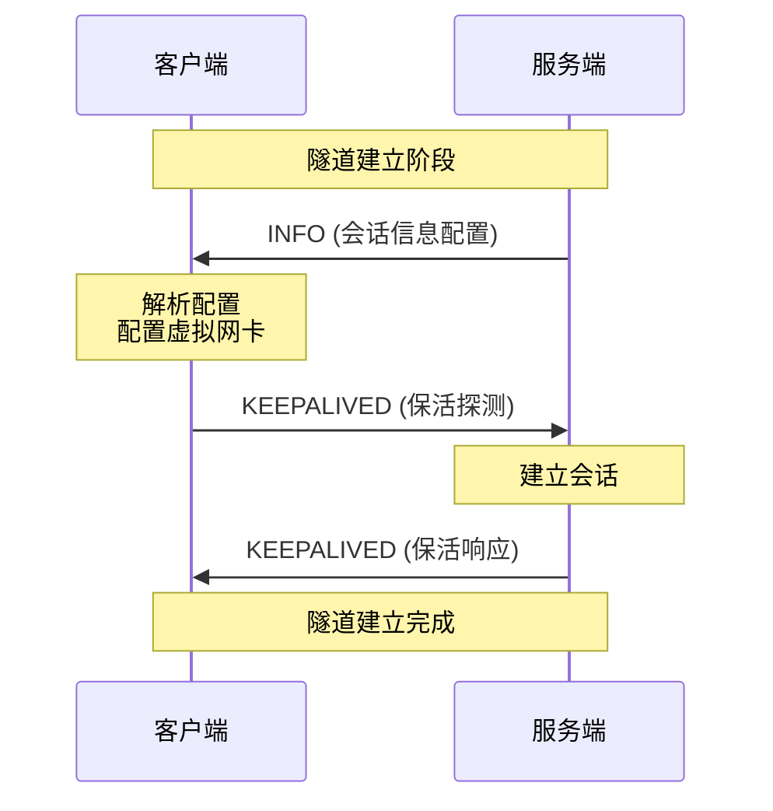

### TCP ��继流程

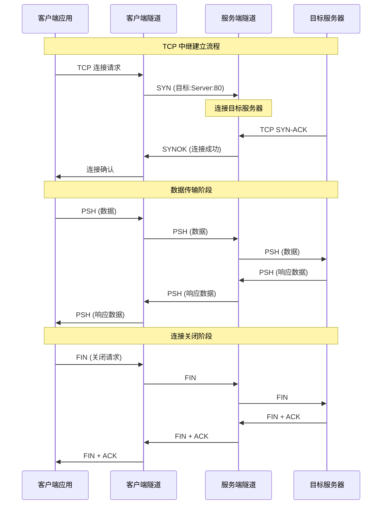

### UDP 中继流程

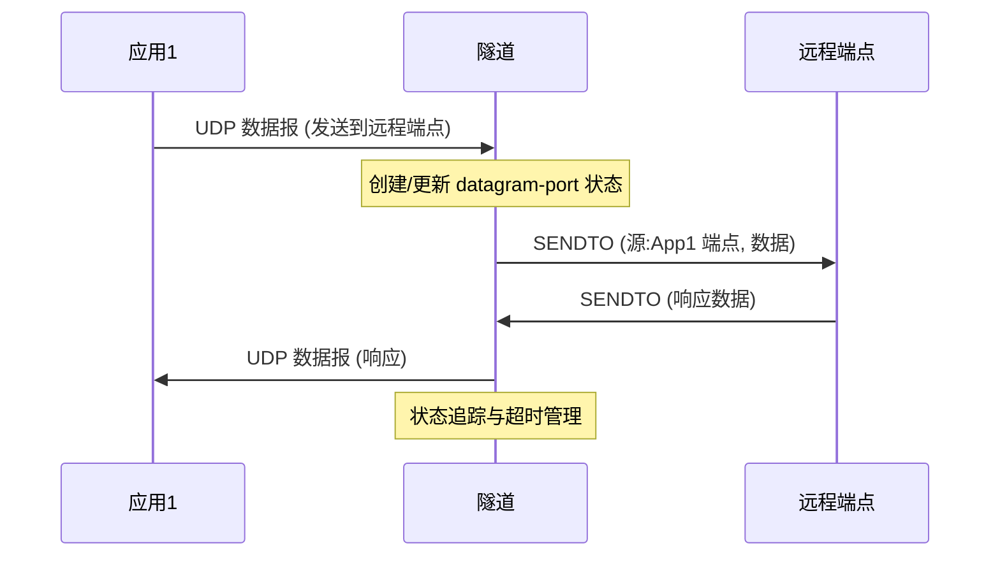

### FRP 映射流程

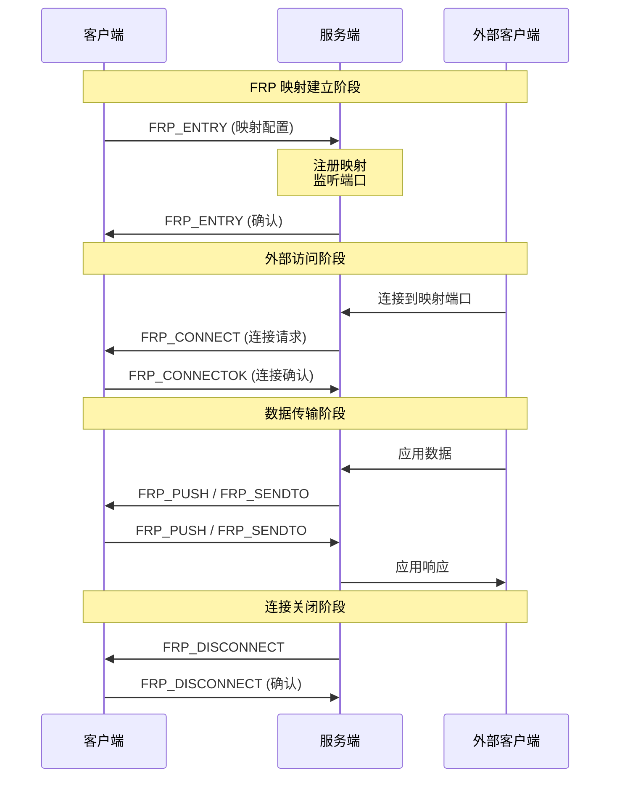

### Static 路径流程

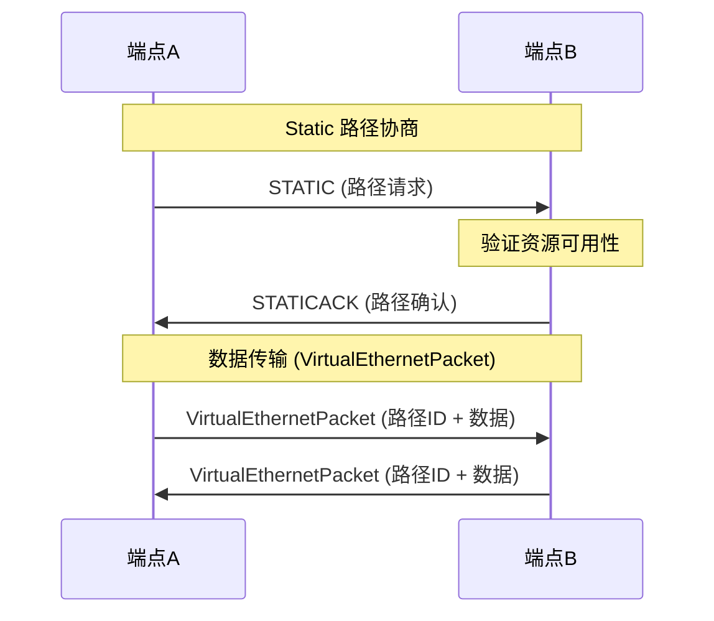

### MUX 多路复用流程

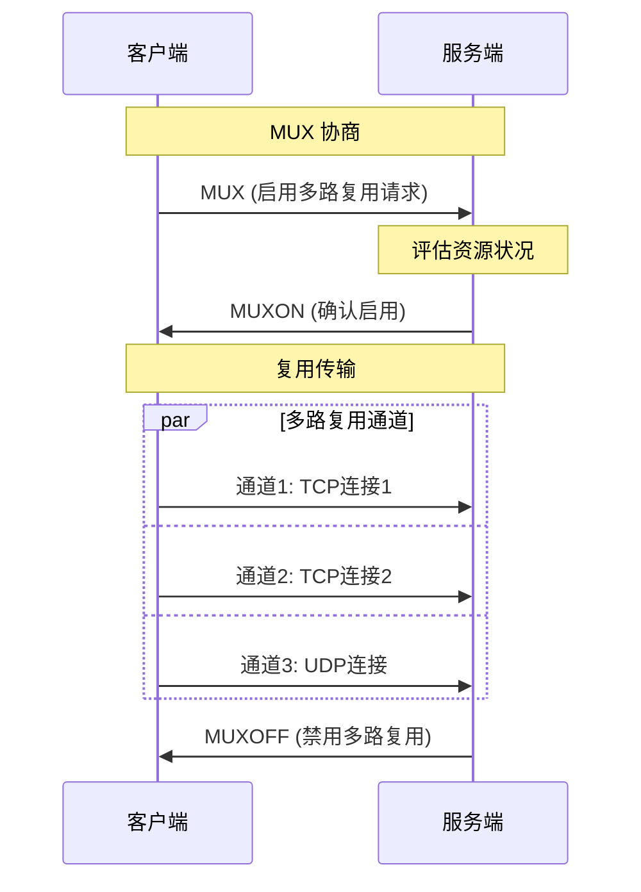

### 保活检测流程

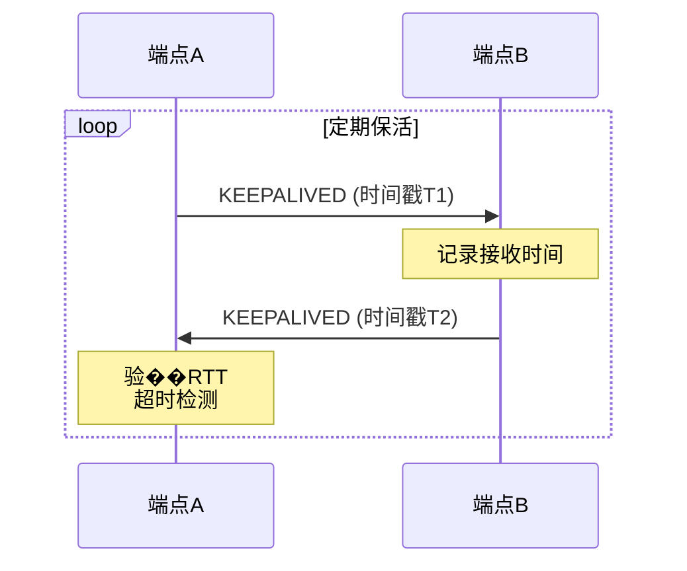

### ICMP 回显流程

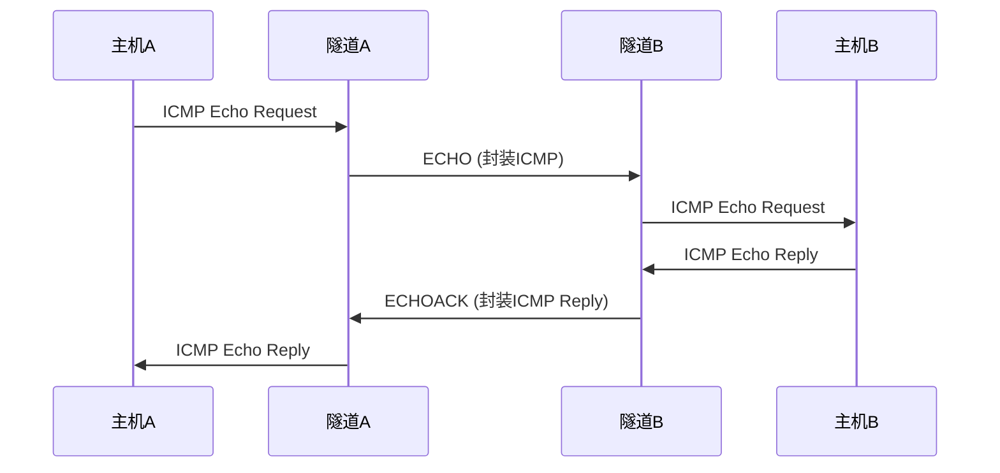

## 数据流架构图

### 整体架构

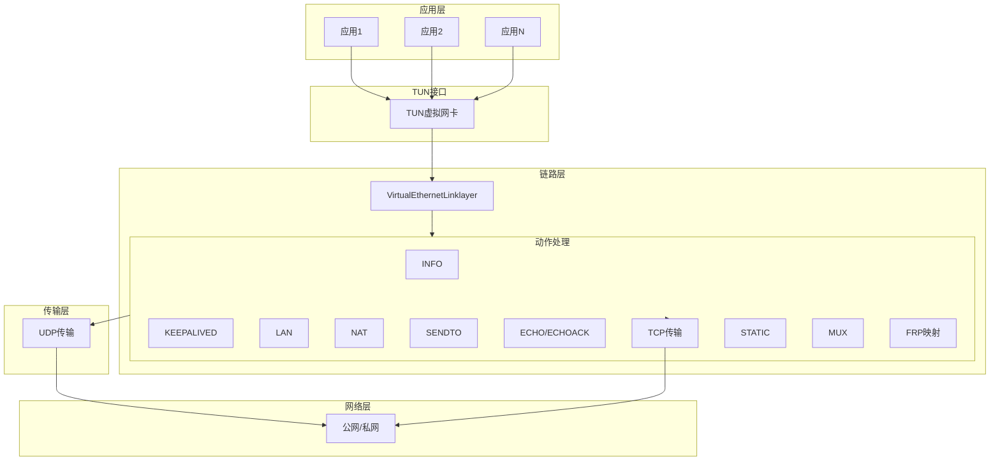

### TCP 中继数据流

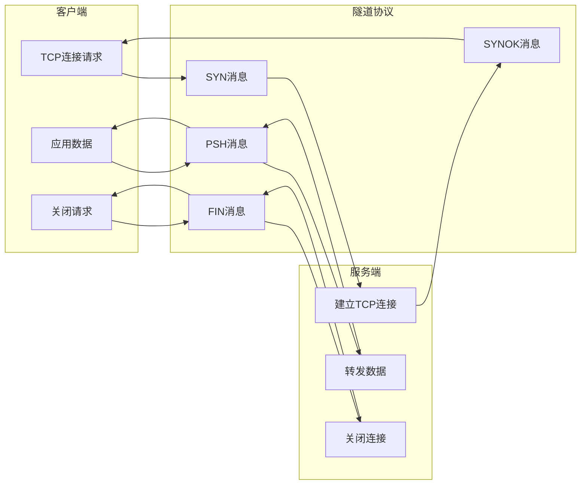

### UDP 中继数据流

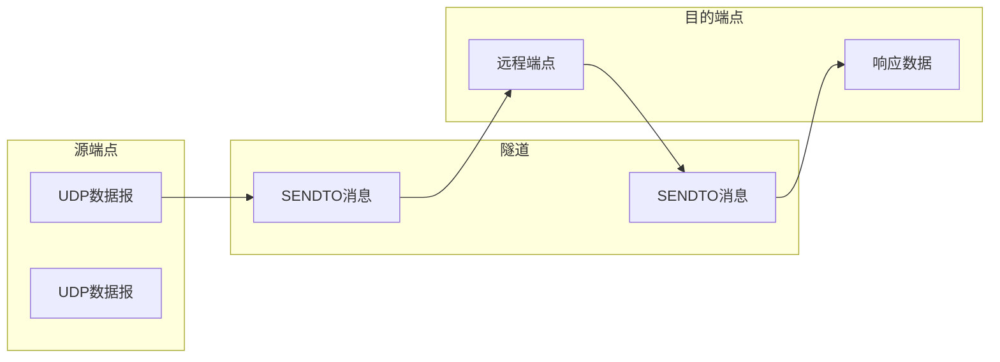

## 错误码定义

### 通用错误码

| 错误码 | 名称 | 说明 |
|--------|------|------|
| 0x00 | SUCCESS | 操作成功 |
| 0x01 | EINVALID | 参数无效 |
| 0x02 | ENOHOST | 目标主机不可达 |
| 0x03 | ENOPORT | 端口不可用 |
| 0x04 | ECONNREFUSED | 连接被拒绝 |
| 0x05 | ETIMEDOUT | 操作超时 |
| 0x06 | ENOMEM | 内存不足 |
| 0x07 | EPROTO | 协议错误 |
| 0x08 | ESESSION | 会话错误 |
| 0x09 | EAUTH | 认证失败 |
| 0x0A | EPERM | 权限不足 |

### TCP 中继错误码

| 错误码 | 名称 | 说明 |
|--------|------|------|
| 0x20 | ETIMEDOUT | 连接超时 |
| 0x21 | ECONNRESET | 连接被重置 |
| 0x22 | EINVALSTATE | 状态错误 |
| 0x23 | ETOOMANY | 连接数超限 |

### FRP 映射错误码

| 错误码 | 名称 | 说明 |
|--------|------|------|
| 0x50 | EMAPNOTFOUND | 映射不存在 |
| 0x51 | EMAPEXISTS | 映射已存在 |
| 0x52 | ECONNFAILED | 连接失败 |
| 0x53 | EPORTINUSE | 端口已被占用 |

## 安全考虑

### 方向约束

实现中一个很重要的特征是：双方都不会在任意方向接受任意动作��代��中可以看到服务端拒绝不该由客户端发起的 TCP 控制方向，客户端拒绝不该由服务端主动发起的 connect/push 方向。

这种设计使得共享协议在运行时更安全，因为角色合法性在 handler 层被显式执行。任何违反方向约束的消息都会被直接丢弃并记录警告日志。

### 消息验证

所有接收到的消息都会经过以下验证：

1. **格式验证**：消息头部各字段是否符合预期格式
2. **长度验证**：载荷长度是否与实际数据匹配
3. **权限验证**：发送方是否有权发送该类型的消息
4. **状态验证**：当前会话状态是否允许该操作

### 限流保护

为防止恶意 flood 攻击，协议实现了以下限流机制：

- 每个 IP 的最大连接速率限制
- 每个会话的最大消息速率限制
- 特定动作类型的速率限制（如 KEEPALIVED）

## 配置与调优

### 性能参数

| 参数 | 默认值 | 建议范围 | 说明 |
|------|--------|----------|------|
| keepalive_interval | 30s | 10-60s | 保活探测间隔 |
| keepalive_timeout | 90s | 30-180s | 保活超时时间 |
| tcp_buffer_size | 64KB | 16KB-256KB | TCP 缓冲区大小 |
| udp_queue_size | 100 | 50-500 | UDP 队列大小 |
| max_connections | 1000 | 100-10000 | 最大并发连接数 |

### 调试参数

| 参数 | 说明 |
|------|------|
| log_level | 日志级别 (debug/info/warn/error) |
| trace_packets | 是否跟踪数据包 |
| stats_interval | 统计信息输出间隔 |

## 为什么这一层值得单独写文档

如果不先理解 `VirtualEthernetLinklayer`，就很难理解为什么整个运行时会拆成这么多类型。链路层协议是整个 OPENPPP2 系统的控制面核心，它定义了客户端与服务端之间所有的交互方式。

理解本协议有助于：

1. **故障排查**：当出现连接问题时，能够快速定位问题所在层次
2. **功能扩展**：在现有协议基础上添加新功能
3. **性能优化**：针对特定场景进行调优
4. **安全审计**：评估系统的安全性

这一层就是系统控制面与数据面语义的中心，是理解整个 OPENPPP2 虚拟以太网系统的关键所在。