# Management Backend

[中文版本](MANAGEMENT_BACKEND_CN.md)

## Role

The Go service under `go/` is the management and persistence side of OPENPPP2, not the packet data plane.

It supports the C++ server runtime with:

- node authentication
- user lookup
- quota and expiry state
- traffic accounting
- HTTP management APIs
- Redis and MySQL persistence

## Why The Backend Is Separate

The split is clear from code:

- C++ owns adapters, routes, sockets, tunnel sessions, and packet forwarding
- Go owns business state, storage, and management APIs

This is a healthy infrastructure separation. Data-plane code and persistence-heavy control-plane code evolve for different reasons.

## System Architecture Overview

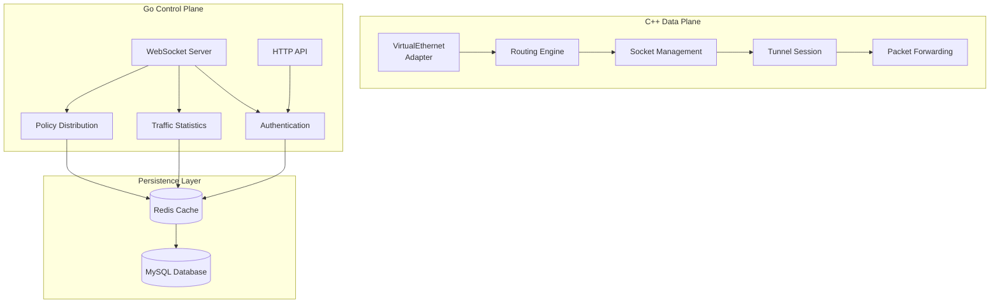

## Backend Architecture Details

### Core Component Structure

The management backend is built using Go, with the core structure defined in `ManagedServer`:

```go
type ManagedServer struct {
    sync.Mutex
    disposed      bool
    ppp           *io.WebSocketServer    // WebSocket server
    configuration *ManagedServerConfiguration  // Configuration
    redis         *io.RedisClient        // Redis client

    servers map[int]*tb_server       // Server node mapping
    nodes   map[int]*_vpn_server    // WebSocket connection mapping
    users   map[string]*_vpn_user    // User session mapping
    dirty   map[string]bool         // Dirty data flag

    db_master *io.DB               // MySQL master
    db_salves *list.List          // MySQL slave list
}
```

### Data Flow Architecture

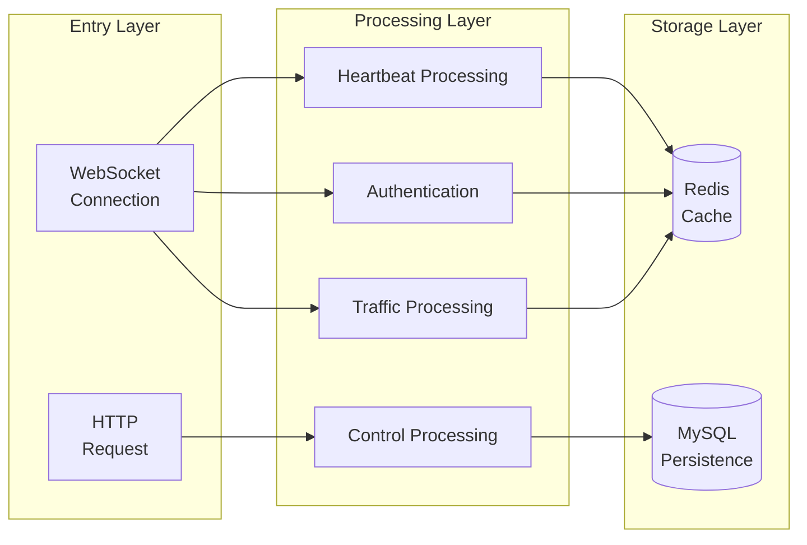

### Thread Model Design

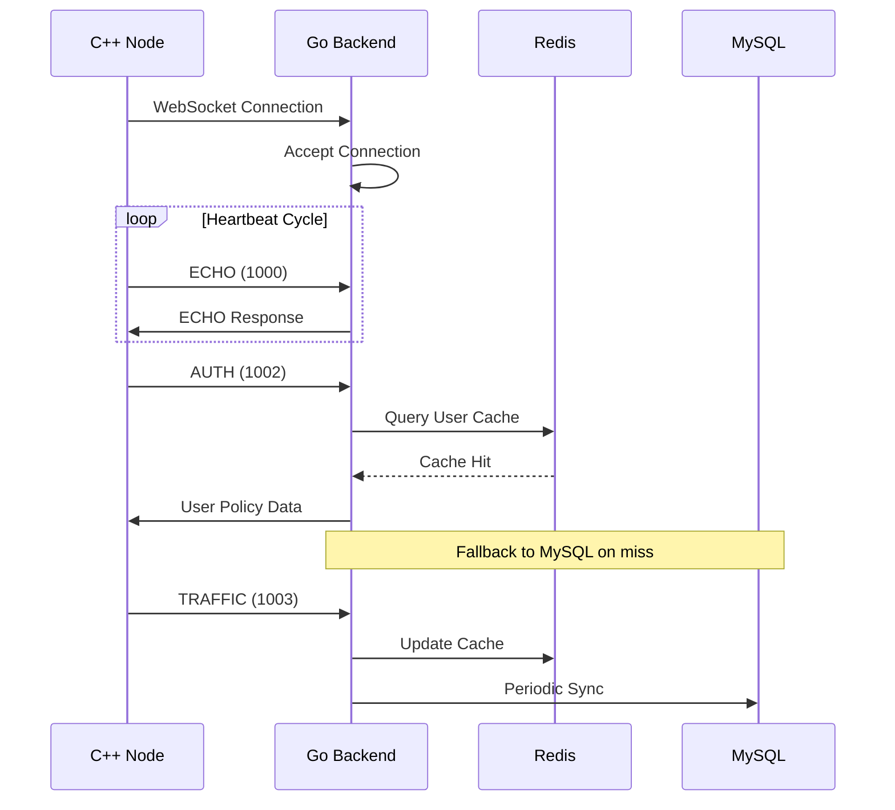

## Connection Model

The Go backend exposes a WebSocket endpoint and HTTP endpoints.

The C++ server connects to the WebSocket side through `VirtualEthernetManagedServer`.

That control link is used for:

- backend connection handshake
- echo/health
- session authentication
- traffic upload

## Wire Format

The backend protocol is not plain JSON lines. From code, packets are framed as:

- 8 hex characters containing payload length
- followed by a JSON object

### Packet Structure Definition

```go
type _Packet struct {
    Id   int    `json:"Id"`   // Packet sequence number
    Node int    `json:"Node"`  // Server node ID
    Guid string `json:"Guid"`  // User GUID
    Cmd  int    `json:"Cmd"`  // Command type
    Data string `json:"Data"` // Data payload
}
```

The JSON object includes fields such as:

- `Id` - Packet identifier
- `Node` - Server node number
- `Guid` - User global unique identifier
- `Cmd` - Command type
- `Data` - Data payload

### Protocol Header Format

```
┌────────────┬──────────────────────────────────────┐
│  8 Hex   │          JSON Payload               │
│(Length)   │         (JSON Data)             │
└────────────┴──────────────────────────────────────┘
```

## Main Commands

Observed command values include:

| Command Code | Name | Function Description | Flow Direction |
|-------------|------|-------------------|----------------|
| 1000 | ECHO | Heartbeat/Health check | Bidirectional |
| 1001 | CONNECT | Node connection handshake | Request->Response |
| 1002 | AUTHENTICATION | User authentication | Request->Response |
| 1003 | TRAFFIC | Traffic reporting | Request->Response |

### Command Processing Flow

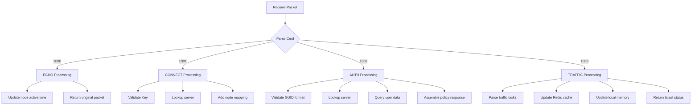

This is a small, purpose-built management protocol between the C++ node and the Go backend.

## HTTP API Endpoints

The Go backend also exposes HTTP endpoints for administrative actions.

### API List

| Endpoint Path | Method | Function | Parameters |
|---------------|--------|----------|------------|
| `/consumer/set` | POST | Set/Update user | key, guid, tx, rx, seconds, qos |
| `/consumer/new` | POST | Create new user | key, guid, tx, rx, seconds, qos |
| `/consumer/load` | GET | Load user (no reload) | key, guid |
| `/consumer/reload` | GET | Reload user data | key, guid |
| `/server/get` | GET | Get server | node |
| `/server/all` | GET | All server list | - |
| `/server/load` | POST | Reload server | - |

### Error Codes

| Error Code | Meaning | Description |
|-----------|---------|-------------|
| 0 | Success | Operation successful |
| 1 | Too fast | Concurrency control rate limit |
| 2 | JSON error | Parse failed |
| 11 | Parameter error | Invalid parameter |
| 12 | GUID error | Invalid GUID format |
| 13 | Node error | Invalid node number |
| 14 | Key error | Invalid auth key |
| 15 | TX error | Invalid upload traffic parameter |
| 16 | RX error | Invalid download traffic parameter |
| 17 | QoS error | Invalid bandwidth parameter |
| 18 | Seconds error | Invalid validity period parameter |
| 101 | Database error | MySQL access failure |
| 151 | Redis error | Redis access failure |
| 152 | Redis conflict | Cache key conflict |
| 201 | User not exist | User record does not exist |
| 202 | User not logged in | User not loaded to memory |
| 203 | User already exists | User record duplicate |
| 301 | Server not exist | Server record does not exist |

### HTTP Response Format

```json
{
    "Code": 0,
    "Message": "ok",
    "Tag": "{\"Guid\":\"...\",\"IncomingTraffic\":...}"
}
```

### Detailed API Specifications

#### 1. Set User (consumer/set)

Set or update traffic quota and validity period for specified user.

**Request Example**
```
POST /consumer/set?key=configKey&guid=userGUID&tx=1073741824&rx=1073741824&seconds=86400&qos=100000
```

**Response Example**
```json
{
    "Code": 0,
    "Message": "ok",
    "Tag": "{\"Guid\":\"A1B2C3D4E5F6\",\"IncomingTraffic\":1073741824,\"OutgoingTraffic\":1073741824,\"ExpiredTime\":86400,\"BandwidthQoS\":100000}"
}
```

#### 2. Create User (consumer/new)

Create a brand new user record.

**Request Example**
```
POST /consumer/new?key=configKey&guid=newUserGUID&tx=1073741824&rx=1073741824&seconds=86400&qos=100000
```

**Response Example**
```json
{
    "Code": 0,
    "Message": "ok",
    "Tag": ""
}
```

#### 3. Load User (consumer/load)

Load user data to local cache.

**Request Example**
```
GET /consumer/load?key=configKey&guid=userGUID
```

**Response Example**
```json
{
    "Code": 0,
    "Message": "ok",
    "Tag": "{\"Guid\":\"A1B2C3D4E5F6\",\"IncomingTraffic\":536870912,\"OutgoingTraffic\":536870912,\"ExpiredTime\":43200,\"BandwidthQoS\":50000}"
}
```

#### 4. Reload User (consumer/reload)

Force reload user data from database.

**Request Example**
```
GET /consumer/reload?key=configKey&guid=userGUID
```

#### 5. Get Server (server/get)

Query specified server node configuration.

**Request Example**
```
GET /server/get?node=1
```

**Response Example**
```json
{
    "Code": 0,
    "Message": "",
    "Tag": "{\"Id\":1,\"Link\":\"tcp://0.0.0.0:443\",\"Name\":\"Main Server\",\"Protocol\":\"TCP\",\"Transport\":\"UDP\",\"Masked\":true,\"BandwidthQoS\":100000}"
}
```

#### 6. All Servers (server/all)

Get all loaded server node list.

**Request Example**
```
GET /server/all
```

**Response Example**
```json
{
    "Code": 0,
    "Message": "",
    "Tag": "{\"List\":[{\"Id\":1,...},{\"Id\":2,...}]}"
}
```

This keeps operational and provisioning work outside the packet engine itself.

## Authentication Flow

### User Authentication Sequence Diagram

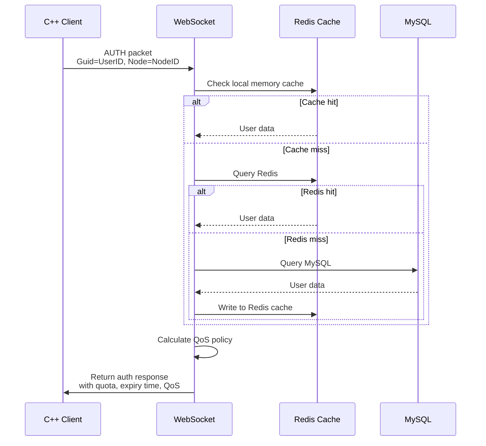

### Authentication Detailed Logic

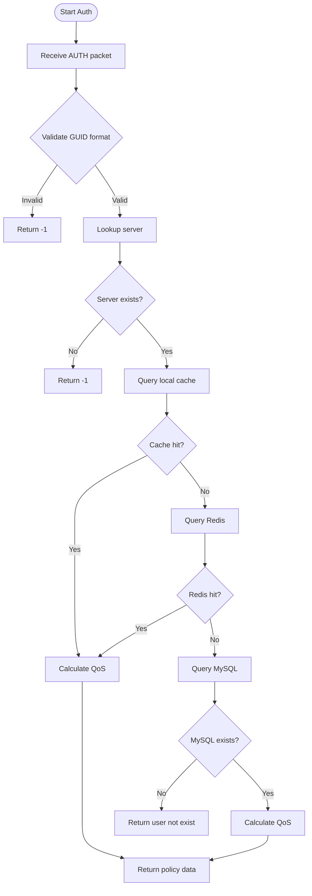

### Policy Data Structure

After successful authentication, the returned policy data:

```go
type _vpn_user struct {
    Guid             string `json:"Guid"`              // User GUID
    ArchiveTime      uint32 `json:"ArchiveTime"`      // Archive time
    IncomingTraffic int64  `json:"IncomingTraffic"` // Remaining download quota
    OutgoingTraffic int64  `json:"OutgoingTraffic"` // Remaining upload quota
    ExpiredTime      uint32 `json:"ExpiredTime"`      // Expiry timestamp
    BandwidthQoS    uint32 `json:"BandwidthQoS"`    // Bandwidth limit
}
```

## Policy Distribution Mechanism

### Policy Calculation Rules

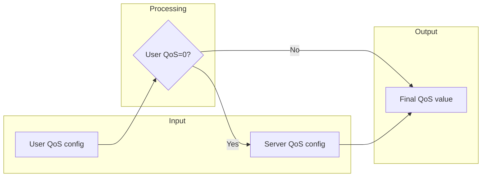

Policy priority:
1. If user has configured QoS, use user-configured QoS
2. Otherwise use server-configured default QoS

## Traffic Reporting and Statistics

### Traffic Reporting Flow

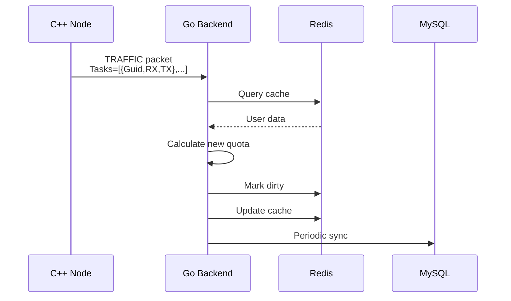

### Traffic Task Format

**Request Data Format**
```json
{
    "Tasks": [
        {
            "Guid": "A1B2C3D4E5F6",
            "RX": "1048576",
            "TX": "524288"
        }
    ]
}
```

**Response Data Format**
```json
{
    "List": [
        {
            "Guid": "A1B2C3D4E5F6",
            "IncomingTraffic": 996710144,
            "OutgoingTraffic": 999475712,
            "ExpiredTime": 86400,
            "BandwidthQoS": 100000
        }
    ]
}
```

### Traffic Sync Mode

Traffic data uses a three-level sync mechanism:

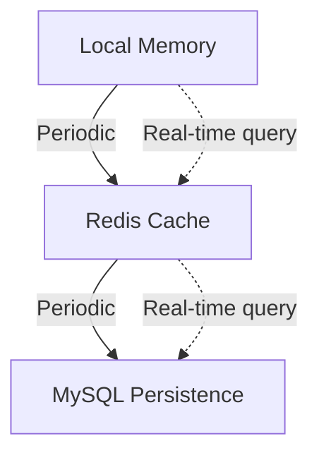

| Storage Layer | Sync Frequency | Use |
|-------------|---------------|-----|
| Local memory | Real-time | Fast read/write |
| Redis | ~20 seconds | Distributed cache |
| MySQL | ~20 seconds | Persistence |

### Traffic Deduction Rules

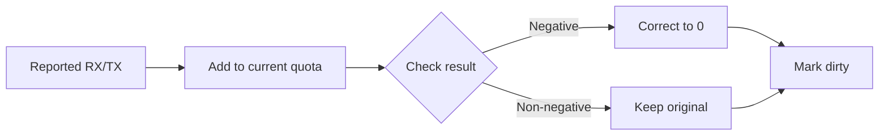

Rule explanation:
- Reported traffic is added to user's current quota
- If deduction result is negative, correct to 0
- After modification, mark dirty for sync

## Node Status Management

### Node State Management

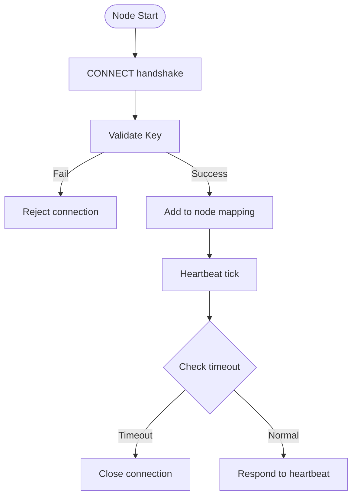

### Timeout Configuration Parameters

| Parameter Name | Default Value | Description |
|----------------|---------------|-------------|
| node-websocket-timeout | 20 seconds | WebSocket timeout |
| node-mysql-query | 1 second | Server MySQL query lock timeout |
| user-mysql-query | 1 second | User MySQL query lock timeout |
| user-cache-timeout | 3600 seconds | Redis cache expiration time |
| user-archive-timeout | 20 seconds | Data archive cycle |

### Node Liveness Detection

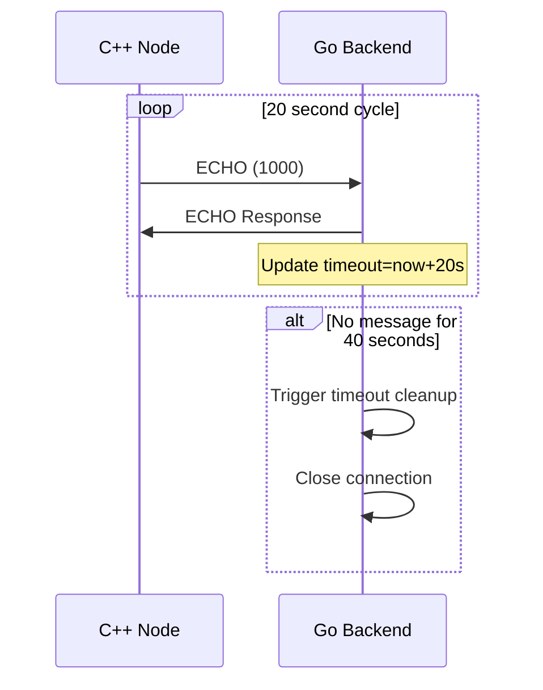

## Persistence Model

The Go side uses:

- Redis for distributed/cache-like state
- MySQL through GORM for durable state

That again reinforces the split: the C++ process should forward packets, while the Go service should maintain business and storage records.

### Storage Architecture

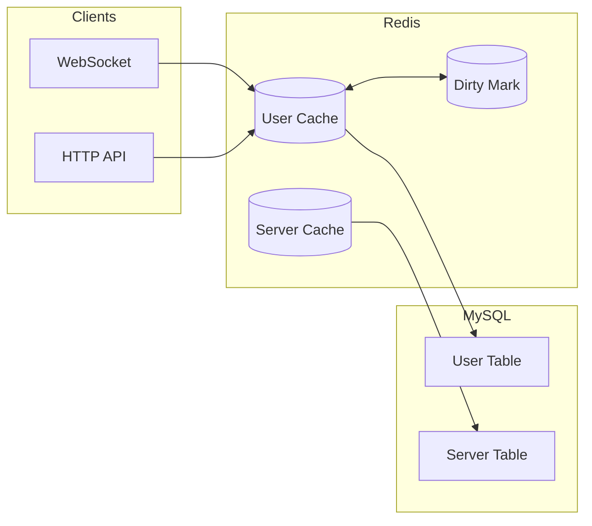

### Database Table Structure

**User Table (tb_user)**

| Field Name | Type | Description |
|------------|------|-------------|
| guid | Primary key | User unique identifier |
| incoming_traffic | int64 | Download traffic quota |
| outgoing_traffic | int64 | Upload traffic quota |
| expired_time | uint32 | Expiry timestamp |
| qos | uint32 | Bandwidth QoS configuration |

**Server Table (tb_server)**

| Field Name | Type | Description |
|------------|------|-------------|
| id | Primary key | Server ID |
| link | string | Connection address |
| name | string | Server name |
| kf/kx/kl/kh | int | Key parameters |
| protocol | string | Protocol type |
| protocol_key | string | Protocol key |
| transport | string | Transport type |
| transport_key | string | Transport key |
| masked | bool | Obfuscation enabled |
| plaintext | bool | Plain transmission |
| delta_encode | bool | Delta encoding |
| shuffle_data | bool | Data shuffling |
| qos | uint32 | Bandwidth limit |

## Why This Matters To Readers Of The C++ Code

Because it explains why some policy objects appear incomplete in the local runtime until backend responses arrive.

The server runtime is prepared to cooperate with external policy, but it still keeps enough local structure to remain a functioning network node.

## Deployment Configuration Example

```json
{
    "database": {
        "master": {
            "host": "localhost",
            "port": 3306,
            "user": "root",
            "password": "password",
            "db": "openppp2"
        },
        "max-open-conns": 100,
        "max-idle-conns": 10,
        "conn-max-life-time": 3600
    },
    "redis": {
        "addresses": ["localhost:6379"],
        "master": "mymaster",
        "db": 0,
        "password": "redis_password"
    },
    "key": "your_secret_key",
    "path": "/websocket",
    "prefixes": "localhost:8080",
    "interfaces": {
        "consumer-reload": "/consumer/reload",
        "consumer-load": "/consumer/load",
        "consumer-set": "/consumer/set",
        "consumer-new": "/consumer/new",
        "server-get": "/server/get",
        "server-all": "/server/all",
        "server-load": "/server/load"
    },
    "concurrency-control": {
        "node-websocket-timeout": 20,
        "node-mysql-query": 1,
        "user-mysql-query": 1,
        "user-cache-timeout": 3600,
        "user-archive-timeout": 20
    }
}
```

## High Availability Design

### Master-Slave Separation

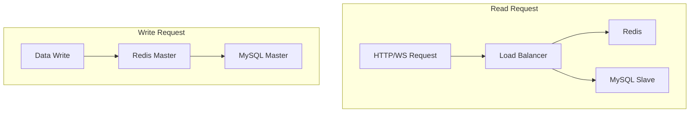

### Connection Pool Configuration

| Configuration | Recommended Value | Description |
|---------------|-------------------|-------------|
| MaxOpenConns | 100 | Maximum open connections |
| MaxIdleConns | 10 | Maximum idle connections |
| ConnMaxLifetime | 3600 | Connection lifetime (seconds) |

## Monitoring and Logging

### Key Log Categories

| Log Type | Recorded Content |
|---------|------------------|
| User login | User GUID, node ID, auth result |
| Traffic reporting | User GUID, reported traffic, remaining quota |
| Data sync | Sync success/failure record |
| Connection status | Node connection/disconnection |

### Performance Metrics

| Metric | Description |
|--------|-------------|
| Online users | Current number of users in memory |
| Active connections | WebSocket connection count |
| QPS | Queries per second |
| Cache hit rate | Redis cache hit rate |
| Sync delay | Data sync delay time |

## Troubleshooting Guide

### Common Issues

| Symptom | Possible Cause | Solution |
|---------|----------------|----------|
| Connection rejected | Key validation failed | Check config Key |
| User not found | User not created | Use /consumer/new to create |
| Quota not updating | Sync delay | Wait 20 seconds or manually sync |
| Query timeout | Concurrency lock contention | Adjust concurrency control parameters |

### Diagnostic Commands

```bash
# View online connections
curl http://localhost:8080/server/all

# Query user status
curl "http://localhost:8080/consumer/load?key=xxx&guid=xxx"

# Reload user data
curl "http://localhost:8080/consumer/reload?key=xxx&guid=xxx"
```

## Operational Meaning

If you deploy OPENPPP2 without the backend, the tunnel can still function in a reduced local mode.

If you deploy it with the backend, you gain:

- centralized authentication
- centralized traffic accounting
- centralized node and user management

That makes the system suitable for both standalone infrastructure nodes and managed service deployments.