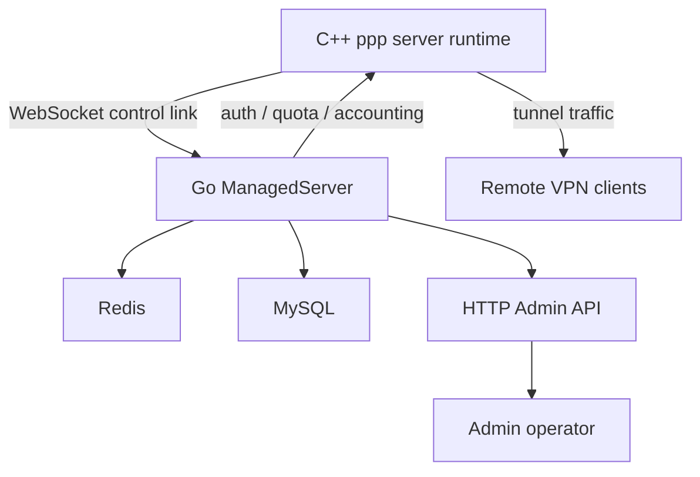
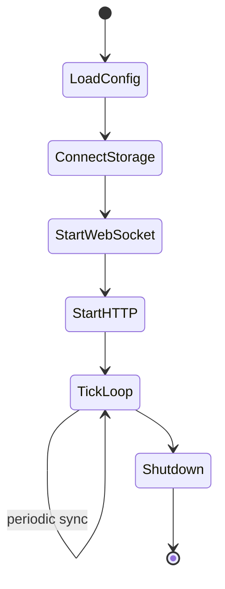
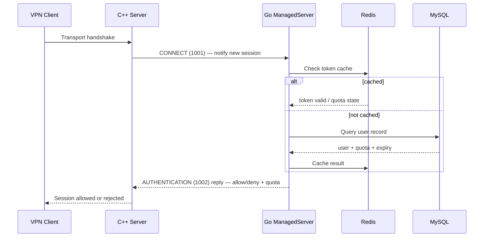
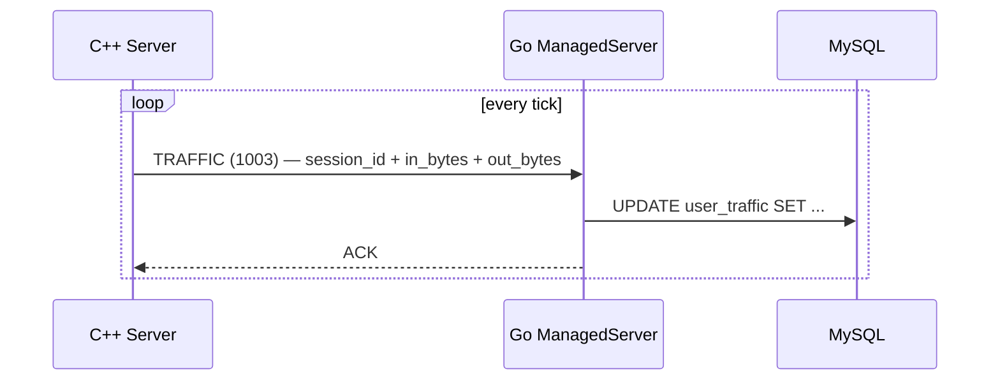
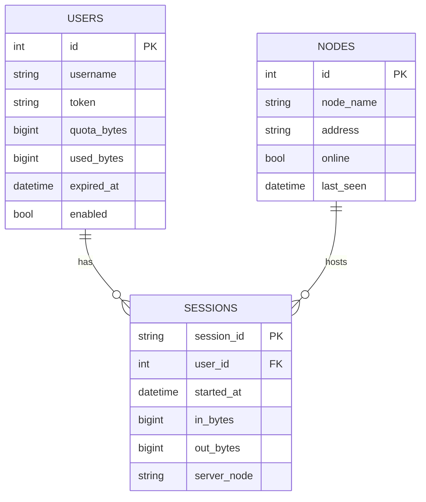

# Management Backend

[中文版本](MANAGEMENT_BACKEND_CN.md)

## Role

The Go service under `go/` is the management and persistence side of OPENPPP2, not the packet data plane.

It acts as the administrative control plane that the C++ server runtime can optionally connect to for:

- node authentication
- user lookup
- quota and expiry state
- traffic accounting
- HTTP management endpoints
- Redis and MySQL persistence

Without the Go backend, the C++ server still operates normally as a packet-forwarding overlay node.
With it, the C++ server gains centralized user management, persistent accounting, and remote administration.

---

## Architecture Overview



The C++ process handles all packet forwarding and session state.
The Go process handles all business rules, persistence, and management surfaces.
They communicate over a framed JSON WebSocket link.

---

## Main Shape

The backend is built around `ManagedServer`.

It:

- loads managed configuration from OS args
- connects to Redis and MySQL
- exposes a WebSocket control link for the C++ server
- exposes HTTP admin endpoints for operators
- runs a background tick loop for state synchronization
- syncs user and server state periodically



---

## Wire Protocol

The control protocol between C++ and Go is framed with an **8-hex-digit length prefix** followed by JSON packet body.

Format:

```
[8 hex chars: length][JSON body]
```

Example frame:

```
00000042{"cmd":1002,"session_id":"...","user":"alice","token":"..."}
```

### Observed Commands

| Code | Name | Direction | Purpose |
|------|------|-----------|---------|
| `1000` | ECHO | bidirectional | keepalive / latency probe |
| `1001` | CONNECT | C++ → Go | initial control link handshake |
| `1002` | AUTHENTICATION | C++ → Go | verify a connecting user |
| `1003` | TRAFFIC | C++ → Go | report session traffic accounting |

---

## Authentication Flow



---

## Traffic Accounting Flow



Traffic is reported periodically from the C++ side.
The Go backend persists this to MySQL for billing and quota enforcement.

---

## Configuration

The Go backend reads configuration from command-line arguments at startup.

Key parameters:

| Parameter | Description |
|-----------|-------------|
| `--listen` | WebSocket control link listen address (e.g. `ws://0.0.0.0:20080`) |
| `--http` | HTTP admin API listen address |
| `--redis` | Redis connection string |
| `--mysql` | MySQL DSN |
| `--secret` | Shared secret for C++ ↔ Go link authentication |

On the C++ side, the server config field is:

```json
"server": {
  "backend": "ws://127.0.0.1:20080/ppp/webhook"
}
```

The backend URL is set in `AppConfiguration::server.backend`.
See `ppp/configurations/AppConfiguration.h` for the field definition.

---

## HTTP Admin API

The Go backend exposes an HTTP management API for operators.

Typical endpoints:

| Method | Path | Purpose |
|--------|------|---------|
| `GET` | `/api/v1/users` | List all users |
| `GET` | `/api/v1/users/{id}` | Get user detail |
| `POST` | `/api/v1/users` | Create user |
| `PUT` | `/api/v1/users/{id}` | Update user quota / expiry |
| `DELETE` | `/api/v1/users/{id}` | Remove user |
| `GET` | `/api/v1/sessions` | List active sessions |
| `GET` | `/api/v1/stats` | Server-wide traffic statistics |
| `POST` | `/api/v1/disconnect/{session_id}` | Force disconnect a session |

Authentication to the admin API uses token-based HTTP headers.

---

## Redis Usage

Redis is used as a fast cache layer for:

- authenticated session tokens (TTL-based)
- quota snapshots (to avoid MySQL round-trips on every authentication)
- active session presence flags

When a user's token expires in Redis, the next authentication request falls through to MySQL for a fresh lookup.

---

## MySQL Schema (Conceptual)



---

## Go Backend Source Layout

The Go backend has two management systems under `go/`:

### Legacy: `go/` (original managed server)

```
go/
├── main.go                 # Entry point, arg parsing, ManagedServer startup
├── ppp/
│   ├── ManagedServer.go    # ManagedServer core (WebSocket control link)
│   ├── Handler.go          # Command handler dispatch
│   ├── Server.go           # HTTP admin server
│   ├── Configuration.go    # Configuration parsing
│   ├── User.go             # User model
│   ├── Node.go             # Node model
│   ├── Packet.go           # Wire protocol encoding
│   └── Traffic.go          # Traffic accounting
├── auxiliary/              # Logging, helpers
├── io/                     # WebSocket server, Redis client, DB wrappers
└── daemon/                 # Legacy daemon wrapper (superseded by guardian)
```

### Newer: `go/guardian/` (multi-instance manager + WebUI + TUI)

```
go/guardian/
├── main.go                 # Entry point
├── guardian.go             # Core guardian logic
├── config.go               # Configuration
├── api/                    # HTTP API handlers
├── auth/                   # Authentication middleware
├── cmd/                    # CLI commands
├── instance/               # Per-instance lifecycle management
├── profile/                # Profile management
├── service/                # System service integration
├── webui.go                # WebUI embed and serve
└── webui/                  # Svelte + Vite frontend source
```

The guardian system supersedes `go/daemon/` and provides multi-instance management with a Svelte WebUI and Bubble Tea TUI.

---

## Why It Is Separate

The C++ and Go separation is a deliberate architectural decision:

| Concern | Owner |
|---------|-------|
| Packet forwarding | C++ runtime |
| Session state machine | C++ runtime |
| Cryptographic framing | C++ runtime |
| Platform TAP/TUN | C++ runtime |
| Route and DNS management | C++ runtime |
| User records | Go backend |
| Quota enforcement | Go backend |
| Traffic accounting | Go backend |
| Admin API | Go backend |
| Persistent storage | Go backend |

The C++ side is optimized for zero-copy, lock-minimal, high-throughput packet processing.
The Go side is optimized for business logic, database access, and HTTP API serving.
Mixing these concerns would degrade both.

---

## Deployment Topology

### Standalone (no backend)

```
[VPN clients] ──► [ppp server C++]
```

All sessions are accepted without authentication.
No traffic accounting. No quota enforcement.

### Managed (with backend)

```
[VPN clients] ──► [ppp server C++] ──WebSocket──► [Go ManagedServer]
                                                        │
                                                   [Redis] [MySQL]
```

Sessions authenticated per-user.
Quota enforced. Traffic persisted.

### Multi-server managed

```
[VPN clients] ──► [ppp server C++ node-1] ──┐
[VPN clients] ──► [ppp server C++ node-2] ──┤ WebSocket ──► [Go ManagedServer]
[VPN clients] ──► [ppp server C++ node-3] ──┘                    │
                                                             [Redis] [MySQL]
```

Multiple C++ nodes can connect to the same Go backend.
Session state is centralized. Quota is enforced globally across nodes.

---

## Building the Go Backend

```bash
cd go
go build -o ppp-go .
./ppp-go --listen ws://0.0.0.0:20080 --redis localhost:6379 --mysql "user:pass@tcp(localhost:3306)/ppp"
```

The Go backend is a completely separate process with independent build and run lifecycle.

---

## Error Handling

The Go backend uses structured error responses for all HTTP API calls:

```json
{
  "code": 40001,
  "message": "user not found",
  "request_id": "abc-123"
}
```

For the WebSocket control link, the Go backend sends error frames back to the C++ server
when authentication fails or quota is exceeded:

```json
{"cmd": 1002, "result": false, "reason": "quota_exceeded"}
```

The C++ server reads this result and rejects the session with appropriate diagnostics.
See `ppp/app/server/VirtualEthernetManagedServer.*` for the C++ side parsing.

---

## Error Code Reference

Relevant `ppp::diagnostics::ErrorCode` values for management backend operations (from `ErrorCodes.def`):

| ErrorCode | Description |
|-----------|-------------|
| `VEthernetManagedConnectUrlEmpty` | Managed server connect URL is empty |
| `VEthernetManagedAuthNullCallback` | Authentication callback is null |
| `VEthernetManagedAuthDuplicateSession` | Duplicate auth request for same session |
| `VEthernetManagedPacketLengthOverflow` | Packet length exceeds supported range |
| `VEthernetManagedPacketJsonParseFailed` | Packet JSON parse failed |
| `VEthernetManagedVerifyUrlEmpty` | Verify-URI input is empty |
| `VEthernetManagedEndpointInputUrlEmpty` | Endpoint URL parse input is empty |
| `SessionAuthFailed` | Session authentication failed |
| `SessionQuotaExceeded` | Session quota exceeded |
| `KeepaliveTimeout` | Peer keepalive heartbeat timed out |

These are set via `SetLastErrorCode(...)` in `ppp/app/server/VirtualEthernetManagedServer.cpp` and `ppp/diagnostics/PreventReturn.cpp`.

---

## Usage Examples

### Connecting a C++ server to the Go backend

In `appsettings.json`:

```json
{
  "server": {
    "backend": "ws://127.0.0.1:20080/ppp/webhook",
    "backend-key": "shared-secret-token"
  }
}
```

Start Go backend first:

```bash
./ppp-go --listen ws://0.0.0.0:20080 --secret shared-secret-token \
         --redis localhost:6379 \
         --mysql "root:password@tcp(localhost:3306)/openppp2"
```

Start C++ server:

```bash
./ppp --mode=server --config=./appsettings.json
```

### Checking active sessions via HTTP API

```bash
curl -H "Authorization: Bearer <admin-token>" \
     http://localhost:8080/api/v1/sessions
```

### Forcing a session disconnect

```bash
curl -X POST -H "Authorization: Bearer <admin-token>" \
     http://localhost:8080/api/v1/disconnect/SESSION_ID_HERE
```

---

## Operational Notes

- The Go backend must be started before the C++ server if the C++ server is configured to use it.
  If the backend is unreachable at startup, the C++ server will periodically retry connection.
- The C++ server caches the most recent authentication result locally so brief backend downtime
  does not immediately disconnect active sessions.
- Redis TTL should be set shorter than the quota check interval to avoid stale quota enforcement.
- MySQL must have appropriate indexes on `users.token` and `sessions.session_id` for low-latency lookups.

---

## Monitoring

The Go backend exposes a `/metrics` endpoint (Prometheus format) with:

- active WebSocket connections (C++ nodes connected)
- authentication requests per second (success / fail rates)
- MySQL query latency histogram
- Redis cache hit rate
- traffic accounting write rate

Example Prometheus scrape config:

```yaml
scrape_configs:
  - job_name: 'openppp2-backend'
    static_configs:
      - targets: ['localhost:9090']
```

---

## Related Documents

- [`DEPLOYMENT.md`](DEPLOYMENT.md)
- [`OPERATIONS.md`](OPERATIONS.md)
- [`SECURITY.md`](SECURITY.md)
- [`SERVER_ARCHITECTURE.md`](SERVER_ARCHITECTURE.md)
- [`CONFIGURATION.md`](CONFIGURATION.md)
