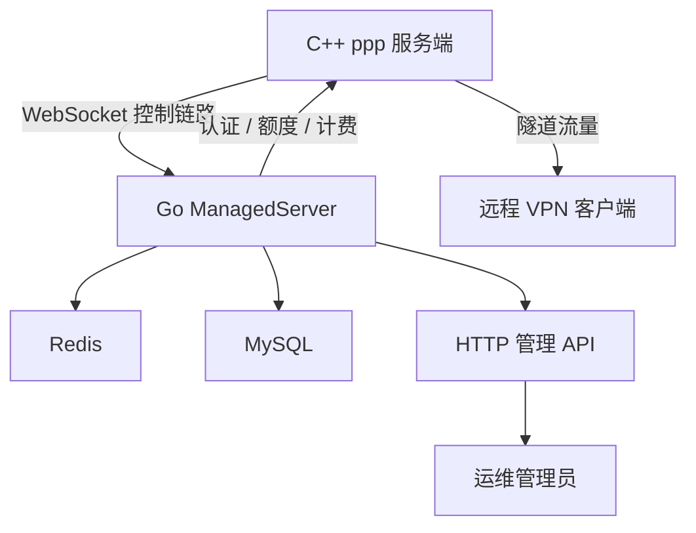
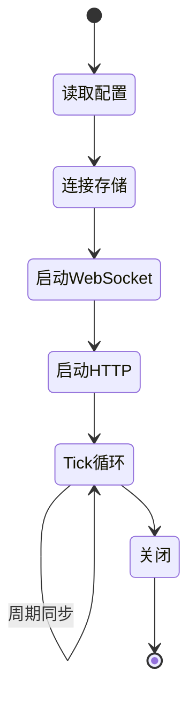
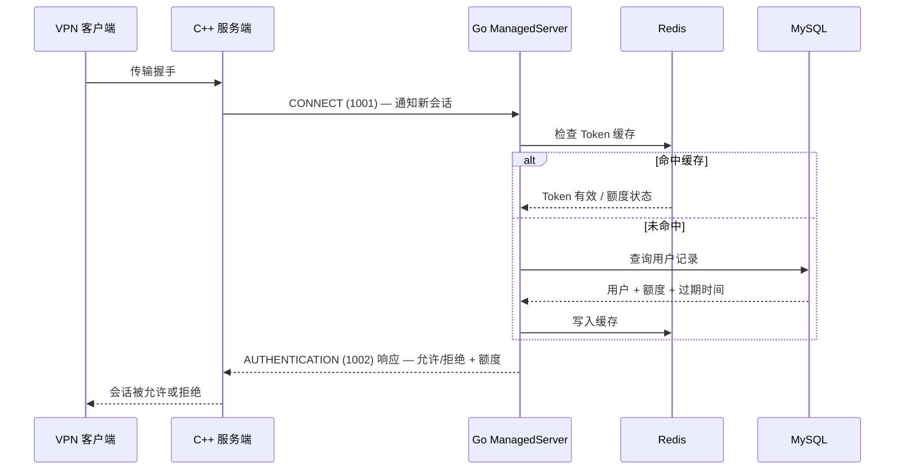
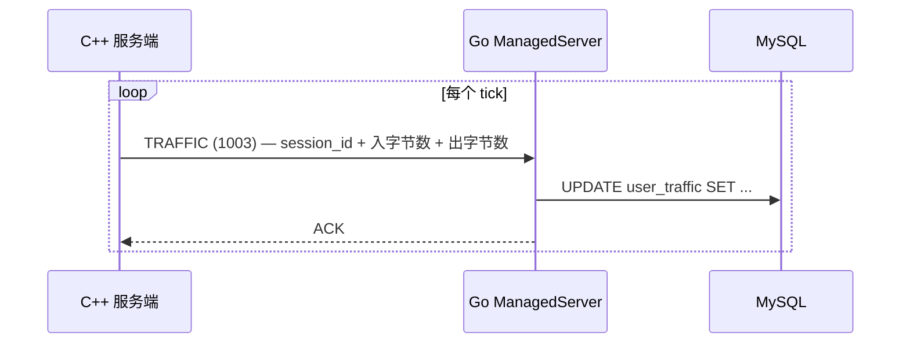
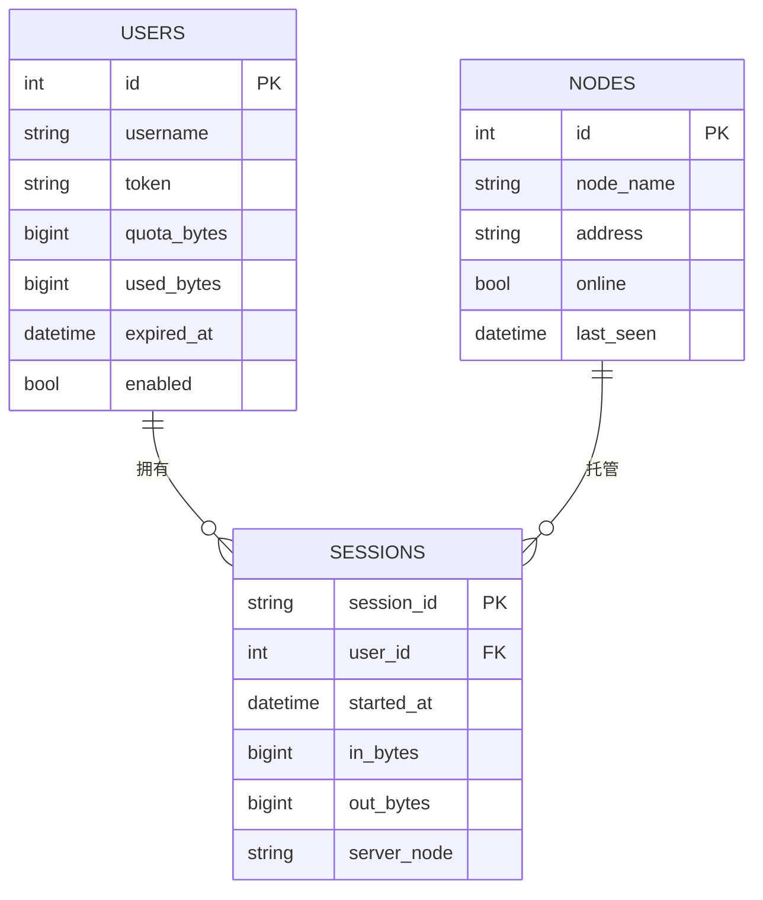

# 管理后端

[English Version](MANAGEMENT_BACKEND.md)

## 角色定位

`go/` 目录下的 Go 服务是 OPENPPP2 的管理与持久化侧，而不是分组数据面。

它作为管理控制平面，C++ 服务端运行时可以选择性地连接它，以获得：

- 节点认证
- 用户查询
- 额度与过期状态
- 流量记账
- HTTP 管理接口
- Redis 与 MySQL 持久化

没有 Go backend，C++ 服务端依然能正常运行——它继续作为一个包转发 overlay 节点工作。
有了 Go backend，C++ 服务端就具备了集中式用户管理、持久计费和远程管理能力。

---

## 架构全景



C++ 进程负责所有包转发和会话状态。
Go 进程负责所有业务规则、持久化和管理界面。
两者通过带帧 JSON 的 WebSocket 链路通信。

---

## 主要形态

后端围绕 `ManagedServer` 构建。

它会：

- 从 OS args 读取管理配置
- 连接 Redis 和 MySQL
- 为 C++ 服务端暴露 WebSocket 控制链路
- 为运维人员暴露 HTTP 管理接口
- 运行后台 tick loop 以同步状态
- 周期性地同步用户和服务端状态



---

## 线协议

C++ 与 Go 之间的控制协议以 **8 位十六进制长度前缀**加 JSON 数据包体组成。

格式：

```
[8位十六进制长度][JSON 体]
```

示例帧：

```
00000042{"cmd":1002,"session_id":"...","user":"alice","token":"..."}
```

### 已观察到的命令

| 命令码 | 名称 | 方向 | 用途 |
|--------|------|------|------|
| `1000` | ECHO | 双向 | 保活 / 延迟探测 |
| `1001` | CONNECT | C++ → Go | 初始控制链路握手 |
| `1002` | AUTHENTICATION | C++ → Go | 验证接入用户 |
| `1003` | TRAFFIC | C++ → Go | 上报会话流量计费 |

---

## 认证流程



---

## 流量计费流程



流量由 C++ 侧周期性上报。
Go 后端将其持久化到 MySQL，用于计费和额度管控。

---

## 配置

Go backend 在启动时从命令行参数读取配置。

主要参数：

| 参数 | 描述 |
|------|------|
| `--listen` | WebSocket 控制链路监听地址（如 `ws://0.0.0.0:20080`） |
| `--http` | HTTP 管理 API 监听地址 |
| `--redis` | Redis 连接字符串 |
| `--mysql` | MySQL DSN |
| `--secret` | C++ ↔ Go 链路认证共享密钥 |

C++ 侧的配置字段：

```json
"server": {
  "backend": "ws://127.0.0.1:20080/ppp/webhook"
}
```

后端 URL 写在 `AppConfiguration::server.backend` 字段中。
参见 `ppp/configurations/AppConfiguration.h`。

---

## HTTP 管理 API

Go backend 为运维人员暴露 HTTP 管理 API。

典型端点：

| 方法 | 路径 | 用途 |
|------|------|------|
| `GET` | `/api/v1/users` | 列出所有用户 |
| `GET` | `/api/v1/users/{id}` | 获取用户详情 |
| `POST` | `/api/v1/users` | 创建用户 |
| `PUT` | `/api/v1/users/{id}` | 更新用户额度/过期时间 |
| `DELETE` | `/api/v1/users/{id}` | 删除用户 |
| `GET` | `/api/v1/sessions` | 列出活跃会话 |
| `GET` | `/api/v1/stats` | 全服务器流量统计 |
| `POST` | `/api/v1/disconnect/{session_id}` | 强制断开某会话 |

管理 API 使用基于 Token 的 HTTP 头认证。

---

## Redis 用途

Redis 用作快速缓存层，缓存以下内容：

- 已认证的会话 Token（TTL 驱动过期）
- 额度快照（避免每次认证都查 MySQL）
- 活跃会话存在标志

当用户 Token 在 Redis 中过期时，下一次认证请求会穿透到 MySQL 进行新鲜查询。

---

## MySQL 数据模型（概念）



---

## Go Backend 源码布局

Go 管理后端在 `go/` 下有两个管理系统：

### 遗留系统：`go/`（原始 managed server）

```
go/
├── main.go                 # 入口点，参数解析，ManagedServer 启动
├── ppp/
│   ├── ManagedServer.go    # ManagedServer 核心（WebSocket 控制链路）
│   ├── Handler.go          # 命令处理器分发
│   ├── Server.go           # HTTP 管理服务器
│   ├── Configuration.go    # 配置解析
│   ├── User.go             # 用户模型
│   ├── Node.go             # 节点模型
│   ├── Packet.go           # 线协议编码
│   └── Traffic.go          # 流量计费
├── auxiliary/              # 日志、辅助函数
├── io/                     # WebSocket 服务器、Redis 客户端、DB 封装
└── daemon/                 # 遗留 daemon 封装（已被 guardian 取代）
```

### 新系统：`go/guardian/`（多实例管理器 + WebUI + TUI）

```
go/guardian/
├── main.go                 # 入口点
├── guardian.go             # 核心 guardian 逻辑
├── config.go               # 配置
├── api/                    # HTTP API 处理器
├── auth/                   # 认证中间件
├── cmd/                    # CLI 命令
├── instance/               # 每实例生命周期管理
├── profile/                # 配置文件管理
├── service/                # 系统服务集成
├── webui.go                # WebUI 嵌入与服务
└── webui/                  # Svelte + Vite 前端源码
```

Guardian 系统取代了 `go/daemon/`，提供多实例管理能力，包含 Svelte WebUI 和 Bubble Tea TUI。

---

## 为什么要分开

C++ 和 Go 的分离是刻意的架构决策：

| 关注点 | 所有者 |
|--------|--------|
| 包转发 | C++ 运行时 |
| 会话状态机 | C++ 运行时 |
| 加密帧化 | C++ 运行时 |
| 平台 TAP/TUN | C++ 运行时 |
| 路由与 DNS 管理 | C++ 运行时 |
| 用户记录 | Go backend |
| 额度管控 | Go backend |
| 流量计费 | Go backend |
| 管理 API | Go backend |
| 持久化存储 | Go backend |

C++ 侧为零拷贝、最少锁、高吞吐的包处理而优化。
Go 侧为业务逻辑、数据库访问和 HTTP API 服务而优化。
混合这两类关注点会让两者都变差。

---

## 部署拓扑

### 独立模式（无 backend）

```
[VPN 客户端] ──► [ppp 服务端 C++]
```

所有会话不经认证即被接受。
无流量计费，无额度管控。

### 托管模式（有 backend）

```
[VPN 客户端] ──► [ppp 服务端 C++] ──WebSocket──► [Go ManagedServer]
                                                        │
                                                   [Redis] [MySQL]
```

会话按用户逐一认证。
额度管控。流量持久化。

### 多节点托管模式

```
[VPN 客户端] ──► [ppp 服务端 C++ 节点1] ──┐
[VPN 客户端] ──► [ppp 服务端 C++ 节点2] ──┤ WebSocket ──► [Go ManagedServer]
[VPN 客户端] ──► [ppp 服务端 C++ 节点3] ──┘                    │
                                                         [Redis] [MySQL]
```

多个 C++ 节点可以连接到同一个 Go backend。
会话状态集中管理，额度在所有节点间全局管控。

---

## 构建 Go Backend

```bash
cd go
go build -o ppp-go .
./ppp-go --listen ws://0.0.0.0:20080 --secret shared-secret-token \
         --redis localhost:6379 \
         --mysql "root:password@tcp(localhost:3306)/openppp2"
```

Go backend 是一个完全独立的进程，有独立的构建和运行生命周期。

---

## 错误处理

Go backend 对所有 HTTP API 调用使用结构化错误响应：

```json
{
  "code": 40001,
  "message": "user not found",
  "request_id": "abc-123"
}
```

对于 WebSocket 控制链路，当认证失败或额度超出时，Go backend 向 C++ 服务端发送错误帧：

```json
{"cmd": 1002, "result": false, "reason": "quota_exceeded"}
```

C++ 服务端读取此结果并拒绝会话，同时设置相应诊断。
参见 `ppp/app/server/VirtualEthernetManagedServer.*` 中的 C++ 侧解析逻辑。

---

## 错误码参考

管理后端操作相关的 `ppp::diagnostics::ErrorCode` 值（来自 `ErrorCodes.def`）：

| ErrorCode | 说明 |
|-----------|------|
| `VEthernetManagedConnectUrlEmpty` | 管理后端连接 URL 为空 |
| `VEthernetManagedAuthNullCallback` | 认证回调为空 |
| `VEthernetManagedAuthDuplicateSession` | 同一会话的重复认证请求 |
| `VEthernetManagedPacketLengthOverflow` | 包长度超出支持范围 |
| `VEthernetManagedPacketJsonParseFailed` | 包 JSON 解析失败 |
| `VEthernetManagedVerifyUrlEmpty` | 验证 URI 输入为空 |
| `VEthernetManagedEndpointInputUrlEmpty` | 端点 URL 解析输入为空 |
| `SessionAuthFailed` | 会话认证失败 |
| `SessionQuotaExceeded` | 会话额度超限 |
| `KeepaliveTimeout` | 对端心跳超时 |

这些错误码通过 `SetLastErrorCode(...)` 在 `ppp/app/server/VirtualEthernetManagedServer.cpp` 和 `ppp/diagnostics/PreventReturn.cpp` 中设置。

---

## 使用示例

### 将 C++ 服务端连接到 Go backend

在 `appsettings.json` 中：

```json
{
  "server": {
    "backend": "ws://127.0.0.1:20080/ppp/webhook",
    "backend-key": "shared-secret-token"
  }
}
```

先启动 Go backend：

```bash
./ppp-go --listen ws://0.0.0.0:20080 --secret shared-secret-token \
         --redis localhost:6379 \
         --mysql "root:password@tcp(localhost:3306)/openppp2"
```

再启动 C++ 服务端：

```bash
./ppp --mode=server --config=./appsettings.json
```

### 通过 HTTP API 查询活跃会话

```bash
curl -H "Authorization: Bearer <admin-token>" \
     http://localhost:8080/api/v1/sessions
```

### 强制断开某会话

```bash
curl -X POST -H "Authorization: Bearer <admin-token>" \
     http://localhost:8080/api/v1/disconnect/SESSION_ID_HERE
```

---

## 运维注意事项

- 如果 C++ 服务端配置了使用 backend，应先启动 Go backend 再启动 C++ 服务端。
  如果 backend 在启动时不可达，C++ 服务端会周期性重试连接。
- C++ 服务端会在本地缓存最近一次认证结果，因此 backend 短暂停机不会立即断开活跃会话。
- Redis TTL 应短于额度检查间隔，以避免陈旧额度被延迟管控。
- MySQL 的 `users.token` 和 `sessions.session_id` 必须有适当索引，以保证低延迟查询。

---

## 监控

Go backend 在 `/metrics` 端点暴露 Prometheus 格式指标：

- 活跃 WebSocket 连接数（已连接的 C++ 节点数）
- 每秒认证请求数（成功/失败率）
- MySQL 查询延迟直方图
- Redis 缓存命中率
- 流量计费写入速率

Prometheus 抓取配置示例：

```yaml
scrape_configs:
  - job_name: 'openppp2-backend'
    static_configs:
      - targets: ['localhost:9090']
```

---

## 相关文档

- [`DEPLOYMENT_CN.md`](DEPLOYMENT_CN.md)
- [`OPERATIONS_CN.md`](OPERATIONS_CN.md)
- [`SECURITY_CN.md`](SECURITY_CN.md)
- [`SERVER_ARCHITECTURE_CN.md`](SERVER_ARCHITECTURE_CN.md)
- [`CONFIGURATION_CN.md`](CONFIGURATION_CN.md)
