# 管理后端

[English Version](MANAGEMENT_BACKEND.md)

## 角色定位

`go/` 目录下的 Go 服务是 OPENPPP2 的管理与持久化侧，而不是分组数据面。

它为 C++ 服务端运行时提供：

- 节点认证
- 用户查询
- 额度与过期状态
- 流量记账
- HTTP 管理接口
- Redis 与 MySQL 持久化

## 为什么后端要独立存在

从代码分工看，这种拆分非常清楚：

- C++ 负责网卡、路由、socket、隧道会话和分组转发
- Go 负责业务状态、存储和管理接口

这是一种健康的基础设施拆分。数据面代码和重持久化控制面代码的演化驱动力本来就不同。

## 系统架构概览

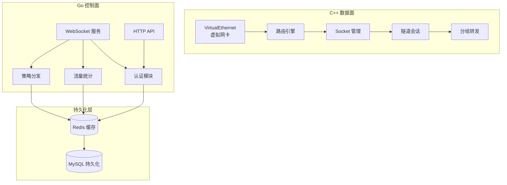

## 后端架构详解

### 核心组件结构

管理后端采用 Go 语言构建，核心结构定义在 `ManagedServer` 中：

```go
type ManagedServer struct {
    sync.Mutex
    disposed      bool
    ppp           *io.WebSocketServer    // WebSocket 服务器
    configuration *ManagedServerConfiguration  // 配置对象
    redis         *io.RedisClient        // Redis 客户端

    servers map[int]*tb_server       // 服务端节点映射
    nodes   map[int]*_vpn_server    // WebSocket 连接映射
    users   map[string]*_vpn_user    // 用户会话映射
    dirty   map[string]bool         // 脏数据标记

    db_master *io.DB               // MySQL 主库
    db_salves *list.List          // MySQL 从库列表
}
```

### 数据流架构

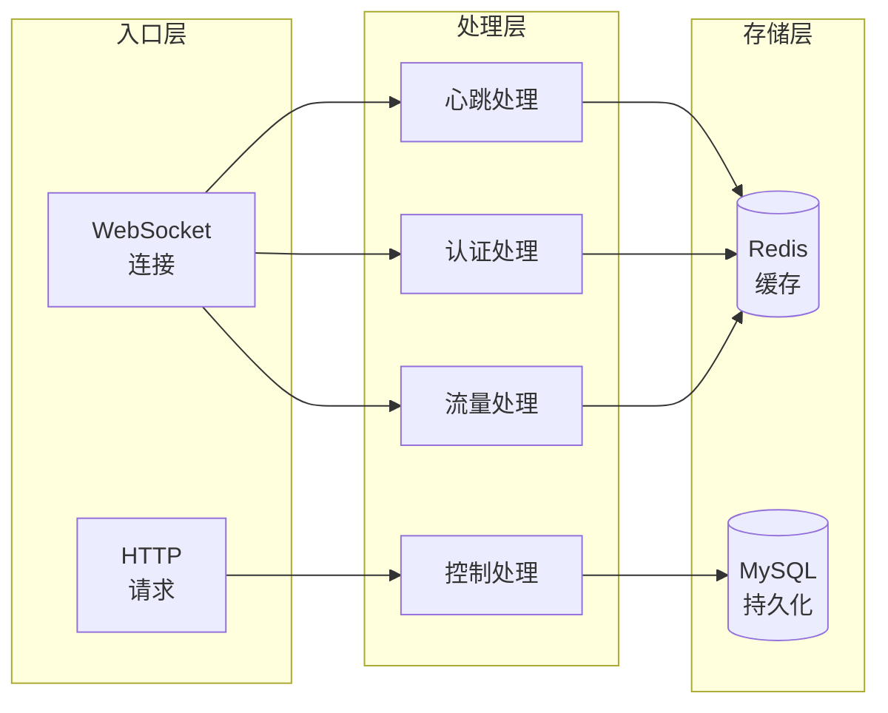

### 线程模型设计

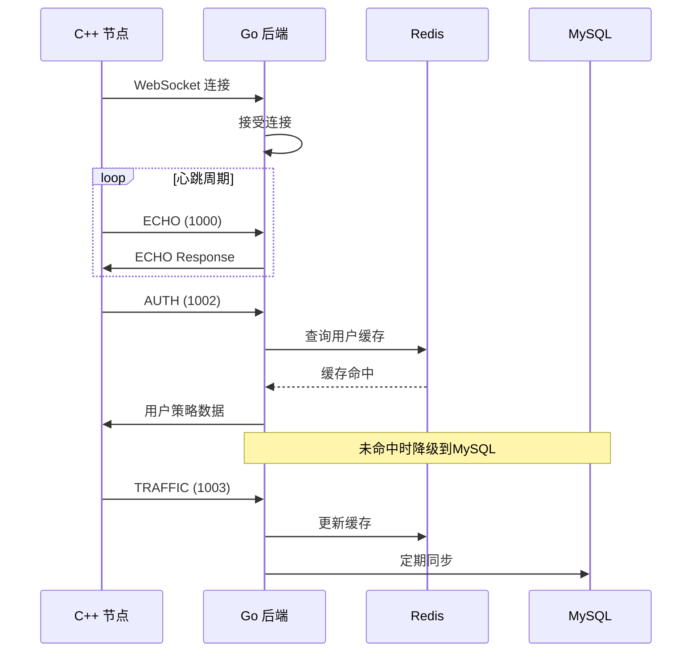

## 连接模型

Go 后端同时暴露 WebSocket 端点和 HTTP 接口。

C++ 服务端通过 `VirtualEthernetManagedServer` 接入 WebSocket 端。

这条控制链路负责：

- 后端连接握手
- echo / 健康检查
- 会话认证
- 流量上报

## 线协议格式

从代码看，���端协议不是简单 JSON 文本流，而是：

- 前 8 个十六进制字符表示 JSON 载荷长度
- 后面跟一个 JSON 对象

JSON 中包含字段：

- `Id` - 数据包标识
- `Node` - 服务端节点编号
- `Guid` - 用户全局唯一标识
- `Cmd` - 命令类型
- `Data` - 数据载荷

### 数据包结构定义

```go
type _Packet struct {
    Id   int    `json:"Id"`   // 数据包序列号
    Node int    `json:"Node"`  // 服务端节点ID
    Guid string `json:"Guid"`  // 用户GUID
    Cmd  int    `json:"Cmd"`  // 命令类型
    Data string `json:"Data"` // 数据载荷
}
```

### 协议头格式

```
┌────────────┬──────────────────────────────────────┐
│  8 Hex    │          JSON Payload            │
│ (长度前缀) │         (JSON 数据)             │
└────────────┴──────────────────────────────────────┘
```

## 主要命令详解

从代码中可见的命令值包括：

| 命令码 | 名称 | 功能描述 | 流量方向 |
|--------|------|----------|----------|
| 1000 | ECHO | 心跳/健康检查 | 双向 |
| 1001 | CONNECT | 节点连接握手 | 请求→响应 |
| 1002 | AUTHENTICATION | 用户认证 | 请求→响应 |
| 1003 | TRAFFIC | 流量上报 | 请求→响应 |

### 命令处理流程

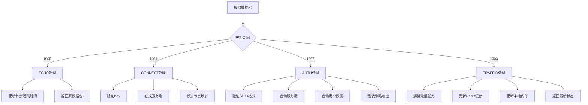

## API 端点详解

Go 后端还提供一组 HTTP 管理接口，用于执行管理动作。

### 接口列表

| 接口路径 | 方法 | 功能 | 参数 |
|----------|------|------|------|
| `/consumer/set` | POST | 设置/更新用户 | key, guid, tx, rx, seconds, qos |
| `/consumer/new` | POST | 创建新用户 | key, guid, tx, rx, seconds, qos |
| `/consumer/load` | GET | 加载用户(不重载) | key, guid |
| `/consumer/reload` | GET | 重载用户数据 | key, guid |
| `/server/get` | GET | 获取服务端 | node |
| `/server/all` | GET | 所有服务端列表 | - |
| `/server/load` | POST | 重新加载服务端 | - |

### 错误码定义

| 错误码 | 含义 | 说明 |
|--------|------|------|
| 0 | 成功 | 操作正常 |
| 1 | 操作过快 | 并发控制限流 |
| 2 | JSON错误 | 解析失败 |
| 11 | 参数错误 | 参数无效 |
| 12 | GUID错误 | GUID格式错误 |
| 13 | 节点错误 | 节点编号错误 |
| 14 | Key错误 | 认证Key错误 |
| 15 | TX错误 | 上行流量参数错误 |
| 16 | RX错误 | 下行流量参数错误 |
| 17 | QoS错误 | 带宽参数错误 |
| 18 | Seconds错误 | 有效期参数错误 |
| 101 | 数据库错误 | MySQL访问失败 |
| 151 | Redis错误 | Redis访问失败 |
| 152 | Redis冲突 | 缓存键冲突 |
| 201 | 用户不存在 | 用户记录不存在 |
| 202 | 用户未登录 | 用户未加载到内存 |
| 203 | 用户已存在 | 用户记录重复 |
| 301 | 服务端不存在 | 服务端记录不存在 |

### HTTP 响应格式

```json
{
    "Code": 0,
    "Message": "ok",
    "Tag": "{\"Guid\":\"...\",\"IncomingTraffic\":...}"
}
```

### 详细接口规格

#### 1. 设置用户 (consumer/set)

设置或更新指定用户的流量配额和有效期。

**请求示例**
```
POST /consumer/set?key=配置Key&guid=用户GUID&tx=1073741824&rx=1073741824&seconds=86400&qos=100000
```

**响应示例**
```json
{
    "Code": 0,
    "Message": "ok",
    "Tag": "{\"Guid\":\"A1B2C3D4E5F6\",\"IncomingTraffic\":1073741824,\"OutgoingTraffic\":1073741824,\"ExpiredTime\":86400,\"BandwidthQoS\":100000}"
}
```

#### 2. 创建用户 (consumer/new)

创建全新的用户记录。

**请求示例**
```
POST /consumer/new?key=配置Key&guid=新用户GUID&tx=1073741824&rx=1073741824&seconds=86400&qos=100000
```

**响应示例**
```json
{
    "Code": 0,
    "Message": "ok",
    "Tag": ""
}
```

#### 3. 加载用户 (consumer/load)

将用户数据加载到本地缓存。

**请求示例**
```
GET /consumer/load?key=配置Key&guid=用户GUID
```

**响应示例**
```json
{
    "Code": 0,
    "Message": "ok",
    "Tag": "{\"Guid\":\"A1B2C3D4E5F6\",\"IncomingTraffic\":536870912,\"OutgoingTraffic\":536870912,\"ExpiredTime\":43200,\"BandwidthQoS\":50000}"
}
```

#### 4. 重载用户 (consumer/reload)

强制从数据库重新加载用户数据。

**请求示例**
```
GET /consumer/reload?key=配置Key&guid=用户GUID
```

#### 5. 获取服务端 (server/get)

查询指定服务端节点的配置。

**请求示例**
```
GET /server/get?node=1
```

**响应示例**
```json
{
    "Code": 0,
    "Message": "",
    "Tag": "{\"Id\":1,\"Link\":\"tcp://0.0.0.0:443\",\"Name\":\"主服务器\",\"Protocol\":\"TCP\",\"Transport\":\"UDP\",\"Masked\":true,\"BandwidthQoS\":100000}"
}
```

#### 6. 所有服务端 (server/all)

获取所有已加载的服务端节点列表。

**请求示例**
```
GET /server/all
```

**响应示例**
```json
{
    "Code": 0,
    "Message": "",
    "Tag": "{\"List\":[{\"Id\":1,...},{\"Id\":2,...}]}"
}
```

## 认证流程

### 用户认证时序图

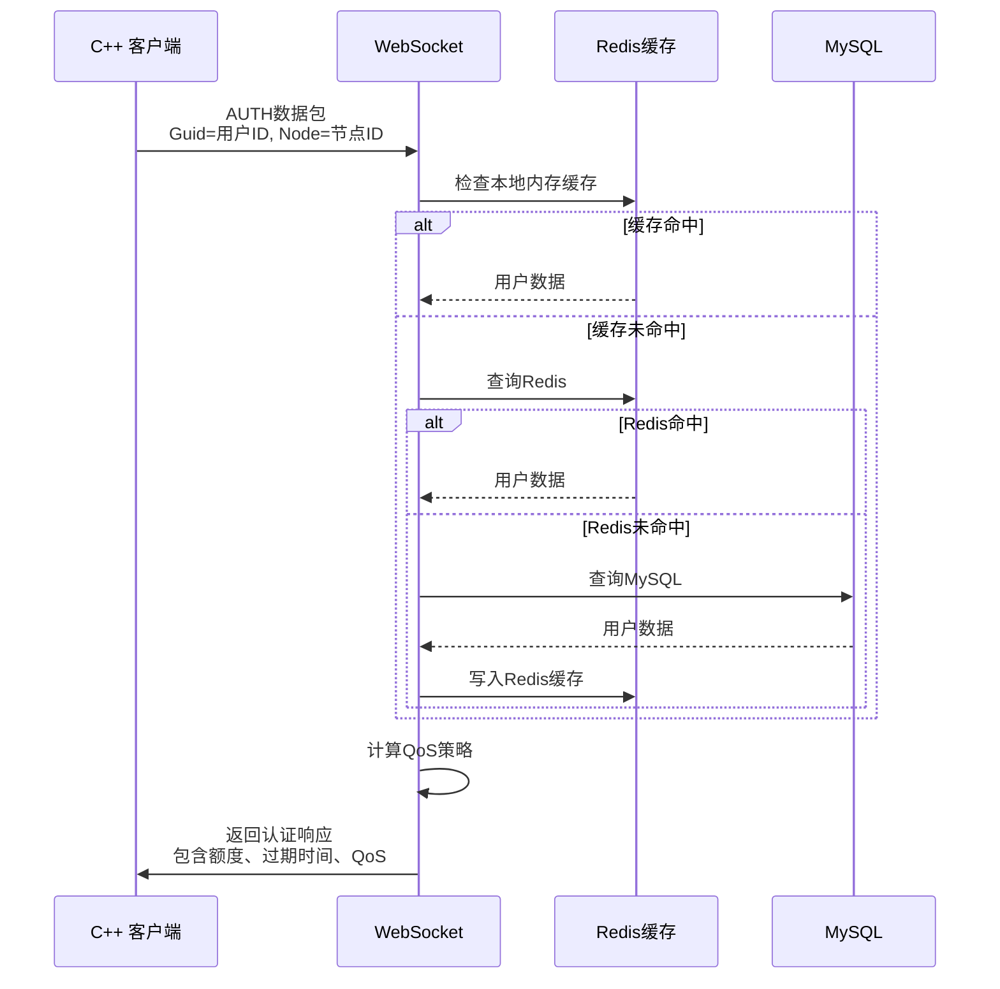

### 认证详细逻辑

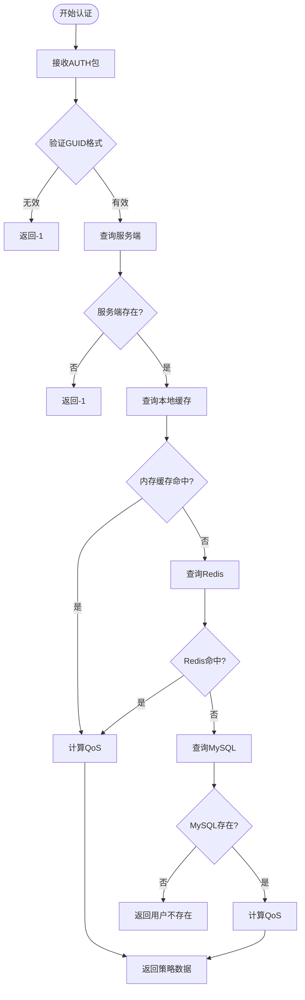

### 策略数据结构

认证成功后返回的策略数据：

```go
type _vpn_user struct {
    Guid             string `json:"Guid"`              // 用户GUID
    ArchiveTime      uint32 `json:"ArchiveTime"`      // 存档时间
    IncomingTraffic int64  `json:"IncomingTraffic"` // 剩余下行额度
    OutgoingTraffic int64  `json:"OutgoingTraffic"`// 剩余上行额度
    ExpiredTime      uint32 `json:"ExpiredTime"`      // 到期时间戳
    BandwidthQoS    uint32 `json:"BandwidthQoS"`    // 带宽限制
}
```

## 策略分发机制

### 策略计算规则

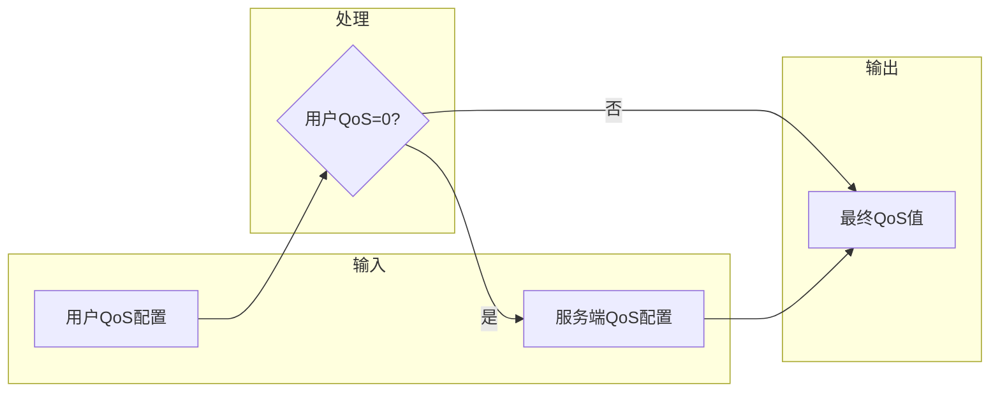

策略优先级：
1. 若用户配置了QoS，使用用户配置的QoS
2. 否则使用服务端配置的默认QoS

## 流量上报与统计

### 流量上报流程

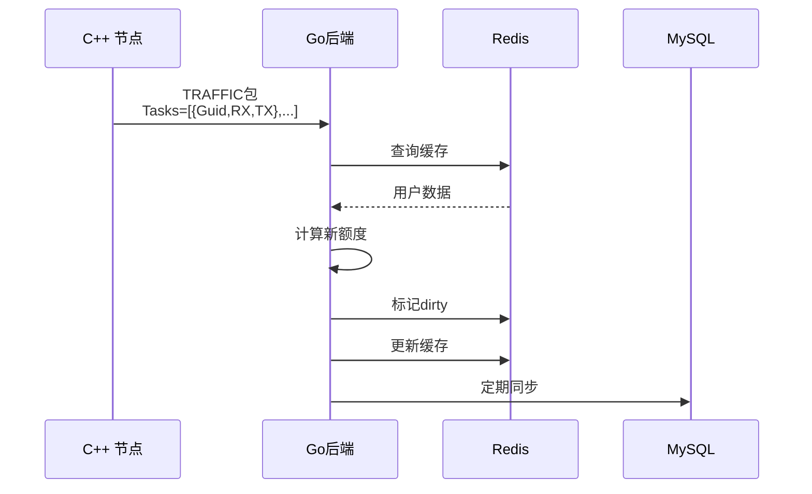

### 流量任务格式

**请求数据格式**
```json
{
    "Tasks": [
        {
            "Guid": "A1B2C3D4E5F6",
            "RX": "1048576",
            "TX": "524288"
        }
    ]
}
```

**响应数据格式**
```json
{
    "List": [
        {
            "Guid": "A1B2C3D4E5F6",
            "IncomingTraffic": 996710144,
            "OutgoingTraffic": 999475712,
            "ExpiredTime": 86400,
            "BandwidthQoS": 100000
        }
    ]
}
```

### 流量同步模式

流量数据采用三级同步机制：

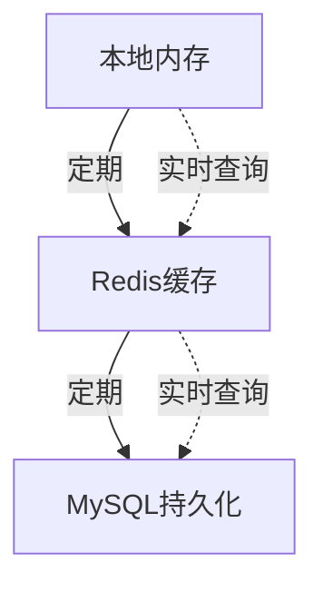

| 存储层 | 同步频率 | 用途 |
|--------|---------|------|
| 本地内存 | 实时 | 快速读写 |
| Redis | ~20秒 | 分布式缓存 |
| MySQL | ~20秒 | 持久化 |

### 流量扣减规则

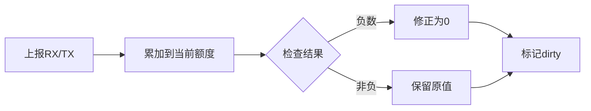

规则说明：
- 上报流量累加到用户当前额度
- 如果扣减后为负数，修正为0
- 修改后标记dirty等待同步

## 状态报告

### 节点状态管理

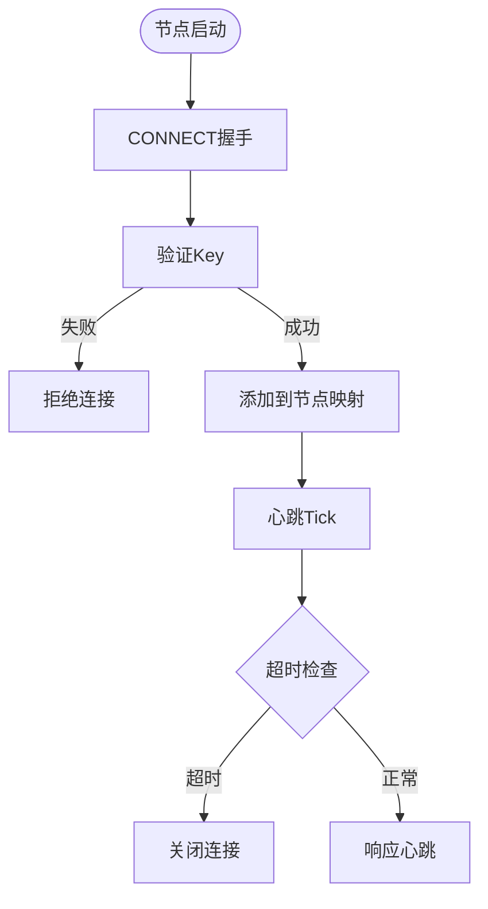

### 超时配置参数

| 参数名 | 默认值 | 说明 |
|--------|--------|------|
| node-websocket-timeout | 20秒 | WebSocket超时时间 |
| node-mysql-query | 1秒 | 服务端MySQL查询锁超时 |
| user-mysql-query | 1秒 | 用户MySQL查询锁超时 |
| user-cache-timeout | 3600秒 | Redis缓存过期时间 |
| user-archive-timeout | 20秒 | 数据归档周期 |

### 节点存活检测

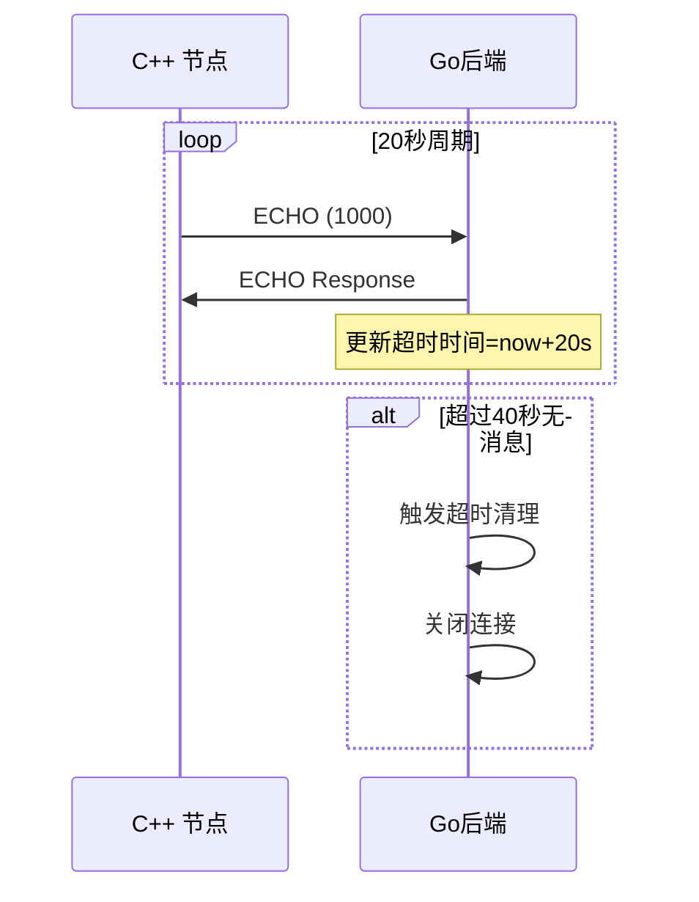

## 持久化模型

Go 侧使用：

- Redis 作为分布式/缓存式状态层
- 通过 GORM 访问 MySQL 作为持久状态层

这再次强化了系统拆分：C++ 进程专注转发，Go 服务专注业务状态和存储。

### 存储架构

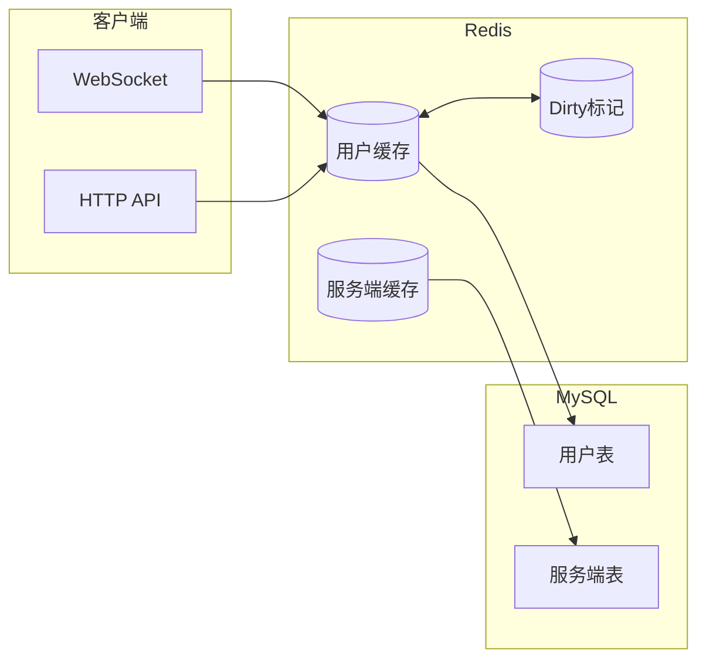

### 数据库表结构

**用户表 (tb_user)**

| 字段名 | 类型 | 说明 |
|--------|------|------|
| guid | 主键 | 用户唯一标识 |
| incoming_traffic | int64 | 下行流量配额 |
| outgoing_traffic | int64 | 上行流量配额 |
| expired_time | uint32 | 过期时间戳 |
| qos | uint32 | 带宽QoS配置 |

**服务端表 (tb_server)**

| 字段名 | 类型 | 说明 |
|--------|------|------|
| id | 主键 | 服务端ID |
| link | string | 连接地址 |
| name | string | 服务端名称 |
| kf/kx/kl/kh | int | 密钥参数 |
| protocol | string | 协议类型 |
| protocol_key | string | 协议密钥 |
| transport | string | 传输类型 |
| transport_key | string | 传输密钥 |
| masked | bool | 混淆启用 |
| plaintext | bool | 明文传输 |
| delta_encode | bool | Delta编码 |
| shuffle_data | bool | 数据打乱 |
| qos | uint32 | 带宽限制 |

## 为什么这对阅读 C++ 代码很重要

因为它能解释一个现象：本地运行时中的某些策略对象在后端返回前并不完整。

服务端运行时是按"可以接入外部策略系统"来设计的，但它依然保留了足够的本地结构，使自身仍然是一个完整网络节点。

## 运维意义

如果不部署后端，OPENPPP2 仍然可以以较简化的本地模式运行。

如果部署后端，则可以获得：

- 集中式认证
- 集中式流量记账
- 集中式节点与用户管理

这��得系统既适合单点基础设施部署，也适合受管服务型部署。

## 部署配置示例

```json
{
    "database": {
        "master": {
            "host": "localhost",
            "port": 3306,
            "user": "root",
            "password": "password",
            "db": "openppp2"
        },
        "max-open-conns": 100,
        "max-idle-conns": 10,
        "conn-max-life-time": 3600
    },
    "redis": {
        "addresses": ["localhost:6379"],
        "master": "mymaster",
        "db": 0,
        "password": "redis_password"
    },
    "key": "your_secret_key",
    "path": "/websocket",
    "prefixes": "localhost:8080",
    "interfaces": {
        "consumer-reload": "/consumer/reload",
        "consumer-load": "/consumer/load",
        "consumer-set": "/consumer/set",
        "consumer-new": "/consumer/new",
        "server-get": "/server/get",
        "server-all": "/server/all",
        "server-load": "/server/load"
    },
    "concurrency-control": {
        "node-websocket-timeout": 20,
        "node-mysql-query": 1,
        "user-mysql-query": 1,
        "user-cache-timeout": 3600,
        "user-archive-timeout": 20
    }
}
```

## 高可用性设计

### 主从分离

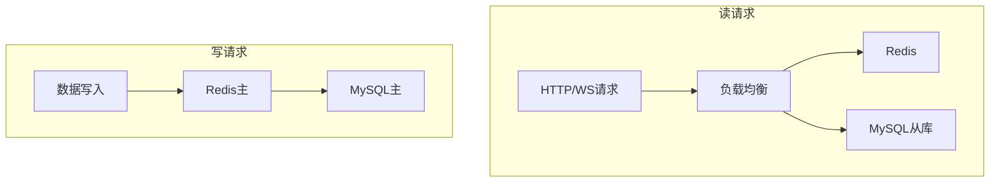

### 连接池配置

| 配置项 | 推荐值 | 说明 |
|--------|--------|------|
| MaxOpenConns | 100 | 最大打开连接数 |
| MaxIdleConns | 10 | 最大空闲连接数 |
| ConnMaxLifetime | 3600 | 连接生命周期(秒) |

## 监控与日志

### 关键日志类别

| 日志类型 | 记录内容 |
|----------|----------|
| 用户登录 | 用户GUID、节点ID、认证结果 |
| 流量上报 | 用户GUID、上报流量、剩余额度 |
| 数据同步 | 同步成功/失败记录 |
| 连接状态 | 节点连接/断开 |

### 性能指标

| 指标名 | 说明 |
|--------|------|
| 在线用户数 | 当前内存中用户数量 |
| 活跃连接数 | WebSocket连接数 |
| QPS | 每秒请求数 |
| 缓存命中率 | Redis缓存命中率 |
| 同步延迟 | 数据同步延迟时间 |

## 故障排查指南

### 常见问题

| 问题现象 | 可能原因 | 解决方案 |
|----------|----------|----------|
| 连接被拒绝 | Key验证失败 | 检查配置Key |
| 用户未找到 | 用户未创建 | 使用/consumer/new创建 |
| 额度不更新 | 同步延迟 | 等待20秒或手动同步 |
| 查询超时 | 并发锁竞争 | 调整并发控制参数 |

### 诊断命令

```bash
# 查看在线连接数
curl http://localhost:8080/server/all

# 查询用户状态
curl "http://localhost:8080/consumer/load?key=xxx&guid=xxx"

# 重载用户数据
curl "http://localhost:8080/consumer/reload?key=xxx&guid=xxx"
```

## 运维意义

如果不部署后端，OPENPPP2 仍然可以以较简化的本地模式运行。

如果部署后端，则可以获得：

- 集中式认证
- 集中式流量记账
- 集中式节点与用户管理

这使得系统既适合单点基础设施部署，也适合受管服务型部署。