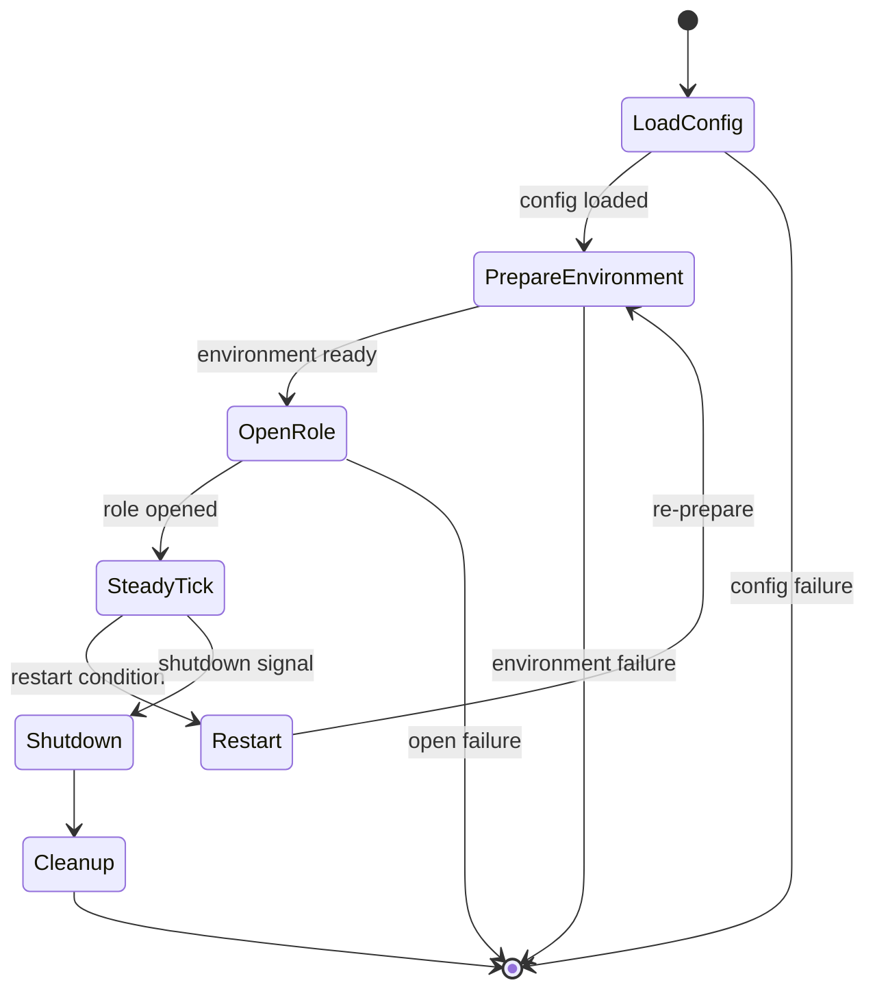
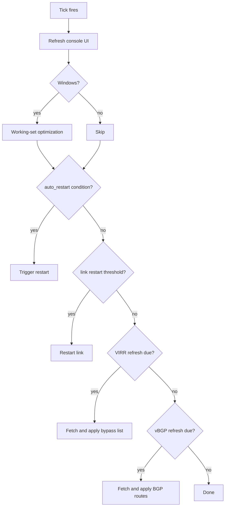
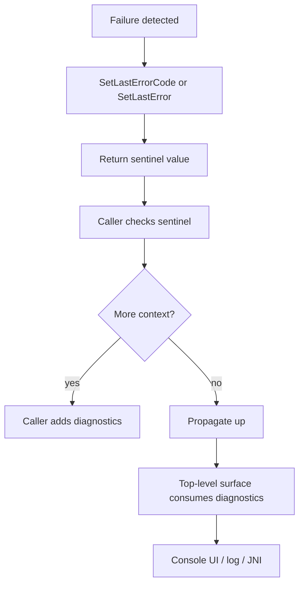
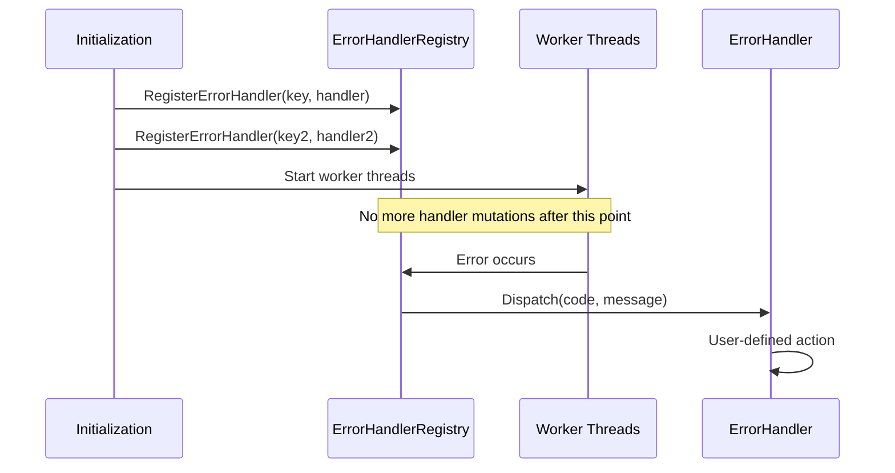
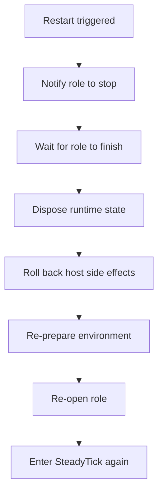
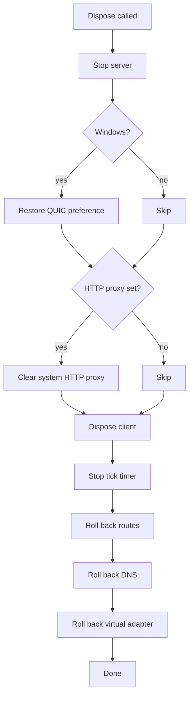
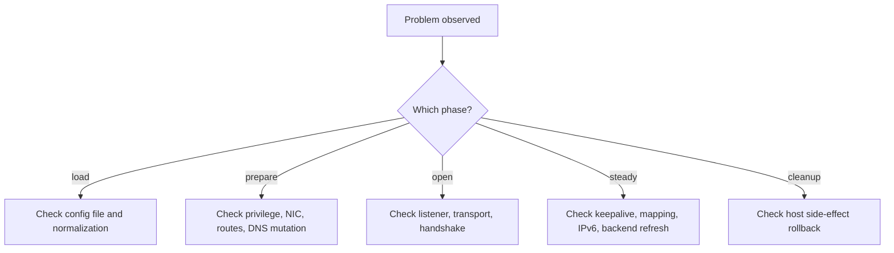
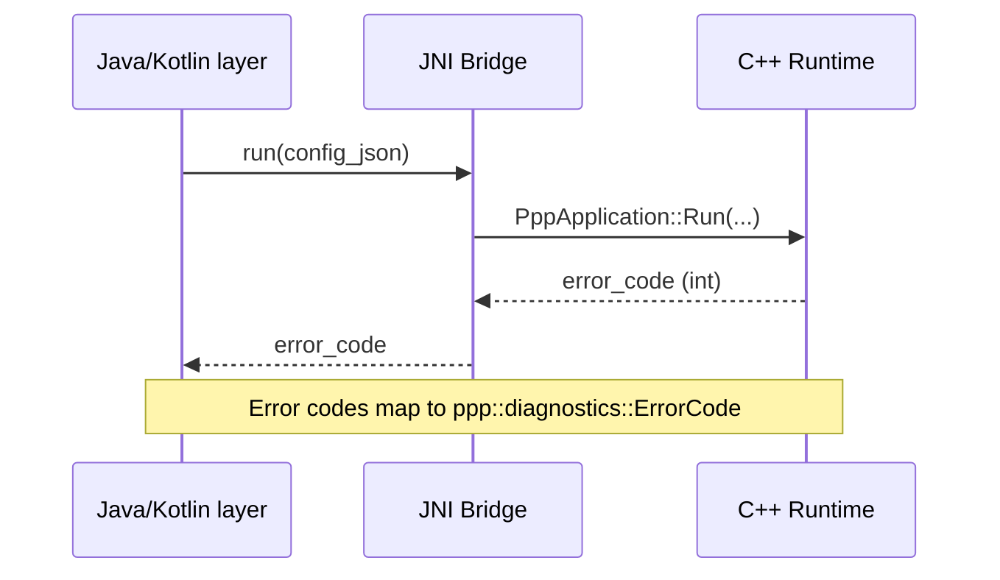

# Operations And Troubleshooting

[中文版本](OPERATIONS_CN.md)

## Scope

This document explains operational behavior after build and deployment.
It covers the lifecycle state machine, tick loop maintenance, diagnostics, troubleshooting strategies, restart behavior, and cleanup.

---

## Main Operational Model

Read the process as state transitions:



| Phase | Description |
|-------|-------------|
| `LoadConfig` | Find and parse the JSON configuration file |
| `PrepareEnvironment` | Create adapters, routes, listeners, DNS settings |
| `OpenRole` | Open client exchanger or server switcher |
| `SteadyTick` | Recurring maintenance: keepalive, refresh, restart check |
| `Restart` | Tear down and re-open the role |
| `Cleanup` | Roll back all host-side effects |

---

## Startup Failure Classes

| Class | Cause | Where to look |
|-------|-------|---------------|
| Privilege failure | Not running as administrator/root | OS privilege check in `PppApplication::Run` |
| Duplicate instance | Another ppp process is running | Instance lock mechanism |
| Config not found | Wrong path, missing file | `LoadConfiguration(...)` search order |
| Config parse error | Invalid JSON syntax or schema | `AppConfiguration` normalization |
| Environment failure | NIC, route, DNS setup failed | `PrepareEnvironment(...)` call chain |
| Role open failure | Server or client open sequence failed | `OpenServer(...)` / `OpenClient(...)` |

---

## Tick Loop

`PppApplication::OnTick(...)` is the main operational heartbeat.



### Tick Loop Responsibilities

| Responsibility | Description | Source |
|----------------|-------------|--------|
| Console refresh | Update TUI display | `ConsoleUI::Refresh()` |
| Working-set trim | Windows memory optimization | Platform-specific |
| Auto restart | `auto_restart` config-driven restart | `PppApplication::OnTick` |
| Link restart | Reconnect on threshold breach | Exchanger keepalive failure |
| VIRR refresh | Fetch bypass IP list from URL | `virr.update-interval` |
| vBGP refresh | Fetch BGP routes from URL | `vbgp.update-interval` |

---

## Diagnostics Coverage And Propagation Policy

Operations and troubleshooting follow a strict diagnostics contract:



### Rules

- Every failure branch in startup, environment preparation, open path, and rollback code must call `SetLastErrorCode(...)` or `SetLastError(code, value)` before returning a failure sentinel.
- Returning only `false`, `-1`, or `NULLPTR` without diagnostics is treated as incomplete propagation.
- User-facing operational surfaces (Console UI, JNI return paths) consume diagnostic snapshots.

### Diagnostic API

```cpp
/**
 * @brief Set the last error code for the current diagnostics context.
 * @param code  Error code to record.
 */
ppp::diagnostics::ErrorCode SetLastErrorCode(ppp::diagnostics::ErrorCode code) noexcept;

/**
 * @brief Set the last error code and return a caller-provided value.
 * @tparam T Return type.
 * @param code  Error code to record.
 * @param value Value to return.
 * @return      The provided value.
 */
template <typename T>
T SetLastError(ppp::diagnostics::ErrorCode code, T value) noexcept;

/**
 * @brief Retrieve the last recorded error code.
 * @return  The most recently set error code.
 */
ppp::diagnostics::ErrorCode GetLastErrorCode() noexcept;
```

Source: `ppp/diagnostics/Error.h`

---

## Error Handler Registration

Error handler registration is key-based and has a startup-time safety boundary:



### Registration Rules

- Register, replace, or remove handlers during initialization only.
- Do not mutate registrations concurrently with multi-threaded runtime work.
- This keeps callback topology deterministic while worker threads are active.

```cpp
/**
 * @brief Register an error handler for a specific key.
 * @param key      Handler registration key (used for replace/remove).
 * @param handler  Callable invoked when an error is dispatched.
 */
void RegisterErrorHandler(const ppp::string& key, ErrorHandlerCallback handler) noexcept;

/**
 * @brief Remove a previously registered error handler.
 * @param key  The key used during registration.
 */
void UnregisterErrorHandler(const ppp::string& key) noexcept;
```

Source: `ppp/diagnostics/ErrorHandler.h`

---

## Restart Behavior

Restart can be deliberate or automatic.

### Restart Triggers

| Trigger | Source | Description |
|---------|--------|-------------|
| `auto_restart` | Config + tick | Automatic restart on schedule or condition |
| Keepalive failure | Exchanger | Client or server keepalive timeout → reconnect |
| VIRR route update | Tick loop | Route-source refresh may trigger re-apply |
| Manual signal | OS signal | SIGTERM or equivalent |



### Restart vs. Full Shutdown

| Condition | Action |
|-----------|--------|
| `auto_restart` | Re-prepare + re-open |
| Link reconnection | Reconnect exchanger only |
| Route refresh | Re-apply routes; may or may not restart role |
| SIGTERM | Full cleanup + exit |

---

## Cleanup And Rollback

`PppApplication::Dispose()` is the canonical cleanup path.



### What Cleanup Must Roll Back

| Host side effect | Must be rolled back? |
|-----------------|---------------------|
| Virtual adapter | Yes |
| Added routes | Yes |
| DNS server changes | Yes |
| System HTTP proxy | Yes (if set by ppp) |
| Windows QUIC preference | Yes (Windows only) |
| Firewall rules | Yes (if set by ppp) |

---

## Operational Checklist

| Step | Check |
|------|-------|
| 1 | Verify administrator/root privilege is active |
| 2 | Verify config discovery path and file validity |
| 3 | Verify host NIC and gateway are available |
| 4 | Verify listener port is not in use (server) |
| 5 | Verify DNS and route changes succeeded |
| 6 | Verify optional backend is reachable |
| 7 | Watch the tick loop for unexpected restart conditions |
| 8 | Verify cleanup rolls back all host side effects |

---

## Troubleshooting By Phase

The fastest way to debug runtime behavior is to classify the failure by phase:



### Phase-By-Phase Guidance

| Phase | Typical symptom | Investigation approach |
|-------|----------------|------------------------|
| `load` | "configuration not found" or parse error | Check file path, JSON validity, schema normalization |
| `prepare` | NIC not created, route add failed | Check privilege level, driver availability, route conflicts |
| `open` | Listener bind failed, handshake timeout | Check port availability, transport config, server reachability |
| `steady` | Sessions drop unexpectedly, keepalive failures | Check keepalive interval config, network stability, backend connectivity |
| `cleanup` | Routes or DNS not restored after exit | Check Dispose() call path, forced exit conditions |

---

## Android Runtime Notes

Android bridge error integers and core diagnostics should remain aligned:

- JNI-visible error codes map to core `ppp::diagnostics::ErrorCode` where practical.
- `run/stop/release` transitions preserve consistent error meaning across native and managed boundaries.
- Android bridge errors are part of the same diagnostics pipeline, not a separate troubleshooting universe.



---

## Common Runtime Failure Patterns

| Symptom | Likely Cause | Resolution |
|---------|-------------|------------|
| Process exits immediately at startup | Privilege check failed | Run as administrator/root |
| "duplicate instance" at startup | Another ppp running | Stop existing instance |
| Routes not applied | Route add failed | Check privilege and existing routes |
| DNS not working through tunnel | DNS bypass route missing | Check `AddRouteWithDnsServers()` |
| Sessions drop every N minutes | Inactivity timeout too short | Increase `tcp.inactive.timeout` or `udp.inactive.timeout` |
| Backend auth fails | Wrong credentials or wrong URL | Verify `server.backend` URL and keys |
| IPv6 not working | IPv6 transit plane not opened | Check `server.ipv6` config and NIC support |
| Routes not restored after exit | Forced kill bypassed Dispose | Use graceful shutdown signal |
| Windows QUIC preference retained | Dispose() not called fully | Check process exit path |
| High CPU in tick loop | VIRR/vBGP refresh interval too short | Increase refresh intervals |

---

## Log And Diagnostic Collection

OPENPPP2 does not use file-based logging by default. Diagnostic state is available through:

| Surface | How to access |
|---------|--------------|
| Console UI | TUI display updated on each tick |
| JNI error codes | Android bridge return values |
| `GetLastError()` / `GetLastErrorCode()` | Runtime diagnostic query |
| Error handler callbacks | Register handlers at startup |

For long-running server deployments, consider wrapping with a process supervisor (systemd, supervisord, etc.) that captures stdout/stderr.

---

## Systemd Service Example (Linux Server)

```ini
[Unit]
Description=OPENPPP2 Server
After=network.target

[Service]
Type=simple
ExecStart=/opt/openppp2/ppp --config=/etc/openppp2/appsettings.json
Restart=on-failure
RestartSec=5
User=root

[Install]
WantedBy=multi-user.target
```

Install and enable:

```bash
cp openppp2-server.service /etc/systemd/system/
systemctl daemon-reload
systemctl enable openppp2-server
systemctl start openppp2-server
systemctl status openppp2-server
```

---

## Windows Service Setup

On Windows, use the built-in `sc` command or NSSM (Non-Sucking Service Manager):

```bat
nssm install openppp2 "C:\openppp2\ppp.exe"
nssm set openppp2 AppParameters "--config=C:\openppp2\appsettings.json"
nssm set openppp2 Start SERVICE_AUTO_START
nssm start openppp2
```

---

## Error Code Reference

Operations-related `ppp::diagnostics::ErrorCode` values (from `ppp/diagnostics/ErrorCodes.def`):

| ErrorCode | Description |
|-----------|-------------|
| `AppPrivilegeRequired` | Process requires administrator/root |
| `AppAlreadyRunning` | Another ppp instance is running |
| `ConfigFileNotFound` | Config file not found |
| `ConfigLoadFailed` | Config file parse or normalization failed |
| `NetworkInterfaceOpenFailed` | Virtual NIC failed to open |
| `RouteAddFailed` | Route add to OS routing table failed |
| `RouteDeleteFailed` | Route delete from OS routing table failed |
| `DnsResolveFailed` | DNS resolution failed |
| `SocketBindFailed` | Listener failed to bind |
| `SessionHandshakeFailed` | Client-server handshake failed |
| `KeepaliveTimeout` | Peer keepalive heartbeat timed out |
| `SessionQuotaExceeded` | Session quota exhausted |

---

## Related Documents

- [`STARTUP_AND_LIFECYCLE.md`](STARTUP_AND_LIFECYCLE.md)
- [`DEPLOYMENT.md`](DEPLOYMENT.md)
- [`PLATFORMS.md`](PLATFORMS.md)
- [`ERROR_HANDLING_API.md`](ERROR_HANDLING_API.md)
- [`DIAGNOSTICS_ERROR_SYSTEM.md`](DIAGNOSTICS_ERROR_SYSTEM.md)
- [`ERROR_CODES.md`](ERROR_CODES.md)
- [`CONFIGURATION.md`](CONFIGURATION.md)

---

## Main Conclusion

Operations in OPENPPP2 are state transitions plus host side effects. The process is healthy only when configuration, environment setup, role open sequence, tick maintenance, and cleanup all behave as a single lifecycle. Every failure must set diagnostics before returning; every phase must be studied independently when troubleshooting.
