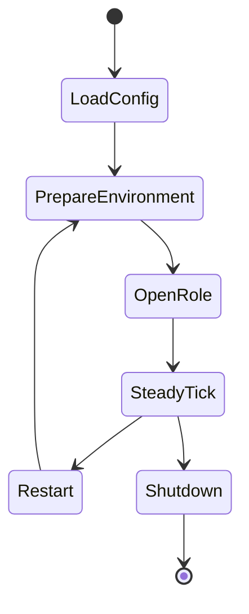
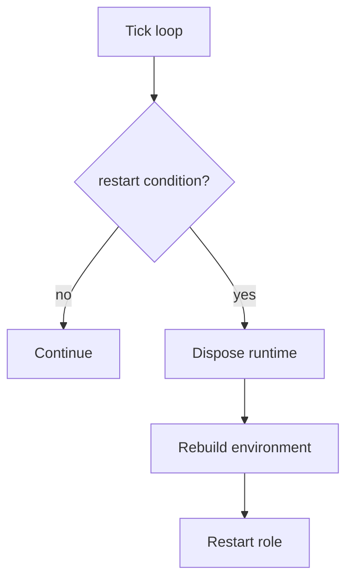

# Operations And Troubleshooting

[中文版本](OPERATIONS_CN.md)

## Scope

This document explains operational behavior after build and deployment.

## Main Operational Model

Read the process as state transitions:

- configuration load.
- environment preparation.
- client or server open sequence.
- steady-state tick loop.
- optional restart or shutdown.
- cleanup and rollback.

## Startup Failure Classes

- privilege failure.
- duplicate instance failure.
- configuration discovery/load failure.
- client local environment preparation failure.
- server open-sequence failure.

## Tick Loop

`PppApplication::OnTick(...)` is the main operational heartbeat. It handles:

- console refresh.
- Windows working-set optimization.
- auto restart.
- link restart.
- VIRR refresh.
- vBGP refresh.

This is where the process turns runtime state into recurring maintenance behavior.

## Diagnostics Coverage And Propagation Policy

Operations and troubleshooting should follow a strict diagnostics contract:

- Failure exits in startup, environment preparation, open-path, and rollback code should set framework diagnostics (`SetLastErrorCode` / `SetLastError(...)`) before returning failure sentinels.
- Returning only `false`, `-1`, or `NULLPTR` without diagnostics is treated as incomplete propagation and reduces observability.
- User-facing operational surfaces (Console UI, logs, JNI return paths) should consume these diagnostics snapshots instead of inventing parallel failure channels.

Practical expectation:

- Every newly added failure branch in operational paths should either set diagnostics directly or call a helper that guarantees diagnostics are set.

## Error Handler Registration Runtime Rule

Error handler registration is key-based (`RegisterErrorHandler(key, handler)`) and has a startup-time safety boundary:

- Register, replace, or remove handlers during initialization.
- Do not mutate registrations concurrently with multi-threaded runtime work.

This keeps callback topology deterministic while worker threads are active.

See `ERROR_HANDLING_API.md` for API details and lifecycle guidance.

## Android Runtime Sync Notes

Android bridge error integers and core diagnostics should remain aligned:

- JNI-visible error codes should map to core diagnostics where practical.
- `run/stop/release` transitions should preserve consistent error meaning across native and managed boundaries.
- Operational runbooks should treat Android bridge errors as part of the same diagnostics pipeline, not a separate troubleshooting universe.

## Restart Behavior

Restart can be deliberate. It may happen because of:

- `auto_restart`.
- link reconnection threshold.
- route-source update that rewrites route files.

## Cleanup

`PppApplication::Dispose()` releases the server, restores Windows QUIC preference, clears system HTTP proxy if needed, disposes the client, and stops the tick timer.

Cleanup is not just shutdown. It is rollback of host side effects.

## Operational Checklist

1. Verify privilege.
2. Verify config discovery path.
3. Verify host NIC and gateway.
4. Verify listener availability.
5. Verify DNS and route changes succeeded.
6. Watch the tick loop for restart conditions.

## Troubleshooting Strategy

The fastest way to debug runtime behavior is to classify the failure by phase:

| Phase | Typical question |
|---|---|
| load | did configuration load and normalize correctly? |
| prepare | did the host environment become writable? |
| open | did the selected role finish opening? |
| steady | did tick-driven maintenance break? |
| cleanup | were host side effects rolled back? |

## Operational Notes

- If the problem is in `load`, inspect the config file and normalization rules.
- If the problem is in `prepare`, inspect privilege, NIC, route, and DNS mutation.
- If the problem is in `open`, inspect listener, transport, and handshake setup.
- If the problem is in `steady`, inspect keepalive, mapping, IPv6, and managed refresh behavior.
- If the problem is in `cleanup`, inspect rollback of host side effects.

## Related Documents

- `STARTUP_AND_LIFECYCLE.md`
- `DEPLOYMENT.md`
- `PLATFORMS.md`
- `ERROR_HANDLING_API.md`

## Main Conclusion

Operations in OPENPPP2 are state transitions plus host side effects. The process is healthy only when configuration, environment setup, role open sequence, tick maintenance, and cleanup all behave as a single lifecycle.
