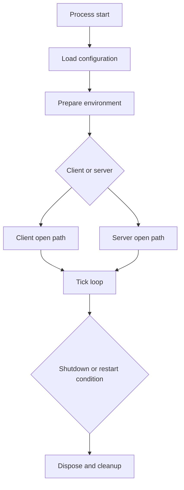
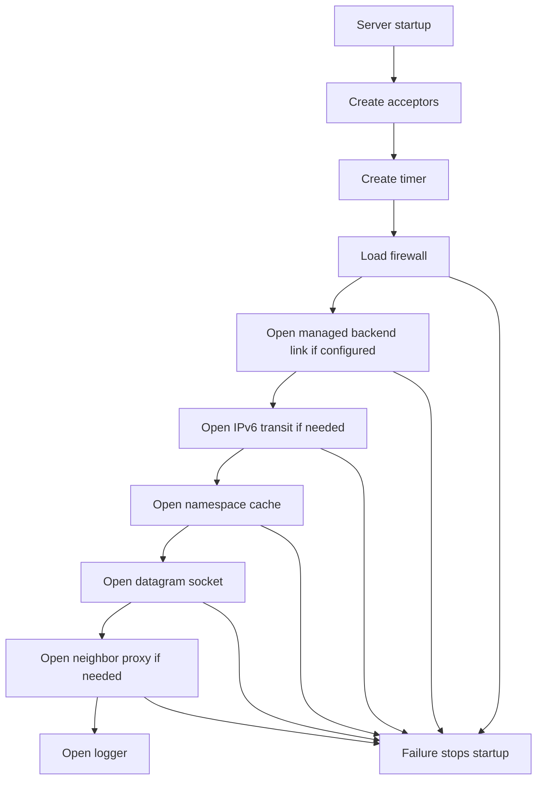
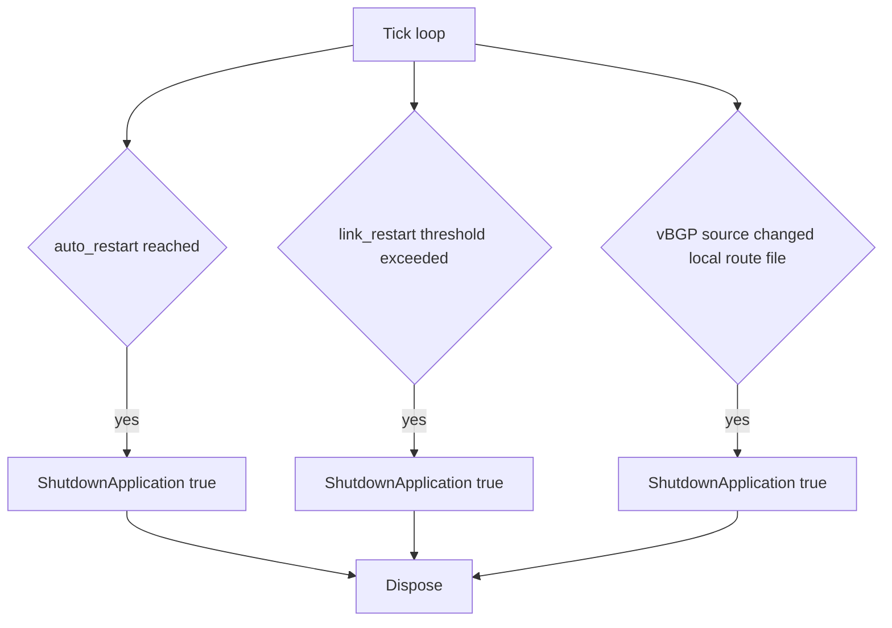
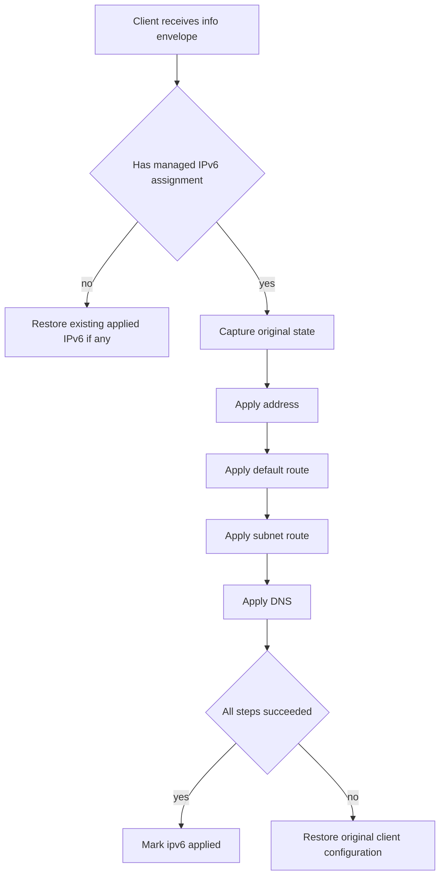

# Operations And Troubleshooting

[中文版本](OPERATIONS_CN.md)

## Scope

This document explains how OPENPPP2 behaves operationally once it is already built and deployed. It focuses on runtime evidence, failure classification, restart behavior, cleanup behavior, and the code paths that operators should mentally map to real incidents.

This is not a generic checklist of best practices. It is a source-driven operations guide anchored to the current runtime implementation.

The main implementation anchors are:

- `main.cpp`
- `ppp/app/client/VEthernetNetworkSwitcher.cpp`
- `ppp/app/client/VEthernetExchanger.cpp`
- `ppp/app/server/VirtualEthernetSwitcher.cpp`
- `linux/ppp/ipv6/LINUX_IPv6Auxiliary.cpp`
- `go/ppp/ManagedServer.go`

## The First Operational Principle: Read Runtime Behavior As State Transitions

OPENPPP2 is easier to operate when you stop thinking of it as a monolithic VPN process and start thinking of it as a set of runtime state transitions.

At the top level, the process moves through:

- configuration load
- role-specific environment preparation
- client or server open sequence
- steady-state periodic tick loop
- optional restart or shutdown
- cleanup and rollback

At the client level, the most important states are:

- connecting
- established
- reconnecting

At the server level, the most important transitions are:

- accept socket
- classify transport
- handshake
- either `Establish(...)` a session or `Connect(...)` an auxiliary connection
- run until teardown
- delete exchanger or connection state

If you read incidents in terms of these transitions, the logs and console output become much easier to interpret.

## Build Verification Is Not The Same As Runtime Verification

Operational work begins after a successful build, not before it. But the build still matters because platform-specific behavior is compiled in.

Windows runtime problems should be investigated using a Windows-built binary.

Linux runtime problems should be investigated using a Linux-built binary.

Android runtime problems should be investigated through the Android host application and NDK build, not by assuming the desktop client behavior is equivalent.

The old one-line build instructions are still useful, but they are not enough operational evidence by themselves.

## Startup Failure Classes

### 1. Process Refuses To Start Before Role Logic Begins

The earliest hard stop is privilege. `PppApplication::Main(...)` rejects execution if the process is not running with administrator or root privilege.

Operational meaning:

- if the process exits immediately with a privilege-related message, do not begin tunnel debugging
- the host execution model is wrong

The second early hard stop is duplicate instance protection. `prevent_rerun_` is keyed using role plus configuration path. If the same role/config pair is already running, the next process exits.

Operational meaning:

- duplicate launches are not harmless
- they are treated as invalid operation

The third early hard stop is configuration discovery. If `LoadConfiguration(...)` cannot find or parse a usable configuration file, startup stops before client or server networking begins.

### 2. Client Fails During Local Environment Preparation

Inside `PreparedLoopbackEnvironment(...)`, the client path may fail before any remote handshake happens.

Common failure points include:

- `ITap::Create(...)` fails
- `tap->Open()` fails
- `VEthernetNetworkSwitcher` cannot be instantiated
- route or bypass environment later cannot be opened correctly through `ethernet->Open(tap)`

Operational meaning:

- "cannot connect to server" is the wrong diagnosis when the client never successfully created the local virtual interface

### 3. Server Fails During Open Sequence

The server open path is a pipeline in `VirtualEthernetSwitcher::Open(...)`.

Failure may occur in any of these stages:

- `CreateAllAcceptors()`
- `CreateAlwaysTimeout()`
- `CreateFirewall(...)`
- `OpenManagedServerIfNeed()`
- `OpenIPv6TransitIfNeed()`
- `OpenNamespaceCacheIfNeed()`
- `OpenDatagramSocket()`
- `OpenIPv6NeighborProxyIfNeed()`

Operational meaning:

- a server that "did not start" may actually have failed in a very specific optional plane
- enabling many planes at once increases ambiguity during incident triage

## The Tick Loop Is The Main Operational Heartbeat

`PppApplication::OnTick(...)` in `main.cpp` is the main periodic operational loop. It is where the program:

- refreshes console output
- on Windows, optimizes working-set size
- evaluates `auto_restart`
- checks client link state
- evaluates `link_restart`
- refreshes VIRR IP lists
- refreshes vBGP route inputs

`NextTickAlwaysTimeout(...)` re-arms that loop every second.

Operationally, this means that OPENPPP2 does not rely solely on passive callbacks. It also has a top-level poll-and-maintain heartbeat. If the process is alive but appears operationally frozen, the tick loop behavior is one of the first conceptual places to inspect.

## Restart Behavior Is Deliberate, Not Accidental

There are several legitimate restart paths in the code.

### Auto Restart

If `GLOBAL_.auto_restart` is configured, `OnTick(...)` will trigger a full application restart once uptime crosses the configured threshold.

Operational meaning:

- periodic restarts are a configured lifecycle behavior, not necessarily a crash symptom

### Link Restart

If the client is in `NetworkState_Established` and `GetReconnectionCount()` exceeds `GLOBAL_.link_restart`, `OnTick(...)` restarts the whole process.

Operational meaning:

- repeated reconnect churn can intentionally escalate from link-level recovery to process-level recovery

### Route Source Change Restart

When vBGP source files are refreshed and new route content differs from current local files, the callback can write a new file and then invoke `ShutdownApplication(true)`.

Operational meaning:

- some route-source updates are designed to restart the process so that route behavior re-enters from a clean state

## Shutdown And Cleanup Behavior

`PppApplication::Dispose()` is operationally important because it shows what should be rolled back or released on orderly exit.

It:

- disposes the server switcher if present
- restores Windows QUIC preference if it had been modified
- clears system HTTP proxy on Windows if it had been set by the client
- disposes the client switcher if present
- clears the periodic tick timer

This matters for incident analysis. If operators kill the process hard instead of allowing orderly disposal, some state may persist longer than expected at the OS level, especially on Windows.

## Client Runtime Operations

### Core Runtime Signals

The client runtime center of gravity is `VEthernetExchanger` plus `VEthernetNetworkSwitcher`.

`VEthernetExchanger::Loopback(...)` expresses the operational lifecycle:

- enter connecting state
- open a transmission
- perform handshake
- echo LAN side state to remote side
- enter established state
- send requested IPv6 configuration
- register mappings
- set up static echo if needed
- run until the link breaks
- unregister mappings
- dispose transmission
- move to reconnecting state
- sleep for reconnection timeout and try again

Operational meaning:

- one observed session drop is rarely the whole story
- the exchanger is explicitly built to cycle through reconnect attempts

### Keepalive And Session Liveness

`VEthernetExchanger::Update()` posts periodic client maintenance work. It runs:

- `SendEchoKeepAlivePacket(...)`
- `DoMuxEvents()`
- `DoKeepAlived(...)`
- datagram and mapping updates

`DoKeepAlived(...)` will dispose the transmission if keepalive handling fails while the client is established.

Operational meaning:

- silent loss of liveness can surface as transmission disposal rather than a dramatic explicit error log
- keepalive failure is a legitimate root cause for transition from established to reconnecting

### MUX Operational Behavior

`DoMuxEvents()` only advances when the client is established and MUX is enabled. It can:

- keep an existing `vmux_net` alive
- tear it down if it looks stale
- build a new mux object
- attach protector support on Linux
- generate a VLAN identifier
- create auxiliary transmission links for mux subchannels

Operational meaning:

- MUX incidents should be thought of as a second-order runtime plane layered over a healthy primary session
- if the primary session is unstable, MUX symptoms may be secondary rather than primary

### Client IPv6 Apply And Rollback

`VEthernetNetworkSwitcher::OnInformation(...)` and `ApplyAssignedIPv6(...)` define the client-side IPv6 operational model.

The important facts are:

- IPv6 assignment is treated as managed runtime state, not static boot state
- old assignment is restored if server assignment changes or disappears
- `ApplyAssignedIPv6(...)` captures original client state before mutating address, default route, subnet route, and DNS
- if any step fails, `RestoreClientConfiguration(...)` is invoked and state is cleared
- if server later withdraws assignment, the client restores prior configuration again

Operational meaning:

- IPv6 incidents are often rollback incidents as much as apply incidents
- successful assignment requires the whole mutation chain to succeed, not just address installation

### Client Route And DNS Troubleshooting Meaning

`VEthernetNetworkSwitcher::Open(...)`, `AddRoute()`, `DeleteRoute()`, and `ProtectDefaultRoute()` show that client route and DNS behavior is not a side note. It is part of core client bring-up and teardown.

Operational meaning:

- if traffic shape is wrong, inspect route and DNS behavior before assuming transmission or encryption problems
- if the process terminates uncleanly, route or DNS rollback may not match the clean-path expectation

## Server Runtime Operations

### Listener Operations

`VirtualEthernetSwitcher::Run()` starts `AcceptLoopbackAsync` on all configured acceptors. A listener may exist for multiple categories, including normal and CDN-related categories.

Operational meaning:

- a partially healthy server may have some listener categories active and others failed or disabled

### Session Establish Versus Auxiliary Connection

`VirtualEthernetSwitcher::Run(context, transmission, y)` does something operationally important after handshake: it separates connections into two classes.

If `mux == false`, the connection goes to `Connect(...)`, which is used for auxiliary paths such as relay or mux-style side links.

If `mux == true`, the connection goes to `Establish(...)`, which creates or replaces the main exchanger session.

Operational meaning:

- not every accepted connection is a new primary VPN session
- operators should distinguish primary-session problems from auxiliary-connection problems

### Exchanger Replacement Behavior

`AddNewExchanger(...)` can replace an existing exchanger for a session ID and dispose the old one.

Operational meaning:

- session replacement is a built-in behavior
- seeing an old session disappear when a new one is established may be expected, not necessarily an error

### Server Information And Session Validity

Inside `Establish(...)`, the server may use:

- managed information returned by the backend, or
- local bootstrap information if IPv6 is enabled and no backend is configured

It then builds an information envelope, attempts IPv6 data-plane installation if needed, sends information to the client, validates the logical information object, and only then runs the channel.

Operational meaning:

- a session can fail before traffic plane entry even though handshake succeeded
- backend information absence, invalid policy state, or failed IPv6 install can all abort establishment

### Server IPv6 Transit Failure Meaning

On Linux, `OpenIPv6TransitIfNeed()` is one of the most sensitive server-side operational planes.

It can fail because:

- IPv6 mode is configured but CIDR parsing fails
- transit tap creation fails
- IPv6 address apply on transit tap fails
- SSMT multiqueue setup fails

Later, `ReceiveIPv6TransitPacket(...)` can also reject packets because:

- destination is outside configured CIDR
- source is unspecified, multicast, or loopback
- source is incorrectly inside the VPN prefix in a prohibited way
- destination does not map to any exchanger

Operational meaning:

- IPv6 failure may be startup failure, not just packet-forwarding failure
- packet rejection logs matter because some IPv6 drops are deliberate safety enforcement, not random malfunction

### Static Datagram Surface

`OpenDatagramSocket()` creates the static packet socket. If that surface is broken, the rest of the server may still be healthy for ordinary session transport.

Operational meaning:

- static mode failures should be triaged as one plane, not as proof that the entire server is dead

### Firewall And Namespace Cache

`CreateFirewall(...)` and `OpenNamespaceCacheIfNeed()` create two additional operational planes:

- packet/port/domain filtering
- server-side DNS namespace cache

If enabled, these can change observed packet behavior significantly.

Operational meaning:

- packet drop or DNS behavior differences may come from firewall or namespace cache logic, not from transport instability

## Security-Relevant Rejection Behavior In Operations

Both client and server contain explicit rejection paths described in comments as suspected malicious attack handling.

On the client, certain inbound control actions immediately return false and lead to disposal because they should never be sent in that direction.

On the server, certain reverse-direction actions are also rejected the same way.

Operational meaning:

- abrupt disconnects are not always liveness failures
- some are protocol-direction violations treated as hostile or invalid
- when these appear, investigate peer compatibility, protocol misuse, or corrupted traffic before assuming ordinary packet loss

## Managed Backend Operations

The Go managed backend has its own operational lifecycle.

`NewManagedServer()`:

- loads configuration
- connects to Redis
- connects to MySQL master and slave databases
- builds a WebSocket server

`ListenAndServe()`:

- loads all server records
- loads all user records
- starts a periodic tick goroutine
- then serves WebSocket and HTTP traffic

Operational meaning:

- backend startup failure can be due to configuration, Redis, or MySQL, before any C++ server interaction occurs
- backend steady-state health depends on both network service availability and background archive or sync behavior

If managed mode is enabled in the C++ server and the backend is degraded, incident symptoms may appear at session establishment time rather than at transport accept time.

## Evidence Collection Strategy

The minimum evidence bundle for serious incidents should include:

- full console output from the `ppp` process
- exact configuration file used at runtime
- listener reachability state
- route tables before and after client startup
- DNS state before and after client startup
- if applicable, IPv6 route, address, and neighbor-proxy state
- packet capture on both physical and virtual interfaces when traffic behavior is wrong
- backend logs and database/cache reachability if managed mode is enabled

The project is full of paths where a later failure is caused by an earlier environmental precondition. Partial snippets are often misleading.

## Recommended Troubleshooting Order

### Step 1. Confirm Role And Configuration

Before anything else, verify:

- correct mode
- correct config file
- correct privilege level
- no duplicate-instance conflict

### Step 2. Confirm Local Bring-Up

For clients:

- virtual interface created
- virtual interface opened
- route and DNS inputs loaded

For servers:

- acceptors created
- optional firewall file loaded if used
- optional managed backend opened if configured

### Step 3. Confirm Session Bring-Up

For clients:

- exchanger reaches established state
- no rapid reconnect loop

For servers:

- handshake succeeds
- connection is routed into `Establish(...)` or `Connect(...)` as expected

### Step 4. Confirm Optional Planes

Only after the base session is healthy should you investigate:

- mux plane
- mappings
- static path
- managed backend policy
- IPv6 transit

### Step 5. Confirm Cleanup And Rollback

If behavior changed after restart or crash, inspect whether previous routes, DNS state, system proxy state, or IPv6 state were rolled back cleanly.

## Operational Baselines

To keep incidents understandable, maintain these baselines.

- one known-good config per role
- versioned route list and DNS rule inputs
- platform-aware expectations for route and DNS ownership
- staged rollout of optional planes rather than enabling all of them at once
- explicit distinction between transport failure, local host mutation failure, and managed-policy failure

## Engineering Conclusion

OPENPPP2 operations are not just about whether the tunnel "connects." The runtime contains several distinct planes that can fail independently:

- host bring-up
- session establishment
- keepalive and reconnect lifecycle
- route and DNS mutation
- managed IPv6 apply and rollback
- static datagram path
- mapping exposure path
- managed backend dependency

The code is structured enough that these planes can be reasoned about separately. Good operations work should mirror that structure instead of collapsing everything into one generic category called VPN failure.

## Related Documents

- [`DEPLOYMENT.md`](DEPLOYMENT.md)
- [`PLATFORMS.md`](PLATFORMS.md)
- [`CONFIGURATION.md`](CONFIGURATION.md)
- [`CLIENT_ARCHITECTURE.md`](CLIENT_ARCHITECTURE.md)
- [`SERVER_ARCHITECTURE.md`](SERVER_ARCHITECTURE.md)
- [`ROUTING_AND_DNS.md`](ROUTING_AND_DNS.md)
- [`MANAGEMENT_BACKEND.md`](MANAGEMENT_BACKEND.md)
