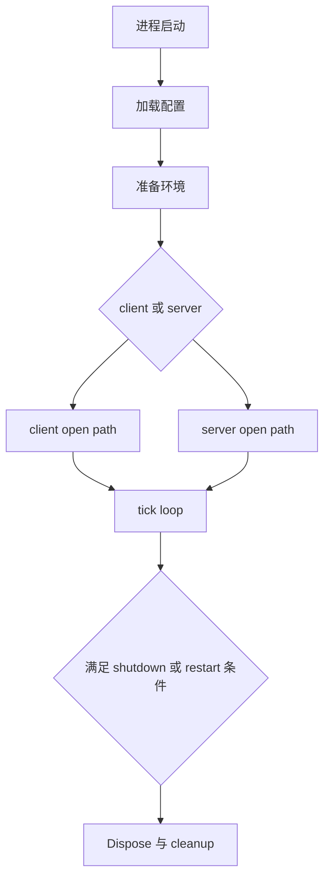
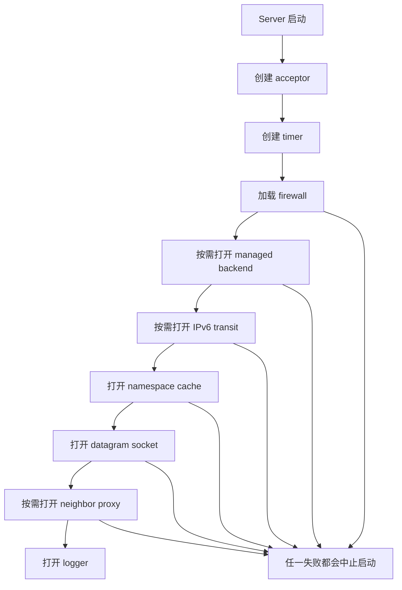
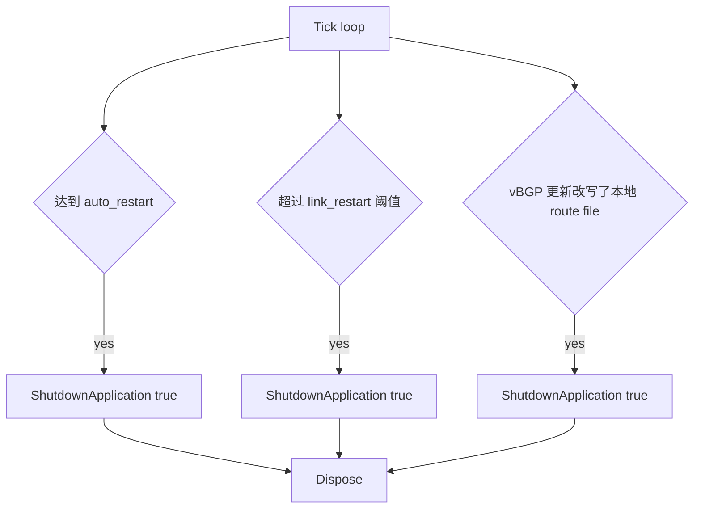
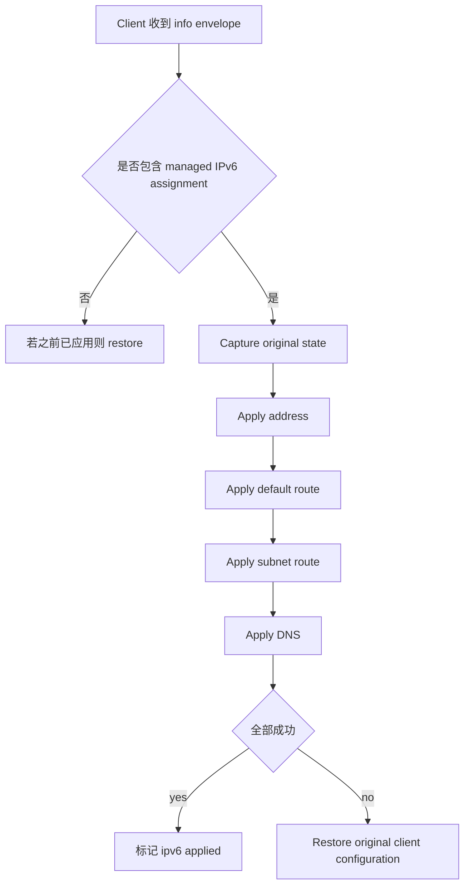

# 运维与排障

[English Version](OPERATIONS.md)

## 范围

本文解释 OPENPPP2 在已经构建并部署之后，运行时应当如何被观察、理解和排障。重点不是泛泛的“最佳实践”，而是基于源码解释：有哪些 runtime evidence、故障如何分类、重启与回滚如何发生、哪些代码路径对应哪些真实事故现象。

本文主要锚定这些实现入口：

- `main.cpp`
- `ppp/app/client/VEthernetNetworkSwitcher.cpp`
- `ppp/app/client/VEthernetExchanger.cpp`
- `ppp/app/server/VirtualEthernetSwitcher.cpp`
- `linux/ppp/ipv6/LINUX_IPv6Auxiliary.cpp`
- `go/ppp/ManagedServer.go`

## 第一条运维原则：把系统读成一组状态迁移

要运维 OPENPPP2，最有效的方法不是把它当成一个“黑盒 VPN 进程”，而是把它看成一组状态迁移。

在顶层，进程会经历：

- 配置加载
- 按角色准备本地环境
- 进入 client 或 server 打开路径
- 进入 steady-state tick loop
- 满足条件后重启或关闭
- 执行 cleanup 与 rollback

在 client 侧，最重要的状态是：

- connecting
- established
- reconnecting

在 server 侧，最重要的迁移是：

- accept socket
- 分类 transport
- handshake
- 进入 `Establish(...)` 或 `Connect(...)`
- 持续运行直到 teardown
- 删除 exchanger 或 connection 状态

如果用这种方式读事故，控制台输出和 runtime 行为会清晰很多。

## 构建验证不等于运行验证

运维工作开始于二进制已经成功构建之后，而不是之前。但构建仍然重要，因为平台特化行为是在编译期进入产物的。

Windows 运行时问题，应使用 Windows 构建产物来排查。

Linux 运行时问题，应使用 Linux 构建产物来排查。

Android 运行时问题，应通过 Android host app 与 NDK 产物来排查，而不能假设桌面 client 行为与其等价。

旧文档里那种一两条构建命令仍然有用，但它们本身不是运行时证据。

## 启动失败的分类

### 1. 角色逻辑尚未开始前就失败

最早的硬失败是权限。`main.cpp` 中的 `PppApplication::Main(...)` 若发现当前进程不是管理员或 root，会直接拒绝运行。

运维含义：

- 如果进程一启动就因权限退出，不要开始抓 tunnel 包
- 这不是网络问题，而是宿主执行模型错误

第二类早期硬失败是重复实例保护。`prevent_rerun_` 用角色与配置路径构造键，如果同一 role/config 已运行，再次启动会直接退出。

运维含义：

- 重复启动不是 harmless 行为
- 它被当成无效操作处理

第三类早期硬失败是配置发现。`LoadConfiguration(...)` 若找不到或加载不了可用配置文件，就不会继续进入 client/server 网络初始化。

### 2. Client 在本地环境准备阶段失败

在 `PreparedLoopbackEnvironment(...)` 中，client 路径可能在任何远程握手之前就失败。

常见失败点包括：

- `ITap::Create(...)` 失败
- `tap->Open()` 失败
- `VEthernetNetworkSwitcher` 无法实例化
- 最终 `ethernet->Open(tap)` 失败

运维含义：

- “客户端连不上服务端”有时是错误诊断
- 因为 client 可能根本没有成功把本地虚拟接口和本地路由环境带起来

### 3. Server 在 Open 阶段失败

server 的 `Open(...)` 是一条多阶段流水线，定义在 `VirtualEthernetSwitcher::Open(...)`。

失败可能发生在：

- `CreateAllAcceptors()`
- `CreateAlwaysTimeout()`
- `CreateFirewall(...)`
- `OpenManagedServerIfNeed()`
- `OpenIPv6TransitIfNeed()`
- `OpenNamespaceCacheIfNeed()`
- `OpenDatagramSocket()`
- `OpenIPv6NeighborProxyIfNeed()`

运维含义：

- “服务端没启动起来”往往不是一个模糊问题
- 很多时候它其实是某个特定平面失败了
- 一次启用太多可选平面，会显著提高排障歧义

## Tick Loop 是顶层运维心跳

`main.cpp` 中的 `PppApplication::OnTick(...)` 是整个程序最重要的周期性维护循环。它负责：

- 刷新控制台输出
- Windows 下优化进程 working set
- 检查 `auto_restart`
- 检查 client link state
- 检查 `link_restart`
- 触发 VIRR IP list 更新
- 触发 vBGP route input 更新

而 `NextTickAlwaysTimeout(...)` 会每秒重新挂一次 timer。

运维上这意味着：OPENPPP2 不是纯粹被动靠回调活着，它有一个明确的顶层 heartbeat。如果进程“还活着但行为像卡住了一样”，tick loop 是否还在正常执行，是非常重要的判断点。

## 重启行为是设计出来的，不是偶然现象

代码里存在几种明确的 restart path。

### Auto Restart

如果设置了 `GLOBAL_.auto_restart`，那么 `OnTick(...)` 在进程运行时长达到阈值后，会主动触发全进程 restart。

运维含义：

- 周期性重启可能是配置的生命周期策略，不一定是 crash

### Link Restart

如果 client 已处于 `NetworkState_Established`，且 `GetReconnectionCount()` 超过 `GLOBAL_.link_restart`，`OnTick(...)` 会让整个进程 restart。

运维含义：

- 持续的重连抖动可以被主动升级为进程级恢复，而不是只停留在链路级重连

### Route Source 变化导致的 Restart

vBGP 更新逻辑会在发现本地 route file 内容与新拉取结果不同后，把新文件写盘，再调用 `ShutdownApplication(true)`。

运维含义：

- 某些 route input 的变化，本来就会触发进程级重入

## Shutdown 与 Cleanup 行为

`PppApplication::Dispose()` 对运维非常重要，因为它定义了有序退出时会清理和回滚什么。

它会：

- Dispose server switcher
- 在 Windows 下恢复 QUIC 偏好
- 如果 client 曾设置 system HTTP proxy，则清理该 proxy
- Dispose client switcher
- 清理 tick timer

这会直接影响事故分析。如果运维人员用强杀方式结束进程，而不是让它有序退出，则某些宿主状态可能不会按预期回滚，尤其是 Windows 下的系统状态。

## Client 运行时运维

### 核心运行时信号

client 运行时的重心是 `VEthernetExchanger` 与 `VEthernetNetworkSwitcher`。

`VEthernetExchanger::Loopback(...)` 直接表达了 client 生命周期：

- 进入 connecting
- 打开 transmission
- 做 handshake
- 把 LAN 侧状态 echo 到远端
- 进入 established
- 发送 requested IPv6 configuration
- 注册 mappings
- 按需建立 static echo
- 运行直到链路中断
- 注销 mappings
- Dispose transmission
- 进入 reconnecting
- sleep reconnection timeout 后继续重试

运维含义：

- 一次 session drop 往往不是故事的终点
- exchanger 本来就是按 reconnect loop 设计的

### Keepalive 与会话活性

`VEthernetExchanger::Update()` 会定期投递 client maintenance 逻辑，执行：

- `SendEchoKeepAlivePacket(...)`
- `DoMuxEvents()`
- `DoKeepAlived(...)`
- datagram 与 mapping 更新

`DoKeepAlived(...)` 在 established 状态下若 keepalive 失败，会直接 dispose 当前 transmission。

运维含义：

- 某些“无明显报错的断链”实际上是 keepalive 失败触发的 disposal
- established 到 reconnecting 的切换，未必伴随夸张日志

### MUX 运维含义

`DoMuxEvents()` 只会在已 established 且启用 mux 时推进。它可能：

- 维持现有 `vmux_net`
- 发现 stale 后销毁并重建
- 创建新 mux 对象
- 在 Linux 下附着 protector
- 生成 VLAN 标识
- 为 mux 子链路创建额外 transmission

运维含义：

- MUX 故障通常是健康主会话之上的第二层平面故障
- 如果主会话本身不稳定，MUX 异常往往是继发症，而不是原发病

### Client IPv6 的 Apply 与 Rollback

`VEthernetNetworkSwitcher::OnInformation(...)` 与 `ApplyAssignedIPv6(...)` 定义了 client IPv6 的运维模型。

关键事实包括：

- IPv6 assignment 被视为 managed runtime state，而不是静态开机配置
- 如果 assignment 变化或被撤销，旧 assignment 会先 restore
- `ApplyAssignedIPv6(...)` 会先保存原始状态，再依次应用 address、default route、subnet route、DNS
- 任一步失败，都会调用 `RestoreClientConfiguration(...)` 回滚
- server 若撤回 assignment，client 也会主动 restore 旧状态

运维含义：

- IPv6 故障通常一半是 apply，一半是 rollback
- “地址看起来分到了”并不代表整个 IPv6 apply 链条成功

### Client Route 与 DNS 问题的运维含义

`VEthernetNetworkSwitcher::Open(...)`、`AddRoute()`、`DeleteRoute()`、`ProtectDefaultRoute()` 表明 client route 与 DNS 行为不是边角逻辑，而是 client bring-up 和 teardown 的核心组成部分。

运维含义：

- 若流量形态不对，应优先检查 route 与 DNS，而不是直接怀疑 transmission 或加密层
- 若进程异常终止，route/DNS rollback 可能与正常退出路径不同

## Server 运行时运维

### Listener 运维

`VirtualEthernetSwitcher::Run()` 会为所有 acceptor 启动 `AcceptLoopbackAsync`。acceptor 可能覆盖多个 category，包括普通入口和某些 CDN 类入口。

运维含义：

- 一个“部分健康”的 server 可能表现为某些 listener category 正常，而另一些已经失败或未启用

### 主会话建立与辅助连接的分流

`VirtualEthernetSwitcher::Run(context, transmission, y)` 在 handshake 之后，会把连接分成两类。

若 `mux == false`，则进入 `Connect(...)`，用于 relay、mux side link 等辅助连接。

若 `mux == true`，则进入 `Establish(...)`，建立或替换主 exchanger session。

运维含义：

- 并不是每一个 accepted connection 都代表一个新的主 VPN session
- 需要区分 primary-session 问题和 auxiliary-connection 问题

### Exchanger 替换行为

`AddNewExchanger(...)` 可以为同一个 session_id 替换旧 exchanger，并 dispose 旧实例。

运维含义：

- session replacement 是正常内建行为
- 老 session 消失、新 session 接管，不一定意味着错误

### Server Information 与会话有效性

在 `Establish(...)` 中，server 可能使用两种信息来源：

- managed backend 返回的信息
- 若未配置 backend 但启用了 IPv6，则使用 local bootstrap information

然后它会构造 information envelope，必要时先尝试安装 IPv6 data plane，再把 envelope 发给 client，校验信息对象有效性，最后才真正进入 channel run。

运维含义：

- 握手成功并不等于 session 已进入业务数据面
- backend 返回空、策略无效、IPv6 install 失败，都可能在进入 channel run 前终止会话

### Server IPv6 Transit 故障的含义

在 Linux 上，`OpenIPv6TransitIfNeed()` 是最敏感的 server 运维平面之一。

它可能失败，因为：

- 配了 IPv6 mode 但 CIDR 解析失败
- transit tap 创建失败
- transit tap 上的 IPv6 地址应用失败
- SSMT multiqueue 设置失败

随后 `ReceiveIPv6TransitPacket(...)` 还可能主动拒绝报文，因为：

- destination 不在配置 CIDR 内
- source 是 unspecified、multicast 或 loopback
- source 以不允许的方式落在 VPN prefix 内部
- destination 找不到对应 exchanger

运维含义：

- IPv6 故障既可能是 startup failure，也可能是 deliberate packet rejection
- 某些 IPv6 drop 其实是安全检查生效，而不是随机 malfunction

### Static Datagram Surface

`OpenDatagramSocket()` 会建立 static packet socket。这个平面坏掉时，普通 session transport 仍可能是健康的。

运维含义：

- static mode 故障应被单独归类，不能直接等价于“整个 server 挂了”

### Firewall 与 Namespace Cache

`CreateFirewall(...)` 与 `OpenNamespaceCacheIfNeed()` 又额外定义了两层运维平面：

- packet/port/domain 过滤
- server-side DNS namespace cache

若启用它们，它们会显著改变流量和 DNS 行为。

运维含义：

- 某些 packet drop 或 DNS 差异，其实来自 firewall 或 namespace cache，而不是 transport 不稳定

## 运行中与安全相关的主动拒绝

client 和 server 两侧都包含注释明确标记为 suspected malicious attack 的拒绝路径。

client 侧，某些不应从 server 方向打来的动作会直接返回 false 并导致连接清理。

server 侧，某些反方向控制动作也会被同样处理。

运维含义：

- 突然断链不一定是 keepalive 或网络丢包
- 有些是协议方向违规，被 runtime 视为 hostile/invalid traffic 后主动断开
- 此时应优先检查 peer compatibility、协议误用或流量损坏，而不是先假定是普通链路抖动

## Managed Backend 运维

Go managed backend 本身也有独立运行时生命周期。

`NewManagedServer()` 会：

- 加载配置
- 连接 Redis
- 连接 MySQL master/slave
- 构建 WebSocket server

`ListenAndServe()` 会：

- 加载所有 server 记录
- 加载所有 user 记录
- 启动周期性 tick goroutine
- 然后开始服务 WebSocket 与 HTTP 请求

运维含义：

- backend 启动失败可以发生在任何 C++ server 参与之前，比如配置、Redis、MySQL 出问题
- backend steady-state health 同时依赖网络服务与后台 archive/sync 行为

若 C++ server 开启了 managed mode，而 backend 已退化，则症状可能会体现在 session establish 阶段，而不是 transport accept 阶段。

## 证据采集策略

对于较严重的问题，最小证据包应包括：

- `ppp` 进程完整控制台输出
- 运行时使用的准确配置文件
- listener reachability 状态
- client 启动前后的 route table
- client 启动前后的 DNS 状态
- 若涉及 IPv6，则包括 IPv6 route、address、neighbor-proxy 状态
- 若流量异常，则抓取物理接口与虚拟接口两侧数据
- 若开启 managed mode，则采集 backend 日志及数据库/缓存可达性

这个项目里有很多“后面的失败是前面的环境前提没满足”这种链式问题，所以被过滤得太厉害的片段常常会误导判断。

## 推荐排障顺序

### 第 1 步：确认角色与配置

先确认：

- mode 正确
- config file 正确
- 权限正确
- 没有 duplicate-instance 冲突

### 第 2 步：确认本地 bring-up

client：

- 虚拟接口已创建
- 虚拟接口已打开
- route 与 DNS 输入已加载

server：

- acceptor 已创建
- 如使用 firewall，则文件已加载
- 如配置 managed backend，则 backend open path 已走通

### 第 3 步：确认 session bring-up

client：

- exchanger 已进入 established
- 没有持续 reconnect loop

server：

- handshake 已成功
- 连接已按预期进入 `Establish(...)` 或 `Connect(...)`

### 第 4 步：确认可选平面

只有在基础 session 健康之后，再去检查：

- mux
- mappings
- static path
- managed backend policy
- IPv6 transit

### 第 5 步：确认 cleanup 与 rollback

如果问题发生在 restart、crash 或 abnormal stop 之后，就要检查旧的 route、DNS、system proxy、IPv6 状态是否被正确恢复。

## 运维基线

为了让事故足够可理解，建议维持这些基线。

- 每个 role 保留一份 known-good config
- route list 与 DNS rule 输入纳入版本管理
- 对 route/DNS 所有权保持平台感知
- 可选平面采用分层上线，而不是一次全部启用
- 明确区分 transport failure、local host mutation failure、managed-policy failure

## 工程结论

OPENPPP2 的运维并不只是判断“隧道连没连上”。运行时内部有多个可以独立出问题的平面：

- host bring-up
- session establish
- keepalive 与 reconnect lifecycle
- route 与 DNS mutation
- managed IPv6 apply 与 rollback
- static datagram path
- mapping exposure path
- managed backend dependency

源码结构已经足够清晰，可以把这些平面分开思考。高质量运维也应该遵循同样的结构，而不是把所有问题都笼统叫做 VPN 故障。

## 相关文档

- [`DEPLOYMENT_CN.md`](DEPLOYMENT_CN.md)
- [`PLATFORMS_CN.md`](PLATFORMS_CN.md)
- [`CONFIGURATION_CN.md`](CONFIGURATION_CN.md)
- [`CLIENT_ARCHITECTURE_CN.md`](CLIENT_ARCHITECTURE_CN.md)
- [`SERVER_ARCHITECTURE_CN.md`](SERVER_ARCHITECTURE_CN.md)
- [`ROUTING_AND_DNS_CN.md`](ROUTING_AND_DNS_CN.md)
- [`MANAGEMENT_BACKEND_CN.md`](MANAGEMENT_BACKEND_CN.md)
