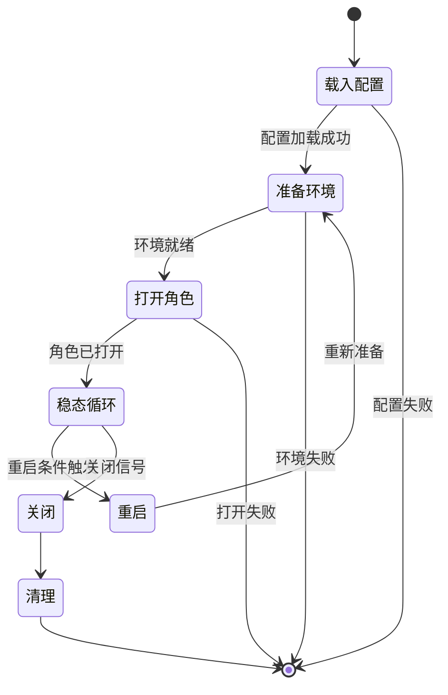
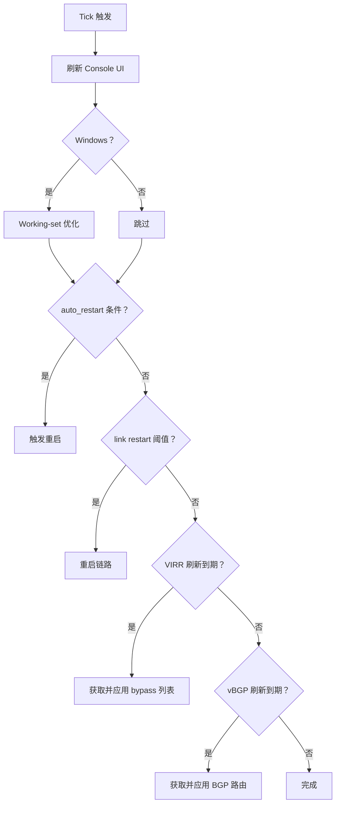
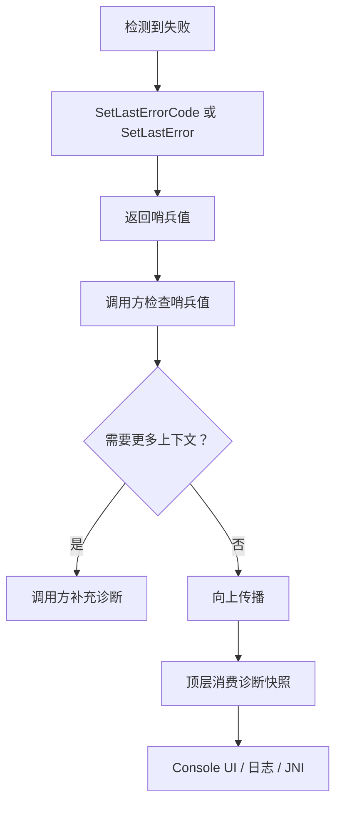
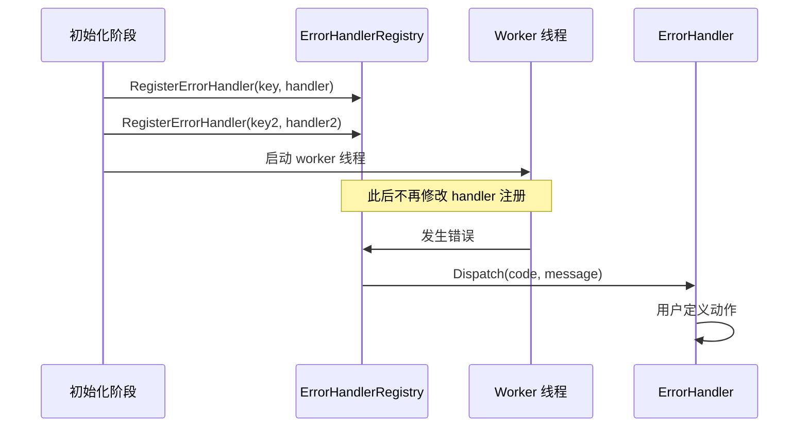
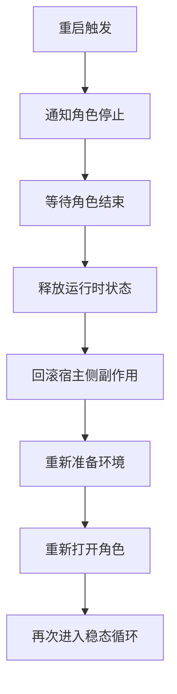
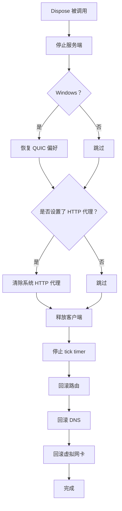
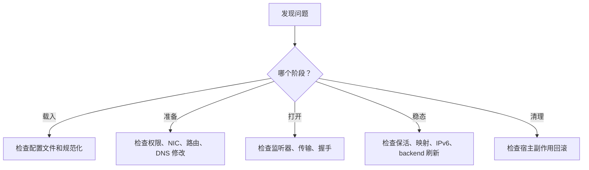
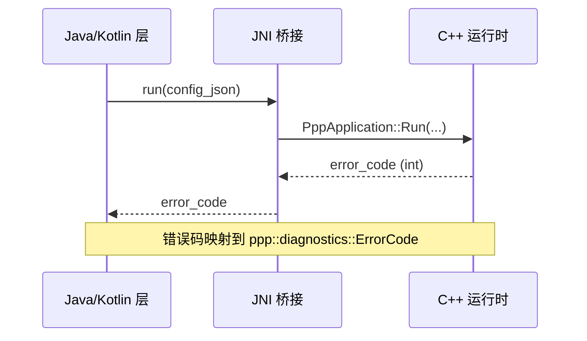

# 运维与故障排查

[English Version](OPERATIONS.md)

## 范围

本文解释 build 和 deployment 之后的运行行为，涵盖生命周期状态机、tick loop 维护、诊断系统、排障思路、重启行为和清理逻辑。

---

## 主要运行模型

把整个过程看成状态转换：



| 阶段 | 说明 |
|------|------|
| `载入配置` | 查找并解析 JSON 配置文件 |
| `准备环境` | 创建网卡、路由、监听器、DNS 设置 |
| `打开角色` | 打开客户端 exchanger 或服务端 switcher |
| `稳态循环` | 周期性维护：保活、刷新、重启检查 |
| `重启` | 拆除并重新打开角色 |
| `清理` | 回滚所有宿主侧副作用 |

---

## 启动失败类别

| 类别 | 原因 | 排查位置 |
|------|------|---------|
| 权限失败 | 未以管理员/root 运行 | `PppApplication::Run` 中的 OS 权限检查 |
| 重复实例 | 已有另一个 ppp 进程运行 | 实例锁机制 |
| 找不到配置 | 路径错误、文件缺失 | `LoadConfiguration(...)` 搜索顺序 |
| 配置解析错误 | JSON 语法或 schema 无效 | `AppConfiguration` 规范化 |
| 环境准备失败 | NIC、路由、DNS 设置失败 | `PrepareEnvironment(...)` 调用链 |
| 角色打开失败 | 服务端或客户端 open sequence 失败 | `OpenServer(...)` / `OpenClient(...)` |

---

## Tick Loop

`PppApplication::OnTick(...)` 是主要的运维心跳。



### Tick Loop 职责

| 职责 | 说明 | 来源 |
|------|------|------|
| Console 刷新 | 更新 TUI 显示 | `ConsoleUI::Refresh()` |
| Working-set 压缩 | Windows 内存优化 | 平台特定 |
| Auto restart | 配置驱动的自动重启 | `PppApplication::OnTick` |
| Link restart | 超过阈值时重连 | Exchanger 保活失败 |
| VIRR 刷新 | 从 URL 获取 bypass IP 列表 | `virr.update-interval` |
| vBGP 刷新 | 从 URL 获取 BGP 路由 | `vbgp.update-interval` |

---

## 诊断覆盖与错误传播策略

运维与排障遵循统一诊断契约：



### 规则

- 启动、环境准备、打开路径、回滚路径中的失败分支，在返回失败哨兵值前必须调用 `SetLastErrorCode(...)` 或 `SetLastError(...)`。
- 仅返回 `false`、`-1` 或 `NULLPTR` 但不设置诊断，视为传播不完整，会降低可观测性。
- 面向用户的运维界面（Console UI、JNI 返回路径）应消费统一诊断快照。

### 诊断 API

```cpp
/**
 * @brief 为当前诊断上下文设置最后一个错误码。
 * @param code  要记录的错误码。
 */
void SetLastErrorCode(ppp::diagnostics::ErrorCode code) noexcept;

/**
 * @brief 为当前诊断上下文设置自由格式的错误消息。
 * @param message  错误消息字符串。
 */
void SetLastError(const ppp::string& message) noexcept;

/**
 * @brief 获取最后记录的错误码。
 * @return  最近设置的错误码。
 */
ppp::diagnostics::ErrorCode GetLastErrorCode() noexcept;

/**
 * @brief 获取最后记录的错误消息。
 * @return  最近设置的错误消息。
 */
ppp::string GetLastError() noexcept;
```

源文件：`ppp/diagnostics/Error.h`

---

## 错误处理器注册

错误处理器注册已是 key-based，并有启动期线程安全边界：



### 注册规则

- 仅在初始化阶段完成 handler 的注册、替换和卸载。
- 多线程运行期不要并发修改注册表。
- 这样可以保证 worker 活跃期间回调拓扑可预测。

```cpp
/**
 * @brief 为指定 key 注册错误处理器。
 * @param key      注册键（用于替换/卸载）。
 * @param handler  错误被派发时调用的回调。
 */
void RegisterErrorHandler(const ppp::string& key, ErrorHandlerCallback handler) noexcept;

/**
 * @brief 卸载已注册的错误处理器。
 * @param key  注册时使用的键。
 */
void UnregisterErrorHandler(const ppp::string& key) noexcept;
```

源文件：`ppp/diagnostics/ErrorHandler.h`

---

## 重启行为

重启可以是刻意的，也可以是自动的。

### 重启触发条件

| 触发条件 | 来源 | 说明 |
|---------|------|------|
| `auto_restart` | 配置 + tick | 按计划或条件自动重启 |
| 保活失败 | Exchanger | 客户端或服务端保活超时 → 重连 |
| VIRR 路由更新 | Tick loop | 路由来源刷新可能触发重新应用 |
| 手动信号 | OS 信号 | SIGTERM 或等效信号 |



### 重启 vs 完全关闭

| 条件 | 动作 |
|------|------|
| `auto_restart` | 重新准备 + 重新打开 |
| 链路重连 | 仅重连 exchanger |
| 路由刷新 | 重新应用路由；可能不重启角色 |
| SIGTERM | 完整清理 + 退出 |

---

## 清理与回滚

`PppApplication::Dispose()` 是标准的清理路径。



### 必须回滚的宿主侧副作用

| 宿主侧副作用 | 必须回滚？ |
|------------|---------|
| 虚拟网卡 | 是 |
| 已添加的路由 | 是 |
| DNS 服务器变更 | 是 |
| 系统 HTTP 代理 | 是（如果由 ppp 设置） |
| Windows QUIC 偏好 | 是（仅 Windows） |
| 防火墙规则 | 是（如果由 ppp 设置） |

---

## 运维检查清单

| 步骤 | 检查内容 |
|------|---------|
| 1 | 确认管理员/root 权限已激活 |
| 2 | 确认配置发现路径和文件有效性 |
| 3 | 确认宿主 NIC 和 gateway 可用 |
| 4 | 确认监听器端口未被占用（服务端） |
| 5 | 确认 DNS 和路由变更成功 |
| 6 | 确认可选 backend 可达 |
| 7 | 观察 tick loop 是否触发意外重启 |
| 8 | 确认清理时所有宿主侧副作用已回滚 |

---

## 按阶段排障

排查运行时行为最快的方法，是先按阶段分类失败：



### 各阶段排障指引

| 阶段 | 典型症状 | 排查方式 |
|------|---------|---------|
| `载入` | "configuration not found" 或解析错误 | 检查文件路径、JSON 有效性、schema 规范化 |
| `准备` | NIC 未创建、路由添加失败 | 检查权限级别、驱动可用性、路由冲突 |
| `打开` | 监听器绑定失败、握手超时 | 检查端口可用性、传输配置、服务端可达性 |
| `稳态` | 会话意外断开、保活失败 | 检查保活间隔配置、网络稳定性、backend 连接 |
| `清理` | 退出后路由或 DNS 未恢复 | 检查 Dispose() 调用路径、强制退出条件 |

---

## Android 运行时说明

Android 桥接错误整数与核心诊断应保持语义同步：



- JNI 可见错误码应在可行处映射到核心诊断。
- `run/stop/release` 过程应在 native 与 managed 边界维持一致错误语义。
- Android bridge 错误应纳入同一诊断链路，不作为独立排障体系。

---

## 常见运行时故障模式

| 症状 | 可能原因 | 解决方式 |
|------|---------|---------|
| 启动时立即退出 | 权限检查失败 | 以管理员/root 运行 |
| 启动时"duplicate instance" | 另一个 ppp 正在运行 | 停止现有实例 |
| 路由未应用 | 路由添加失败 | 检查权限和现有路由 |
| 隧道内 DNS 不工作 | DNS bypass 路由缺失 | 检查 `AddRouteWithDnsServers()` |
| 会话每 N 分钟断开 | 保活间隔过短 | 增大 `keepalive.interval` |
| Backend 认证失败 | 凭证错误或 URL 错误 | 验证 `server.backend` URL 和密钥 |
| IPv6 不工作 | IPv6 transit plane 未打开 | 检查 `server.ipv6` 配置和 NIC 支持 |
| 退出后路由未恢复 | 强制杀进程绕过了 Dispose | 使用优雅关闭信号 |
| Windows QUIC 偏好保留 | Dispose() 未完整执行 | 检查进程退出路径 |
| Tick loop CPU 高 | VIRR/vBGP 刷新间隔过短 | 增大刷新间隔 |

---

## 诊断收集方式

OPENPPP2 默认不使用文件日志。诊断状态通过以下方式获取：

| 界面 | 访问方式 |
|------|---------|
| Console UI | 每次 tick 更新 TUI 显示 |
| JNI 错误码 | Android 桥接返回值 |
| `GetLastError()` / `GetLastErrorCode()` | 运行时诊断查询 |
| 错误处理器回调 | 启动时注册 handler |

对于长期运行的服务端部署，建议用进程管理器（systemd、supervisord 等）封装，以捕获 stdout/stderr 输出。

---

## Linux 服务端 systemd 配置示例

```ini
[Unit]
Description=OPENPPP2 Server
After=network.target

[Service]
Type=simple
ExecStart=/opt/openppp2/ppp --config=/etc/openppp2/appsettings.json
Restart=on-failure
RestartSec=5
User=root

[Install]
WantedBy=multi-user.target
```

安装并启用：

```bash
cp openppp2-server.service /etc/systemd/system/
systemctl daemon-reload
systemctl enable openppp2-server
systemctl start openppp2-server
systemctl status openppp2-server
```

---

## Windows 服务安装示例

在 Windows 上，可使用内置 `sc` 命令或 NSSM（Non-Sucking Service Manager）：

```bat
nssm install openppp2 "C:\openppp2\ppp.exe"
nssm set openppp2 AppParameters "--config=C:\openppp2\appsettings.json"
nssm set openppp2 Start SERVICE_AUTO_START
nssm start openppp2
```

---

## 诊断优先级

先看是否是 host-side failure，再看是否是 runtime failure，最后再看是否是 data-plane failure。

这通常能更快定位问题，因为很多表面上的"网络问题"其实是权限、路由或 DNS 准备阶段的问题。

---

## 错误码参考

运维相关的 `ppp::diagnostics::ErrorCode` 值：

| ErrorCode | 说明 |
|-----------|------|
| `PrivilegeRequired` | 进程需要管理员/root 权限 |
| `DuplicateInstanceDetected` | 已有另一个 ppp 实例运行 |
| `ConfigurationNotFound` | 找不到配置文件 |
| `ConfigurationLoadFailed` | 配置文件解析或规范化失败 |
| `AdapterOpenFailed` | 虚拟 NIC 打开失败 |
| `RouteAddFailed` | 向 OS 路由表添加路由失败 |
| `RouteDeleteFailed` | 从 OS 路由表删除路由失败 |
| `DnsConfigFailed` | DNS 配置失败 |
| `ServerListenerOpenFailed` | 监听器绑定失败 |
| `HandshakeFailed` | 客户端-服务端握手失败 |
| `KeepaliveTimeout` | 保活 echo 未在规定时间内确认 |
| `ManagedServerConnectionFailed` | Go backend 连接失败 |
| `AutoRestartTriggered` | 触发了 auto-restart 条件 |

---

## 相关文档

- [`STARTUP_AND_LIFECYCLE_CN.md`](STARTUP_AND_LIFECYCLE_CN.md)
- [`DEPLOYMENT_CN.md`](DEPLOYMENT_CN.md)
- [`PLATFORMS_CN.md`](PLATFORMS_CN.md)
- [`ERROR_HANDLING_API_CN.md`](ERROR_HANDLING_API_CN.md)
- [`DIAGNOSTICS_ERROR_SYSTEM_CN.md`](DIAGNOSTICS_ERROR_SYSTEM_CN.md)
- [`ERROR_CODES_CN.md`](ERROR_CODES_CN.md)
- [`CONFIGURATION_CN.md`](CONFIGURATION_CN.md)

---

## 主结论

OPENPPP2 的运维本质上是状态转换加宿主副作用。只有当配置、环境准备、角色打开、tick 维护和清理都作为一个生命周期协同工作时，进程才算健康。每次失败都必须在返回前设置诊断；排障时必须独立分析每个阶段。
