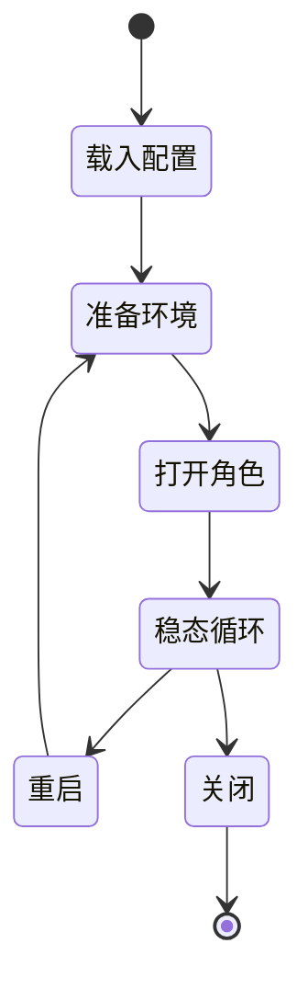
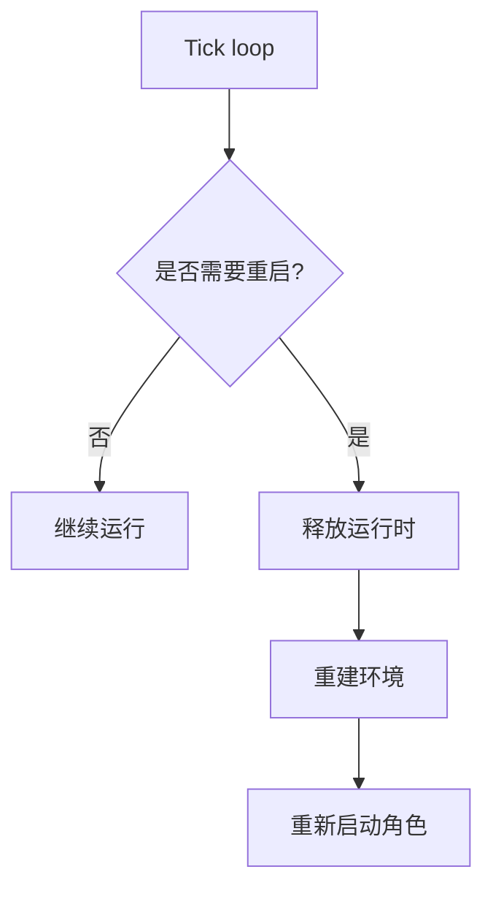

# 运维与故障排查

[English Version](OPERATIONS.md)

## 范围

本文解释 build 和 deployment 之后的运行行为。

## 主要运行模型

把整个过程看成状态转换：

- 配置加载。
- 环境准备。
- client 或 server 的 open sequence。
- 稳态 tick loop。
- 可选重启或关闭。
- 清理和回滚。

## 启动失败类别

- 权限失败。
- 重复实例失败。
- 配置发现 / 载入失败。
- 客户端本地环境准备失败。
- 服务端 open sequence 失败。

## Tick Loop

`PppApplication::OnTick(...)` 是主要的运维心跳。它负责：

- console 刷新。
- Windows working-set 优化。
- auto restart。
- link restart。
- VIRR 刷新。
- vBGP 刷新。

这部分就是把运行时状态转成周期性维护行为的地方。

## 重启行为

重启可以是刻意的。可能由以下原因触发：

- `auto_restart`。
- 连接恢复阈值。
- route-source 更新，导致 route 文件被重写。

## 清理

`PppApplication::Dispose()` 会释放 server、恢复 Windows QUIC 偏好、必要时清除系统 HTTP proxy、释放 client，并停止 tick timer。

清理不只是关闭，而是宿主侧副作用的回滚。

## 运维检查清单

1. 检查权限。
2. 检查配置发现路径。
3. 检查宿主 NIC 和 gateway。
4. 检查监听器可用性。
5. 检查 DNS 和路由变更是否成功。
6. 观察 tick loop 是否触发重启条件。

## 排障思路

排查运行时行为最快的方法，是先按阶段分类失败：

| 阶段 | 常见问题 |
|---|---|
| 载入 | 配置是否正确加载并规范化？ |
| 准备 | 宿主环境是否可写？ |
| 打开 | 角色是否完成打开？ |
| 稳态 | tick 驱动维护是否出错？ |
| 清理 | 宿主副作用是否已回滚？ |

## 诊断优先级

先看是否是 host-side failure，再看是否是 runtime failure，最后再看是否是 data-plane failure。

这通常能更快定位问题，因为很多表面上的“网络问题”其实是权限、路由或 DNS 准备阶段的问题。

## 相关文档

- `STARTUP_AND_LIFECYCLE_CN.md`
- `DEPLOYMENT_CN.md`
- `PLATFORMS_CN.md`

## 主结论

OPENPPP2 的运维本质上是状态转换加宿主副作用。只有当配置、环境准备、角色打开、tick 维护和清理都作为一个生命周期协同工作时，进程才算健康。
