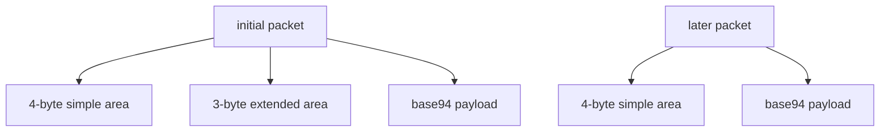
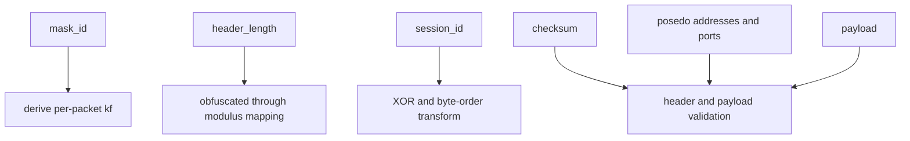
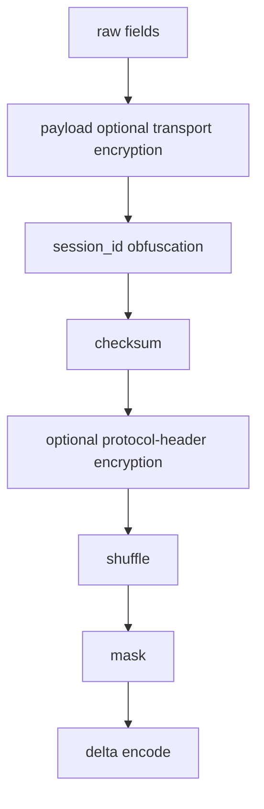

# Packet Formats And On-Wire Layout Interpretation

[中文版本](PACKET_FORMATS_CN.md)

## Scope

This document explains the packet-format behavior visible in:

- `ppp/transmissions/ITransmission.cpp`
- `ppp/app/protocol/VirtualEthernetPacket.cpp`

It focuses on two major families:

- normal transmission framing used by `ITransmission`
- static packet framing used by `VirtualEthernetPacket`

## Why Packet Formats Matter In This Project

In OPENPPP2, packet format is part of the security and operational design. The format is not just a serialization detail. It influences:

- how obvious metadata appears on the wire
- how early traffic differs from later traffic
- how much structure validation the receiver can perform
- how static mode differs from normal stream-like protected transmission

## Normal Transmission Packet Family

The normal transmission family splits into:

- base94 format for pre-handshake or plaintext behavior
- binary protected format for normal post-handshake behavior

## Base94 Packet Layout

The base94 family has two subforms.

### Initial extended-header form

It consists of:

- 4-byte simple header area
- 3-byte extended validation area
- base94-encoded payload body

### Later simple-header form

It consists of:

- 4-byte simple header area
- base94-encoded payload body

The state transition is controlled by `frame_tn_` and `frame_rn_`.



## Meaning Of The Base94 Header

The base94 header includes:

- random key byte
- filler byte
- base94 digits representing a transformed payload length
- in the first packet, an extra 3-byte transformed validation field

The payload length is not written directly. It is mapped through the transmission modulus and the current packet key factor.

## Binary Protected Packet Layout

The normal post-handshake binary packet consists conceptually of:

- protected 3-byte header
- transformed payload body

The protected header itself contains:

- one seed byte
- two protected payload-length bytes

Those bytes are then delta-encoded into the actual transmitted 3-byte header record.

The payload section may have gone through:

- transport cipher encryption
- masking
- shuffling
- delta encoding

depending on state and configuration.

## Binary Header Interpretation

The inbound reader does not simply read a length. It performs:

1. delta decode on the 3-byte header
2. derive `header_kf` from the first byte
3. unshuffle the two length bytes
4. XOR-unmask the two length bytes
5. protocol-cipher decrypt them if configured
6. reconstruct the original payload length

This is why the length is better understood as a protected metadata field, not a raw prefix.

## Static Packet Format

The static packet format is implemented through `PACKET_HEADER` in `VirtualEthernetPacket.cpp`.

The logical fields are:

- `mask_id`
- `header_length`
- `session_id`
- `checksum`
- pseudo source IP
- pseudo source port
- pseudo destination IP
- pseudo destination port
- payload body

## Static Header Layout Interpretation

`PACKET_HEADER` is packed and contains a small fixed logical structure, but the transmitted interpretation is more complex.



## `mask_id`

`mask_id` is generated randomly and must be non-zero.

Its role is important because it drives the per-packet factor:

```text
kf = random_next(configuration->key.kf * mask_id)
```

This means the static format has a packet-local dynamic factor even when the surrounding connection uses the same broader session configuration.

## `header_length`

`header_length` is not stored as the naked literal logical header size. It is mapped using:

- the static modulus from `Lcgmod(LCGMOD_TYPE_STATIC)`
- the per-packet `kf`

That means the receiver must reverse the mapping before it knows the actual effective header size.

## `session_id`

The sign of `session_id` encodes the payload family.

- positive means UDP payload semantics
- negative means IP payload semantics

For IP payloads, the packer uses `~session_id` before storing it, and the unpacker reverses that by checking sign and applying bitwise inversion.

This is a compact field-reuse trick that lets one field communicate both identity and protocol class.

## `checksum`

Checksum covers header and payload after the relevant pack-time transformations in the local packet buffer. On unpack, the code temporarily zeroes the stored checksum, recomputes the checksum across the packet, restores the original field, and compares.

This is one of the key structural integrity checks in the static format.

## `posedo` Address And Port Fields

The pseudo address fields are used to carry source and destination endpoint information for the virtual packet semantics. For UDP payloads, the unpacker validates that source and destination addresses and ports make sense.

That means the static packet format is not only an opaque carrier blob. It is a structured network packet envelope.

## Static Pack Path

The pack path does the following in order.

1. validate input
2. resolve session ciphertext objects from the session identity
3. optionally encrypt the payload with transport cipher
4. allocate header plus payload buffer
5. fill raw fields
6. generate non-zero `mask_id`
7. derive per-packet `kf`
8. obfuscate `header_length`
9. obfuscate `session_id`
10. compute checksum
11. optionally encrypt the trailing header body with protocol cipher
12. shuffle the `session_id` and following bytes
13. mask the `session_id` and following bytes
14. delta-encode the final packet



## Static Unpack Path

The unpack path reverses the transform order.

1. delta decode the packet
2. check that `mask_id` is non-zero
3. derive per-packet `kf`
4. reverse `header_length` mapping
5. reverse masking from `session_id` onward
6. reverse shuffling from `session_id` onward
7. recover logical `session_id` and protocol class
8. optionally decrypt the trailing header body with protocol cipher
9. validate checksum
10. optionally decrypt payload with transport cipher
11. populate the `VirtualEthernetPacket` object

That ordering is essential. If read in the wrong order, the packet will not validate.

## Dynamic Header-Length Behavior In Static Mode

One of the most important implementation details is that protocol-cipher encryption of the trailing header body may change the length of that region. The code explicitly handles this possibility by rebuilding the packet buffer if the encrypted or decrypted header-body length differs from the raw size.

This tells us two things.

- the static packet path is not hard-coded to assume fixed ciphertext expansion semantics
- `header_length` must be treated as a living format field, not a decorative constant

## Session-Ciphertext Derivation For Static Packets

`VirtualEthernetPacket::Ciphertext(...)` derives protocol and transport ciphers for static packets using a string built from:

- `guid`
- `fsid`
- `id`

The resulting derivation string is appended to the configured base keys.

That means static packet protection is also session-shaped and identity-shaped, not globally identical across every packet in the whole runtime.

## Packet Families Carried By Static Format

The static format can carry at least two major families.

### UDP family

- `session_id > 0`
- source and destination address and port validation applies

### IP family

- stored as negative form through bitwise inversion trick
- unpacker recognizes this and treats payload as IP payload semantics

This is a compact but important on-wire distinction.

## Why These Formats Are Not Trivial Metadata Containers

Neither the normal transmission packet family nor the static packet family should be described as “header plus encrypted payload” without further detail.

In both cases the code is also protecting or disturbing metadata through:

- dynamic key factors
- length mapping
- header-body encryption
- masking
- shuffling
- delta encoding
- state transitions between early and later packet forms

That is why packet-format documentation is central to understanding the project.

## Related Documents

- [`TRANSMISSION.md`](TRANSMISSION.md)
- [`HANDSHAKE_SEQUENCE.md`](HANDSHAKE_SEQUENCE.md)
- [`SECURITY.md`](SECURITY.md)
