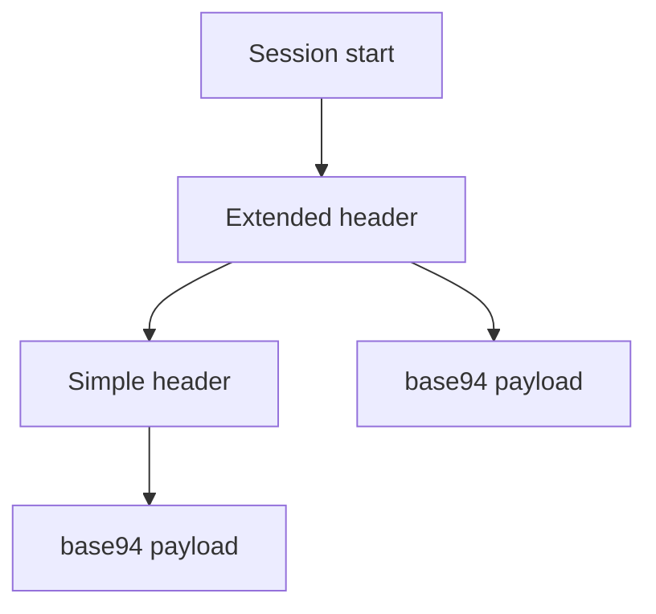
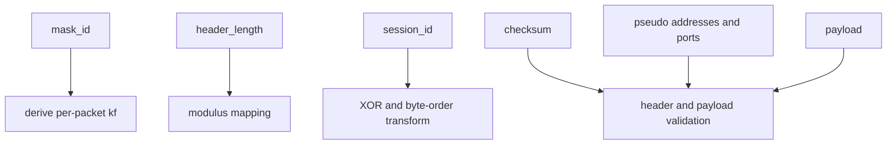
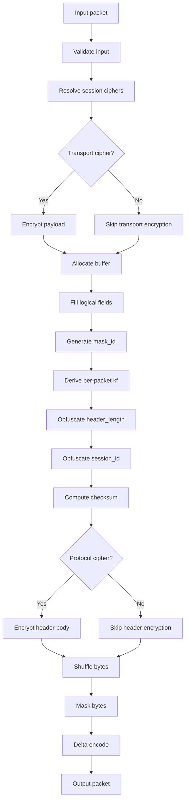

# Packet Formats And On-Wire Layout Interpretation

[中文版本](PACKET_FORMATS_CN.md)

## Scope

This document explains the packet-format behavior visible in `ppp/transmissions/ITransmission.cpp` and `ppp/app/protocol/VirtualEthernetPacket.cpp`.

The main packet families are:

- normal transmission packets
- static packet format packets

## Why Packet Format Matters

Packet format is part of the security model, not just serialization.

It determines:

- how much metadata is exposed on the wire
- whether early traffic and later traffic look structurally similar
- how much validation the receiver can perform
- how static mode differs from normal protected transmission

## Normal Transmission Family

The normal family has two subforms:

- base94 pre-handshake or plaintext-compatible form
- binary protected post-handshake form

The transition happens during handshake lifecycle.

## Base94 Packet Layout

The base94 family has two shapes.

### Initial Extended-Header Form

- 4-byte simple header area
- 3-byte extended validation area
- base94 payload body

### Later Simple-Header Form

- 4-byte simple header area
- base94 payload body

The transition is controlled by `frame_tn_` and `frame_rn_`.



## Base94 Header Meaning

The base94 header includes:

- random key byte
- filler byte
- transformed payload length encoded as base94 digits
- in the first packet, an additional 3-byte validation field

The length is not written directly. It is mapped through the transmission modulus and current packet key factor.

## Binary Protected Layout

The post-handshake binary packet conceptually consists of:

- a protected 3-byte header
- a transformed payload body

The header contains:

- one seed byte
- two protected payload-length bytes

Those bytes are then delta-encoded into the actual transmitted header record.

The payload may also undergo:

- transport cipher encryption
- masking
- shuffling
- delta encoding

## Binary Header Interpretation

The receiver does not simply read a raw length prefix.

It reverses the transforms in order:

1. delta decode the 3-byte header
2. derive `header_kf` from the seed byte
3. unshuffle the two length bytes
4. XOR-unmask them
5. decrypt them if protocol cipher is configured
6. reconstruct the original payload length

That is why the length field is better described as protected metadata.

## Static Packet Format

Static packets are implemented through `PACKET_HEADER` in `VirtualEthernetPacket.cpp`.

The logical fields are:

- `mask_id`
- `header_length`
- `session_id`
- `checksum`
- pseudo source IP and port
- pseudo destination IP and port
- payload body

## Static Header Meaning

Although `PACKET_HEADER` is compact, its on-wire meaning is richer than a fixed header.



## `mask_id`

`mask_id` is randomly generated and must be non-zero.

It drives a packet-local factor:

```text
kf = random_next(configuration->key.kf * mask_id)
```

That means each static packet has its own local dynamic factor.

## `header_length`

`header_length` is not stored as a naked literal. It is transformed using:

- the static modulus from `Lcgmod(LCGMOD_TYPE_STATIC)`
- the per-packet `kf`

The receiver must reverse that mapping before it knows the actual logical header size.

## `session_id`

The sign of `session_id` carries the packet family:

- positive means UDP semantics
- negative means IP semantics

For IP packets, the packer stores `~session_id`, and the unpacker reverses that by checking the sign.

## `checksum`

The checksum covers header and payload after the pack-time transforms in the local packet buffer.

On unpack, the code temporarily clears the checksum field, recomputes the checksum, and compares it against the stored value.

## Pseudo Address And Port Fields

These fields carry source and destination endpoint semantics for the virtual packet.

For UDP packets, the unpacker validates that the pseudo addresses and ports make sense for UDP semantics.

## Static Pack Path

Pack path order:

1. validate input
2. resolve session ciphers
3. optionally encrypt payload with transport cipher
4. allocate header plus payload buffer
5. fill logical fields
6. generate non-zero `mask_id`
7. derive per-packet `kf`
8. obfuscate `header_length`
9. obfuscate `session_id`
10. compute checksum
11. optionally encrypt trailing header body with protocol cipher
12. shuffle bytes from `session_id` onward
13. mask bytes from `session_id` onward
14. delta-encode the final packet



## Static Unpack Path

Unpack reverses the order exactly.

1. delta decode
2. check `mask_id != 0`
3. derive per-packet `kf`
4. reverse `header_length` mapping
5. unmask from `session_id` onward
6. unshuffle from `session_id` onward
7. recover logical `session_id` and family
8. optionally decrypt trailing header body with protocol cipher
9. validate checksum
10. optionally decrypt payload with transport cipher
11. populate `VirtualEthernetPacket`

If the order is wrong, the packet fails structural validation.

## Dynamic Header-Length Behavior

If protocol-cipher encryption of the trailing header body changes the size of that region, the code rebuilds the packet buffer and updates `header_length`.

That means the format is not hard-coded to assume ciphertext expansion is always fixed.

## Session-Cipher Derivation For Static Packets

`VirtualEthernetPacket::Ciphertext(...)` derives cipher state from a string built from:

- `guid`
- `fsid`
- `id`

The result is appended to the configured base keys. Static packet protection is therefore session-shaped and identity-shaped.

## Families Carried By Static Format

### UDP Family

- `session_id > 0`
- source and destination address and port validation applies

### IP Family

- `session_id < 0`
- IP payload handling applies
- `session_id` is logically treated as a signed family selector

## Practical Reading Rule

The packet format should always be read together with the transform chain that produces it. A header field only makes sense when you know which part of the pipeline touched it last.
