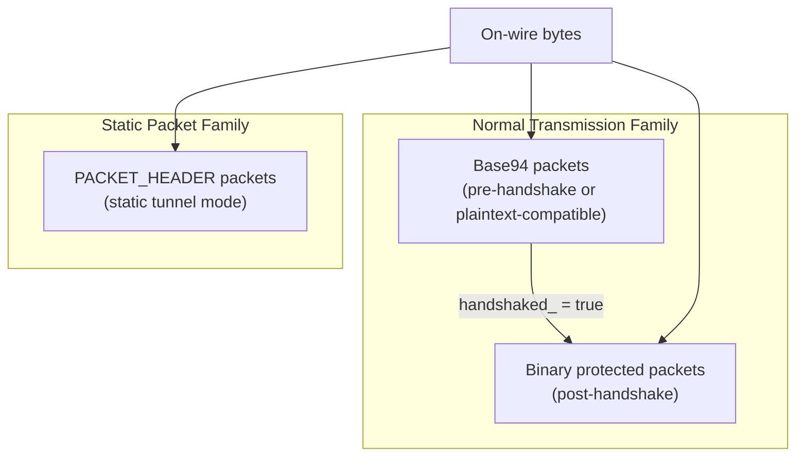
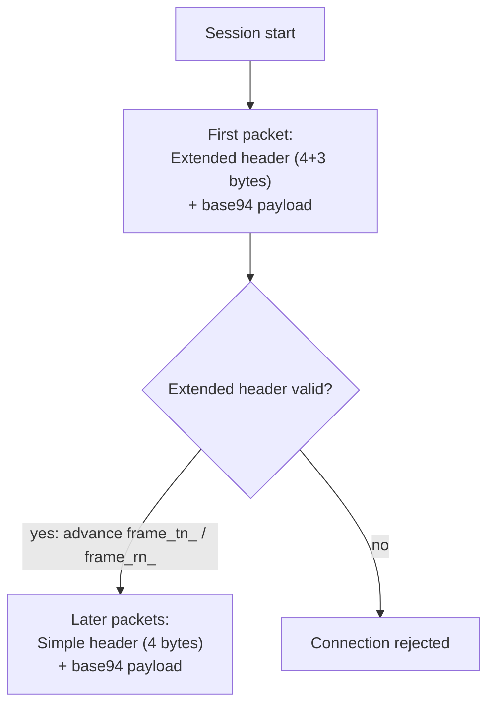
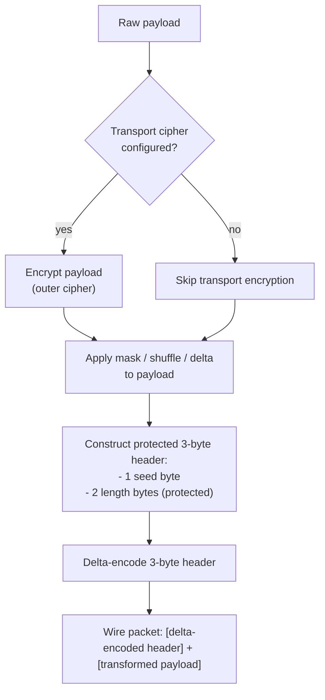
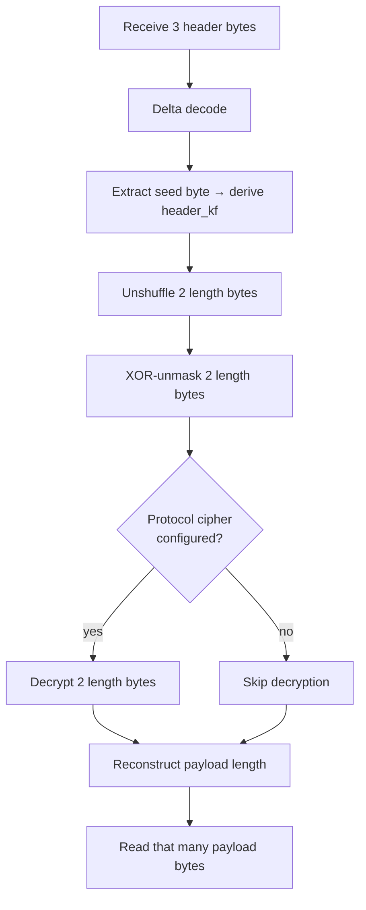
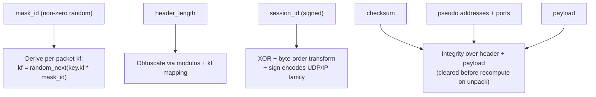
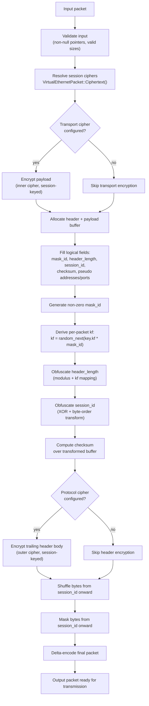
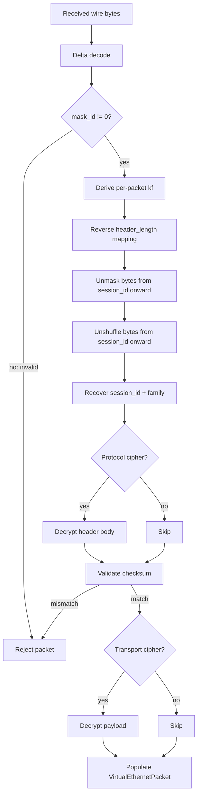
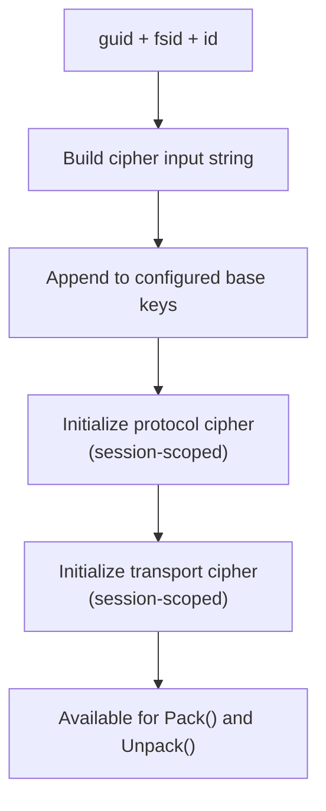

# Packet Formats And On-Wire Layout Interpretation

[中文版本](PACKET_FORMATS_CN.md)

## Scope

This document explains the packet-format behavior visible in
`ppp/transmissions/ITransmission.cpp` and `ppp/app/protocol/VirtualEthernetPacket.cpp`.

The main packet families are:

- normal transmission packets (base94 and binary protected)
- static packet format packets (`PACKET_HEADER`)

Packet format is part of the security model, not just serialization. It determines how
much metadata is exposed on the wire, whether early traffic and later traffic look
structurally similar, how much validation the receiver can perform, and how static mode
differs from normal protected transmission.

---

## Overview of Packet Families



---

## Normal Transmission Family

The normal family has two subforms:

- **base94 pre-handshake or plaintext-compatible form** — used before handshake
  completes, or when the configuration selects plaintext-compatible mode
- **binary protected post-handshake form** — used after `handshaked_` becomes true

The transition happens during the handshake lifecycle (see `HANDSHAKE_SEQUENCE.md`).

### Base94 Packet Layout

The base94 family has two shapes controlled by `frame_tn_` (transmit) and `frame_rn_`
(receive):

#### Initial Extended-Header Form

- 4-byte simple header area
- 3-byte extended validation area
- base94 payload body

The extended header exists to establish a structural validation point for the first
packet. It carries an additional 3-byte validation field that the simple header omits,
making the first packet heavier but providing parsing stability.

#### Later Simple-Header Form

- 4-byte simple header area
- base94 payload body

After the extended-header exchange succeeds, `frame_tn_` and `frame_rn_` advance and
subsequent packets use only the simple header.



### Base94 Header Meaning

The base94 header includes:

| Field | Content | Note |
|-------|---------|------|
| Random key byte | `[0x00, 0xFF]` | Drives the per-packet key factor |
| Filler byte | random | Header obfuscation |
| base94 length digits | encoded length | NOT a raw integer; mapped through modulus and kf |
| 3-byte validation field | extended header only | Structural validation for first packet |

The length is not written directly. It is mapped through the transmission modulus and
the current packet key factor (`kf`). The receiver must know the modulus and reverse the
mapping to recover the actual payload length.

### Binary Protected Layout

The post-handshake binary packet conceptually consists of:

- a protected 3-byte header
- a transformed payload body



The 3-byte header contains:

- **one seed byte** — used to derive the per-packet header key factor (`header_kf`)
- **two protected payload-length bytes** — NOT stored as raw values

Those three bytes are then delta-encoded into the actual transmitted header record.

The payload may also undergo (in sequence): transport cipher encryption, masking,
shuffling, and delta encoding. Which transforms are active depends on state and
configuration.

### Binary Header Interpretation

The receiver does not simply read a raw length prefix. It reverses the transforms in
order:

1. delta decode the 3-byte header
2. derive `header_kf` from the seed byte
3. unshuffle the two length bytes
4. XOR-unmask the two length bytes
5. decrypt them if protocol cipher is configured
6. reconstruct the original payload length

The length field is therefore better described as **protected metadata** rather than a
naive length prefix.



---

## Static Packet Format

Static packets are implemented through `PACKET_HEADER` in
`ppp/app/protocol/VirtualEthernetPacket.cpp`.

The logical fields are:

| Field | Type | Note |
|-------|------|------|
| `mask_id` | `Byte` (non-zero) | Per-packet random factor driver |
| `header_length` | encoded | Not a raw length; mapped through modulus + kf |
| `session_id` | signed int | Sign carries packet family (UDP vs IP) |
| `checksum` | integrity value | Covers header and payload after transforms |
| pseudo source IP | `uint32_t` | Virtual endpoint source address |
| pseudo source port | `uint16_t` | Virtual endpoint source port |
| pseudo destination IP | `uint32_t` | Virtual endpoint destination address |
| pseudo destination port | `uint16_t` | Virtual endpoint destination port |
| payload body | bytes | Application payload |

### Static Format Overview



---

## `mask_id`

`mask_id` is randomly generated and must be **non-zero**.

It drives the per-packet local factor:

```text
kf = random_next(configuration->key.kf * mask_id)
```

Each static packet has its own local dynamic factor. Even with identical session
configuration, the on-wire representation of each packet differs because `mask_id` is
freshly generated each time.

If `mask_id` were zero, the per-packet factor would degenerate. The packer explicitly
generates a non-zero value; the unpacker validates it on receipt.

---

## `header_length`

`header_length` is not stored as a naked literal. It is transformed using:

- the static modulus from `Lcgmod(LCGMOD_TYPE_STATIC)`
- the per-packet `kf`

The receiver must reverse that mapping before it knows the actual logical header size.
This prevents the static format from exposing the true header boundary to a passive
observer.

---

## `session_id`

The **sign** of `session_id` carries the packet family:

- **positive** → UDP semantics: source and destination address and port validation applies
- **negative** → IP semantics: IP payload handling applies

For IP packets, the packer stores `~session_id`, and the unpacker reverses that by
checking the sign:

```cpp
// Pack (IP packet):
header->session_id = ~session_id;   // store bitwise NOT of the ID

// Unpack:
if (header->session_id < 0) {
    // IP family: recover actual ID
    actual_id = ~header->session_id;
} else {
    // UDP family: use directly
    actual_id = header->session_id;
}
```

---

## `checksum`

The checksum covers header and payload after the pack-time transforms in the local
packet buffer.

On unpack, the code:
1. copies the stored checksum value
2. clears the checksum field in the buffer
3. recomputes the checksum over the buffer
4. compares against the stored value

This technique (zero-out-then-recompute) is the same pattern used by IP/TCP checksum
validation in network stacks.

---

## Pseudo Address And Port Fields

These fields carry source and destination endpoint semantics for the virtual packet.

For UDP packets, the unpacker validates that the pseudo addresses and ports make sense
for UDP semantics (non-zero ports, valid IP ranges for the configured session, etc.).

For IP packets, the pseudo address fields carry the actual IP header addresses extracted
from the IP datagram.

---

## Static Pack Path

The complete packing pipeline in order:



Steps 1–14 produce the final on-wire representation. Each step depends on the output of
the previous step; reversing any single step in the wrong order will fail checksum
validation.

---

## Static Unpack Path

Unpack reverses the pack order exactly:

| Step | Action |
|------|--------|
| 1 | Delta decode |
| 2 | Check `mask_id != 0` |
| 3 | Derive per-packet `kf` |
| 4 | Reverse `header_length` mapping |
| 5 | Unmask bytes from `session_id` onward |
| 6 | Unshuffle bytes from `session_id` onward |
| 7 | Recover logical `session_id` and family (sign check) |
| 8 | Optionally decrypt trailing header body with protocol cipher |
| 9 | Validate checksum (zero-out field, recompute, compare) |
| 10 | Optionally decrypt payload with transport cipher |
| 11 | Populate `VirtualEthernetPacket` struct with recovered fields |

If the order is wrong, checksum validation will fail. The checksum is intentionally
computed over the partially-transformed buffer (after obfuscation but before
encryption) so that both encryption layers can be validated independently.



---

## Dynamic Header-Length Behavior

If protocol-cipher encryption of the trailing header body changes the size of that
region, the code rebuilds the packet buffer and updates `header_length`. This means
the format is not hard-coded to assume that ciphertext expansion is always fixed or
zero.

This dynamic resize path only occurs when the protocol cipher is configured and the
cipher implementation produces variable-length output (e.g. due to block padding). In
the common case with stream ciphers, the size does not change.

---

## Session-Cipher Derivation For Static Packets

`VirtualEthernetPacket::Ciphertext(...)` derives cipher state from a string built from:

- `guid` — the application/server global identifier
- `fsid` — the flow session identifier
- `id` — the per-packet or per-session numeric identifier

The result is appended to the configured base keys. Static packet protection is therefore
**session-shaped and identity-shaped**: two sessions with different `guid`, `fsid`, or
`id` values will produce different cipher state even with the same base configuration.



---

## Families Carried By Static Format

### UDP Family

- `session_id > 0`
- source and destination address and port validation applies
- `VirtualEthernetPacket.udp = true` after unpack

### IP Family

- `session_id < 0`
- IP payload handling applies
- `session_id` is logically treated as a signed family selector
- `VirtualEthernetPacket.udp = false` after unpack

---

## Comparison: Normal Transmission vs Static Format

| Aspect | Normal Transmission | Static Packet Format |
|--------|--------------------|-----------------------|
| Use case | Tunnel multiplexed traffic | Direct virtual NIC packet injection |
| Pre-handshake form | base94 encoded | N/A (static always has cipher keys) |
| Post-handshake form | Binary protected | Binary protected with PACKET_HEADER |
| Length encoding | Modulus-mapped base94 or delta-encoded binary | Modulus+kf obfuscated `header_length` |
| Session identity | Derived from handshake | Derived from `guid + fsid + id` |
| Per-packet entropy | seed byte in 3-byte header | non-zero `mask_id` |
| Checksum | None (relies on transport integrity) | Over header + payload |
| Packet family | Single (stream) | UDP or IP (sign of `session_id`) |

---

## Error Conditions

| Condition | Detection point | Effect |
|-----------|----------------|--------|
| `mask_id == 0` | Step 2 of unpack | Packet rejected |
| `header_length` mapping fails | Step 4 of unpack | Packet rejected |
| Checksum mismatch | Step 9 of unpack | Packet rejected |
| Protocol cipher decrypt fails | Step 8 of unpack | Packet rejected |
| Transport cipher decrypt fails | Step 10 of unpack | Packet rejected |
| Pseudo UDP fields invalid | Final validation | Packet rejected |
| Payload length exceeds buffer | Buffer size check | Packet rejected |

All rejection paths call `SetLastErrorCode(...)` and return a null or empty result to
the caller. The caller is responsible for detecting the failure and closing the session.

---

## Error Code Reference

Packet format error codes (from `ppp/diagnostics/ErrorCodes.def`):

| ErrorCode | Description |
|-----------|-------------|
| `ProtocolDecodeFailed` | Static packet checksum, cipher, or structural decode failure |
| `ProtocolFrameInvalid` | Received packet frame is structurally invalid |
| `ProtocolPacketActionInvalid` | Unrecognized packet family or opcode |
| `SseaDeltaDecodeInvalidInput` | Delta-decode received invalid input |
| `SseaBase94DecodeInvalidInput` | Base94 decode received invalid input |
| `SseaBase94DecodeCharOutOfAlphabet` | Base94 decode found character outside alphabet |
| `TransmissionPacketDecryptPayloadAllocFailed` | Packet decrypt failed to allocate payload buffer |
| `NetworkPacketMalformed` | Network packet failed structural validation |
| `NetworkPacketTooLarge` | Recovered payload length exceeds expected maximum |

---

## Practical Reading Rule

The packet format should always be read together with the transform chain that produces
it. A header field only makes sense when you know which part of the pipeline touched it
last.

For example, `header_length` in the raw wire buffer is not the actual header size — it
is the result of `Lcgmod(LCGMOD_TYPE_STATIC)` and `kf` applied to the actual size. The
actual size is only recoverable by reversing those transforms.

Similarly, `session_id` in the raw wire buffer is not the actual session identifier —
it has been XOR-transformed and byte-order-swapped. The sign of the raw field does carry
the packet family, but the numeric value must be un-transformed before it can be compared
to a known session ID.

---

## Related Documents

- [`HANDSHAKE_SEQUENCE.md`](HANDSHAKE_SEQUENCE.md) — Handshake and cipher lifecycle
- [`TRANSMISSION_PACK_SESSIONID.md`](TRANSMISSION_PACK_SESSIONID.md) — Session-id pack/unpack
- [`TRANSMISSION.md`](TRANSMISSION.md) — Transmission layer architecture
- [`SECURITY.md`](SECURITY.md) — Security model
- [`LINKLAYER_PROTOCOL.md`](LINKLAYER_PROTOCOL.md) — Link-layer opcodes and framing
