# Packet Formats And On-Wire Layout Interpretation

[中文版本](PACKET_FORMATS_CN.md)

## Document Scope

This document explains the packet-format behavior visible in:

- `ppp/transmissions/ITransmission.cpp`
- `ppp/app/protocol/VirtualEthernetPacket.cpp`

It focuses on two major families:

- normal transmission framing used by `ITransmission`
- static packet framing used by `VirtualEthernetPacket`

## Why Packet Formats Matter In This Project

In OPENPPP2, packet format is not merely a serialization detail. It is an integral part of the security model and operational model, because it directly influences:

- How directly metadata is exposed on the wire
- Whether early traffic looks identical to later traffic
- How much structural validation the receiver can perform
- How static mode differs from normal protected transmission in behavior

Understanding packet formats is essential because they are not just containers for encrypted payloads. The formats themselves participate in the security properties through obfuscation, transformation, and stateful behavior.

## Normal Transmission Packet Family

The normal transmission family splits into:

- base94 format for pre-handshake or plaintext behavior
- binary protected format for normal post-handshake behavior

The transition between these families occurs during the handshake lifecycle. Before the handshake completes, the system may use base94 format which is more permissive and less obfuscated. After successful handshake, the system transitions to the binary protected format which provides stronger metadata protection.

## Base94 Packet Layout

The base94 family has two subforms. The difference between these forms is controlled by the internal state variables `frame_tn_` and `frame_rn_` which track which packet in the sequence is being processed.

### Initial Extended-Header Form

The initial form is used for the first few packets in a session when the receiver may not yet have established full state. It consists of:

- 4-byte simple header area
- 3-byte extended validation area
- base94-encoded payload body

The extended validation area serves as an early integrity check and helps the receiver distinguish legitimate packets from random noise on the wire.

### Later Simple-Header Form

After the initial packets, the format simplifies. It consists of:

- 4-byte simple header area
- base94-encoded payload body

The removal of the extended validation area represents a format optimization that reduces overhead once the receiver has established sufficient state to validate packets through other mechanisms.

The state transition is controlled by `frame_tn_` and `frame_rn_`. These variables track packet sequence numbers and determine which form to use. When `frame_tn_` indicates that the initial packets have been sent, the format switches to the simpler form.

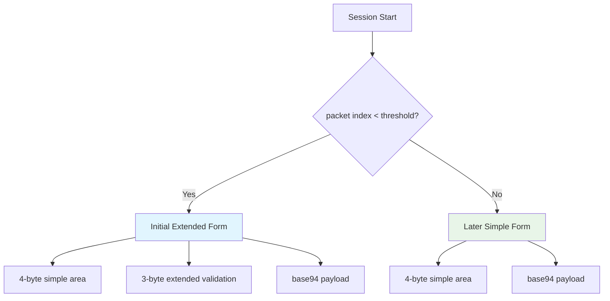

## Meaning Of The Base94 Header

The base94 header includes several components that work together to protect metadata while allowing the receiver to parse the packet:

- random key byte: A randomly generated byte that serves as an entropy source for the receiver to derive the per-packet key factor
- filler byte: A padding byte that adds structural ambiguity and helps obscure the actual header format
- base94 digits: Base94-encoded representation of a transformed payload length, where the length is not written directly but mapped through the transmission modulus and current packet key factor
- in the first packet, an extra 3-byte transformed validation field: An additional validation area that provides early integrity checking

The payload length is not written directly in plaintext. Instead, it is mapped through the transmission modulus and the current packet key factor. This transformation means that even the length field is protected, not just the payload content. An observer cannot simply read the packet length without knowing the current cryptographic state.

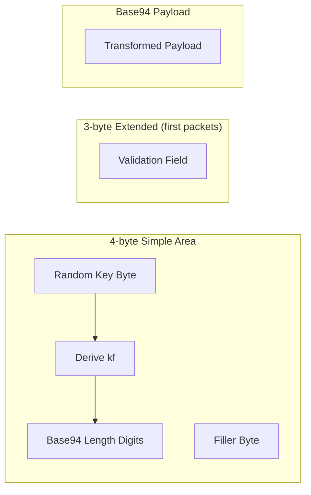

## Binary Protected Packet Layout

The normal post-handshake binary packet consists conceptually of:

- protected 3-byte header
- transformed payload body

The protected header itself contains:

- one seed byte: Used to derive the header key factor for this specific packet
- two protected payload-length bytes: The payload length, encrypted and transformed

Those bytes are then delta-encoded into the actual transmitted 3-byte header record. Delta encoding ensures that consecutive packets have related header values, which adds another layer of structural protection.

The payload section may have gone through several transformation stages depending on state and configuration:

- transport cipher encryption: The payload may be encrypted with the transport cipher
- masking: XOR-based masking may be applied to obscure the payload structure
- shuffling: Byte-order or position shuffling may be applied for additional confusion
- delta encoding: The final transformed payload may be delta-encoded for stream protection

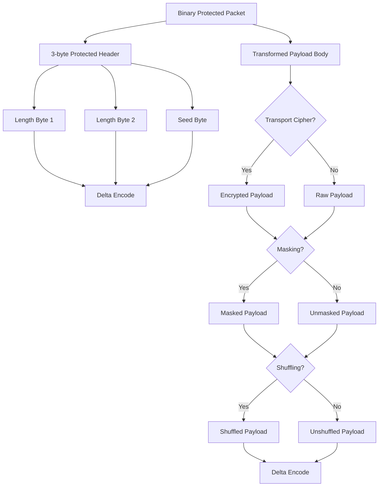

## Binary Header Interpretation

The inbound reader does not simply read a length from the packet. It performs a multi-step decoding process that reverses all the transformations applied during send:

1. delta decode on the 3-byte header: Reverses the delta encoding to recover the protected header values
2. derive `header_kf` from the first byte: Uses the seed byte to derive the key factor for this specific packet
3. unshuffle the two length bytes: Reverses any byte-order shuffling applied to the length fields
4. XOR-unmask the two length bytes: Reverses the XOR masking applied to the length fields
5. protocol-cipher decrypt them if configured: If protocol cipher is enabled, decrypts the length fields
6. reconstruct the original payload length: Maps the transformed length back through the modulus to recover the actual payload size

This is why the length is better understood as a protected metadata field, not a raw prefix. The length field undergoes nearly as much transformation as the payload itself, making it a protected rather than plaintext field.

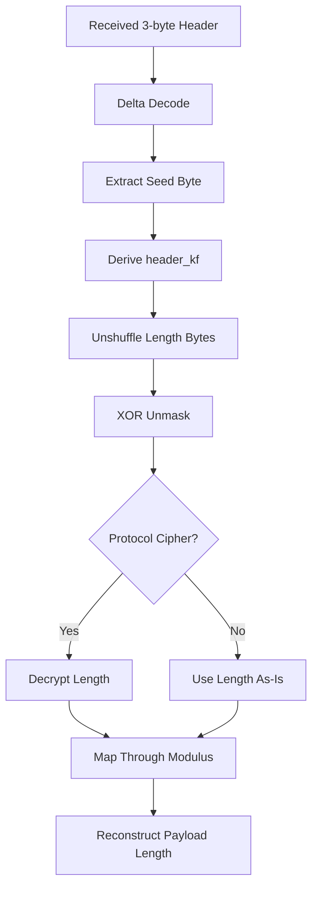

## Static Packet Format

The static packet format is implemented through `PACKET_HEADER` in `VirtualEthernetPacket.cpp`. Unlike the transmission family which is stream-oriented, the static format is designed for discrete packet encapsulation with richer semantic information.

The logical fields are:

- `mask_id`: A randomly generated non-zero identifier that drives per-packet key derivation
- `header_length`: The logical header length, obfuscated through modulus mapping before storage
- `session_id`: Session identifier with embedded protocol family semantics (positive for UDP, negative for IP)
- `checksum`: Header and payload integrity verification value
- pseudo source IP: Source IP address in pseudo header for virtual packet semantics
- pseudo source port: Source port in pseudo header
- pseudo destination IP: Destination IP address in pseudo header
- pseudo destination port: Destination port in pseudo header
- payload body: The actual packet payload being transported

## Static Header Layout Interpretation

`PACKET_HEADER` is packed and contains a small fixed logical structure, but the transmitted interpretation is more complex. Each field undergoes transformation before being placed on the wire:

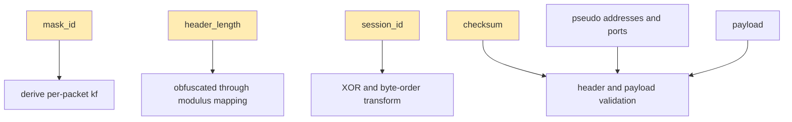

The static format is not merely an encrypted container. It is a comprehensively transformed packet structure where even the metadata fields are protected against casual inspection.

## `mask_id`

`mask_id` is generated randomly and must be non-zero. A zero `mask_id` would indicate a malformed packet and the receiver rejects such packets.

Its role is important because it drives the per-packet factor that provides packet-local cryptographic variation:

```text
kf = random_next(configuration->key.kf * mask_id)
```

This means the static format has a packet-local dynamic factor even when the surrounding connection uses the same broader session configuration. Each packet carries its own entropy through `mask_id`, ensuring that even packets within the same session appear different on the wire.

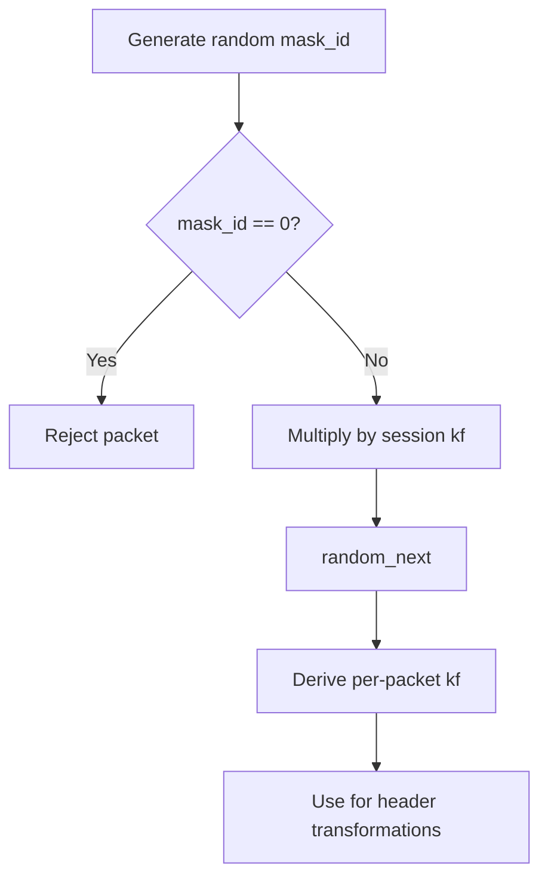

## `header_length`

`header_length` is not stored as the naked literal logical header size. It is mapped using a two-step process:

- The static modulus from `Lcgmod(LCGMOD_TYPE_STATIC)` provides the transformation space
- The per-packet `kf` derived from `mask_id` provides the packet-specific key factor

Together, these produce an obfuscated representation that is stored in the packet. That means the receiver must reverse the mapping before it knows the actual effective header size.

This approach ensures that even the header length is protected metadata, not plaintext structural information.

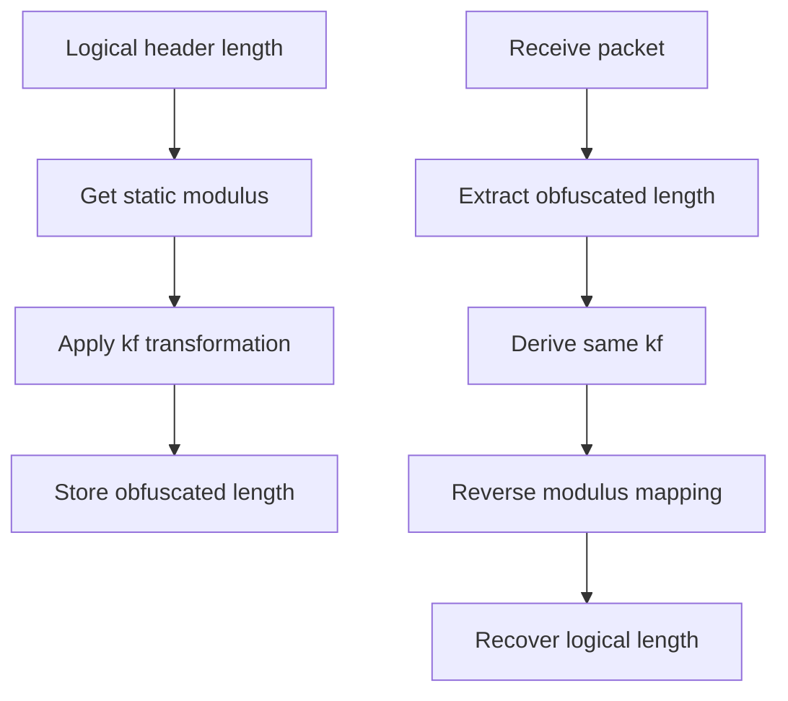

## `session_id`

The sign of `session_id` encodes the payload family in a compact manner:

- positive means UDP payload semantics
- negative means IP payload semantics

For IP payloads, the packer uses `~session_id` (bitwise inversion) before storing it, and the unpacker reverses that by checking the sign and applying bitwise inversion.

This is a compact field-reuse trick that lets one field communicate both identity and protocol class. The same field simultaneously carries the session identifier and indicates which protocol family the payload belongs to.

```mermaid
flowchart TD
    A[session_id value] --> B{Sign check}
    B -->|Positive| C[UDP payload semantics]
    B -->|Negative| D[Apply bitwise inversion]
    D --> E[IP payload semantics]
    
    F[Store: session_id &gt; 0] --> G[UDP family]
    H[Store: ~session_id] --> I[IP family (negative when viewed)]
```

## `checksum`

Checksum covers header and payload after the relevant pack-time transformations in the local packet buffer. The checksum is computed over the entire packet structure including all transformed fields.

On unpack, the code temporarily zeroes the stored checksum, recomputes the checksum across the packet, restores the original field, and compares. This approach ensures that the checksum verification does not use the stored value as part of the computation, preventing circular validation.

This is one of the key structural integrity checks in the static format. It ensures that both header and payload have not been tampered with during transmission.

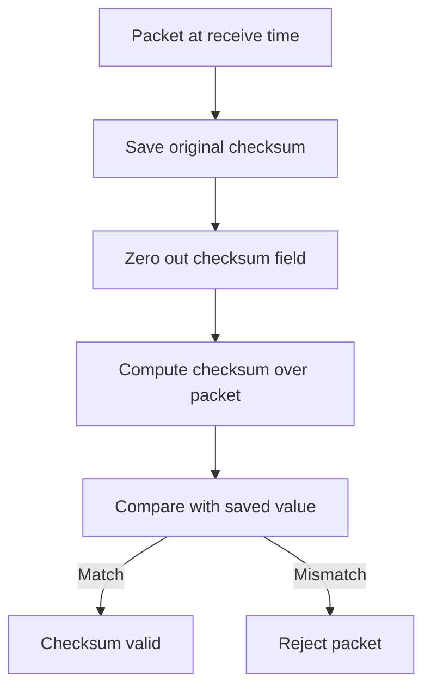

## `pseudo` Address And Port Fields

The pseudo address fields are used to carry source and destination endpoint information for the virtual packet semantics. These are called "pseudo" because they are not the actual IP addresses of the tunnel endpoints, but rather the addresses embedded within the virtual Ethernet packet being transported.

For UDP payloads, the unpacker validates that source and destination addresses and ports make sense according to UDP semantics. This validation ensures that the static format properly enforces the protocol semantics it claims to carry.

That means the static packet format is not only an opaque carrier blob. It is a structured network packet envelope that carries semantic information about the encapsulated packet.

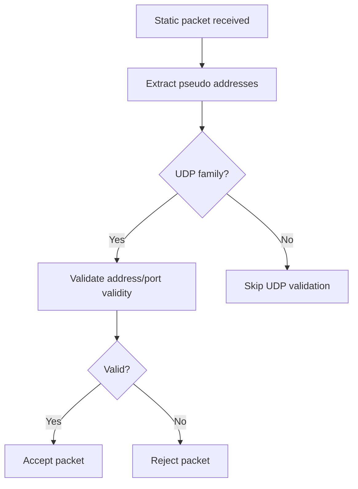

## Static Pack Path

The pack path performs a specific sequence of operations in a carefully designed order. This order is essential because some transformations depend on the results of earlier steps:

1. validate input: Check that the input packet meets basic validity requirements
2. resolve session ciphertext objects from the session identity: Look up the appropriate cipher objects for this session
3. optionally encrypt the payload with transport cipher: If transport cipher is configured, encrypt the payload first
4. allocate header plus payload buffer: Prepare the output buffer with space for header and payload
5. fill raw fields: Populate the logical header fields with their plaintext values
6. generate non-zero `mask_id`: Create a random non-zero mask identifier
7. derive per-packet `kf`: Using the mask_id and session key factor, derive the packet-specific key factor
8. obfuscate `header_length`: Transform the header length through modulus mapping using the per-packet kf
9. obfuscate `session_id`: Apply XOR and byte-order transformation to the session ID
10. compute checksum: Calculate the checksum over the transformed header and payload
11. optionally encrypt the trailing header body with protocol cipher: If protocol cipher is configured, encrypt the header body
12. shuffle the `session_id` and following bytes: Apply byte-position shuffling to obscure structure
13. mask the `session_id` and following bytes: Apply XOR masking for additional protection
14. delta-encode the final packet: Apply delta encoding for stream-friendly transmission


## Static Unpack Path

The unpack path reverses the transform order exactly. The order is critical because each step depends on the correct prior transformation:

1. delta decode the packet: Reverse the delta encoding to recover the original byte sequence
2. check that `mask_id` is non-zero: Verify the packet is not malformed (zero mask_id indicates invalid packet)
3. derive per-packet `kf`: Using the received mask_id, derive the same kf that was used during packing
4. reverse `header_length` mapping: Recover the logical header length from the obfuscated value
5. reverse masking from `session_id` onward: Reverse the XOR masking applied during packing
6. reverse shuffling from `session_id` onward: Reverse the byte-position shuffling
7. recover logical `session_id` and protocol class: Undo the XOR transformation and determine UDP vs IP family from sign
8. optionally decrypt the trailing header body with protocol cipher: If protocol cipher was used, decrypt the header
9. validate checksum: Compute checksum over the recovered packet and compare with stored value
10. optionally decrypt payload with transport cipher: If transport cipher was used, decrypt the payload
11. populate the `VirtualEthernetPacket` object: Create the output packet object with recovered data

That ordering is essential. If read in the wrong order, the packet will not validate. The transformations are designed to be reversible only when applied in the correct sequence.

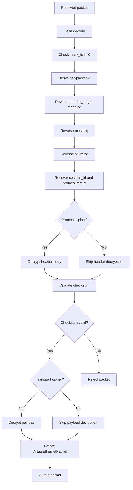

## Dynamic Header-Length Behavior In Static Mode

One of the most important implementation details is that protocol-cipher encryption of the trailing header body may change the length of that region. The code explicitly handles this possibility by rebuilding the packet buffer if the encrypted or decrypted header-body length differs from the raw size.

When the protocol cipher expands the header body (due to encryption overhead), the code must:

1. Detect the length difference after encryption
2. Reallocate the packet buffer to accommodate the expansion
3. Update the stored `header_length` to reflect the new size

This tells us two things:

- the static packet path is not hard-coded to assume fixed ciphertext expansion semantics
- `header_length` must be treated as a living format field, not a decorative constant

The dynamic header length behavior ensures that the protocol remains flexible and can accommodate different cipher configurations without breaking.

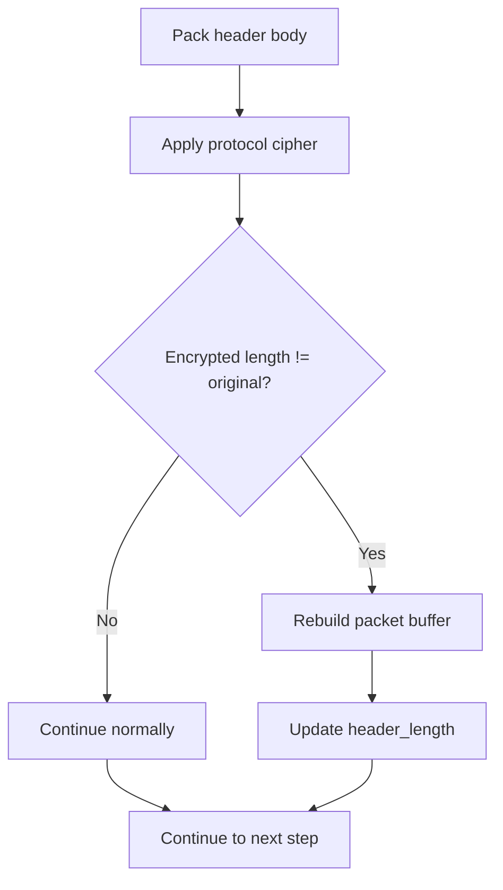

## Session-Ciphertext Derivation For Static Packets

`VirtualEthernetPacket::Ciphertext(...)` derives protocol and transport ciphers for static packets using a derivation string built from multiple components:

- `guid`: Global unique identifier for the session context
- `fsid`: File system or session type identifier
- `id`: Session-specific identifier

The resulting derivation string is appended to the configured base keys. This means the cipher key for static packets is computed as:

```
cipher_key = base_key + derivation_string(guid, fsid, id)
```

That means static packet protection is also session-shaped and identity-shaped, not globally identical across every packet in the whole runtime. Each session gets its own unique cipher context.

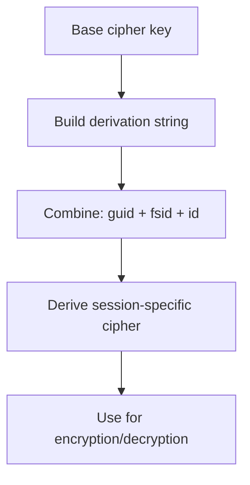

## Packet Families Carried By Static Format

The static format can carry at least two major families of network-layer packets:

### UDP family

- `session_id > 0`: Positive session ID indicates UDP semantics
- source and destination address and port validation applies: The unpacker validates that the pseudo addresses form a valid UDP endpoint pair
- The static format preserves UDP semantics by carrying the full UDP header information in the pseudo fields

### IP family

- stored as negative form through bitwise inversion trick: The session_id is stored as `~session_id` to make it negative
- unpacker recognizes this and treats payload as IP payload semantics: The negative sign triggers IP family handling
- For IP packets, the pseudo fields carry the IP header information rather than UDP header information

This is a compact but important on-wire distinction. The sign of a single field tells the receiver how to interpret the entire packet structure.

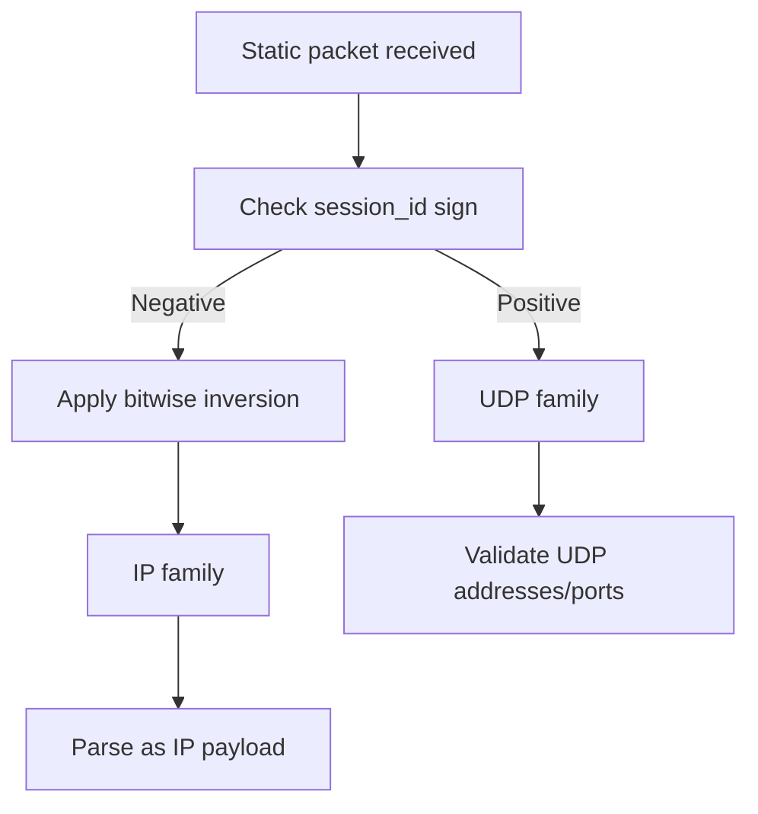

## Why These Formats Are Not Trivial Metadata Containers

Neither the normal transmission packet family nor the static packet family should be described as "header plus encrypted payload" without further detail. Such a description misses the essential security properties of the design.

In both cases the code is also protecting or disturbing metadata through multiple mechanisms:

- dynamic key factors: Each packet carries its own cryptographic key factor derived from per-packet randomness
- length mapping: Even the payload length field is transformed, not stored as plaintext
- header-body encryption: The header itself may be encrypted, not just the payload
- masking: XOR-based masking obscures byte sequences
- shuffling: Byte-position shuffling breaks structural patterns
- delta encoding: Delta encoding adds another transformation layer
- state transitions between early and later packet forms: The format itself changes based on session state

That is why packet-format documentation is central to understanding the project. The packet formats are not just implementation details—they are part of the security architecture.

## Related Documents

- [`TRANSMISSION.md`](TRANSMISSION.md)
- [`HANDSHAKE_SEQUENCE.md`](HANDSHAKE_SEQUENCE.md)
- [`SECURITY.md`](SECURITY.md)