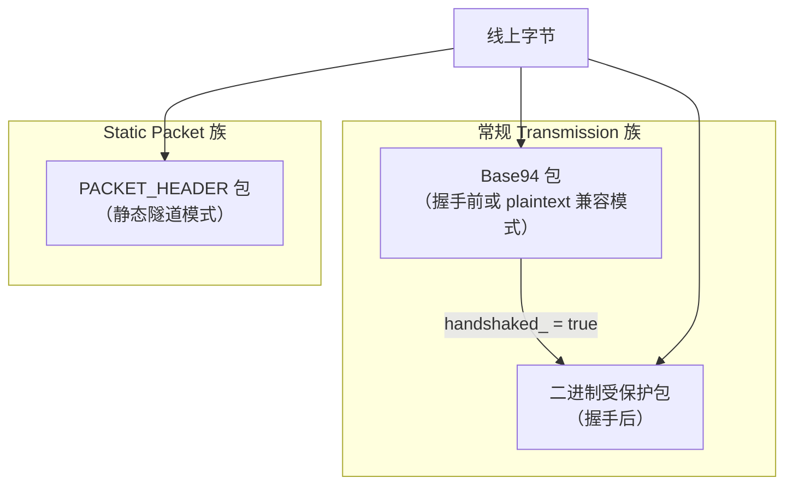
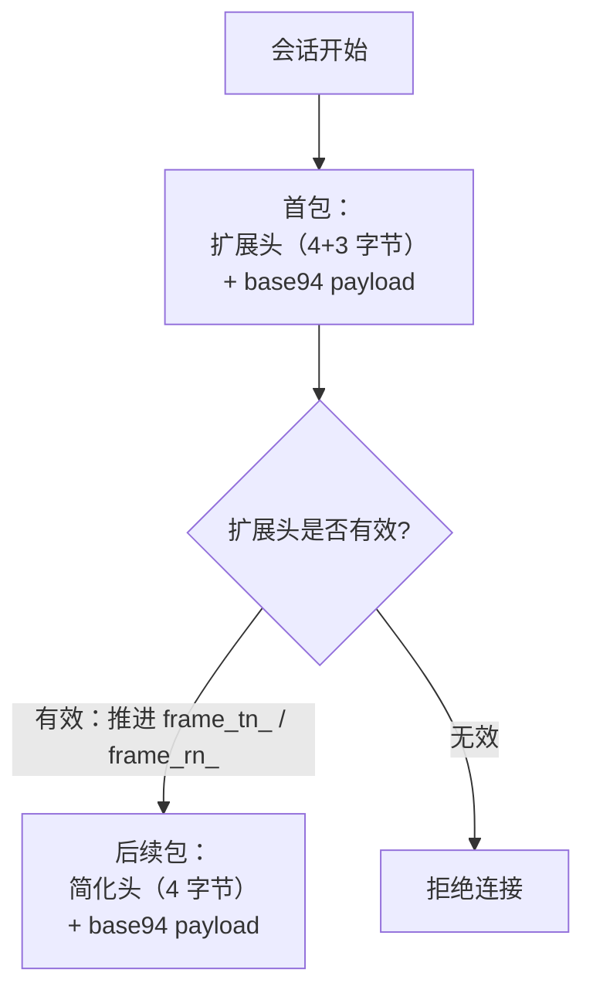
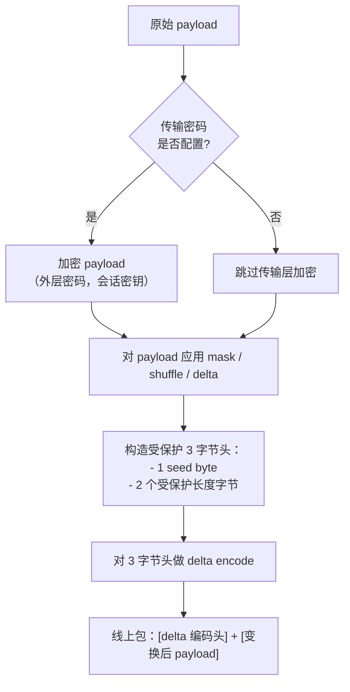
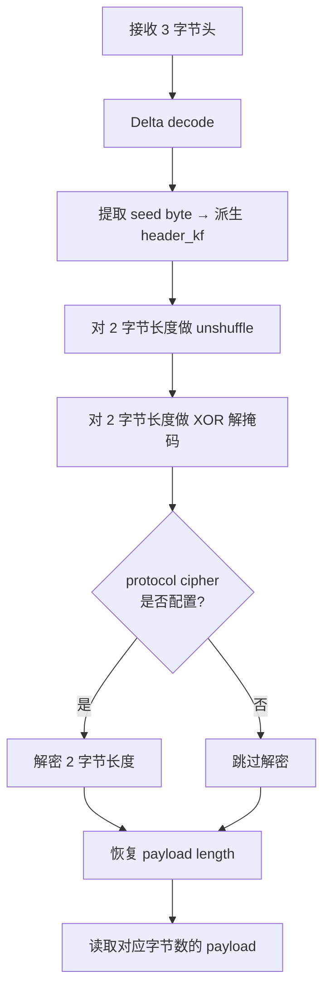
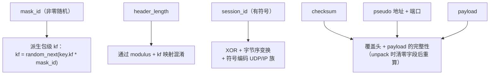
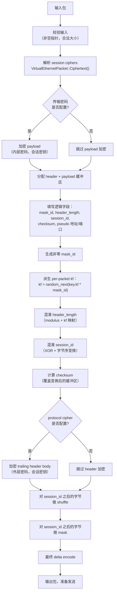
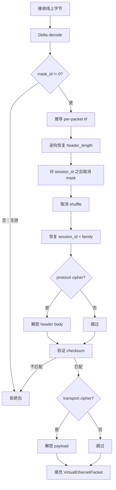
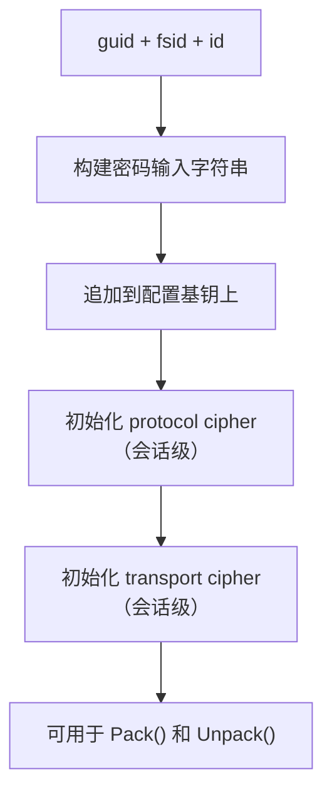

# 包格式与线上布局解读

[English Version](PACKET_FORMATS.md)

## 范围

本文解释 `ppp/transmissions/ITransmission.cpp` 和
`ppp/app/protocol/VirtualEthernetPacket.cpp` 中可见的数据包格式行为。

主要覆盖两大家族：

- 常规 transmission 包（base94 和二进制受保护形式）
- static packet 包（`PACKET_HEADER`）

包格式不是单纯的序列化细节，它本身就是安全模型和运行模型的一部分，因为它直接决定
元数据在网络上暴露得有多直白、早期流量和后续流量是否形态一致、接收端能进行多少
结构校验、以及 static mode 和常规受保护 transmission 在行为上有何区别。

---

## 包族概览



---

## 常规 transmission 帧族

常规 transmission 有两种子类型：

- **base94 预握手或 plaintext 兼容模式** — 握手完成前，或配置选择 plaintext 兼容模式时使用
- **握手后二进制受保护模式** — `handshaked_` 变为 true 之后使用

切换发生在握手生命周期中（参见 `HANDSHAKE_SEQUENCE_CN.md`）。

### base94 包格式

base94 帧族内部又分两种形态，由 `frame_tn_`（发送侧）和 `frame_rn_`（接收侧）控制：

#### 初始扩展头形态

- 4 字节 simple header 区域
- 3 字节扩展验证区域
- base94 编码的 payload

扩展头的职责是建立第一包的结构验证点。它比后续简化头多携带一段 3 字节验证字段，
因此首包更重，但也更容易建立解析稳定性。

#### 后续简化头形态

- 4 字节 simple header 区域
- base94 编码的 payload

扩展头交换成功后，`frame_tn_` 和 `frame_rn_` 推进，后续包只保留简化头。



### base94 头部意味着什么

base94 头部包括：

| 字段 | 内容 | 说明 |
|------|------|------|
| 随机 key byte | `[0x00, 0xFF]` | 驱动包级 key factor |
| filler byte | 随机值 | 头部混淆 |
| base94 length digits | 编码后的长度 | 不是裸整数；通过 modulus 和 kf 映射 |
| 3 字节验证字段 | 仅扩展头 | 首包结构验证 |

最关键的一点是：payload length 不是直接裸写，而是经过 transmission modulus 和当前
包的 key factor（`kf`）映射后的结果。接收端必须已知 modulus 并逆向映射才能恢复真实
payload 长度。

### 常规二进制受保护帧格式

握手后的二进制 transmission 包概念上可以理解成：

- 一个受保护的 3 字节头
- 一段经过变换的 payload



这个 3 字节头包含：

- **一个 seed byte** — 用于派生包级头部 key factor（`header_kf`）
- **两个受保护的 payload 长度字节** — 不是裸值

这 3 字节头随后还会经过 delta encode，形成真正线上看到的头部。

payload 部分则可能依次经过：传输密码加密、masking、shuffling、delta encode。
具体启用什么取决于状态和配置。

### 如何解释二进制头部

接收端并不是简单地读长度，而是按如下步骤处理：

1. 对 3 字节头做 delta decode
2. 根据首字节推导 `header_kf`
3. 对两个长度字节做 `unshuffle`
4. 对两个长度字节做 XOR 解掩码
5. 如果配置了 protocol cipher，则继续解密长度字节
6. 最后恢复原始 payload length

所以这里的长度字段更准确地说是"**受保护元数据**"，而不是朴素 raw prefix。



---

## static packet format

static packet format 由 `ppp/app/protocol/VirtualEthernetPacket.cpp` 中的
`PACKET_HEADER` 实现。

逻辑字段包括：

| 字段 | 类型 | 说明 |
|------|------|------|
| `mask_id` | `Byte`（非零） | 包级随机因子驱动值 |
| `header_length` | 编码值 | 不是裸长度；通过 modulus + kf 映射 |
| `session_id` | 有符号整数 | 符号携带包族（UDP vs IP） |
| `checksum` | 完整性值 | 覆盖变换后的头和 payload |
| pseudo 源 IP | `uint32_t` | 虚拟端点源地址 |
| pseudo 源端口 | `uint16_t` | 虚拟端点源端口 |
| pseudo 目的 IP | `uint32_t` | 虚拟端点目的地址 |
| pseudo 目的端口 | `uint16_t` | 虚拟端点目的端口 |
| payload 正文 | 字节序列 | 应用层 payload |

### static 格式概览



---

## `mask_id`

`mask_id` 必须是随机且**非零**的。

它非常关键，因为后续 per-packet factor 由它驱动：

```text
kf = random_next(configuration->key.kf * mask_id)
```

每个 static packet 都有本地动态因子。即使同一会话配置不变，由于 `mask_id` 每次
重新生成，线上表示也会不同。

如果 `mask_id` 为零，后续的 per-packet factor 就会退化，包格式的动态性会明显下降。
打包侧明确生成非零随机值，解包侧也会检查它。

---

## `header_length`

`header_length` 不是裸写真实头长，而是借助：

- `Lcgmod(LCGMOD_TYPE_STATIC)` 计算出来的 modulus
- 当前包的 `kf`

完成映射后再存储。因此接收端必须先逆向恢复这个映射，才能知道逻辑头长。

长度字段被映射而不是直写，目的是让 on-wire 结构不直接暴露静态格式的真实头长边界。

---

## `session_id`

`session_id` 的**符号位**同时承担包类型语义：

- **正数** → UDP 语义：源/目的地址和端口验证适用
- **负数** → IP 语义：以 IP payload 语义处理

对于 IP 包，打包时会用 `~session_id` 形式存储，解包时通过检查符号并反向取反恢复：

```cpp
// 打包（IP 包）：
header->session_id = ~session_id;   // 存储 session_id 的按位取反

// 解包：
if (header->session_id < 0) {
    // IP 族：恢复真实 ID
    actual_id = ~header->session_id;
} else {
    // UDP 族：直接使用
    actual_id = header->session_id;
}
```

---

## `checksum`

checksum 覆盖的是经过本地打包变换后的 header 和 payload。

在 unpack 时，代码会：
1. 保存存储的 checksum 值
2. 清零缓冲区中的 checksum 字段
3. 重新计算覆盖缓冲区的 checksum
4. 与存储值比较

这种"清零再重算"技术与网络协议栈中 IP/TCP checksum 验证使用的模式相同。

---

## pseudo 地址和端口字段

这些字段承载虚拟包的源/目的端点语义。

对于 UDP 包，接收侧会验证 pseudo 地址和端口是否合法（非零端口、在配置会话有效 IP
范围内等）。

对于 IP 包，pseudo 地址字段携带从 IP 数据报中提取的实际 IP 头地址。

---

## static pack path

完整的打包流水线按顺序如下：



共 14 步。每一步依赖前一步的输出；以错误顺序颠倒任意一步都会导致 checksum 验证失败。

---

## static unpack path

解包顺序必须和打包顺序完全相反：

| 步骤 | 动作 |
|------|------|
| 1 | Delta decode |
| 2 | 检查 `mask_id != 0` |
| 3 | 推导 per-packet `kf` |
| 4 | 逆向恢复 `header_length` |
| 5 | 对 `session_id` 之后的字节取消 mask |
| 6 | 取消 shuffle |
| 7 | 恢复 `session_id` 和 family（符号检查） |
| 8 | 可选：用 protocol cipher 解密 header body |
| 9 | 验证 checksum（清零字段，重算，比较） |
| 10 | 可选：用 transport cipher 解密 payload |
| 11 | 填充 `VirtualEthernetPacket` 结构体 |

如果顺序错了，checksum 验证就会失败。checksum 是故意在部分变换后（混淆之后、加密
之前）计算的，以便两个加密层可以独立验证。



---

## 动态头长行为

如果 protocol cipher 导致 header body 长度变化，代码会重建缓冲区并更新
`header_length`。这说明格式不会硬编码"密文一定不变长"。

这条动态 resize 路径只在配置了 protocol cipher 且该密码实现产生可变长输出（例如
由于块填充）时才会触发。使用流密码的常见情况下，大小不会改变。

---

## static packet 的会话密钥派生

`VirtualEthernetPacket::Ciphertext(...)` 会基于以下字段生成会话相关输入：

- `guid` — 应用/服务端全局标识符
- `fsid` — 流会话标识符
- `id` — 包级或会话级数值标识符

这些字段拼接后追加到配置基钥上。static packet 的保护因此是**会话形态的和身份
形态的**：拥有不同 `guid`、`fsid` 或 `id` 值的两个会话，即使使用相同的基础配置，
也会产生不同的密码状态。



---

## 由 static format 承载的家族

### UDP 家族

- `session_id > 0`
- 验证源/目的地址和端口
- unpack 后 `VirtualEthernetPacket.udp = true`

### IP 家族

- `session_id < 0`
- 以 IP payload 语义处理
- `session_id` 实际上是 signed family selector
- unpack 后 `VirtualEthernetPacket.udp = false`

---

## 常规 Transmission 与 Static Format 对比

| 方面 | 常规 Transmission | Static Packet Format |
|------|-------------------|-----------------------|
| 使用场景 | 隧道复用流量 | 直接向虚拟网卡注入包 |
| 握手前形式 | base94 编码 | 不适用（static 始终有密钥） |
| 握手后形式 | 二进制受保护 | 带 PACKET_HEADER 的二进制受保护 |
| 长度编码 | modulus 映射 base94 或 delta 编码二进制 | modulus+kf 混淆的 `header_length` |
| 会话身份 | 由握手派生 | 由 `guid + fsid + id` 派生 |
| 包级熵 | 3 字节头中的 seed byte | 非零 `mask_id` |
| checksum | 无（依赖传输完整性） | 覆盖 header + payload |
| 包族 | 单一（流） | UDP 或 IP（`session_id` 的符号） |

---

## 错误条件

| 条件 | 检测点 | 效果 |
|------|--------|------|
| `mask_id == 0` | 解包步骤 2 | 包被拒绝 |
| `header_length` 映射失败 | 解包步骤 4 | 包被拒绝 |
| checksum 不匹配 | 解包步骤 9 | 包被拒绝 |
| protocol cipher 解密失败 | 解包步骤 8 | 包被拒绝 |
| transport cipher 解密失败 | 解包步骤 10 | 包被拒绝 |
| pseudo UDP 字段无效 | 最终验证 | 包被拒绝 |
| payload 长度超过缓冲区 | 缓冲区大小检查 | 包被拒绝 |

所有拒绝路径都调用 `SetLastErrorCode(...)` 并向调用方返回空或错误结果。调用方负责
检测失败并关闭会话。

---

## 错误码参考

包格式相关错误码（来自 `ppp/diagnostics/ErrorCodes.def`）：

| ErrorCode | 说明 |
|-----------|------|
| `ProtocolDecodeFailed` | static 包 checksum、密码或结构解码失败 |
| `ProtocolFrameInvalid` | 收到的包帧结构无效 |
| `ProtocolPacketActionInvalid` | 无法识别的包族或操作码 |
| `SseaDeltaDecodeInvalidInput` | Delta 解码收到无效输入 |
| `SseaBase94DecodeInvalidInput` | Base94 解码收到无效输入 |
| `SseaBase94DecodeCharOutOfAlphabet` | Base94 解码发现字母表外字符 |
| `TransmissionPacketDecryptPayloadAllocFailed` | 包解密分配 payload 缓冲区失败 |
| `NetworkPacketMalformed` | 网络包结构校验失败 |
| `NetworkPacketTooLarge` | 恢复的 payload 长度超过预期最大值 |

---

## 实用阅读规则

读包格式时，一定要把它和生成它的变换链一起看。头部字段只有在知道上一个步骤改了
什么之后才有意义。

例如，线上缓冲区中的 `header_length` 不是真实头长——它是对真实头长应用
`Lcgmod(LCGMOD_TYPE_STATIC)` 和 `kf` 变换后的结果。真实头长只能通过逆向这些变换
才能恢复。

同样，线上缓冲区中的 `session_id` 也不是真实的会话标识符——它已经过 XOR 变换和
字节序交换。原始字段的符号确实携带包族信息，但数值必须经过反变换才能与已知会话
ID 比较。

---

## 相关文档

- [`HANDSHAKE_SEQUENCE_CN.md`](HANDSHAKE_SEQUENCE_CN.md) — 握手与密码生命周期
- [`TRANSMISSION_PACK_SESSIONID_CN.md`](TRANSMISSION_PACK_SESSIONID_CN.md) — session-id 包打解包
- [`TRANSMISSION_CN.md`](TRANSMISSION_CN.md) — 传输层架构
- [`SECURITY_CN.md`](SECURITY_CN.md) — 安全模型
- [`LINKLAYER_PROTOCOL_CN.md`](LINKLAYER_PROTOCOL_CN.md) — 链路层 opcode 和帧化
