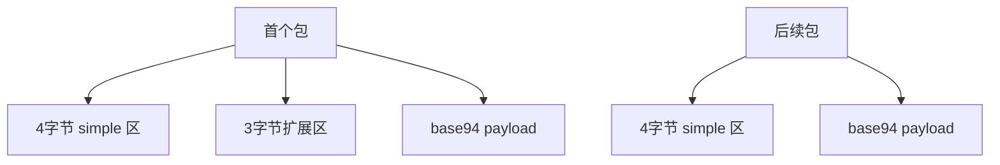
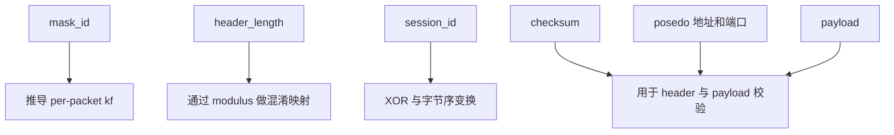
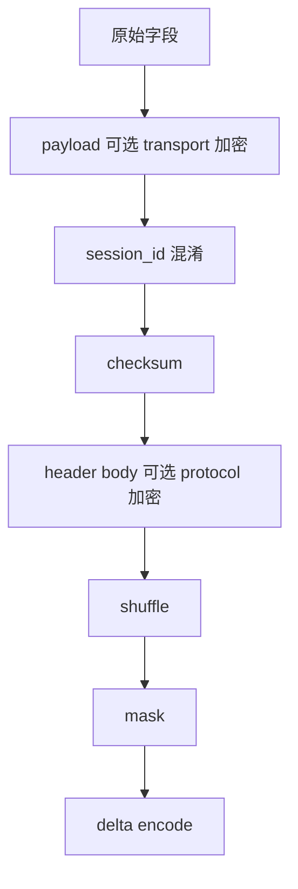

# 包格式与线上布局解读

[English Version](PACKET_FORMATS.md)

## 文档范围

本文解释以下代码中可见的数据包格式行为：

- `ppp/transmissions/ITransmission.cpp`
- `ppp/app/protocol/VirtualEthernetPacket.cpp`

重点覆盖两大家族：

- `ITransmission` 使用的常规 transmission 帧族
- `VirtualEthernetPacket` 使用的 static packet 帧族

## 为什么包格式在这个工程里如此重要

在 OPENPPP2 中，包格式不是一个简单的序列化细节。它本身就是安全模型和运行模型的一部分，因为它会直接影响：

- 元数据在网络上暴露得有多直白
- 早期流量和后续流量是否完全同形
- 接收端能进行多少结构校验
- static mode 和常规受保护 transmission 在行为上有何区别

## 常规 transmission 帧族

常规 transmission 路径可以分成两种子类型：

- 预握手或 plaintext 模式下的 base94 帧族
- 握手后常规工作的二进制受保护帧族

## base94 包格式

base94 帧族内部又分成两种子形态。

### 初始扩展头形态

它由以下部分组成：

- 4 字节 simple header 区域
- 3 字节扩展校验区域
- base94 编码后的 payload

### 后续简化头形态

它由以下部分组成：

- 4 字节 simple header 区域
- base94 编码后的 payload

这两种状态的切换由 `frame_tn_` 与 `frame_rn_` 控制。



## base94 头部到底在表达什么

base94 头部包括：

- 随机 key byte
- filler byte
- 经过转换后的 payload length 对应的 base94 数字
- 在首个包里，还会有一个额外 3 字节扩展校验字段

这里最关键的一点是：payload length 不是直接裸写进去，而是经过 transmission modulus 和当前 `kf` 映射后的结果。

## 常规二进制受保护帧格式

握手后常规二进制 transmission 包从概念上可以理解成：

- 一个受保护的 3 字节头
- 一段经过变换的 payload

这个 3 字节头本身包含：

- 一个 seed byte
- 两个表示 payload length 的字节

随后这 3 字节头还会继续经过 delta encode，形成真正线上看到的头部。

payload 部分则可能先后经过：

- transport cipher
- masking
- shuffling
- delta encode

具体是否启用，取决于当前状态和配置。

## 如何解释二进制头部

接收端并不是“读两个字节长度”这么简单，而是会按如下步骤处理：

1. 先对 3 字节头做 delta decode
2. 再根据首字节推导 `header_kf`
3. 再对两个长度字节做 `unshuffle`
4. 再对两个长度字节做 XOR 解掩码
5. 如果配置了 protocol cipher，则继续解密长度字节
6. 最后恢复出原始 payload length

因此这里的长度字段更准确地说是“受保护元数据”，而不是一个朴素的 raw prefix。

## static packet format

static packet format 由 `VirtualEthernetPacket.cpp` 中的 `PACKET_HEADER` 实现。

它的逻辑字段包括：

- `mask_id`
- `header_length`
- `session_id`
- `checksum`
- pseudo source IP
- pseudo source port
- pseudo destination IP
- pseudo destination port
- payload

## static 头部布局解读

`PACKET_HEADER` 虽然在逻辑上是一个紧凑结构体，但它在线上的解释远比“固定头”更复杂。



## `mask_id`

`mask_id` 是随机生成的，而且必须非零。

它非常关键，因为后续 per-packet factor 由它驱动：

```text
kf = random_next(configuration->key.kf * mask_id)
```

这意味着 static packet 的每个包都有本地动态因子，即使整个会话使用的是同一份 broader session 配置。

## `header_length`

`header_length` 不是裸写“真实头长”，而是借助：

- `Lcgmod(LCGMOD_TYPE_STATIC)` 计算出的 modulus
- 当前包的 `kf`

完成映射之后再存储。因此接收端必须先逆向恢复这个映射，才能知道逻辑上的头长。

## `session_id`

`session_id` 的符号位同时承担了“包类型”的语义：

- 正数表示 UDP 语义
- 负数表示 IP 语义

对于 IP 包，打包时会用 `~session_id` 的形式存储，解包时再通过检查符号并反向取反恢复。

这是一种非常紧凑的字段复用技巧：一个字段同时传达了“标识”和“协议类别”。

## `checksum`

checksum 覆盖 header 与 payload。在解包时，代码会先保存原 checksum，把头里的 checksum 临时置零，重新计算整个包的 checksum，再恢复原值并比较。

这是 static format 中最重要的结构完整性校验之一。

## `posedo` 地址与端口字段

这些 pseudo 地址字段用来承载虚拟包语义中的源 / 目的端点信息。对于 UDP 包，解包器会继续检查这些地址和端口是否合法。

因此 static packet 不是一个“opaque blob”，而是一种带结构化网络语义的封装格式。

## static 打包路径

打包时的步骤是：

1. 检查输入
2. 按 session identity 解析 session 对应的 ciphertext
3. 如果存在 transport cipher，则先加密 payload
4. 分配 header + payload 的缓冲区
5. 填写原始字段
6. 生成非零 `mask_id`
7. 推导 per-packet `kf`
8. 混淆 `header_length`
9. 混淆 `session_id`
10. 计算 checksum
11. 如果配置了 protocol cipher，则对 trailing header body 做加密
12. 对 `session_id` 及之后整段做 shuffle
13. 对 `session_id` 及之后整段做 masking
14. 最后整体做 delta encode



## static 解包路径

解包时则按逆序恢复：

1. 先做 delta decode
2. 检查 `mask_id` 是否非零
3. 推导 per-packet `kf`
4. 逆向恢复 `header_length`
5. 从 `session_id` 起整段做 unmask
6. 从 `session_id` 起整段做 unshuffle
7. 恢复逻辑 `session_id` 并判断协议类别
8. 如果存在 protocol cipher，则解密 trailing header body
9. 校验 checksum
10. 如果存在 transport cipher，则解密 payload
11. 填充 `VirtualEthernetPacket` 输出对象

这个顺序不能随便改。顺序一旦颠倒，包就无法通过结构校验。

## static 模式里的动态头长行为

很重要的一个实现细节是：如果 protocol cipher 对 trailing header body 的加密或解密导致这一段长度发生变化，代码会重新拼出整个包缓冲区，并更新 `header_length` 的存储表示。

这说明两件事：

- static packet path 没有死板地假定 ciphertext expansion 一定固定不变
- `header_length` 是一个真正参与格式语义的动态字段，而不是装饰值

## static packet 的 session-ciphertext 派生

`VirtualEthernetPacket::Ciphertext(...)` 会用以下几个量拼出一段派生字符串：

- `guid`
- `fsid`
- `id`

然后把它追加到基础 key 后面，构造 protocol 和 transport cipher。

这说明 static packet 的保护同样是 session-shaped、identity-shaped 的，而不是全运行时所有 static 包都长得完全一样。

## static format 可承载的包族

static format 至少承载两类主要包：

### UDP 族

- `session_id > 0`
- 会执行 source / destination 地址和端口校验

### IP 族

- 通过 bitwise inversion 技巧以负数 session_id 表示
- 解包器识别后按 IP payload 语义处理

这是线上一个非常紧凑但重要的区分。

## 为什么这些包格式绝不能被简化成“头 + 密文 payload”

不管是常规 transmission 帧族还是 static packet 帧族，都不应被粗糙地写成“一个头，再加一个加密 payload”。因为实际上，元数据本身也在被保护和扰动：

- dynamic key factor
- 长度映射
- header body 加密
- masking
- shuffling
- delta encoding
- 早期包与后续包的形态切换

这就是为什么包格式文档在 OPENPPP2 里不是辅助材料，而是核心材料。

## 相关文档

- [`TRANSMISSION_CN.md`](TRANSMISSION_CN.md)
- [`HANDSHAKE_SEQUENCE_CN.md`](HANDSHAKE_SEQUENCE_CN.md)
- [`SECURITY_CN.md`](SECURITY_CN.md)
