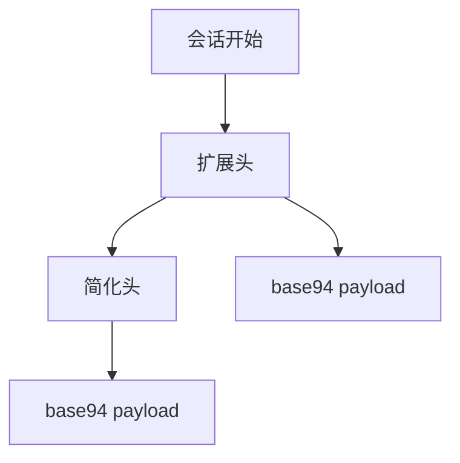
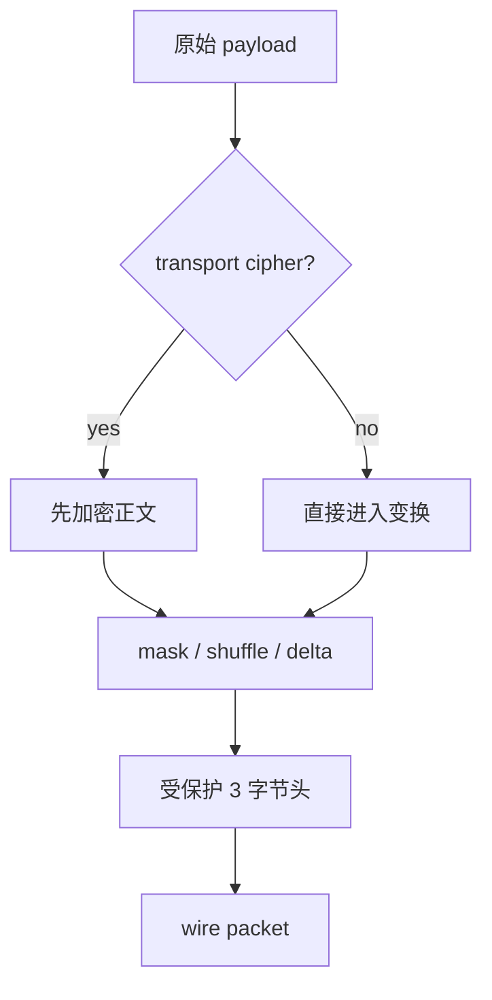
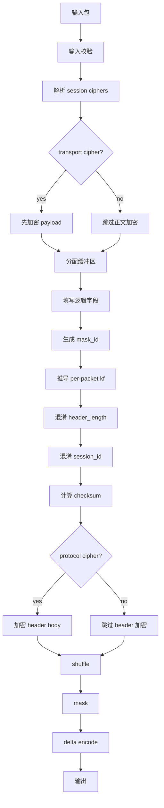

# 包格式与线上布局解读

[English Version](PACKET_FORMATS.md)

## 范围

本文解释 `ppp/transmissions/ITransmission.cpp` 和 `ppp/app/protocol/VirtualEthernetPacket.cpp` 中可见的数据包格式行为。

主要覆盖两大家族：

- 常规 transmission 包
- static packet 包

## 为什么包格式重要

包格式不是单纯的序列化细节，它本身就是安全模型和运行模型的一部分，因为它直接决定：

- 元数据在网络上暴露得有多直白
- 早期流量和后续流量是否形态一致
- 接收端能进行多少结构校验
- static mode 和常规受保护 transmission 在行为上有何区别

包格式不是 serialization 的附属品，而是安全状态与运行状态的载体。

## 常规 transmission 帧族

常规 transmission 有两种子类型：

- 预握手或 plaintext 兼容模式下的 base94 帧族
- 握手后常规工作的二进制受保护帧族

## base94 包格式

base94 帧族内部又分两种形态。

### 初始扩展头形态

- 4 字节 simple header 区域
- 3 字节扩展验证区域
- base94 编码的 payload

### 后续简化头形态

- 4 字节 simple header 区域
- base94 编码的 payload

这两种状态由 `frame_tn_` 和 `frame_rn_` 控制。

### 结构图



### 扩展头为何存在

扩展头的职责是建立第一包的结构验证点。它比后续简化头多携带一段验证数据，因此首包更重，但也更容易建立解析稳定性。

## base94 头部意味着什么

base94 头部包括：

- 随机 key byte
- filler byte
- 经过变换的 payload length 对应的 base94 数字
- 在首个包里，还会有一个额外 3 字节验证字段

最关键的一点是：payload length 不是直接裸写进去，而是经过 transmission modulus 和当前 `kf` 映射后的结果。

### 头部字段语义

| 字段 | 语义 |
|---|---|
| 随机 key byte | 参与长度映射和包级 key factor 计算 |
| filler byte | 参与头部混淆 |
| base94 digits | 长度的编码结果 |
| 额外 3 字节验证字段 | 首包验证与切换条件 |

## base94 的首包与后续包

首包和后续包的差异在源码里不是注释级别的差异，而是明确的状态切换：

- 首包使用扩展验证区
- 成功后 `frame_tn_` 和 `frame_rn_` 切换
- 后续包只保留简化头

这意味着长度解析逻辑必须知道当前是否已经看过首包。

## 常规二进制受保护帧格式

握手后常规二进制 transmission 包概念上可以理解成：

- 一个受保护的 3 字节头
- 一段经过变换的 payload

这个 3 字节头本身包含：

- 一个 seed byte
- 两个表示 payload length 的字节

随后这 3 字节头还会继续经过 delta encode，形成真正线上看到的头部。

payload 部分则可能先后经过：

- transport cipher
- masking
- shuffling
- delta encode

具体启用什么，取决于状态和配置。

### 结构图



## 如何解释二进制头部

接收端并不是简单地读长度，而是按如下步骤处理：

1. 对 3 字节头做 delta decode
2. 根据首字节推导 `header_kf`
3. 对两个长度字节做 `unshuffle`
4. 对两个长度字节做 XOR 解掩码
5. 如果配置了 protocol cipher，则继续解密长度字节
6. 最后恢复原始 payload length

所以这里的长度字段更准确地说是“受保护元数据”，而不是朴素 raw prefix。

### 头部是元数据，不是裸前缀

这个头部不是只告诉你“多长”，它同时携带：

1. 头部校验材料
2. 包级 key factor 的推导基础
3. 是否需要 protocol cipher 的路径信息

因此它是“受保护的元数据记录”，而不是朴素 length prefix。

## static packet format

static packet format 由 `VirtualEthernetPacket.cpp` 中的 `PACKET_HEADER` 实现。

逻辑字段包括：

- `mask_id`
- `header_length`
- `session_id`
- `checksum`
- pseudo source IP / port
- pseudo destination IP / port
- payload

### static 格式的语义范围

static packet 并不只是“另一种头格式”，它同时承载：

- session identity
- packet family
- checksum
- pseudo source/destination 语义
- 可选 cipher 变换

## static 头部布局解读

`PACKET_HEADER` 虽然紧凑，但线上解释远比“固定头”复杂。


### 图中每条边的意义

| 边 | 说明 |
|---|---|
| `mask_id -> kf` | 每包本地因子由随机 mask 驱动 |
| `header_length -> modulus mapping` | 长度字段不是裸值 |
| `session_id -> XOR and byte-order transform` | 会话标识被混淆 |
| `checksum -> validation` | 头和负载共同参与完整性检查 |

## `mask_id`

`mask_id` 必须是随机且非零的。

它非常关键，因为后续 per-packet factor 由它驱动：

```text
kf = random_next(configuration->key.kf * mask_id)
```

这意味着 static packet 的每个包都有本地动态因子，即使同一会话配置不变，线上看起来也不会一样。

### 为什么 `mask_id` 必须非零

如果 `mask_id` 为零，后续的 per-packet factor 就会退化，包格式的动态性会明显下降。因此打包侧明确生成非零随机值，解包侧也会检查它。

## `header_length`

`header_length` 不是裸写真实头长，而是借助：

- `Lcgmod(LCGMOD_TYPE_STATIC)` 计算出来的 modulus
- 当前包的 `kf`

完成映射后再存储。因此接收端必须先逆向恢复这个映射，才能知道逻辑头长。

### 长度混淆的目的

长度字段被映射，而不是直写，目的是让 on-wire 结构不直接暴露静态格式的真实头长。

## `session_id`

`session_id` 的符号位同时承担包类型语义：

- 正数表示 UDP 语义
- 负数表示 IP 语义

对于 IP 包，打包时会用 `~session_id` 的形式存储，解包时再通过检查符号并反向取反恢复。

## `checksum`

checksum 覆盖的是经过本地打包变换后的 header 和 payload。

在 unpack 时，代码会先把 checksum 字段清零，再重新计算并对比存储值。

## pseudo 地址和端口字段

这些字段承载虚拟包的源/目的端点语义。

对于 UDP 包，接收侧会验证 pseudo 地址和端口是否合法。

## static pack path

打包路径的顺序是：

1. 校验输入
2. 解析 session cipher
3. 可选 transport cipher 加密 payload
4. 分配 header + payload 缓冲区
5. 填入逻辑字段
6. 生成非零 `mask_id`
7. 推导 per-packet `kf`
8. 混淆 `header_length`
9. 混淆 `session_id`
10. 计算 checksum
11. 可选 protocol cipher 加密 header body
12. 对 `session_id` 之后的字节做 shuffle
13. 对 `session_id` 之后的字节做 mask
14. 最终 delta encode



## static unpack path

解包顺序必须和打包顺序完全相反：

1. delta decode
2. 检查 `mask_id != 0`
3. 推导 per-packet `kf`
4. 逆向恢复 `header_length`
5. 对 `session_id` 之后的字节取消 mask
6. 取消 shuffle
7. 恢复 `session_id` 和 family
8. 可选解密 header body
9. 验证 checksum
10. 可选解密 payload
11. 填充 `VirtualEthernetPacket`

如果顺序错了，结构校验就会失败。

## 动态头长行为

如果 protocol cipher 导致 header body 长度变化，代码会重建缓冲区并更新 `header_length`。这说明格式不会硬编码“密文一定不变长”。

## static packet 的会话密钥派生

`VirtualEthernetPacket::Ciphertext(...)` 会基于 `guid`、`fsid`、`id` 生成会话相关输入，再拼接到配置基钥上。

这意味着 static packet 的保护强烈依赖会话身份和 origin identity。

## 由 static format 承载的家族

### UDP 家族

- `session_id > 0`
- 验证源/目的地址和端口

### IP 家族

- `session_id < 0`
- 以 IP payload 语义处理
- `session_id` 实际上是 signed family selector

## 实用阅读规则

读包格式时，一定要把它和生成它的变换链一起看。头部字段只有在知道上一个步骤改了什么之后才有意义。
