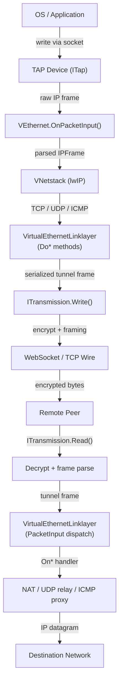
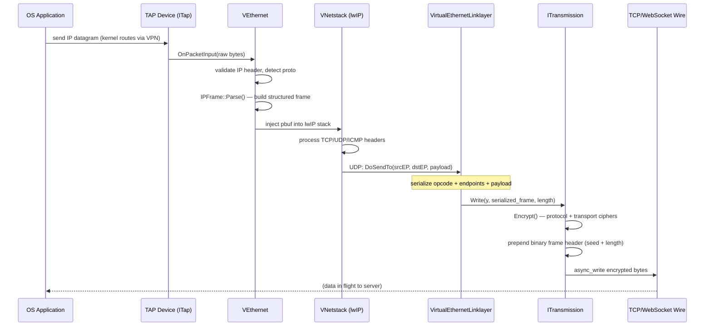
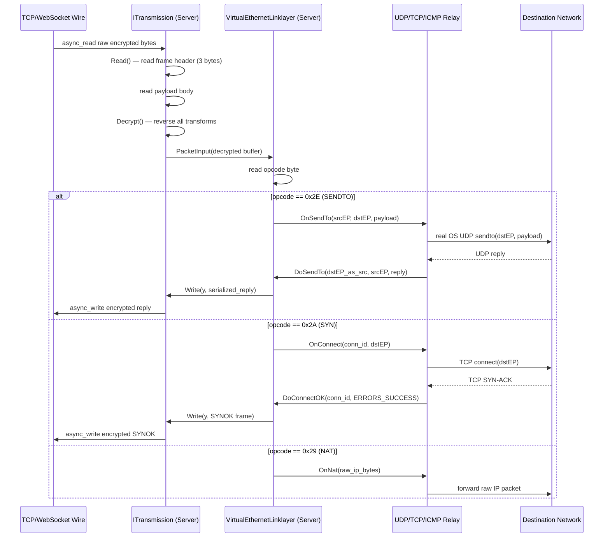
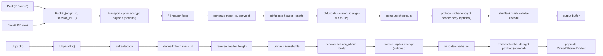
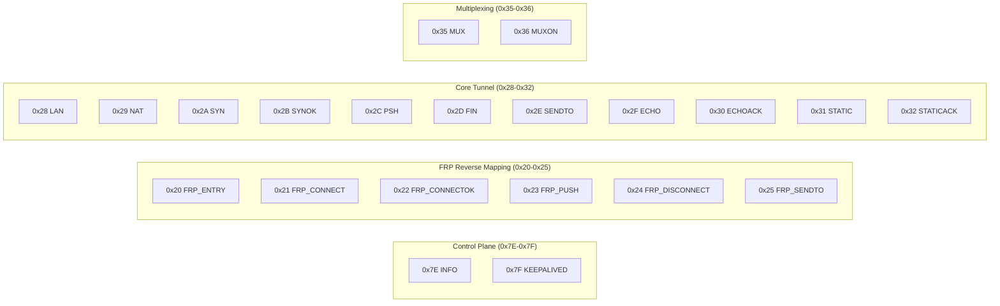
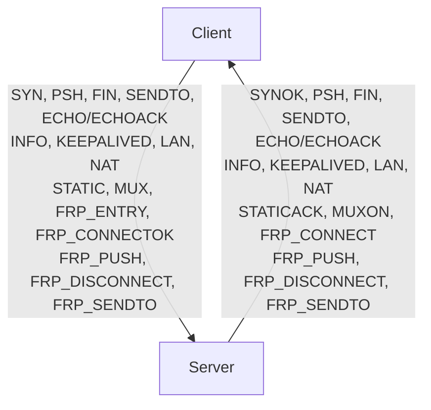
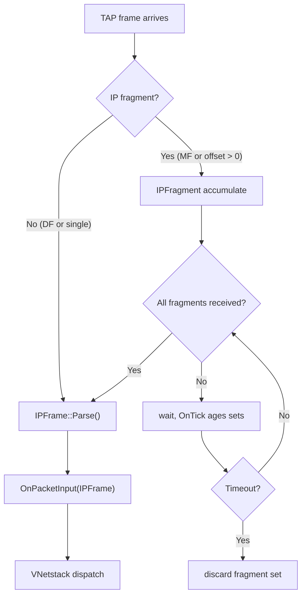

# Packet Complete Lifecycle — From TAP to Remote and Back

[中文版本](PACKET_LIFECYCLE_CN.md)

## 1. Overview

OPENPPP2 is a Layer-2/Layer-3 virtual Ethernet infrastructure. At its heart, it takes ordinary network packets that the operating system produces through a TAP device, wraps them in an encrypted tunnel protocol, transports them to a remote peer, and then injects the recovered packets into the destination network. Understanding the complete lifetime of a single packet — from the moment the kernel writes it to the TAP file descriptor until the final byte is delivered to the remote socket or back through a TAP on the other side — is the most important starting point for contributors.

### The "Virtual Ethernet Frame" Concept

In this system, every packet that travels between client and server is called a **virtual Ethernet frame**. The name reflects the design intent: the tunnel behaves like an Ethernet link that connects two endpoints regardless of the physical transport underneath. The virtual Ethernet frame carries a full IP datagram as its payload and adds only the metadata that the tunnel protocol requires: a session identifier, endpoint descriptors, and a protocol action opcode.

Unlike physical Ethernet, there is no MAC address in the virtual frame. The link-layer addressing is replaced by the session identifier negotiated during handshake and by the TCP/UDP endpoint pairs embedded in the tunnel frame header.

### Layer Architecture



The architecture has four distinct layers:

1. **Physical TAP layer** — The kernel-level virtual network adapter (`ITap`). The OS writes raw IP frames here and reads frames that the tunnel injects.
2. **Virtual Ethernet layer** — `VEthernet` owns the TAP, runs `VNetstack` (a lwIP-based TCP/IP stack), and dispatches parsed `IPFrame` objects upward.
3. **Tunnel transport layer** — `VirtualEthernetLinklayer` serializes and deserializes the protocol frames. `ITransmission` provides the encrypted, framed byte channel over WebSocket or plain TCP.
4. **Remote endpoint layer** — On the server side, the recovered packet is forwarded through real OS sockets to the destination host.

---

## 2. Client-side Packet TX Path (Outbound)

This section traces a single UDP packet sent by a local application through the tunnel to the server.

### 2.1 TAP Device Receives Frame from OS

When a local application sends a UDP datagram to an address routed through the VPN, the OS kernel routes it through the TAP network interface. The TAP driver delivers the raw Ethernet/IP frame to the user-space process via the TAP file descriptor.

`ITap` wraps this file descriptor and calls back into `VEthernet::OnPacketInput(Byte* packet, int packet_length, bool vnet)` for every received frame. The raw bytes at this point contain a complete IPv4 (or IPv6) header followed by the transport-layer payload.

### 2.2 VEthernet.OnPacketInput() Processing

`VEthernet` has three overloads of `OnPacketInput`:

- `OnPacketInput(Byte*, int, bool)` — raw bytes from TAP, called first.
- `OnPacketInput(ip_hdr*, int, int, int, bool)` — native IP header pointer after partial parse.
- `OnPacketInput(const shared_ptr<IPFrame>&)` — fully parsed frame.

The raw overload parses the IP version field. For IPv4, it validates header length, total length, and checksum, then calls the native-header overload. That overload inspects the `proto` field to determine the encapsulated protocol (TCP=6, UDP=17, ICMP=1), and if the packet is not fragmented, calls `IPFrame::Parse()` to construct a structured `IPFrame` object and dispatches the fully-parsed overload.

**Fragment reassembly**: If the IP fragment-offset or more-fragments flag indicates this is a fragment, the packet is held in `IPFragment` until all fragments arrive. Once reassembled, `IPFrame::Parse()` is called on the complete datagram.

### 2.3 VNetstack lwIP Protocol Stack Handling

`VNetstack` runs an embedded lwIP TCP/IP stack. When `VEthernet::OnPacketInput(IPFrame)` is called with a fully parsed frame, the frame's serialized bytes are injected into lwIP via its internal `pbuf` mechanism. lwIP processes the TCP/UDP/ICMP headers and calls registered callback hooks back into OPENPPP2.

For **UDP**, lwIP calls the UDP receive hook with source/destination endpoints and payload. The hook reconstructs a `UdpFrame` from the lwIP `pbuf`.

For **TCP**, lwIP manages the connection state machine and delivers reassembled data streams to the TCP session layer.

For **ICMP**, lwIP parses the ICMP header and delivers it to the ICMP handler via `IcmpFrame::Parse()`.

### 2.4 TCP/UDP/ICMP Packet Differentiation

After lwIP delivers the transport-layer payload, OPENPPP2 must determine which tunnel opcode to use:

| Protocol | Tunnel Opcode | Handler Function |
|----------|--------------|-----------------|
| TCP connect | `PacketAction_SYN` | `DoConnect()` |
| TCP data | `PacketAction_PSH` | `DoPush()` |
| TCP close | `PacketAction_FIN` | `DoDisconnect()` |
| UDP datagram | `PacketAction_SENDTO` | `DoSendTo()` |
| ICMP echo | `PacketAction_ECHO` | `DoEcho()` (payload form) |
| ICMP echo reply | `PacketAction_ECHOACK` | `DoEcho()` (ack-id form) |
| Raw IP / NAT | `PacketAction_NAT` | `DoNat()` |

### 2.5 VirtualEthernetLinklayer Packaging

`VirtualEthernetLinklayer` serializes the packet into a tunnel frame. Each `Do*` method constructs a binary buffer with the following logical structure:

- **Opcode byte** — one of the `PacketAction` enum values (see Section 5).
- **Protocol-specific fields** — connection ID, address type, host, port (for TCP); source EP + destination EP (for UDP); raw IP bytes (for NAT).
- **Payload bytes** — the transport-layer data.

For UDP (`DoSendTo`), the frame encodes:
1. Opcode = `0x2E` (`PacketAction_SENDTO`)
2. Source endpoint: address type (1 byte) + IPv4 address (4 bytes) + port (2 bytes), or domain form.
3. Destination endpoint: same encoding.
4. Payload bytes.

The fully serialized buffer is passed to `ITransmission::Write()`.

### 2.6 Encryption — ITransmission.Encrypt()

`ITransmission::Write(YieldContext& y, const void* packet, int packet_length)` calls `Encrypt()` internally before writing to the wire. Encryption uses the two-layer cipher architecture:

- **Protocol-layer cipher** (`protocol_`) — applied to header metadata (length field and related bytes).
- **Transport-layer cipher** (`transport_`) — applied to the payload body.

Both ciphers are `ppp::cryptography::Ciphertext` instances configured from the session key material established during handshake. If encryption is disabled, the bytes are written as-is.

After encryption, `ITransmission` prepends the binary frame header (seed byte + protected length field as described in `PACKET_FORMATS.md`) and passes the complete packet to the underlying transport.

### 2.7 WebSocket/TCP Frame Writing

The concrete `ITransmission` subclass (`WebSocketTransmission` or `TcpTransmission`) writes the framed, encrypted bytes to the TCP socket using Boost.Asio's `async_write`. The write is serialized through a `strand` so that concurrent coroutines do not interleave partial writes. Statistics are updated in `ITransmissionStatistics` and QoS tokens are consumed if a `ITransmissionQoS` object is attached.

### TX Path Sequence Diagram



---

## 3. Server-side Packet RX Path (Inbound from Client)

This section traces the same UDP packet arriving at the server side.

### 3.1 ITransmission.Read() — WebSocket/TCP Frame Reading

The server-side coroutine runs in a loop calling `ITransmission::Read(YieldContext& y, int& outlen)`. This method calls the pure-virtual `DoReadBytes()` of the concrete subclass, which issues `async_read` on the TCP/WebSocket socket and suspends the coroutine until data arrives.

The underlying transport reads the binary frame header first (3 bytes in post-handshake mode: one seed byte + two protected length bytes). It then reads the payload body whose length was encoded in the header.

### 3.2 Decryption — ITransmission.Decrypt()

After the raw bytes are read, `ITransmission::Read()` calls `Decrypt()`. Decryption reverses the transforms in the exact opposite order from encryption:

1. Delta-decode the 3-byte header.
2. Derive `header_kf` from the seed byte.
3. Unshuffle and XOR-unmask the two length bytes.
4. Decrypt the length field if protocol cipher is active.
5. Reconstruct the original payload length.
6. Unmask and unshuffle the payload.
7. Decrypt the payload body if transport cipher is active.

The result is the plaintext tunnel frame buffer that `VirtualEthernetLinklayer` serialized on the client side.

### 3.3 VirtualEthernetLinklayer.PacketInput() — Opcode Dispatch

`VirtualEthernetLinklayer::Run()` loops calling `ITransmission::Read()` and feeds each decrypted buffer to `PacketInput(transmission, p, packet_length, y)`.

`PacketInput` reads the first byte of the buffer as the opcode and dispatches to the corresponding `On*` virtual method:

```
switch (opcode):
  0x7E → OnInformation()
  0x7F → OnKeepAlived()   (internal, updates last_ timestamp)
  0x28 → OnLan()
  0x29 → OnNat()
  0x2A → OnConnect()
  0x2B → OnConnectOK()
  0x2C → OnPush()
  0x2D → OnDisconnect()
  0x2E → OnSendTo()
  0x2F → OnEcho()         (payload form)
  0x30 → OnEcho()         (ack-id form)
  0x31 → OnStatic()       (request)
  0x32 → OnStatic()       (acknowledgment)
  0x35 → OnMux()
  0x36 → OnMuxON()
  0x20 → OnFrpEntry()
  0x21 → OnFrpConnect()
  0x22 → OnFrpConnectOK()
  0x23 → OnFrpPush()
  0x24 → OnFrpDisconnect()
  0x25 → OnFrpSendTo()
```

### 3.4 IPv4/IPv6 Packet Handling

For opcodes that carry raw IP payloads (`PacketAction_NAT`), `OnNat()` receives the raw bytes. The server parses them with `IPFrame::Parse()` to recover the full IPv4 frame including source/destination addresses, TTL, and protocol type.

For UDP frames arriving via `PacketAction_SENDTO`, `OnSendTo()` receives already-decoded source and destination `udp::endpoint` objects plus the raw UDP payload — no IP parsing is needed.

### 3.5 Port Mapping (NAT), ICMP Proxy, UDP Relay

The concrete server runtime overrides the `On*` methods to implement forwarding:

**UDP relay (`OnSendTo`)**: The server opens a real OS UDP socket bound to an ephemeral local port. It sends the payload to `destinationEP` and waits for a reply. When the reply arrives, it calls `DoSendTo()` back toward the client with the reply payload and the original `destinationEP` as the new source. The server maintains a NAT table mapping `(session_id, client_srcEP, server_dstEP)` to the ephemeral socket so that reply packets are routed to the correct client.

**TCP relay (`OnConnect` / `OnPush` / `OnDisconnect`)**: `OnConnect()` opens a real TCP connection to `destinationEP`. Once established, `DoConnectOK(error=ERRORS_SUCCESS)` is sent back to the client. Subsequent `OnPush()` calls write data to the real socket; data read from the real socket is sent back as `DoPush()`. `OnDisconnect()` closes the real socket and `DoDisconnect()` notifies the client.

**ICMP proxy (`OnEcho`)**: The server constructs an ICMP echo request using `IcmpFrame::ToIp()`, sends it via a raw socket, and waits for the ICMP echo reply. The reply is forwarded to the client as `DoEcho(ack_id)`.

**LAN advertisement (`OnLan`)**: The server records the client's advertised subnet (`ip/mask`) for routing decisions.

### 3.6 Forwarding to Destination Network

After the relay socket delivers the payload to the destination host, any response travels back through the same relay path in reverse: the server reads the response from the real socket, serializes it into a tunnel frame using the appropriate `Do*` method, encrypts and writes it via `ITransmission::Write()`, and the client eventually receives it through `ITransmission::Read()`.

The client-side `On*` handlers recover the IP frame and inject it back into the TAP device via `VEthernet::Output()`. lwIP receives the frame, delivers the payload to the local socket that originally sent the request, and the OS application gets its response.

### RX Path Sequence Diagram



---

## 4. VirtualEthernetPacket Wire Format

### 4.1 Overview

`VirtualEthernetPacket` and its `Pack` / `Unpack` static methods define the **static packet format** used when the tunnel operates in static-path mode. This format is distinct from the normal binary frame format described in `PACKET_FORMATS.md`; it is a self-contained packet that encodes all endpoint metadata and session identity.

### 4.2 Logical Header Fields

Before any obfuscation, the static packet has the following logical fields:

| Offset | Size (bytes) | Field | Description |
|--------|-------------|-------|-------------|
| 0 | 1 | `mask_id` | Non-zero random byte; drives per-packet key factor `kf`. |
| 1 | 1 | `header_length` | Obfuscated total header length (before payload). |
| 2 | 4 | `session_id` | Signed 32-bit session identifier. Positive = UDP family, negative = IP family (stored as `~session_id`). |
| 6 | 2 | `checksum` | CRC/checksum covering header + payload after pack-time transforms. |
| 8 | 4 | `source_ip` | Pseudo source IPv4 address in network byte order. |
| 12 | 2 | `source_port` | Pseudo source UDP port in network byte order. |
| 14 | 4 | `destination_ip` | Pseudo destination IPv4 address in network byte order. |
| 18 | 2 | `destination_port` | Pseudo destination port in network byte order. |
| 20 | variable | payload body | Raw UDP data or raw IP datagram bytes. |

> **Note:** The actual on-wire layout after all transforms (shuffle, mask, delta-encode) does not match this table byte-for-byte. The table represents the logical layout before transformation.

### 4.3 ASCII Wire Format Representation

```
Byte offset (logical, before transforms):
  0        1        2        3        4        5        6        7
  ┌────────┬────────┬────────────────────────────────────────────┐
  │mask_id │hdr_len │            session_id (4 bytes)            │
  └────────┴────────┴────────────────────────────────────────────┘
  8        9        10       11       12       13       14       15
  ┌────────────────────────┬────────────────────────────────────┐
  │     checksum (2B)      │     source_ip (4 bytes)            │
  └────────────────────────┴────────────────────────────────────┘
  16       17       18       19       20       21
  ┌────────────────────────┬────────────────────────────────────┐
  │   source_port (2B)     │   destination_ip (4 bytes)         │
  └────────────────────────┴────────────────────────────────────┘
  22       23       24 ...
  ┌────────────────────────┬──────────────────────────────────  ┐
  │  destination_port (2B) │  payload body (variable length)    │
  └────────────────────────┴──────────────────────────────────  ┘
```

### 4.4 Session ID Encoding

The `session_id` field encodes both the packet family and the session identifier in a single signed 32-bit integer:

- **Positive value** (`session_id > 0`): UDP family. The session ID is stored directly.
- **Negative value** (`session_id < 0`): IP family. The stored value is the bitwise complement (`~session_id`) of the true session ID, which is always positive. The unpacker recovers the true ID by checking the sign and applying `~stored_value`.

This design avoids a separate family-discriminator byte while still being unambiguous.

### 4.5 PayloadSize Encoding

The payload length is not stored directly in the static header. It is derived as:

```
payload_length = total_packet_length - header_length
```

where `header_length` is recovered after reversing the `Lcgmod`-based obfuscation using the per-packet `kf`.

### 4.6 Pack / Unpack Call Flow



---

## 5. PacketAction Opcode Reference

All opcodes are defined in `VirtualEthernetLinklayer::PacketAction` in `VirtualEthernetLinklayer.h`.

### 5.1 Complete Opcode Table



### 5.2 Opcode Descriptions

| Opcode | Hex | Direction | Description |
|--------|-----|-----------|-------------|
| `PacketAction_INFO` | `0x7E` | Bidirectional | Session information and quota exchange. Carries `VirtualEthernetInformation` (bandwidth, expiry, IPv6 assignment) plus optional extension JSON. Sent once at session establishment and periodically for status updates. |
| `PacketAction_KEEPALIVED` | `0x7F` | Bidirectional | Periodic keep-alive heartbeat. The linklayer sends this automatically via `DoKeepAlived()` based on the `next_ka_` timer. Updates `last_` timestamp on receipt. |
| `PacketAction_FRP_ENTRY` | `0x20` | Client → Server | Registers a reverse port mapping (FRP) entry. Specifies protocol (TCP/UDP), direction (`in`), and remote port number. |
| `PacketAction_FRP_CONNECT` | `0x21` | Server → Client | Notifies the client that an external connection has arrived on the registered FRP port. Carries connection ID, direction, and remote port. |
| `PacketAction_FRP_CONNECTOK` | `0x22` | Client → Server | Acknowledges the FRP connection. Carries error code (`ERRORS_SUCCESS` or failure). |
| `PacketAction_FRP_PUSH` | `0x23` | Bidirectional | Streams payload data over an established FRP tunnel connection. |
| `PacketAction_FRP_DISCONNECT` | `0x24` | Bidirectional | Closes an FRP tunnel connection. Both sides may initiate closure. |
| `PacketAction_FRP_SENDTO` | `0x25` | Bidirectional | Delivers a UDP datagram over the FRP reverse path. Carries source endpoint and payload. |
| `PacketAction_LAN` | `0x28` | Bidirectional | LAN subnet advertisement. Encodes an IPv4 network address and subnet mask, informing the peer of a directly reachable subnet. |
| `PacketAction_NAT` | `0x29` | Bidirectional | Raw IP / NAT payload forwarding. The payload is a complete IPv4 datagram. Used when no higher-level demultiplexing is needed. |
| `PacketAction_SYN` | `0x2A` | Client → Server | TCP connect request. Encodes connection ID, destination address (IPv4, IPv6, or domain), and port. The server opens a real TCP connection to the destination. |
| `PacketAction_SYNOK` | `0x2B` | Server → Client | TCP connect acknowledgment. Encodes connection ID and error code. `ERRORS_SUCCESS` means the real TCP connection was established. |
| `PacketAction_PSH` | `0x2C` | Bidirectional | TCP stream payload data. Encodes connection ID and raw data bytes. Both client-to-server and server-to-client data use this opcode. |
| `PacketAction_FIN` | `0x2D` | Bidirectional | TCP connection teardown. Encodes connection ID. Either side may send FIN to signal that no more data will be sent on that connection. |
| `PacketAction_SENDTO` | `0x2E` | Bidirectional | UDP datagram with source and destination endpoint descriptors. The endpoint format supports IPv4, IPv6, and domain-name addressing via `AddressType`. |
| `PacketAction_ECHO` | `0x2F` | Bidirectional | Echo (latency probe) payload. When sent by client with raw payload bytes, the server measures RTT. Two overloads exist: payload form and ack-id form. |
| `PacketAction_ECHOACK` | `0x30` | Bidirectional | Echo acknowledgment by echo ID. Sent in reply to an `ECHO`; the ID links the reply to the original request for RTT measurement. |
| `PacketAction_STATIC` | `0x31` | Client → Server | Static port mapping query. Requests the server to supply static mapping information for a session. |
| `PacketAction_STATICACK` | `0x32` | Server → Client | Static port mapping acknowledgment. Returns session FSID (`Int128`), session ID, and the server-side remote port. |
| `PacketAction_MUX` | `0x35` | Client → Server | MUX channel setup request. Specifies VLAN tag, maximum sub-connections, and acceleration flag. |
| `PacketAction_MUXON` | `0x36` | Server → Client | MUX channel setup acknowledgment. Carries VLAN tag plus sequence and acknowledgment numbers for ordering. |

### 5.3 Direction Summary



---

## 6. Fragmentation and Reassembly

### 6.1 IPv4 Fragment Handling

IPv4 fragmentation is handled by `IPFragment` (declared in `ppp/net/packet/IPFragment.h` and referenced in `VEthernet.h`). `VEthernet` creates an `IPFragment` instance via the virtual factory method `NewFragment()`.

When `VEthernet::OnPacketInput(Byte*, int, bool)` receives a frame whose IP header has a non-zero fragment offset or has the more-fragments (MF) flag set, the frame is not dispatched immediately. Instead, it is handed to `IPFragment` for reassembly. `IPFragment` accumulates all fragments keyed by `(source_ip, destination_ip, identification, protocol)` and only calls back into `VEthernet` with a complete datagram once the last fragment (MF=0 with the highest offset) has arrived.

`IPFrame::Subpackages()` is the inverse operation: it splits an oversized `IPFrame` into MTU-compatible fragments for outbound transmission. Each fragment is assigned the original `Id` field (from `IPFrame::NewId()`), the correct fragment offset, and the MF flag is set on all but the last fragment.

### 6.2 MTU Considerations

The TAP device MTU is configured through `appsettings.json`. The default TAP MTU is typically 1500 bytes (standard Ethernet). The tunnel itself adds overhead:

- Transport-layer framing: 3-byte binary header (post-handshake).
- Link-layer opcode + endpoint descriptors: variable, typically 10–30 bytes for UDP, 3–7 bytes for TCP data.
- Encryption expansion: dependent on cipher; AES-based ciphers with padding can add up to 16 bytes.

An effective tunnel MTU of approximately **1440–1460 bytes** is typical. If the original packet exceeds this, `IPFrame::Subpackages()` fragments it before tunnel encapsulation. The remote side reassembles the fragments using `IPFragment` before injecting them back into the TAP.

### 6.3 Fragment Timeout

`IPFragment` ages incomplete fragment sets using the periodic `OnTick()` / `OnUpdate()` callbacks driven by `VEthernet`'s timer. Fragment sets that do not complete within the configured timeout (typically several seconds) are silently discarded, matching RFC 791 behavior.



---

## 7. Related Documents

| Document | Description |
|----------|-------------|
| [`PACKET_FORMATS.md`](PACKET_FORMATS.md) | Wire format and obfuscation transforms for transmission frames |
| [`LINKLAYER_PROTOCOL.md`](LINKLAYER_PROTOCOL.md) | Link-layer opcode protocol overview |
| [`TRANSMISSION.md`](TRANSMISSION.md) | ITransmission base class, handshake, cipher lifecycle |
| [`HANDSHAKE_SEQUENCE.md`](HANDSHAKE_SEQUENCE.md) | Session key exchange and handshake sequence |
| [`CLIENT_ARCHITECTURE.md`](CLIENT_ARCHITECTURE.md) | Client-side runtime and VEthernet wiring |
| [`SERVER_ARCHITECTURE.md`](SERVER_ARCHITECTURE.md) | Server-side runtime and relay wiring |
| [`TUNNEL_DESIGN.md`](TUNNEL_DESIGN.md) | End-to-end tunnel architecture and design rationale |
