# 数据包完整生命周期 — 从 TAP 到远端再回来

[English Version](PACKET_LIFECYCLE.md)

## 1. 概述

OPENPPP2 是一套二层/三层虚拟以太网基础设施。其核心逻辑是：将操作系统通过 TAP 设备产生的普通网络数据包，封装进加密隧道协议，传输到远端对等节点，再将还原后的数据包注入目标网络。理解单个数据包的完整生命周期——从内核将其写入 TAP 文件描述符的那一刻，到最终字节被投递至远端套接字或从对端 TAP 重新注入——是贡献者最重要的起点。

### "虚拟以太网帧"概念

在本系统中，在客户端与服务端之间传输的每个数据包都称为**虚拟以太网帧**。这一命名反映了设计意图：无论底层物理传输介质如何，隧道表现为连接两个端点的以太网链路。虚拟以太网帧以完整的 IP 数据报作为载荷，仅附加隧道协议所需的元数据：会话标识符、端点描述符以及协议动作操作码。

与物理以太网不同，虚拟帧中没有 MAC 地址。链路层寻址由握手协商的会话标识符以及嵌入在隧道帧头中的 TCP/UDP 端点对替代。

### 层次架构

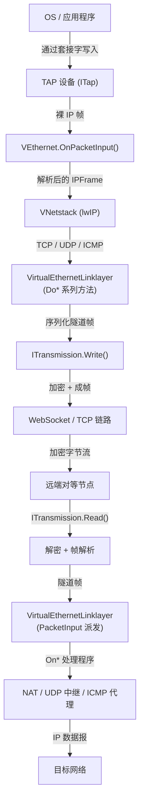

架构分为四个独立层次：

1. **物理 TAP 层** — 内核级虚拟网卡（`ITap`）。操作系统向此处写入裸 IP 帧，并读取隧道注入的帧。
2. **虚拟以太网层** — `VEthernet` 拥有 TAP 设备，运行 `VNetstack`（基于 lwIP 的 TCP/IP 栈），并将解析后的 `IPFrame` 对象向上分发。
3. **隧道传输层** — `VirtualEthernetLinklayer` 负责协议帧的序列化与反序列化。`ITransmission` 在 WebSocket 或普通 TCP 之上提供经过加密、成帧的字节通道。
4. **远端端点层** — 在服务端，还原后的数据包通过真实操作系统套接字转发至目标主机。

---

## 2. 客户端数据包发送路径（出站，TX Path）

本节以一个由本地应用程序发出、经隧道送至服务端的 UDP 数据包为例，逐步追踪其完整路径。

### 2.1 TAP 设备接收来自操作系统的帧

当本地应用程序向某个路由到 VPN 的地址发送 UDP 数据报时，操作系统内核将其路由至 TAP 虚拟网卡。TAP 驱动通过文件描述符将裸以太网/IP 帧投递给用户态进程。

`ITap` 封装了该文件描述符，每当收到帧时即回调 `VEthernet::OnPacketInput(Byte* packet, int packet_length, bool vnet)`。此时的字节流包含完整的 IPv4（或 IPv6）头部，后跟传输层载荷。

### 2.2 VEthernet.OnPacketInput() 处理

`VEthernet` 提供三个 `OnPacketInput` 重载：

- `OnPacketInput(Byte*, int, bool)` — 最先调用，接收来自 TAP 的裸字节。
- `OnPacketInput(ip_hdr*, int, int, int, bool)` — 部分解析后得到的原生 IP 头指针重载。
- `OnPacketInput(const shared_ptr<IPFrame>&)` — 完整解析后的帧对象重载。

裸字节重载解析 IP 版本字段，对 IPv4 则验证头部长度、总长度及校验和，然后调用原生头重载。原生头重载检查 `proto` 字段以确定封装的协议（TCP=6、UDP=17、ICMP=1），若数据包未分片则调用 `IPFrame::Parse()` 构建结构化的 `IPFrame` 对象，并派发至完整解析重载。

**分片重组**：若 IP 分片偏移或"更多分片"标志表明这是一个分片，该包将保存在 `IPFragment` 中，直到所有分片到齐后再调用 `IPFrame::Parse()`。

### 2.3 VNetstack lwIP 协议栈处理

`VNetstack` 运行嵌入式 lwIP TCP/IP 栈。当 `VEthernet::OnPacketInput(IPFrame)` 被调用时，帧的序列化字节通过 lwIP 内部的 `pbuf` 机制注入 lwIP。lwIP 处理 TCP/UDP/ICMP 头部，并通过已注册的回调钩子回调至 OPENPPP2。

- **UDP**：lwIP 调用 UDP 接收钩子，携带源/目的端点及载荷；钩子从 lwIP `pbuf` 重构 `UdpFrame`。
- **TCP**：lwIP 管理连接状态机，将重组后的数据流投递给 TCP 会话层。
- **ICMP**：lwIP 解析 ICMP 头并通过 `IcmpFrame::Parse()` 将其投递至 ICMP 处理程序。

### 2.4 TCP / UDP / ICMP 数据包分类

lwIP 投递传输层载荷后，OPENPPP2 需要决定使用哪种隧道操作码：

| 协议 | 隧道操作码 | 处理函数 |
|------|-----------|---------|
| TCP 连接 | `PacketAction_SYN` | `DoConnect()` |
| TCP 数据 | `PacketAction_PSH` | `DoPush()` |
| TCP 关闭 | `PacketAction_FIN` | `DoDisconnect()` |
| UDP 数据报 | `PacketAction_SENDTO` | `DoSendTo()` |
| ICMP Echo 请求 | `PacketAction_ECHO` | `DoEcho()`（载荷形式）|
| ICMP Echo 应答 | `PacketAction_ECHOACK` | `DoEcho()`（ack-id 形式）|
| 裸 IP / NAT | `PacketAction_NAT` | `DoNat()` |

### 2.5 VirtualEthernetLinklayer 封包

`VirtualEthernetLinklayer` 将数据包序列化为隧道帧。每个 `Do*` 方法构建一个包含以下逻辑结构的二进制缓冲区：

- **操作码字节** — `PacketAction` 枚举值之一（见第 5 节）。
- **协议专属字段** — 连接 ID、地址类型、主机名、端口（TCP）；源端点 + 目的端点（UDP）；裸 IP 字节（NAT）。
- **载荷字节** — 传输层数据。

以 UDP `DoSendTo` 为例，帧编码如下：
1. 操作码 = `0x2E`（`PacketAction_SENDTO`）
2. 源端点：地址类型（1 字节）+ IPv4 地址（4 字节）+ 端口（2 字节），或域名形式。
3. 目的端点：编码方式相同。
4. 载荷字节。

完整序列化缓冲区随后传递给 `ITransmission::Write()`。

### 2.6 加密 — ITransmission.Encrypt()

`ITransmission::Write(YieldContext& y, const void* packet, int packet_length)` 在写入链路之前在内部调用 `Encrypt()`。加密采用双层密码架构：

- **协议层密码**（`protocol_`） — 应用于头部元数据（长度字段及相关字节）。
- **传输层密码**（`transport_`） — 应用于载荷正文。

两个密码均为 `ppp::cryptography::Ciphertext` 实例，由握手阶段建立的会话密钥材料配置。若加密被禁用，字节将直接写入链路。

加密完成后，`ITransmission` 在前面添加二进制帧头（种子字节 + 受保护长度字段，详见 `PACKET_FORMATS.md`），并将完整数据包传递给底层传输。

### 2.7 WebSocket/TCP 帧写入

具体的 `ITransmission` 子类（`WebSocketTransmission` 或 `TcpTransmission`）使用 Boost.Asio 的 `async_write` 将成帧、加密后的字节写入 TCP 套接字。写操作通过 `strand` 序列化，防止并发协程产生部分写入交错。统计数据更新至 `ITransmissionStatistics`，若挂接了 `ITransmissionQoS` 对象则消耗 QoS 令牌。

### TX 路径时序图

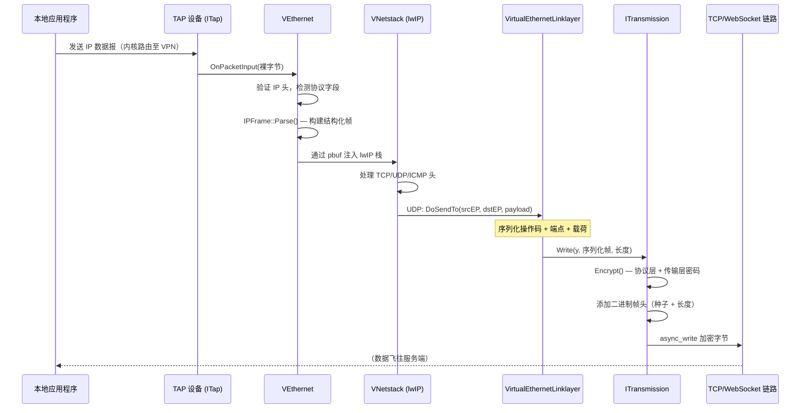

---

## 3. 服务端数据包接收路径（来自客户端，RX Path）

本节追踪同一 UDP 数据包到达服务端的完整路径。

### 3.1 ITransmission.Read() — WebSocket/TCP 帧读取

服务端协程在一个循环中调用 `ITransmission::Read(YieldContext& y, int& outlen)`。该方法调用具体子类的纯虚函数 `DoReadBytes()`，后者向 TCP/WebSocket 套接字发起 `async_read` 并挂起协程，直到数据到来。

底层传输先读取二进制帧头（握手后模式为 3 字节：1 个种子字节 + 2 个受保护长度字节），再读取头部中编码了长度的载荷正文。

### 3.2 解密 — ITransmission.Decrypt()

读取裸字节后，`ITransmission::Read()` 调用 `Decrypt()`。解密严格按照加密的逆序执行：

1. Delta 解码 3 字节帧头。
2. 从种子字节推导 `header_kf`。
3. 逆洗牌并 XOR 去掩码 2 个长度字节。
4. 若协议密码启用，则解密长度字段。
5. 重建原始载荷长度。
6. 去掩码并逆洗牌载荷。
7. 若传输密码启用，则解密载荷正文。

结果即为客户端 `VirtualEthernetLinklayer` 序列化的明文隧道帧缓冲区。

### 3.3 VirtualEthernetLinklayer.PacketInput() — 操作码派发

`VirtualEthernetLinklayer::Run()` 循环调用 `ITransmission::Read()`，将每个解密后的缓冲区送入 `PacketInput(transmission, p, packet_length, y)`。

`PacketInput` 读取缓冲区首字节作为操作码，并派发至对应的 `On*` 虚函数：

```
switch (操作码):
  0x7E → OnInformation()
  0x7F → OnKeepAlived()   （内部，更新 last_ 时间戳）
  0x28 → OnLan()
  0x29 → OnNat()
  0x2A → OnConnect()
  0x2B → OnConnectOK()
  0x2C → OnPush()
  0x2D → OnDisconnect()
  0x2E → OnSendTo()
  0x2F → OnEcho()         （载荷形式）
  0x30 → OnEcho()         （ack-id 形式）
  0x31 → OnStatic()       （请求）
  0x32 → OnStatic()       （应答）
  0x35 → OnMux()
  0x36 → OnMuxON()
  0x20 → OnFrpEntry()
  0x21 → OnFrpConnect()
  0x22 → OnFrpConnectOK()
  0x23 → OnFrpPush()
  0x24 → OnFrpDisconnect()
  0x25 → OnFrpSendTo()
```

### 3.4 IPv4/IPv6 数据包处理

对于携带裸 IP 载荷的操作码（`PacketAction_NAT`），`OnNat()` 接收裸字节，服务端使用 `IPFrame::Parse()` 解析，还原完整的 IPv4 帧，包含源/目的地址、TTL 及协议类型。

对于通过 `PacketAction_SENDTO` 到达的 UDP 帧，`OnSendTo()` 接收已解码的源和目的 `udp::endpoint` 对象以及裸 UDP 载荷，无需 IP 层解析。

### 3.5 端口映射（NAT）、ICMP 代理、UDP 中继

具体的服务端运行时覆盖 `On*` 方法以实现转发：

**UDP 中继（`OnSendTo`）**：服务端打开一个绑定到临时本地端口的真实 OS UDP 套接字，将载荷发送至 `destinationEP`，并等待应答。应答到来后调用 `DoSendTo()` 将应答载荷连同原始 `destinationEP`（作为新的源端点）回传给客户端。服务端维护一张 NAT 表，以 `(session_id, client_srcEP, server_dstEP)` 为键映射临时套接字，确保应答包路由至正确的客户端。

**TCP 中继（`OnConnect` / `OnPush` / `OnDisconnect`）**：`OnConnect()` 向 `destinationEP` 发起真实 TCP 连接。连接建立后，向客户端回送 `DoConnectOK(error=ERRORS_SUCCESS)`。后续 `OnPush()` 将数据写入真实套接字；从真实套接字读取的数据以 `DoPush()` 回传客户端。`OnDisconnect()` 关闭真实套接字并通过 `DoDisconnect()` 通知客户端。

**ICMP 代理（`OnEcho`）**：服务端使用 `IcmpFrame::ToIp()` 构造 ICMP Echo 请求，通过原始套接字发送，等待 ICMP Echo 应答。应答以 `DoEcho(ack_id)` 转发给客户端。

**LAN 广播（`OnLan`）**：服务端记录客户端广播的子网（`ip/mask`）以供路由决策使用。

### 3.6 转发至目标网络

中继套接字将载荷投递至目标主机后，任何响应都沿同一中继路径逆向传回：服务端从真实套接字读取响应，使用对应的 `Do*` 方法序列化为隧道帧，经 `ITransmission::Write()` 加密写出，客户端最终通过 `ITransmission::Read()` 接收。

客户端侧的 `On*` 处理程序还原 IP 帧，并通过 `VEthernet::Output()` 将其注入 TAP 设备。lwIP 接收该帧，将载荷投递至最初发送请求的本地套接字，操作系统应用程序即收到响应。

### RX 路径时序图

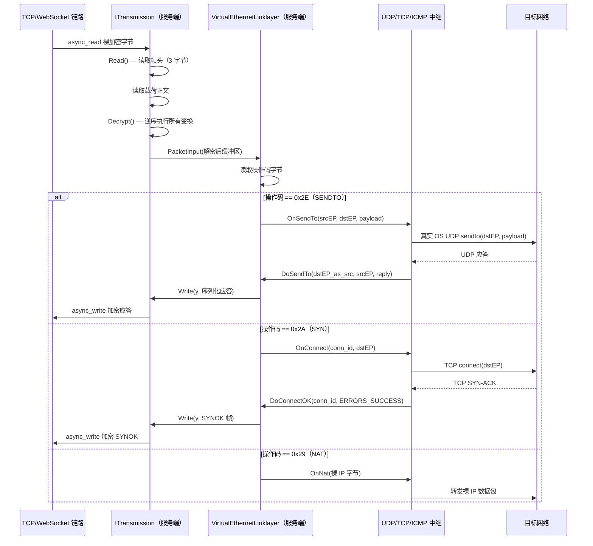

---

## 4. VirtualEthernetPacket 线缆格式（Wire Format）

### 4.1 概述

`VirtualEthernetPacket` 及其 `Pack` / `Unpack` 静态方法定义了隧道在**静态路径模式**下使用的**静态包格式**。该格式有别于 `PACKET_FORMATS.md` 中描述的普通二进制帧格式；它是一种自包含的数据包，内嵌所有端点元数据和会话身份信息。

### 4.2 逻辑头部字段

所有混淆变换施加之前，静态包的逻辑字段如下：

| 偏移 | 大小（字节） | 字段 | 描述 |
|------|------------|------|------|
| 0 | 1 | `mask_id` | 非零随机字节；驱动每包密钥因子 `kf`。 |
| 1 | 1 | `header_length` | 混淆后的头部总长度（载荷之前）。 |
| 2 | 4 | `session_id` | 带符号 32 位会话标识符。正值 = UDP 系列，负值 = IP 系列（存储为 `~session_id`）。 |
| 6 | 2 | `checksum` | 覆盖头部及载荷（经过封包时变换后）的校验和。 |
| 8 | 4 | `source_ip` | 伪源 IPv4 地址，网络字节序。 |
| 12 | 2 | `source_port` | 伪源 UDP 端口，网络字节序。 |
| 14 | 4 | `destination_ip` | 伪目的 IPv4 地址，网络字节序。 |
| 18 | 2 | `destination_port` | 伪目的端口，网络字节序。 |
| 20 | 可变 | 载荷正文 | 裸 UDP 数据或裸 IP 数据报字节。 |

> **注意：** 经过所有变换（洗牌、掩码、Delta 编码）后的实际线缆布局与该表不完全吻合。该表代表变换之前的逻辑布局。

### 4.3 ASCII 线缆格式示意

```
字节偏移（逻辑顺序，变换前）：
  0        1        2        3        4        5        6        7
  ┌────────┬────────┬────────────────────────────────────────────┐
  │mask_id │hdr_len │            session_id（4 字节）             │
  └────────┴────────┴────────────────────────────────────────────┘
  8        9        10       11       12       13       14       15
  ┌────────────────────────┬────────────────────────────────────┐
  │    checksum（2 字节）   │     source_ip（4 字节）             │
  └────────────────────────┴────────────────────────────────────┘
  16       17       18       19       20       21
  ┌────────────────────────┬────────────────────────────────────┐
  │  source_port（2 字节） │   destination_ip（4 字节）          │
  └────────────────────────┴────────────────────────────────────┘
  22       23       24 ...
  ┌────────────────────────┬──────────────────────────────────  ┐
  │ destination_port（2B） │  载荷正文（可变长度）               │
  └────────────────────────┴──────────────────────────────────  ┘
```

### 4.4 Session ID 编码

`session_id` 字段用单个带符号 32 位整数同时编码数据包系列和会话标识符：

- **正值**（`session_id > 0`）：UDP 系列。会话 ID 直接存储。
- **负值**（`session_id < 0`）：IP 系列。存储值为真实会话 ID 的按位取反（`~session_id`），真实 ID 始终为正。解包方通过检查符号并应用 `~stored_value` 还原真实 ID。

该设计在不引入额外系列判别字节的前提下保持无歧义性。

### 4.5 PayloadSize 编码

载荷长度不直接存储于静态头部，而是推导得出：

```
payload_length = total_packet_length - header_length
```

其中 `header_length` 在使用每包 `kf` 逆转基于 `Lcgmod` 的混淆后还原。

### 4.6 Pack / Unpack 调用流程

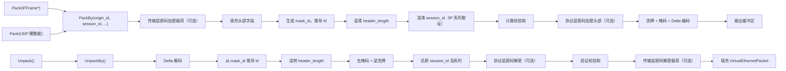

---

## 5. PacketAction 操作码参考

所有操作码定义在 `VirtualEthernetLinklayer.h` 中的 `VirtualEthernetLinklayer::PacketAction` 枚举内。

### 5.1 完整操作码表

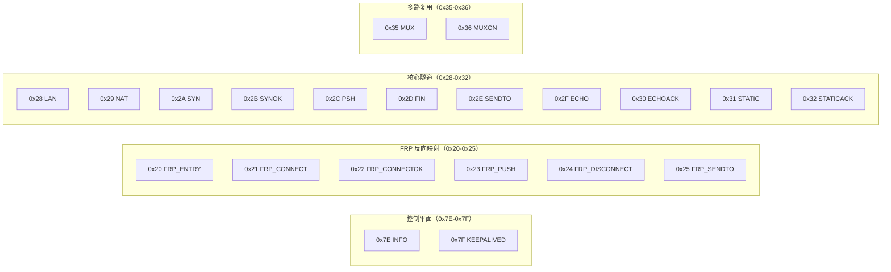

### 5.2 操作码详细说明

| 操作码 | 十六进制 | 方向 | 描述 |
|--------|---------|------|------|
| `PacketAction_INFO` | `0x7E` | 双向 | 会话信息与配额交换。携带 `VirtualEthernetInformation`（带宽、到期时间、IPv6 分配）及可选扩展 JSON。在会话建立时发送一次，此后定期发送用于状态更新。 |
| `PacketAction_KEEPALIVED` | `0x7F` | 双向 | 周期性心跳保活。链路层根据 `next_ka_` 定时器通过 `DoKeepAlived()` 自动发送。收到时更新 `last_` 时间戳。 |
| `PacketAction_FRP_ENTRY` | `0x20` | 客户端→服务端 | 注册反向端口映射（FRP）条目。指定协议（TCP/UDP）、方向（`in`）及远端端口号。 |
| `PacketAction_FRP_CONNECT` | `0x21` | 服务端→客户端 | 通知客户端有外部连接抵达已注册的 FRP 端口。携带连接 ID、方向及远端端口。 |
| `PacketAction_FRP_CONNECTOK` | `0x22` | 客户端→服务端 | 确认 FRP 连接。携带错误码（`ERRORS_SUCCESS` 或失败码）。 |
| `PacketAction_FRP_PUSH` | `0x23` | 双向 | 在已建立的 FRP 隧道连接上流式传输载荷数据。 |
| `PacketAction_FRP_DISCONNECT` | `0x24` | 双向 | 关闭 FRP 隧道连接。双方均可发起关闭。 |
| `PacketAction_FRP_SENDTO` | `0x25` | 双向 | 通过 FRP 反向路径投递 UDP 数据报。携带源端点及载荷。 |
| `PacketAction_LAN` | `0x28` | 双向 | LAN 子网广播。编码 IPv4 网络地址和子网掩码，向对端通告可直达的子网。 |
| `PacketAction_NAT` | `0x29` | 双向 | 裸 IP / NAT 载荷转发。载荷为完整 IPv4 数据报。用于无需更高层解复用的场景。 |
| `PacketAction_SYN` | `0x2A` | 客户端→服务端 | TCP 连接请求。编码连接 ID、目的地址（IPv4、IPv6 或域名）及端口。服务端向目的地建立真实 TCP 连接。 |
| `PacketAction_SYNOK` | `0x2B` | 服务端→客户端 | TCP 连接确认。编码连接 ID 及错误码。`ERRORS_SUCCESS` 表示真实 TCP 连接已建立。 |
| `PacketAction_PSH` | `0x2C` | 双向 | TCP 流数据。编码连接 ID 及裸数据字节。客户端到服务端及服务端到客户端的数据均使用该操作码。 |
| `PacketAction_FIN` | `0x2D` | 双向 | TCP 连接拆除。编码连接 ID。任意一方均可发送 FIN 以表示该连接不再有数据发送。 |
| `PacketAction_SENDTO` | `0x2E` | 双向 | 携带源和目的端点描述符的 UDP 数据报。端点格式通过 `AddressType` 支持 IPv4、IPv6 及域名寻址。 |
| `PacketAction_ECHO` | `0x2F` | 双向 | Echo（延迟探测）载荷。客户端发送裸载荷字节时，服务端测量 RTT。有载荷和 ack-id 两种重载。 |
| `PacketAction_ECHOACK` | `0x30` | 双向 | 按 Echo ID 应答。作为 `ECHO` 的回复发送；ID 将应答与原始请求关联以测量 RTT。 |
| `PacketAction_STATIC` | `0x31` | 客户端→服务端 | 静态端口映射查询。请求服务端为某会话提供静态映射信息。 |
| `PacketAction_STATICACK` | `0x32` | 服务端→客户端 | 静态端口映射应答。返回会话 FSID（`Int128`）、会话 ID 及服务端远端端口。 |
| `PacketAction_MUX` | `0x35` | 客户端→服务端 | MUX 通道建立请求。指定 VLAN 标签、最大子连接数及加速标志。 |
| `PacketAction_MUXON` | `0x36` | 服务端→客户端 | MUX 通道建立确认。携带 VLAN 标签以及用于排序的序列号和确认号。 |

### 5.3 方向汇总

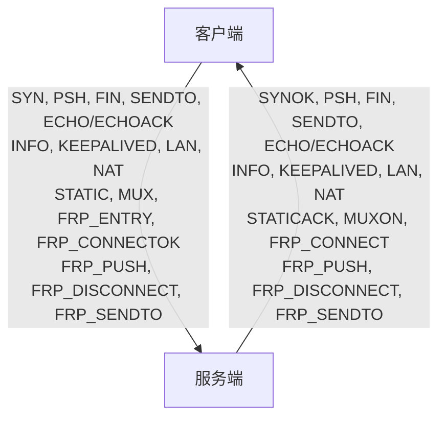

---

## 6. 分片与重组

### 6.1 IPv4 分片处理

IPv4 分片由 `IPFragment`（在 `ppp/net/packet/IPFragment.h` 中声明，在 `VEthernet.h` 中引用）处理。`VEthernet` 通过虚工厂方法 `NewFragment()` 创建 `IPFragment` 实例。

当 `VEthernet::OnPacketInput(Byte*, int, bool)` 接收到 IP 头中分片偏移非零或"更多分片"（MF）标志置位的帧时，该帧不会立即派发，而是交给 `IPFragment` 进行重组。`IPFragment` 以 `(source_ip, destination_ip, identification, protocol)` 为键累积所有分片，只有当最后一个分片（MF=0 且偏移最大）到达后，才回调 `VEthernet` 并传入完整的数据报。

`IPFrame::Subpackages()` 是逆向操作：将过大的 `IPFrame` 分割为符合 MTU 的分片用于出站传输。每个分片分配原始 `Id` 字段（来自 `IPFrame::NewId()`），设置正确的分片偏移，并在除最后一个分片之外的所有分片上置 MF 标志。

### 6.2 MTU 考量

TAP 设备的 MTU 通过 `appsettings.json` 配置，默认通常为 1500 字节（标准以太网 MTU）。隧道自身引入额外开销：

- 传输层成帧：握手后模式 3 字节二进制帧头。
- 链路层操作码 + 端点描述符：可变，UDP 通常 10–30 字节，TCP 数据 3–7 字节。
- 加密膨胀：取决于密码算法；基于 AES 带填充的密码最多增加 16 字节。

有效隧道 MTU 通常约为 **1440–1460 字节**。若原始数据包超过此值，`IPFrame::Subpackages()` 会在隧道封装前进行分片。远端使用 `IPFragment` 重组分片后再注入 TAP。

### 6.3 分片超时

`IPFragment` 通过 `VEthernet` 定时器驱动的周期性 `OnTick()` / `OnUpdate()` 回调对未完成的分片集进行老化处理。在配置的超时时间（通常数秒）内未完成的分片集将被静默丢弃，与 RFC 791 行为一致。

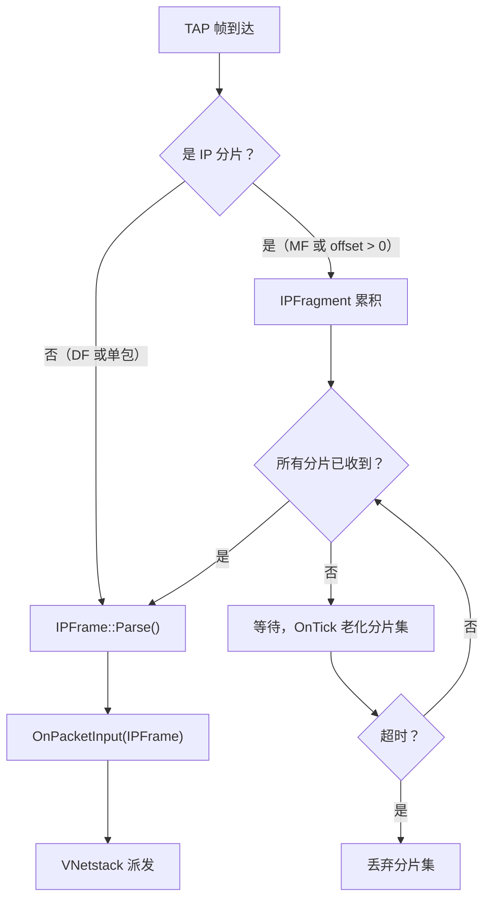

---

## 7. 相关文档

| 文档 | 描述 |
|------|------|
| [`PACKET_FORMATS.md`](PACKET_FORMATS.md) | 传输帧的线缆格式与混淆变换 |
| [`LINKLAYER_PROTOCOL.md`](LINKLAYER_PROTOCOL.md) | 链路层操作码协议概述 |
| [`TRANSMISSION.md`](TRANSMISSION.md) | ITransmission 基类、握手、密码生命周期 |
| [`HANDSHAKE_SEQUENCE.md`](HANDSHAKE_SEQUENCE.md) | 会话密钥交换与握手序列 |
| [`CLIENT_ARCHITECTURE.md`](CLIENT_ARCHITECTURE.md) | 客户端运行时与 VEthernet 连接 |
| [`SERVER_ARCHITECTURE.md`](SERVER_ARCHITECTURE.md) | 服务端运行时与中继连接 |
| [`TUNNEL_DESIGN.md`](TUNNEL_DESIGN.md) | 端到端隧道架构与设计理念 |

---

## 8. 返回路径 — 服务端到客户端（完整入站流程）

前述章节涵盖了出站路径（客户端 TX）和服务端接收转发逻辑。本节通过追踪从目标网络返回至客户端应用程序的回程，补全完整的数据流闭环。

### 8.1 目标网络响应到达服务端中继套接字

服务端中继套接字（UDP 或 TCP）将原始数据包转发至目标主机并收到响应后，响应字节通过中继套接字的异步读完成回调获得。中继处理器（覆盖了 `OnSendTo` 或 TCP 数据路径）读取响应载荷，并将其传递给服务端 `VirtualEthernetLinklayer` 上对应的 `Do*` 序列化器。

对于 UDP，服务端调用 `DoSendTo(original_client_src_ep, destination_ep_as_new_src, reply_payload)`。这将序列化一个 `PacketAction_SENDTO`（操作码 `0x2E`）帧，其中：
- 源端点 = 目标主机的地址（服务端中继通过 UDP `recvfrom` 结果得知）
- 目标端点 = 原始客户端源端点（客户端在 VPN 内的虚拟 IP 和端口）

### 8.2 服务端 ITransmission.Write()

服务端调用 `ITransmission::Write(y, serialized_frame, length)`。加密路径与客户端 TX 加密路径完全相同：协议密码覆盖头部，传输密码覆盖载荷。二进制帧头部（种子字节 + 混淆长度）被前置。

加密后的字节通过与客户端连接的服务端 TCP 或 WebSocket 套接字的 `async_write` 发送。

### 8.3 客户端 ITransmission.Read() 接收响应

在客户端，挂起于 `ITransmission::Read()` 的读循环协程在数据到达时被恢复。它读取二进制帧头部、读取载荷体，并调用 `Decrypt()` 逆向所有变换。

还原后的缓冲区即为服务端序列化的明文 `DoSendTo` 帧。

### 8.4 客户端 VirtualEthernetLinklayer.OnSendTo()

`PacketInput` 读取操作码 `0x2E` 并派发至 `OnSendTo(srcEP, dstEP, payload)`。在客户端侧：

1. 反序列化 `srcEP`（目标主机的真实地址）和 `dstEP`（本地应用程序正在等待的虚拟 IP:端口）。
2. 构造一个 UDP 数据报：src=`srcEP`，dst=`dstEP`，载荷=响应字节。
3. 将 `UdpFrame` 序列化回 `IPFrame`（完整的 IPv4 头部 + UDP 头部 + 载荷）。
4. 将 `IPFrame` 字节传递至 `VEthernet::Output()`。

### 8.5 VEthernet.Output() — 注回 TAP

`VEthernet::Output(IPFrame)` 将 `IPFrame` 序列化为原始字节并调用 `ITap::Output(bytes, length)`。`ITap::Output` 将字节写入 TAP 文件描述符。操作系统内核从 TAP 侧读取，并将数据包投递至虚拟网卡接口。

由于数据包的目标 IP 与本地应用程序绑定套接字一致，内核 IP 栈通过 UDP 或 TCP 套接字将数据包路由至本地进程。应用程序读取响应，如同直接来自目标主机——隧道对应用层完全透明。

### 完整返回路径时序图

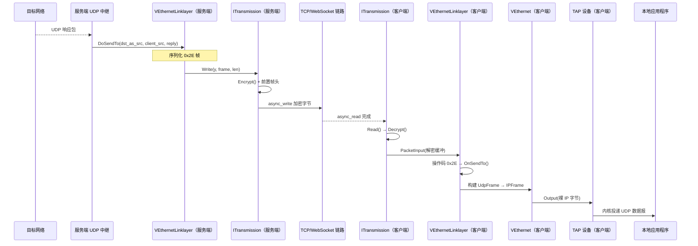

---

## 9. 隧道内 TCP 会话生命周期

TCP 会话比 UDP 更为复杂，因为它是有状态的。隧道必须从 `SYN` 经数据交换到 `FIN` 全程跟踪连接状态。

### 9.1 连接建立（SYN / SYNOK）

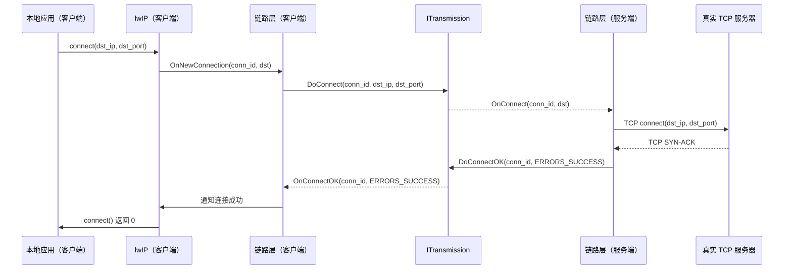

`conn_id` 是一个会话级 32 位连接标识符，由客户端在 `OnNewConnection` 触发时分配，在连接生命周期内用于多路复用同一 VPN 会话中的多个并发 TCP 连接。

### 9.2 数据传输（PSH）

连接建立后，数据使用操作码 `0x2C`（`PacketAction_PSH`）双向流动：

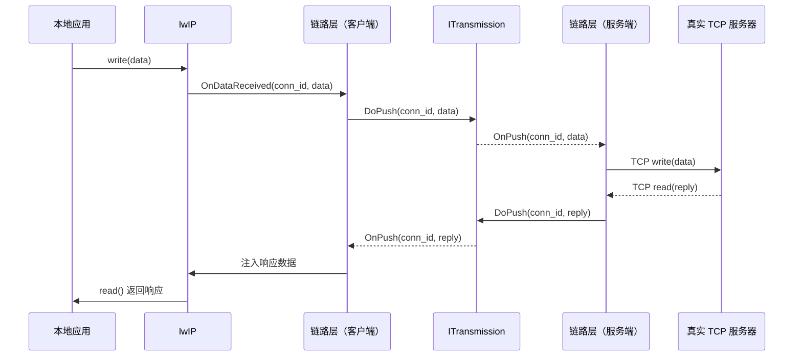

### 9.3 连接拆除（FIN）

任意一侧均可通过发送操作码 `0x2D`（`PacketAction_FIN`）发起拆除：

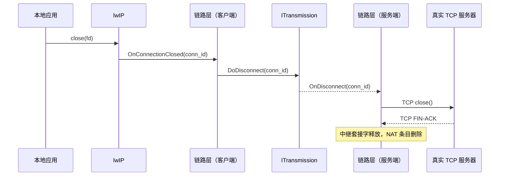

若真实服务器先关闭连接，服务端中继检测到 TCP EOF，向客户端调用 `DoDisconnect(conn_id)`，客户端 lwIP 栈通过虚拟套接字通知本地应用程序。

### 9.4 连接 ID 管理

连接 ID 由客户端在每个会话内通过单调递增计数器（带回绕）分配。服务端中继 NAT 表将 `(session_id, conn_id)` 映射至中继套接字。`OnDisconnect` 触发时，NAT 条目被删除，中继套接字被关闭。

该表存储在 `VirtualEthernetExchanger`（服务端）和 `VEthernetExchanger`（客户端）中。两者均通过 `shared_ptr` 进行引用计数，确保残留的中继套接字不会比会话对象存活更长时间。

---

## 10. ICMP Echo 代理生命周期

ICMP echo（ping）请求通过专用 ICMP 代理路径处理，而非通用 NAT 机制。

### 10.1 客户端侧 ICMP 处理

当 lwIP 处理虚拟栈内来自本地应用程序（执行 `ping`）的 ICMP echo 请求时，调用 OPENPPP2 的 ICMP 钩子：

1. 从 `IPFrame::icmp_hdr` 指针解析 `IcmpFrame`。
2. 分配一个 `echo_id` 用于关联。
3. 调用 `DoEcho(echo_id, payload_bytes)` 以操作码 `0x2F` 向服务端发送。

### 10.2 服务端侧 ICMP 转发

服务端的 `OnEcho()` 接收 `echo_id` 和载荷，然后：

1. 使用 `IcmpFrame::ToIp()` 构造 ICMP echo 请求。
2. 通过原始 ICMP 套接字发送至目标 IP。
3. 在待响应表中注册 `echo_id`。
4. 异步等待 ICMP echo 响应。

响应到达后，服务端以 ack-id 形式（操作码 `0x30`）调用 `DoEcho(echo_id)` 返回给客户端。

### 10.3 客户端侧响应注入

客户端的 `OnEcho(echo_id)` 通过 `echo_id` 查找待处理请求，重建 ICMP echo 响应帧，并通过 `VEthernet::Output()` 将其注入 TAP。本地 `ping` 应用程序收到响应，如同直接来自目标主机。

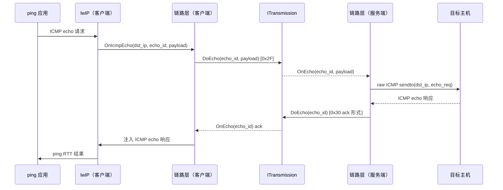

---

## 11. QoS 与统计集成

### 11.1 ITransmissionQoS

`ITransmission` 可选地持有一个 `ITransmissionQoS` 对象（通过 `SetQoS()` 设置）。当 QoS 附加时：

- `Write()` 在写入前消耗带宽令牌。若令牌不足，协程挂起，直到补充定时器重新填充令牌桶。
- 令牌桶补充速率来自 `appsettings.json` 的 `bandwidth` 字段（字节/秒）。
- QoS 按会话执行：每个 `ITransmission` 拥有独立的令牌桶。

### 11.2 ITransmissionStatistics

`ITransmissionStatistics` 跟踪每会话计数器：

| 计数器 | 描述 |
|--------|------|
| `TotalOutgoingBytes` | 写入线缆的原始字节数（含头部）|
| `TotalIncomingBytes` | 从线缆读取的原始字节数 |
| `TotalOutgoingPackets` | `Write()` 调用次数 |
| `TotalIncomingPackets` | `Read()` 调用次数 |

这些计数器向 TUI 状态展示和 `VirtualEthernetInformation` 配额报告机制提供数据。

### 11.3 数据包丢弃点

数据包可能在生命周期的多个阶段被静默丢弃：

| 丢弃点 | 条件 | 动作 |
|--------|------|------|
| `VEthernet::OnPacketInput` | IP 头部无效（校验和、版本、长度）| 丢弃，不设错误码 |
| `VEthernet::OnPacketInput` | 防火墙规则命中 | 丢弃，`FirewallSegmentBlocked` 或 `FirewallDomainBlocked` |
| `IPFragment` | 分片集超时 | 丢弃，不通知应用 |
| `VirtualEthernetLinklayer::PacketInput` | 未知操作码字节 | 丢弃，`ProtocolPacketActionInvalid` |
| `ITransmission::Read` | 校验和 / 解密失败 | 丢弃，`ProtocolDecodeFailed` |
| QoS 令牌桶 | 令牌耗尽（丢弃策略）| 丢弃，`GenericRateLimited` |
| 服务端中继 | 目标不可达 | DoDisconnect 或携带错误的 DoSendTo |

---

## 12. MUX（多路复用器）通道

### 12.1 用途

MUX 功能允许多个逻辑子连接共享单个 `ITransmission` 实例，减少为每个新数据流单独建立 TCP/WebSocket 连接的开销。通过 `PacketAction_MUX`（`0x35`）和 `PacketAction_MUXON`（`0x36`）操作码协商。

### 12.2 协商流程

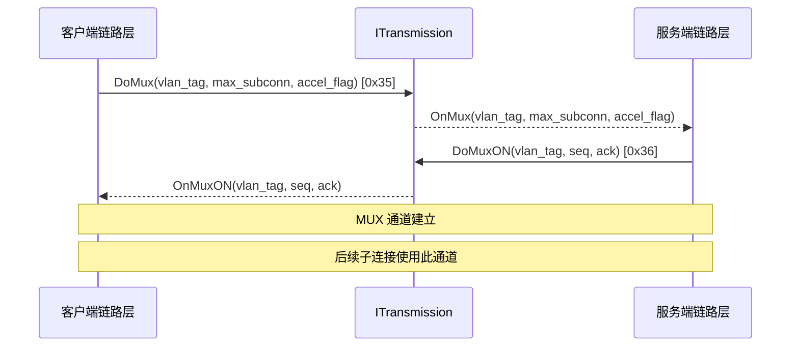

### 12.3 VLAN 标签与子连接解复用

MUX 通道内的每个子连接由以下信息标识：
- **VLAN 标签**（通道建立时协商）用于标识通道
- **连接 ID**（与常规 TCP 会话相同的 `conn_id` 方案）

服务端 `OnMux` 处理器在会话的 MUX 表中注册 VLAN 标签。后续携带匹配 VLAN 标签的 `SYN` 帧通过多路复用通道路由，而不是开启新的传输连接。

---

## 13. FRP（弹性反向代理）数据包流程

### 13.1 概述

FRP 功能允许外部客户端连接至 OPENPPP2 服务端上的某个端口，并将该连接通过隧道反向传回 VPN 客户端本地网络上运行的服务。这是普通隧道方向的逆向操作。

### 13.2 FRP 注册

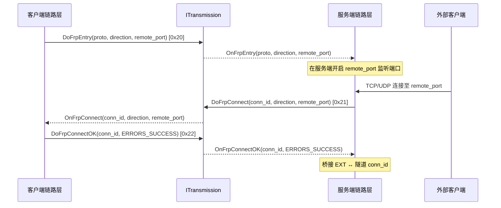

### 13.3 FRP 数据流

建立后，FRP 数据使用以下操作码双向流动：
- `PacketAction_FRP_PUSH`（`0x23`）— 承载 FRP 连接的 TCP 流数据
- `PacketAction_FRP_SENDTO`（`0x25`）— 承载 FRP 连接的 UDP 数据报
- `PacketAction_FRP_DISCONNECT`（`0x24`）— 拆除 FRP 连接

数据流在结构上与普通 `PSH`/`SENDTO`/`FIN` 流程完全相同，但使用专用 FRP 操作码，以便服务端路由能区分 FRP 连接与普通 VPN 连接。

---

## 14. 静态模式 — 直接 IP 层转发

### 14.1 静态模式的使用场景

静态模式绕过常规 TCP/UDP/ICMP 解复用，使用 `PacketAction_NAT`（`0x29`）将原始 IP 帧直接通过隧道发送。适用于：

- 既不是 TCP 也不是 UDP 的协议（如 GRE、ESP 及其他 IP 协议）
- 服务端对目标有直接 L3 访问且无需 NAT 的场景
- 跳过 lwIP 开销的诊断或透传场景

### 14.2 静态数据包查询/确认

在对某会话使用静态模式之前，客户端可发送 `PacketAction_STATIC`（`0x31`）查询：

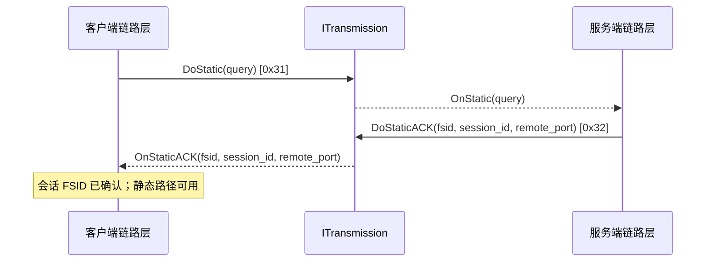

`fsid` 是一个 128 位会话 FSID（`Int128`），唯一标识静态流。`remote_port` 是服务端用于静态路径套接字的端口。

### 14.3 NAT 数据包流程

静态模式激活后，IP 帧无需协议级解复用即可转发：

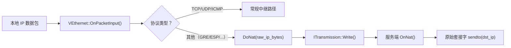

---

## 15. 源码参考索引

下表将每个生命周期阶段映射至对应的源文件和函数：

| 阶段 | 源文件 | 函数 / 方法 |
|------|--------|-----------|
| TAP 接收循环 | `linux/ppp/tap/TapLinux.cpp` | `AsynchronousReadPacketLoops()` |
| TAP 接收循环（Windows）| `windows/ppp/tap/TapWindows.cpp` | `AsynchronousReadPacketLoops()` |
| 裸帧派发 | `ppp/ethernet/VEthernet.cpp` | `OnPacketInput(Byte*, int, bool)` |
| IP 头部解析 + 分片检查 | `ppp/ethernet/VEthernet.cpp` | `OnPacketInput(ip_hdr*, int, int, int, bool)` |
| 分片累积 | `ppp/net/packet/IPFragment.cpp` | `Input()` / `OnUpdate()` |
| lwIP 注入 | `ppp/ethernet/VNetstack.cpp` | `Input(pbuf*)` |
| UDP 钩子 | `ppp/ethernet/VNetstack.cpp` | `udp_recv_fn` 回调 |
| TCP 钩子 | `ppp/ethernet/VNetstack.cpp` | `tcp_recv_fn` / `tcp_sent_fn` 回调 |
| ICMP 钩子 | `ppp/ethernet/VNetstack.cpp` | `raw_recv_fn` 回调 |
| 序列化 UDP 帧 | `ppp/app/protocol/VirtualEthernetLinklayer.cpp` | `DoSendTo()` |
| 序列化 TCP 连接 | `ppp/app/protocol/VirtualEthernetLinklayer.cpp` | `DoConnect()` |
| 序列化 TCP 数据 | `ppp/app/protocol/VirtualEthernetLinklayer.cpp` | `DoPush()` |
| 序列化 TCP 关闭 | `ppp/app/protocol/VirtualEthernetLinklayer.cpp` | `DoDisconnect()` |
| 序列化 ICMP echo | `ppp/app/protocol/VirtualEthernetLinklayer.cpp` | `DoEcho()` |
| 序列化裸 IP（NAT）| `ppp/app/protocol/VirtualEthernetLinklayer.cpp` | `DoNat()` |
| 加密 + 帧写入 | `ppp/transmissions/ITransmission.cpp` | `Write()` / `Encrypt()` |
| WebSocket 异步写 | `ppp/transmissions/IWebsocketTransmission.cpp` | `DoWriteBytes()` |
| TCP 异步写 | `ppp/transmissions/ITcpipTransmission.cpp` | `DoWriteBytes()` |
| 帧读取 + 解密 | `ppp/transmissions/ITransmission.cpp` | `Read()` / `Decrypt()` |
| 操作码派发 | `ppp/app/protocol/VirtualEthernetLinklayer.cpp` | `PacketInput()` |
| 服务端 UDP 中继 | `ppp/app/server/VirtualEthernetExchanger.cpp` | `OnSendTo()` |
| 服务端 TCP 中继 | `ppp/app/server/VirtualEthernetExchanger.cpp` | `OnConnect()` / `OnPush()` / `OnDisconnect()` |
| 服务端 ICMP 代理 | `ppp/app/server/VirtualEthernetExchanger.cpp` | `OnEcho()` |
| 客户端响应注入 | `ppp/app/client/VEthernetExchanger.cpp` | `OnSendTo()` / `OnPush()` |
| TAP 回写 | `ppp/ethernet/VEthernet.cpp` | `Output(IPFrame)` |
| TAP fd 写入 | `linux/ppp/tap/TapLinux.cpp` | `Output(Byte*, int)` |
| 静态数据包打包 | `ppp/app/protocol/VirtualEthernetPacket.cpp` | `Pack()` / `PackBy()` |
| 静态数据包解包 | `ppp/app/protocol/VirtualEthernetPacket.cpp` | `Unpack()` / `UnpackBy()` |
