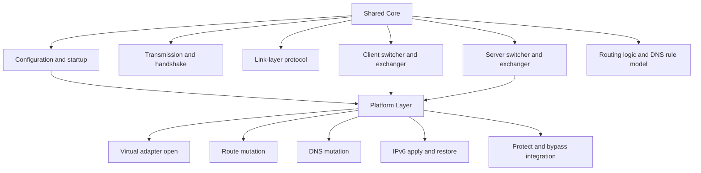
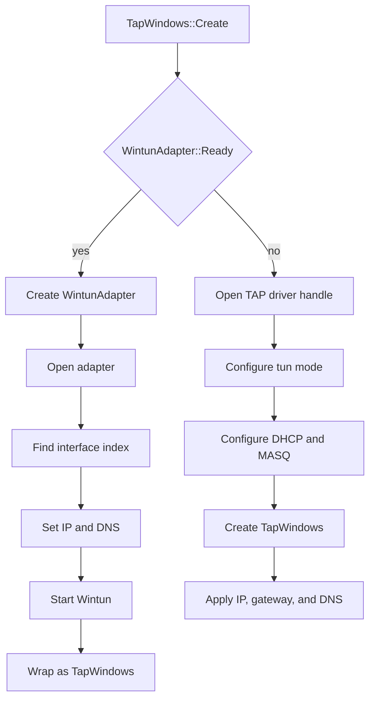
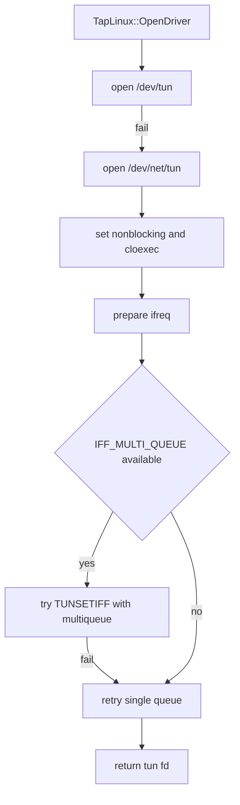
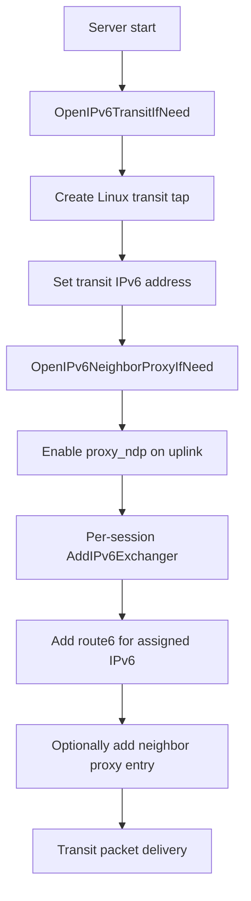
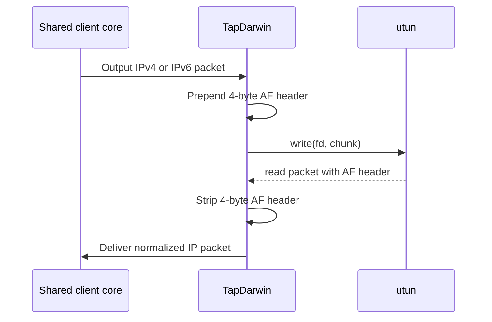
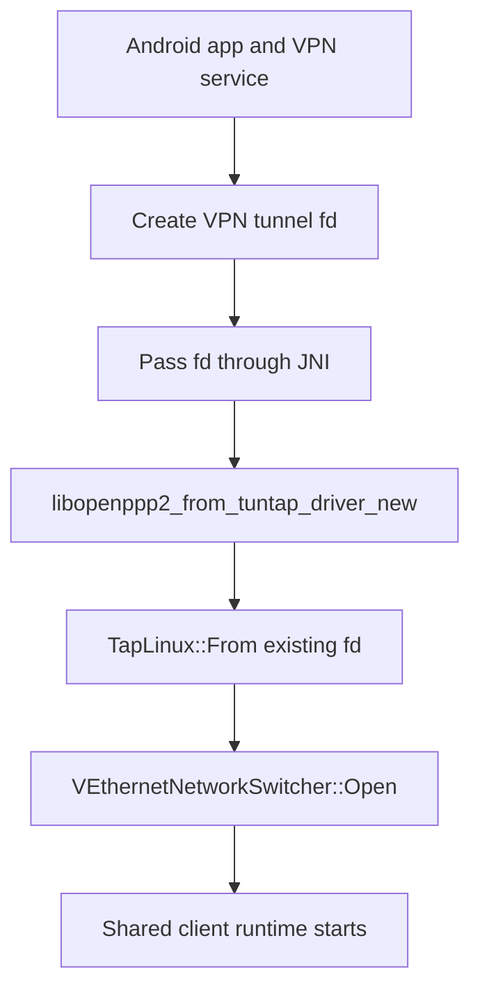
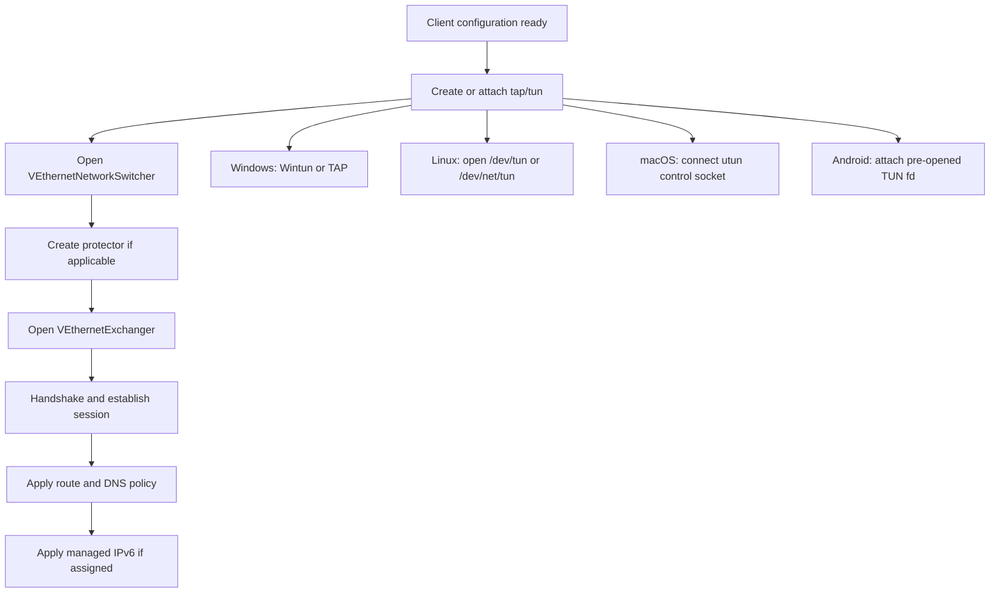

# Platform Integration

[中文版本](PLATFORMS_CN.md)

## Scope

This document explains how OPENPPP2 binds one shared protocol/runtime core to several very different host networking models. It is intentionally implementation-driven. The goal is not to say that the project "supports Windows, Linux, macOS, and Android" in a marketing sense. The goal is to explain what the code actually does on each platform, which parts are shared, which parts are platform-specific, why those differences exist, and where the real operational boundaries are.

The relevant source paths for this document are mainly:

- `main.cpp`
- `ppp/app/client/VEthernetNetworkSwitcher.cpp`
- `ppp/app/server/VirtualEthernetSwitcher.cpp`
- `windows/ppp/tap/TapWindows.cpp`
- `windows/ppp/win32/network/NetworkInterface.cpp`
- `windows/ppp/win32/network/Win32NetworkRouter.cpp`
- `windows/ppp/ipv6/WIN32_IPv6Auxiliary.cpp`
- `linux/ppp/tap/TapLinux.cpp`
- `linux/ppp/net/ProtectorNetwork.cpp`
- `linux/ppp/ipv6/LINUX_IPv6Auxiliary.cpp`
- `darwin/ppp/tap/TapDarwin.cpp`
- `darwin/ppp/tun/utun.cpp`
- `darwin/ppp/ipv6/DARWIN_IPv6Auxiliary.cpp`
- `android/libopenppp2.cpp`
- `android/CMakeLists.txt`
- root `CMakeLists.txt`
- `build_windows.bat`
- `build-openppp2-by-builds.sh`
- `build-openppp2-by-cross.sh`

## Why Platform Code Is Explicit

OPENPPP2 does not hide platform behavior behind a tiny fake-uniform abstraction. That is deliberate. Network infrastructure software always ends up depending on host-specific facts:

- how a virtual adapter is created
- whether the process owns the adapter or receives an already-open file descriptor
- how IPv4 and IPv6 addresses are applied
- whether DNS is changed via API, WMI, a resolver file, or helper commands
- how routes are inserted, replaced, pinned, and restored
- whether sockets can be protected from tunnel recursion
- whether the server can actually expose an IPv6 transit data plane on that OS

The codebase therefore keeps the transport, framing, tunnel protocol, session model, static packet model, MUX model, and most client/server logic shared, while keeping adapter and system-integration behavior platform-specific.

That split is visible in the build system too. The root `CMakeLists.txt` includes all common sources and then selects one platform source tree:

- `windows/*.cpp` on Windows
- `darwin/*.cpp` on macOS
- `linux/*.cpp` on Linux

Android is not built from the root CLI target. It has its own `android/CMakeLists.txt`, builds a shared library named `openppp2`, and reuses the Linux-side networking implementation plus JNI glue.

## Shared Core Versus Platform Layer

The shared runtime is responsible for the things that do not fundamentally depend on the host OS:

- configuration loading and normalization
- client/server mode selection
- handshake and transmission setup
- link-layer protocol dispatch
- static packet packing and unpacking
- MUX session management
- mapping, NAT logic, DNS rule evaluation, and tunnel-side datagram flow
- `VEthernetNetworkSwitcher` and `VirtualEthernetSwitcher` orchestration

The platform layer is responsible for the things that do depend on host OS behavior:

- creating or attaching to the virtual interface
- reading and writing packets to kernel interfaces
- route add/delete operations
- DNS apply/restore behavior
- interface MTU and address mutation
- socket protect / anti-recursion binding
- server-side IPv6 transit plumbing where available

## Platform Selection At Build Time

The root `CMakeLists.txt` does not compile a single cross-platform adapter implementation and branch everything at runtime. Instead, it chooses platform source trees at configure time.

On Windows:

- MSVC-specific flags are configured
- vcpkg is required for dependency discovery
- Boost and OpenSSL are located from the active vcpkg triplet
- `windows/*.c` and `windows/*.cpp` are included

On Darwin:

- C++17 is forced directly
- Darwin platform sources are included
- shared Unix/common code is also included

On Linux:

- Linux platform sources are included
- common Unix code is included

On Android:

- the dedicated `android/CMakeLists.txt` is used instead of the root build
- the output is `ADD_LIBRARY(... SHARED ...)`
- Linux sources are reused together with `android/libopenppp2.cpp`

This matters operationally: OPENPPP2 is not one binary with all platform plumbing embedded and toggled by flags. Each target is materially shaped by its host integration tree.

## Windows

### Runtime Position

Windows is the most API-heavy client platform in this repository. The code does not merely open a tun-like device and manipulate routes via shell commands. It integrates with several Windows-specific components:

- Wintun if available
- TAP-Windows fallback if Wintun is not available
- WMI-backed network adapter configuration
- IP Helper route APIs
- Windows DNS cache flush support
- optional system HTTP proxy and QUIC-related policy handling
- Windows-specific client-side PaperAirplane integration

### Adapter Model

The main entry is `windows/ppp/tap/TapWindows.cpp`.

`TapWindows::Create(...)` first validates the incoming addresses and the lease time. Then it chooses one of two paths.

Path one is Wintun. If `WintunAdapter::Ready()` returns true, the code builds a `WintunAdapter`, opens it, finds the interface index by friendly name, applies interface settings, starts the ring buffer based adapter, and then wraps it as `TapWindows`.

Path two is TAP-Windows fallback. If Wintun is not available, the code opens a TAP handle through a `\\.\Global\<component>.tap` device path, configures the TAP driver into TUN mode, configures DHCP/MASQ style behavior, pushes DHCP options, and then separately applies host interface settings.

This means "Windows support" is not one behavior. It is a two-path integration strategy:

- preferred path: Wintun
- compatibility path: TAP-Windows

### Interface Address and DNS Application

Windows interface mutation is split between `TapWindows.cpp` and `NetworkInterface.cpp`.

`TapWindows::SetAddresses(...)` validates IPv4 input and then either:

- sets IP and mask only if gateway is invalid, or
- sets IP/mask and then sets a default gateway

DNS is applied through `TapWindows::SetDnsAddresses(...)`, which delegates to `ppp::win32::network::SetDnsAddresses(...)`.

In `windows/ppp/win32/network/NetworkInterface.cpp`, those DNS and gateway operations are performed through WMI queries against `Win32_NetworkAdapterConfiguration`. The implementation is not shell-based. It connects to `ROOT\CIMV2`, queries objects by `InterfaceIndex`, and invokes configuration methods on matching adapter objects.

That is a very different operational model from Linux and Darwin. On Windows, OPENPPP2 is relying on Windows management interfaces, not on command-line networking tools.

### Route Management

The main route helper is `windows/ppp/win32/network/Win32NetworkRouter.cpp`.

It uses IP Helper APIs such as:

- `GetBestRoute`
- `GetBestInterface`
- `GetIpForwardTable`
- `CreateIpForwardEntry`
- `DeleteIpForwardEntry`

`Router::Add(...)` calculates the best interface for a gateway if needed, clamps metrics, reads interface metrics through `GetIpInterfaceEntry`, and creates `MIB_IPFORWARDROW` objects. Deletes iterate the current route table and remove entries that match destination, mask, gateway, and optionally interface index.

This is significant for the client implementation in `VEthernetNetworkSwitcher`. When the client adds or deletes steering routes on Windows, it is not calling `route.exe`. It is going through native route table APIs.

### DNS Flush and Post-Mutation Cleanup

Windows also has one explicit cleanup behavior that is not mirrored the same way elsewhere: resolver cache flush. `TapWindows::DnsFlushResolverCache()` delegates to `Win32Native::DnsFlushResolverCache()` which dynamically resolves `DnsFlushResolverCache` from `Dnsapi.dll`.

This is used by the Windows IPv6 helper and is consistent with a design where Windows DNS mutation is expected to be visible to the system resolver immediately, not eventually.

### Client-Side Special Windows Behavior

`VEthernetNetworkSwitcher.cpp` contains Windows-only behavior beyond basic adapter integration.

When the client opens in hosted-network mode on Windows, the code can:

- set DNS on interfaces
- flush the resolver cache
- remove or protect default routes
- enable PaperAirplane-specific controller logic when configured

The `client.paper_airplane.tcp` default is also Windows-specific in configuration normalization. This is a platform fact, not a generic tunnel concept.

There is also Windows-specific proxy/network preference behavior under `windows/ppp/net/proxies/HttpProxy.cpp`, including policy handling related to QUIC support for Chromium-family browsers.

That means a Windows deployment can involve system-level side effects outside the tunnel interface itself:

- DNS changes
- route changes
- optional HTTP proxy changes
- optional QUIC preference changes

### Windows IPv6 Integration

The client IPv6 apply/restore path is not implemented the same way as on Linux or Darwin. The Windows side has a dedicated `WIN32_IPv6Auxiliary.cpp`, and the grep results confirm that it applies IPv6 DNS through `SetDnsAddressesV6(...)` and flushes the Windows resolver after changes.

From the architecture point of view, the important fact is that Windows IPv6 client assignment is not just "put an IPv6 address on the tunnel". It also has a Windows-specific DNS and rollback sequence.

### Windows Strengths and Boundaries

Windows is strong in these areas:

- native route and adapter API integration
- dual-path Wintun/TAP strategy
- system DNS mutation and cache flush integration
- good fit for desktop client runtime behavior

Windows is also more stateful and invasive than Unix-like platforms. Changes are mediated through WMI/IP Helper and may interact with broader system proxy and browser-policy state.

## Linux

### Runtime Position

Linux is the most infrastructure-oriented platform in this repository. It is where the project exposes the richest combination of:

- direct TUN operations
- route management
- protect mode
- server IPv6 transit path
- IPv6 neighbor proxy support
- multiqueue-oriented integration

This is why the server-side IPv6 data plane analysis keeps landing in Linux-specific code.

### Adapter Model

The main entry is `linux/ppp/tap/TapLinux.cpp`.

`TapLinux::OpenDriver(...)` opens `/dev/tun` first and falls back to `/dev/net/tun`. It then attempts to create a TUN device with `IFF_TUN | IFF_NO_PI` and, where supported, tries `IFF_MULTI_QUEUE` first before falling back to single queue.

The sequence is notable:

- open tun device node
- set nonblocking and cloexec
- build `ifreq`
- try multiqueue attach if available
- issue `TUNSETIFF`
- fall back to non-multiqueue if necessary

That is a direct kernel-device integration. There is no management API equivalent to the Windows WMI path.

### IPv4 Address and Route Management

Linux mixes ioctl-based interface mutation with command-based route management.

`TapLinux::SetIPAddress(...)` uses classic socket ioctls such as:

- `SIOCSIFADDR`
- `SIOCSIFNETMASK`

For route mutation, Linux uses shell commands. There are helper functions that build `route` or `ip` command strings and execute them with `system(...)`. The implementation includes token validation through `IsSafeShellToken(...)` to reduce command injection risk from interface names and addresses.

This matters because it means Linux behavior depends on the availability and semantics of system networking tools, not just syscalls.

### IPv6 on Linux

Linux has the most extensive IPv6 machinery in the project.

`TapLinux.cpp` provides helpers for:

- `SetIPv6Address(...)`
- `DeleteIPv6Address(...)`
- `AddRoute6(...)`
- `DeleteRoute6(...)`
- `EnableIPv6NeighborProxy(...)`
- `QueryIPv6NeighborProxy(...)`
- `DisableIPv6NeighborProxy(...)`
- `AddIPv6NeighborProxy(...)`
- `DeleteIPv6NeighborProxy(...)`

These are implemented with `ip -6 ...` and `sysctl ... proxy_ndp` commands.

The Linux client IPv6 helper in `LINUX_IPv6Auxiliary.cpp` captures original default-route and DNS state, applies the assigned IPv6 address, applies default route and subnet route, and restores original state on rollback. This is conceptually similar to Darwin's apply/restore flow, but Linux uses Linux commands and Linux route parsing.

### Linux Server IPv6 Transit

The deepest Linux-only behavior appears in `VirtualEthernetSwitcher.cpp`.

The server's IPv6 transit data plane depends on Linux-specific primitives. The code path includes:

- `OpenIPv6TransitIfNeed()`
- creation of a transit TAP/TUN path on Linux
- applying IPv6 addresses to that transit interface
- adding per-client IPv6 routes with `TapLinux::AddRoute6(...)`
- enabling and refreshing neighbor proxy state on the uplink interface
- deleting routes and neighbor proxies during session teardown

This is not a generic "server IPv6 feature" in the abstract. It is implemented as a Linux host integration feature.

The presence of this path is why documentation must be careful when saying that OPENPPP2 supports server-side IPv6 overlay delivery. The code shows that the full data-plane realization is Linux-centric.

### Protect Mode

Linux also carries the project's explicit socket protect mechanism through `linux/ppp/net/ProtectorNetwork.cpp`.

This component exists to stop recursive routing of tunnel control sockets or proxied sockets back into the tunnel. The code supports two broad patterns:

- a Unix-domain fd transfer model using `sendfd/recvfd`
- on Android, a JNI reverse-call model where Java's `protect(int sockfd)` is invoked

In ordinary Linux client use, `VEthernetNetworkSwitcher` creates a `ProtectorNetwork` tied to an underlying interface name. Various client-side connections then inherit `ProtectorNetwork` so that outbound sockets can be kept on the real network instead of the tunnel path.

That is an operationally important distinction:

- route steering decides which destinations should go through the tunnel
- protect mode decides which local control sockets must not go through the tunnel

### Linux Strengths and Boundaries

Linux is the strongest platform for:

- infrastructure hosting
- server deployment
- full IPv6 transit and neighbor-proxy behavior
- deeper socket protection control
- multiqueue-capable TUN integration

Linux also depends heavily on host tools and privileges. Route, IPv6, and neighbor-proxy helpers assume commands such as `ip`, `route`, and `sysctl` are available and that the process has permission to use them.

## macOS

### Runtime Position

macOS is neither a Windows-style management API environment nor a Linux-style `/dev/net/tun` environment. OPENPPP2 therefore carries a distinct Darwin implementation rather than pretending the Linux TUN path can be reused as-is.

The critical files are `TapDarwin.cpp`, `utun.cpp`, and `DARWIN_IPv6Auxiliary.cpp`.

### Adapter Model With `utun`

macOS uses `utun`, opened through a PF_SYSTEM control socket, not through a Linux tun device node.

`darwin/ppp/tun/utun.cpp` shows the sequence:

- create `socket(PF_SYSTEM, SOCK_DGRAM, SYSPROTO_CONTROL)`
- resolve `UTUN_CONTROL_NAME` with `CTLIOCGINFO`
- connect using `sockaddr_ctl`
- set cloexec and nonblocking

The function `utun_open(int utunnum, uint32_t ip, uint32_t gw, uint32_t mask)` then configures MTU and addressing via `ifconfig` commands.

This is one of the clearest examples of why the project keeps platform code explicit. macOS virtual-interface creation is fundamentally different from both Windows and Linux.

### Interface Naming Behavior

`TapDarwin::Create(...)` also highlights an important Darwin-specific fact: the requested device name is not authoritative in the same way as on Linux. The code may try a requested utun number, but if that fails it loops across possible utun units. Once a handle is obtained, the actual interface name is retrieved from the socket using `UTUN_OPT_IFNAME`.

So on macOS, the operational identity of the tunnel interface is discovered from the opened utun handle, not simply assumed from configuration text.

### Packet I/O Differences

`TapDarwin::OnInput(...)` contains a Darwin-specific packet framing adjustment. macOS `utun` packets carry an extra four-byte header indicating `AF_INET` or `AF_INET6`. The code strips that header before handing the packet to the shared tap logic.

Similarly, outgoing packets written by `TapDarwin::Output(...)` are prefixed with a four-byte address-family word before being written to the utun fd.

That means the shared runtime does not see raw Darwin kernel framing. `TapDarwin` normalizes it.

### Route Management

macOS route mutation is not implemented with Linux `ip route` tooling. `utun.cpp` builds raw route messages and sends them through an `AF_ROUTE` socket. Helpers such as `utun_add_route(...)` and `utun_del_route(...)` ultimately call `utun_ctl_add_or_delete_route_sys_abi(...)`.

This is a lower-level Darwin-native route manipulation strategy.

In `TapDarwin.cpp`, bulk route application for client steering calls those helpers over route information table entries. So the client's RIB/FIB logic is shared, but the actual route installation mechanism is Darwin-specific.

### IPv6 and DNS On Darwin

The Darwin IPv6 helper in `DARWIN_IPv6Auxiliary.cpp` shows a hybrid model:

- it reads the current IPv6 default route using `route -n get -inet6 default`
- it adds or changes IPv6 routes using `route -n add` and `route -n change`
- it applies interface IPv6 addresses using `ifconfig ... inet6 ... alias`
- it restores prior resolver state using Unix resolver helpers

For DNS, Darwin relies on shared Unix-side resolver configuration helpers in `UnixAfx`, not on a Windows-style management API. The code captures original resolver configuration, merges or sets desired DNS state, and restores it on rollback.

This is operationally important because Darwin's client IPv6 integration is not just interface configuration. It is a coordinated sequence involving:

- address aliasing
- default-route mutation
- subnet-route mutation
- DNS resolver mutation
- restoration of original route and resolver state when needed

### macOS Strengths and Boundaries

macOS support is real, but it is more client-oriented than infrastructure-hosting oriented in this repository.

Strengths:

- real utun integration
- native route-socket based IPv4 route handling
- Darwin-specific IPv6 client apply/restore logic

Boundaries:

- not the primary server IPv6 transit platform
- more shell-tool involvement for IPv6 than the route-socket IPv4 path
- dependent on macOS behavior around utun naming and `ifconfig`/`route` semantics

## Android

### Runtime Position

Android is not treated as a normal CLI platform. It is treated as an application-hosted engine target.

The dedicated `android/CMakeLists.txt` builds `openppp2` as a shared library. It includes:

- common core sources
- common Unix sources
- Linux platform sources
- `android/libopenppp2.cpp`

So Android reuses the Linux networking substrate where possible, but it does not create the tunnel interface in the same way as a normal Linux process.

### External TUN FD Model

The critical Android fact is visible in `android/libopenppp2.cpp`.

The Java side supplies a TUN file descriptor and interface settings into native code. `libopenppp2_from_tuntap_driver_new(...)` reads `network_interface->VTun`, interprets it as an already-open fd, and then calls:

- `TapLinux::From(context, dev, tun, ip, gw, mask, promisc, hosted_network)`

So Android does not use `TapLinux::OpenDriver(...)` to create `/dev/tun` itself in the usual way. Instead, it attaches the shared runtime to a TUN fd that came from the Android VPN host environment.

This is one of the sharpest platform-model differences in the whole codebase.

### JNI Protect Integration

Android also changes the protect model.

`ProtectorNetwork.cpp` contains Android-specific JNI reverse calls. The native side looks up a Java class named by `LIBOPENPPP2_CLASSNAME`, obtains the static `protect(int)` method, and uses it to request that a socket be protected from VPN capture.

`android/libopenppp2.cpp` calls `protector->JoinJNI(context, env)` after the client switcher opens, binding the protection service to the JNI environment of the thread hosting the VPN logic.

This is not an optional convenience. It is the Android-specific way OPENPPP2 avoids routing its own sockets through the VPN path.

### Android Execution Model

The exported JNI methods do more than simple configuration accessors. The `run(...)` path:

- creates a dedicated `boost::asio::io_context`
- constructs the client switcher
- binds the externally supplied TUN fd
- joins the protector to JNI
- posts callbacks back to Java
- blocks until shutdown

This shows that on Android the C++ runtime acts as an embeddable engine under a Java/Kotlin host lifecycle, not as a standalone program launched with CLI flags.

### Android Build Model

The Android `CMakeLists.txt` is explicit about this deployment shape:

- output is a shared library
- Linux and Unix sources are reused
- OpenSSL and Boost are linked from Android ABI-specific paths
- output goes to `bin/android/${ANDROID_ABI}`

So Android support in OPENPPP2 is not a fourth copy of the desktop app. It is a separate packaging and embedding model.

### Android Strengths and Boundaries

Strengths:

- true engine embedding model
- external VPN fd integration
- JNI-based socket protect path
- reuse of client runtime instead of maintaining a separate protocol stack

Boundaries:

- depends on Android app host to create and own the VPN tunnel
- not a standalone CLI target
- operational behavior is split between Java/Kotlin host code and native runtime

## Cross-Platform Client Lifecycle Comparison

The client runtime flow is broadly shared, but platform entry points differ at the moment where the switcher needs a real virtual interface and real host-system mutations.

The protocol above that point is mostly shared. The system consequences below that point are not.

## Protect, Bypass, and Recursion Avoidance

One recurring reason platform code exists is tunnel recursion avoidance. The client may need to:

- steer most traffic into the overlay
- preserve direct reachability to the real remote endpoint
- keep control sockets out of the overlay
- keep DNS servers or bypass targets on the underlying network

On Windows, this interacts with native route APIs and interface state.

On Linux, it interacts with route insertion plus `ProtectorNetwork`.

On Android, it interacts with JNI `protect(...)`.

On macOS, it depends on Darwin route manipulation and interface-specific route behavior.

This is why route logic and protect logic are related but not identical in the codebase.

## Platform Differences In DNS Mutation

DNS behavior is a good example of why the project cannot honestly claim that all platforms behave the same.

Windows:

- DNS is set on an interface using Windows management paths
- resolver cache can be flushed explicitly
- IPv6 DNS has a separate helper path

Linux:

- DNS typically goes through Unix resolver configuration helpers
- behavior depends on system resolver conventions
- client flow stores and restores previous resolver state

macOS:

- DNS also goes through Unix-side resolver configuration helpers
- integrated with Darwin IPv6 apply/restore logic

Android:

- native runtime still carries DNS rule and local DNS behavior
- but system-level VPN/DNS ownership is partly shaped by the Android app host and VPN service model

Any operational guide that ignores these differences would hide failure modes.

## Platform Differences In Server Behavior

The server runtime is not equally realized across platforms.

The most important example is IPv6 transit and neighbor-proxy handling. The deep implementation path is Linux-based in `VirtualEthernetSwitcher.cpp` plus `TapLinux.cpp`. That means:

- the server core is cross-platform in structure
- the richest IPv6 server data-plane behavior is Linux-centric in implementation

This should inform deployment recommendations. If the deployment requires full server-side IPv6 overlay routing, Linux is the reference platform according to the current code.

## Build and Packaging Model By Platform

### Windows Build

`build_windows.bat` reflects the current expected Windows workflow.

Important facts:

- builds are `Debug` or `Release`
- targets are `x86`, `x64`, or `all`
- generator is Ninja
- Visual Studio environment is prepared through `vcvarsall.bat`
- vcpkg toolchain discovery is mandatory and prioritized through multiple locations
- output is staged into `bin\Debug\<arch>` or `bin\Release\<arch>`

This is a mature Windows-native build workflow, not an afterthought.

### Linux and Unix Build

The root `CMakeLists.txt` supports normal Unix builds directly. There is also `build-openppp2-by-builds.sh`, which iterates over custom `builds/*` CMake variants, swaps `CMakeLists.txt`, builds, locates `ppp`, and packages each result as a zip.

That script is more of a packaging automation mechanism than a normal developer workflow, but it shows that multiple build profiles are expected.

### Cross-Build Script

`build-openppp2-by-cross.sh` installs a large compiler/toolchain set and builds multiple Linux architectures:

- `aarch64`
- `armv7l`
- `mipsel`
- `ppc64el`
- `riscv64`
- `s390x`
- `amd64`

This says something important about deployment intent. OPENPPP2 is not only meant for one workstation environment. The project expects multi-architecture Linux deployment.

### Android Build

Android is built separately as a shared library and linked against ABI-specific OpenSSL and Boost artifacts. It is a library delivery workflow, not a standalone executable packaging workflow.

## Practical Verification After Platform Changes

When changing platform integration code, verification should match the platform's real responsibilities.

On Windows, verify:

- Wintun open still works
- TAP fallback still works if Wintun is unavailable
- interface index lookup still succeeds
- IPv4 and IPv6 DNS are actually applied to the expected adapter
- route add/delete works through IP Helper APIs
- resolver cache flush and rollback still happen when expected
- optional proxy and QUIC side effects are still controlled correctly

On Linux, verify:

- `/dev/tun` or `/dev/net/tun` open still works
- multiqueue fallback still behaves correctly
- route insertion and deletion work with installed userland tools
- protect mode still keeps sockets off the tunnel path
- client IPv6 apply/restore works end-to-end
- server IPv6 transit and neighbor-proxy behavior still work on the actual host kernel

On macOS, verify:

- utun creation still succeeds
- the actual assigned utun name is discovered correctly
- the extra four-byte AF header is handled correctly both ways
- route socket based route changes still take effect
- Darwin IPv6 apply/restore and DNS rollback work correctly

On Android, verify:

- Java/Kotlin host passes a valid VPN TUN fd
- native runtime attaches correctly to that fd
- JNI `protect(int)` still succeeds under the host VPN service
- start/stop lifecycle still matches the host application thread model

## Engineering Conclusions

The platform story of OPENPPP2 is not a footnote. It is one of the defining engineering characteristics of the project.

The shared core gives the project one protocol and one runtime model. The platform layer gives that model a real place to run. But the host consequences differ substantially:

- Windows is API-heavy and desktop-client oriented
- Linux is the richest infrastructure and server platform
- macOS has a real but Darwin-specific utun and route-socket path
- Android is an embedded engine target built around an externally owned VPN fd and JNI protect flow

That is the correct way to read the source. OPENPPP2 is cross-platform, but not by flattening the network stack into a fake common denominator. It is cross-platform by keeping the core shared and letting each host integration remain recognizably real.

## Related Documents

- [`CLIENT_ARCHITECTURE.md`](CLIENT_ARCHITECTURE.md)
- [`SERVER_ARCHITECTURE.md`](SERVER_ARCHITECTURE.md)
- [`ROUTING_AND_DNS.md`](ROUTING_AND_DNS.md)
- [`DEPLOYMENT.md`](DEPLOYMENT.md)
- [`OPERATIONS.md`](OPERATIONS.md)
- [`SOURCE_READING_GUIDE.md`](SOURCE_READING_GUIDE.md)
