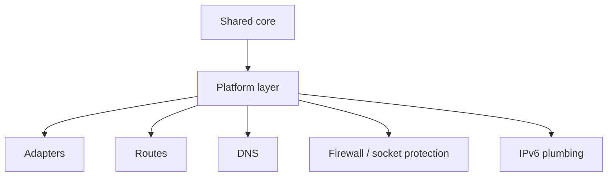
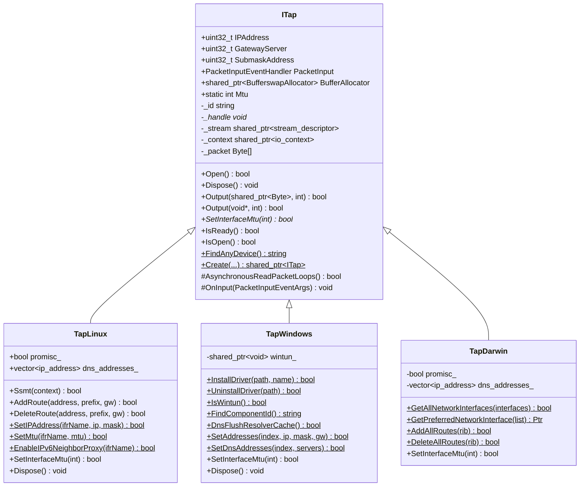
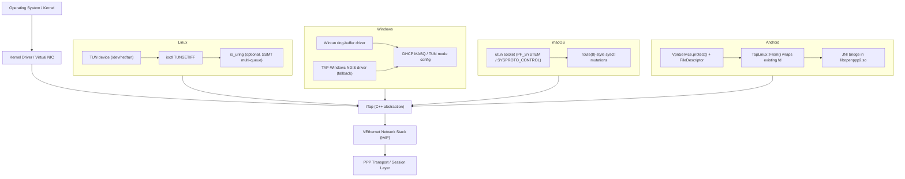

# Platform Integration

[中文版本](PLATFORMS_CN.md)

## Scope

This document explains how OPENPPP2 binds one shared runtime core to different host networking models.

## Main Idea

The shared core covers configuration, transport, handshake, link-layer actions, routing policy, and session management. The platform layer covers adapter creation, route mutation, DNS mutation, socket protection, and IPv6 host plumbing.

## Build-Time Split

The root build selects platform source trees:

- Windows: `windows/*`
- Linux: `linux/*`
- macOS: `darwin/*`
- Android: `android/*` via its own `CMakeLists.txt`

## Why This Layer Exists

The platform layer exists because the code does not just move packets. It mutates the host:

- virtual interfaces are created or opened
- default routes may be protected or rewritten
- DNS servers may be changed
- firewall or socket protection may be applied
- IPv6 transit may need platform-specific plumbing

That is not portable by accident; it must be written explicitly.

## Windows

Windows uses multiple host integration paths:

- Wintun when available
- TAP-Windows fallback
- WMI-based adapter configuration
- IP Helper route APIs
- DNS cache flush support
- optional proxy and QUIC-related behavior

Windows-specific behavior also appears in the launcher path where HTTP proxy state and paper-airplane style routing controls may be toggled.

## Linux

Linux uses native tun/tap and host networking behavior, plus Linux-specific IPv6 and protection helpers.

Linux is also the most explicit server-side IPv6 data plane target in the repository.

## macOS

macOS uses utun/TAP-style integration and platform-specific route and IPv6 helpers.

The implementation has to respect the macOS model rather than assume Linux-like route semantics.

## Android

Android is built as a shared library and relies on the host app plus JNI glue for VPN-style integration.

That means the runtime is embedded into a larger host lifecycle rather than being a standalone desktop process.

## Platform Responsibility Map

| Responsibility | Why it is platform-specific |
|---|---|
| adapter creation | OS APIs differ |
| route mutation | route tables and permissions differ |
| DNS mutation | system DNS mechanisms differ |
| socket protection | platform security plumbing differs |
| IPv6 host plumbing | address and neighbor handling differ |

## Runtime Effects

The platform layer changes observable host behavior, so it must be treated as part of the runtime itself rather than as helper glue.



## What To Watch For

- Windows and Linux take different paths for adapter and route work
- Android is embedded and asynchronous in a host-app sense
- IPv6 behavior is frequently conditional on platform support
- DNS and route changes are often coupled, not isolated

---

## Platform Abstraction Layer (ITap)

### Design Overview

`ITap` (`ppp/tap/ITap.h`) is the central platform-neutral abstraction for virtual network devices. Every platform backend inherits from this single interface, which encapsulates:

- **Device lifecycle**: construction around a native handle, `Open()`, `Dispose()`.
- **Packet I/O**: asynchronous read loop (`AsynchronousReadPacketLoops`), inbound event callback (`PacketInputEventHandler`), and two `Output()` overloads for shared-buffer or raw-pointer writes.
- **Address metadata**: `IPAddress`, `GatewayServer`, `SubmaskAddress` stored as `uint32_t` constants.
- **Factory creation**: static `ITap::Create()` overloads, with compile-time conditional signatures for Windows (adds `lease_time_in_seconds`) versus POSIX (adds `promisc` flag).
- **MTU enforcement**: pure-virtual `SetInterfaceMtu(int mtu)` implemented by each backend.

The base class owns a `boost::asio::posix::stream_descriptor` (`_stream`) and an MTU-sized reusable read buffer (`_packet[ITap::Mtu]`). Asynchronous reads are dispatched through the Boost.Asio `io_context` held in `_context`.



> **Note on Android**: Android uses `TapLinux` directly. The `TapLinux::From()` static factory (guarded by `#if defined(_ANDROID)`) wraps an existing TUN file descriptor supplied by the Android `VpnService`, rather than opening `/dev/tun` itself.

---

## Platform-specific Implementation Details

### Platform Layer Architecture



### Linux: TapLinux

`TapLinux` (`linux/ppp/tap/TapLinux.h`) is a `final` class that:

1. **Opens the TUN device** via `OpenDriver()`, which calls `open("/dev/net/tun", ...)` and applies `ioctl(TUNSETIFF)` with the `IFF_TUN | IFF_NO_PI` flags. The interface name (e.g. `tun0`) comes from the `dev` argument or is auto-assigned by the kernel.
2. **Configures the interface** using `ioctl` socket operations: `SetIPAddress()` calls `SIOCSIFADDR`/`SIOCSIFNETMASK`, `SetMtu()` calls `SIOCSIFMTU`, and `SetNetifUp()` calls `SIOCSIFFLAGS`.
3. **Route management** is done via `netlink(7)` RTM_NEWROUTE / RTM_DELROUTE messages, wrapped in `AddRoute()` / `DeleteRoute()` and their bulk counterparts `AddAllRoutes()` / `DeleteAllRoutes()`.
4. **IPv6 support** is extensive: `SetIPv6Address()`, `AddRoute6()`, `DeleteRoute6()`, `EnableIPv6NeighborProxy()`, and `AddIPv6NeighborProxy()` allow fine-grained neighbor discovery proxy management for server-side IPv6 transit.
5. **Multi-queue SSMT**: `Ssmt(context)` opens additional file descriptors on the same TUN device (via `TUNSETIFF` with `IFF_MULTI_QUEUE`) and registers them as separate `stream_descriptor` objects, enabling parallel read paths per IO thread.
6. **Promiscuous mode**: when `promisc_` is `true`, the adapter is put into `IFF_PROMISC` mode, allowing all frames to be captured regardless of destination MAC.

### Windows: TapWindows

`TapWindows` (`windows/ppp/tap/TapWindows.h`) is a `final` class that supports two kernel driver backends:

| Backend | Detection | Notes |
|---|---|---|
| **Wintun** | `IsWintun()` returns `true` | Ring-buffer based; highest performance; used when Wintun DLL is available |
| **TAP-Windows** | NDIS intermediate driver | Legacy fallback; uses DHCP MASQ or TUN mode |

Key operations:

- **Driver installation**: `InstallDriver(path, declareTapName)` copies driver files and calls `SetupDi` APIs to install the NDIS adapter. `UninstallDriver()` removes it.
- **Component ID resolution**: `FindComponentId()` scans the Windows registry under `HKLM\SYSTEM\CurrentControlSet\Control\Class\{4D36E972...}` to locate the Wintun or TAP-Windows adapter GUID.
- **Interface configuration**: `SetAddresses()` uses `IP Helper API` (`SetUnicastIpAddressEntry`) to assign IP, mask, and gateway. `SetDnsAddresses()` writes DNS servers through the same IP Helper path.
- **Wintun ring buffer**: when Wintun is active, `wintun_` holds the `WINTUN_ADAPTER_HANDLE`; reads and writes go through `WintunReceivePacket` / `WintunSendPacket` ring-buffer APIs rather than a file descriptor.
- **Async I/O**: `AsynchronousReadPacketLoops()` is overridden to use Wintun's event-driven ring-buffer model on Wintun, or overlapped I/O on TAP-Windows.
- **DNS cache flush**: `DnsFlushResolverCache()` calls the Win32 `DnsFlushResolverCache()` API after DNS server changes take effect.

At application startup, `Windows_PreparedEthernetEnvironment()` in `ApplicationInitialize.cpp` ensures a component ID is available before `ITap::Create()` is called; if no adapter is found, `InstallDriver()` is invoked automatically.

### macOS: TapDarwin

`TapDarwin` (`darwin/ppp/tap/TapDarwin.h`) is a `final` class that uses macOS `utun` virtual interfaces:

- **Device creation**: opens a `PF_SYSTEM` socket with `SYSPROTO_CONTROL` and connects to the `utun` kernel control (`com.apple.net.utun_control`), obtaining the `utunN` interface automatically.
- **Route management**: `AddAllRoutes()` / `DeleteAllRoutes()` operate on a `RouteInformationTable` (mapping destination → gateway) using `PF_ROUTE` raw socket messages (`RTM_ADD` / `RTM_DELETE`), respecting macOS route semantics which differ from Linux.
- **Network interface enumeration**: `GetAllNetworkInterfaces()` walks `getifaddrs()` results and populates `NetworkInterface` structs including gateway addresses from the routing table. `GetPreferredNetworkInterface()` selects the best candidate based on metric and reachability.
- **Packet framing**: `OnInput()` overrides the base class handler to strip the 4-byte address-family prefix that macOS prepends to every utun read, then forwards the raw IP frame to the lwIP stack.
- **IPv6**: macOS IPv6 plumbing uses BSD-style `SIOCDIFADDR_IN6` / `SIOCAIFADDR_IN6` ioctls for address assignment, diverging significantly from the Linux netlink path.

### Android: JNI Bridge (libopenppp2.so)

Android does not expose raw TUN devices to unprivileged apps. Instead:

1. The host Android application calls `VpnService.establish()` to obtain a `ParcelFileDescriptor` representing a TUN interface already configured by the OS.
2. This file descriptor is passed over JNI to `libopenppp2.so` via `__LIBOPENPPP2__` annotated export functions (defined with `extern "C" JNIEXPORT`).
3. Inside the library, `TapLinux::From()` wraps the raw fd in a `TapLinux` instance without re-opening `/dev/net/tun` — the kernel interface already exists.
4. The OPENPPP2 runtime then operates identically to the Linux desktop path, using the same `TapLinux` read loop and route management.

JNI macro conventions in `android/libopenppp2.cpp`:

```cpp
// Marks a JNI-exported function
#define __LIBOPENPPP2__(JNIType)  extern "C" JNIEXPORT __unused JNIType JNICALL

// Retrieves the singleton application context
#define __LIBOPENPPP2_MAIN__      libopenppp2_application::GetDefault()
```

The lifecycle managed over JNI maps to the same `run` / `stop` / release semantics described in `STARTUP_AND_LIFECYCLE.md`, ensuring consistent diagnostic state between the Java layer and the C++ core.

---

## Related Documents

- `ARCHITECTURE.md`
- `DEPLOYMENT.md`
- `OPERATIONS.md`
