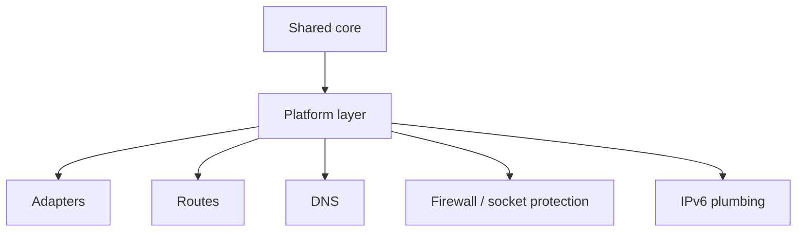

# Platform Integration

[中文版本](PLATFORMS_CN.md)

## Scope

This document explains how OPENPPP2 binds one shared runtime core to different host networking models.

## Main Idea

The shared core covers configuration, transport, handshake, link-layer actions, routing policy, and session management. The platform layer covers adapter creation, route mutation, DNS mutation, socket protection, and IPv6 host plumbing.

## Build-Time Split

The root build selects platform source trees:

- Windows: `windows/*`
- Linux: `linux/*`
- macOS: `darwin/*`
- Android: `android/*` via its own `CMakeLists.txt`

## Why This Layer Exists

The platform layer exists because the code does not just move packets. It mutates the host:

- virtual interfaces are created or opened
- default routes may be protected or rewritten
- DNS servers may be changed
- firewall or socket protection may be applied
- IPv6 transit may need platform-specific plumbing

That is not portable by accident; it must be written explicitly.

## Windows

Windows uses multiple host integration paths:

- Wintun when available
- TAP-Windows fallback
- WMI-based adapter configuration
- IP Helper route APIs
- DNS cache flush support
- optional proxy and QUIC-related behavior

Windows-specific behavior also appears in the launcher path where HTTP proxy state and paper-airplane style routing controls may be toggled.

## Linux

Linux uses native tun/tap and host networking behavior, plus Linux-specific IPv6 and protection helpers.

Linux is also the most explicit server-side IPv6 data plane target in the repository.

## macOS

macOS uses utun/TAP-style integration and platform-specific route and IPv6 helpers.

The implementation has to respect the macOS model rather than assume Linux-like route semantics.

## Android

Android is built as a shared library and relies on the host app plus JNI glue for VPN-style integration.

That means the runtime is embedded into a larger host lifecycle rather than being a standalone desktop process.

## Platform Responsibility Map

| Responsibility | Why it is platform-specific |
|---|---|
| adapter creation | OS APIs differ |
| route mutation | route tables and permissions differ |
| DNS mutation | system DNS mechanisms differ |
| socket protection | platform security plumbing differs |
| IPv6 host plumbing | address and neighbor handling differ |

## Runtime Effects

The platform layer changes observable host behavior, so it must be treated as part of the runtime itself rather than as helper glue.

## What To Watch For

- Windows and Linux take different paths for adapter and route work
- Android is embedded and asynchronous in a host-app sense
- IPv6 behavior is frequently conditional on platform support
- DNS and route changes are often coupled, not isolated

## Related Documents

- `ARCHITECTURE.md`
- `DEPLOYMENT.md`
- `OPERATIONS.md`
