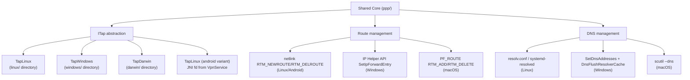
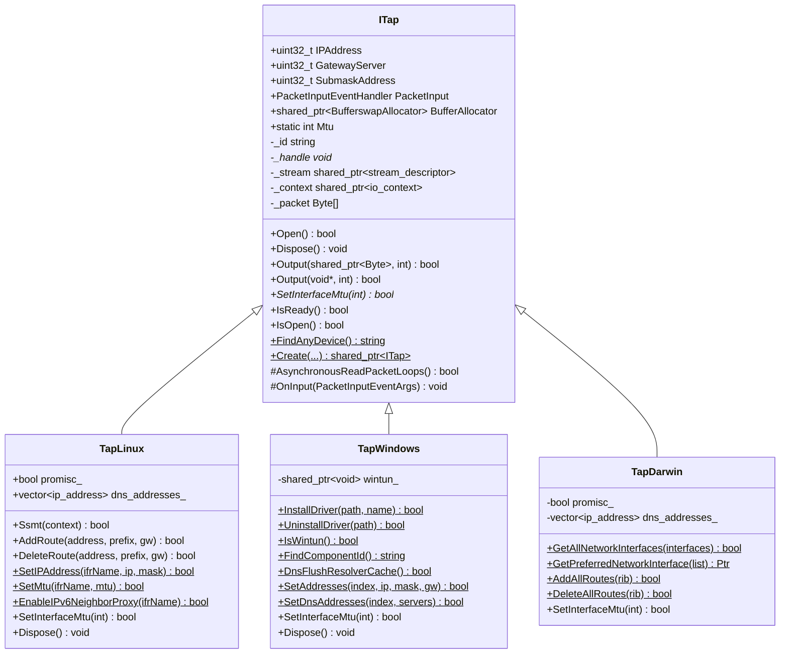
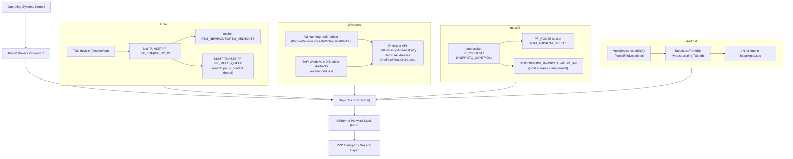
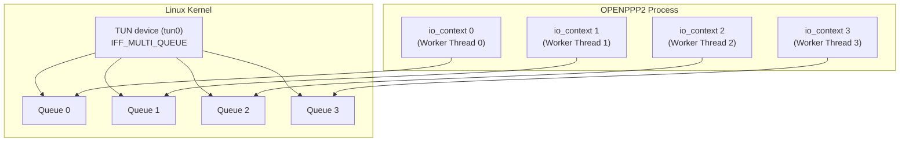
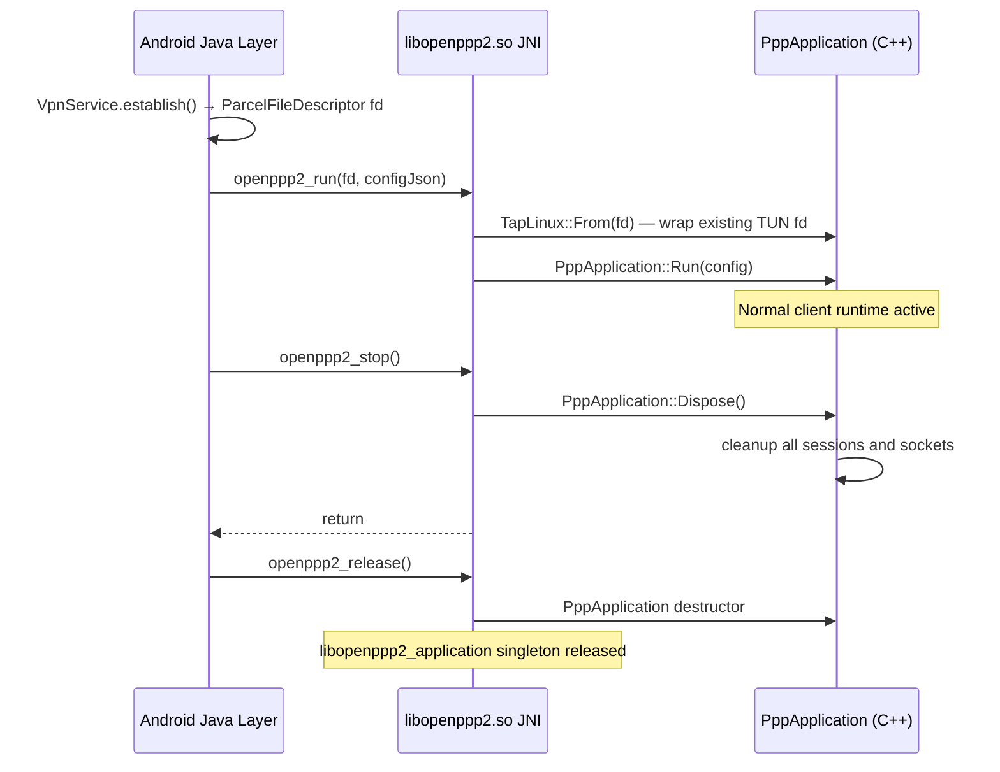

# Platform Integration

[中文版本](PLATFORMS_CN.md)

## Scope

This document explains how OPENPPP2 binds one shared runtime core to different host networking models, with detailed API coverage for each platform backend, build-time organization, and cross-platform development guidelines.

---

## 1. Main Idea

The shared core covers configuration, transport, handshake, link-layer actions, routing policy, and session management. The platform layer covers adapter creation, route mutation, DNS mutation, socket protection, and IPv6 host plumbing.

The shared core lives in `ppp/`. Platform-specific implementations live in:

| Directory | Target |
|-----------|--------|
| `windows/` | Windows (Vista+, primarily Win10/Win11) |
| `linux/` | Linux (kernel 4.x+, includes Android kernel) |
| `darwin/` | macOS (10.15+ recommended) |
| `android/` | Android (API 23+, via JNI shared library) |

The CMake build system selects the correct platform tree at configure time based on `CMAKE_SYSTEM_NAME`.

---

## 2. Why This Layer Exists

The platform layer exists because the code does not just move packets. It mutates the host:

- virtual interfaces are created or opened (TUN/TAP device, Wintun ring buffer, utun socket)
- default routes may be protected or rewritten (to prevent the VPN tunnel traffic from routing over itself)
- DNS servers may be changed (to redirect DNS queries through the tunnel)
- firewall or socket protection may be applied (Android `VpnService.protect()`)
- IPv6 transit may need platform-specific plumbing (neighbor proxy, forwarding rules)

That is not portable by accident; it must be written explicitly for each OS.



---

## 3. Platform Abstraction Layer (ITap)

### Design Overview

`ITap` (`ppp/tap/ITap.h`) is the central platform-neutral abstraction for virtual network devices. Every platform backend inherits from this single interface, which encapsulates:

- **Device lifecycle**: construction around a native handle, `Open()`, `Dispose()`.
- **Packet I/O**: asynchronous read loop (`AsynchronousReadPacketLoops`), inbound event callback (`PacketInputEventHandler`), and two `Output()` overloads for shared-buffer or raw-pointer writes.
- **Address metadata**: `IPAddress`, `GatewayServer`, `SubmaskAddress` stored as `uint32_t` constants.
- **Factory creation**: static `ITap::Create()` overloads, with compile-time conditional signatures for Windows (adds `lease_time_in_seconds`) versus POSIX (adds `promisc` flag).
- **MTU enforcement**: pure-virtual `SetInterfaceMtu(int mtu)` implemented by each backend.

The base class owns a `boost::asio::posix::stream_descriptor` (`_stream`) and an MTU-sized reusable read buffer (`_packet[ITap::Mtu]`). Asynchronous reads are dispatched through the Boost.Asio `io_context` held in `_context`.

### ITap Class Diagram



> **Note on Android**: Android uses `TapLinux` directly. The `TapLinux::From()` static factory (guarded by `#if defined(_ANDROID)`) wraps an existing TUN file descriptor supplied by the Android `VpnService`, rather than opening `/dev/tun` itself.

---

## 4. Platform-Specific Architecture

### Combined Platform Architecture



---

## 5. Linux: TapLinux

`TapLinux` (`linux/ppp/tap/TapLinux.h`) is a `final` class that:

1. **Opens the TUN device** via `OpenDriver()`, which calls `open("/dev/net/tun", ...)` and applies `ioctl(TUNSETIFF)` with the `IFF_TUN | IFF_NO_PI` flags. The interface name (e.g. `tun0`) comes from the `dev` argument or is auto-assigned by the kernel.
2. **Configures the interface** using `ioctl` socket operations: `SetIPAddress()` calls `SIOCSIFADDR`/`SIOCSIFNETMASK`, `SetMtu()` calls `SIOCSIFMTU`, and `SetNetifUp()` calls `SIOCSIFFLAGS`.
3. **Route management** is done via `netlink(7)` RTM_NEWROUTE / RTM_DELROUTE messages, wrapped in `AddRoute()` / `DeleteRoute()` and their bulk counterparts `AddAllRoutes()` / `DeleteAllRoutes()`.
4. **IPv6 support** is extensive: `SetIPv6Address()`, `AddRoute6()`, `DeleteRoute6()`, `EnableIPv6NeighborProxy()`, and `AddIPv6NeighborProxy()` allow fine-grained neighbor discovery proxy management for server-side IPv6 transit.
5. **Multi-queue SSMT**: `Ssmt(context)` opens additional file descriptors on the same TUN device (via `TUNSETIFF` with `IFF_MULTI_QUEUE`) and registers them as separate `stream_descriptor` objects, enabling parallel read paths per IO thread.
6. **Promiscuous mode**: when `promisc_` is `true`, the adapter is put into `IFF_PROMISC` mode, allowing all frames to be captured regardless of destination MAC.

### TapLinux Key API

```cpp
/**
 * @brief Opens the TUN virtual adapter at the OS level.
 * @return true on success, false with SetLastErrorCode on failure.
 * @note  Calls open("/dev/net/tun"), ioctl(TUNSETIFF), SetIPAddress(), SetMtu(), SetNetifUp().
 */
bool Open() noexcept override;

/**
 * @brief Adds a host route via netlink RTM_NEWROUTE.
 * @param address   Destination network address (host byte order).
 * @param prefix    CIDR prefix length.
 * @param gateway   Next-hop gateway address.
 * @return true on success.
 */
bool AddRoute(uint32_t address, int prefix, uint32_t gateway) noexcept;

/**
 * @brief Opens N additional TUN queue file descriptors for SSMT multi-queue mode.
 * @param context   Additional io_context to attach new queues to.
 * @return true if at least one additional queue was opened.
 * @note  Linux kernel 3.8+ required for IFF_MULTI_QUEUE.
 */
bool Ssmt(const std::shared_ptr<boost::asio::io_context>& context) noexcept;

/**
 * @brief Enables IPv6 neighbor proxy on the TUN interface via /proc/sys/net/ipv6.
 * @param ifrName  Interface name (e.g., "tun0").
 * @return true on success.
 */
static bool EnableIPv6NeighborProxy(const ppp::string& ifrName) noexcept;
```

### Linux SSMT Multi-Queue Architecture



---

## 6. Windows: TapWindows

`TapWindows` (`windows/ppp/tap/TapWindows.h`) is a `final` class that supports two kernel driver backends:

| Backend | Detection | Notes |
|---|---|---|
| **Wintun** | `IsWintun()` returns `true` | Ring-buffer based; highest performance; used when Wintun DLL is available |
| **TAP-Windows** | NDIS intermediate driver | Legacy fallback; uses DHCP MASQ or TUN mode |

### Key Operations

- **Driver installation**: `InstallDriver(path, declareTapName)` copies driver files and calls `SetupDi` APIs to install the NDIS adapter. `UninstallDriver()` removes it.
- **Component ID resolution**: `FindComponentId()` scans the Windows registry under `HKLM\SYSTEM\CurrentControlSet\Control\Class\{4D36E972...}` to locate the Wintun or TAP-Windows adapter GUID.
- **Interface configuration**: `SetAddresses()` uses `IP Helper API` (`SetUnicastIpAddressEntry`) to assign IP, mask, and gateway. `SetDnsAddresses()` writes DNS servers through the same IP Helper path.
- **Wintun ring buffer**: when Wintun is active, `wintun_` holds the `WINTUN_ADAPTER_HANDLE`; reads and writes go through `WintunReceivePacket` / `WintunSendPacket` ring-buffer APIs rather than a file descriptor.
- **Async I/O**: `AsynchronousReadPacketLoops()` is overridden to use Wintun's event-driven ring-buffer model on Wintun, or overlapped I/O on TAP-Windows.
- **DNS cache flush**: `DnsFlushResolverCache()` calls the Win32 `DnsFlushResolverCache()` API after DNS server changes take effect.

At application startup, `Windows_PreparedEthernetEnvironment()` in `ApplicationInitialize.cpp` ensures a component ID is available before `ITap::Create()` is called; if no adapter is found, `InstallDriver()` is invoked automatically.

### TapWindows Key API

```cpp
/**
 * @brief Installs the Wintun or TAP-Windows NDIS driver.
 * @param path            Path to the driver .inf file.
 * @param declareTapName  Adapter display name to declare.
 * @return true on success, false with SetLastErrorCode on failure.
 * @note  Requires administrator privilege. Uses SetupDiInstallClassEx + SetupDiInstallDevice.
 */
static bool InstallDriver(const ppp::string& path, const ppp::string& declareTapName) noexcept;

/**
 * @brief Assigns IP address, subnet mask, and gateway to the virtual adapter.
 * @param adapterIndex  Adapter index from GetAdaptersInfo.
 * @param ip            IPv4 address in host byte order.
 * @param mask          Subnet mask in host byte order.
 * @param gateway       Default gateway in host byte order.
 * @return true on success.
 */
static bool SetAddresses(DWORD adapterIndex, uint32_t ip, uint32_t mask, uint32_t gateway) noexcept;

/**
 * @brief Assigns DNS server addresses to the virtual adapter.
 * @param adapterIndex  Adapter index.
 * @param servers       List of DNS server IP addresses.
 * @return true on success.
 */
static bool SetDnsAddresses(DWORD adapterIndex, const ppp::vector<uint32_t>& servers) noexcept;

/**
 * @brief Flushes the Windows DNS resolver cache.
 * @return true on success.
 * @note  Called after SetDnsAddresses to ensure the new servers are used immediately.
 */
static bool DnsFlushResolverCache() noexcept;
```

### Windows Network Helper Functions

Windows-specific startup helpers in `windows/ApplicationInitialize.cpp`:

| Function | Purpose |
|----------|---------|
| `Windows_PreparedEthernetEnvironment()` | Ensures TUN adapter Component ID; installs driver if missing |
| `Windows_NetworkReset()` | Resets Windows network stack via `netsh` commands |
| `Windows_NetworkOptimization()` | Applies TCP/UDP tuning registry keys |
| `Windows_NetworkPreferredIPv4()` | Sets IPv4 binding priority in Windows |
| `Windows_NetworkPreferredIPv6()` | Sets IPv6 binding priority in Windows |
| `Windows_NoLsp(program)` | Launches program without LSP interception |

---

## 7. macOS: TapDarwin

`TapDarwin` (`darwin/ppp/tap/TapDarwin.h`) is a `final` class that uses macOS `utun` virtual interfaces:

- **Device creation**: opens a `PF_SYSTEM` socket with `SYSPROTO_CONTROL` and connects to the `utun` kernel control (`com.apple.net.utun_control`), obtaining the `utunN` interface automatically.
- **Route management**: `AddAllRoutes()` / `DeleteAllRoutes()` operate on a `RouteInformationTable` (mapping destination → gateway) using `PF_ROUTE` raw socket messages (`RTM_ADD` / `RTM_DELETE`), respecting macOS route semantics which differ from Linux.
- **Network interface enumeration**: `GetAllNetworkInterfaces()` walks `getifaddrs()` results and populates `NetworkInterface` structs including gateway addresses from the routing table. `GetPreferredNetworkInterface()` selects the best candidate based on metric and reachability.
- **Packet framing**: `OnInput()` overrides the base class handler to strip the 4-byte address-family prefix that macOS prepends to every utun read, then forwards the raw IP frame to the lwIP stack.
- **IPv6**: macOS IPv6 plumbing uses BSD-style `SIOCDIFADDR_IN6` / `SIOCAIFADDR_IN6` ioctls for address assignment, diverging significantly from the Linux netlink path.

### TapDarwin Key API

```cpp
/**
 * @brief Enumerates all active network interfaces with addresses and routing info.
 * @param interfaces  [out] Vector of NetworkInterface structs populated on success.
 * @return true on success.
 * @note  Combines getifaddrs() with PF_ROUTE sysctl to retrieve gateway for each interface.
 */
static bool GetAllNetworkInterfaces(ppp::vector<NetworkInterface>& interfaces) noexcept;

/**
 * @brief Selects the best physical network interface for VPN bypass routing.
 * @param list  Candidate interface list from GetAllNetworkInterfaces().
 * @return shared_ptr to the preferred interface, or NULLPTR if none found.
 * @note  Selection criteria: non-loopback, non-VPN, lowest metric, has gateway.
 */
static std::shared_ptr<NetworkInterface> GetPreferredNetworkInterface(
    const ppp::vector<std::shared_ptr<NetworkInterface>>& list) noexcept;

/**
 * @brief Adds all routes in the route information table via PF_ROUTE socket.
 * @param rib  Route information table mapping destination → gateway.
 * @return true if all routes were added successfully.
 */
static bool AddAllRoutes(const RouteInformationTable& rib) noexcept;
```

---

## 8. Android: JNI Bridge (libopenppp2.so)

Android does not expose raw TUN devices to unprivileged apps. Instead:

1. The host Android application calls `VpnService.establish()` to obtain a `ParcelFileDescriptor` representing a TUN interface already configured by the OS.
2. This file descriptor is passed over JNI to `libopenppp2.so` via `__LIBOPENPPP2__` annotated export functions (defined with `extern "C" JNIEXPORT`).
3. Inside the library, `TapLinux::From()` wraps the raw fd in a `TapLinux` instance without re-opening `/dev/net/tun` — the kernel interface already exists.
4. The OPENPPP2 runtime then operates identically to the Linux desktop path, using the same `TapLinux` read loop and route management.

### JNI Macro Conventions

```cpp
// Marks a JNI-exported function visible to the Java layer
#define __LIBOPENPPP2__(JNIType)  extern "C" JNIEXPORT __unused JNIType JNICALL

// Retrieves the singleton application context
#define __LIBOPENPPP2_MAIN__      libopenppp2_application::GetDefault()
```

### JNI Lifecycle Mapping



### Android-Specific Constraints

| Constraint | Reason |
|-----------|--------|
| No jemalloc overlay | Android system already uses jemalloc; do not add another layer |
| API 23 minimum | All syscalls and NDK APIs must be available on Android 6.0+ |
| NDK R20B | CI validation uses NDK R20B; do not use NDK APIs added after R20B |
| No raw socket privilege | `VpnService.protect()` must be called on bypass sockets; raw socket creation requires `BIND_VPN_SERVICE` |
| TUN fd from Java | Never attempt to open `/dev/tun` on Android; always use the fd from `VpnService` |

---

## 9. Platform Responsibility Map

| Responsibility | Linux | Windows | macOS | Android |
|---|---|---|---|---|
| TUN/TAP open | `open(/dev/net/tun)` + `ioctl(TUNSETIFF)` | Wintun API or TAP-Windows | `PF_SYSTEM utun socket` | `VpnService` fd via JNI |
| IP address assign | `SIOCSIFADDR` ioctl | IP Helper `SetUnicastIpAddressEntry` | `SIOCAIFADDR` ioctl | Handled by Android OS |
| Route add | netlink `RTM_NEWROUTE` | IP Helper `CreateIpForwardEntry2` | `PF_ROUTE RTM_ADD` | netlink (same as Linux) |
| DNS configure | write `/etc/resolv.conf` | `SetDnsAddresses` | `scutil` or `configd` | Android DNS API |
| Socket protection | Mark socket with routing policy rule | N/A | N/A | `VpnService.protect(fd)` |
| IPv6 neighbor proxy | `/proc/sys/net/ipv6/conf/*/proxy_ndp` | N/A | SIOCAIFADDR_IN6 | Same as Linux |
| SSMT multi-queue | `IFF_MULTI_QUEUE` | Wintun multi-session | N/A (utun is single-queue) | Same as Linux |

---

## 10. Cross-Platform Development Guidelines

### Platform Guard Macros

Always use the repository macros, never raw compiler symbols:

```cpp
// Correct — uses repo-defined macros
#if defined(_WIN32)
    // Windows-specific code
#elif defined(_LINUX)
    // Linux-specific code (includes Android)
#elif defined(_ANDROID)
    // Android-only code
#elif defined(_MACOS)
    // macOS-only code
#endif

// Wrong — never use these in shared ppp/ files
#ifdef __linux__       // WRONG
#ifdef _MSC_VER        // WRONG
#ifdef __APPLE__       // WRONG
```

### Platform-Specific Code Placement

| Code Type | Correct Location |
|-----------|----------------|
| Shared abstraction | `ppp/tap/ITap.h` / `ppp/tap/ITap.cpp` |
| Linux implementation | `linux/ppp/tap/TapLinux.h` / `.cpp` |
| Windows implementation | `windows/ppp/tap/TapWindows.h` / `.cpp` |
| macOS implementation | `darwin/ppp/tap/TapDarwin.h` / `.cpp` |
| Android JNI bridge | `android/libopenppp2.cpp` |
| Android CMake | `android/CMakeLists.txt` (not shared with desktop) |

### Compilation Verification Strategy

For maximum efficiency, validate one platform at a time:

1. **Windows**: run `build_windows.bat Release x64` — covers MSVC and vcpkg.
2. **Linux**: sync to `/root/dd/openppp2` via `rsync`, then `cd build && make -j32` — covers GCC 7.5 / Boost / OpenSSL.
3. **Android**: open Android Studio project at `D:\android\openppp2` and build — covers NDK R20B / API 23.
4. **macOS**: review for `#ifdef` correctness; no compilation environment available.

---

## Related Documents

- [`ARCHITECTURE.md`](ARCHITECTURE.md) — System-level architecture overview
- [`DEPLOYMENT.md`](DEPLOYMENT.md) — Build and deployment guide for each platform
- [`OPERATIONS.md`](OPERATIONS.md) — Runtime operations and monitoring
- [`STARTUP_AND_LIFECYCLE.md`](STARTUP_AND_LIFECYCLE.md) — Process startup and platform prep sequence
- [`CONCURRENCY_MODEL.md`](CONCURRENCY_MODEL.md) — Threading and SSMT model
