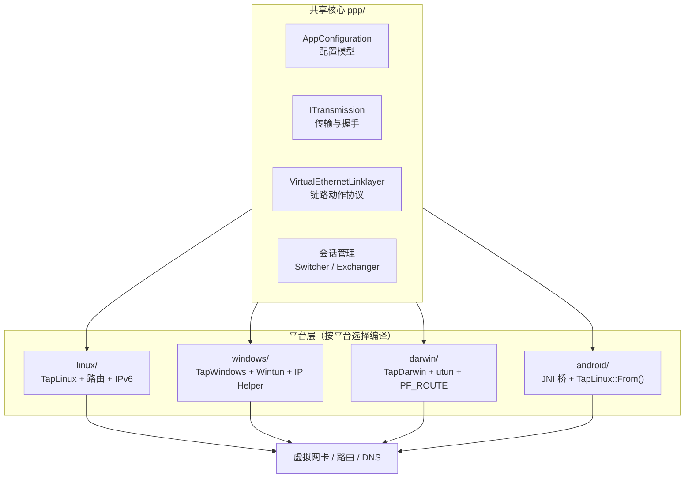
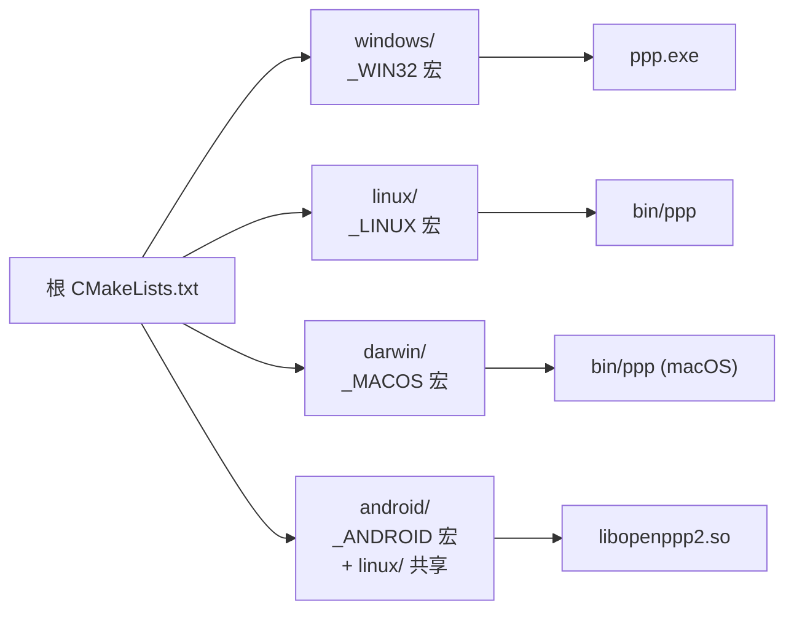
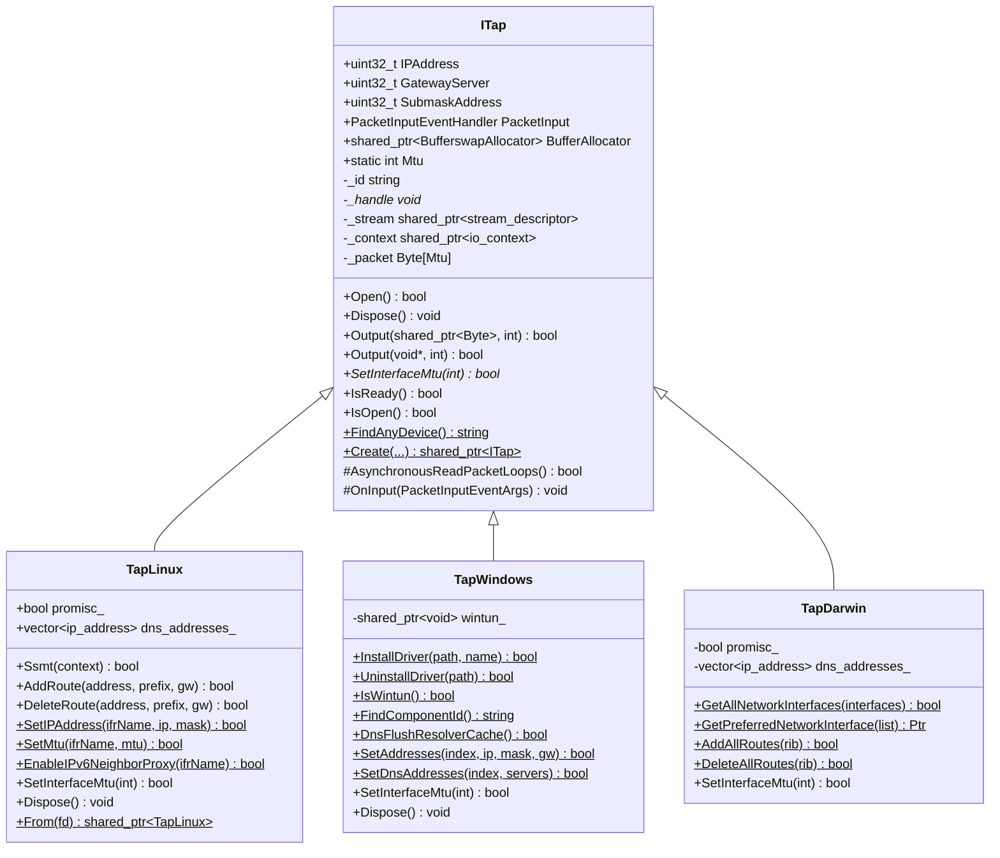
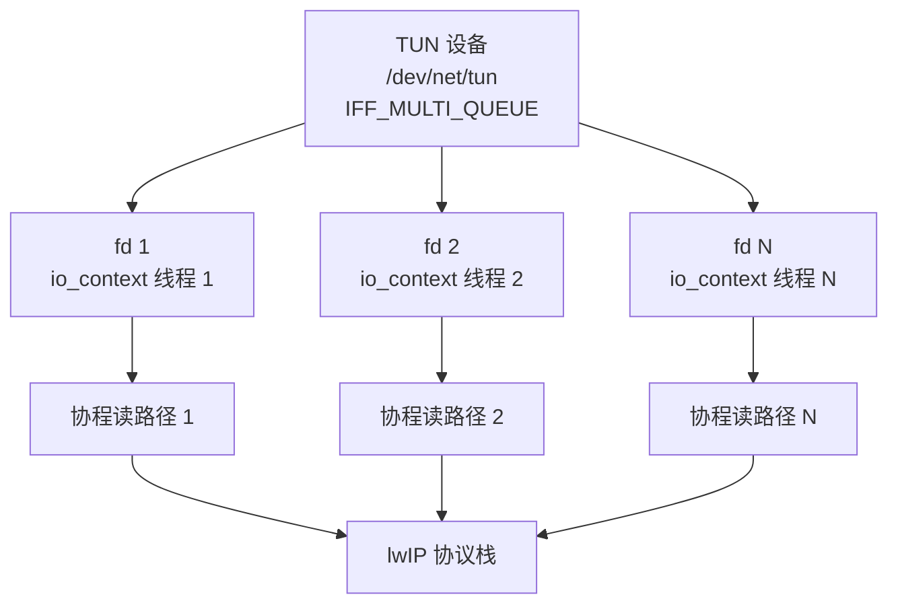
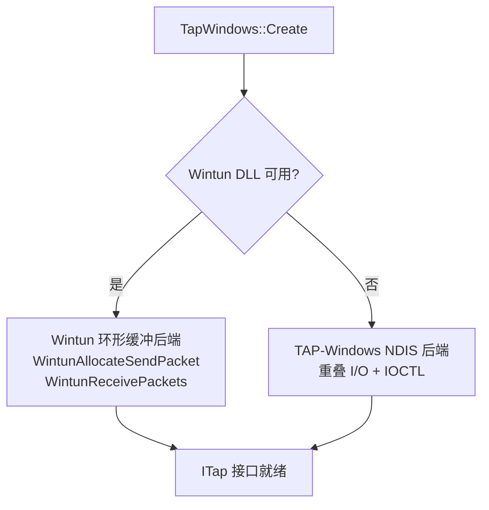
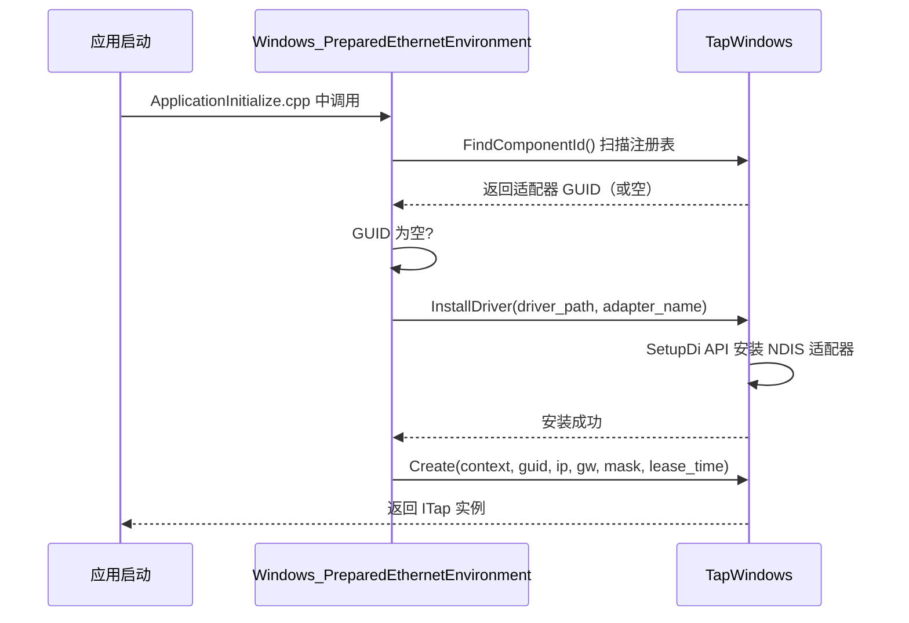
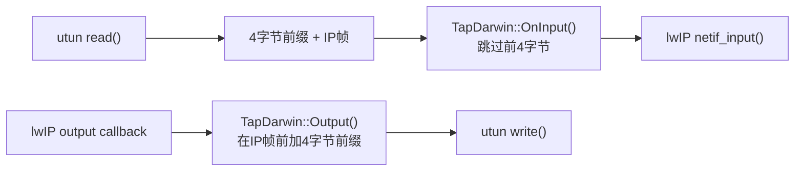
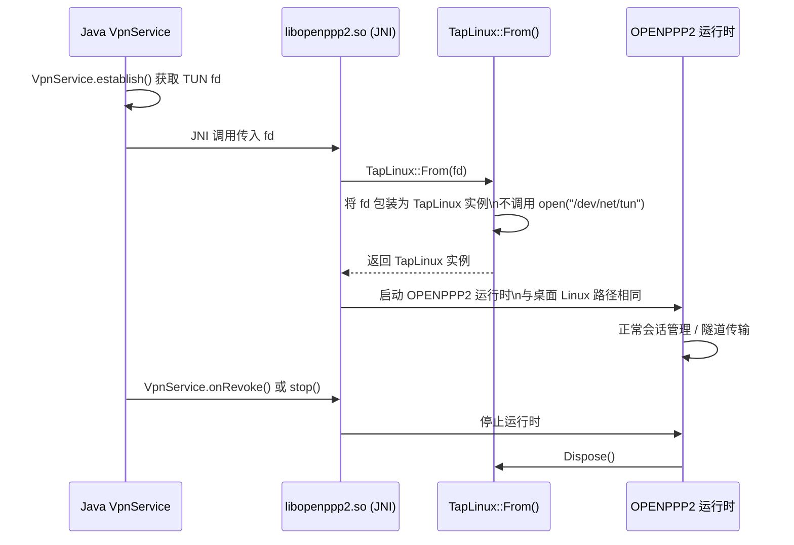
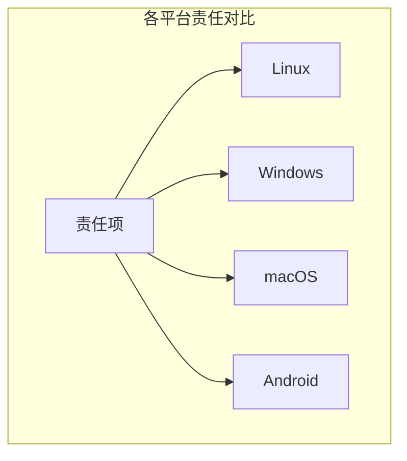
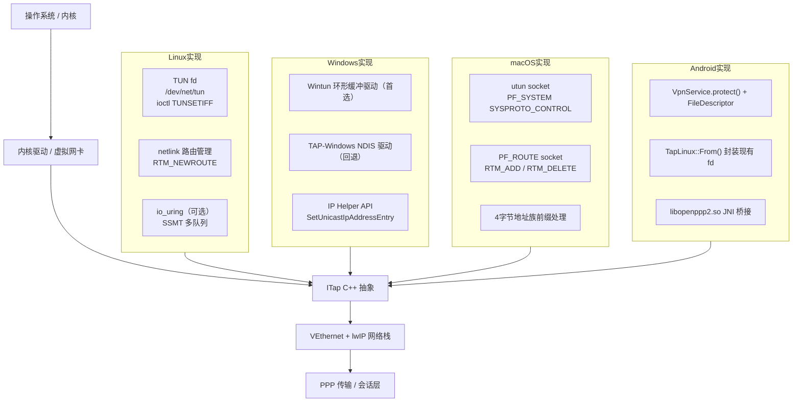

# 平台集成

[English Version](PLATFORMS.md)

## 1. 范围

本文解释 OPENPPP2 如何把共享运行时核心落到不同宿主网络模型上。目标是准确描述每个平台的集成机制、API 差异和已知限制，而不是笼统地说"支持多平台"。

---

## 2. 核心思想

共享核心（`ppp/` 目录）负责：配置、传输、握手、链路动作、路由策略和会话管理。

平台层（`linux/`、`windows/`、`darwin/`、`android/`）负责：虚拟接口创建、系统路由变更、DNS 配置、socket protect 和宿主 IPv6 行为。



---

## 3. 构建阶段拆分

根 `CMakeLists.txt` 按当前目标平台选择源文件集：

| 平台 | 源文件目录 | 构建方式 |
|------|-----------|----------|
| Windows | `windows/` | `build_windows.bat` + CMake + Ninja + vcpkg |
| Linux | `linux/` | CMake + Make / Ninja，三方库在 `/root/dev` |
| macOS | `darwin/` | CMake + Make（需 `-DCMAKE_POLICY_VERSION_MINIMUM=3.5`） |
| Android | `android/` + `linux/` | NDK CMake，独立 `CMakeLists.txt` |



**平台宏规则**（来自 `ppp/stdafx.h`）：

- `_WIN32` 对应 `WIN32`
- `_LINUX` 对应 `LINUX`
- `_MACOS` 对应 `MACOS`
- `_ANDROID` 对应 `ANDROID`
- `_HARMONYOS` 对应 `HARMONYOS`

**严禁**在 `ppp/` 共享代码中使用 `#ifdef __linux__` 或 `#ifdef _MSC_VER`。平台特定代码必须放在对应平台目录下，或使用上述宏守护。

---

## 4. 平台抽象层：ITap

### 4.1 设计概述

`ITap`（`ppp/tap/ITap.h`）是平台无关的虚拟网卡核心抽象。所有平台后端均继承自该接口。



### 4.2 工厂方法签名差异

`ITap::Create()` 在各平台的签名不同：

**Windows**（`windows/ppp/tap/TapWindows.h`）：
```cpp
/**
 * @brief 创建 Windows TAP/Wintun 虚拟网卡实例。
 * @param context              Boost.Asio io_context。
 * @param dev                  适配器名或 GUID。
 * @param ip                   虚拟接口 IP 地址（大端序）。
 * @param gw                   网关地址。
 * @param mask                 子网掩码。
 * @param lease_time_in_seconds DHCP 租约时间（Wintun 模式无效，TAP-Windows 使用）。
 * @return                     成功返回 TapWindows 实例；失败返回 NULLPTR。
 */
static std::shared_ptr<ITap> Create(
    const std::shared_ptr<boost::asio::io_context>& context,
    const ppp::string&                              dev,
    uint32_t                                        ip,
    uint32_t                                        gw,
    uint32_t                                        mask,
    int                                             lease_time_in_seconds) noexcept;
```

**Linux / macOS / Android**（`linux/ppp/tap/TapLinux.h`）：
```cpp
/**
 * @brief 创建 Linux TUN 虚拟网卡实例。
 * @param context  Boost.Asio io_context。
 * @param dev      TUN 接口名（如 "tun0"；空字符串由内核自动分配）。
 * @param ip       虚拟接口 IP 地址（大端序）。
 * @param gw       网关地址。
 * @param mask     子网掩码。
 * @param promisc  是否开启混杂模式（捕获所有帧）。
 * @return         成功返回 TapLinux 实例；失败返回 NULLPTR。
 */
static std::shared_ptr<ITap> Create(
    const std::shared_ptr<boost::asio::io_context>& context,
    const ppp::string&                              dev,
    uint32_t                                        ip,
    uint32_t                                        gw,
    uint32_t                                        mask,
    bool                                            promisc) noexcept;
```

---

## 5. Linux 平台：TapLinux

### 5.1 实现步骤

`TapLinux`（`linux/ppp/tap/TapLinux.h`）是 `final` 类，实现步骤如下：

1. **打开 TUN 设备**：`OpenDriver()` 调用 `open("/dev/net/tun", ...)` 并执行 `ioctl(TUNSETIFF)`，携带 `IFF_TUN | IFF_NO_PI` 标志。接口名来自 `dev` 参数或由内核自动分配。
2. **配置接口**：`SetIPAddress()` 使用 `SIOCSIFADDR`/`SIOCSIFNETMASK`；`SetMtu()` 使用 `SIOCSIFMTU`；`SetNetifUp()` 使用 `SIOCSIFFLAGS`。
3. **路由管理**：通过 `netlink(7)` 的 `RTM_NEWROUTE`/`RTM_DELROUTE` 消息完成，封装为 `AddRoute()`/`DeleteRoute()` 及批量变体。
4. **IPv6 支持**：`SetIPv6Address()`、`AddRoute6()`、`DeleteRoute6()`、`EnableIPv6NeighborProxy()`、`AddIPv6NeighborProxy()` 共同实现服务端 IPv6 透传所需的邻居发现代理管理。
5. **多队列 SSMT**：`Ssmt(context)` 通过 `TUNSETIFF` + `IFF_MULTI_QUEUE` 在同一 TUN 设备上打开额外文件描述符，注册为独立 `stream_descriptor`，实现每 IO 线程独立读路径。
6. **混杂模式**：`promisc_` 为 `true` 时，将接口置于 `IFF_PROMISC` 模式，捕获所有帧。

### 5.2 SSMT 多队列模型



SSMT 通过 `IFF_MULTI_QUEUE` 为每个 io_context 线程提供独立的文件描述符，避免多线程竞争同一 fd 的读操作。这在多核服务器上显著提升了 TAP I/O 吞吐量。

### 5.3 IPv6 邻居发现代理

服务端 IPv6 transit 功能依赖 Linux 内核的 NDP proxy：

```bash
# 内核参数（TapLinux 自动配置，无需手动执行）
sysctl -w net.ipv6.conf.tun0.proxy_ndp=1
ip -6 neigh add proxy fdff::2 dev eth0
```

`TapLinux::EnableIPv6NeighborProxy()` 和 `AddIPv6NeighborProxy()` 封装了这些操作，通过 `netlink` 发送 `RTM_NEWNEIGH` 消息完成代理条目注册。

### 5.4 关键 API

```cpp
/**
 * @brief 在多队列 TUN 设备上为指定 io_context 打开额外读路径。
 *
 * @param context  目标 io_context（应为线程专属）。
 * @return         成功返回 true；SSMT 不可用或 fd 打开失败返回 false。
 * @note           仅在 Linux 内核 ≥ 3.8（支持 IFF_MULTI_QUEUE）时有效。
 */
bool Ssmt(const std::shared_ptr<boost::asio::io_context>& context) noexcept;

/**
 * @brief 添加 IPv4 路由条目。
 *
 * @param address  目标网络地址（大端序）。
 * @param prefix   前缀长度（CIDR）。
 * @param gateway  下一跳网关地址（大端序）。
 * @return         成功返回 true；netlink 操作失败返回 false。
 */
bool AddRoute(uint32_t address, int prefix, uint32_t gateway) noexcept;

/**
 * @brief 包装现有 TUN fd（Android 专用）。
 *
 * 接收 VpnService 提供的 fd，不调用 open("/dev/net/tun")，
 * 直接将其包装为 TapLinux 实例。
 *
 * @param fd       VpnService.establish() 返回的文件描述符。
 * @return         成功返回 TapLinux 实例；无效 fd 返回 NULLPTR。
 */
static std::shared_ptr<TapLinux> From(int fd) noexcept;
```

---

## 6. Windows 平台：TapWindows

### 6.1 两种内核驱动后端

`TapWindows`（`windows/ppp/tap/TapWindows.h`）支持两种内核驱动后端：

| 后端 | 检测方式 | 优先级 | 优点 | 缺点 |
|------|---------|--------|------|------|
| **Wintun** | `IsWintun()` 返回 `true` | 首选 | 环形缓冲，吞吐最高，无 NDIS 开销 | 需要 Wintun DLL，需要管理员权限 |
| **TAP-Windows** | NDIS 中间驱动 | 回退 | 兼容性好，支持 DHCP MASQ | 性能低于 Wintun，需要驱动签名 |



### 6.2 关键操作

**驱动安装**（`TapWindows::InstallDriver()`）：

```
复制 tap.inf / tap.sys → 目标目录
SetupDiCreateDeviceInfo → 创建 NDIS 适配器设备节点
SetupDiCallClassInstaller(DIF_INSTALLDEVICE) → 安装驱动
读取 InstanceId 注册表键 → 获取 GUID
```

**接口配置**（`TapWindows::SetAddresses()`）：

使用 IP Helper API（`SetUnicastIpAddressEntry`、`CreateIpForwardEntry2`）设置虚拟接口的 IP/掩码/网关，而不是传统的 `ioctl`。

**DNS 配置**（`TapWindows::SetDnsAddresses()`）：

通过 `SetInterfaceDnsSettings` 或注册表写入虚拟接口的 DNS 服务器地址，然后调用 `DnsFlushResolverCache()` 刷新系统 DNS 缓存。

**Wintun 环形缓冲**：

```cpp
// 接收数据包
WINTUN_PACKET* packet = WintunReceivePacket(session_, &packet_size);
if (NULLPTR != packet) {
    // 处理 packet->Buffer[0..packet_size-1]
    WintunReleaseReceivePacket(session_, packet);
}

// 发送数据包
WINTUN_PACKET* send_packet = WintunAllocateSendPacket(session_, data_size);
if (NULLPTR != send_packet) {
    memcpy(send_packet->Buffer, data, data_size);
    WintunSendPacket(session_, send_packet);
}
```

### 6.3 初始化流程



### 6.4 Paper Airplane TCP 加速

Windows 平台上，`paper_airplane.tcp = true` 启用 TCP 加速路径。这通过 Windows 内核的 TCP 优化 API 降低 TCP 握手延迟，对某些高延迟链路有明显效果。配置在 `AppConfiguration.Loaded()` 中仅在 `_WIN32` 宏下保留。

---

## 7. macOS 平台：TapDarwin

### 7.1 实现机制

`TapDarwin`（`darwin/ppp/tap/TapDarwin.h`）是 `final` 类，基于 macOS `utun` 虚拟接口：

- **设备创建**：通过 `PF_SYSTEM` socket 连接 `com.apple.net.utun_control` 内核控制，自动获得 `utunN` 接口。无需 `open("/dev/net/tun")`。
- **路由管理**：`AddAllRoutes()`/`DeleteAllRoutes()` 通过 `PF_ROUTE` 原始 socket 发送 `RTM_ADD`/`RTM_DELETE` 消息，遵循 macOS 路由语义（与 Linux netlink 差异显著）。
- **接口枚举**：`GetAllNetworkInterfaces()` 遍历 `getifaddrs()` 结果，`GetPreferredNetworkInterface()` 按 metric 选择最优接口。
- **包帧处理**：`OnInput()` 覆盖基类，剥除 macOS utun 读出时额外的 4 字节地址族前缀，再将裸 IP 帧送入 lwIP 栈。
- **IPv6**：使用 BSD 风格 `SIOCDIFADDR_IN6`/`SIOCAIFADDR_IN6` ioctl 赋址，与 Linux netlink 路径完全不同。

### 7.2 macOS utun 帧格式差异

macOS utun 在读出的数据包前会附加 4 字节地址族前缀：

```
字节 0-3: 地址族（大端序，如 AF_INET = 0x00000002, AF_INET6 = 0x0000001E）
字节 4+: 裸 IP 帧（IPv4 或 IPv6）
```

`TapDarwin::OnInput()` 必须跳过前 4 字节才能得到正确的 IP 帧。同样，发送时也需要在 IP 帧前加上 4 字节前缀。这是与 Linux TUN 的主要帧格式差异。



---

## 8. Android 平台：JNI 桥接

### 8.1 集成流程

Android 对普通 App 不暴露原始 TUN 设备，集成流程如下：



### 8.2 JNI 导出宏约定

`android/libopenppp2.cpp` 中定义的宏：

```cpp
/// @brief 标记 JNI 导出函数为 extern "C" JNIEXPORT
#define __LIBOPENPPP2__(JNIType)  \
    extern "C" JNIEXPORT __unused JNIType JNICALL

/// @brief 获取单例应用上下文
#define __LIBOPENPPP2_MAIN__      \
    libopenppp2_application::GetDefault()
```

导出函数示例：

```cpp
/// @brief 启动 OPENPPP2 VPN 服务。
/// @param env    JNI 环境指针。
/// @param thiz   Java 对象引用。
/// @param fd     VpnService 文件描述符（来自 establish()）。
/// @param config 配置 JSON 字符串。
/// @return       启动成功返回 true；失败返回 false。
__LIBOPENPPP2__(jboolean) Java_com_xxx_libopenppp2_run(
    JNIEnv*  env,
    jobject  thiz,
    jint     fd,
    jstring  config) noexcept
{
    auto app = __LIBOPENPPP2_MAIN__;
    if (NULLPTR == app) {
        return JNI_FALSE;
    }
    return app->Run(fd, env->GetStringUTFChars(config, NULLPTR)) ? JNI_TRUE : JNI_FALSE;
}
```

### 8.3 Android 特有约束

| 约束 | 说明 |
|------|------|
| 最低 API 级别 | API 23（Android 6.0），不使用高于 API 23 且无运行时回退的特性 |
| 内存分配 | Android 系统默认使用 jemalloc，**应用层不再套一层 jemalloc** |
| socket protect | 必须通过 `VpnService.protect(socket_fd)` 保护 OPENPPP2 自身的控制 socket，防止隧道流量死循环 |
| TUN 设备 | 不直接打开 `/dev/net/tun`，必须使用 `TapLinux::From(fd)` 包装 VpnService 提供的 fd |
| 路由管理 | 依赖 Java 层通过 `VpnService.Builder` 配置路由，C++ 层不直接调用 netlink |
| DNS 配置 | 依赖 Java 层通过 `VpnService.Builder.addDnsServer()` 配置 DNS |
| NDK 版本 | 编译检测使用 NDK R20B（`D:\android\sdk\ndk\20.1.5948944`） |

---

## 9. 平台责任对比



| 责任 | Linux | Windows | macOS | Android |
|------|-------|---------|-------|---------|
| 虚拟接口创建 | `ioctl(TUNSETIFF)` on `/dev/net/tun` | Wintun API / TAP-Windows SetupDi | `PF_SYSTEM` socket `utun_control` | `TapLinux::From(fd)`（无需自创建） |
| IP 地址配置 | `SIOCSIFADDR` ioctl | IP Helper `SetUnicastIpAddressEntry` | `SIOCAIFADDR` BSD ioctl | Java `VpnService.Builder.addAddress()` |
| 路由添加/删除 | `netlink RTM_NEWROUTE` / `RTM_DELROUTE` | IP Helper `CreateIpForwardEntry2` | `PF_ROUTE RTM_ADD` / `RTM_DELETE` | Java `VpnService.Builder.addRoute()` |
| DNS 配置 | `/etc/resolv.conf` 或 `systemd-resolved` | `SetInterfaceDnsSettings` + `DnsFlushResolverCache` | `scutil --dns` / `/etc/resolv.conf` | Java `VpnService.Builder.addDnsServer()` |
| Socket protect | `SO_BINDTODEVICE` | `protect_system` WFP 过滤 | `SO_BINDTODEVICE` | `VpnService.protect(fd)` |
| IPv6 邻居代理 | `netlink RTM_NEWNEIGH` (NDP proxy) | 不支持（server IPv6 仅 Linux） | BSD `SIOCAIFADDR_IN6` | 继承 Linux 路径 |
| 多队列 TAP | `IFF_MULTI_QUEUE` SSMT | Wintun 环形缓冲（内置并发） | 不支持（单队列） | 不适用（单 fd） |

---

## 10. 平台特化实现的层次结构



---

## 11. 平台错误码参考

| ErrorCode | 描述 |
|-----------|------|
| `TapDeviceOpenFailed` | 无法打开 TAP/TUN 设备（驱动未安装或权限不足） |
| `TapDeviceConfigFailed` | 虚拟接口 IP/掩码/MTU 配置失败 |
| `RouteAddFailed` | 系统路由添加失败 |
| `RouteDeleteFailed` | 系统路由删除失败 |
| `DnsConfigFailed` | DNS 服务器配置失败 |
| `WintunLoadFailed` | Windows：Wintun DLL 加载失败（回退到 TAP-Windows） |
| `DriverInstallFailed` | Windows：TAP 驱动安装失败（需要管理员权限） |
| `UtunOpenFailed` | macOS：utun 设备创建失败 |
| `JniBridgeInitFailed` | Android：JNI 桥接初始化失败 |
| `SocketProtectFailed` | Android：`VpnService.protect()` 失败 |

---

## 12. 运行时效果

平台层改变的是可观测的宿主行为：

- 创建虚拟网卡后，系统路由表发生变化（本地流量通过隧道转发）
- DNS 服务器变更后，应用层域名解析走隧道内的 DNS
- Socket protect 后，OPENPPP2 自身的控制连接不进入隧道

这些变更必须在会话结束时被精确回滚。`ITap::Dispose()` 不只是关闭文件描述符，它还触发：

1. 路由条目删除（`DeleteRoute()` / `DeleteRoute6()`）
2. DNS 配置恢复（`SetDnsAddresses()` 写入原始 DNS）
3. DNS 缓存刷新（Windows：`DnsFlushResolverCache()`）
4. 接口 down（`SIOCSIFFLAGS` 清除 `IFF_UP`）
5. 文件描述符关闭（关联的 `stream_descriptor` 销毁）

---

## 相关文档

- [`ARCHITECTURE_CN.md`](ARCHITECTURE_CN.md) — 系统架构总览
- [`DEPLOYMENT_CN.md`](DEPLOYMENT_CN.md) — 各平台部署指南
- [`OPERATIONS_CN.md`](OPERATIONS_CN.md) — 运维操作指南
- [`STARTUP_AND_LIFECYCLE_CN.md`](STARTUP_AND_LIFECYCLE_CN.md) — 启动与生命周期管理
- [`IPV6_TRANSIT_PLANE_CN.md`](IPV6_TRANSIT_PLANE_CN.md) — Linux IPv6 数据面详解
