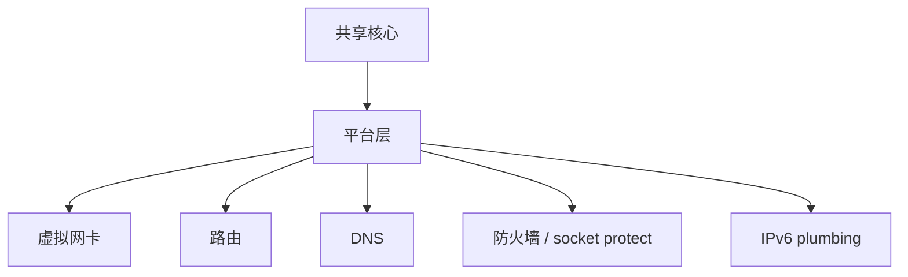
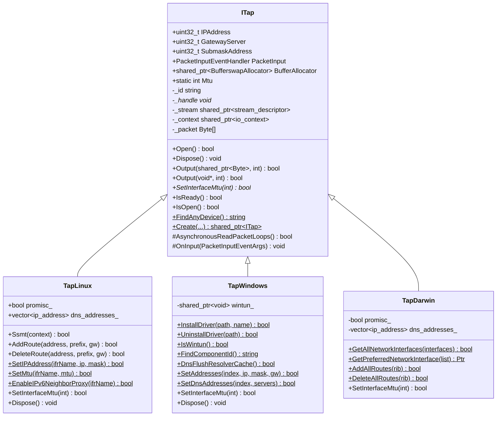
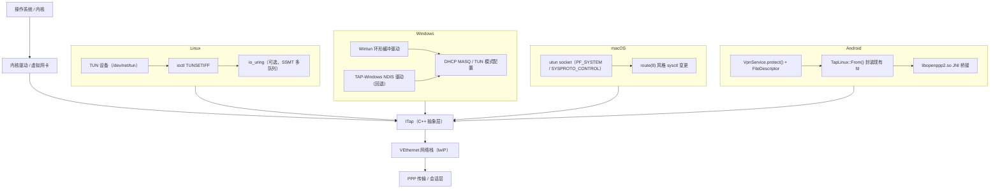

# 平台集成

[English Version](PLATFORMS.md)

## 范围

本文解释 OPENPPP2 如何把共享运行时核心落到不同宿主网络模型上。

## 核心思想

共享核心负责配置、传输、握手、链路动作、路由策略和会话管理。平台层负责虚拟接口、路由、DNS、socket protect 和宿主 IPv6 行为。

## 构建阶段拆分

根构建会选择平台源集：

- Windows: `windows/*`
- Linux: `linux/*`
- macOS: `darwin/*`
- Android: 通过独立 `CMakeLists.txt` 构建 `android/*`

## 为什么显式保留平台代码

因为虚拟接口、路由、DNS 和 IPv6 的宿主行为在不同操作系统里并不一样，不能靠一个假的统一抽象完全掩盖。

平台层不是“脏代码”，它是 runtime 的一部分。

## Windows

Windows 侧有多条宿主集成路径：

- Wintun（可用时）
- TAP-Windows 回退
- 基于 WMI 的接口配置
- 基于 IP Helper 的路由 API
- DNS cache flush
- 可选 proxy 和 QUIC 相关行为

Windows 还包含对系统 proxy 和特定工作集优化的处理。

## Linux

Linux 使用 native tun/tap 和 Linux 特化的 IPv6、protect 辅助能力。

Linux 还是 server-side IPv6 data plane 最完整的目标平台。

## macOS

macOS 使用 utun/TAP 风格集成，以及平台特化的路由和 IPv6 辅助。

这里的关键是尊重 macOS 的系统语义，而不是把它当成“类 Linux”。

## Android

Android 作为 shared library 构建，依赖宿主 app 和 JNI glue 进入 VPN 风格集成。

因此它更像嵌入式运行时，而不是独立桌面进程。

## 平台责任图



## 责任映射

| 责任 | 为什么是平台特化 |
|---|---|
| 适配器创建 | OS API 不同 |
| 路由变更 | 路由表和权限不同 |
| DNS 变更 | 系统 DNS 机制不同 |
| socket protect | 平台安全 plumbing 不同 |
| IPv6 plumbing | 地址和 neighbor 处理不同 |

## 运行时效果

平台层改变的是可观测的宿主行为，所以它必须被当作运行时本身的一部分，而不是普通辅助 glue。

---

## 平台抽象层（ITap）

### 设计概述

`ITap`（`ppp/tap/ITap.h`）是平台无关的虚拟网卡核心抽象。所有平台后端均继承自该接口，封装以下能力：

- **设备生命周期**：基于 native 句柄构造、`Open()`、`Dispose()`。
- **数据包收发**：异步读循环（`AsynchronousReadPacketLoops`）、入站事件回调（`PacketInputEventHandler`）、两个 `Output()` 重载（共享缓冲区或裸指针）。
- **地址元数据**：`IPAddress`、`GatewayServer`、`SubmaskAddress` 以 `uint32_t` 常量存储。
- **工厂方法**：静态 `ITap::Create()` 重载，Windows 签名额外携带 `lease_time_in_seconds`，POSIX 签名携带 `promisc` 标志。
- **MTU 管理**：纯虚函数 `SetInterfaceMtu(int mtu)` 由各平台实现。

基类持有 `boost::asio::posix::stream_descriptor`（`_stream`）和 MTU 大小的复用读缓冲区（`_packet[ITap::Mtu]`）。异步读写通过 `_context`（Boost.Asio `io_context`）调度。



> **Android 说明**：Android 直接使用 `TapLinux`。`TapLinux::From()` 静态工厂（通过 `#if defined(_ANDROID)` 守护）接收 Android `VpnService` 提供的现有 TUN 文件描述符，无需自行打开 `/dev/tun`。

---

## 平台特化实现细节

### 平台层次结构



### Linux：TapLinux

`TapLinux`（`linux/ppp/tap/TapLinux.h`）是 `final` 类，实现步骤如下：

1. **打开 TUN 设备**：`OpenDriver()` 调用 `open("/dev/net/tun", ...)` 并执行 `ioctl(TUNSETIFF)`，携带 `IFF_TUN | IFF_NO_PI` 标志。接口名（如 `tun0`）来自 `dev` 参数或由内核自动分配。
2. **配置接口**：`SetIPAddress()` 使用 `SIOCSIFADDR`/`SIOCSIFNETMASK`；`SetMtu()` 使用 `SIOCSIFMTU`；`SetNetifUp()` 使用 `SIOCSIFFLAGS`。
3. **路由管理**：通过 `netlink(7)` 的 `RTM_NEWROUTE`/`RTM_DELROUTE` 消息完成，封装为 `AddRoute()`/`DeleteRoute()` 及批量变体。
4. **IPv6 支持**：`SetIPv6Address()`、`AddRoute6()`、`DeleteRoute6()`、`EnableIPv6NeighborProxy()`、`AddIPv6NeighborProxy()` 共同实现服务端 IPv6 透传所需的邻居发现代理管理。
5. **多队列 SSMT**：`Ssmt(context)` 通过 `TUNSETIFF` + `IFF_MULTI_QUEUE` 在同一 TUN 设备上打开额外文件描述符，并注册为独立 `stream_descriptor`，实现每 IO 线程独立读路径。
6. **混杂模式**：`promisc_` 为 `true` 时，将接口置于 `IFF_PROMISC` 模式，捕获所有帧。

### Windows：TapWindows

`TapWindows`（`windows/ppp/tap/TapWindows.h`）是 `final` 类，支持两种内核驱动后端：

| 后端 | 检测方式 | 说明 |
|---|---|---|
| **Wintun** | `IsWintun()` 返回 `true` | 环形缓冲，性能最高，需要 Wintun DLL |
| **TAP-Windows** | NDIS 中间驱动 | 传统回退方案；支持 DHCP MASQ 或 TUN 模式 |

关键操作：

- **驱动安装**：`InstallDriver()` 复制驱动文件并调用 `SetupDi` API 安装 NDIS 适配器；`UninstallDriver()` 卸载。
- **Component ID 查找**：`FindComponentId()` 扫描注册表 `HKLM\SYSTEM\CurrentControlSet\Control\Class\{4D36E972...}` 定位适配器 GUID。
- **接口配置**：`SetAddresses()` 使用 IP Helper API（`SetUnicastIpAddressEntry`）设置 IP/掩码/网关；`SetDnsAddresses()` 通过同一路径写入 DNS。
- **Wintun 环形缓冲**：激活时 `wintun_` 持有 `WINTUN_ADAPTER_HANDLE`，读写通过 `WintunReceivePacket`/`WintunSendPacket` 完成。
- **DNS 刷新**：`DnsFlushResolverCache()` 在 DNS 服务器变更后调用 Win32 同名 API 刷新系统 DNS 缓存。

应用启动时，`ApplicationInitialize.cpp` 中的 `Windows_PreparedEthernetEnvironment()` 确保 Component ID 存在；若找不到适配器，自动调用 `InstallDriver()`。

### macOS：TapDarwin

`TapDarwin`（`darwin/ppp/tap/TapDarwin.h`）是 `final` 类，基于 macOS `utun` 虚拟接口：

- **设备创建**：通过 `PF_SYSTEM` socket 连接 `com.apple.net.utun_control` 内核控制，自动获得 `utunN` 接口。
- **路由管理**：`AddAllRoutes()`/`DeleteAllRoutes()` 通过 `PF_ROUTE` 原始 socket 发送 `RTM_ADD`/`RTM_DELETE` 消息，遵循 macOS 路由语义（与 Linux netlink 差异显著）。
- **接口枚举**：`GetAllNetworkInterfaces()` 遍历 `getifaddrs()` 结果，`GetPreferredNetworkInterface()` 按 metric 选择最优接口。
- **包帧处理**：`OnInput()` 覆盖基类，剥除 macOS utun 读出时额外的 4 字节地址族前缀，再将裸 IP 帧送入 lwIP 栈。
- **IPv6**：使用 BSD 风格 `SIOCDIFADDR_IN6`/`SIOCAIFADDR_IN6` ioctl 赋址，与 Linux netlink 路径完全不同。

### Android：JNI 桥接（libopenppp2.so）

Android 对普通 App 不暴露原始 TUN 设备，集成流程如下：

1. 宿主 App 调用 `VpnService.establish()` 获取内核已配置好的 TUN `ParcelFileDescriptor`。
2. 通过 JNI 将文件描述符传入 `libopenppp2.so`（导出函数以 `__LIBOPENPPP2__` 宏标注，即 `extern "C" JNIEXPORT`）。
3. 库内部 `TapLinux::From()` 把裸 fd 包装为 `TapLinux` 实例，不再自行打开 `/dev/net/tun`。
4. 后续运行时与 Linux 桌面路径完全一致，使用相同的 `TapLinux` 读循环和路由管理。

JNI 宏约定（`android/libopenppp2.cpp`）：

```cpp
// 标记 JNI 导出函数
#define __LIBOPENPPP2__(JNIType)  extern "C" JNIEXPORT __unused JNIType JNICALL

// 获取单例应用上下文
#define __LIBOPENPPP2_MAIN__      libopenppp2_application::GetDefault()
```

JNI 层的 `run`/`stop`/release 生命周期与核心保持一致语义，确保 Java 层与 C++ 层诊断状态同步（详见 `STARTUP_AND_LIFECYCLE_CN.md`）。

---

## 相关文档

- `ARCHITECTURE_CN.md`
- `DEPLOYMENT_CN.md`
- `OPERATIONS_CN.md`
