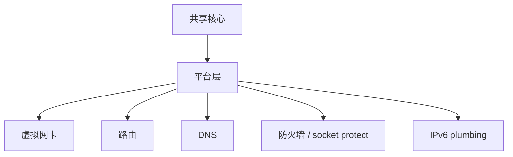

# 平台集成

[English Version](PLATFORMS.md)

## 范围

本文解释 OPENPPP2 如何把共享运行时核心落到不同宿主网络模型上。

## 核心思想

共享核心负责配置、传输、握手、链路动作、路由策略和会话管理。平台层负责虚拟接口、路由、DNS、socket protect 和宿主 IPv6 行为。

## 构建阶段拆分

根构建会选择平台源集：

- Windows: `windows/*`
- Linux: `linux/*`
- macOS: `darwin/*`
- Android: 通过独立 `CMakeLists.txt` 构建 `android/*`

## 为什么显式保留平台代码

因为虚拟接口、路由、DNS 和 IPv6 的宿主行为在不同操作系统里并不一样，不能靠一个假的统一抽象完全掩盖。

平台层不是“脏代码”，它是 runtime 的一部分。

## Windows

Windows 侧有多条宿主集成路径：

- Wintun（可用时）
- TAP-Windows 回退
- 基于 WMI 的接口配置
- 基于 IP Helper 的路由 API
- DNS cache flush
- 可选 proxy 和 QUIC 相关行为

Windows 还包含对系统 proxy 和特定工作集优化的处理。

## Linux

Linux 使用 native tun/tap 和 Linux 特化的 IPv6、protect 辅助能力。

Linux 还是 server-side IPv6 data plane 最完整的目标平台。

## macOS

macOS 使用 utun/TAP 风格集成，以及平台特化的路由和 IPv6 辅助。

这里的关键是尊重 macOS 的系统语义，而不是把它当成“类 Linux”。

## Android

Android 作为 shared library 构建，依赖宿主 app 和 JNI glue 进入 VPN 风格集成。

因此它更像嵌入式运行时，而不是独立桌面进程。

## 平台责任图

## 责任映射

| 责任 | 为什么是平台特化 |
|---|---|
| 适配器创建 | OS API 不同 |
| 路由变更 | 路由表和权限不同 |
| DNS 变更 | 系统 DNS 机制不同 |
| socket protect | 平台安全 plumbing 不同 |
| IPv6 plumbing | 地址和 neighbor 处理不同 |

## 运行时效果

平台层改变的是可观测的宿主行为，所以它必须被当作运行时本身的一部分，而不是普通辅助 glue。

## 相关文档

- `ARCHITECTURE_CN.md`
- `DEPLOYMENT_CN.md`
- `OPERATIONS_CN.md`
